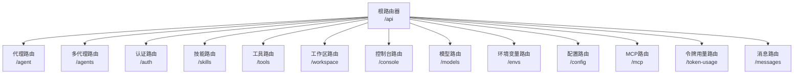
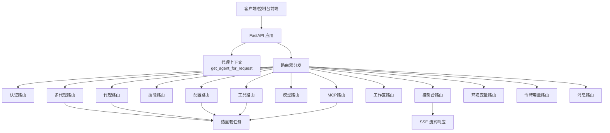
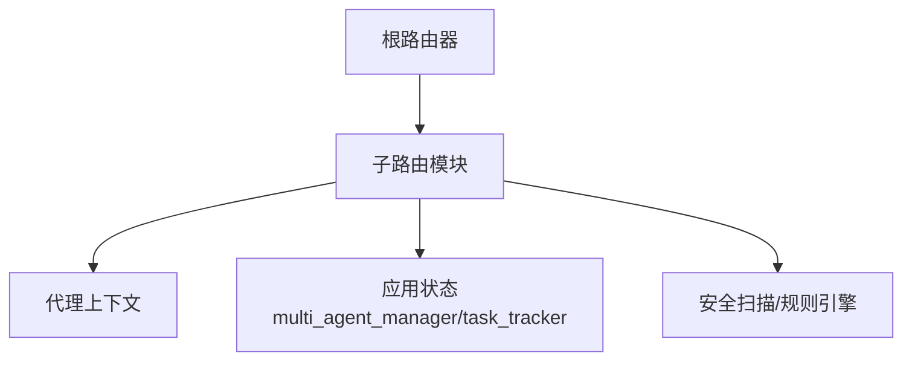

# API接口文档

<cite>
**本文档引用的文件**
- [src/copaw/app/routers/__init__.py](file://src/copaw/app/routers/__init__.py)
- [src/copaw/app/routers/agent.py](file://src/copaw/app/routers/agent.py)
- [src/copaw/app/routers/agents.py](file://src/copaw/app/routers/agents.py)
- [src/copaw/app/routers/auth.py](file://src/copaw/app/routers/auth.py)
- [src/copaw/app/routers/skills.py](file://src/copaw/app/routers/skills.py)
- [src/copaw/app/routers/tools.py](file://src/copaw/app/routers/tools.py)
- [src/copaw/app/routers/workspace.py](file://src/copaw/app/routers/workspace.py)
- [src/copaw/app/routers/console.py](file://src/copaw/app/routers/console.py)
- [src/copaw/app/routers/providers.py](file://src/copaw/app/routers/providers.py)
- [src/copaw/app/routers/envs.py](file://src/copaw/app/routers/envs.py)
- [src/copaw/app/routers/config.py](file://src/copaw/app/routers/config.py)
- [src/copaw/app/routers/mcp.py](file://src/copaw/app/routers/mcp.py)
- [src/copaw/app/routers/token_usage.py](file://src/copaw/app/routers/token_usage.py)
- [src/copaw/app/routers/messages.py](file://src/copaw/app/routers/messages.py)
</cite>

## 目录
1. [简介](#简介)
2. [项目结构](#项目结构)
3. [核心组件](#核心组件)
4. [架构总览](#架构总览)
5. [详细组件分析](#详细组件分析)
6. [依赖关系分析](#依赖关系分析)
7. [性能考虑](#性能考虑)
8. [故障排除指南](#故障排除指南)
9. [结论](#结论)
10. [附录](#附录)

## 简介
本文件为 CoPaw 的全面 API 接口文档，覆盖 RESTful API 与 WebSocket 实时交互（SSE）能力。内容包括：
- 认证与授权：登录、注册、令牌校验与更新
- 代理管理：多代理创建、查询、更新、删除与热重载
- 技能管理：内置/自定义技能的启用/禁用、批量操作、从 Hub 安装、上传 ZIP 导入与安全扫描
- 工具管理：内置工具开关与热重载
- 渠道管理：通道配置的查询与更新、心跳配置、用户时区设置、安全策略（工具守卫、文件守卫、技能扫描白名单）
- 提供商与模型：提供商列表、配置、连接测试、模型发现、活动模型设置
- 控制台与聊天：SSE 流式聊天、停止会话、文件上传与下载
- 工作空间：工作区打包下载与 ZIP 合并上传
- 环境变量：批量保存与删除
- MCP 客户端：本地/远程 MCP 服务配置与启停
- 令牌用量：按日期/模型/提供商聚合统计
- 消息发送：跨通道主动推送消息

## 项目结构
CoPaw 使用 FastAPI 构建 REST API，并通过统一路由器集中挂载各模块路由。核心组织方式如下：
- 根路由器集中挂载所有子模块路由
- 每个功能域独立路由模块（如 agent、agents、auth、skills、tools、workspace、console、providers、envs、config、mcp、token_usage、messages）
- 路由器前缀统一标识资源域，标签用于 OpenAPI 分类

图表来源
- [src/copaw/app/routers/__init__.py](file://src/copaw/app/routers/__init__.py)

章节来源
- [src/copaw/app/routers/__init__.py](file://src/copaw/app/routers/__init__.py)

## 核心组件
- 路由器注册：根路由器集中 include 各子路由，支持在 /agents/{agentId}/ 下创建代理作用域路由
- 请求上下文：通过请求对象访问应用状态（如多代理管理器、任务跟踪器），并注入代理上下文
- 错误处理：统一使用 HTTP 异常返回标准错误码与消息；部分场景返回结构化错误体（如技能扫描失败）
- 热重载：对配置变更（代理运行参数、通道、工具、MCP、心跳等）采用后台异步任务触发重载，避免阻塞请求

章节来源
- [src/copaw/app/routers/__init__.py](file://src/copaw/app/routers/__init__.py)
- [src/copaw/app/routers/agent.py](file://src/copaw/app/routers/agent.py)
- [src/copaw/app/routers/agents.py](file://src/copaw/app/routers/agents.py)
- [src/copaw/app/routers/config.py](file://src/copaw/app/routers/config.py)
- [src/copaw/app/routers/mcp.py](file://src/copaw/app/routers/mcp.py)

## 架构总览
CoPaw 的 API 层负责接收请求、解析上下文、调用业务层（代理、通道、提供商、技能、工具等）并返回结果。WebSocket（SSE）用于控制台流式对话。

图表来源
- [src/copaw/app/routers/__init__.py](file://src/copaw/app/routers/__init__.py)
- [src/copaw/app/routers/console.py](file://src/copaw/app/routers/console.py)
- [src/copaw/app/routers/agents.py](file://src/copaw/app/routers/agents.py)
- [src/copaw/app/routers/agent.py](file://src/copaw/app/routers/agent.py)
- [src/copaw/app/routers/config.py](file://src/copaw/app/routers/config.py)
- [src/copaw/app/routers/tools.py](file://src/copaw/app/routers/tools.py)
- [src/copaw/app/routers/mcp.py](file://src/copaw/app/routers/mcp.py)

## 详细组件分析

### 认证与授权
- 登录：POST /api/auth/login，用户名密码换取 JWT
- 注册：POST /api/auth/register，单次允许注册，需开启认证
- 状态：GET /api/auth/status，检查是否启用认证及是否存在用户
- 验证：GET /api/auth/verify，校验 Bearer 令牌有效性
- 更新资料：POST /api/auth/update-profile，当前密码校验后更新用户名或密码

请求/响应要点
- 成功返回包含 token 与用户名；失败返回 4xx 错误
- 令牌过期或无效返回 401

章节来源
- [src/copaw/app/routers/auth.py](file://src/copaw/app/routers/auth.py)

### 多代理管理
- 列表：GET /api/agents，返回代理概要列表
- 查询：GET /api/agents/{agentId}，返回完整代理配置
- 创建：POST /api/agents，自动分配短 ID，初始化工作区与默认文件
- 更新：PUT /api/agents/{agentId}，合并更新字段并触发热重载
- 删除：DELETE /api/agents/{agentId}，停止实例并移除配置（不可删除 default）
- 文件列表：GET /api/agents/{agentId}/files
- 文件读取：GET /api/agents/{agentId}/files/{filename}
- 文件写入：PUT /api/agents/{agentId}/files/{filename}
- 内存文件：GET /api/agents/{agentId}/memory

请求/响应要点
- 创建成功返回代理引用（含工作区路径）
- 更新采用“仅更新显式传入字段”的合并策略
- 删除不级联删除工作区目录，确保数据安全

章节来源
- [src/copaw/app/routers/agents.py](file://src/copaw/app/routers/agents.py)

### 代理运行参数与文件系统
- 工作文件：GET/PUT /api/agent/files/{md_name}
- 内存文件：GET/PUT /api/agent/memory/{md_name}
- 语言设置：GET/PUT /api/agent/language
- 音频模式：GET/PUT /api/agent/audio-mode
- 语音转写：GET/PUT /api/agent/transcription-provider-type
- 本地 Whisper 可用性：GET /api/agent/local-whisper-status
- 可用转写提供商：GET /api/agent/transcription-providers
- 设置转写提供商：PUT /api/agent/transcription-provider
- 运行配置：GET/PUT /api/agent/running-config
- 系统提示文件：GET/PUT /api/agent/system-prompt-files

请求/响应要点
- 语言设置支持 zh/en/ru；切换语言可复制对应语言包文件
- 音频模式支持 auto/native；转写提供商支持 disabled/whisper_api/local_whisper
- 运行配置与系统提示文件变更均触发后台热重载

章节来源
- [src/copaw/app/routers/agent.py](file://src/copaw/app/routers/agent.py)

### 技能管理
- 列表：GET /api/skills，返回技能清单（含启用状态）
- 可用技能：GET /api/skills/available
- Hub 搜索：GET /api/skills/hub/search?q=&limit=
- Hub 安装（同步）：POST /api/skills/hub/install
- Hub 安装（异步任务）：POST /api/skills/hub/install/start
- 安装状态：GET /api/skills/hub/install/status/{task_id}
- 取消安装：POST /api/skills/hub/install/cancel/{task_id}
- ZIP 上传导入：POST /api/skills/upload
- 批量启用：POST /api/skills/batch-enable
- 批量禁用：POST /api/skills/batch-disable
- 创建技能：POST /api/skills
- 启用技能：POST /api/skills/{skill_name}/enable
- 禁用技能：POST /api/skills/{skill_name}/disable
- 删除技能：DELETE /api/skills/{skill_name}
- 技能文件读取：GET /api/skills/{skill_name}/files/{source}/{file_path}

安全与错误
- 安装/启用前进行安全扫描，失败返回 422 并包含扫描结果详情
- ZIP 上传限制最大 100MB，类型必须为 zip

章节来源
- [src/copaw/app/routers/skills.py](file://src/copaw/app/routers/skills.py)

### 工具管理
- 列表：GET /api/tools，返回内置工具及其启用状态
- 切换：PATCH /api/tools/{tool_name}/toggle，立即切换并触发热重载

章节来源
- [src/copaw/app/routers/tools.py](file://src/copaw/app/routers/tools.py)

### 渠道与配置
- 渠道列表：GET /api/config/channels
- 渠道类型：GET /api/config/channels/types
- 批量更新渠道：PUT /api/config/channels
- 获取指定渠道：GET /api/config/channels/{channel_name}
- 更新指定渠道：PUT /api/config/channels/{channel_name}
- 心跳配置：GET/PUT /api/config/heartbeat
- 用户时区：GET/PUT /api/config/user-timezone
- 工具守卫：GET/PUT /api/config/security/tool-guard
- 内置规则：GET /api/config/security/tool-guard/builtin-rules
- 文件守卫：GET/PUT /api/config/security/file-guard
- 技能扫描：GET/PUT /api/config/security/skill-scanner
- 扫描历史：GET /api/config/security/skill-scanner/blocked-history
- 清空扫描历史：DELETE /api/config/security/skill-scanner/blocked-history
- 删除扫描历史条目：DELETE /api/config/security/skill-scanner/blocked-history/{index}
- 白名单：POST /api/config/security/skill-scanner/whitelist
- 移除白名单：DELETE /api/config/security/skill-scanner/whitelist/{skill_name}
- 代理 LLM 路由：GET/PUT /api/config/agents/llm-routing

章节来源
- [src/copaw/app/routers/config.py](file://src/copaw/app/routers/config.py)

### 提供商与模型
- 列表：GET /api/models
- 配置：PUT /api/models/{provider_id}/config
- 自定义提供商：POST /api/models/custom-providers
- 连接测试：POST /api/models/{provider_id}/test
- 发现模型：POST /api/models/{provider_id}/discover
- 测试模型：POST /api/models/{provider_id}/models/test
- 添加模型：POST /api/models/{provider_id}/models
- 探测多模态：POST /api/models/{provider_id}/models/{model_id:path}/probe-multimodal
- 删除模型：DELETE /api/models/{provider_id}/models/{model_id:path}
- 删除自定义提供商：DELETE /api/models/custom-providers/{provider_id}
- 当前活动模型：GET /api/models/active
- 设置活动模型：PUT /api/models/active

章节来源
- [src/copaw/app/routers/providers.py](file://src/copaw/app/routers/providers.py)

### MCP 客户端管理
- 列表：GET /api/mcp
- 获取：GET /api/mcp/{client_key}
- 创建：POST /api/mcp
- 更新：PUT /api/mcp/{client_key}
- 切换启用：PATCH /api/mcp/{client_key}/toggle
- 删除：DELETE /api/mcp/{client_key}

章节来源
- [src/copaw/app/routers/mcp.py](file://src/copaw/app/routers/mcp.py)

### 工作区
- 下载：GET /api/workspace/download，返回工作区 ZIP 流
- 上传：POST /api/workspace/upload，校验 ZIP 并合并到工作区

章节来源
- [src/copaw/app/routers/workspace.py](file://src/copaw/app/routers/workspace.py)

### 控制台与聊天（SSE）
- 聊天（流式）：POST /api/console/chat，SSE 流式返回事件
- 停止：POST /api/console/chat/stop
- 上传附件：POST /api/console/upload
- 下载附件：GET /api/console/files/{agent_id}/{filename}
- 推送消息：GET /api/console/push-messages

SSE 事件流
- 客户端断开后可通过 reconnect=true 重新连接
- 服务器异常时返回包含 error 字段的事件

章节来源
- [src/copaw/app/routers/console.py](file://src/copaw/app/routers/console.py)

### 环境变量
- 列表：GET /api/envs
- 批量保存：PUT /api/envs
- 删除：DELETE /api/envs/{key}

章节来源
- [src/copaw/app/routers/envs.py](file://src/copaw/app/routers/envs.py)

### 令牌用量
- 统计：GET /api/token-usage，支持按日期范围、模型、提供商过滤

章节来源
- [src/copaw/app/routers/token_usage.py](file://src/copaw/app/routers/token_usage.py)

### 主动消息发送
- 发送：POST /api/messages/send，需要 X-Agent-Id 头部标识调用方代理

章节来源
- [src/copaw/app/routers/messages.py](file://src/copaw/app/routers/messages.py)

## 依赖关系分析
- 路由器依赖：根路由器集中引入各子路由，形成统一入口
- 上下文依赖：多数路由依赖代理上下文（get_agent_for_request）以确定当前工作区与配置
- 状态依赖：多处路由依赖应用状态中的多代理管理器与任务跟踪器，用于热重载与流式会话管理
- 安全依赖：技能管理与工具启用涉及安全扫描与规则引擎，配置变更会触发规则重载

图表来源
- [src/copaw/app/routers/__init__.py](file://src/copaw/app/routers/__init__.py)
- [src/copaw/app/routers/skills.py](file://src/copaw/app/routers/skills.py)
- [src/copaw/app/routers/tools.py](file://src/copaw/app/routers/tools.py)
- [src/copaw/app/routers/config.py](file://src/copaw/app/routers/config.py)

章节来源
- [src/copaw/app/routers/__init__.py](file://src/copaw/app/routers/__init__.py)
- [src/copaw/app/routers/skills.py](file://src/copaw/app/routers/skills.py)
- [src/copaw/app/routers/tools.py](file://src/copaw/app/routers/tools.py)
- [src/copaw/app/routers/config.py](file://src/copaw/app/routers/config.py)

## 性能考虑
- 流式响应：控制台聊天使用 SSE，避免一次性大响应导致内存压力
- 异步热重载：配置变更通过后台任务触发，避免阻塞请求
- ZIP 操作：工作区下载/上传采用内存缓冲与异步线程，限制最大大小并进行路径校验
- 缓存与会话：任务跟踪器维护会话队列，支持断线重连
- 模型探测：多模态探测采用轻量请求，避免影响主流程

## 故障排除指南
- 认证相关
  - 未启用认证时，注册/更新资料接口返回 403
  - 令牌缺失或过期返回 401
- 技能与工具
  - 安全扫描失败返回 422，包含严重级别与具体发现
  - 启用/禁用失败时检查扫描结果与权限
- 工作区
  - 上传 ZIP 非法或包含危险路径返回 400
  - 解压合并失败返回 500
- 渠道与配置
  - 通道不存在返回 404
  - 心跳配置更新后异步重调度，若失败查看日志
- 消息发送
  - 代理不存在返回 404
  - 通道未初始化返回 500
  - 发送异常返回 500

章节来源
- [src/copaw/app/routers/auth.py](file://src/copaw/app/routers/auth.py)
- [src/copaw/app/routers/skills.py](file://src/copaw/app/routers/skills.py)
- [src/copaw/app/routers/workspace.py](file://src/copaw/app/routers/workspace.py)
- [src/copaw/app/routers/config.py](file://src/copaw/app/routers/config.py)
- [src/copaw/app/routers/messages.py](file://src/copaw/app/routers/messages.py)

## 结论
CoPaw 的 API 设计遵循 RESTful 规范，结合 SSE 实现实时交互；通过代理上下文与应用状态实现灵活的配置管理与热重载机制。安全方面在技能与工具启用环节引入扫描与规则引擎，保障运行安全。建议在生产环境中配合鉴权、限流与监控策略使用。

## 附录

### 版本与兼容性
- 版本信息：项目包含版本常量与发布说明，可用于追踪版本演进
- 兼容性：配置变更与热重载尽量保持向后兼容，但升级时请参考发布说明

章节来源
- [src/copaw/__version__.py](file://src/copaw/__version__.py)
- [website/public/release-notes/](file://website/public/release-notes/)

### 安全与合规
- 认证：支持注册与令牌校验，建议在生产环境强制开启认证
- 机密信息：MCP 环境变量值在响应中进行掩码处理
- 文件上传：严格校验 ZIP 类型与大小，防止路径穿越

章节来源
- [src/copaw/app/routers/mcp.py](file://src/copaw/app/routers/mcp.py)
- [src/copaw/app/routers/workspace.py](file://src/copaw/app/routers/workspace.py)

### 调试与监控
- 日志：关键路径记录 INFO/WARNING/ERROR 级别日志
- SSE：客户端可断线重连，便于调试长连接
- 令牌用量：提供聚合统计接口，便于成本与用量监控

章节来源
- [src/copaw/app/routers/console.py](file://src/copaw/app/routers/console.py)
- [src/copaw/app/routers/token_usage.py](file://src/copaw/app/routers/token_usage.py)