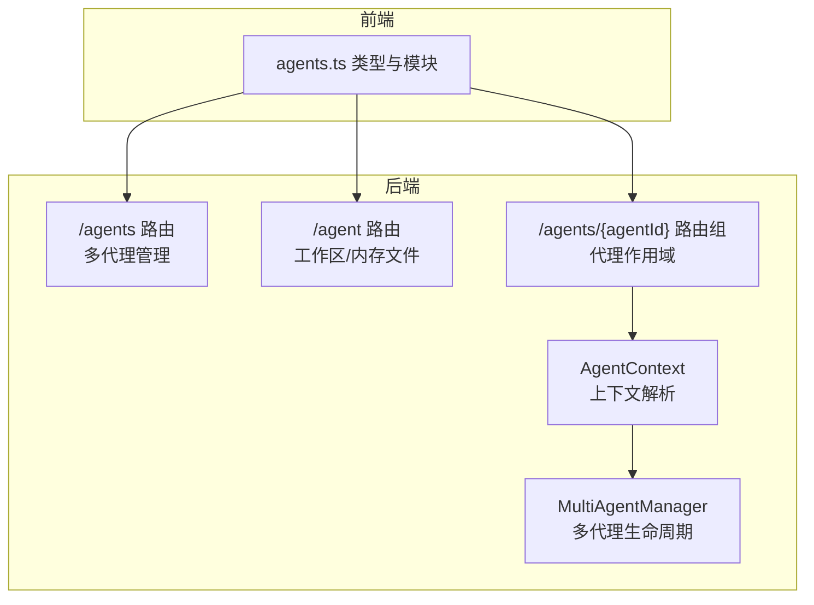
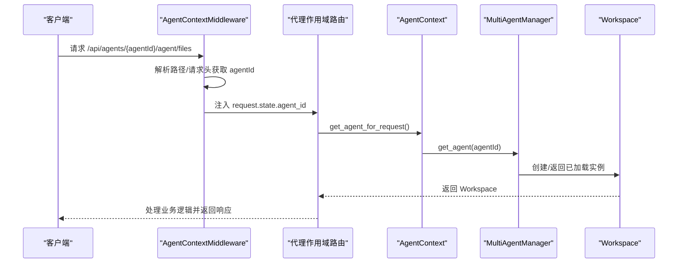
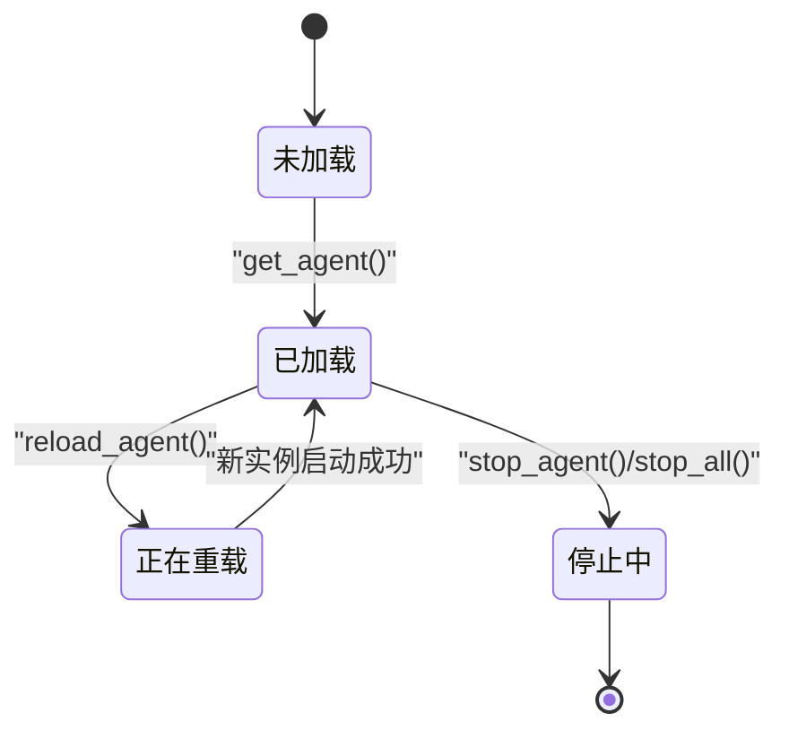
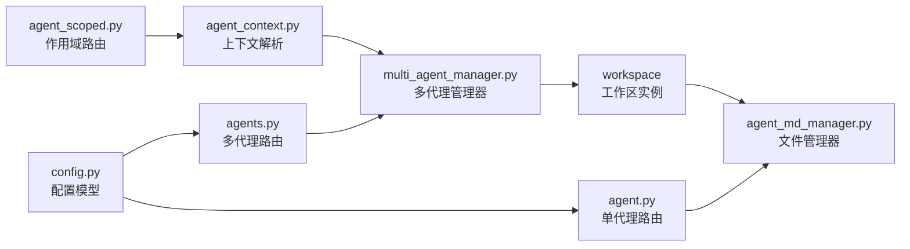

# 代理管理API

<cite>
**本文引用的文件**
- [src/copaw/app/routers/agents.py](file://src/copaw/app/routers/agents.py)
- [src/copaw/app/routers/agent.py](file://src/copaw/app/routers/agent.py)
- [src/copaw/app/routers/agent_scoped.py](file://src/copaw/app/routers/agent_scoped.py)
- [src/copaw/app/multi_agent_manager.py](file://src/copaw/app/multi_agent_manager.py)
- [src/copaw/app/agent_context.py](file://src/copaw/app/agent_context.py)
- [src/copaw/config/config.py](file://src/copaw/config/config.py)
- [src/copaw/agents/memory/agent_md_manager.py](file://src/copaw/agents/memory/agent_md_manager.py)
- [console/src/api/modules/agents.ts](file://console/src/api/modules/agents.ts)
- [console/src/api/types/agents.ts](file://console/src/api/types/agents.ts)
- [console/src/api/types/agent.ts](file://console/src/api/types/agent.ts)
- [website/public/docs/multi-agent.en.md](file://website/public/docs/multi-agent.en.md)
</cite>

## 目录
1. [简介](#简介)
2. [项目结构](#项目结构)
3. [核心组件](#核心组件)
4. [架构总览](#架构总览)
5. [详细组件分析](#详细组件分析)
6. [依赖分析](#依赖分析)
7. [性能考虑](#性能考虑)
8. [故障排查指南](#故障排查指南)
9. [结论](#结论)
10. [附录](#附录)

## 简介
本文件系统性梳理 CoPaw 的代理管理 API，覆盖多代理的创建、查询、更新、删除（CRUD）与批量操作能力；详述代理配置参数、运行状态监控与生命周期管理；包含代理模板与工作区文件管理；提供代理间通信与协作模式说明；并给出状态码、错误处理与调试技巧。

## 项目结构
- 后端路由层：多代理管理与单代理工作区文件/内存文件 API
- 上下文与中间件：基于路径或请求头注入 agentId，确保请求落到正确代理上下文
- 配置模型：代理配置、运行时配置、工具与通道等结构化定义
- 工作区与内存文件管理：统一读写工作区与记忆区 Markdown 文件
- 前端 API 模块：与后端 API 对应的类型与调用封装



图表来源
- [src/copaw/app/routers/agents.py:124-172](file://src/copaw/app/routers/agents.py#L124-L172)
- [src/copaw/app/routers/agent.py:40-180](file://src/copaw/app/routers/agent.py#L40-L180)
- [src/copaw/app/routers/agent_scoped.py:53-92](file://src/copaw/app/routers/agent_scoped.py#L53-L92)
- [src/copaw/app/multi_agent_manager.py:17-82](file://src/copaw/app/multi_agent_manager.py#L17-L82)
- [src/copaw/app/agent_context.py:22-84](file://src/copaw/app/agent_context.py#L22-L84)
- [console/src/api/modules/agents.ts:10-61](file://console/src/api/modules/agents.ts#L10-L61)

章节来源
- [src/copaw/app/routers/agents.py:124-172](file://src/copaw/app/routers/agents.py#L124-L172)
- [src/copaw/app/routers/agent.py:40-180](file://src/copaw/app/routers/agent.py#L40-L180)
- [src/copaw/app/routers/agent_scoped.py:53-92](file://src/copaw/app/routers/agent_scoped.py#L53-L92)
- [src/copaw/app/multi_agent_manager.py:17-82](file://src/copaw/app/multi_agent_manager.py#L17-L82)
- [src/copaw/app/agent_context.py:22-84](file://src/copaw/app/agent_context.py#L22-L84)
- [console/src/api/modules/agents.ts:10-61](file://console/src/api/modules/agents.ts#L10-L61)

## 核心组件
- 多代理管理路由：提供列表、创建、更新、删除、文件读写、内存文件读写等接口
- 单代理工作区/内存文件路由：面向当前激活代理的工作区与记忆区 Markdown 文件
- 代理作用域路由器与中间件：通过路径或请求头注入 agentId，实现多代理隔离
- 多代理管理器：负责代理实例的懒加载、零停机热重载、优雅停止与并发启动
- 代理上下文：在请求生命周期内解析当前代理 ID，并获取对应工作区
- 配置模型：代理配置、运行时配置、工具与通道等结构化定义
- 工作区/记忆区 Markdown 管理器：统一读写工作区与记忆区 Markdown 文件

章节来源
- [src/copaw/app/routers/agents.py:124-172](file://src/copaw/app/routers/agents.py#L124-L172)
- [src/copaw/app/routers/agent.py:40-180](file://src/copaw/app/routers/agent.py#L40-L180)
- [src/copaw/app/routers/agent_scoped.py:15-51](file://src/copaw/app/routers/agent_scoped.py#L15-L51)
- [src/copaw/app/multi_agent_manager.py:17-82](file://src/copaw/app/multi_agent_manager.py#L17-L82)
- [src/copaw/app/agent_context.py:22-84](file://src/copaw/app/agent_context.py#L22-L84)
- [src/copaw/config/config.py:444-517](file://src/copaw/config/config.py#L444-L517)
- [src/copaw/agents/memory/agent_md_manager.py:8-124](file://src/copaw/agents/memory/agent_md_manager.py#L8-L124)

## 架构总览
CoPaw 的代理管理采用“作用域路由 + 中间件注入 + 管理器”的架构设计：
- 作用域路由：以 /agents/{agentId} 为前缀，挂载聊天、配置、技能、工具、MCP、工作区、控制台等子路由
- 中间件：从路径或请求头提取 agentId，注入到请求上下文，供下游路由使用
- 管理器：集中管理多个代理工作区实例，支持懒加载、零停机热重载、并发启动与优雅停止



图表来源
- [src/copaw/app/routers/agent_scoped.py:15-51](file://src/copaw/app/routers/agent_scoped.py#L15-L51)
- [src/copaw/app/agent_context.py:22-84](file://src/copaw/app/agent_context.py#L22-L84)
- [src/copaw/app/multi_agent_manager.py:34-82](file://src/copaw/app/multi_agent_manager.py#L34-L82)

## 详细组件分析

### 多代理管理 API（/agents）
- 列表代理：GET /agents
- 获取代理详情：GET /agents/{agentId}
- 创建代理：POST /agents（自动分配短 ID，初始化工作区与默认文件）
- 更新代理：PUT /agents/{agentId}（合并更新，触发后台热重载）
- 删除代理：DELETE /agents/{agentId}（不可删除 default；停止运行实例并移除配置）
- 代理工作区文件：GET/GET/PUT /agents/{agentId}/files[/filename]
- 代理记忆区文件：GET/GET/PUT /agents/{agentId}/memory[/filename]

```mermaid
flowchart TD
Start(["请求进入 /agents"]) --> Op{"方法与路径"}
Op --> |GET /agents| List["列出所有代理配置"]
Op --> |GET /agents/{agentId}| Detail["读取指定代理完整配置"]
Op --> |POST /agents| Create["生成短ID并创建代理<br/>初始化工作区与默认文件"]
Op --> |PUT /agents/{agentId}| Update["合并更新配置<br/>后台触发热重载"]
Op --> |DELETE /agents/{agentId}| Delete["停止实例并移除配置"]
Op --> |GET /agents/{agentId}/files| ListFiles["列出工作区 *.md 文件"]
Op --> |GET /agents/{agentId}/files/{filename}| ReadFile["读取工作区文件内容"]
Op --> |PUT /agents/{agentId}/files/{filename}| WriteFile["写入工作区文件内容"]
Op --> |GET /agents/{agentId}/memory| ListMemory["列出记忆区 *.md 文件"]
End(["返回响应"])
List --> End
Detail --> End
Create --> End
Update --> End
Delete --> End
ListFiles --> End
ReadFile --> End
WriteFile --> End
ListMemory --> End
```

图表来源
- [src/copaw/app/routers/agents.py:124-172](file://src/copaw/app/routers/agents.py#L124-L172)
- [src/copaw/app/routers/agents.py:175-354](file://src/copaw/app/routers/agents.py#L175-L354)
- [src/copaw/app/routers/agents.py:356-446](file://src/copaw/app/routers/agents.py#L356-L446)
- [src/copaw/app/routers/agents.py:448-620](file://src/copaw/app/routers/agents.py#L448-L620)

章节来源
- [src/copaw/app/routers/agents.py:124-172](file://src/copaw/app/routers/agents.py#L124-L172)
- [src/copaw/app/routers/agents.py:175-354](file://src/copaw/app/routers/agents.py#L175-L354)
- [src/copaw/app/routers/agents.py:356-446](file://src/copaw/app/routers/agents.py#L356-L446)
- [src/copaw/app/routers/agents.py:448-620](file://src/copaw/app/routers/agents.py#L448-L620)

### 单代理工作区/内存文件 API（/agent）
- 列出工作区 Markdown 文件：GET /agent/files
- 读取工作区 Markdown 文件：GET /agent/files/{md_name}
- 写入工作区 Markdown 文件：PUT /agent/files/{md_name}
- 列出记忆区 Markdown 文件：GET /agent/memory
- 读取记忆区 Markdown 文件：GET /agent/memory/{md_name}
- 写入记忆区 Markdown 文件：PUT /agent/memory/{md_name}

章节来源
- [src/copaw/app/routers/agent.py:40-180](file://src/copaw/app/routers/agent.py#L40-L180)

### 代理作用域与上下文（/agents/{agentId}）
- 作用域路由：将聊天、配置、技能、工具、MCP、工作区、控制台等子路由挂载到 /agents/{agentId}
- 中间件：优先从路径提取 agentId，其次从请求头 X-Agent-Id 获取，最后回退到配置中的 active_agent
- 上下文：在请求生命周期内解析当前代理 ID，并通过 MultiAgentManager 获取对应 Workspace

章节来源
- [src/copaw/app/routers/agent_scoped.py:53-92](file://src/copaw/app/routers/agent_scoped.py#L53-L92)
- [src/copaw/app/agent_context.py:22-84](file://src/copaw/app/agent_context.py#L22-L84)

### 多代理生命周期管理（MultiAgentManager）
- 懒加载：首次访问时创建并启动 Workspace
- 零停机热重载：原子替换旧实例，后台优雅停止旧实例
- 并发启动：启动所有已配置代理，互不影响
- 优雅停止：检测活跃任务，必要时延迟清理



图表来源
- [src/copaw/app/multi_agent_manager.py:17-82](file://src/copaw/app/multi_agent_manager.py#L17-L82)
- [src/copaw/app/multi_agent_manager.py:200-311](file://src/copaw/app/multi_agent_manager.py#L200-L311)
- [src/copaw/app/multi_agent_manager.py:338-362](file://src/copaw/app/multi_agent_manager.py#L338-L362)

章节来源
- [src/copaw/app/multi_agent_manager.py:17-82](file://src/copaw/app/multi_agent_manager.py#L17-L82)
- [src/copaw/app/multi_agent_manager.py:200-311](file://src/copaw/app/multi_agent_manager.py#L200-L311)
- [src/copaw/app/multi_agent_manager.py:338-362](file://src/copaw/app/multi_agent_manager.py#L338-L362)

### 代理配置参数与运行时监控
- 代理配置模型：包含名称、描述、工作区目录、语言、通道、MCP、心跳、运行时配置、LLM 路由、工具、安全等字段
- 运行时配置模型：最大迭代次数、LLM 重试策略、输入长度、内存压缩阈值、嵌入配置等
- 代理运行配置读取与更新：GET/PUT /agents/{agentId}/running-config
- 系统提示文件列表读取与更新：GET/PUT /agents/{agentId}/system-prompt-files
- 代理语言设置读取与更新：GET/PUT /agent/language
- 音频模式与转录提供者：GET/PUT /agent/audio-mode、/agent/transcription-provider-type、/agent/transcription-provider、/agent/transcription-providers、/agent/local-whisper-status

章节来源
- [src/copaw/config/config.py:444-517](file://src/copaw/config/config.py#L444-L517)
- [src/copaw/config/config.py:275-417](file://src/copaw/config/config.py#L275-L417)
- [src/copaw/app/routers/agent.py:430-533](file://src/copaw/app/routers/agent.py#L430-L533)

### 工作区与记忆区文件管理
- 统一管理器：AgentMdManager 提供工作区与记忆区的文件列举、读取、写入能力
- 文件元数据：包含文件名、大小、路径、创建时间、修改时间
- 错误处理：文件不存在时抛出异常，上层路由转换为 404

章节来源
- [src/copaw/agents/memory/agent_md_manager.py:8-124](file://src/copaw/agents/memory/agent_md_manager.py#L8-L124)
- [src/copaw/app/routers/agent.py:40-180](file://src/copaw/app/routers/agent.py#L40-L180)
- [src/copaw/app/routers/agents.py:356-446](file://src/copaw/app/routers/agents.py#L356-L446)

### 前端 API 使用示例
- 列表/创建/更新/删除代理：agentsApi.listAgents/createAgent/updateAgent/deleteAgent
- 代理工作区/记忆区文件：listAgentFiles/readAgentFile/writeAgentFile/listAgentMemory
- 类型定义：AgentListResponse、AgentProfileConfig、CreateAgentRequest、AgentProfileRef

章节来源
- [console/src/api/modules/agents.ts:10-61](file://console/src/api/modules/agents.ts#L10-L61)
- [console/src/api/types/agents.ts:1-40](file://console/src/api/types/agents.ts#L1-L40)
- [console/src/api/types/agent.ts:1-23](file://console/src/api/types/agent.ts#L1-L23)

## 依赖分析
- 作用域路由依赖中间件注入 agentId，再通过上下文解析到 MultiAgentManager
- MultiAgentManager 依赖 Workspace 实例，负责代理生命周期与热重载
- 配置模型定义了代理配置与运行时配置的数据结构
- 文件管理器依赖工作区目录结构，提供统一的文件读写接口



图表来源
- [src/copaw/app/routers/agent_scoped.py:53-92](file://src/copaw/app/routers/agent_scoped.py#L53-L92)
- [src/copaw/app/agent_context.py:22-84](file://src/copaw/app/agent_context.py#L22-L84)
- [src/copaw/app/multi_agent_manager.py:17-82](file://src/copaw/app/multi_agent_manager.py#L17-L82)
- [src/copaw/agents/memory/agent_md_manager.py:8-124](file://src/copaw/agents/memory/agent_md_manager.py#L8-L124)
- [src/copaw/app/routers/agents.py:124-172](file://src/copaw/app/routers/agents.py#L124-L172)
- [src/copaw/app/routers/agent.py:40-180](file://src/copaw/app/routers/agent.py#L40-L180)
- [src/copaw/config/config.py:444-517](file://src/copaw/config/config.py#L444-L517)

章节来源
- [src/copaw/app/routers/agent_scoped.py:53-92](file://src/copaw/app/routers/agent_scoped.py#L53-L92)
- [src/copaw/app/agent_context.py:22-84](file://src/copaw/app/agent_context.py#L22-L84)
- [src/copaw/app/multi_agent_manager.py:17-82](file://src/copaw/app/multi_agent_manager.py#L17-L82)
- [src/copaw/agents/memory/agent_md_manager.py:8-124](file://src/copaw/agents/memory/agent_md_manager.py#L8-L124)
- [src/copaw/app/routers/agents.py:124-172](file://src/copaw/app/routers/agents.py#L124-L172)
- [src/copaw/app/routers/agent.py:40-180](file://src/copaw/app/routers/agent.py#L40-L180)
- [src/copaw/config/config.py:444-517](file://src/copaw/config/config.py#L444-L517)

## 性能考虑
- 懒加载与并发启动：首次访问才创建实例，启动阶段避免阻塞其他代理
- 零停机热重载：新实例完全启动后再原子替换，最小化请求中断
- 异步非阻塞：热重载与文件写入等操作均在后台任务执行，不阻塞主请求线程
- 批量操作建议：前端可并发发起多个 /agents/{agentId} 的更新请求，后端按代理独立处理

## 故障排查指南
- 404 未找到：代理 ID 不存在或文件不存在
- 500 服务器错误：配置加载失败、实例启动失败、文件读写异常
- 无法获取 MultiAgentManager：应用状态未初始化或多代理管理器未注入
- 代理无法热重载：检查后台任务是否被取消或异常，查看日志输出
- 代理间冲突：确认请求头 X-Agent-Id 是否正确传递，或路径是否包含正确的 agentId

章节来源
- [src/copaw/app/routers/agents.py:181-189](file://src/copaw/app/routers/agents.py#L181-L189)
- [src/copaw/app/routers/agent.py:82-85](file://src/copaw/app/routers/agent.py#L82-L85)
- [src/copaw/app/agent_context.py:62-67](file://src/copaw/app/agent_context.py#L62-L67)
- [src/copaw/app/multi_agent_manager.py:200-311](file://src/copaw/app/multi_agent_manager.py#L200-L311)

## 结论
CoPaw 的代理管理 API 通过清晰的路由分层、严格的代理作用域隔离与强大的多代理管理器，提供了稳定、可扩展的多代理运行环境。配合前端类型与模块封装，开发者可以高效地完成代理的全生命周期管理与协作模式构建。

## 附录

### API 参考速查
- 多代理管理
  - GET /agents：列出所有代理
  - GET /agents/{agentId}：获取代理详情
  - POST /agents：创建代理
  - PUT /agents/{agentId}：更新代理
  - DELETE /agents/{agentId}：删除代理
  - GET /agents/{agentId}/files：列出工作区文件
  - GET /agents/{agentId}/files/{filename}：读取工作区文件
  - PUT /agents/{agentId}/files/{filename}：写入工作区文件
  - GET /agents/{agentId}/memory：列出记忆区文件
- 单代理工作区/内存文件
  - GET /agent/files、GET /agent/files/{md_name}、PUT /agent/files/{md_name}
  - GET /agent/memory、GET /agent/memory/{md_name}、PUT /agent/memory/{md_name}
- 代理运行配置与系统提示
  - GET/PUT /agents/{agentId}/running-config
  - GET/PUT /agents/{agentId}/system-prompt-files
- 代理语言与音频/转录
  - GET/PUT /agent/language
  - GET/PUT /agent/audio-mode
  - GET/PUT /agent/transcription-provider-type
  - GET /agent/transcription-providers
  - GET /agent/local-whisper-status
  - PUT /agent/transcription-provider

章节来源
- [src/copaw/app/routers/agents.py:124-172](file://src/copaw/app/routers/agents.py#L124-L172)
- [src/copaw/app/routers/agents.py:175-354](file://src/copaw/app/routers/agents.py#L175-L354)
- [src/copaw/app/routers/agents.py:356-446](file://src/copaw/app/routers/agents.py#L356-L446)
- [src/copaw/app/routers/agent.py:40-180](file://src/copaw/app/routers/agent.py#L40-L180)
- [src/copaw/app/routers/agent.py:430-533](file://src/copaw/app/routers/agent.py#L430-L533)
- [website/public/docs/multi-agent.en.md:284-321](file://website/public/docs/multi-agent.en.md#L284-L321)