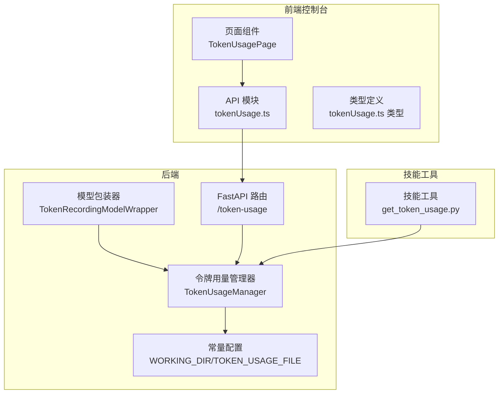
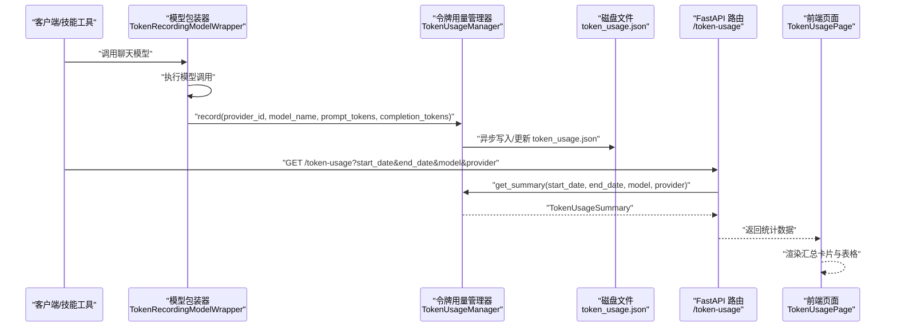
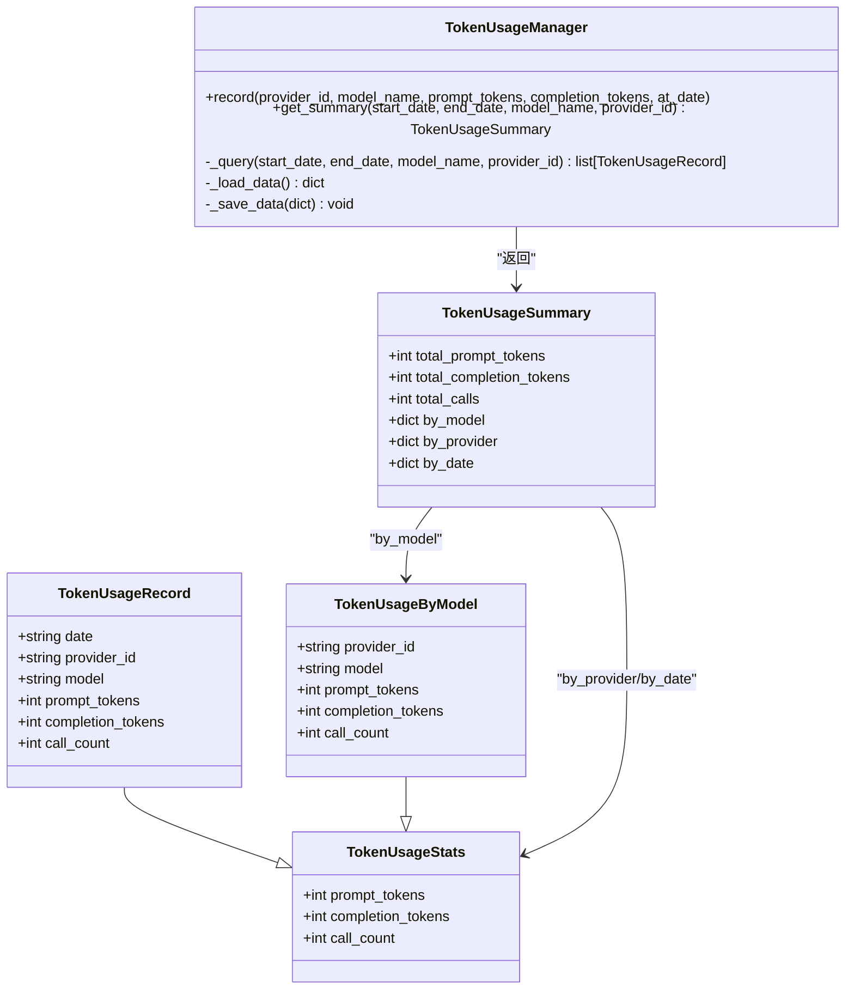
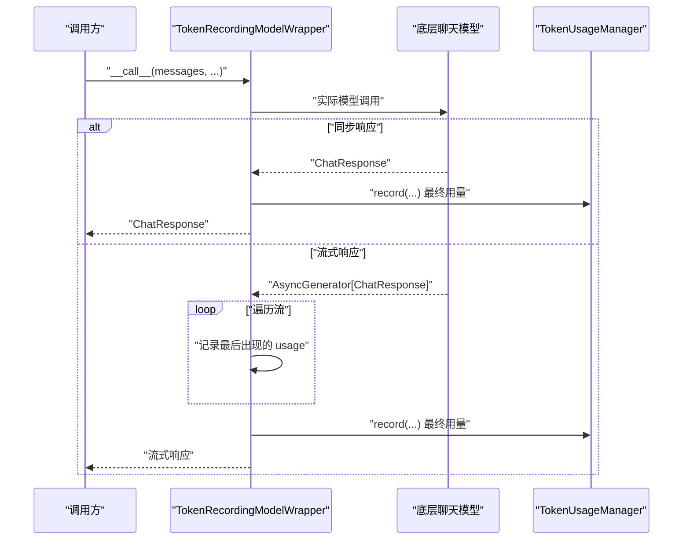
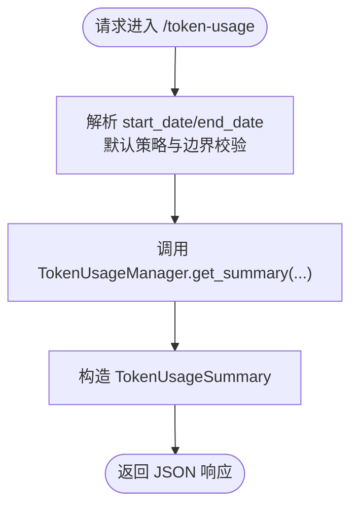
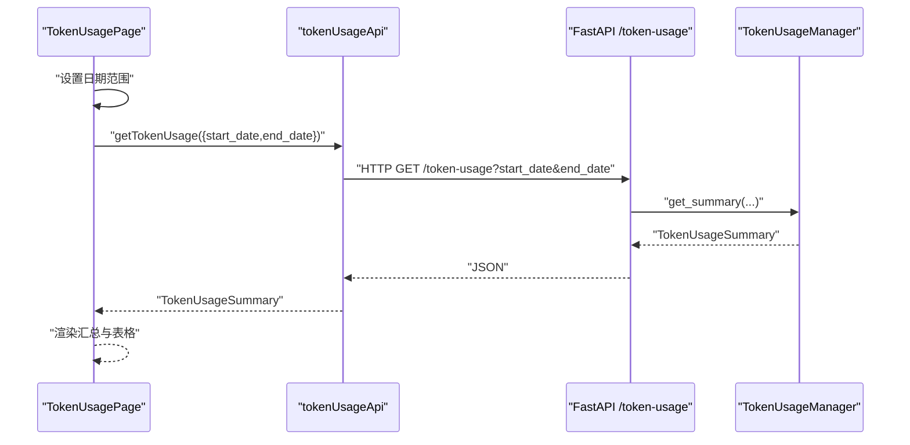
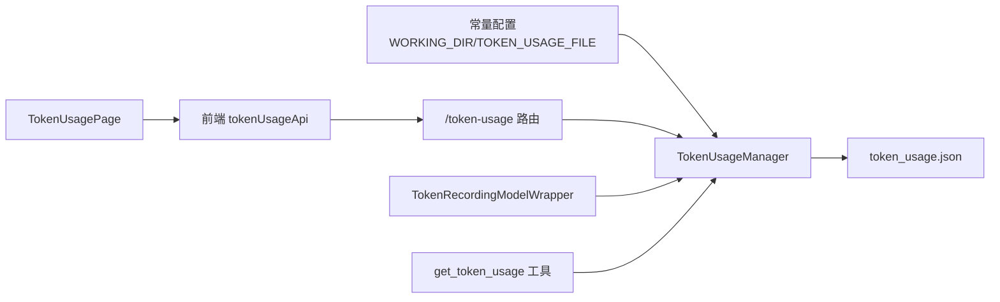

# 令牌用量API

<cite>
**本文档引用的文件**
- [src/copaw/token_usage/__init__.py](file://src/copaw/token_usage/__init__.py)
- [src/copaw/token_usage/manager.py](file://src/copaw/token_usage/manager.py)
- [src/copaw/token_usage/model_wrapper.py](file://src/copaw/token_usage/model_wrapper.py)
- [src/copaw/app/routers/token_usage.py](file://src/copaw/app/routers/token_usage.py)
- [console/src/api/modules/tokenUsage.ts](file://console/src/api/modules/tokenUsage.ts)
- [console/src/api/types/tokenUsage.ts](file://console/src/api/types/tokenUsage.ts)
- [console/src/pages/Settings/TokenUsage/index.tsx](file://console/src/pages/Settings/TokenUsage/index.tsx)
- [src/copaw/agents/tools/get_token_usage.py](file://src/copaw/agents/tools/get_token_usage.py)
- [src/copaw/constant.py](file://src/copaw/constant.py)
</cite>

## 目录
1. [简介](#简介)
2. [项目结构](#项目结构)
3. [核心组件](#核心组件)
4. [架构总览](#架构总览)
5. [详细组件分析](#详细组件分析)
6. [依赖关系分析](#依赖关系分析)
7. [性能考量](#性能考量)
8. [故障排除指南](#故障排除指南)
9. [结论](#结论)

## 简介
本文件系统性梳理并记录 CoPaw 的令牌用量 API，覆盖以下方面：
- 令牌消耗统计、查询与报表生成接口
- 不同模型的计费规则与用量计算方式
- 实时用量监控与阈值告警能力（当前实现与扩展建议）
- 用量预测与成本优化建议接口（当前实现与扩展建议）
- 用量数据的聚合、分析与可视化功能
- 用量异常检测与自动告警机制（当前实现与扩展建议）

该能力以“按日期+供应商+模型”的复合键进行聚合统计，并通过 FastAPI 路由对外提供查询接口；前端控制台提供筛选与可视化展示。

## 项目结构
围绕令牌用量的核心代码分布在后端 Python 包与前端控制台两部分：
- 后端 Python 包：负责令牌用量的记录、聚合与持久化，以及对外 API 路由
- 前端控制台：提供令牌用量页面、筛选器与表格展示

图表来源
- [src/copaw/app/routers/token_usage.py:1-62](file://src/copaw/app/routers/token_usage.py#L1-62)
- [src/copaw/token_usage/manager.py:62-309](file://src/copaw/token_usage/manager.py#L62-309)
- [src/copaw/token_usage/model_wrapper.py:15-71](file://src/copaw/token_usage/model_wrapper.py#L15-71)
- [console/src/api/modules/tokenUsage.ts:1-20](file://console/src/api/modules/tokenUsage.ts#L1-20)
- [console/src/api/types/tokenUsage.ts:1-17](file://console/src/api/types/tokenUsage.ts#L1-17)
- [console/src/pages/Settings/TokenUsage/index.tsx:19-223](file://console/src/pages/Settings/TokenUsage/index.tsx#L19-223)
- [src/copaw/agents/tools/get_token_usage.py:12-86](file://src/copaw/agents/tools/get_token_usage.py#L12-86)
- [src/copaw/constant.py:72-107](file://src/copaw/constant.py#L72-107)

章节来源
- [src/copaw/app/routers/token_usage.py:1-62](file://src/copaw/app/routers/token_usage.py#L1-62)
- [src/copaw/token_usage/manager.py:62-309](file://src/copaw/token_usage/manager.py#L62-309)
- [src/copaw/token_usage/model_wrapper.py:15-71](file://src/copaw/token_usage/model_wrapper.py#L15-71)
- [console/src/api/modules/tokenUsage.ts:1-20](file://console/src/api/modules/tokenUsage.ts#L1-20)
- [console/src/api/types/tokenUsage.ts:1-17](file://console/src/api/types/tokenUsage.ts#L1-17)
- [console/src/pages/Settings/TokenUsage/index.tsx:19-223](file://console/src/pages/Settings/TokenUsage/index.tsx#L19-223)
- [src/copaw/agents/tools/get_token_usage.py:12-86](file://src/copaw/agents/tools/get_token_usage.py#L12-86)
- [src/copaw/constant.py:72-107](file://src/copaw/constant.py#L72-107)

## 核心组件
- 令牌用量管理器（TokenUsageManager）：负责加载/保存、记录、查询与汇总令牌用量数据
- 模型包装器（TokenRecordingModelWrapper）：在调用底层聊天模型前后自动记录令牌用量
- FastAPI 路由（/token-usage）：对外提供令牌用量查询接口
- 前端 API 模块与页面：提供查询参数构建、请求封装与可视化展示
- 技能工具（get_token_usage）：面向智能体的令牌用量查询工具

章节来源
- [src/copaw/token_usage/manager.py:62-309](file://src/copaw/token_usage/manager.py#L62-309)
- [src/copaw/token_usage/model_wrapper.py:15-71](file://src/copaw/token_usage/model_wrapper.py#L15-71)
- [src/copaw/app/routers/token_usage.py:23-62](file://src/copaw/app/routers/token_usage.py#L23-62)
- [console/src/api/modules/tokenUsage.ts:1-20](file://console/src/api/modules/tokenUsage.ts#L1-20)
- [console/src/pages/Settings/TokenUsage/index.tsx:19-223](file://console/src/pages/Settings/TokenUsage/index.tsx#L19-223)
- [src/copaw/agents/tools/get_token_usage.py:12-86](file://src/copaw/agents/tools/get_token_usage.py#L12-86)

## 架构总览
下图展示了从模型调用到数据落盘、再到 API 查询与前端展示的完整链路：

图表来源
- [src/copaw/token_usage/model_wrapper.py:40-71](file://src/copaw/token_usage/model_wrapper.py#L40-71)
- [src/copaw/token_usage/manager.py:110-156](file://src/copaw/token_usage/manager.py#L110-156)
- [src/copaw/app/routers/token_usage.py:28-62](file://src/copaw/app/routers/token_usage.py#L28-62)
- [console/src/pages/Settings/TokenUsage/index.tsx:29-73](file://console/src/pages/Settings/TokenUsage/index.tsx#L29-73)

## 详细组件分析

### 令牌用量管理器（TokenUsageManager）
- 数据结构
  - 记录行：按日期、供应商与模型聚合，包含提示词令牌数、补全令牌数与调用次数
  - 聚合结果：总提示词令牌、总补全令牌、总调用次数，以及按模型、按供应商、按日期的分组统计
- 关键方法
  - record：记录单次调用的令牌用量，支持指定日期，默认为当日
  - get_summary：根据日期范围与可选过滤条件（模型名、供应商ID）返回聚合摘要
  - _query：内部查询实现，遍历日期范围内的记录并应用过滤
- 存储与并发
  - 使用异步文件锁保护磁盘写入
  - 默认文件路径来自工作目录与配置常量，采用 JSON 格式存储

图表来源
- [src/copaw/token_usage/manager.py:19-309](file://src/copaw/token_usage/manager.py#L19-309)

章节来源
- [src/copaw/token_usage/manager.py:62-309](file://src/copaw/token_usage/manager.py#L62-309)

### 模型包装器（TokenRecordingModelWrapper）
- 功能：对任意聊天模型调用进行包装，在同步与流式响应两种场景下提取最终使用量并调用管理器记录
- 流程：调用底层模型 → 若为流式则捕获最后一条带使用量的消息 → 统一调用 record 写入

图表来源
- [src/copaw/token_usage/model_wrapper.py:40-71](file://src/copaw/token_usage/model_wrapper.py#L40-71)

章节来源
- [src/copaw/token_usage/model_wrapper.py:15-71](file://src/copaw/token_usage/model_wrapper.py#L15-71)

### FastAPI 令牌用量接口（/token-usage）
- 路由：GET /token-usage
- 查询参数
  - start_date：开始日期（YYYY-MM-DD，默认为结束日减30天）
  - end_date：结束日期（YYYY-MM-DD，默认为今日）
  - model：按模型名过滤
  - provider：按供应商ID过滤
- 返回：TokenUsageSummary（总用量与按模型/按日期的分组）

图表来源
- [src/copaw/app/routers/token_usage.py:28-62](file://src/copaw/app/routers/token_usage.py#L28-62)

章节来源
- [src/copaw/app/routers/token_usage.py:23-62](file://src/copaw/app/routers/token_usage.py#L23-62)

### 前端 API 与页面
- API 模块：构建查询字符串，发起请求获取 TokenUsageSummary
- 页面组件：提供日期范围选择器、刷新按钮、汇总卡片与按模型/按日期的表格展示
- 类型定义：TokenUsageStats 与 TokenUsageSummary

图表来源
- [console/src/api/modules/tokenUsage.ts:1-20](file://console/src/api/modules/tokenUsage.ts#L1-20)
- [console/src/pages/Settings/TokenUsage/index.tsx:29-73](file://console/src/pages/Settings/TokenUsage/index.tsx#L29-73)
- [console/src/api/types/tokenUsage.ts:1-17](file://console/src/api/types/tokenUsage.ts#L1-17)

章节来源
- [console/src/api/modules/tokenUsage.ts:1-20](file://console/src/api/modules/tokenUsage.ts#L1-20)
- [console/src/pages/Settings/TokenUsage/index.tsx:19-223](file://console/src/pages/Settings/TokenUsage/index.tsx#L19-223)
- [console/src/api/types/tokenUsage.ts:1-17](file://console/src/api/types/tokenUsage.ts#L1-17)

### 技能工具（get_token_usage）
- 用途：在智能体对话中提供令牌用量查询能力
- 参数：days（回溯天数，默认30，限制1~365）、model_name、provider_id
- 输出：格式化的文本块，包含总量、按模型与按日期的统计摘要

章节来源
- [src/copaw/agents/tools/get_token_usage.py:12-86](file://src/copaw/agents/tools/get_token_usage.py#L12-86)

## 依赖关系分析
- 文件存储位置
  - 工作目录与令牌用量文件名由常量配置决定，默认位于用户工作目录下的 token_usage.json
- 外部依赖
  - aiofiles：异步文件读写
  - pydantic：数据模型与校验
  - fastapi：路由与请求处理
  - 前端：React + Ant Design 表格组件

图表来源
- [src/copaw/constant.py:72-107](file://src/copaw/constant.py#L72-107)
- [src/copaw/token_usage/manager.py:69-108](file://src/copaw/token_usage/manager.py#L69-108)
- [src/copaw/app/routers/token_usage.py:8-10](file://src/copaw/app/routers/token_usage.py#L8-10)
- [src/copaw/token_usage/model_wrapper.py:12-24](file://src/copaw/token_usage/model_wrapper.py#L12-24)
- [console/src/api/modules/tokenUsage.ts:1-20](file://console/src/api/modules/tokenUsage.ts#L1-20)
- [console/src/pages/Settings/TokenUsage/index.tsx:29-47](file://console/src/pages/Settings/TokenUsage/index.tsx#L29-47)
- [src/copaw/agents/tools/get_token_usage.py:9-16](file://src/copaw/agents/tools/get_token_usage.py#L9-16)

章节来源
- [src/copaw/constant.py:72-107](file://src/copaw/constant.py#L72-107)
- [src/copaw/token_usage/manager.py:69-108](file://src/copaw/token_usage/manager.py#L69-108)
- [src/copaw/app/routers/token_usage.py:8-10](file://src/copaw/app/routers/token_usage.py#L8-10)
- [src/copaw/token_usage/model_wrapper.py:12-24](file://src/copaw/token_usage/model_wrapper.py#L12-24)
- [console/src/api/modules/tokenUsage.ts:1-20](file://console/src/api/modules/tokenUsage.ts#L1-20)
- [console/src/pages/Settings/TokenUsage/index.tsx:29-47](file://console/src/pages/Settings/TokenUsage/index.tsx#L29-47)
- [src/copaw/agents/tools/get_token_usage.py:9-16](file://src/copaw/agents/tools/get_token_usage.py#L9-16)

## 性能考量
- I/O 特性
  - 使用异步文件锁与异步文件读写，降低阻塞风险
  - 聚合逻辑在内存中完成，时间复杂度 O(N)，其中 N 为日期范围内记录条目数
- 可扩展性
  - 当前以 JSON 文件作为存储介质，适合中小规模数据
  - 对于大规模数据或高并发场景，建议迁移到数据库并引入缓存层
- 前端渲染
  - 表格组件支持分页关闭，大数据量时建议后端分页或导出 CSV

## 故障排除指南
- 常见问题
  - 无法读取/写入令牌用量文件：检查工作目录权限与磁盘空间
  - 日期参数无效：确认传入日期格式为 YYYY-MM-DD，且起止日期合理
  - 无数据：确认已通过模型包装器产生调用并触发 record；检查日期范围是否覆盖记录
- 排查步骤
  - 后端日志：关注文件读写警告与 JSON 解析错误
  - 前端错误：查看消息提示与空状态显示
  - 技能工具：确认 days 参数在允许范围内，过滤条件正确

章节来源
- [src/copaw/token_usage/manager.py:73-108](file://src/copaw/token_usage/manager.py#L73-108)
- [console/src/pages/Settings/TokenUsage/index.tsx:38-46](file://console/src/pages/Settings/TokenUsage/index.tsx#L38-46)

## 结论
- 令牌用量 API 已具备完整的“记录—聚合—查询—展示”闭环，满足日常用量统计与报表需求
- 计费规则与成本优化建议目前以“令牌用量统计”为基础，可通过扩展接口实现预测与优化建议
- 异常检测与自动告警可基于现有聚合结果进行二次开发，结合阈值策略与通知渠道实现