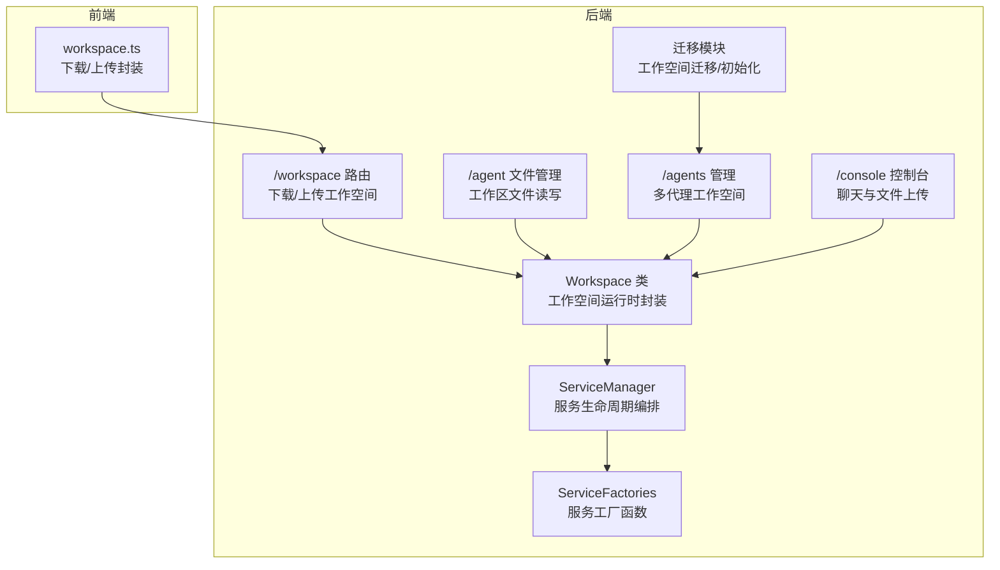
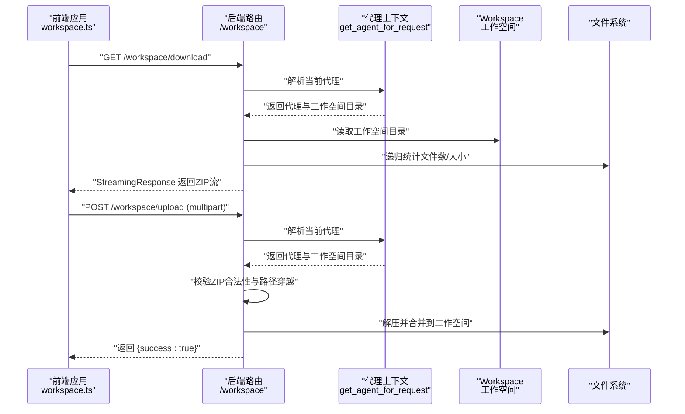
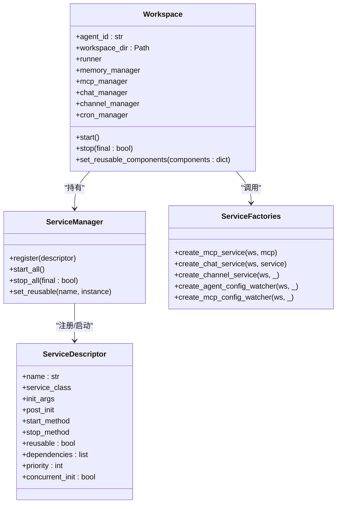
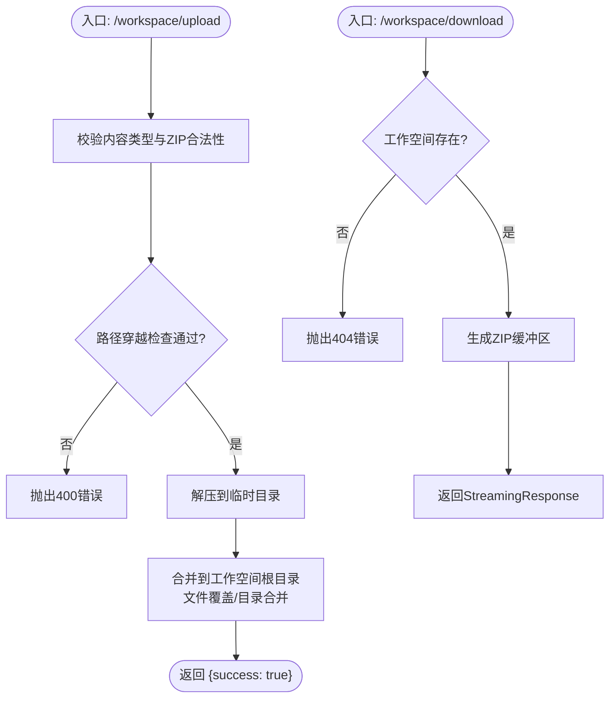
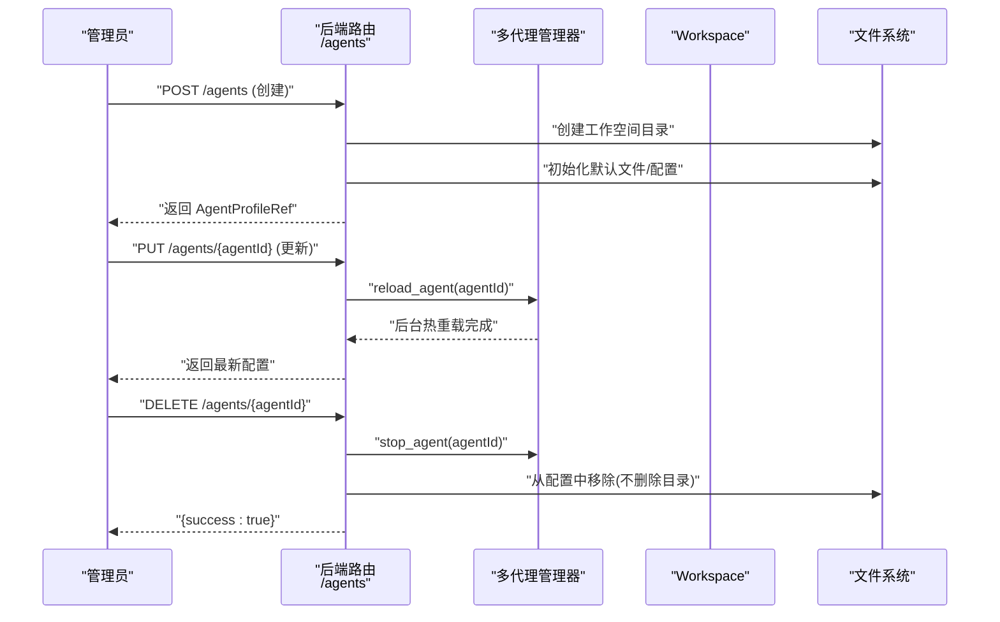
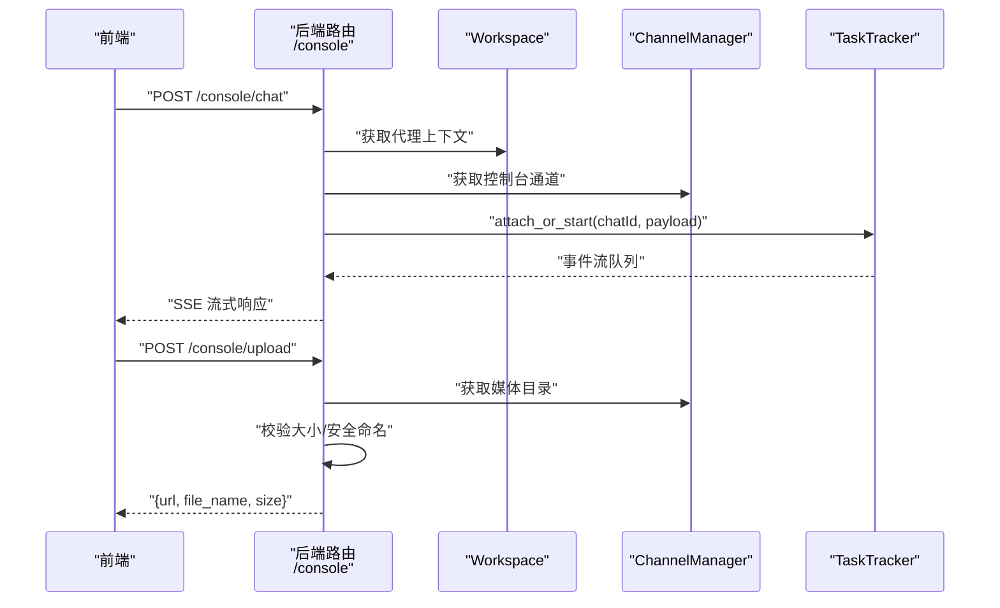
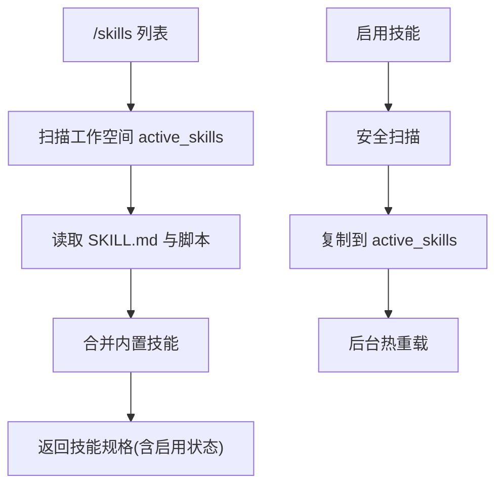
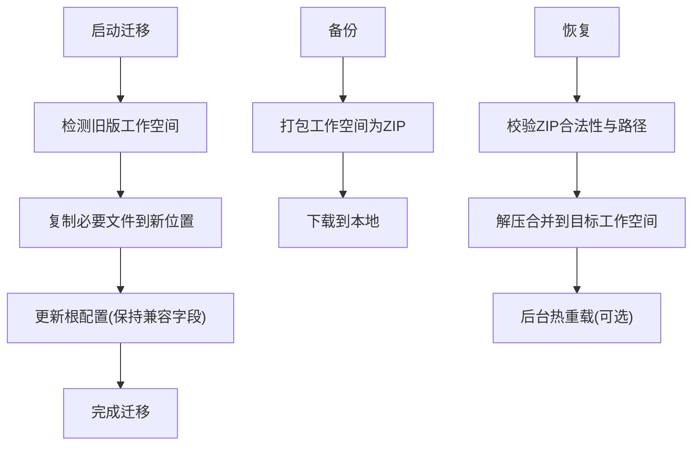
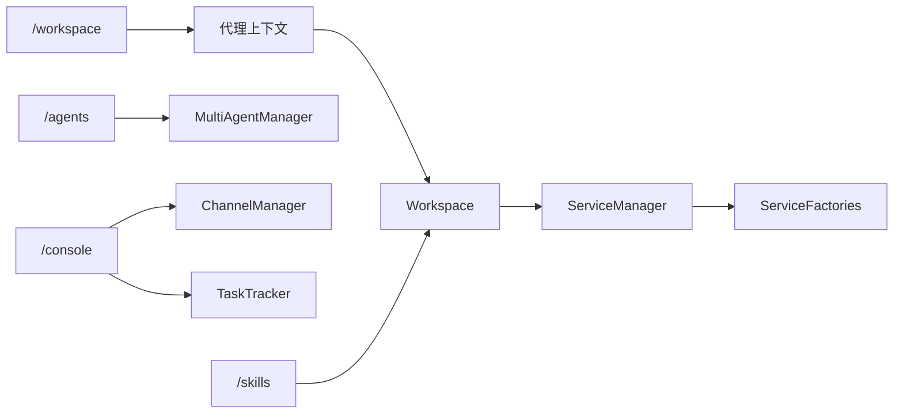

# 工作空间API

<cite>
**本文档引用的文件**
- [workspace.py](file://src/copaw/app/workspace/workspace.py)
- [service_manager.py](file://src/copaw/app/workspace/service_manager.py)
- [service_factories.py](file://src/copaw/app/workspace/service_factories.py)
- [workspace.py](file://src/copaw/app/routers/workspace.py)
- [agent.py](file://src/copaw/app/routers/agent.py)
- [agents.py](file://src/copaw/app/routers/agents.py)
- [console.py](file://src/copaw/app/routers/console.py)
- [workspace.ts](file://console/src/api/modules/workspace.ts)
- [migration.py](file://src/copaw/app/migration.py)
- [SECURITY.md](file://SECURITY.md)
- [file_guardian.py](file://src/copaw/security/tool_guard/guardians/file_guardian.py)
</cite>

## 目录
1. [简介](#简介)
2. [项目结构](#项目结构)
3. [核心组件](#核心组件)
4. [架构总览](#架构总览)
5. [详细组件分析](#详细组件分析)
6. [依赖分析](#依赖分析)
7. [性能考虑](#性能考虑)
8. [故障排除指南](#故障排除指南)
9. [结论](#结论)
10. [附录](#附录)

## 简介
本文件系统性梳理 CoPaw 的工作空间（Workspace）API，覆盖以下方面：
- 工作空间的创建、配置与管理接口
- 工作空间内资源分配、权限控制与隔离机制
- 工作空间状态监控与性能指标查询接口
- 工作空间迁移、备份与恢复接口规范
- 工作空间与代理、技能的集成接口
- 工作空间安全策略与访问控制机制

目标是帮助开发者与运维人员快速理解并正确使用工作空间相关能力。

## 项目结构
围绕工作空间的核心代码分布在后端 Python 后端与前端 TypeScript 前端两部分：
- 后端：工作空间运行时封装、服务编排、路由接口
- 前端：工作空间打包下载与上传的调用封装

**图表来源**
- [workspace.py:39-367](file://src/copaw/app/workspace/workspace.py#L39-L367)
- [service_manager.py:74-415](file://src/copaw/app/workspace/service_manager.py#L74-L415)
- [service_factories.py:18-164](file://src/copaw/app/workspace/service_factories.py#L18-L164)
- [workspace.py:112-203](file://src/copaw/app/routers/workspace.py#L112-L203)
- [agent.py:40-180](file://src/copaw/app/routers/agent.py#L40-L180)
- [agents.py:192-354](file://src/copaw/app/routers/agents.py#L192-L354)
- [console.py:68-247](file://src/copaw/app/routers/console.py#L68-L247)
- [workspace.ts:61-114](file://console/src/api/modules/workspace.ts#L61-L114)
- [migration.py:142-264](file://src/copaw/app/migration.py#L142-L264)

**章节来源**
- [workspace.py:1-367](file://src/copaw/app/workspace/workspace.py#L1-L367)
- [service_manager.py:1-415](file://src/copaw/app/workspace/service_manager.py#L1-L415)
- [service_factories.py:1-164](file://src/copaw/app/workspace/service_factories.py#L1-L164)
- [workspace.py:1-203](file://src/copaw/app/routers/workspace.py#L1-L203)
- [agent.py:1-533](file://src/copaw/app/routers/agent.py#L1-L533)
- [agents.py:1-620](file://src/copaw/app/routers/agents.py#L1-L620)
- [console.py:1-247](file://src/copaw/app/routers/console.py#L1-L247)
- [workspace.ts:1-149](file://console/src/api/modules/workspace.ts#L1-L149)
- [migration.py:142-264](file://src/copaw/app/migration.py#L142-L264)

## 核心组件
- 工作空间运行时封装：Workspace 类负责将 Runner、MemoryManager、MCPClientManager、ChannelManager、CronManager 等组件统一纳入服务管理，支持启动/停止与可复用组件热重载。
- 服务管理器：ServiceManager 提供服务注册、生命周期（并发/顺序启动）、依赖解析、可复用组件传递等能力。
- 服务工厂：通过工厂函数将具体服务实例注入到 Runner、ChannelManager、ChatManager 等中，实现解耦与可测试性。
- 工作空间路由：提供工作空间打包下载与上传合并的能力，并进行路径穿越校验与安全处理。
- 多代理管理：提供工作空间创建、更新、删除、文件读写等接口，支撑多代理场景下的工作空间管理。
- 控制台路由：提供控制台聊天流式响应与文件上传能力，便于在工作空间内进行交互与媒体文件管理。
- 前端封装：workspace.ts 封装了工作空间下载与上传的调用逻辑，包括文件名提取、错误处理与大小限制。

**章节来源**
- [workspace.py:39-367](file://src/copaw/app/workspace/workspace.py#L39-L367)
- [service_manager.py:74-415](file://src/copaw/app/workspace/service_manager.py#L74-L415)
- [service_factories.py:18-164](file://src/copaw/app/workspace/service_factories.py#L18-L164)
- [workspace.py:112-203](file://src/copaw/app/routers/workspace.py#L112-L203)
- [agent.py:40-180](file://src/copaw/app/routers/agent.py#L40-L180)
- [agents.py:192-354](file://src/copaw/app/routers/agents.py#L192-L354)
- [console.py:68-247](file://src/copaw/app/routers/console.py#L68-L247)
- [workspace.ts:61-114](file://console/src/api/modules/workspace.ts#L61-L114)

## 架构总览
下图展示工作空间 API 的关键交互流程：前端通过 workspace.ts 调用后端 /workspace 下载/上传；后端根据请求绑定当前代理，定位其工作空间目录，执行打包或解压合并，并返回结果。

**图表来源**
- [workspace.ts:61-114](file://console/src/api/modules/workspace.ts#L61-L114)
- [workspace.py:126-203](file://src/copaw/app/routers/workspace.py#L126-L203)
- [workspace.py:52-77](file://src/copaw/app/workspace/workspace.py#L52-L77)

**章节来源**
- [workspace.ts:1-149](file://console/src/api/modules/workspace.ts#L1-L149)
- [workspace.py:1-203](file://src/copaw/app/routers/workspace.py#L1-L203)
- [workspace.py:1-367](file://src/copaw/app/workspace/workspace.py#L1-L367)

## 详细组件分析

### 工作空间类与服务编排
- Workspace：封装单个代理的工作空间，包含 Runner、MemoryManager、MCPClientManager、ChannelManager、CronManager 等组件；通过 ServiceManager 统一注册与启动。
- ServiceManager：按优先级分组并发/顺序启动服务；支持可复用组件在重启时保留；提供统一停止逻辑。
- ServiceFactories：将具体服务（如 MCP、Chat、Channel、配置监视器）注入到 Workspace 中，确保初始化与连接正确。

**图表来源**
- [workspace.py:39-367](file://src/copaw/app/workspace/workspace.py#L39-L367)
- [service_manager.py:30-415](file://src/copaw/app/workspace/service_manager.py#L30-L415)
- [service_factories.py:18-164](file://src/copaw/app/workspace/service_factories.py#L18-L164)

**章节来源**
- [workspace.py:39-367](file://src/copaw/app/workspace/workspace.py#L39-L367)
- [service_manager.py:74-415](file://src/copaw/app/workspace/service_manager.py#L74-L415)
- [service_factories.py:18-164](file://src/copaw/app/workspace/service_factories.py#L18-L164)

### 工作空间下载与上传接口
- 下载：将代理工作空间目录整体打包为 ZIP 并以流式响应返回；文件名包含代理 ID 与时间戳；仅对存在的工作空间目录进行打包。
- 上传：接收 ZIP 文件，进行合法性校验与路径穿越检查，然后解压并合并到工作空间目录；支持覆盖与目录合并。

**图表来源**
- [workspace.py:112-203](file://src/copaw/app/routers/workspace.py#L112-L203)

**章节来源**
- [workspace.py:112-203](file://src/copaw/app/routers/workspace.py#L112-L203)

### 多代理工作空间管理
- 创建代理：自动生成短 ID，创建工作空间目录，初始化默认文件与配置，保存到全局配置与工作空间 agent.json。
- 更新代理：合并更新字段，触发后台热重载。
- 删除代理：停止运行实例，从配置中移除，不删除工作空间目录（安全考虑）。
- 文件管理：列出/读取/写入工作空间中的 Markdown 文件，支持记忆文件管理。

**图表来源**
- [agents.py:192-354](file://src/copaw/app/routers/agents.py#L192-L354)
- [agent.py:40-180](file://src/copaw/app/routers/agent.py#L40-L180)

**章节来源**
- [agents.py:192-354](file://src/copaw/app/routers/agents.py#L192-L354)
- [agent.py:40-180](file://src/copaw/app/routers/agent.py#L40-L180)

### 控制台与工作空间集成
- 控制台聊天：将请求转换为原生负载，解析会话 ID，创建或获取聊天，通过任务跟踪器进行流式输出。
- 文件上传：限制最大大小，安全命名，存储到控制台通道媒体目录，提供文件访问接口。

**图表来源**
- [console.py:68-247](file://src/copaw/app/routers/console.py#L68-L247)

**章节来源**
- [console.py:68-247](file://src/copaw/app/routers/console.py#L68-L247)

### 技能与工作空间集成
- 技能列表与可用技能：基于工作空间目录扫描 active_skills 与内置技能，返回启用状态。
- 启用/禁用/删除技能：对 active_skills 目录进行操作，触发后台热重载。

**图表来源**
- [skills.py:122-162](file://src/copaw/app/routers/skills.py#L122-L162)
- [skills.py:575-694](file://src/copaw/app/routers/skills.py#L575-L694)

**章节来源**
- [skills.py:122-162](file://src/copaw/app/routers/skills.py#L122-L162)
- [skills.py:575-694](file://src/copaw/app/routers/skills.py#L575-L694)

### 迁移、备份与恢复
- 迁移：将旧版工作空间项迁移到新的多代理结构，保留必要字段以便降级兼容；创建默认代理与必要文件。
- 备份/恢复：通过下载/上传工作空间 ZIP 实现；上传时进行路径穿越校验与安全处理。

**图表来源**
- [migration.py:142-264](file://src/copaw/app/migration.py#L142-L264)
- [workspace.py:112-203](file://src/copaw/app/routers/workspace.py#L112-L203)

**章节来源**
- [migration.py:142-264](file://src/copaw/app/migration.py#L142-L264)
- [workspace.py:112-203](file://src/copaw/app/routers/workspace.py#L112-L203)

## 依赖分析
- 工作空间路由依赖代理上下文解析当前代理与其工作空间目录。
- Workspace 通过 ServiceManager 注册各类服务，服务之间通过工厂函数注入 Runner、ChannelManager、ChatManager 等。
- 多代理路由依赖多代理管理器进行实例启停与热重载。
- 控制台路由依赖 ChannelManager 与 TaskTracker 实现聊天流式输出与文件上传。
- 技能路由依赖工作空间目录结构与热重载机制。

**图表来源**
- [workspace.py:126-203](file://src/copaw/app/routers/workspace.py#L126-L203)
- [workspace.py:134-278](file://src/copaw/app/workspace/workspace.py#L134-L278)
- [agents.py:77-84](file://src/copaw/app/routers/agents.py#L77-L84)
- [console.py:82-166](file://src/copaw/app/routers/console.py#L82-L166)
- [skills.py:127-131](file://src/copaw/app/routers/skills.py#L127-L131)

**章节来源**
- [workspace.py:1-203](file://src/copaw/app/routers/workspace.py#L1-L203)
- [workspace.py:1-367](file://src/copaw/app/workspace/workspace.py#L1-L367)
- [agents.py:1-620](file://src/copaw/app/routers/agents.py#L1-L620)
- [console.py:1-247](file://src/copaw/app/routers/console.py#L1-L247)
- [skills.py:1-701](file://src/copaw/app/routers/skills.py#L1-L701)

## 性能考虑
- 并发启动：ServiceManager 支持同优先级服务并发初始化，降低启动延迟。
- 流式下载：工作空间下载采用流式响应，避免一次性加载大体积 ZIP 至内存。
- 解压合并：上传解压在临时目录进行，完成后批量合并，减少对工作空间的直接写入冲突。
- 后台热重载：配置更新与技能变更通过后台任务触发，避免阻塞请求处理。

[本节为通用性能建议，无需特定文件引用]

## 故障排除指南
- 下载失败（404）：确认工作空间目录存在且可访问。
- 上传失败（400）：检查文件类型是否为 ZIP，以及是否存在路径穿越风险。
- 上传异常（500）：查看后端日志，确认解压与合并过程中的异常。
- 控制台聊天不可用（503）：确认控制台通道已启用且媒体目录可写。
- 技能启用失败：检查安全扫描结果与后台热重载日志。

**章节来源**
- [workspace.py:133-203](file://src/copaw/app/routers/workspace.py#L133-L203)
- [console.py:82-166](file://src/copaw/app/routers/console.py#L82-L166)
- [skills.py:661-694](file://src/copaw/app/routers/skills.py#L661-L694)

## 结论
工作空间 API 通过 Workspace 与 ServiceManager 提供了完整的运行时封装与服务编排能力，结合 /workspace 路由实现了工作空间的打包下载与安全上传合并；配合 /agents 与 /skills 路由，支持多代理与技能的全生命周期管理；通过迁移模块与控制台接口，完善了工作空间的迁移、备份与交互体验。在安全方面，路径穿越校验、文件守护与信任模型共同构成了工作空间的安全边界。

[本节为总结性内容，无需特定文件引用]

## 附录

### 接口清单与规范

- 工作空间下载
  - 方法与路径：GET /workspace/download
  - 功能：将当前代理工作空间打包为 ZIP 并流式返回
  - 认证：需通过代理上下文解析当前代理
  - 响应：application/zip 流；文件名为包含 agent_id 与时间戳
  - 错误：404 当工作空间不存在；200 成功

- 工作空间上传
  - 方法与路径：POST /workspace/upload
  - 功能：上传 ZIP 并合并到当前代理工作空间
  - 参数：multipart/form-data，文件字段为 file
  - 安全校验：ZIP 合法性与路径穿越检查
  - 响应：{"success": true}
  - 错误：400 非法 ZIP 或路径穿越；500 解压/合并异常

- 多代理工作空间管理
  - 创建代理：POST /agents
    - 请求体：name, description, workspace_dir, language
    - 响应：AgentProfileRef
  - 更新代理：PUT /agents/{agentId}
    - 触发后台热重载
  - 删除代理：DELETE /agents/{agentId}
    - 不删除工作空间目录，仅从配置移除
  - 文件管理：GET/PUT /agents/{agentId}/files/{filename}

- 控制台聊天与文件
  - 聊天流：POST /console/chat（SSE）
  - 停止聊天：POST /console/chat/stop
  - 上传文件：POST /console/upload
  - 下载文件：GET /console/files/{agent_id}/{filename}

- 技能管理
  - 列表：GET /skills
  - 可用技能：GET /skills/available
  - 启用：POST /{skill_name}/enable
  - 禁用：POST /{skill_name}/disable
  - 删除：DELETE /{skill_name}

**章节来源**
- [workspace.py:112-203](file://src/copaw/app/routers/workspace.py#L112-L203)
- [agents.py:192-354](file://src/copaw/app/routers/agents.py#L192-L354)
- [agent.py:40-180](file://src/copaw/app/routers/agent.py#L40-L180)
- [console.py:68-247](file://src/copaw/app/routers/console.py#L68-L247)
- [skills.py:122-162](file://src/copaw/app/routers/skills.py#L122-L162)

### 安全策略与访问控制
- 信任模型：同一实例内的认证调用被视为可信操作员；会话标识符与标签用于路由/上下文控制，而非用户级授权边界。
- 技能信任：技能作为受信任计算基的一部分，具备与本地代码相同的权限；仅安装与启用可信技能。
- 文件守护：可配置敏感文件/目录白名单，防止工具滥用与越权访问。
- 工作空间边界：工作空间目录被视为可信本地操作态；若有人可编辑工作空间文件或配置，则已越过可信边界。

**章节来源**
- [SECURITY.md:65-141](file://SECURITY.md#L65-L141)
- [file_guardian.py:46-92](file://src/copaw/security/tool_guard/guardians/file_guardian.py#L46-L92)