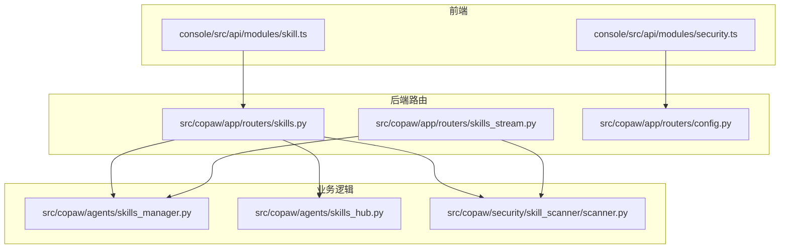
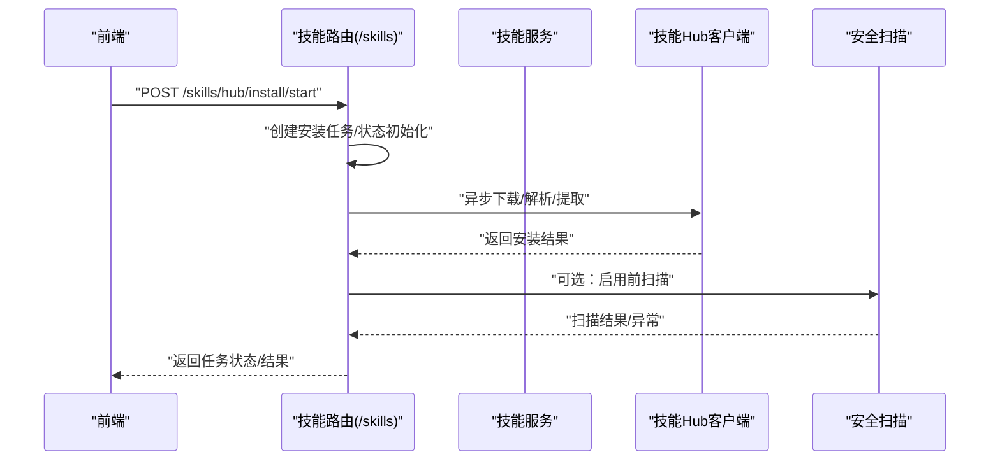
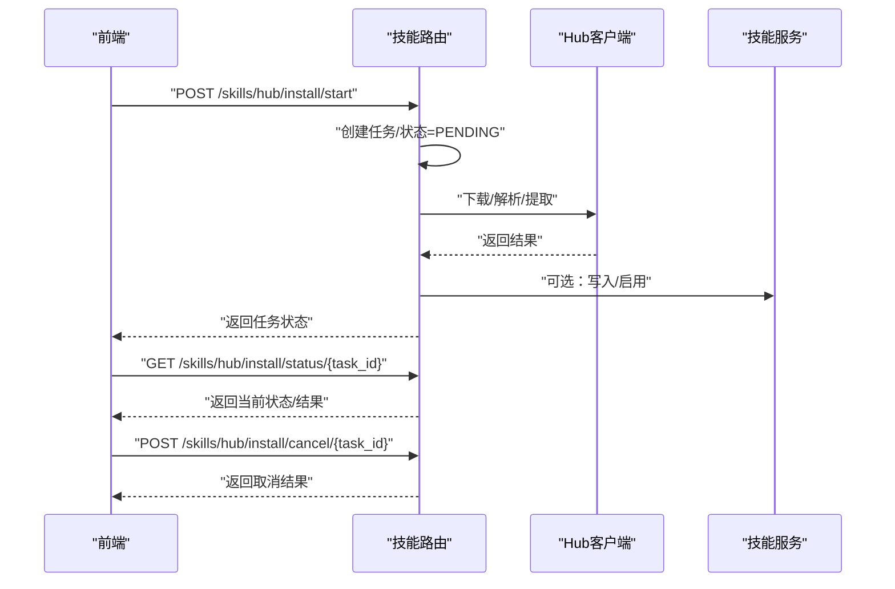
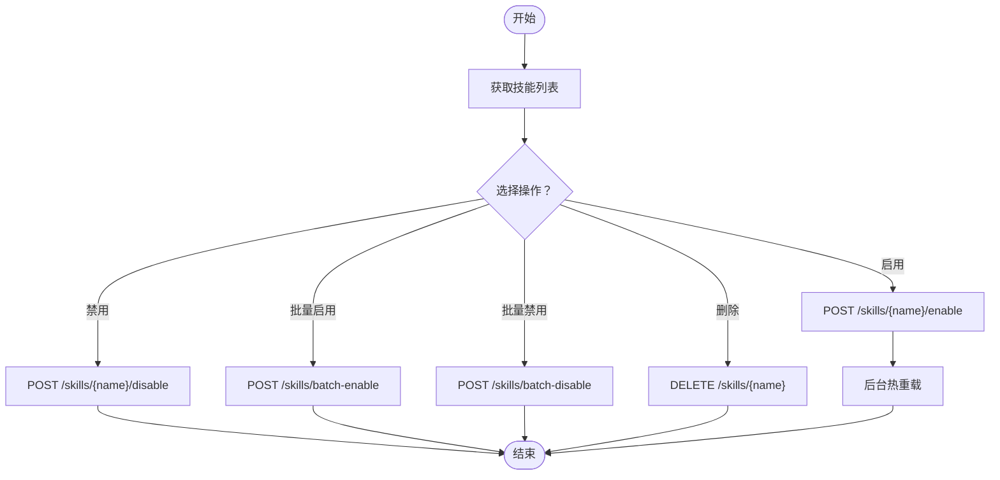
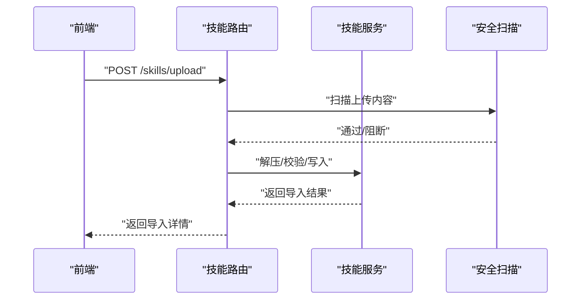
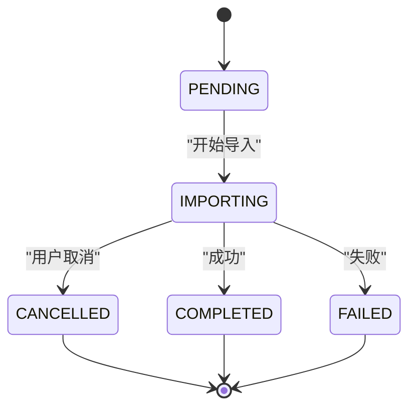
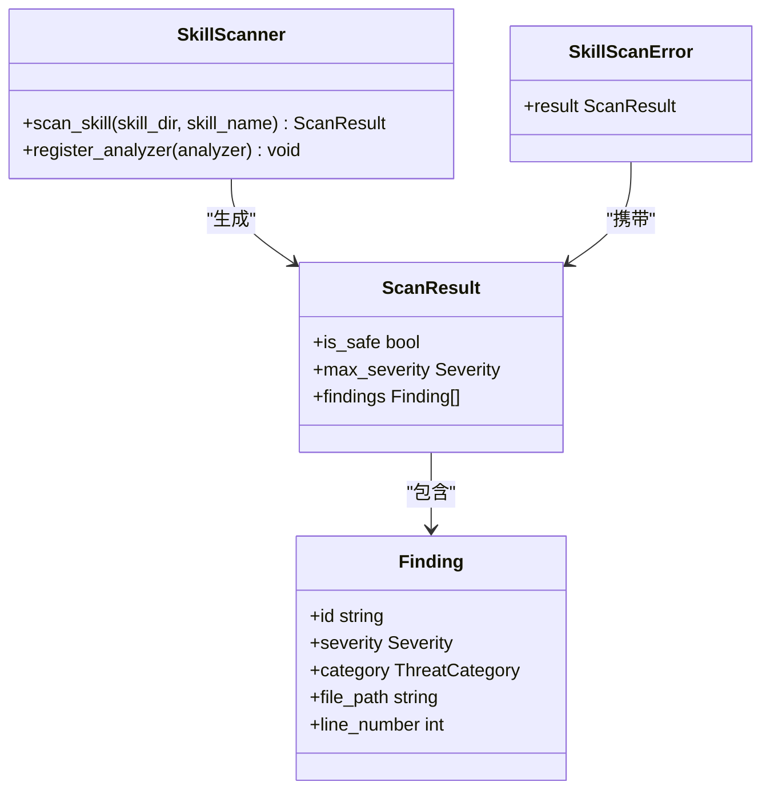
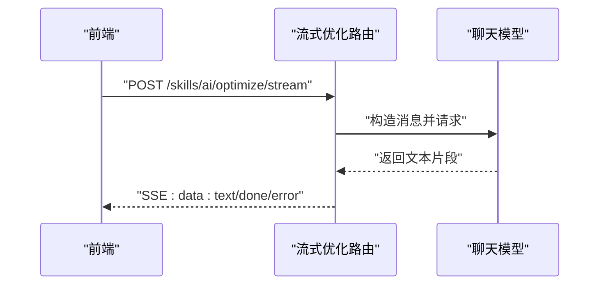
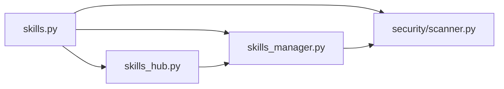

# 技能管理API

<cite>
**本文引用的文件**
- [src/copaw/app/routers/skills.py](file://src/copaw/app/routers/skills.py)
- [src/copaw/agents/skills_manager.py](file://src/copaw/agents/skills_manager.py)
- [src/copaw/agents/skills_hub.py](file://src/copaw/agents/skills_hub.py)
- [src/copaw/app/routers/skills_stream.py](file://src/copaw/app/routers/skills_stream.py)
- [src/copaw/app/routers/config.py](file://src/copaw/app/routers/config.py)
- [src/copaw/security/skill_scanner/scanner.py](file://src/copaw/security/skill_scanner/scanner.py)
- [src/copaw/security/skill_scanner/models.py](file://src/copaw/security/skill_scanner/models.py)
- [console/src/api/modules/skill.ts](file://console/src/api/modules/skill.ts)
- [console/src/api/modules/security.ts](file://console/src/api/modules/security.ts)
</cite>

## 目录
1. [简介](#简介)
2. [项目结构](#项目结构)
3. [核心组件](#核心组件)
4. [架构总览](#架构总览)
5. [详细组件分析](#详细组件分析)
6. [依赖分析](#依赖分析)
7. [性能考虑](#性能考虑)
8. [故障排除指南](#故障排除指南)
9. [结论](#结论)
10. [附录](#附录)

## 简介
本文件系统化梳理 CoPaw 的技能管理 API，覆盖技能搜索、安装、卸载、批量操作、配置管理、版本与依赖、安装进度监控、AI 辅助优化、权限与安全扫描、以及故障排除与错误处理。目标是帮助开发者与运维人员快速理解并正确使用技能管理能力。

## 项目结构
技能管理相关代码主要分布在以下模块：
- 后端 FastAPI 路由：技能列表、启用/禁用、批量操作、从 Hub 安装、上传 ZIP、文件读取、AI 优化流式接口
- 技能服务层：技能目录同步、创建、删除、启用/禁用、ZIP 导入
- 技能 Hub 客户端：搜索、版本解析、下载、取消、重试与超时控制
- 安全扫描：扫描器、结果模型、异常类型
- 前端 API 封装：技能与 Hub 相关的调用封装、SSE 流式优化

图表来源
- [src/copaw/app/routers/skills.py:119-753](file://src/copaw/app/routers/skills.py#L119-L753)
- [src/copaw/app/routers/skills_stream.py:166-245](file://src/copaw/app/routers/skills_stream.py#L166-L245)
- [src/copaw/app/routers/config.py:506-559](file://src/copaw/app/routers/config.py#L506-L559)
- [src/copaw/agents/skills_manager.py:654-1233](file://src/copaw/agents/skills_manager.py#L654-L1233)
- [src/copaw/agents/skills_hub.py:1-800](file://src/copaw/agents/skills_hub.py#L1-L800)
- [src/copaw/security/skill_scanner/scanner.py:76-319](file://src/copaw/security/skill_scanner/scanner.py#L76-L319)
- [console/src/api/modules/skill.ts:15-226](file://console/src/api/modules/skill.ts#L15-L226)
- [console/src/api/modules/security.ts:101-148](file://console/src/api/modules/security.ts#L101-L148)

章节来源
- [src/copaw/app/routers/skills.py:119-753](file://src/copaw/app/routers/skills.py#L119-L753)
- [src/copaw/agents/skills_manager.py:654-1233](file://src/copaw/agents/skills_manager.py#L654-L1233)
- [src/copaw/agents/skills_hub.py:1-800](file://src/copaw/agents/skills_hub.py#L1-L800)
- [src/copaw/security/skill_scanner/scanner.py:76-319](file://src/copaw/security/skill_scanner/scanner.py#L76-L319)
- [console/src/api/modules/skill.ts:15-226](file://console/src/api/modules/skill.ts#L15-L226)
- [console/src/api/modules/security.ts:101-148](file://console/src/api/modules/security.ts#L101-L148)

## 核心组件
- 技能路由与接口
  - 列表与可用技能查询、启用/禁用、批量启用/禁用、删除、上传 ZIP、Hub 搜索与安装、安装任务状态与取消、读取技能文件
- 技能服务
  - 技能目录结构、内置/定制化/激活目录管理、同步策略、创建/删除/启用/禁用、ZIP 导入校验
- 技能 Hub 客户端
  - 搜索、版本解析、文件拉取、取消、重试与超时、环境变量配置
- 安全扫描
  - 扫描器、结果模型、异常类型、白名单与策略
- 前端 API 封装
  - 技能 CRUD、Hub 搜索/安装、安装任务流式状态、SSE 优化流、安全扫描配置

章节来源
- [src/copaw/app/routers/skills.py:122-753](file://src/copaw/app/routers/skills.py#L122-L753)
- [src/copaw/agents/skills_manager.py:654-1233](file://src/copaw/agents/skills_manager.py#L654-L1233)
- [src/copaw/agents/skills_hub.py:1-800](file://src/copaw/agents/skills_hub.py#L1-L800)
- [src/copaw/security/skill_scanner/scanner.py:76-319](file://src/copaw/security/skill_scanner/scanner.py#L76-L319)
- [console/src/api/modules/skill.ts:15-226](file://console/src/api/modules/skill.ts#L15-L226)

## 架构总览
技能管理的端到端流程包括：前端发起请求 → 后端路由处理 → 业务服务执行 → 可选的安全扫描与 Hub 下载 → 返回结果或流式事件。

图表来源
- [src/copaw/app/routers/skills.py:391-452](file://src/copaw/app/routers/skills.py#L391-L452)
- [src/copaw/agents/skills_hub.py:226-335](file://src/copaw/agents/skills_hub.py#L226-L335)
- [src/copaw/security/skill_scanner/scanner.py:148-242](file://src/copaw/security/skill_scanner/scanner.py#L148-L242)

## 详细组件分析

### 技能搜索与 Hub 集成
- Hub 搜索
  - 方法：GET /skills/hub/search?q=&limit=
  - 行为：调用 Hub 客户端搜索函数，返回 HubSkillSpec 列表
- 安装方式
  - 单次安装：POST /skills/hub/install（阻塞直到完成）
  - 异步安装：POST /skills/hub/install/start（返回 HubInstallTask），GET /skills/hub/install/status/{task_id} 查询状态，POST /skills/hub/install/cancel/{task_id} 取消
- 取消机制
  - 使用线程 Event 实现取消；若任务已导入但被取消，会清理临时导入的技能目录
- 版本与来源
  - 支持指定版本与覆盖策略；安装成功后返回技能名称、启用状态与来源 URL

图表来源
- [src/copaw/app/routers/skills.py:391-452](file://src/copaw/app/routers/skills.py#L391-L452)
- [src/copaw/agents/skills_hub.py:226-335](file://src/copaw/agents/skills_hub.py#L226-L335)

章节来源
- [src/copaw/app/routers/skills.py:196-452](file://src/copaw/app/routers/skills.py#L196-L452)
- [src/copaw/agents/skills_hub.py:131-161](file://src/copaw/agents/skills_hub.py#L131-L161)

### 技能安装与卸载
- 列表与可用技能
  - GET /skills：列出全部技能（内置+定制化），标注是否已启用
  - GET /skills/available：仅列出已启用的技能
- 启用/禁用
  - POST /skills/{skill_name}/enable：复制内置或定制化技能到 active_skills，并触发后台热重载
  - POST /skills/{skill_name}/disable：从 active_skills 删除
- 批量操作
  - POST /skills/batch-enable：批量启用，遇到安全扫描阻断时返回 blocked 列表
  - POST /skills/batch-disable：批量禁用
- 删除
  - DELETE /skills/{skill_name}：仅删除定制化技能，内置不可删

图表来源
- [src/copaw/app/routers/skills.py:122-194](file://src/copaw/app/routers/skills.py#L122-L194)
- [src/copaw/app/routers/skills.py:591-714](file://src/copaw/app/routers/skills.py#L591-L714)

章节来源
- [src/copaw/app/routers/skills.py:122-194](file://src/copaw/app/routers/skills.py#L122-L194)
- [src/copaw/app/routers/skills.py:591-714](file://src/copaw/app/routers/skills.py#L591-L714)

### 技能创建、上传与文件读取
- 创建技能
  - POST /skills：以 SKILL.md 内容与可选 references/scripts 结构创建定制化技能
- 上传 ZIP
  - POST /skills/upload：支持 zip 文件上传，含 enable/overwrite 参数；内部进行安全扫描与校验
- 读取技能文件
  - GET /skills/{skill_name}/files/{source}/{file_path}：从内置或定制化源读取 references/scripts 下的文件内容

图表来源
- [src/copaw/app/routers/skills.py:463-514](file://src/copaw/app/routers/skills.py#L463-L514)
- [src/copaw/agents/skills_manager.py:556-652](file://src/copaw/agents/skills_manager.py#L556-L652)

章节来源
- [src/copaw/app/routers/skills.py:463-514](file://src/copaw/app/routers/skills.py#L463-L514)
- [src/copaw/app/routers/skills.py:716-753](file://src/copaw/app/routers/skills.py#L716-L753)

### 版本控制与依赖管理
- 内置技能版本
  - 通过 SKILL.md frontmatter 的 metadata.builtin_skill_version 字段识别版本
- 同步策略
  - active ← customized（定制化优先）；若定制化变更，更新 active
  - 若内置版本更高，则回滚/升级 active 中的内置技能
- ZIP 导入
  - 解析 zip 内容，校验 SKILL.md 必备字段，构建 references/scripts 树结构

章节来源
- [src/copaw/agents/skills_manager.py:169-189](file://src/copaw/agents/skills_manager.py#L169-L189)
- [src/copaw/agents/skills_manager.py:210-287](file://src/copaw/agents/skills_manager.py#L210-L287)
- [src/copaw/agents/skills_manager.py:290-368](file://src/copaw/agents/skills_manager.py#L290-L368)

### 安装进度监控与状态查询
- 任务模型
  - HubInstallTask：包含 task_id、bundle_url、version、enable、overwrite、status、error、result、时间戳
- 状态流转
  - PENDING → IMPORTING → COMPLETED/FAILED/CANCELLED
- 接口
  - POST /skills/hub/install/start：创建任务
  - GET /skills/hub/install/status/{task_id}：查询状态
  - POST /skills/hub/install/cancel/{task_id}：取消任务

图表来源
- [src/copaw/app/routers/skills.py:92-111](file://src/copaw/app/routers/skills.py#L92-L111)
- [src/copaw/app/routers/skills.py:424-452](file://src/copaw/app/routers/skills.py#L424-L452)

章节来源
- [src/copaw/app/routers/skills.py:92-111](file://src/copaw/app/routers/skills.py#L92-L111)
- [src/copaw/app/routers/skills.py:391-452](file://src/copaw/app/routers/skills.py#L391-L452)

### 技能开发与发布规范
- 开发建议
  - 使用 SKILL.md frontmatter 提供 name 与 description
  - references/scripts 目录用于组织资源与脚本，支持嵌套结构
  - 发布前确保通过安全扫描，避免高危/严重级别问题
- 发布路径
  - 通过 Hub 客户端支持多源（ClawHub、Skills.sh、SkillsMP、LobeHub、ModelScope 等）
  - 支持指定版本与覆盖策略

章节来源
- [src/copaw/agents/skills_manager.py:726-800](file://src/copaw/agents/skills_manager.py#L726-L800)
- [src/copaw/agents/skills_hub.py:723-800](file://src/copaw/agents/skills_hub.py#L723-L800)

### 权限控制与访问限制
- 认证与授权
  - 控制台支持可选 Web 登录认证（默认关闭），通过 COPAW_AUTH_ENABLED 启用
  - 本地请求（127.0.0.1 / ::1）自动跳过认证
- API 访问
  - 前端通过带令牌的请求头访问后端 API
  - 安全扫描配置与白名单通过 /config/security/skill-scanner 管理

章节来源
- [console/src/api/modules/security.ts:101-148](file://console/src/api/modules/security.ts#L101-L148)
- [src/copaw/app/routers/config.py:506-559](file://src/copaw/app/routers/config.py#L506-L559)

### 安全扫描与白名单
- 扫描器
  - 默认启用 PatternAnalyzer；可按策略配置文件分类、最大文件数/大小、去重策略
- 结果模型
  - Finding/ScanResult；Severity 分级、威胁类别、定位信息
- 异常
  - SkillScanError：当扫描结果达到阻断阈值时抛出
- 白名单
  - 支持按技能名与内容哈希加入/移除白名单；白名单条目失效后需重新扫描

图表来源
- [src/copaw/security/skill_scanner/scanner.py:76-319](file://src/copaw/security/skill_scanner/scanner.py#L76-L319)
- [src/copaw/security/skill_scanner/models.py:16-235](file://src/copaw/security/skill_scanner/models.py#L16-L235)
- [src/copaw/security/skill_scanner/__init__.py:393-422](file://src/copaw/security/skill_scanner/__init__.py#L393-L422)

章节来源
- [src/copaw/security/skill_scanner/scanner.py:76-319](file://src/copaw/security/skill_scanner/scanner.py#L76-L319)
- [src/copaw/security/skill_scanner/models.py:16-235](file://src/copaw/security/skill_scanner/models.py#L16-L235)
- [src/copaw/app/routers/config.py:506-559](file://src/copaw/app/routers/config.py#L506-L559)

### AI 辅助优化与流式接口
- 接口
  - POST /skills/ai/optimize/stream：接收当前技能内容与语言偏好，返回 SSE 流式优化文本
- 语言支持
  - en、zh、ru 系统提示词模板
- 错误处理
  - 无模型配置时返回错误消息；异常统一捕获并以 SSE 形式返回

图表来源
- [src/copaw/app/routers/skills_stream.py:166-245](file://src/copaw/app/routers/skills_stream.py#L166-L245)
- [console/src/api/modules/skill.ts:127-189](file://console/src/api/modules/skill.ts#L127-L189)

章节来源
- [src/copaw/app/routers/skills_stream.py:166-245](file://src/copaw/app/routers/skills_stream.py#L166-L245)
- [console/src/api/modules/skill.ts:127-189](file://console/src/api/modules/skill.ts#L127-L189)

## 依赖分析
- 组件耦合
  - 路由层依赖技能服务与 Hub 客户端；安全扫描作为可选前置步骤
  - 技能服务负责目录树与同步策略；Hub 客户端负责网络与版本解析
- 外部依赖
  - HTTP 客户端、urllib、zipfile、frontmatter、yaml、packaging.Version
- 循环依赖
  - 未见循环导入；各模块职责清晰

图表来源
- [src/copaw/app/routers/skills.py:13-22](file://src/copaw/app/routers/skills.py#L13-L22)
- [src/copaw/agents/skills_manager.py:654-712](file://src/copaw/agents/skills_manager.py#L654-L712)
- [src/copaw/agents/skills_hub.py:25-26](file://src/copaw/agents/skills_hub.py#L25-L26)
- [src/copaw/security/skill_scanner/scanner.py:24-27](file://src/copaw/security/skill_scanner/scanner.py#L24-L27)

章节来源
- [src/copaw/app/routers/skills.py:13-22](file://src/copaw/app/routers/skills.py#L13-L22)
- [src/copaw/agents/skills_manager.py:654-712](file://src/copaw/agents/skills_manager.py#L654-L712)
- [src/copaw/agents/skills_hub.py:25-26](file://src/copaw/agents/skills_hub.py#L25-L26)
- [src/copaw/security/skill_scanner/scanner.py:24-27](file://src/copaw/security/skill_scanner/scanner.py#L24-L27)

## 性能考虑
- ZIP 与文件大小限制
  - 上传 ZIP 最大 100MB；解压后未压缩总大小上限 200MB
- 文件发现与扫描
  - 默认最多扫描 500 个文件，单文件最大 10MB；可通过策略调整
- 异步安装
  - 使用 asyncio.Task 与锁保证并发安全；取消事件避免资源泄漏
- 热重载
  - 后台异步触发 agent 重载，避免阻塞请求

章节来源
- [src/copaw/app/routers/skills.py:455-461](file://src/copaw/app/routers/skills.py#L455-L461)
- [src/copaw/agents/skills_manager.py:548-577](file://src/copaw/agents/skills_manager.py#L548-L577)
- [src/copaw/security/skill_scanner/scanner.py:72-74](file://src/copaw/security/skill_scanner/scanner.py#L72-L74)
- [src/copaw/app/routers/skills.py:613-691](file://src/copaw/app/routers/skills.py#L613-L691)

## 故障排除指南
- 安全扫描阻断
  - 现象：启用/创建/安装返回 422，包含 blocked_skills 列表
  - 处理：根据 findings 调整技能内容，必要时加入白名单或降低风险
- Hub 安装失败
  - 现象：400/502；可能由于 bundle_url 不合法、上游限速或网络错误
  - 处理：检查 URL、设置 GITHUB_TOKEN、重试或切换版本
- 取消后残留
  - 现象：任务被取消但目录存在
  - 处理：框架会尝试清理；若失败，手动删除 active/customized 对应目录
- 无模型配置
  - 现象：SSE 优化返回错误
  - 处理：在设置中配置可用的聊天模型

章节来源
- [src/copaw/app/routers/skills.py:28-50](file://src/copaw/app/routers/skills.py#L28-L50)
- [src/copaw/app/routers/skills.py:362-382](file://src/copaw/app/routers/skills.py#L362-L382)
- [src/copaw/app/routers/skills.py:248-261](file://src/copaw/app/routers/skills.py#L248-L261)
- [src/copaw/app/routers/skills_stream.py:181-190](file://src/copaw/app/routers/skills_stream.py#L181-L190)

## 结论
本文件提供了 CoPaw 技能管理 API 的完整规范与实现要点，涵盖搜索、安装、卸载、批量操作、Hub 集成、版本与依赖、进度监控、AI 优化、权限与安全扫描、以及故障排除。建议在生产环境中结合安全扫描策略与白名单机制，确保技能引入的安全性与可控性。

## 附录

### API 端点一览（后端）
- GET /skills
- GET /skills/available
- POST /skills
- POST /skills/{skill_name}/enable
- POST /skills/{skill_name}/disable
- POST /skills/batch-enable
- POST /skills/batch-disable
- DELETE /skills/{skill_name}
- POST /skills/upload
- GET /skills/{skill_name}/files/{source}/{file_path}
- GET /skills/hub/search
- POST /skills/hub/install
- POST /skills/hub/install/start
- GET /skills/hub/install/status/{task_id}
- POST /skills/hub/install/cancel/{task_id}
- POST /skills/ai/optimize/stream

章节来源
- [src/copaw/app/routers/skills.py:122-753](file://src/copaw/app/routers/skills.py#L122-L753)
- [src/copaw/app/routers/skills_stream.py:166-245](file://src/copaw/app/routers/skills_stream.py#L166-L245)

### 前端调用示例（参考）
- 列表/创建/启用/禁用/批量/删除/Hub 搜索/安装/状态/取消/SSE 优化/上传
- 参考路径：console/src/api/modules/skill.ts

章节来源
- [console/src/api/modules/skill.ts:15-226](file://console/src/api/modules/skill.ts#L15-L226)