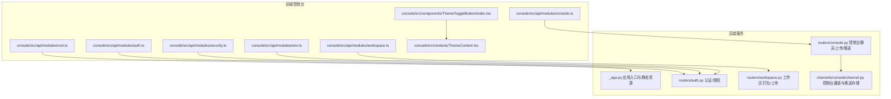
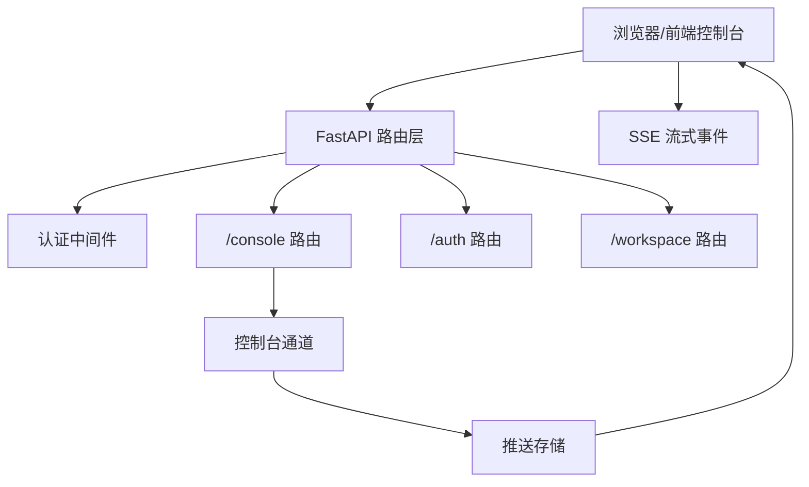
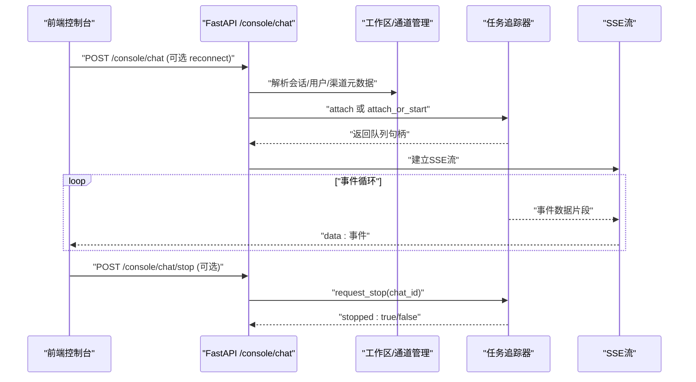
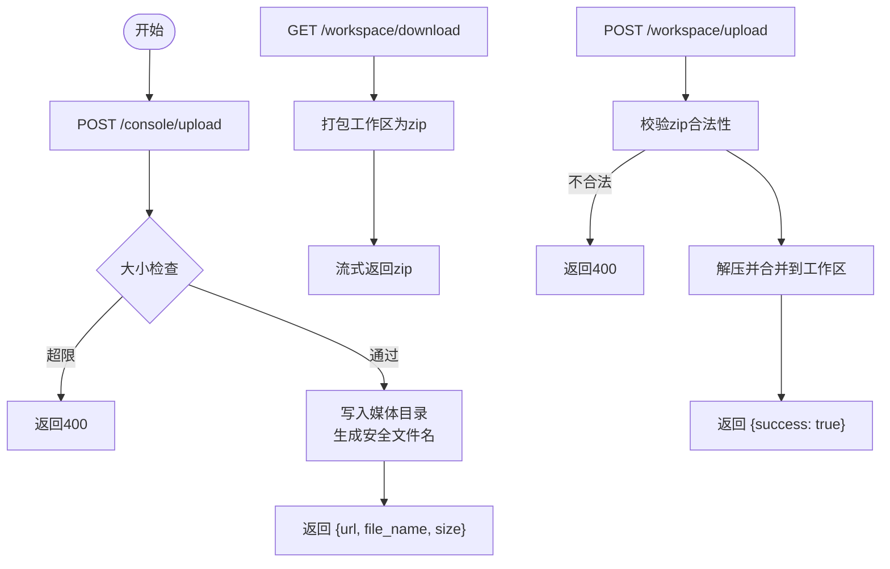
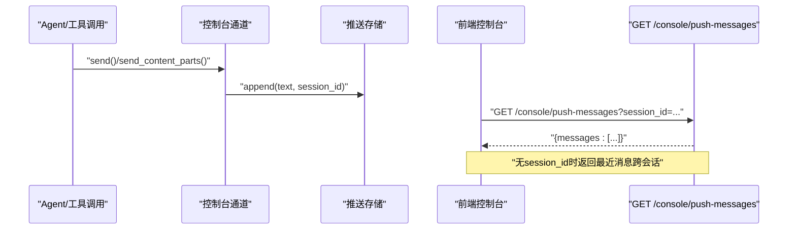
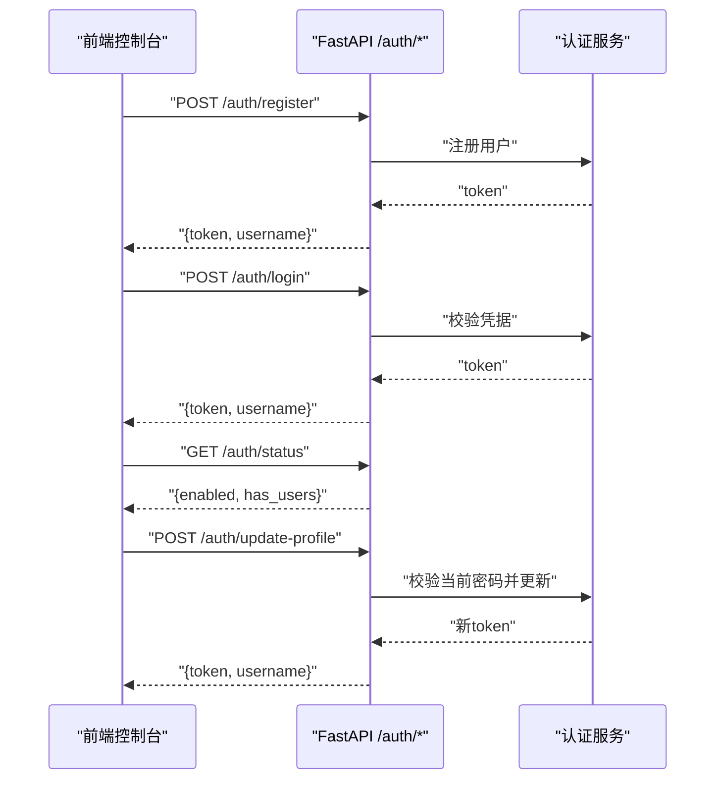
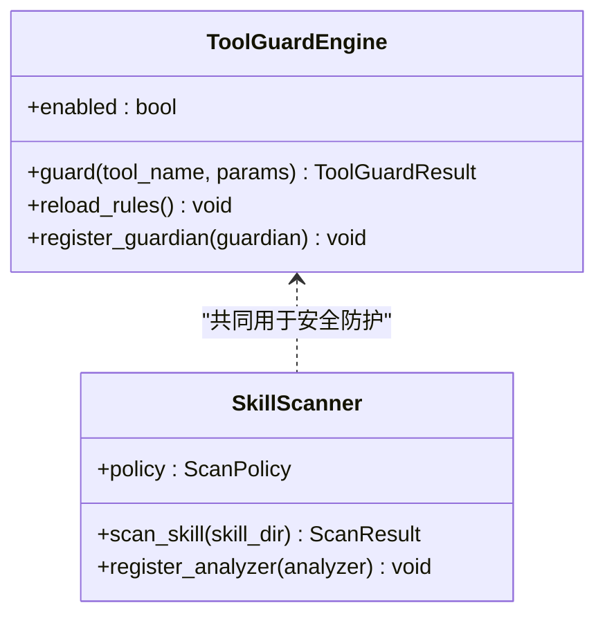
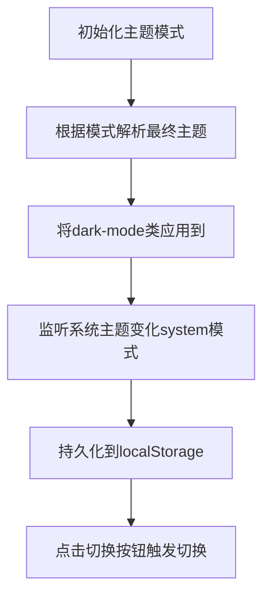
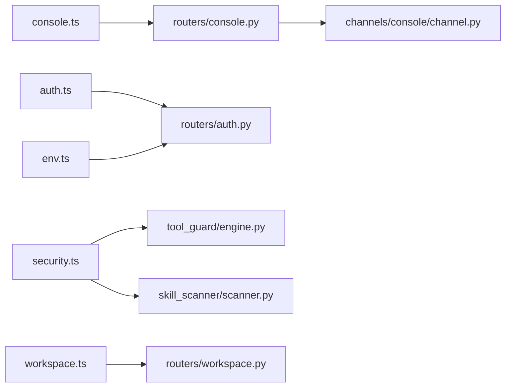

# 控制台API

<cite>
**本文引用的文件**
- [console/src/api/modules/console.ts](file://console/src/api/modules/console.ts)
- [src/copaw/app/routers/console.py](file://src/copaw/app/routers/console.py)
- [src/copaw/app/channels/console/channel.py](file://src/copaw/app/channels/console/channel.py)
- [console/src/api/modules/auth.ts](file://console/src/api/modules/auth.ts)
- [src/copaw/app/routers/auth.py](file://src/copaw/app/routers/auth.py)
- [console/src/api/modules/security.ts](file://console/src/api/modules/security.ts)
- [src/copaw/security/tool_guard/engine.py](file://src/copaw/security/tool_guard/engine.py)
- [src/copaw/security/skill_scanner/scanner.py](file://src/copaw/security/skill_scanner/scanner.py)
- [console/src/api/modules/workspace.ts](file://console/src/api/modules/workspace.ts)
- [src/copaw/app/routers/workspace.py](file://src/copaw/app/routers/workspace.py)
- [console/src/api/modules/env.ts](file://console/src/api/modules/env.ts)
- [console/src/components/ThemeToggleButton/index.tsx](file://console/src/components/ThemeToggleButton/index.tsx)
- [console/src/contexts/ThemeContext.tsx](file://console/src/contexts/ThemeContext.tsx)
- [console/src/api/modules/root.ts](file://console/src/api/modules/root.ts)
- [src/copaw/app/_app.py](file://src/copaw/app/_app.py)
</cite>

## 目录
1. [简介](#简介)
2. [项目结构](#项目结构)
3. [核心组件](#核心组件)
4. [架构总览](#架构总览)
5. [详细组件分析](#详细组件分析)
6. [依赖分析](#依赖分析)
7. [性能考虑](#性能考虑)
8. [故障排查指南](#故障排查指南)
9. [结论](#结论)
10. [附录](#附录)

## 简介
本文件面向CoPaw控制台（Web Console）的API与功能，系统性梳理以下能力：
- 控制台配置、状态查询与远程控制接口
- 控制台推送机制与实时状态同步API
- 权限管理与访问控制接口
- 主题定制与个性化配置API
- 日志收集与错误上报机制
- 扩展与插件管理接口

目标是帮助开发者与运维人员快速理解前后端交互方式、安全策略、实时通信与个性化设置，并提供可操作的排障建议。

## 项目结构
控制台API由两部分组成：
- 前端模块：位于console/src/api/modules，封装HTTP请求与类型定义
- 后端路由：位于src/copaw/app/routers，提供REST与流式接口

图表来源
- [console/src/api/modules/console.ts:1-12](file://console/src/api/modules/console.ts#L1-L12)
- [src/copaw/app/routers/console.py:1-247](file://src/copaw/app/routers/console.py#L1-L247)
- [src/copaw/app/channels/console/channel.py:457-505](file://src/copaw/app/channels/console/channel.py#L457-L505)
- [console/src/api/modules/auth.ts:1-75](file://console/src/api/modules/auth.ts#L1-L75)
- [src/copaw/app/routers/auth.py:1-175](file://src/copaw/app/routers/auth.py#L1-L175)
- [console/src/api/modules/workspace.ts:1-149](file://console/src/api/modules/workspace.ts#L1-L149)
- [src/copaw/app/routers/workspace.py:1-203](file://src/copaw/app/routers/workspace.py#L1-L203)
- [console/src/api/modules/env.ts:1-19](file://console/src/api/modules/env.ts#L1-L19)
- [console/src/components/ThemeToggleButton/index.tsx:1-29](file://console/src/components/ThemeToggleButton/index.tsx#L1-L29)
- [console/src/contexts/ThemeContext.tsx:1-105](file://console/src/contexts/ThemeContext.tsx#L1-L105)
- [src/copaw/app/_app.py:308-411](file://src/copaw/app/_app.py#L308-L411)

章节来源
- [src/copaw/app/_app.py:308-411](file://src/copaw/app/_app.py#L308-L411)
- [console/src/api/modules/root.ts:1-8](file://console/src/api/modules/root.ts#L1-L8)

## 核心组件
- 控制台聊天与流式响应：支持SSE流式输出、断线重连、停止会话
- 文件上传与下载：支持媒体文件上传、受控路径访问与工作区打包/解包
- 推送消息：控制台通道将文本内容推送到前端消息队列，前端轮询获取
- 权限与认证：登录/注册/状态检查/令牌校验/更新资料
- 安全策略：工具调用守卫与技能扫描器配置与历史
- 主题与个性化：本地主题偏好、暗/亮模式切换
- 日志与版本：应用根路径与版本查询

章节来源
- [src/copaw/app/routers/console.py:68-247](file://src/copaw/app/routers/console.py#L68-L247)
- [console/src/api/modules/console.ts:1-12](file://console/src/api/modules/console.ts#L1-L12)
- [console/src/api/modules/auth.ts:1-75](file://console/src/api/modules/auth.ts#L1-L75)
- [src/copaw/app/routers/auth.py:42-175](file://src/copaw/app/routers/auth.py#L42-L175)
- [console/src/api/modules/security.ts:77-149](file://console/src/api/modules/security.ts#L77-L149)
- [src/copaw/security/tool_guard/engine.py:53-238](file://src/copaw/security/tool_guard/engine.py#L53-L238)
- [src/copaw/security/skill_scanner/scanner.py:76-319](file://src/copaw/security/skill_scanner/scanner.py#L76-L319)
- [console/src/contexts/ThemeContext.tsx:1-105](file://console/src/contexts/ThemeContext.tsx#L1-L105)
- [console/src/components/ThemeToggleButton/index.tsx:1-29](file://console/src/components/ThemeToggleButton/index.tsx#L1-L29)
- [console/src/api/modules/workspace.ts:1-149](file://console/src/api/modules/workspace.ts#L1-L149)
- [src/copaw/app/routers/workspace.py:112-203](file://src/copaw/app/routers/workspace.py#L112-L203)
- [console/src/api/modules/env.ts:1-19](file://console/src/api/modules/env.ts#L1-L19)

## 架构总览
控制台API采用“前端模块 + 后端FastAPI路由”的分层设计，结合通道与推送存储实现控制台消息的实时推送；认证中间件保障访问安全；工作区路由提供打包/上传能力；主题上下文负责前端个性化。

图表来源
- [src/copaw/app/routers/console.py:21-247](file://src/copaw/app/routers/console.py#L21-L247)
- [src/copaw/app/channels/console/channel.py:457-505](file://src/copaw/app/channels/console/channel.py#L457-L505)
- [src/copaw/app/_app.py:250-266](file://src/copaw/app/_app.py#L250-L266)

## 详细组件分析

### 控制台聊天与流式响应
- 功能要点
  - POST /console/chat：接收Agent请求格式，启动或附加到运行中的任务流，返回SSE流
  - POST /console/chat/stop：按chat_id停止运行中的对话
  - GET /console/push-messages：拉取最近推送消息（可按session_id消费）
- 实时机制
  - 通过任务追踪器在后台持续运行，前端使用SSE订阅事件
  - 支持断线重连（reconnect参数），自动附加到现有队列
- 错误处理
  - 异常时向客户端发送包含错误信息的事件
  - 未找到通道或会话时返回HTTP 4xx/5xx

图表来源
- [src/copaw/app/routers/console.py:68-167](file://src/copaw/app/routers/console.py#L68-L167)

章节来源
- [src/copaw/app/routers/console.py:68-167](file://src/copaw/app/routers/console.py#L68-L167)
- [console/src/api/modules/console.ts:8-11](file://console/src/api/modules/console.ts#L8-L11)

### 文件上传与下载（聊天附件与工作区）
- 文件上传（聊天附件）
  - POST /console/upload：限制最大大小，保存至控制台媒体目录，返回文件名与大小
  - GET /console/files/{agent_id}/{filename}：受控路径访问已上传文件
- 工作区打包/上传
  - GET /workspace/download：将工作区打包为zip并流式返回
  - POST /workspace/upload：校验zip安全性并合并到工作区

图表来源
- [src/copaw/app/routers/console.py:169-229](file://src/copaw/app/routers/console.py#L169-L229)
- [src/copaw/app/routers/workspace.py:112-203](file://src/copaw/app/routers/workspace.py#L112-L203)

章节来源
- [src/copaw/app/routers/console.py:169-229](file://src/copaw/app/routers/console.py#L169-L229)
- [src/copaw/app/routers/workspace.py:112-203](file://src/copaw/app/routers/workspace.py#L112-L203)
- [console/src/api/modules/workspace.ts:61-114](file://console/src/api/modules/workspace.ts#L61-L114)

### 控制台推送机制与实时状态同步
- 后端推送
  - 控制台通道在发送文本或内容片段时，将内容写入推送存储（按session_id）
- 前端拉取
  - 前端轮询 /console/push-messages 获取最近消息；若带session_id则消费对应会话的消息
- 使用场景
  - 远程控制执行过程中的状态提示、进度摘要、关键信息推送

图表来源
- [src/copaw/app/channels/console/channel.py:457-505](file://src/copaw/app/channels/console/channel.py#L457-L505)
- [src/copaw/app/routers/console.py:232-247](file://src/copaw/app/routers/console.py#L232-L247)
- [console/src/api/modules/console.ts:8-11](file://console/src/api/modules/console.ts#L8-L11)

章节来源
- [src/copaw/app/channels/console/channel.py:457-505](file://src/copaw/app/channels/console/channel.py#L457-L505)
- [src/copaw/app/routers/console.py:232-247](file://src/copaw/app/routers/console.py#L232-L247)
- [console/src/api/modules/console.ts:3-11](file://console/src/api/modules/console.ts#L3-L11)

### 权限管理与访问控制
- 登录/注册/状态
  - POST /auth/login：用户名密码登录，返回token
  - POST /auth/register：首次注册单用户账号
  - GET /auth/status：检查是否启用认证与是否存在用户
  - GET /auth/verify：校验Bearer令牌有效性
  - POST /auth/update-profile：更新用户名/密码
- 前端封装
  - 提供登录、注册、状态查询、更新资料等方法
- 安全注意
  - 首次注册仅允许一次；空用户名/密码将被拒绝
  - 更新资料需提供当前密码进行验证

图表来源
- [src/copaw/app/routers/auth.py:42-175](file://src/copaw/app/routers/auth.py#L42-L175)
- [console/src/api/modules/auth.ts:14-75](file://console/src/api/modules/auth.ts#L14-L75)

章节来源
- [src/copaw/app/routers/auth.py:42-175](file://src/copaw/app/routers/auth.py#L42-L175)
- [console/src/api/modules/auth.ts:14-75](file://console/src/api/modules/auth.ts#L14-L75)

### 安全策略：工具守卫与技能扫描
- 工具守卫（Tool Guard）
  - 统一编排多个守护者（规则/路径），对工具调用参数进行预检
  - 可动态启用/禁用、重载规则、按工具白/黑名单控制
- 技能扫描（Skill Scanner）
  - 扫描技能包文件，基于策略与规则分析潜在风险
  - 支持白名单、超时、文件数量/大小限制、去重策略
- 控制台配置
  - 前端提供读取/更新工具守卫、文件守卫、技能扫描器配置的API
  - 支持查看/清空/删除扫描阻断历史，添加/移除白名单条目

图表来源
- [src/copaw/security/tool_guard/engine.py:53-238](file://src/copaw/security/tool_guard/engine.py#L53-L238)
- [src/copaw/security/skill_scanner/scanner.py:76-319](file://src/copaw/security/skill_scanner/scanner.py#L76-L319)
- [console/src/api/modules/security.ts:77-149](file://console/src/api/modules/security.ts#L77-L149)

章节来源
- [src/copaw/security/tool_guard/engine.py:53-238](file://src/copaw/security/tool_guard/engine.py#L53-L238)
- [src/copaw/security/skill_scanner/scanner.py:76-319](file://src/copaw/security/skill_scanner/scanner.py#L76-L319)
- [console/src/api/modules/security.ts:77-149](file://console/src/api/modules/security.ts#L77-L149)

### 主题定制与个性化配置
- 前端主题上下文
  - 支持 light/dark/system三种模式，持久化到localStorage
  - 监听系统主题变化（当模式为system时）
  - 将最终主题应用于<html>元素以驱动CSS变量
- 主题切换按钮
  - 显示太阳/月亮图标，提示切换到浅色/深色模式
- 个性化建议
  - 可扩展为支持更多主题变量与语言切换

图表来源
- [console/src/contexts/ThemeContext.tsx:51-100](file://console/src/contexts/ThemeContext.tsx#L51-L100)
- [console/src/components/ThemeToggleButton/index.tsx:11-28](file://console/src/components/ThemeToggleButton/index.tsx#L11-L28)

章节来源
- [console/src/contexts/ThemeContext.tsx:1-105](file://console/src/contexts/ThemeContext.tsx#L1-L105)
- [console/src/components/ThemeToggleButton/index.tsx:1-29](file://console/src/components/ThemeToggleButton/index.tsx#L1-L29)

### 环境变量与系统配置
- 列表与批量保存环境变量
  - GET /envs：列出所有环境变量
  - PUT /envs：批量替换全部环境变量
  - DELETE /envs/{key}：删除指定键
- 使用场景
  - 在控制台中统一管理敏感配置与运行参数

章节来源
- [console/src/api/modules/env.ts:4-19](file://console/src/api/modules/env.ts#L4-L19)

### 版本与根路径
- GET /：返回控制台页面或提示（需先构建前端）
- GET /api/version：返回当前版本号

章节来源
- [src/copaw/app/_app.py:308-327](file://src/copaw/app/_app.py#L308-L327)
- [console/src/api/modules/root.ts:4-7](file://console/src/api/modules/root.ts#L4-L7)

## 依赖分析
- 前端模块与后端路由一一对应，遵循REST风格
- 控制台聊天依赖通道与任务追踪器，形成“通道-存储-前端”的闭环
- 认证中间件贯穿所有受保护路由
- 工作区路由与文件系统交互，严格校验zip安全性

图表来源
- [console/src/api/modules/console.ts:1-12](file://console/src/api/modules/console.ts#L1-L12)
- [src/copaw/app/routers/console.py:1-247](file://src/copaw/app/routers/console.py#L1-L247)
- [console/src/api/modules/auth.ts:1-75](file://console/src/api/modules/auth.ts#L1-L75)
- [src/copaw/app/routers/auth.py:1-175](file://src/copaw/app/routers/auth.py#L1-L175)
- [console/src/api/modules/security.ts:1-149](file://console/src/api/modules/security.ts#L1-L149)
- [src/copaw/security/tool_guard/engine.py:1-238](file://src/copaw/security/tool_guard/engine.py#L1-L238)
- [src/copaw/security/skill_scanner/scanner.py:1-319](file://src/copaw/security/skill_scanner/scanner.py#L1-L319)
- [console/src/api/modules/workspace.ts:1-149](file://console/src/api/modules/workspace.ts#L1-L149)
- [src/copaw/app/routers/workspace.py:1-203](file://src/copaw/app/routers/workspace.py#L1-L203)
- [console/src/api/modules/env.ts:1-19](file://console/src/api/modules/env.ts#L1-L19)
- [src/copaw/app/channels/console/channel.py:457-505](file://src/copaw/app/channels/console/channel.py#L457-L505)

## 性能考虑
- SSE流式传输避免一次性大响应，适合长任务与实时反馈
- 文件上传/下载采用流式处理，减少内存占用
- 工作区打包/上传在子线程执行，避免阻塞主事件循环
- 主题切换仅影响DOM样式，开销极低

## 故障排查指南
- 控制台聊天
  - 若返回“通道未找到”，确认控制台通道已启用且可用
  - 断线重连失败：检查reconnect参数与chat_id是否匹配
  - 流异常：关注服务端日志中的“Console chat stream error”
- 文件上传/下载
  - 上传失败：检查文件大小与类型限制
  - 下载为空：确认工作区目录存在且可读
  - 文件访问404：确认文件名安全校验与相对路径约束
- 认证问题
  - 登录失败：核对用户名/密码与认证开关
  - 更新资料失败：确认当前密码正确且未传空值
- 主题问题
  - 模式未生效：检查localStorage写入与<html>类名应用
- 版本/根路径
  - 控制台不可用：先在console目录执行构建，再重启服务

章节来源
- [src/copaw/app/routers/console.py:82-151](file://src/copaw/app/routers/console.py#L82-L151)
- [src/copaw/app/routers/console.py:169-229](file://src/copaw/app/routers/console.py#L169-L229)
- [src/copaw/app/routers/workspace.py:126-203](file://src/copaw/app/routers/workspace.py#L126-L203)
- [src/copaw/app/routers/auth.py:42-175](file://src/copaw/app/routers/auth.py#L42-L175)
- [console/src/contexts/ThemeContext.tsx:57-77](file://console/src/contexts/ThemeContext.tsx#L57-L77)
- [src/copaw/app/_app.py:308-327](file://src/copaw/app/_app.py#L308-L327)

## 结论
本文档从架构、组件、数据流与安全等多个维度梳理了CoPaw控制台API，明确了实时推送、认证授权、工作区管理、主题个性化与安全策略的实现方式与使用方法。建议在生产环境中：
- 启用认证并限制首次注册
- 对上传文件与工作区zip进行严格校验
- 使用SSE时处理好断线重连与错误恢复
- 通过工具守卫与技能扫描器持续加固运行时安全

## 附录
- 常用端点速查
  - 控制台聊天：POST /console/chat、POST /console/chat/stop、GET /console/push-messages
  - 文件：POST /console/upload、GET /console/files/{agent_id}/{filename}
  - 工作区：GET /workspace/download、POST /workspace/upload
  - 认证：POST /auth/login、POST /auth/register、GET /auth/status、GET /auth/verify、POST /auth/update-profile
  - 安全：GET/PUT 配置工具守卫/文件守卫/技能扫描器；管理阻断历史与白名单
  - 环境：GET /envs、PUT /envs、DELETE /envs/{key}
  - 其他：GET /、GET /api/version