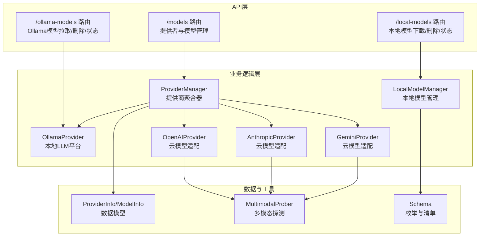
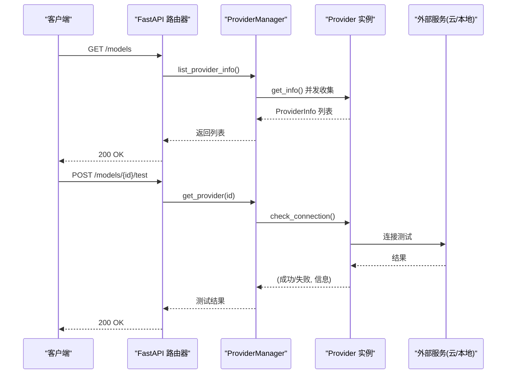
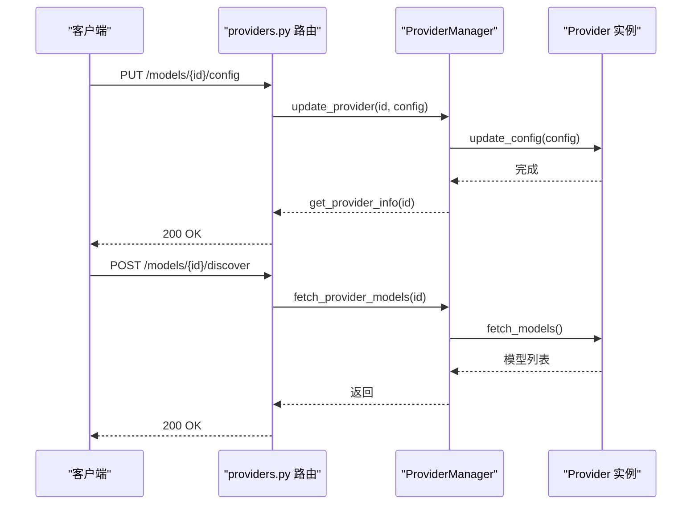
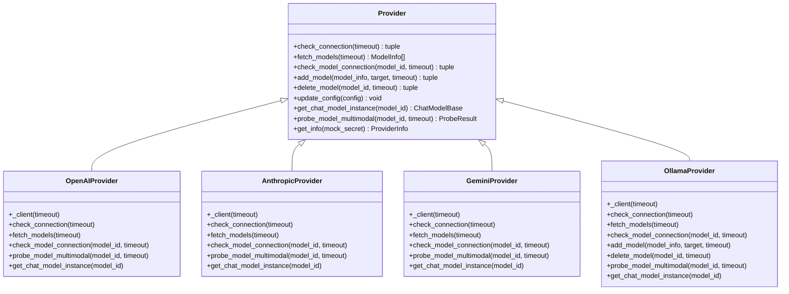
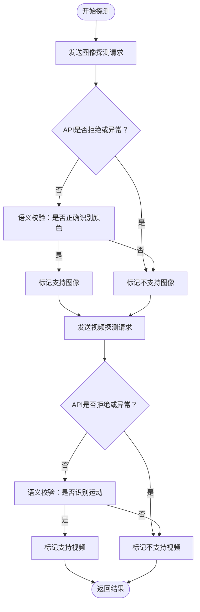
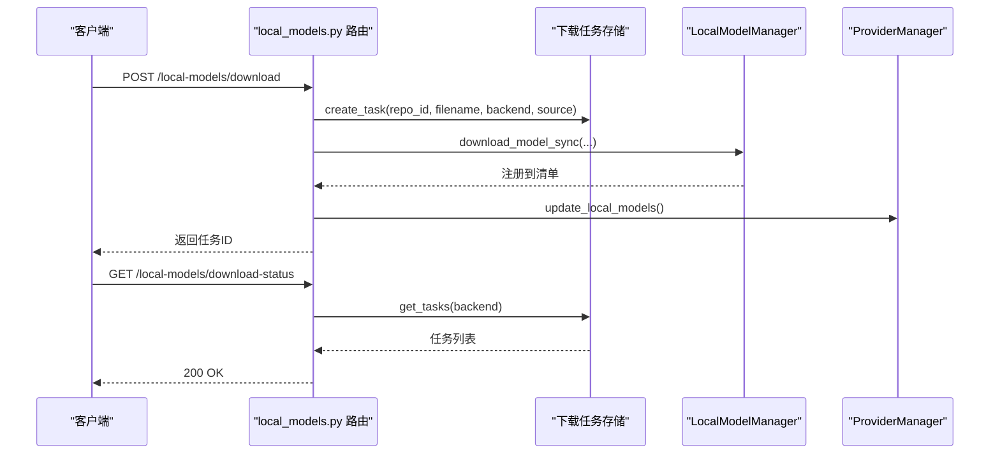
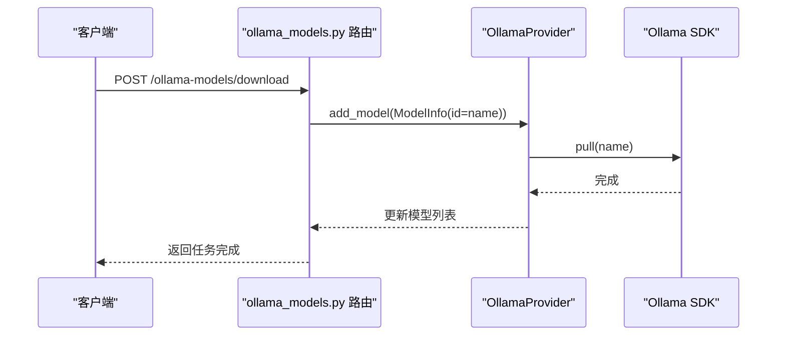
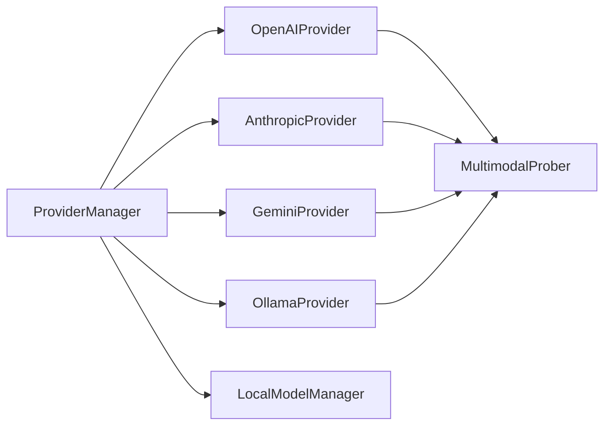

# 模型提供商API

<cite>
**本文档引用的文件**
- [src/copaw/app/routers/providers.py](file://src/copaw/app/routers/providers.py)
- [src/copaw/providers/provider_manager.py](file://src/copaw/providers/provider_manager.py)
- [src/copaw/providers/provider.py](file://src/copaw/providers/provider.py)
- [src/copaw/providers/models.py](file://src/copaw/providers/models.py)
- [src/copaw/providers/openai_provider.py](file://src/copaw/providers/openai_provider.py)
- [src/copaw/providers/anthropic_provider.py](file://src/copaw/providers/anthropic_provider.py)
- [src/copaw/providers/gemini_provider.py](file://src/copaw/providers/gemini_provider.py)
- [src/copaw/providers/ollama_provider.py](file://src/copaw/providers/ollama_provider.py)
- [src/copaw/providers/multimodal_prober.py](file://src/copaw/providers/multimodal_prober.py)
- [src/copaw/local_models/manager.py](file://src/copaw/local_models/manager.py)
- [src/copaw/local_models/schema.py](file://src/copaw/local_models/schema.py)
- [src/copaw/app/routers/local_models.py](file://src/copaw/app/routers/local_models.py)
- [src/copaw/app/routers/ollama_models.py](file://src/copaw/app/routers/ollama_models.py)
</cite>

## 目录
1. [简介](#简介)
2. [项目结构](#项目结构)
3. [核心组件](#核心组件)
4. [架构总览](#架构总览)
5. [详细组件分析](#详细组件分析)
6. [依赖关系分析](#依赖关系分析)
7. [性能考虑](#性能考虑)
8. [故障排除指南](#故障排除指南)
9. [结论](#结论)

## 简介
本文件系统化梳理 CoPaw 的模型提供商 API，覆盖以下能力：
- 云模型提供商与本地模型的统一配置与管理
- 模型列表获取、模型详情查询与状态探测
- 本地模型下载、删除与任务状态跟踪
- 模型激活与全局/代理特定的模型槽位管理
- 多模态能力探测（图像/视频）
- 负载均衡与故障转移的扩展点
- 计费统计与使用量监控的集成建议
- 兼容性检查与版本管理策略

## 项目结构
CoPaw 将“提供商”抽象为统一的 Provider 接口，支持 OpenAI、Anthropic、Gemini、Ollama 等云/本地平台，并通过 ProviderManager 进行集中管理。本地模型通过 LocalModels 子系统进行下载、注册与生命周期管理。

**图表来源**
- [src/copaw/app/routers/providers.py:22-477](file://src/copaw/app/routers/providers.py#L22-L477)
- [src/copaw/app/routers/local_models.py:27-320](file://src/copaw/app/routers/local_models.py#L27-L320)
- [src/copaw/app/routers/ollama_models.py:34-291](file://src/copaw/app/routers/ollama_models.py#L34-L291)
- [src/copaw/providers/provider_manager.py:573-800](file://src/copaw/providers/provider_manager.py#L573-L800)
- [src/copaw/providers/openai_provider.py:25-550](file://src/copaw/providers/openai_provider.py#L25-L550)
- [src/copaw/providers/anthropic_provider.py:27-256](file://src/copaw/providers/anthropic_provider.py#L27-L256)
- [src/copaw/providers/gemini_provider.py:27-332](file://src/copaw/providers/gemini_provider.py#L27-L332)
- [src/copaw/providers/ollama_provider.py:22-210](file://src/copaw/providers/ollama_provider.py#L22-L210)
- [src/copaw/local_models/manager.py:94-413](file://src/copaw/local_models/manager.py#L94-L413)
- [src/copaw/providers/multimodal_prober.py:75-102](file://src/copaw/providers/multimodal_prober.py#L75-L102)

**章节来源**
- [src/copaw/app/routers/providers.py:22-477](file://src/copaw/app/routers/providers.py#L22-L477)
- [src/copaw/providers/provider_manager.py:573-800](file://src/copaw/providers/provider_manager.py#L573-L800)

## 核心组件
- Provider 抽象：定义统一的提供商接口，包括连接测试、模型发现、单模型连通性测试、模型增删、配置更新、聊天模型实例化等。
- ProviderManager：负责内置与自定义提供商的注册、持久化、活动模型槽位管理、自动多模态探测等。
- Provider 实现：OpenAIProvider、AnthropicProvider、GeminiProvider、OllamaProvider 分别适配不同平台的 API。
- 本地模型子系统：LocalModelManager 提供下载、删除、清单管理；LocalModels 路由提供下载任务状态跟踪。
- 多模态探测：MultimodalProber 提供统一的探测结果结构与媒体关键词判断逻辑。

**章节来源**
- [src/copaw/providers/provider.py:100-272](file://src/copaw/providers/provider.py#L100-L272)
- [src/copaw/providers/provider_manager.py:573-800](file://src/copaw/providers/provider_manager.py#L573-L800)
- [src/copaw/providers/openai_provider.py:25-550](file://src/copaw/providers/openai_provider.py#L25-L550)
- [src/copaw/providers/anthropic_provider.py:27-256](file://src/copaw/providers/anthropic_provider.py#L27-L256)
- [src/copaw/providers/gemini_provider.py:27-332](file://src/copaw/providers/gemini_provider.py#L27-L332)
- [src/copaw/providers/ollama_provider.py:22-210](file://src/copaw/providers/ollama_provider.py#L22-L210)
- [src/copaw/local_models/manager.py:94-413](file://src/copaw/local_models/manager.py#L94-L413)
- [src/copaw/providers/multimodal_prober.py:75-102](file://src/copaw/providers/multimodal_prober.py#L75-L102)

## 架构总览
CoPaw 的模型提供商 API 采用“路由器 + 管理器 + 提供商实现”的分层设计。API 路由器负责请求解析与响应封装，ProviderManager 统一调度各提供商，Provider 实现处理具体平台差异，本地模型子系统独立于云提供商之外，通过后台任务与清单文件进行管理。

**图表来源**
- [src/copaw/app/routers/providers.py:84-236](file://src/copaw/app/routers/providers.py#L84-L236)
- [src/copaw/providers/provider_manager.py:628-650](file://src/copaw/providers/provider_manager.py#L628-L650)
- [src/copaw/providers/provider.py:103-117](file://src/copaw/providers/provider.py#L103-L117)

## 详细组件分析

### 1) 提供商与模型管理 API
- 列出所有提供商：GET /models
- 配置提供商：PUT /models/{provider_id}/config
- 创建自定义提供商：POST /models/custom-providers
- 删除自定义提供商：DELETE /models/custom-providers/{provider_id}
- 连接测试：POST /models/{provider_id}/test
- 模型发现：POST /models/{provider_id}/discover
- 单模型测试：POST /models/{provider_id}/models/test
- 添加/删除模型：POST /models/{provider_id}/models, DELETE /models/{provider_id}/models/{model_id}
- 多模态探测：POST /models/{provider_id}/models/{model_id}/probe-multimodal
- 获取/设置活动模型：GET /models/active, PUT /models/active

**图表来源**
- [src/copaw/app/routers/providers.py:95-272](file://src/copaw/app/routers/providers.py#L95-L272)
- [src/copaw/providers/provider_manager.py:655-693](file://src/copaw/providers/provider_manager.py#L655-L693)

**章节来源**
- [src/copaw/app/routers/providers.py:79-477](file://src/copaw/app/routers/providers.py#L79-L477)
- [src/copaw/providers/provider_manager.py:628-796](file://src/copaw/providers/provider_manager.py#L628-L796)

### 2) 云提供商实现
- OpenAIProvider：支持模型列表、单模型连通性测试、多模态探测（图像/视频），并可注入特定平台头。
- AnthropicProvider：适配消息 API，探测图像能力。
- GeminiProvider：使用原生 GeminiChatModel，支持图像/视频探测。
- OllamaProvider：本地 LLM 平台，通过 SDK 拉取/删除模型，支持多模态探测代理到 OpenAI 兼容端点。

**图表来源**
- [src/copaw/providers/provider.py:100-272](file://src/copaw/providers/provider.py#L100-L272)
- [src/copaw/providers/openai_provider.py:25-550](file://src/copaw/providers/openai_provider.py#L25-L550)
- [src/copaw/providers/anthropic_provider.py:27-256](file://src/copaw/providers/anthropic_provider.py#L27-L256)
- [src/copaw/providers/gemini_provider.py:27-332](file://src/copaw/providers/gemini_provider.py#L27-L332)
- [src/copaw/providers/ollama_provider.py:22-210](file://src/copaw/providers/ollama_provider.py#L22-L210)

**章节来源**
- [src/copaw/providers/openai_provider.py:57-164](file://src/copaw/providers/openai_provider.py#L57-L164)
- [src/copaw/providers/anthropic_provider.py:66-164](file://src/copaw/providers/anthropic_provider.py#L66-L164)
- [src/copaw/providers/gemini_provider.py:68-140](file://src/copaw/providers/gemini_provider.py#L68-L140)
- [src/copaw/providers/ollama_provider.py:72-210](file://src/copaw/providers/ollama_provider.py#L72-L210)

### 3) 多模态探测机制
- 统一探测结果结构：ProbeResult，包含 supports_image、supports_video、消息字段。
- 媒体关键词判断：用于识别 API 明确拒绝媒体输入的错误。
- Provider-specific 探测：
  - OpenAI/Gemini/Ollama：图像探测发送最小 PNG，要求模型识别主色调；视频探测发送最小 MP4，要求识别运动。
  - Anthropic：仅支持图像探测，不支持视频。

**图表来源**
- [src/copaw/providers/multimodal_prober.py:75-102](file://src/copaw/providers/multimodal_prober.py#L75-L102)
- [src/copaw/providers/openai_provider.py:165-198](file://src/copaw/providers/openai_provider.py#L165-L198)
- [src/copaw/providers/anthropic_provider.py:166-187](file://src/copaw/providers/anthropic_provider.py#L166-L187)
- [src/copaw/providers/gemini_provider.py:142-159](file://src/copaw/providers/gemini_provider.py#L142-L159)

**章节来源**
- [src/copaw/providers/multimodal_prober.py:75-102](file://src/copaw/providers/multimodal_prober.py#L75-L102)
- [src/copaw/providers/openai_provider.py:165-550](file://src/copaw/providers/openai_provider.py#L165-L550)
- [src/copaw/providers/anthropic_provider.py:166-256](file://src/copaw/providers/anthropic_provider.py#L166-L256)
- [src/copaw/providers/gemini_provider.py:142-332](file://src/copaw/providers/gemini_provider.py#L142-L332)

### 4) 本地模型管理 API
- 列出本地模型：GET /local-models
- 下载模型：POST /local-models/download（后台任务）
- 查询下载任务：GET /local-models/download-status
- 取消下载：POST /local-models/cancel-download/{task_id}
- 删除本地模型：DELETE /local-models/{model_id}

**图表来源**
- [src/copaw/app/routers/local_models.py:128-291](file://src/copaw/app/routers/local_models.py#L128-L291)
- [src/copaw/local_models/manager.py:94-413](file://src/copaw/local_models/manager.py#L94-L413)
- [src/copaw/providers/provider_manager.py:596-597](file://src/copaw/providers/provider_manager.py#L596-L597)

**章节来源**
- [src/copaw/app/routers/local_models.py:94-320](file://src/copaw/app/routers/local_models.py#L94-L320)
- [src/copaw/local_models/manager.py:52-413](file://src/copaw/local_models/manager.py#L52-L413)

### 5) Ollama 模型管理 API
- 列出模型：GET /ollama-models
- 拉取模型：POST /ollama-models/download（后台任务）
- 查询任务：GET /ollama-models/download-status
- 取消任务：POST /ollama-models/cancel-download/{task_id}
- 删除模型：DELETE /ollama-models/{name}

**图表来源**
- [src/copaw/app/routers/ollama_models.py:198-291](file://src/copaw/app/routers/ollama_models.py#L198-L291)
- [src/copaw/providers/ollama_provider.py:122-164](file://src/copaw/providers/ollama_provider.py#L122-L164)

**章节来源**
- [src/copaw/app/routers/ollama_models.py:152-291](file://src/copaw/app/routers/ollama_models.py#L152-L291)
- [src/copaw/providers/ollama_provider.py:72-210](file://src/copaw/providers/ollama_provider.py#L72-L210)

### 6) 数据模型与类型
- ProviderInfo/ModelInfo：描述提供商与模型元数据，含多模态探测标记与来源。
- ProviderDefinition/ProviderSettings/CustomProviderData：静态定义、运行时设置与自定义提供商持久化结构。
- ModelSlotConfig/ActiveModelsInfo：活动模型槽位与全局/代理特定的模型选择。
- BackendType/DownloadSource/LocalModelInfo/LocalModelsManifest：本地模型后端类型、下载源、模型元数据与清单。

**章节来源**
- [src/copaw/providers/provider.py:16-98](file://src/copaw/providers/provider.py#L16-L98)
- [src/copaw/providers/models.py:16-81](file://src/copaw/providers/models.py#L16-L81)
- [src/copaw/local_models/schema.py:12-59](file://src/copaw/local_models/schema.py#L12-L59)

## 依赖关系分析
- ProviderManager 依赖各 Provider 实现与本地模型管理器，负责并发获取提供商信息、活动模型槽位与自动探测。
- 各 Provider 实现依赖对应平台 SDK（如 openai、anthropic、google.genai、ollama）。
- 本地模型管理器依赖 huggingface_hub 或 modelscope SDK（按需安装）。
- 多模态探测在 Provider 内部实现，统一输出 ProbeResult。

**图表来源**
- [src/copaw/providers/provider_manager.py:573-800](file://src/copaw/providers/provider_manager.py#L573-L800)
- [src/copaw/providers/openai_provider.py:25-550](file://src/copaw/providers/openai_provider.py#L25-L550)
- [src/copaw/providers/anthropic_provider.py:27-256](file://src/copaw/providers/anthropic_provider.py#L27-L256)
- [src/copaw/providers/gemini_provider.py:27-332](file://src/copaw/providers/gemini_provider.py#L27-L332)
- [src/copaw/providers/ollama_provider.py:22-210](file://src/copaw/providers/ollama_provider.py#L22-L210)
- [src/copaw/local_models/manager.py:94-413](file://src/copaw/local_models/manager.py#L94-L413)
- [src/copaw/providers/multimodal_prober.py:75-102](file://src/copaw/providers/multimodal_prober.py#L75-L102)

**章节来源**
- [src/copaw/providers/provider_manager.py:573-800](file://src/copaw/providers/provider_manager.py#L573-L800)

## 性能考虑
- 并发获取提供商信息：ProviderManager 使用 gather 并发调用各提供商的 get_info，减少等待时间。
- 自动多模态探测：在激活模型后以异步任务执行探测，避免阻塞主线程。
- 本地模型下载：后台线程执行下载与清单更新，前端轮询任务状态，降低阻塞风险。
- Ollama 模型拉取：通过 SDK 异步拉取并在完成后更新状态，支持取消与清理。

[本节为通用指导，无需特定文件引用]

## 故障排除指南
- 连接测试失败：检查 base_url、api_key、网络可达性；云提供商支持连接检查，自定义提供商默认不支持。
- 模型发现失败：确认凭据与平台可用性；部分提供商需要模型配置后才能探测。
- 多模态探测失败：检查 API 是否明确拒绝媒体输入（媒体关键词错误）；对文本-only 模型可能出现误判，需结合语义校验。
- 本地模型下载失败：确认已安装相应依赖（huggingface_hub 或 modelscope），检查磁盘空间与网络；下载失败会返回错误信息。
- Ollama 模型拉取失败：确认 Ollama 服务运行与 SDK 安装；捕获 ConnectionError/ImportError 并提示用户安装。

**章节来源**
- [src/copaw/app/routers/providers.py:211-236](file://src/copaw/app/routers/providers.py#L211-L236)
- [src/copaw/providers/openai_provider.py:269-294](file://src/copaw/providers/openai_provider.py#L269-L294)
- [src/copaw/app/routers/local_models.py:134-141](file://src/copaw/app/routers/local_models.py#L134-L141)
- [src/copaw/app/routers/ollama_models.py:169-180](file://src/copaw/app/routers/ollama_models.py#L169-L180)

## 结论
CoPaw 的模型提供商 API 通过统一的 Provider 抽象与 ProviderManager，实现了云模型与本地模型的一致化管理。其特性包括：
- 完整的提供商生命周期管理（配置、发现、测试、增删模型）
- 多模态能力探测与结果标准化
- 本地模型下载与任务状态跟踪
- 活动模型槽位的全局与代理特定管理
- 扩展性强的 Provider 接口，便于新增平台与本地后端

未来可在以下方面进一步完善：
- 负载均衡与故障转移：基于 Provider 的健康状态与延迟指标进行动态路由与重试策略
- 计费统计与使用量监控：对接各平台用量接口，提供统一的计费报表与阈值告警
- 版本管理：对模型与提供商配置进行版本控制与回滚
- 安全与鉴权：增强敏感配置的加密存储与访问控制

[本节为总结性内容，无需特定文件引用]