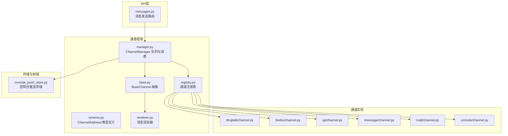
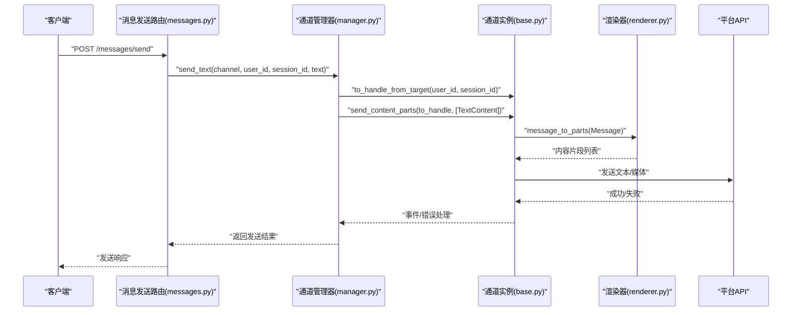
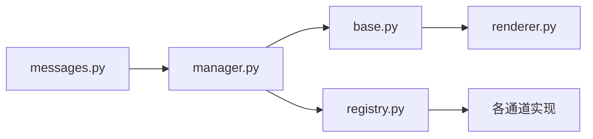

# 消息通信API

<cite>
**本文引用的文件**
- [messages.py](file://src/copaw/app/routers/messages.py)
- [base.py](file://src/copaw/app/channels/base.py)
- [manager.py](file://src/copaw/app/channels/manager.py)
- [schema.py](file://src/copaw/app/channels/schema.py)
- [registry.py](file://src/copaw/app/channels/registry.py)
- [renderer.py](file://src/copaw/app/channels/renderer.py)
- [console_push_store.py](file://src/copaw/app/console_push_store.py)
- [channel.py（钉钉）](file://src/copaw/app/channels/dingtalk/channel.py)
- [channel.py（飞书）](file://src/copaw/app/channels/feishu/channel.py)
- [channel.py（QQ）](file://src/copaw/app/channels/qq/channel.py)
- [channel.py（iMessage）](file://src/copaw/app/channels/imessage/channel.py)
- [channel.py（MQTT）](file://src/copaw/app/channels/mqtt/channel.py)
- [channel.py（Console）](file://src/copaw/app/channels/console/channel.py)
- [channels.en.md](file://website/public/docs/channels.en.md)
- [test_qq_channel.py](file://tests/unit/channels/test_qq_channel.py)
</cite>

## 目录
1. [简介](#简介)
2. [项目结构](#项目结构)
3. [核心组件](#核心组件)
4. [架构总览](#架构总览)
5. [详细组件分析](#详细组件分析)
6. [依赖分析](#依赖分析)
7. [性能考虑](#性能考虑)
8. [故障排查指南](#故障排查指南)
9. [结论](#结论)
10. [附录](#附录)

## 简介
本文件面向CoPaw的消息通信API，系统性梳理消息发送、接收、转发与存储的接口规范；覆盖实时消息推送、历史消息查询与消息状态跟踪；明确消息格式标准化与内容过滤机制；提供消息队列管理与异步处理接口；记录消息路由、分发与聚合的API规范，并补充消息加密与安全验证要点。文档以代码为依据，配合图示帮助读者快速理解端到端流程。

## 项目结构
CoPaw的消息通信由“FastAPI路由层”“通道管理层”“通道基类与具体实现”“渲染器与会话路由”“控制台推送存储”等模块协同完成。下图给出与消息API相关的核心文件与职责映射：

图表来源
- [messages.py:1-184](file://src/copaw/app/routers/messages.py#L1-L184)
- [base.py:69-821](file://src/copaw/app/channels/base.py#L69-L821)
- [manager.py:114-580](file://src/copaw/app/channels/manager.py#L114-L580)
- [schema.py:12-71](file://src/copaw/app/channels/schema.py#L12-L71)
- [registry.py:19-138](file://src/copaw/app/channels/registry.py#L19-L138)
- [renderer.py:78-384](file://src/copaw/app/channels/renderer.py#L78-L384)
- [console_push_store.py:1-97](file://src/copaw/app/console_push_store.py#L1-L97)

章节来源
- [messages.py:1-184](file://src/copaw/app/routers/messages.py#L1-L184)
- [base.py:69-821](file://src/copaw/app/channels/base.py#L69-L821)
- [manager.py:114-580](file://src/copaw/app/channels/manager.py#L114-L580)
- [schema.py:12-71](file://src/copaw/app/channels/schema.py#L12-L71)
- [registry.py:19-138](file://src/copaw/app/channels/registry.py#L19-L138)
- [renderer.py:78-384](file://src/copaw/app/channels/renderer.py#L78-L384)
- [console_push_store.py:1-97](file://src/copaw/app/console_push_store.py#L1-L97)

## 核心组件
- 消息发送路由：提供对外HTTP接口，接收消息发送请求并委托通道管理器执行发送。
- 通道管理器：统一持有各通道队列，按会话键并发消费，合并同会话消息，驱动通道处理。
- 通道基类：定义统一的入站转请求、出站渲染与发送、错误处理、去抖与合并策略。
- 渲染器：将运行时消息转换为可发送的内容片段，支持文本、图片、音频、视频、文件与拒绝信息，并支持工具调用/输出的过滤与展示策略。
- 通道注册表：集中管理内置与自定义通道类，按配置动态实例化。
- 控制台推送存储：内存中维护控制台通道的推送消息，支持按会话提取与全局获取。

章节来源
- [messages.py:75-184](file://src/copaw/app/routers/messages.py#L75-L184)
- [manager.py:114-580](file://src/copaw/app/channels/manager.py#L114-L580)
- [base.py:69-821](file://src/copaw/app/channels/base.py#L69-L821)
- [renderer.py:78-384](file://src/copaw/app/channels/renderer.py#L78-L384)
- [registry.py:19-138](file://src/copaw/app/channels/registry.py#L19-L138)
- [console_push_store.py:1-97](file://src/copaw/app/console_push_store.py#L1-L97)

## 架构总览
下图展示从API到通道、再到具体平台的端到端消息路径，以及队列与去抖合并的关键节点：

图表来源
- [messages.py:75-184](file://src/copaw/app/routers/messages.py#L75-L184)
- [manager.py:528-580](file://src/copaw/app/channels/manager.py#L528-L580)
- [base.py:674-751](file://src/copaw/app/channels/base.py#L674-L751)
- [renderer.py:87-350](file://src/copaw/app/channels/renderer.py#L87-L350)

## 详细组件分析

### 1) 消息发送API（对外）
- 接口：POST /messages/send
- 请求体字段：
  - channel：目标通道标识（如 console、dingtalk、feishu、discord 等）
  - target_user：用户在该通道内的ID
  - target_session：会话ID
  - text：要发送的文本
- 响应体字段：
  - success：是否发送成功
  - message：状态描述
- 头部：
  - X-Agent-Id：可选，用于标记发送来源的代理ID
- 行为：
  - 从应用状态获取多代理管理器
  - 获取代理工作区与通道管理器
  - 记录日志并调用通道管理器发送文本
  - 对异常进行HTTP状态码映射与错误返回

章节来源
- [messages.py:37-184](file://src/copaw/app/routers/messages.py#L37-L184)

### 2) 通道管理器（队列与消费）
- 职责：
  - 为启用的通道创建队列与消费者任务
  - 按会话键去重与合并：同一会话的消息在处理期间被暂存，完成后批量入队
  - 统一调度：对原生负载与请求对象分别进行合并与处理
  - 提供发送接口：send_text 将文本转换为内容片段后发送
- 关键点：
  - 每通道固定数量的消费者并发处理不同会话
  - 通过 get_debounce_key 保证会话内顺序与完整性
  - 支持替换通道实例（热切换）

章节来源
- [manager.py:114-580](file://src/copaw/app/channels/manager.py#L114-L580)

### 3) 通道基类（抽象与通用能力）
- 能力：
  - 入站：将平台原生消息解析为运行时消息对象（AgentRequest）
  - 出站：将运行时消息渲染为内容片段并发送
  - 去抖与合并：对无文本内容进行缓冲，待有文本或音频时合并发送
  - 错误处理：统一捕获异常并回传错误文本
  - 会话路由：根据平台差异解析 to_handle（用户ID或频道ID）
- 可扩展点：
  - 不同平台可覆盖 consume_one/_consume_one_request/send_content_parts 等方法
  - 通过 RenderStyle 控制工具消息与思考内容的过滤与展示

章节来源
- [base.py:69-821](file://src/copaw/app/channels/base.py#L69-L821)
- [renderer.py:78-384](file://src/copaw/app/channels/renderer.py#L78-L384)

### 4) 渲染器（消息格式标准化）
- 输入：运行时消息（含文本、图片、音频、视频、文件、拒绝等）
- 输出：内容片段列表（TextContent、ImageContent、AudioContent、VideoContent、FileContent、RefusalContent）
- 过滤策略：
  - filter_tool_messages：过滤工具调用/输出
  - filter_thinking：过滤思考内容
  - show_tool_details：控制工具参数/输出预览
- 能力：
  - 将复杂块（如图像/音频/视频/文件）转换为URL或数据载体
  - 将工具调用与输出转换为可读文本或媒体片段
  - 支持前缀（bot_prefix）拼接到文本

章节来源
- [renderer.py:78-384](file://src/copaw/app/channels/renderer.py#L78-L384)
- [base.py:663-751](file://src/copaw/app/channels/base.py#L663-L751)

### 5) 通道路由与会话解析
- 会话键：默认使用 channel:user_id，部分平台可基于会话Webhook或频道ID派生
- 发送目标解析：不同通道可能以用户ID或频道ID作为 to_handle
- 示例（来自测试与实现）：
  - QQ通道：根据消息类型（C2C/群组/频道）解析发送路径
  - MQTT通道：优先使用 meta.client_id 或 session_id 中的客户端ID
  - Console通道：直接使用用户ID

章节来源
- [base.py:341-436](file://src/copaw/app/channels/base.py#L341-L436)
- [test_qq_channel.py:542-587](file://tests/unit/channels/test_qq_channel.py#L542-L587)
- [channel.py（MQTT）:438-470](file://src/copaw/app/channels/mqtt/channel.py#L438-L470)
- [channel.py（Console）](file://src/copaw/app/channels/console/channel.py)

### 6) 实时消息推送与历史查询
- 实时推送（控制台）：
  - 内存存储：控制台推送消息按会话保留，带过期与容量限制
  - 接口：前端轮询获取最近消息，消费后移除
- 历史查询：
  - 前端侧在会话页面加载时通过会话ID拉取历史消息
  - 后端会话服务负责持久化与查询（此处为前端调用示意）

章节来源
- [console_push_store.py:22-97](file://src/copaw/app/console_push_store.py#L22-L97)
- [channels.en.md:802-902](file://website/public/docs/channels.en.md#L802-L902)

### 7) 消息队列管理与异步处理
- 队列模型：每通道一个队列，最大长度固定
- 并发模型：每通道固定数量消费者，按会话键加锁，避免跨会话乱序
- 去抖与合并：
  - 对无文本内容进行缓冲，等待后续文本或音频到达后合并发送
  - 对原生负载与请求对象分别进行合并（native_items/requests）
- 异常处理：统一捕获并回传错误文本，触发 on_reply_sent 回调

章节来源
- [base.py:443-583](file://src/copaw/app/channels/base.py#L443-L583)
- [manager.py:322-363](file://src/copaw/app/channels/manager.py#L322-L363)

### 8) 消息格式标准化与内容过滤
- 标准化：
  - 使用运行时内容类型（Text/Image/Audio/Video/File/Refusal）
  - 渲染器统一输出片段，通道实现负责最终发送
- 过滤：
  - 工具消息与思考内容可通过 RenderStyle 开关
  - 部分通道支持白名单/禁言/提及要求等策略

章节来源
- [renderer.py:38-48](file://src/copaw/app/channels/renderer.py#L38-L48)
- [base.py:281-316](file://src/copaw/app/channels/base.py#L281-L316)

### 9) 消息路由、分发与聚合
- 路由：
  - 通过 ChannelAddress 统一 kind/id/extra 的路由表达
  - to_handle_from_target 将用户ID与会话ID映射为平台发送目标
- 分发：
  - ChannelManager 按会话键合并同批次消息，避免重复与乱序
- 聚合：
  - 去抖：无文本内容缓冲，文本到达后合并发送
  - 批量：同一会话多条原生负载或请求对象合并为一次处理

章节来源
- [schema.py:12-28](file://src/copaw/app/channels/schema.py#L12-L28)
- [base.py:145-206](file://src/copaw/app/channels/base.py#L145-L206)
- [manager.py:42-112](file://src/copaw/app/channels/manager.py#L42-L112)

### 10) 加密传输与安全验证（要点）
- 平台侧：
  - 钉钉/飞书/QQ等通道在实现中涉及签名、Webhook校验、序列号等机制（详见对应通道文件）
- 存储侧：
  - 微信媒体加密工具提供AES-ECB加解密与随机密钥生成（用于特定场景）
- 客户端：
  - 通道配置可通过HTTP接口读取与更新，变更写回配置文件并自动应用

章节来源
- [channel.py（钉钉）](file://src/copaw/app/channels/dingtalk/channel.py)
- [channel.py（飞书）](file://src/copaw/app/channels/feishu/channel.py)
- [channel.py（QQ）](file://src/copaw/app/channels/qq/channel.py)
- [utils.py（微信加密）:86-113](file://src/copaw/app/channels/weixin/utils.py#L86-L113)
- [channels.en.md:802-811](file://website/public/docs/channels.en.md#L802-L811)

## 依赖分析
- 组件耦合：
  - API路由仅依赖通道管理器；管理器依赖通道基类与注册表；通道实现依赖基类与渲染器
- 外部依赖：
  - 渲染器依赖运行时消息类型；通道实现依赖平台SDK或HTTP客户端
- 循环依赖：
  - 未见循环导入；模块间单向依赖清晰

图表来源
- [messages.py:1-184](file://src/copaw/app/routers/messages.py#L1-L184)
- [manager.py:114-580](file://src/copaw/app/channels/manager.py#L114-L580)
- [base.py:69-821](file://src/copaw/app/channels/base.py#L69-L821)
- [registry.py:19-138](file://src/copaw/app/channels/registry.py#L19-L138)
- [renderer.py:78-384](file://src/copaw/app/channels/renderer.py#L78-L384)

## 性能考虑
- 队列容量与并发：每通道固定队列上限与消费者数量，避免内存膨胀与饥饿
- 去抖与合并：减少平台API调用次数，提升吞吐
- 会话级锁：确保同会话消息顺序与完整性，避免重复与乱序
- 渲染成本：按需渲染，避免不必要的媒体下载与编码

## 故障排查指南
- 404 通道不存在：检查通道名称与可用通道列表
- 500 发送失败：查看通道实现中的异常日志与错误回传
- 无消息送达：确认去抖逻辑（无文本内容会被缓冲），或检查会话键是否正确
- 会话错乱：检查 to_handle_from_target 与 get_debounce_key 的实现一致性

章节来源
- [messages.py:166-183](file://src/copaw/app/routers/messages.py#L166-L183)
- [base.py:576-582](file://src/copaw/app/channels/base.py#L576-L582)
- [manager.py:322-363](file://src/copaw/app/channels/manager.py#L322-L363)

## 结论
CoPaw的消息通信API以“通道管理器+通道基类+渲染器”的分层设计实现高扩展性与强一致性。通过统一的会话键、去抖与合并策略，确保消息在多通道、多会话场景下的稳定与高效。结合控制台推送存储与HTTP配置接口，形成从发送、路由、渲染到展示的完整闭环。建议在接入新平台时遵循BaseChannel约定，复用渲染器与管理器能力，最小化定制成本。

## 附录

### A. API定义（发送消息）
- 方法与路径：POST /messages/send
- 请求头：
  - Content-Type: application/json
  - X-Agent-Id: 可选，代理ID
- 请求体字段：
  - channel: 目标通道标识
  - target_user: 用户ID
  - target_session: 会话ID
  - text: 文本内容
- 响应体字段：
  - success: 布尔
  - message: 描述信息

章节来源
- [messages.py:75-184](file://src/copaw/app/routers/messages.py#L75-L184)

### B. 通道类型与路由
- 内置通道类型：imessage、discord、dingtalk、feishu、qq、telegram、mqtt、console、voice、xiaoyi、matrix、wecom、weixin
- 路由表达：ChannelAddress(kind/id/extra)，统一 to_handle 解析

章节来源
- [schema.py:30-48](file://src/copaw/app/channels/schema.py#L30-L48)
- [registry.py:19-34](file://src/copaw/app/channels/registry.py#L19-L34)

### C. 控制台推送存储接口
- append(session_id, text, sticky=False)：追加消息（带时间戳与ID）
- take(session_id)：按会话取出并清空
- take_all()：取出并清空所有未过期消息
- get_recent(max_age_seconds)：获取最近未消费消息

章节来源
- [console_push_store.py:22-97](file://src/copaw/app/console_push_store.py#L22-L97)