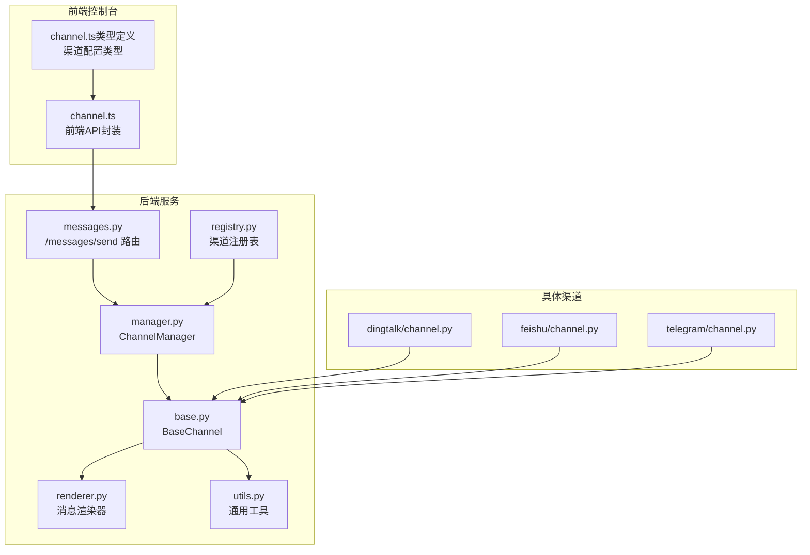
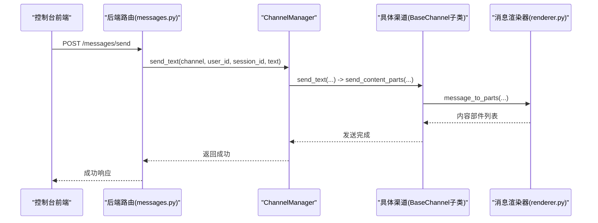
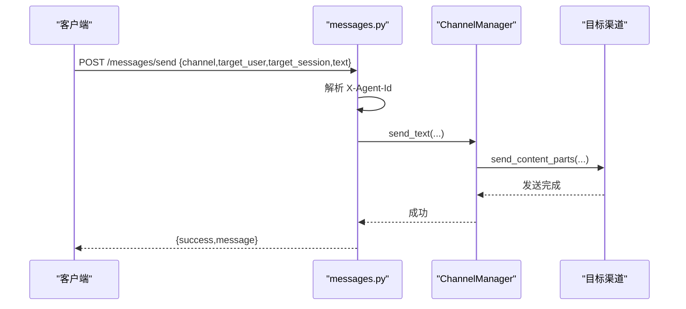
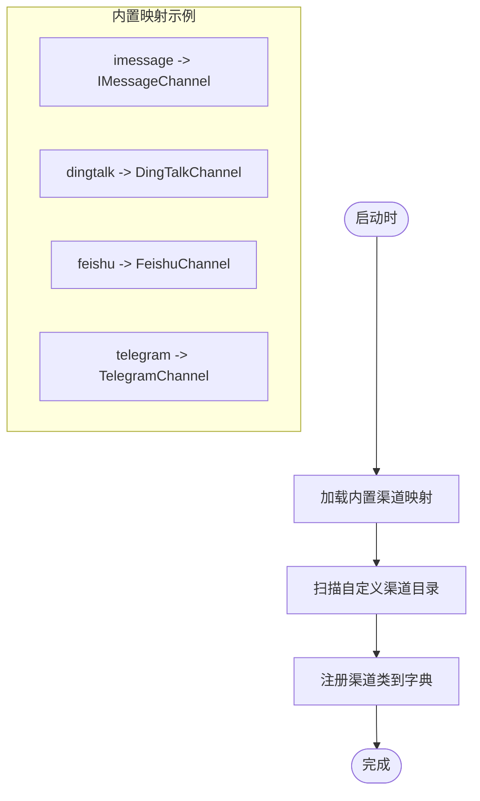
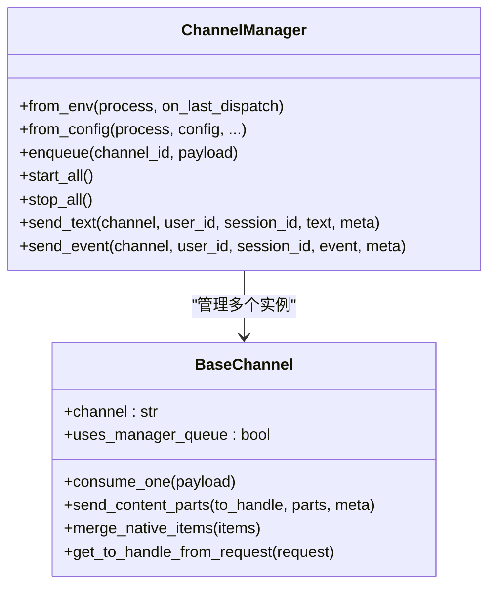
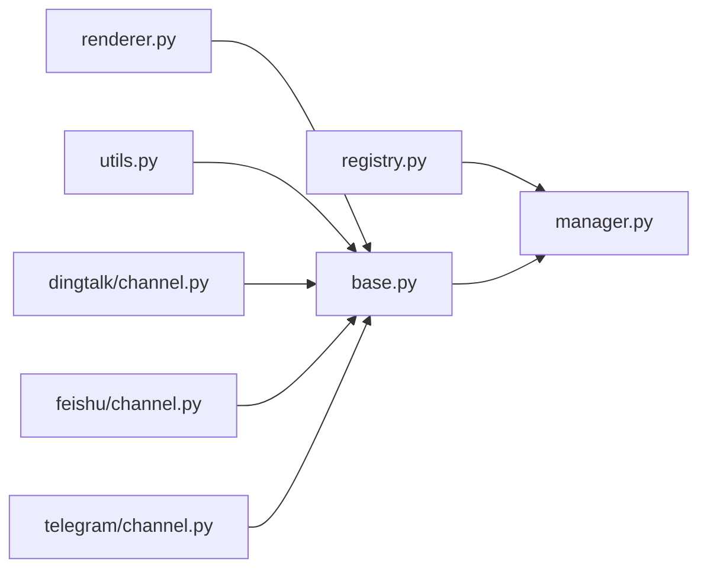
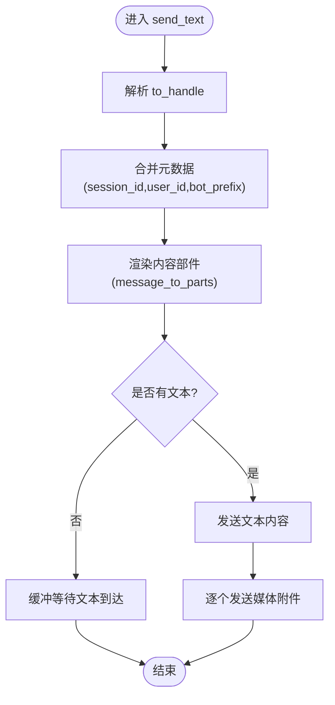

# 渠道管理API

<cite>
**本文档引用的文件**
- [channel.ts](file://console/src/api/modules/channel.ts)
- [channel.ts（类型定义）](file://console/src/api/types/channel.ts)
- [messages.py](file://src/copaw/app/routers/messages.py)
- [manager.py](file://src/copaw/app/channels/manager.py)
- [base.py](file://src/copaw/app/channels/base.py)
- [registry.py](file://src/copaw/app/channels/registry.py)
- [schema.py](file://src/copaw/app/channels/schema.py)
- [renderer.py](file://src/copaw/app/channels/renderer.py)
- [utils.py](file://src/copaw/app/channels/utils.py)
- [channel.py（钉钉）](file://src/copaw/app/channels/dingtalk/channel.py)
- [channel.py（飞书）](file://src/copaw/app/channels/feishu/channel.py)
- [channel.py（电报）](file://src/copaw/app/channels/telegram/channel.py)
- [__init__.py（channels包）](file://src/copaw/app/channels/__init__.py)
</cite>

## 目录
1. [简介](#简介)
2. [项目结构](#项目结构)
3. [核心组件](#核心组件)
4. [架构总览](#架构总览)
5. [详细组件分析](#详细组件分析)
6. [依赖关系分析](#依赖关系分析)
7. [性能考量](#性能考量)
8. [故障排查指南](#故障排查指南)
9. [结论](#结论)
10. [附录](#附录)

## 简介
本文件系统化梳理 CoPaw 的渠道管理API，覆盖以下方面：
- 各类聊天渠道的配置、连接与消息处理接口
- 渠道适配器的注册、配置与状态监控API
- 渠道消息发送、接收与转发的接口规范
- 渠道连接状态监控与故障诊断API
- 渠道特定的配置参数与认证信息管理
- 渠道扩展与自定义适配器的开发接口

目标是帮助开发者快速理解并正确使用渠道管理能力，同时为扩展新渠道提供清晰的参考。

## 项目结构
围绕“渠道”主题，核心代码分布在以下模块：
- 前端API封装：console/src/api/modules/channel.ts 与 console/src/api/types/channel.ts
- 后端路由：src/copaw/app/routers/messages.py 提供对外消息发送接口
- 渠道框架：src/copaw/app/channels/* 提供统一基类、注册表、渲染器等
- 具体渠道实现：钉钉、飞书、电报等子模块
- 包入口：src/copaw/app/channels/__init__.py 支持延迟加载

图表来源
- [channel.ts:1-28](file://console/src/api/modules/channel.ts#L1-L28)
- [channel.ts（类型定义）:1-143](file://console/src/api/types/channel.ts#L1-L143)
- [messages.py:1-184](file://src/copaw/app/routers/messages.py#L1-L184)
- [manager.py:114-580](file://src/copaw/app/channels/manager.py#L114-L580)
- [base.py:69-800](file://src/copaw/app/channels/base.py#L69-L800)
- [registry.py:133-138](file://src/copaw/app/channels/registry.py#L133-L138)
- [renderer.py:78-384](file://src/copaw/app/channels/renderer.py#L78-L384)
- [utils.py:121-134](file://src/copaw/app/channels/utils.py#L121-L134)
- [channel.py（钉钉）:81-200](file://src/copaw/app/channels/dingtalk/channel.py#L81-L200)
- [channel.py（飞书）:150-200](file://src/copaw/app/channels/feishu/channel.py#L150-L200)
- [channel.py（电报）:1-200](file://src/copaw/app/channels/telegram/channel.py#L1-L200)

章节来源
- [channel.ts:1-28](file://console/src/api/modules/channel.ts#L1-L28)
- [channel.ts（类型定义）:1-143](file://console/src/api/types/channel.ts#L1-L143)
- [messages.py:1-184](file://src/copaw/app/routers/messages.py#L1-L184)
- [manager.py:114-580](file://src/copaw/app/channels/manager.py#L114-L580)
- [base.py:69-800](file://src/copaw/app/channels/base.py#L69-L800)
- [registry.py:133-138](file://src/copaw/app/channels/registry.py#L133-L138)
- [renderer.py:78-384](file://src/copaw/app/channels/renderer.py#L78-L384)
- [utils.py:121-134](file://src/copaw/app/channels/utils.py#L121-L134)
- [channel.py（钉钉）:81-200](file://src/copaw/app/channels/dingtalk/channel.py#L81-L200)
- [channel.py（飞书）:150-200](file://src/copaw/app/channels/feishu/channel.py#L150-L200)
- [channel.py（电报）:1-200](file://src/copaw/app/channels/telegram/channel.py#L1-L200)

## 核心组件
- ChannelManager：统一管理所有渠道实例，负责队列、消费者线程、批量合并、去重与错误处理。
- BaseChannel：所有渠道的抽象基类，定义统一的消息构建、发送、渲染与处理流程。
- Registry：内置渠道注册表与自定义渠道发现机制。
- Renderer：可插拔的消息渲染器，支持Markdown、Emoji、代码块等风格控制。
- Utils：文本分片、本地文件URL解析等通用工具。
- 具体渠道：如钉钉、飞书、电报等，实现各自的接入协议与发送策略。

章节来源
- [manager.py:114-580](file://src/copaw/app/channels/manager.py#L114-L580)
- [base.py:69-800](file://src/copaw/app/channels/base.py#L69-L800)
- [registry.py:133-138](file://src/copaw/app/channels/registry.py#L133-L138)
- [renderer.py:78-384](file://src/copaw/app/channels/renderer.py#L78-L384)
- [utils.py:18-134](file://src/copaw/app/channels/utils.py#L18-L134)

## 架构总览
下图展示从控制台到渠道的具体调用链路与职责分工：

图表来源
- [messages.py:75-184](file://src/copaw/app/routers/messages.py#L75-L184)
- [manager.py:528-580](file://src/copaw/app/channels/manager.py#L528-L580)
- [base.py:674-751](file://src/copaw/app/channels/base.py#L674-L751)
- [renderer.py:87-350](file://src/copaw/app/channels/renderer.py#L87-L350)

## 详细组件分析

### 渠道配置与管理API（前端）
- 列出渠道类型：GET /config/channels/types
- 获取全部渠道配置：GET /config/channels
- 更新全部渠道配置：PUT /config/channels
- 获取单个渠道配置：GET /config/channels/:channelName
- 更新单个渠道配置：PUT /config/channels/:channelName

这些接口对应前端模块 channel.ts 中的 channelApi 方法，用于在控制台中查看与编辑各渠道的启用状态、前缀、策略与认证参数等。

章节来源
- [channel.ts:4-28](file://console/src/api/modules/channel.ts#L4-L28)
- [channel.ts（类型定义）:1-143](file://console/src/api/types/channel.ts#L1-L143)

### 渠道发送API（后端）
- 接口：POST /messages/send
- 请求体字段：
  - channel：目标渠道标识（如 console、dingtalk、feishu、discord 等）
  - target_user：用户ID
  - target_session：会话ID
  - text：要发送的文本
- 头部：
  - X-Agent-Id：可选，用于标记来源代理
- 行为：
  - 根据 X-Agent-Id 获取工作空间与 ChannelManager
  - 调用 ChannelManager.send_text 将消息投递到指定渠道
  - 返回成功或失败状态

图表来源
- [messages.py:75-184](file://src/copaw/app/routers/messages.py#L75-L184)
- [manager.py:528-580](file://src/copaw/app/channels/manager.py#L528-L580)
- [base.py:700-751](file://src/copaw/app/channels/base.py#L700-L751)

章节来源
- [messages.py:37-184](file://src/copaw/app/routers/messages.py#L37-L184)

### 渠道适配器注册与发现
- 注册表：registry.py 维护内置渠道映射与自定义渠道扫描逻辑
- 内置渠道键集合：imessage、discord、dingtalk、feishu、qq、telegram、mattermost、mqtt、console、matrix、voice、wecom、xiaoyi、weixin
- 自定义渠道：从 CUSTOM_CHANNELS_DIR 动态导入，自动发现继承自 BaseChannel 的类并注册

图表来源
- [registry.py:19-34](file://src/copaw/app/channels/registry.py#L19-L34)
- [registry.py:95-127](file://src/copaw/app/channels/registry.py#L95-L127)
- [registry.py:133-138](file://src/copaw/app/channels/registry.py#L133-L138)

章节来源
- [registry.py:19-138](file://src/copaw/app/channels/registry.py#L19-L138)
- [__init__.py（channels包）:7-14](file://src/copaw/app/channels/__init__.py#L7-L14)

### 渠道生命周期与消息处理
- ChannelManager
  - 从环境或配置创建渠道实例
  - 为每个渠道建立队列与消费者任务
  - 批量合并同一会话的消息，避免重复与乱序
  - 错误捕获与优雅停止
- BaseChannel
  - 定义统一的 consume_one/_consume_one_request 流程
  - 会话去重与时间抖动（debounce）
  - 消息渲染与发送（send_content_parts/send_media）
  - 允许策略：私聊/群组白名单、@提及要求等

图表来源
- [base.py:69-800](file://src/copaw/app/channels/base.py#L69-L800)
- [manager.py:114-580](file://src/copaw/app/channels/manager.py#L114-L580)

章节来源
- [manager.py:114-580](file://src/copaw/app/channels/manager.py#L114-L580)
- [base.py:69-800](file://src/copaw/app/channels/base.py#L69-L800)

### 渠道特定配置与认证
- 基础配置项（BaseChannelConfig）
  - enabled：是否启用
  - bot_prefix：机器人前缀
  - filter_tool_messages：过滤工具消息
  - filter_thinking：过滤思考内容
  - dm_policy/group_policy：私聊/群组策略（open 或 allowlist）
  - allow_from：允许来源列表
  - require_mention：是否需要@提及
- 各渠道特有参数（示例）
  - 钉钉：client_id、client_secret、message_type、card_template_id、robot_code 等
  - 飞书：app_id、app_secret、encrypt_key、verification_token、media_dir、domain 等
  - 电报：bot_token、http_proxy、http_proxy_auth、show_typing 等
  - MQTT：host、port、transport、clean_session、qos、username、password、subscribe_topic、publish_topic、tls_* 等
  - 企业微信：bot_id、secret、media_dir、welcome_text、max_reconnect_attempts 等
  - 小艺：ak、sk、agent_id、ws_url、task_timeout_ms 等
  - 语音：twilio_account_sid、twilio_auth_token、phone_number、phone_number_sid、tts_provider、tts_voice、stt_provider、language、welcome_greeting 等

章节来源
- [channel.ts（类型定义）:1-143](file://console/src/api/types/channel.ts#L1-L143)

### 渠道扩展与自定义适配器开发
- 开发步骤
  - 新建类继承 BaseChannel，并实现必要的抽象方法
  - 在类中定义 channel 字段作为唯一标识
  - 实现 from_env/from_config 工厂方法以支持从环境变量或配置文件初始化
  - 如需队列与消费者，请确保 uses_manager_queue 为 True（默认）
  - 将自定义渠道放置于 CUSTOM_CHANNELS_DIR 目录，系统将自动发现并注册
- 关键点
  - 会话解析：重写 resolve_session_id 以适配渠道会话模型
  - 消息构建：实现 build_agent_request_from_native 将原生负载转为 AgentRequest
  - 发送策略：覆盖 send_content_parts/send_media 以适配渠道发送能力
  - 去重与抖动：合理设置 _debounce_seconds 并利用 merge_* 方法合并消息

章节来源
- [registry.py:95-127](file://src/copaw/app/channels/registry.py#L95-L127)
- [base.py:321-402](file://src/copaw/app/channels/base.py#L321-L402)
- [__init__.py（channels包）:7-14](file://src/copaw/app/channels/__init__.py#L7-L14)

### 具体渠道实现要点

#### 钉钉渠道（DingTalk）
- 特性
  - 使用钉钉流式回调，支持卡片与Markdown回复
  - 通过 sessionWebhook 支持主动推送
  - 令牌缓存与过期刷新
  - 去重：基于消息ID
- 关键配置
  - client_id、client_secret、message_type、card_template_id、robot_code、media_dir 等
- 会话模型
  - 使用短会话ID（基于对话ID后缀），便于定时任务查找

章节来源
- [channel.py（钉钉）:81-200](file://src/copaw/app/channels/dingtalk/channel.py#L81-L200)

#### 飞书渠道（Feishu/Lark）
- 特性
  - WebSocket 接收事件，Open API 发送
  - 支持图片、文件等媒体
  - 存储 receive_id 与 receive_id_type 以便主动发送
- 关键配置
  - app_id、app_secret、encrypt_key、verification_token、media_dir、domain
- 会话模型
  - 群聊：feishu:chat_id:<chat_id>
  - 私聊：feishu:open_id:<open_id>

章节来源
- [channel.py（飞书）:150-200](file://src/copaw/app/channels/feishu/channel.py#L150-L200)

#### 电渠（Telegram）
- 特性
  - Bot API + 轮询
  - 支持媒体上传与下载
  - 文件大小限制与超大文件处理
- 关键配置
  - bot_token、http_proxy、http_proxy_auth、show_typing
- 会话模型
  - 基于 chat_id

章节来源
- [channel.py（电报）:1-200](file://src/copaw/app/channels/telegram/channel.py#L1-L200)

## 依赖关系分析
- 渠道注册与发现
  - registry.py 负责内置映射与自定义扫描
  - __init__.py 采用延迟加载 ChannelManager，避免 CLI 启动时拉取可选依赖
- 渠道框架
  - base.py 定义统一契约；manager.py 实现并发与合并；renderer.py 控制渲染风格；utils.py 提供通用工具
- 具体渠道
  - 各渠道实现遵循 BaseChannel 约定，复用统一处理流程

图表来源
- [registry.py:133-138](file://src/copaw/app/channels/registry.py#L133-L138)
- [manager.py:114-580](file://src/copaw/app/channels/manager.py#L114-L580)
- [base.py:69-800](file://src/copaw/app/channels/base.py#L69-L800)
- [renderer.py:78-384](file://src/copaw/app/channels/renderer.py#L78-L384)
- [utils.py:121-134](file://src/copaw/app/channels/utils.py#L121-L134)
- [channel.py（钉钉）:81-200](file://src/copaw/app/channels/dingtalk/channel.py#L81-L200)
- [channel.py（飞书）:150-200](file://src/copaw/app/channels/feishu/channel.py#L150-L200)
- [channel.py（电报）:1-200](file://src/copaw/app/channels/telegram/channel.py#L1-L200)

章节来源
- [registry.py:133-138](file://src/copaw/app/channels/registry.py#L133-L138)
- [manager.py:114-580](file://src/copaw/app/channels/manager.py#L114-L580)
- [base.py:69-800](file://src/copaw/app/channels/base.py#L69-L800)
- [renderer.py:78-384](file://src/copaw/app/channels/renderer.py#L78-L384)
- [utils.py:121-134](file://src/copaw/app/channels/utils.py#L121-L134)
- [channel.py（钉钉）:81-200](file://src/copaw/app/channels/dingtalk/channel.py#L81-L200)
- [channel.py（飞书）:150-200](file://src/copaw/app/channels/feishu/channel.py#L150-L200)
- [channel.py（电报）:1-200](file://src/copaw/app/channels/telegram/channel.py#L1-L200)

## 性能考量
- 队列与并发
  - 每渠道固定消费者数量（默认4），同会话内串行处理，不同会话并行处理
  - 队列最大长度限制，防止内存膨胀
- 合并与抖动
  - 对同一会话的多条消息进行合并，减少下游调用次数
  - 时间抖动（debounce）合并无文本内容，待文本到达后再一次性发送
- 渲染与拆分
  - 渲染器按渠道能力输出内容，必要时对长文本进行分片
  - 工具输出与媒体内容分离，避免冗余传输

章节来源
- [manager.py:36-42](file://src/copaw/app/channels/manager.py#L36-L42)
- [manager.py:322-364](file://src/copaw/app/channels/manager.py#L322-L364)
- [base.py:453-480](file://src/copaw/app/channels/base.py#L453-L480)
- [renderer.py:87-350](file://src/copaw/app/channels/renderer.py#L87-L350)
- [utils.py:18-76](file://src/copaw/app/channels/utils.py#L18-L76)

## 故障排查指南
- 常见问题定位
  - 渠道未找到：检查 channel 参数是否正确，确认 registry 是否已注册该渠道
  - 发送失败：查看 ChannelManager 的异常日志，关注 _consume_one_request 流程中的错误
  - 渲染异常：检查 RenderStyle 配置，确认 filter_tool_messages/filter_thinking 等选项
  - 媒体发送失败：确认渠道支持的媒体类型与大小限制，检查 file_url_to_local_path 解析结果
- 具体渠道问题
  - 钉钉：关注 sessionWebhook 过期、卡片状态机、令牌刷新
  - 飞书：关注 lark-oapi 依赖版本兼容与 pkg_resources 兼容层
  - 电报：关注文件大小限制与网络错误重试

章节来源
- [manager.py:358-364](file://src/copaw/app/channels/manager.py#L358-L364)
- [base.py:576-583](file://src/copaw/app/channels/base.py#L576-L583)
- [utils.py:78-118](file://src/copaw/app/channels/utils.py#L78-L118)
- [channel.py（钉钉）:166-179](file://src/copaw/app/channels/dingtalk/channel.py#L166-L179)
- [channel.py（飞书）:68-143](file://src/copaw/app/channels/feishu/channel.py#L68-L143)
- [channel.py（电报）:70-138](file://src/copaw/app/channels/telegram/channel.py#L70-L138)

## 结论
CoPaw 的渠道管理API通过统一的 ChannelManager 与 BaseChannel 抽象，实现了跨渠道的一致性体验。借助灵活的注册表、可插拔的渲染器与完善的工具集，开发者既能快速配置现有渠道，也能便捷地扩展新的渠道适配器。结合本文档提供的接口规范与最佳实践，可以高效地完成渠道的配置、监控与运维。

## 附录

### 渠道消息发送流程（算法）

图表来源
- [manager.py:528-580](file://src/copaw/app/channels/manager.py#L528-L580)
- [base.py:674-751](file://src/copaw/app/channels/base.py#L674-L751)
- [renderer.py:87-350](file://src/copaw/app/channels/renderer.py#L87-L350)