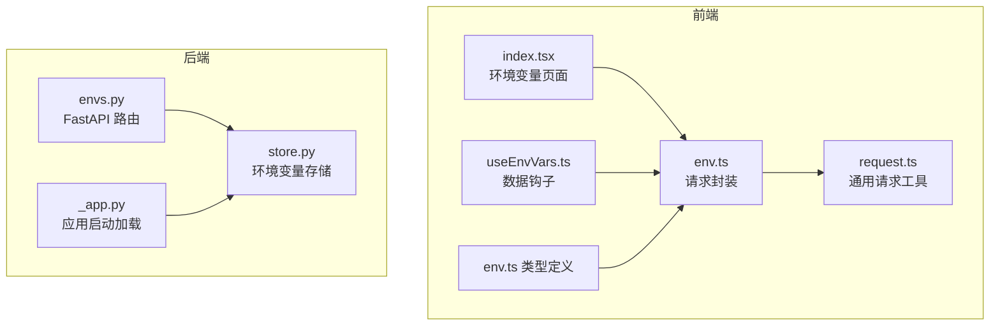
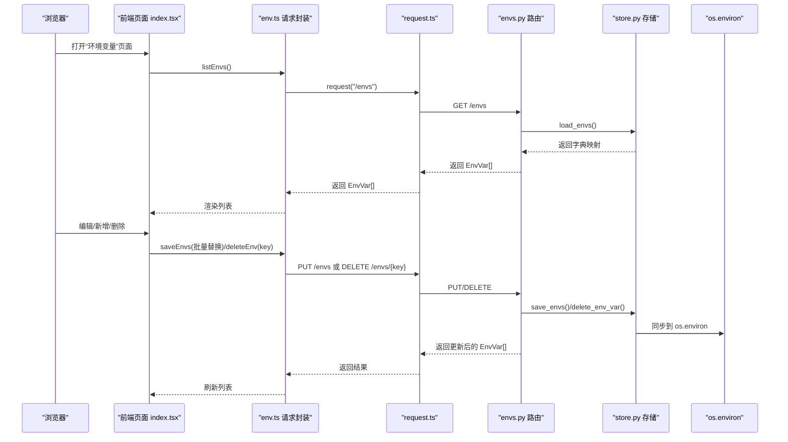
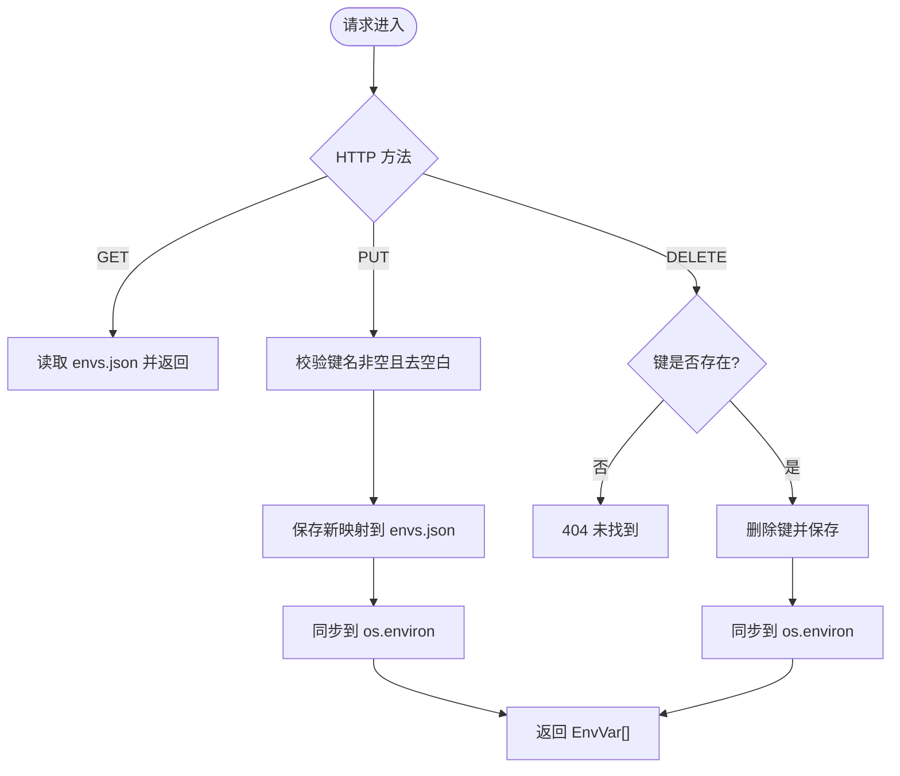
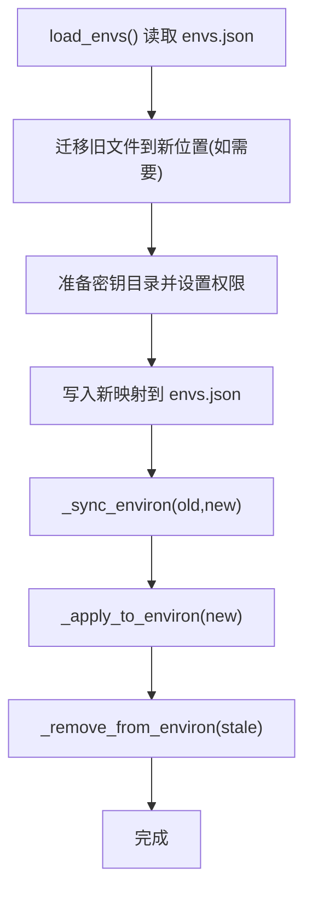
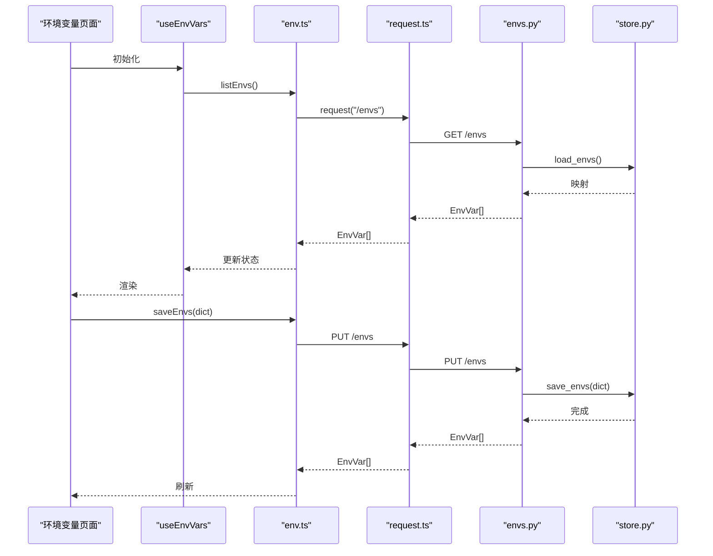
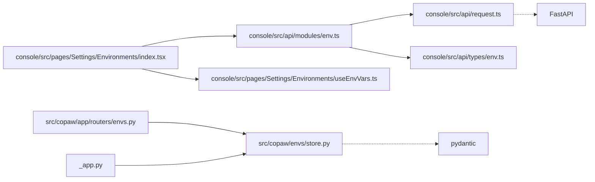

# 环境变量API

<cite>
**本文档引用的文件**
- [envs.py](file://src/copaw/app/routers/envs.py)
- [store.py](file://src/copaw/envs/store.py)
- [env.ts](file://console/src/api/modules/env.ts)
- [env.ts 类型定义](file://console/src/api/types/env.ts)
- [_app.py](file://src/copaw/app/_app.py)
- [useEnvVars.ts](file://console/src/pages/Settings/Environments/useEnvVars.ts)
- [index.tsx](file://console/src/pages/Settings/Environments/index.tsx)
- [request.ts](file://console/src/api/request.ts)
</cite>

## 目录
1. [简介](#简介)
2. [项目结构](#项目结构)
3. [核心组件](#核心组件)
4. [架构总览](#架构总览)
5. [详细组件分析](#详细组件分析)
6. [依赖关系分析](#依赖关系分析)
7. [性能考量](#性能考量)
8. [故障排查指南](#故障排查指南)
9. [结论](#结论)
10. [附录](#附录)

## 简介
本文件系统性梳理 CoPaw 的环境变量 API，涵盖后端路由与存储、前端请求封装与页面交互、以及安全与持久化策略。重点包括：
- 增删改查与批量替换接口
- 敏感信息保护与文件权限控制
- 环境变量注入到进程与子进程
- 导入导出与模板管理（基于现有实现的扩展建议）
- 变更通知与审计日志（基于现有实现的扩展建议）
- 验证与冲突检测机制

## 项目结构
围绕环境变量 API 的相关模块分布如下：
- 后端 FastAPI 路由：负责对外暴露 REST 接口
- 存储层：负责 envs.json 的读写与 os.environ 的同步
- 前端 API 模块：封装请求与响应类型
- 前端页面：提供环境变量列表、编辑、保存、删除等交互

图表来源
- [envs.py:1-80](file://src/copaw/app/routers/envs.py#L1-L80)
- [store.py:1-243](file://src/copaw/envs/store.py#L1-L243)
- [_app.py:44-46](file://src/copaw/app/_app.py#L44-L46)
- [env.ts:1-19](file://console/src/api/modules/env.ts#L1-L19)
- [env.ts 类型定义:1-5](file://console/src/api/types/env.ts#L1-L5)
- [index.tsx:1-327](file://console/src/pages/Settings/Environments/index.tsx#L1-L327)
- [useEnvVars.ts:1-33](file://console/src/pages/Settings/Environments/useEnvVars.ts#L1-L33)
- [request.ts:1-65](file://console/src/api/request.ts#L1-L65)

章节来源
- [envs.py:1-80](file://src/copaw/app/routers/envs.py#L1-L80)
- [store.py:1-243](file://src/copaw/envs/store.py#L1-L243)
- [_app.py:44-46](file://src/copaw/app/_app.py#L44-L46)
- [env.ts:1-19](file://console/src/api/modules/env.ts#L1-L19)
- [env.ts 类型定义:1-5](file://console/src/api/types/env.ts#L1-L5)
- [index.tsx:1-327](file://console/src/pages/Settings/Environments/index.tsx#L1-L327)
- [useEnvVars.ts:1-33](file://console/src/pages/Settings/Environments/useEnvVars.ts#L1-L33)
- [request.ts:1-65](file://console/src/api/request.ts#L1-L65)

## 核心组件
- 后端路由与模型
  - 定义了环境变量的 GET/PUT/DELETE 接口，返回统一的 EnvVar 结构体
  - PUT 批量保存会进行键名校验并全量替换
- 存储与同步
  - 使用 envs.json 作为持久化介质，并通过 os.environ 注入到当前进程及子进程
  - 提供受保护的关键字白名单，避免将敏感路径注入到进程环境
- 前端请求与页面
  - 封装 list/save/delete 请求
  - 页面提供校验、本地编辑、批量删除、保存等交互
- 应用启动时注入
  - 在应用启动阶段将持久化的环境变量安全地注入到 os.environ

章节来源
- [envs.py:20-80](file://src/copaw/app/routers/envs.py#L20-L80)
- [store.py:95-100](file://src/copaw/envs/store.py#L95-L100)
- [store.py:182-201](file://src/copaw/envs/store.py#L182-L201)
- [store.py:222-242](file://src/copaw/envs/store.py#L222-L242)
- [env.ts:4-18](file://console/src/api/modules/env.ts#L4-L18)
- [_app.py:44-46](file://src/copaw/app/_app.py#L44-L46)

## 架构总览
下图展示从浏览器到后端 API 再到存储层的整体调用链路，以及启动时的环境注入流程。

图表来源
- [index.tsx:234-255](file://console/src/pages/Settings/Environments/index.tsx#L234-L255)
- [env.ts:4-18](file://console/src/api/modules/env.ts#L4-L18)
- [request.ts:23-64](file://console/src/api/request.ts#L23-L64)
- [envs.py:32-80](file://src/copaw/app/routers/envs.py#L32-L80)
- [store.py:182-201](file://src/copaw/envs/store.py#L182-L201)

## 详细组件分析

### 后端路由与接口定义
- GET /envs
  - 返回所有环境变量，按 key 排序
- PUT /envs
  - 全量替换：接收键值对字典，进行键名校验后写入存储并同步到 os.environ
- DELETE /envs/{key}
  - 删除指定键；若不存在则返回 404

图表来源
- [envs.py:32-80](file://src/copaw/app/routers/envs.py#L32-L80)

章节来源
- [envs.py:32-80](file://src/copaw/app/routers/envs.py#L32-L80)

### 存储与同步机制
- 文件位置与迁移
  - 默认位于 COPAW_SECRET_DIR 下的 envs.json，支持从旧位置迁移
  - 写入时设置严格权限（0o600），父目录权限 0o700
- 注入策略
  - 启动时仅注入非受保护的关键字，避免覆盖运行时/系统环境变量
  - 运行中更新时先读取旧映射，再同步新增/删除键，确保最小化变更
- 受保护关键字
  - COPAW_WORKING_DIR、COPAW_SECRET_DIR 不注入到 os.environ

图表来源
- [store.py:65-91](file://src/copaw/envs/store.py#L65-L91)
- [store.py:182-201](file://src/copaw/envs/store.py#L182-L201)
- [store.py:135-144](file://src/copaw/envs/store.py#L135-L144)
- [store.py:113-133](file://src/copaw/envs/store.py#L113-L133)

章节来源
- [store.py:38-42](file://src/copaw/envs/store.py#L38-L42)
- [store.py:65-91](file://src/copaw/envs/store.py#L65-L91)
- [store.py:182-201](file://src/copaw/envs/store.py#L182-L201)
- [store.py:222-242](file://src/copaw/envs/store.py#L222-L242)

### 前端请求与页面交互
- 请求封装
  - listEnvs、saveEnvs、deleteEnv
  - 自动添加 JSON 头部与认证头
- 页面逻辑
  - 支持本地编辑、键名校验（字母下划线开头、唯一性）、批量删除确认
  - 保存时将本地表单转换为字典并调用 saveEnvs
- 数据钩子
  - useEnvVars 提供加载状态、错误处理与刷新能力

图表来源
- [useEnvVars.ts:5-33](file://console/src/pages/Settings/Environments/useEnvVars.ts#L5-L33)
- [env.ts:4-18](file://console/src/api/modules/env.ts#L4-L18)
- [request.ts:23-64](file://console/src/api/request.ts#L23-L64)
- [envs.py:32-80](file://src/copaw/app/routers/envs.py#L32-L80)
- [store.py:182-201](file://src/copaw/envs/store.py#L182-L201)

章节来源
- [env.ts:4-18](file://console/src/api/modules/env.ts#L4-L18)
- [env.ts 类型定义:1-5](file://console/src/api/types/env.ts#L1-L5)
- [useEnvVars.ts:5-33](file://console/src/pages/Settings/Environments/useEnvVars.ts#L5-L33)
- [index.tsx:216-255](file://console/src/pages/Settings/Environments/index.tsx#L216-L255)
- [request.ts:23-64](file://console/src/api/request.ts#L23-L64)

### 应用启动时的环境注入
- 在应用启动早期即调用 load_envs_into_environ，将持久化的环境变量安全注入到 os.environ
- 受保护关键字不会被注入，以避免覆盖系统或运行时环境变量

章节来源
- [_app.py:44-46](file://src/copaw/app/_app.py#L44-L46)
- [store.py:222-242](file://src/copaw/envs/store.py#L222-L242)

## 依赖关系分析
- 组件耦合
  - 前端 env.ts 依赖 request.ts 与类型定义
  - 页面 index.tsx 依赖 env.ts 与 useEnvVars.ts
  - 后端 envs.py 依赖 store.py
  - 应用启动 _app.py 依赖 store.py
- 外部依赖
  - FastAPI、pydantic（用于路由与模型）
  - Python 标准库：json、os、pathlib、shutil、logging

图表来源
- [env.ts:1-19](file://console/src/api/modules/env.ts#L1-L19)
- [request.ts:1-65](file://console/src/api/request.ts#L1-L65)
- [env.ts 类型定义:1-5](file://console/src/api/types/env.ts#L1-L5)
- [index.tsx:1-327](file://console/src/pages/Settings/Environments/index.tsx#L1-L327)
- [useEnvVars.ts:1-33](file://console/src/pages/Settings/Environments/useEnvVars.ts#L1-L33)
- [envs.py:1-80](file://src/copaw/app/routers/envs.py#L1-L80)
- [_app.py:1-411](file://src/copaw/app/_app.py#L1-L411)

章节来源
- [env.ts:1-19](file://console/src/api/modules/env.ts#L1-L19)
- [request.ts:1-65](file://console/src/api/request.ts#L1-L65)
- [env.ts 类型定义:1-5](file://console/src/api/types/env.ts#L1-L5)
- [index.tsx:1-327](file://console/src/pages/Settings/Environments/index.tsx#L1-L327)
- [useEnvVars.ts:1-33](file://console/src/pages/Settings/Environments/useEnvVars.ts#L1-L33)
- [envs.py:1-80](file://src/copaw/app/routers/envs.py#L1-L80)
- [_app.py:1-411](file://src/copaw/app/_app.py#L1-L411)

## 性能考量
- I/O 操作
  - 每次保存都会重写 envs.json 并同步 os.environ，频繁操作可能带来额外磁盘写入
- 同步策略
  - _sync_environ 会先移除旧键再注入新键，避免多余写入
- 建议
  - 对于高频变更场景，可考虑合并变更批次后再写入
  - 对大体量键值对，建议分批保存以降低单次写入压力

[本节为通用性能建议，不直接分析具体文件]

## 故障排查指南
- 常见错误与定位
  - 404 未找到：DELETE /envs/{key} 时键不存在
  - 键名校验失败：PUT /envs 时键为空或格式不符合规范
  - 文件权限问题：envs.json 权限不足导致无法写入
  - 目录不是文件：envs.json 路径指向目录而非文件
- 前端提示
  - 页面提供本地校验与错误消息提示，保存/删除失败会弹出错误信息
- 后端日志
  - 存储层在读取/写入异常时会记录警告或错误日志，便于定位

章节来源
- [envs.py:54-63](file://src/copaw/app/routers/envs.py#L54-L63)
- [envs.py:73-79](file://src/copaw/app/routers/envs.py#L73-L79)
- [store.py:158-179](file://src/copaw/envs/store.py#L158-L179)
- [store.py:191-194](file://src/copaw/envs/store.py#L191-L194)
- [index.tsx:216-255](file://console/src/pages/Settings/Environments/index.tsx#L216-L255)

## 结论
CoPaw 的环境变量 API 已具备完善的增删改查与批量替换能力，并通过严格的文件权限与受保护关键字策略保障安全性。启动时的安全注入确保了持久化变量在进程生命周期内的可用性。为进一步完善，建议在后续版本中补充导入导出、模板管理、变更通知与审计日志等能力，以满足更复杂的运维与合规需求。

[本节为总结性内容，不直接分析具体文件]

## 附录

### API 规范概览
- GET /envs
  - 功能：列出所有环境变量
  - 响应：EnvVar[]
- PUT /envs
  - 功能：全量替换环境变量
  - 请求体：键值对字典
  - 校验：键名非空且去空白
  - 响应：EnvVar[]
- DELETE /envs/{key}
  - 功能：删除指定键
  - 响应：EnvVar[]

章节来源
- [envs.py:32-80](file://src/copaw/app/routers/envs.py#L32-L80)
- [env.ts:4-18](file://console/src/api/modules/env.ts#L4-L18)
- [env.ts 类型定义:1-5](file://console/src/api/types/env.ts#L1-L5)

### 安全与权限
- 文件权限
  - envs.json：0o600
  - 父目录：0o700
- 受保护关键字
  - COPAW_WORKING_DIR、COPAW_SECRET_DIR
- 注入策略
  - 启动时仅注入非受保护键，避免覆盖运行时/系统环境变量

章节来源
- [store.py:60-62](file://src/copaw/envs/store.py#L60-L62)
- [store.py:195-198](file://src/copaw/envs/store.py#L195-L198)
- [store.py:95-100](file://src/copaw/envs/store.py#L95-L100)
- [store.py:222-242](file://src/copaw/envs/store.py#L222-L242)

### 前端交互要点
- 本地校验
  - 键名必填、格式校验、重复键检测
- 批量操作
  - 支持多选删除与整表保存
- 错误处理
  - 统一错误提示与重试机制

章节来源
- [index.tsx:216-255](file://console/src/pages/Settings/Environments/index.tsx#L216-L255)
- [useEnvVars.ts:5-33](file://console/src/pages/Settings/Environments/useEnvVars.ts#L5-L33)