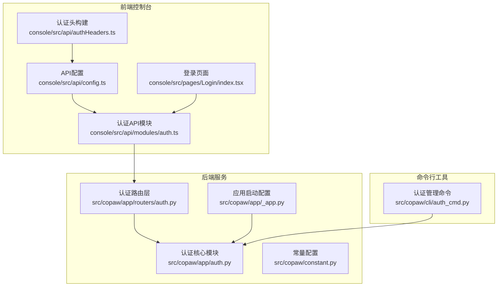
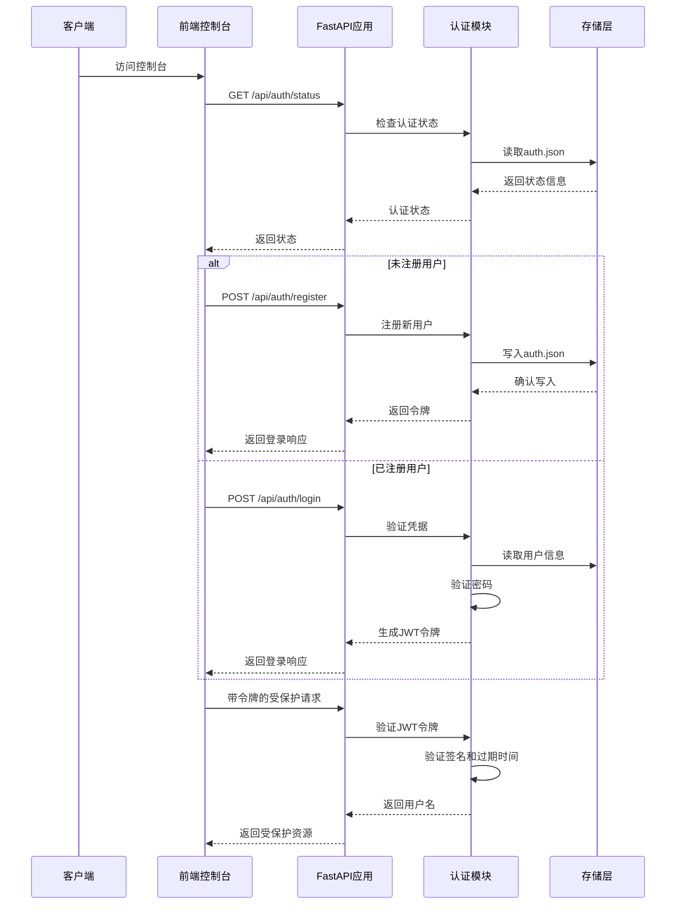
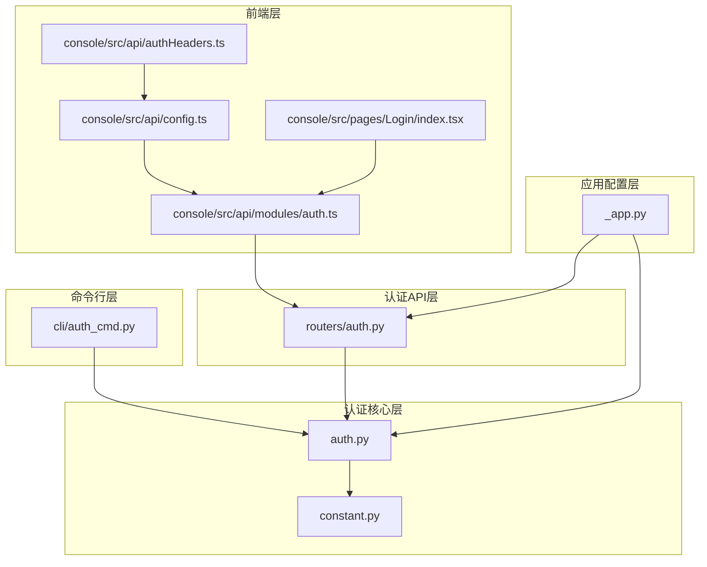
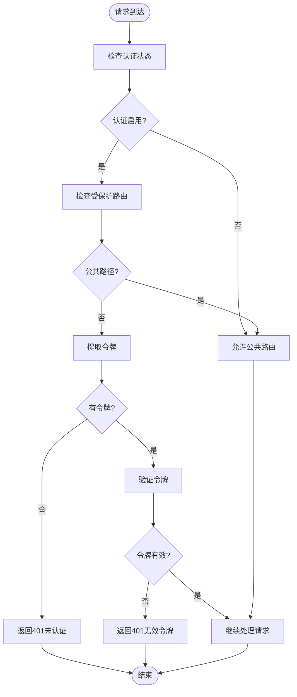

# 认证授权API

<cite>
**本文档引用的文件**
- [src/copaw/app/routers/auth.py](file://src/copaw/app/routers/auth.py)
- [src/copaw/app/auth.py](file://src/copaw/app/auth.py)
- [src/copaw/app/_app.py](file://src/copaw/app/_app.py)
- [console/src/api/modules/auth.ts](file://console/src/api/modules/auth.ts)
- [console/src/api/config.ts](file://console/src/api/config.ts)
- [console/src/api/authHeaders.ts](file://console/src/api/authHeaders.ts)
- [console/src/pages/Login/index.tsx](file://console/src/pages/Login/index.tsx)
- [src/copaw/cli/auth_cmd.py](file://src/copaw/cli/auth_cmd.py)
- [src/copaw/constant.py](file://src/copaw/constant.py)
- [website/public/docs/security.zh.md](file://website/public/docs/security.zh.md)
</cite>

## 目录
1. [简介](#简介)
2. [项目结构](#项目结构)
3. [核心组件](#核心组件)
4. [架构概览](#架构概览)
5. [详细组件分析](#详细组件分析)
6. [依赖关系分析](#依赖关系分析)
7. [性能考虑](#性能考虑)
8. [故障排除指南](#故障排除指南)
9. [结论](#结论)
10. [附录](#附录)

## 简介

CoPaw的认证授权系统提供了完整的Web登录认证功能，采用单用户设计，支持密码注册、登录验证、令牌管理和权限控制。系统基于FastAPI框架构建，使用HMAC-SHA256算法生成JWT令牌，令牌有效期为7天。

## 项目结构

认证授权相关的代码分布在以下模块中：



**图表来源**
- [src/copaw/app/routers/auth.py:1-175](file://src/copaw/app/routers/auth.py#L1-L175)
- [src/copaw/app/auth.py:1-405](file://src/copaw/app/auth.py#L1-L405)
- [src/copaw/app/_app.py:1-411](file://src/copaw/app/_app.py#L1-L411)

**章节来源**
- [src/copaw/app/routers/auth.py:1-175](file://src/copaw/app/routers/auth.py#L1-L175)
- [src/copaw/app/auth.py:1-405](file://src/copaw/app/auth.py#L1-L405)
- [src/copaw/app/_app.py:1-411](file://src/copaw/app/_app.py#L1-L411)

## 核心组件

### 认证路由层

认证路由层定义了所有认证相关的API端点，包括登录、注册、状态检查和令牌验证等功能。

### 认证核心模块

认证核心模块实现了密码哈希、JWT令牌生成与验证、用户数据持久化和FastAPI中间件等功能。

### 应用启动配置

应用启动配置负责注册认证中间件，设置CORS策略，并处理静态文件服务。

### 前端认证模块

前端认证模块提供了JavaScript API封装，简化了与后端认证服务的交互。

**章节来源**
- [src/copaw/app/routers/auth.py:22-175](file://src/copaw/app/routers/auth.py#L22-L175)
- [src/copaw/app/auth.py:81-404](file://src/copaw/app/auth.py#L81-L404)
- [src/copaw/app/_app.py:243-266](file://src/copaw/app/_app.py#L243-L266)

## 架构概览

CoPaw的认证授权架构采用分层设计，确保安全性与易用性的平衡：



**图表来源**
- [src/copaw/app/routers/auth.py:42-114](file://src/copaw/app/routers/auth.py#L42-L114)
- [src/copaw/app/auth.py:315-331](file://src/copaw/app/auth.py#L315-L331)

## 详细组件分析

### 认证API端点

#### 登录接口
- **HTTP方法**: POST
- **URL路径**: `/api/auth/login`
- **请求参数**: 
  - `username`: 用户名 (字符串)
  - `password`: 密码 (字符串)
- **响应格式**: 
  - `token`: JWT令牌 (字符串)
  - `username`: 用户名 (字符串)

#### 注册接口
- **HTTP方法**: POST  
- **URL路径**: `/api/auth/register`
- **请求参数**:
  - `username`: 用户名 (字符串)
  - `password`: 密码 (字符串)
- **响应格式**: 
  - `token`: JWT令牌 (字符串)
  - `username`: 用户名 (字符串)

#### 状态检查接口
- **HTTP方法**: GET
- **URL路径**: `/api/auth/status`
- **请求参数**: 无
- **响应格式**:
  - `enabled`: 认证是否启用 (布尔值)
  - `has_users`: 是否已注册用户 (布尔值)

#### 令牌验证接口
- **HTTP方法**: GET
- **URL路径**: `/api/auth/verify`
- **请求参数**: Authorization头 (Bearer令牌)
- **响应格式**:
  - `valid`: 令牌是否有效 (布尔值)
  - `username`: 用户名 (字符串)

#### 更新资料接口
- **HTTP方法**: POST
- **URL路径**: `/api/auth/update-profile`
- **请求参数**:
  - `current_password`: 当前密码 (字符串)
  - `new_username`: 新用户名 (可选，字符串)
  - `new_password`: 新密码 (可选，字符串)
- **响应格式**:
  - `token`: 新令牌 (字符串)
  - `username`: 用户名 (字符串)

**章节来源**
- [src/copaw/app/routers/auth.py:42-175](file://src/copaw/app/routers/auth.py#L42-L175)

### JWT令牌机制

#### 令牌生成
系统使用HMAC-SHA256算法生成JWT令牌，包含以下字段：
- `sub`: 用户标识 (用户名)
- `exp`: 过期时间 (Unix时间戳)
- `iat`: 签发时间 (Unix时间戳)

令牌有效期为7天，使用Base64URL编码的载荷和签名组成。

#### 令牌验证
令牌验证过程包括：
1. 分割载荷和签名部分
2. 使用JWT密钥重新计算签名
3. 比较签名的有效性
4. 解析载荷并检查过期时间
5. 返回用户名或None

#### 令牌存储
前端使用localStorage存储令牌，支持以下操作：
- 存储令牌：`localStorage.setItem('copaw_auth_token', token)`
- 获取令牌：从localStorage读取或环境变量
- 清除令牌：`localStorage.removeItem('copaw_auth_token')`

**章节来源**
- [src/copaw/app/auth.py:114-158](file://src/copaw/app/auth.py#L114-L158)
- [console/src/api/config.ts:23-41](file://console/src/api/config.ts#L23-L41)

### 身份验证中间件

认证中间件实现了智能的权限控制策略：

#### 公共路径
以下路径不需要认证：
- `/api/auth/login`
- `/api/auth/status`  
- `/api/auth/register`
- `/api/version`

#### 公共前缀
以下静态资源不需要认证：
- `/assets/`
- `/logo.png`
- `/copaw-symbol.svg`

#### 受保护路由
只有以`/api/`开头的路由才需要认证。

#### 本地免认证
来自`127.0.0.1`或`::1`的请求自动跳过认证，便于CLI工具使用。

#### WebSocket认证
WebSocket连接通过查询参数传递令牌，仅限升级请求。

**章节来源**
- [src/copaw/app/auth.py:41-56](file://src/copaw/app/auth.py#L41-L56)
- [src/copaw/app/auth.py:372-394](file://src/copaw/app/auth.py#L372-L394)

### 安全特性

#### 密码存储
- 使用加盐SHA-256哈希算法
- 密钥存储在`auth.json`文件中
- 文件权限设置为0o600（仅所有者可读写）

#### 外部依赖
- 仅使用Python标准库（hashlib、hmac、secrets）
- 不依赖第三方JWT库

#### CORS预检
- OPTIONS请求无需认证直接放行

#### 令牌管理
- 令牌过期时间为7天
- 密码修改时会轮换JWT密钥，使所有现有会话失效

**章节来源**
- [src/copaw/app/auth.py:103-111](file://src/copaw/app/auth.py#L103-L111)
- [website/public/docs/security.zh.md:314-328](file://website/public/docs/security.zh.md#L314-L328)

## 依赖关系分析



**图表来源**
- [src/copaw/app/routers/auth.py:10-17](file://src/copaw/app/routers/auth.py#L10-L17)
- [src/copaw/app/_app.py:20-26](file://src/copaw/app/_app.py#L20-L26)

### 组件耦合度分析

认证系统的模块间耦合度适中：
- 路由层与认证核心层通过函数调用耦合
- 前端与后端通过HTTP API耦合
- 应用启动配置与认证模块通过中间件注册耦合

### 外部依赖

系统外部依赖最少：
- FastAPI用于Web框架
- Starlette用于中间件基础类
- Python标准库用于加密和哈希

**章节来源**
- [src/copaw/app/_app.py:243-266](file://src/copaw/app/_app.py#L243-L266)
- [src/copaw/app/auth.py:29-32](file://src/copaw/app/auth.py#L29-L32)

## 性能考虑

### 认证性能优化

1. **内存缓存**: JWT密钥在内存中缓存，避免频繁磁盘I/O
2. **快速验证**: 使用hmac.compare_digest进行常量时间比较
3. **最小依赖**: 仅使用Python标准库，减少启动时间和内存占用

### 存储性能

1. **文件权限**: auth.json使用0o600权限，确保安全性同时不影响性能
2. **原子写入**: 使用临时文件再重命名的方式确保数据完整性

### 网络性能

1. **令牌复用**: 单用户设计避免了复杂的权限矩阵计算
2. **简单协议**: 使用标准HTTP头部传递令牌，兼容性好

## 故障排除指南

### 常见认证错误

#### 401 未认证
- **原因**: 缺少Authorization头或令牌无效
- **解决方案**: 确保前端正确存储和发送令牌

#### 401 令牌无效或已过期
- **原因**: 令牌签名不匹配或已超过7天有效期
- **解决方案**: 重新登录获取新令牌

#### 403 认证未启用
- **原因**: COPAW_AUTH_ENABLED环境变量未设置
- **解决方案**: 设置环境变量并重启服务

#### 409 用户已注册
- **原因**: 已存在注册用户但仍尝试注册
- **解决方案**: 直接登录而非注册

#### 400 参数无效
- **原因**: 用户名或密码为空
- **解决方案**: 提供有效的用户名和密码

### 错误处理流程



**图表来源**
- [src/copaw/app/auth.py:342-370](file://src/copaw/app/auth.py#L342-L370)

### 客户端实现示例

#### 前端JavaScript实现

```javascript
// 登录实现示例
async function login(username, password) {
    const response = await fetch('/api/auth/login', {
        method: 'POST',
        headers: {'Content-Type': 'application/json'},
        body: JSON.stringify({username, password})
    });
    
    if (response.ok) {
        const data = await response.json();
        // 存储令牌到localStorage
        localStorage.setItem('copaw_auth_token', data.token);
        return data;
    }
    
    throw new Error('登录失败');
}

// 受保护请求实现示例
async function apiCall(url, options = {}) {
    const token = localStorage.getItem('copaw_auth_token');
    const headers = {
        'Authorization': `Bearer ${token}`,
        'Content-Type': 'application/json'
    };
    
    const response = await fetch(`/api${url}`, {
        ...options,
        headers: {...headers, ...options.headers}
    });
    
    if (response.status === 401) {
        // 令牌过期，清除本地存储并重定向到登录页
        localStorage.removeItem('copaw_auth_token');
        window.location.href = '/login';
    }
    
    return response;
}
```

#### 后端Python实现

```python
# 使用认证令牌的示例
import requests

def make_authenticated_request(base_url, endpoint, token):
    """向受保护的API端点发起认证请求"""
    url = f"{base_url}{endpoint}"
    headers = {
        'Authorization': f'Bearer {token}',
        'Content-Type': 'application/json'
    }
    
    try:
        response = requests.post(url, headers=headers, timeout=30)
        
        if response.status_code == 401:
            # 处理令牌过期情况
            print("令牌已过期，请重新登录")
            return None
            
        response.raise_for_status()
        return response.json()
        
    except requests.exceptions.RequestException as e:
        print(f"请求失败: {e}")
        return None
```

**章节来源**
- [console/src/api/modules/auth.ts:15-74](file://console/src/api/modules/auth.ts#L15-L74)
- [console/src/pages/Login/index.tsx:35-70](file://console/src/pages/Login/index.tsx#L35-L70)

## 结论

CoPaw的认证授权系统设计简洁而安全，采用了单用户模型和最小依赖原则。系统提供了完整的认证生命周期管理，包括注册、登录、令牌管理和权限控制。通过HMAC-SHA256算法和7天有效期的令牌机制，确保了安全性与可用性的平衡。

主要优势：
- **安全性**: 使用标准库加密算法，令牌过期机制，严格的文件权限控制
- **易用性**: 简单的单用户模型，直观的API设计
- **可靠性**: 完善的错误处理和故障恢复机制
- **可维护性**: 清晰的模块分离和最小依赖设计

建议的改进方向：
- 支持多用户场景的扩展
- 添加令牌刷新机制
- 实现更细粒度的权限控制

## 附录

### 环境变量配置

| 环境变量 | 默认值 | 描述 |
|---------|--------|------|
| COPAW_AUTH_ENABLED | false | 启用/禁用认证功能 |
| COPAW_AUTH_USERNAME | 无 | 自动注册的用户名 |
| COPAW_AUTH_PASSWORD | 无 | 自动注册的密码 |
| COPAW_SECRET_DIR | ~/.copaw/.secret | 认证数据存储目录 |

### 最佳实践

1. **安全存储**: 将COPAW_AUTH_ENABLED设置为true并在生产环境中使用
2. **定期轮换**: 建议每6个月轮换一次JWT密钥
3. **监控告警**: 监控认证失败率和异常登录行为
4. **备份策略**: 定期备份auth.json文件
5. **访问控制**: 限制对CoPaw实例的网络访问范围

### 故障排查清单

- [ ] 确认COPAW_AUTH_ENABLED环境变量已设置
- [ ] 检查auth.json文件权限是否为0o600
- [ ] 验证令牌是否在localStorage中正确存储
- [ ] 确认前端请求是否包含正确的Authorization头
- [ ] 检查服务器日志中的认证相关错误信息