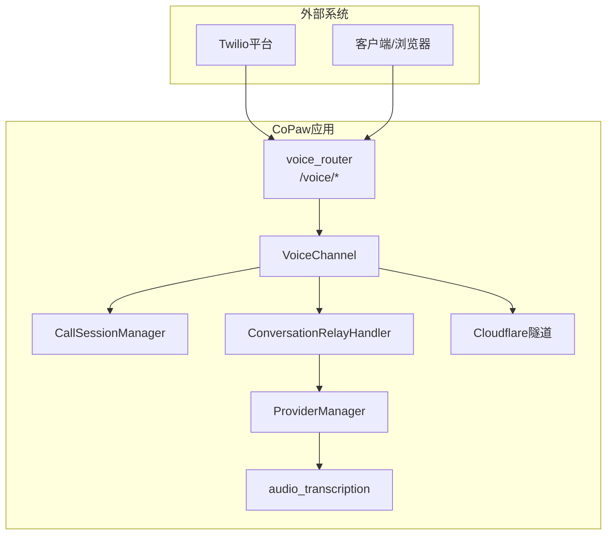
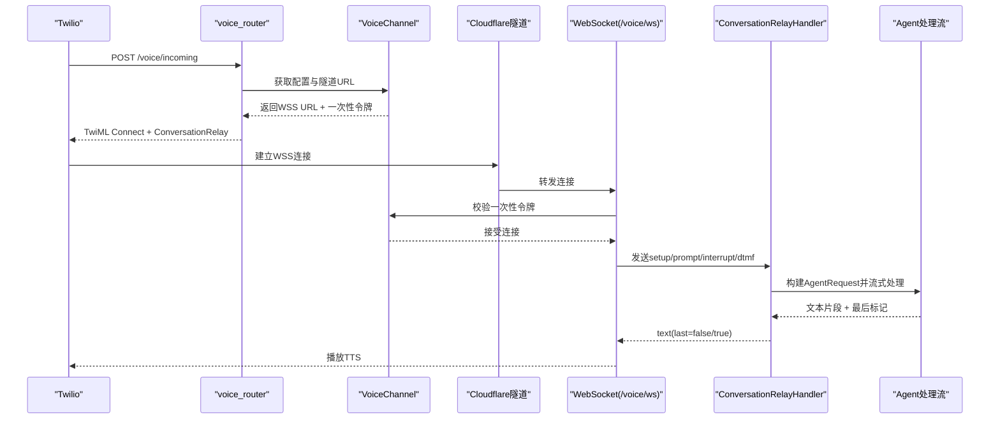
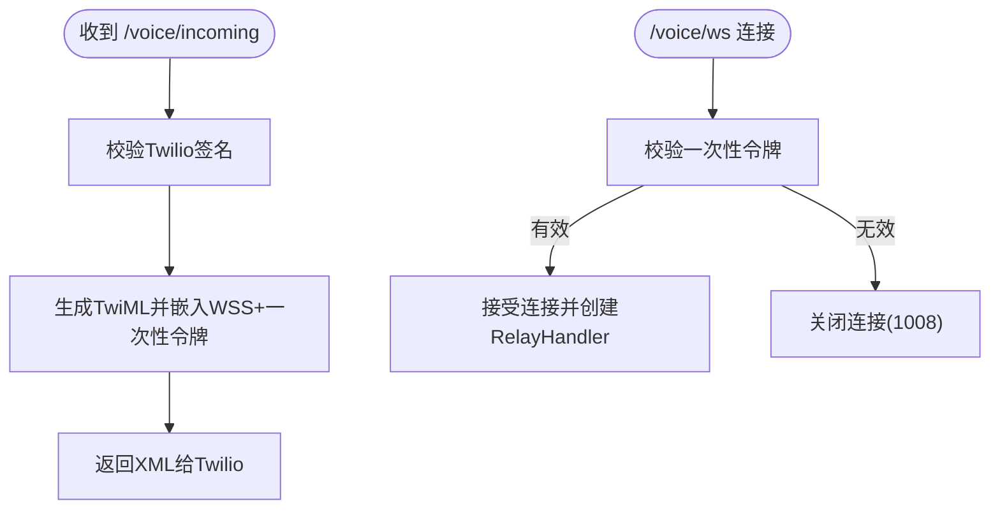
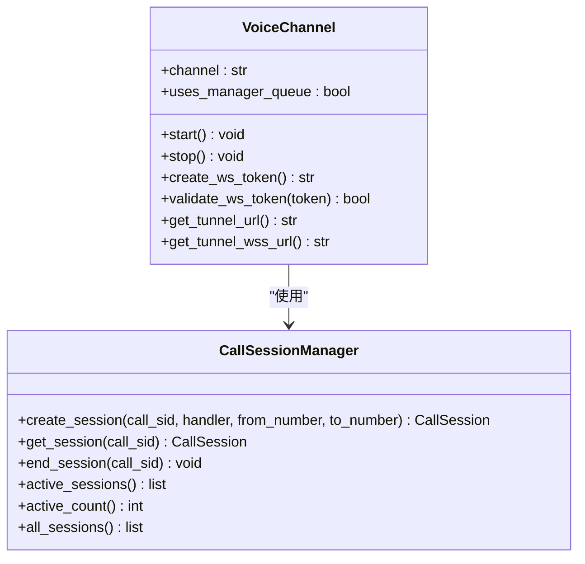
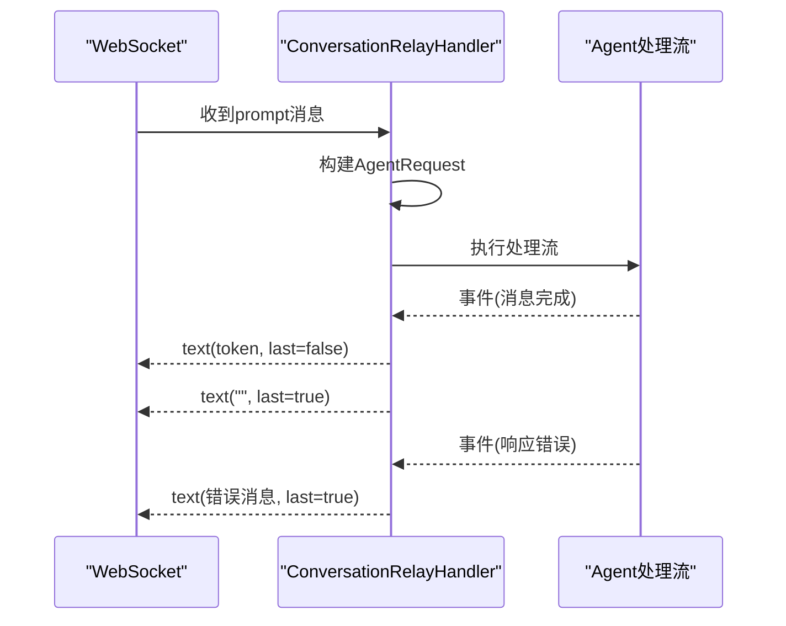
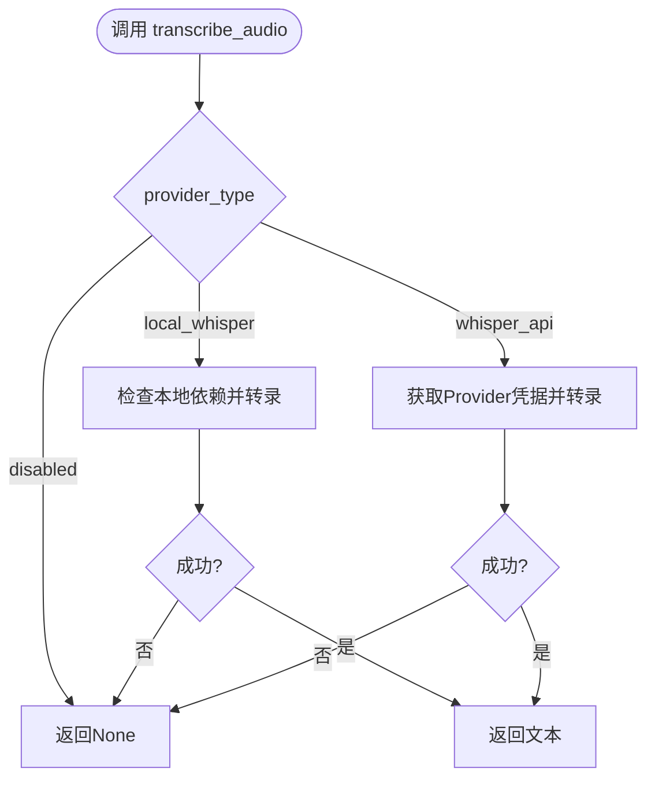
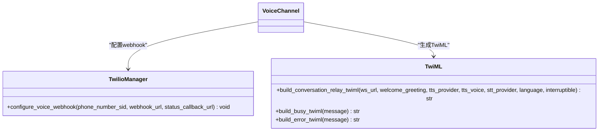
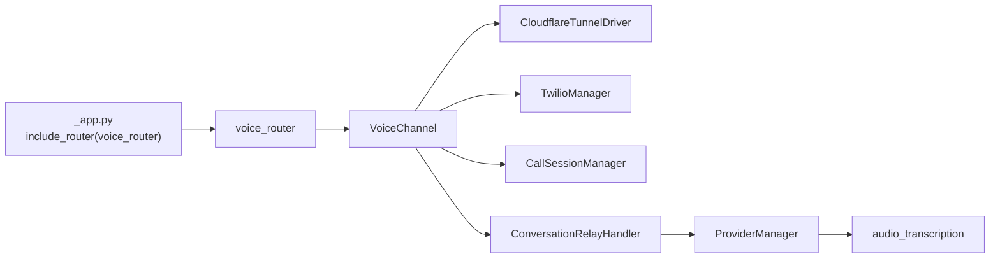

# 语音转录API

<cite>
**本文档引用的文件**
- [src/copaw/app/routers/voice.py](file://src/copaw/app/routers/voice.py)
- [src/copaw/app/channels/voice/channel.py](file://src/copaw/app/channels/voice/channel.py)
- [src/copaw/app/channels/voice/session.py](file://src/copaw/app/channels/voice/session.py)
- [src/copaw/app/channels/voice/conversation_relay.py](file://src/copaw/app/channels/voice/conversation_relay.py)
- [src/copaw/app/channels/voice/twilio_manager.py](file://src/copaw/app/channels/voice/twilio_manager.py)
- [src/copaw/app/channels/voice/twiml.py](file://src/copaw/app/channels/voice/twiml.py)
- [src/copaw/agents/utils/audio_transcription.py](file://src/copaw/agents/utils/audio_transcription.py)
- [src/copaw/config/config.py](file://src/copaw/config/config.py)
- [src/copaw/app/_app.py](file://src/copaw/app/_app.py)
- [console/src/pages/Settings/VoiceTranscription/index.tsx](file://console/src/pages/Settings/VoiceTranscription/index.tsx)
</cite>

## 目录
1. [简介](#简介)
2. [项目结构](#项目结构)
3. [核心组件](#核心组件)
4. [架构总览](#架构总览)
5. [详细组件分析](#详细组件分析)
6. [依赖关系分析](#依赖关系分析)
7. [性能考虑](#性能考虑)
8. [故障排除指南](#故障排除指南)
9. [结论](#结论)
10. [附录](#附录)

## 简介
本文件面向CoPaw的语音转录API，系统性梳理从语音消息上传、实时转录到离线转录的完整流程，涵盖Twilio通话接入、WebSocket会话中继、语音质量优化、噪声过滤、多语言支持、并发会话管理以及结果后处理与格式化。同时提供接口规范、错误处理策略、质量控制机制及并发处理能力说明，帮助开发者快速集成并稳定运行语音转录服务。

## 项目结构
CoPaw的语音转录能力由以下模块协同实现：
- 路由层：Twilio对外接口（来电、WebSocket、状态回调）
- 通道层：VoiceChannel封装Twilio会话、Cloudflare隧道与会话管理
- 会话中继：ConversationRelayHandler负责与Twilio WebSocket交互，驱动Agent处理
- 配置层：VoiceChannelConfig定义语音通道参数；AgentsConfig定义转录提供者类型与模型
- 转录工具：audio_transcription提供本地Whisper与远端Whisper API两种后端
- 前端设置页：VoiceTranscription页面用于配置音频模式与转录提供者

**图表来源**
- [src/copaw/app/routers/voice.py:25-184](file://src/copaw/app/routers/voice.py#L25-L184)
- [src/copaw/app/channels/voice/channel.py:17-240](file://src/copaw/app/channels/voice/channel.py#L17-L240)
- [src/copaw/app/channels/voice/session.py:28-73](file://src/copaw/app/channels/voice/session.py#L28-L73)
- [src/copaw/app/channels/voice/conversation_relay.py:29-289](file://src/copaw/app/channels/voice/conversation_relay.py#L29-L289)
- [src/copaw/agents/utils/audio_transcription.py:295-318](file://src/copaw/agents/utils/audio_transcription.py#L295-L318)

**章节来源**
- [src/copaw/app/routers/voice.py:25-184](file://src/copaw/app/routers/voice.py#L25-L184)
- [src/copaw/app/channels/voice/channel.py:17-240](file://src/copaw/app/channels/voice/channel.py#L17-L240)
- [src/copaw/app/channels/voice/session.py:28-73](file://src/copaw/app/channels/voice/session.py#L28-L73)
- [src/copaw/app/channels/voice/conversation_relay.py:29-289](file://src/copaw/app/channels/voice/conversation_relay.py#L29-L289)
- [src/copaw/agents/utils/audio_transcription.py:295-318](file://src/copaw/agents/utils/audio_transcription.py#L295-L318)
- [src/copaw/config/config.py:150-162](file://src/copaw/config/config.py#L150-L162)
- [src/copaw/app/_app.py:342-344](file://src/copaw/app/_app.py#L342-L344)

## 核心组件
- Twilio对外接口
  - 来电入口：POST /voice/incoming 返回TwiML连接到ConversationRelay
  - WebSocket中继：GET /voice/ws 接受Twilio WebSocket流
  - 状态回调：POST /voice/status-callback 处理通话状态变更
- 语音通道与会话
  - VoiceChannel：启动/停止隧道、配置Twilio webhook、生成一次性WS令牌、会话管理
  - CallSessionManager：维护活跃会话、统计活跃数量、结束会话
  - ConversationRelayHandler：接收Twilio消息、构建Agent请求、流式返回文本
- 转录后端
  - 本地Whisper：依赖ffmpeg与openai-whisper库
  - 远端Whisper API：基于OpenAI兼容接口（如Ollama或第三方）
- 配置与前端
  - VoiceChannelConfig：TTS/STT提供商、语言、欢迎语等
  - AgentsConfig：音频模式（自动/原生）、转录提供者类型与模型
  - VoiceTranscription页面：配置音频模式与转录提供者

**章节来源**
- [src/copaw/app/routers/voice.py:84-184](file://src/copaw/app/routers/voice.py#L84-L184)
- [src/copaw/app/channels/voice/channel.py:17-240](file://src/copaw/app/channels/voice/channel.py#L17-L240)
- [src/copaw/app/channels/voice/session.py:28-73](file://src/copaw/app/channels/voice/session.py#L28-L73)
- [src/copaw/app/channels/voice/conversation_relay.py:29-289](file://src/copaw/app/channels/voice/conversation_relay.py#L29-L289)
- [src/copaw/agents/utils/audio_transcription.py:295-318](file://src/copaw/agents/utils/audio_transcription.py#L295-L318)
- [src/copaw/config/config.py:150-162](file://src/copaw/config/config.py#L150-L162)
- [src/copaw/config/config.py:550-589](file://src/copaw/config/config.py#L550-L589)
- [console/src/pages/Settings/VoiceTranscription/index.tsx:20-287](file://console/src/pages/Settings/VoiceTranscription/index.tsx#L20-L287)

## 架构总览
CoPaw通过Cloudflare隧道暴露WebSocket端点，Twilio来电触发TwiML连接至该端点。WebSocket建立后，ConversationRelayHandler解析Twilio推送的语音转写文本，构建Agent请求并流式返回文本给Twilio进行TTS播放。转录后端可选择本地Whisper或远端Whisper API，具体由配置决定。

**图表来源**
- [src/copaw/app/routers/voice.py:84-184](file://src/copaw/app/routers/voice.py#L84-L184)
- [src/copaw/app/channels/voice/channel.py:100-131](file://src/copaw/app/channels/voice/channel.py#L100-L131)
- [src/copaw/app/channels/voice/conversation_relay.py:60-226](file://src/copaw/app/channels/voice/conversation_relay.py#L60-L226)

**章节来源**
- [src/copaw/app/routers/voice.py:84-184](file://src/copaw/app/routers/voice.py#L84-L184)
- [src/copaw/app/channels/voice/channel.py:81-137](file://src/copaw/app/channels/voice/channel.py#L81-L137)
- [src/copaw/app/channels/voice/conversation_relay.py:60-226](file://src/copaw/app/channels/voice/conversation_relay.py#L60-L226)

## 详细组件分析

### 组件A：Twilio对外接口（voice_router）
- 功能
  - /voice/incoming：校验签名后生成TwiML，连接到ConversationRelay WebSocket，并注入一次性令牌
  - /voice/ws：校验一次性令牌后接受WebSocket连接，交由ConversationRelayHandler处理
  - /voice/status-callback：校验签名后记录通话状态，必要时结束会话
- 安全
  - 使用Twilio RequestValidator校验请求签名，支持反向代理场景重建公共URL
- 并发
  - 每个来电对应一个独立WebSocket连接，由会话管理器统一跟踪

**图表来源**
- [src/copaw/app/routers/voice.py:42-82](file://src/copaw/app/routers/voice.py#L42-L82)
- [src/copaw/app/routers/voice.py:125-161](file://src/copaw/app/routers/voice.py#L125-L161)

**章节来源**
- [src/copaw/app/routers/voice.py:84-184](file://src/copaw/app/routers/voice.py#L84-L184)

### 组件B：语音通道与会话管理（VoiceChannel + CallSessionManager）
- VoiceChannel
  - 启动：创建Cloudflare隧道，配置Twilio webhook，记录公网URL
  - 停止：关闭所有活动会话，停止隧道
  - 令牌：生成一次性令牌用于WebSocket鉴权，防止未授权访问
  - 会话：通过CallSessionManager创建/结束会话，记录caller信息
- CallSessionManager
  - 创建会话、查询会话、结束会话、统计活跃会话数

**图表来源**
- [src/copaw/app/channels/voice/channel.py:17-240](file://src/copaw/app/channels/voice/channel.py#L17-L240)
- [src/copaw/app/channels/voice/session.py:28-73](file://src/copaw/app/channels/voice/session.py#L28-L73)

**章节来源**
- [src/copaw/app/channels/voice/channel.py:81-158](file://src/copaw/app/channels/voice/channel.py#L81-L158)
- [src/copaw/app/channels/voice/session.py:28-73](file://src/copaw/app/channels/voice/session.py#L28-L73)

### 组件C：会话中继与Agent处理（ConversationRelayHandler）
- 消息类型
  - setup：初始化call_sid与caller信息
  - prompt：用户语音转写文本
  - interrupt：打断信息（开始说话）
  - dtmf：按键输入
- 处理流程
  - 将prompt转换为AgentRequest，调用Agent处理流
  - 流式提取文本内容，发送text(last=false)，最后发送text(last=true)以触发播放
  - 异常时发送标准错误提示并结束连接

**图表来源**
- [src/copaw/app/channels/voice/conversation_relay.py:127-226](file://src/copaw/app/channels/voice/conversation_relay.py#L127-L226)

**章节来源**
- [src/copaw/app/channels/voice/conversation_relay.py:60-226](file://src/copaw/app/channels/voice/conversation_relay.py#L60-L226)

### 组件D：转录后端与配置（audio_transcription + 配置）
- 转录提供者类型
  - disabled：禁用转录
  - whisper_api：使用远端Whisper API（需配置Provider）
  - local_whisper：使用本地openai-whisper（需ffmpeg与whisper库）
- Provider检测
  - 列出可用Provider并检查是否具备API密钥
  - 检查本地环境：ffmpeg与whisper库是否安装
- 配置项
  - audio_mode：auto/native
  - transcription_provider_type：disabled/whisper_api/local_whisper
  - transcription_provider_id：远端Provider ID
  - transcription_model：Whisper模型名称

**图表来源**
- [src/copaw/agents/utils/audio_transcription.py:295-318](file://src/copaw/agents/utils/audio_transcription.py#L295-L318)

**章节来源**
- [src/copaw/agents/utils/audio_transcription.py:87-148](file://src/copaw/agents/utils/audio_transcription.py#L87-L148)
- [src/copaw/agents/utils/audio_transcription.py:203-288](file://src/copaw/agents/utils/audio_transcription.py#L203-L288)
- [src/copaw/config/config.py:550-589](file://src/copaw/config/config.py#L550-L589)

### 组件E：Twilio集成与TwiML生成（TwilioManager + TwiML）
- TwilioManager
  - 异步包装twilio SDK，更新来电号码的voice_url与status_callback
- TwiML生成
  - build_conversation_relay_twiml：生成Connect + ConversationRelay节点，包含TTS/STT提供商、语言、欢迎语等
  - 其他辅助：busy/error TwiML

**图表来源**
- [src/copaw/app/channels/voice/twilio_manager.py:12-58](file://src/copaw/app/channels/voice/twilio_manager.py#L12-L58)
- [src/copaw/app/channels/voice/twiml.py:8-37](file://src/copaw/app/channels/voice/twiml.py#L8-L37)

**章节来源**
- [src/copaw/app/channels/voice/twilio_manager.py:31-57](file://src/copaw/app/channels/voice/twilio_manager.py#L31-L57)
- [src/copaw/app/channels/voice/twiml.py:8-37](file://src/copaw/app/channels/voice/twiml.py#L8-L37)

### 组件F：前端设置与配置同步（VoiceTranscription页面）
- 支持的配置项
  - audio_mode：auto/native
  - transcription_provider_type：disabled/whisper_api/local_whisper
  - transcription_provider_id：远端Provider ID
  - 本地Whisper可用性检查
- 行为
  - 加载时并行获取音频模式、转录提供者类型、可用Provider列表与本地Whisper状态
  - 保存时按需更新多项配置

**章节来源**
- [console/src/pages/Settings/VoiceTranscription/index.tsx:31-75](file://console/src/pages/Settings/VoiceTranscription/index.tsx#L31-L75)
- [console/src/pages/Settings/VoiceTranscription/index.tsx:154-257](file://console/src/pages/Settings/VoiceTranscription/index.tsx#L154-L257)

## 依赖关系分析
- 应用启动时注册voice_router，使其在根路径下提供Twilio接口
- VoiceChannel依赖Cloudflare隧道与TwilioManager，通过会话管理器协调多个并发通话
- ConversationRelayHandler依赖Agent处理流，将文本事件流式返回Twilio
- 转录后端依赖ProviderManager与配置，支持本地与远端两种模式

**图表来源**
- [src/copaw/app/_app.py:342-344](file://src/copaw/app/_app.py#L342-L344)
- [src/copaw/app/routers/voice.py:25-184](file://src/copaw/app/routers/voice.py#L25-L184)
- [src/copaw/app/channels/voice/channel.py:100-131](file://src/copaw/app/channels/voice/channel.py#L100-L131)
- [src/copaw/app/channels/voice/conversation_relay.py:185-226](file://src/copaw/app/channels/voice/conversation_relay.py#L185-L226)
- [src/copaw/agents/utils/audio_transcription.py:295-318](file://src/copaw/agents/utils/audio_transcription.py#L295-L318)

**章节来源**
- [src/copaw/app/_app.py:342-344](file://src/copaw/app/_app.py#L342-L344)
- [src/copaw/app/routers/voice.py:25-184](file://src/copaw/app/routers/voice.py#L25-L184)
- [src/copaw/app/channels/voice/channel.py:100-131](file://src/copaw/app/channels/voice/channel.py#L100-L131)
- [src/copaw/app/channels/voice/conversation_relay.py:185-226](file://src/copaw/app/channels/voice/conversation_relay.py#L185-L226)
- [src/copaw/agents/utils/audio_transcription.py:295-318](file://src/copaw/agents/utils/audio_transcription.py#L295-L318)

## 性能考虑
- 并发处理
  - 每个来电独立WebSocket连接，会话管理器跟踪活跃会话，避免阻塞
  - 本地转录在独立线程执行，避免阻塞事件循环
- 转录延迟
  - 远端Whisper API延迟取决于网络与服务端性能；本地Whisper依赖本地硬件
  - 建议在高并发场景优先使用远端API并启用合适的超时与重试
- 资源占用
  - 本地Whisper对CPU/GPU有较高要求；建议在专用节点部署
  - 控制同时活跃会话数量，避免资源争用

## 故障排除指南
- Twilio签名验证失败
  - 确认已配置Twilio认证令牌；检查反向代理转发头（x-forwarded-proto/host）是否正确
- WebSocket连接被拒绝
  - 核查一次性令牌是否匹配且未过期；确认TwiML中嵌入的WSS URL正确
- 通话状态异常
  - status-callback会在特定状态结束会话，检查日志定位问题
- 转录失败
  - 本地Whisper：检查ffmpeg与whisper库是否安装；查看日志中的缺失依赖提示
  - 远端Whisper API：检查Provider凭据与网络连通性；确认模型名称正确

**章节来源**
- [src/copaw/app/routers/voice.py:42-82](file://src/copaw/app/routers/voice.py#L42-L82)
- [src/copaw/app/routers/voice.py:163-184](file://src/copaw/app/routers/voice.py#L163-L184)
- [src/copaw/app/channels/voice/channel.py:213-226](file://src/copaw/app/channels/voice/channel.py#L213-L226)
- [src/copaw/agents/utils/audio_transcription.py:161-200](file://src/copaw/agents/utils/audio_transcription.py#L161-L200)
- [src/copaw/agents/utils/audio_transcription.py:242-288](file://src/copaw/agents/utils/audio_transcription.py#L242-L288)

## 结论
CoPaw的语音转录API通过Twilio与WebSocket实现来电接入与实时中继，结合本地/远端转录后端满足不同部署需求。配置灵活、并发处理稳健，适合在企业级环境中提供高质量的语音对话服务。建议根据业务负载选择合适的转录后端与并发策略，并配合前端设置页面进行可视化配置与监控。

## 附录

### 接口规范（Twilio对外）
- POST /voice/incoming
  - 描述：Twilio来电回调，返回TwiML连接到ConversationRelay
  - 认证：Twilio签名验证
  - 响应：application/xml（TwiML）
- GET /voice/ws
  - 描述：WebSocket中继端点
  - 认证：一次性令牌校验
  - 响应：WebSocket连接
- POST /voice/status-callback
  - 描述：通话状态回调
  - 认证：Twilio签名验证
  - 响应：204 No Content

**章节来源**
- [src/copaw/app/routers/voice.py:84-184](file://src/copaw/app/routers/voice.py#L84-L184)

### 配置项说明
- VoiceChannelConfig
  - twilio_account_sid、twilio_auth_token：Twilio凭证
  - phone_number_sid：来电号码SID
  - tts_provider、tts_voice、stt_provider、language：TTS/STT与语言
  - welcome_greeting：欢迎语
- AgentsConfig
  - audio_mode：auto/native
  - transcription_provider_type：disabled/whisper_api/local_whisper
  - transcription_provider_id：远端Provider ID
  - transcription_model：Whisper模型名

**章节来源**
- [src/copaw/config/config.py:150-162](file://src/copaw/config/config.py#L150-L162)
- [src/copaw/config/config.py:550-589](file://src/copaw/config/config.py#L550-L589)