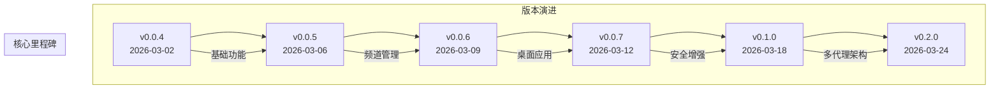

# 发布说明

<cite>
**本文档中引用的文件**
- [README.md](file://README.md)
- [src/copaw/__version__.py](file://src/copaw/__version__.py)
- [pyproject.toml](file://pyproject.toml)
- [website/public/release-notes/v0.2.0.md](file://website/public/release-notes/v0.2.0.md)
- [website/public/release-notes/v0.1.0.md](file://website/public/release-notes/v0.1.0.md)
- [website/public/release-notes/v0.0.7.md](file://website/public/release-notes/v0.0.7.md)
- [website/public/release-notes/v0.0.6.md](file://website/public/release-notes/v0.0.6.md)
- [website/public/release-notes/v0.0.5.md](file://website/public/release-notes/v0.0.5.md)
- [website/public/release-notes/v0.0.4.md](file://website/public/release-notes/v0.0.4.md)
- [console/package.json](file://console/package.json)
- [scripts/README.md](file://scripts/README.md)
- [CONTRIBUTING.md](file://CONTRIBUTING.md)
- [SECURITY.md](file://SECURITY.md)
</cite>

## 目录
1. [简介](#简介)
2. [版本历史概览](#版本历史概览)
3. [最新版本特性](#最新版本特性)
4. [核心功能演进](#核心功能演进)
5. [安全增强](#安全增强)
6. [平台支持与兼容性](#平台支持与兼容性)
7. [开发工具链](#开发工具链)
8. [贡献指南](#贡献指南)
9. [安全策略](#安全策略)
10. [结语](#结语)

## 简介

CoPaw 是一个在用户自有环境中运行的个人AI助手。它通过多个聊天应用（DingTalk、Feishu、QQ、Discord、iMessage等）与用户对话，并根据配置执行计划任务。其能力由技能（Skills）驱动，可能性无限扩展。内置技能包括定时任务、PDF/Office处理、新闻摘要、文件读取等；用户可以添加自定义技能。所有数据和任务都在本地机器上运行，无需第三方托管。

## 版本历史概览

CoPaw 项目自 v0.0.4 发布以来，经历了快速的发展和迭代。从最初的 Telegram 频道支持到现在的多代理架构，每个版本都带来了重要的功能增强和改进。

**图表来源**
- [website/public/release-notes/v0.0.4.md:1-46](file://website/public/release-notes/v0.0.4.md#L1-L46)
- [website/public/release-notes/v0.0.5.md:1-129](file://website/public/release-notes/v0.0.5.md#L1-L129)
- [website/public/release-notes/v0.0.6.md:1-93](file://website/public/release-notes/v0.0.6.md#L1-L93)
- [website/public/release-notes/v0.0.7.md:1-99](file://website/public/release-notes/v0.0.7.md#L1-L99)
- [website/public/release-notes/v0.1.0.md:1-120](file://website/public/release-notes/v0.1.0.md#L1-L120)
- [website/public/release-notes/v0.2.0.md:1-99](file://website/public/release-notes/v0.2.0.md#L1-L99)

## 最新版本特性

### v0.2.0 核心特性

v0.2.0 是 CoPaw 的一个重要里程碑版本，引入了多项重大功能增强：

#### 代理间通信
- 新增 `copaw agents` 和 `copaw message` CLI 命令，支持代理列表查看、向渠道推送消息和代理间请求发送
- 实现了真正的多代理协作能力

#### 内置问答代理
- 提供预配置的问答代理，专门用于回答 CoPaw 安装和使用问题
- 减少了用户的学习成本和配置复杂度

#### 可配置的LLM自动重试
- 每个代理都可以从控制台设置页面配置 LLM 重试行为
- 改进了模型调用的稳定性

#### 文件访问保护
- 添加了可配置的敏感文件和目录拒绝列表
- 当启用时，代理工具被阻止读取或写入这些路径

**章节来源**
- [website/public/release-notes/v0.2.0.md:1-99](file://website/public/release-notes/v0.2.0.md#L1-L99)

## 核心功能演进

### 多代理架构

v0.1.0 引入了革命性的多代理/多工作区架构：
- 支持同时运行多个代理，每个代理都有独立的工作区
- 包含控制台代理选择器，便于在代理之间切换
- 每个代理拥有独立的配置、内存、技能和工具

### 技能安全扫描

v0.0.7 引入了技能安全扫描功能：
- 使用静态分析扫描安装前的技能安全风险
- 检测提示注入、命令注入、硬编码密钥和数据泄露
- 提供破坏性shell命令检测规则

### 国际化支持

v0.0.6 增加了完整的国际化支持：
- 俄语和日语的完整翻译
- 控制台UI、代理配置文件和初始化命令的语言选择
- 多语言文档支持

**章节来源**
- [website/public/release-notes/v0.1.0.md:1-120](file://website/public/release-notes/v0.1.0.md#L1-L120)
- [website/public/release-notes/v0.0.7.md:1-99](file://website/public/release-notes/v0.0.7.md#L1-L99)
- [website/public/release-notes/v0.0.6.md:1-93](file://website/public/release-notes/v0.0.6.md#L1-L93)

## 安全增强

### 工具守卫系统

v0.0.7 引入了工具守卫系统：
- 预执行安全层扫描工具参数中的危险模式
- 对于高风险调用，需要用户通过 `/approve` 批准
- 拒绝的工具始终被阻止

### Web认证

v0.1.0 添加了可选的Web认证：
- 单用户注册、基于令牌的登录
- localhost绕过功能
- CLI命令支持

### 信任边界管理

项目建立了清晰的安全信任模型：
- 认证调用者被视为同一CoPaw实例的信任操作员
- 会话标识符和标签仅是路由/上下文控制，不是每用户的授权边界
- 推荐模式：每个用户一台机器（或每个OS用户），每个用户一个CoPaw配置

**章节来源**
- [website/public/release-notes/v0.0.7.md:1-99](file://website/public/release-notes/v0.0.7.md#L1-L99)
- [website/public/release-notes/v0.1.0.md:1-120](file://website/public/release-notes/v0.1.0.md#L1-L120)
- [SECURITY.md:65-118](file://SECURITY.md#L65-L118)

## 平台支持与兼容性

### 桌面应用程序

v0.0.6 引入了原生桌面安装程序：
- Windows一键安装器和macOS独立.app包
- 使用conda-pack进行便携式Python环境
- 自动化的GitHub Actions发布工作流

### 跨平台支持

项目支持多种操作系统：
- Windows 10+ 和 macOS 14+
- Linux兼容性持续改进
- 移动端支持（iOS和Android）

### 浏览器兼容性

前端使用现代浏览器技术：
- React 18 + TypeScript
- Ant Design 5.x 组件库
- 支持暗色模式和响应式设计

**章节来源**
- [website/public/release-notes/v0.0.6.md:1-93](file://website/public/release-notes/v0.0.6.md#L1-L93)
- [console/package.json:1-60](file://console/package.json#L1-L60)

## 开发工具链

### 构建系统

项目采用现代化的构建工具链：
- Python setuptools + pyproject.toml
- Vite + React + TypeScript 前端
- Docker 多阶段构建
- GitHub Actions CI/CD

### 测试框架

完善的测试体系：
- pytest + asyncio 支持
- 单元测试和集成测试
- 覆盖率报告生成
- 并行测试执行支持

### 开发环境

开发体验优化：
- pre-commit 钩子检查
- ESLint + Prettier 代码格式化
- VS Code 配置建议
- Docker 开发环境

**章节来源**
- [pyproject.toml:1-103](file://pyproject.toml#L1-L103)
- [scripts/README.md:1-53](file://scripts/README.md#L1-L53)
- [console/package.json:1-60](file://console/package.json#L1-L60)

## 贡献指南

### 贡献类型

项目欢迎各种形式的贡献：

#### 新模型/模型提供商
- 用户可以通过控制台或 `providers.json` 添加自定义提供商
- 支持任何OpenAI兼容API（如vLLM、SGLang、私有端点）
- 无需代码更改即可配置标准OpenAI兼容API

#### 新频道
- 实现 `BaseChannel` 子类
- 使用统一的进程内协议：原生负载 → `content_parts`
- 支持长连接通道的消息处理

#### 基础技能
- 每个技能是一个包含特定结构的目录
- `SKILL.md` - Markdown指令，使用YAML前置信息
- `references/` - 参考文档
- `scripts/` - 技能使用的脚本或工具

### 代码质量要求

- 必须通过 pre-commit 检查
- 编写相关测试
- 更新文档
- 使用约定式提交格式

**章节来源**
- [CONTRIBUTING.md:1-244](file://CONTRIBUTING.md#L1-L244)

## 安全策略

### 报告流程

发现安全问题的正确流程：
1. 通过阿里巴巴安全响应中心(ASRC)私下报告
2. 提供详细的技术重现步骤
3. 包含影响评估和修复建议
4. 提供受影响组件的精确路径

### 安全模型

CoPaw 采用"个人助理"安全模型：
- 同一实例的认证调用者被视为信任操作员
- 会话标识符不创建每用户的主机授权边界
- 不推荐互相不可信的操作员共享单个CoPaw实例

### 受信任技能概念

技能是CoPaw可信计算基的一部分：
- 安装或启用技能授予与本地运行代码相同的信任级别
- 技能行为如读取环境变量/文件或运行主机命令在此信任边界内是预期行为
- 只安装和启用你信任的技能

**章节来源**
- [SECURITY.md:1-158](file://SECURITY.md#L1-L158)

## 结语

CoPaw 项目展现了从单一功能到完整生态系统的发展历程。从最初的 Telegram 频道支持，到现在的多代理架构、安全增强和桌面应用，每个版本都体现了项目团队对用户体验和安全性的重视。

v0.2.0 版本的发布标志着 CoPaw 在多代理协作和安全性方面达到了新的高度。随着项目的持续发展，我们期待看到更多创新功能的加入，为用户提供更强大、更安全的个人AI助手体验。

---

**版本信息**
- 当前版本：1.0.0b1
- Python支持：3.10 - <3.14
- 最新发布：v0.2.0 (2026-03-24)
- 下一个版本：1.0.0 (稳定版)

**项目状态**
- Apache License 2.0
- 活跃开发中
- 社区驱动
- 全球开源