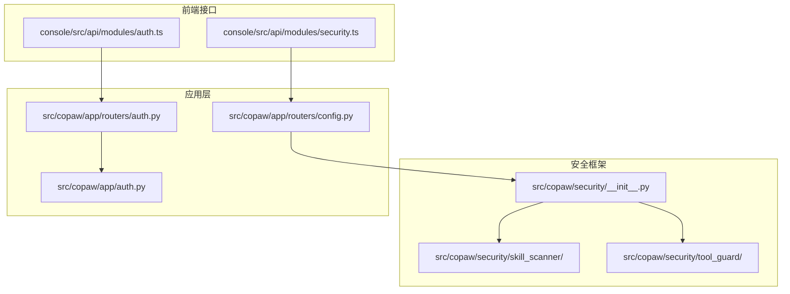
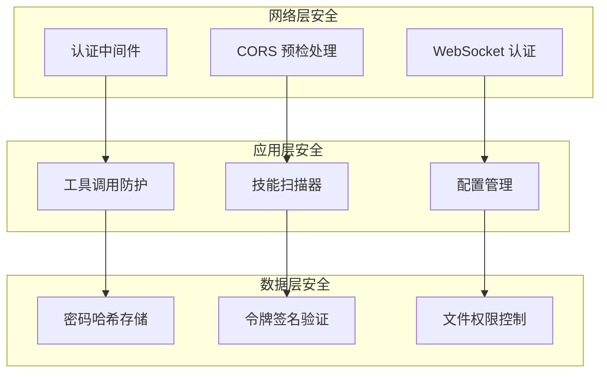
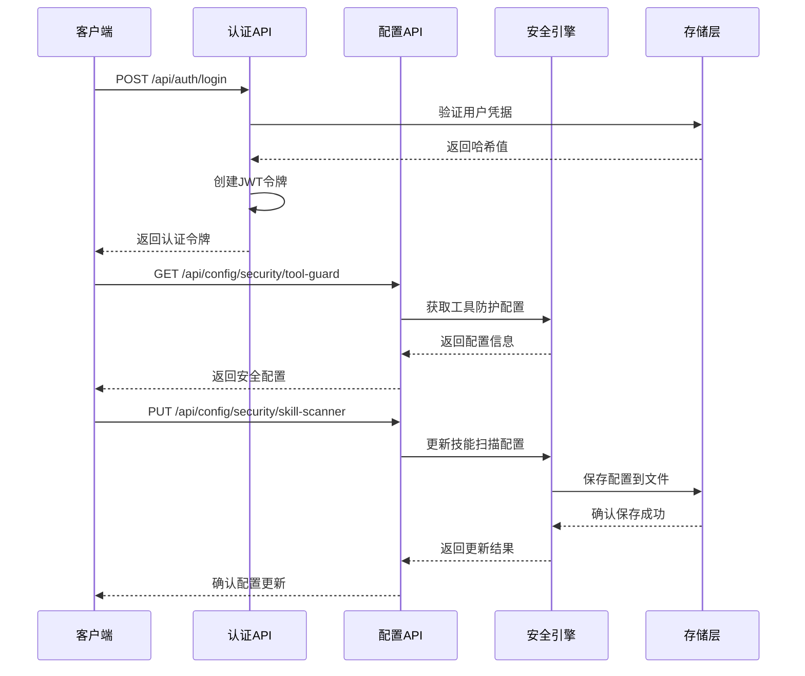
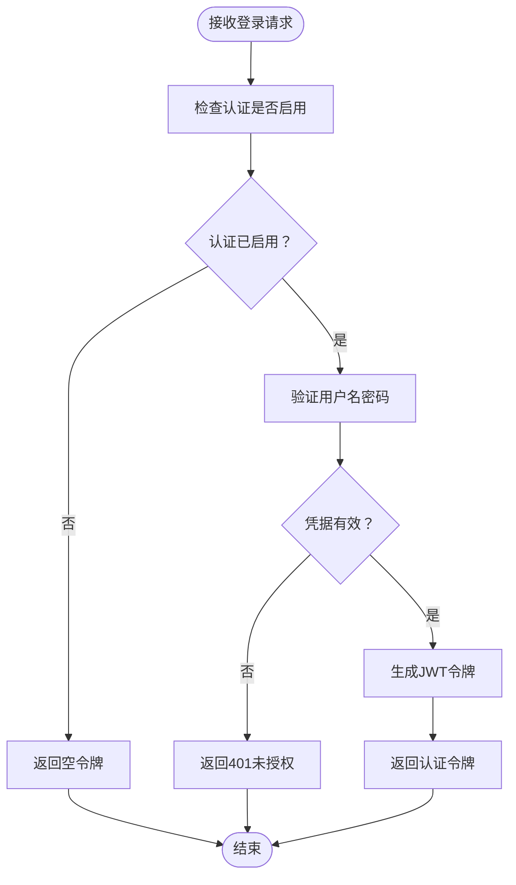
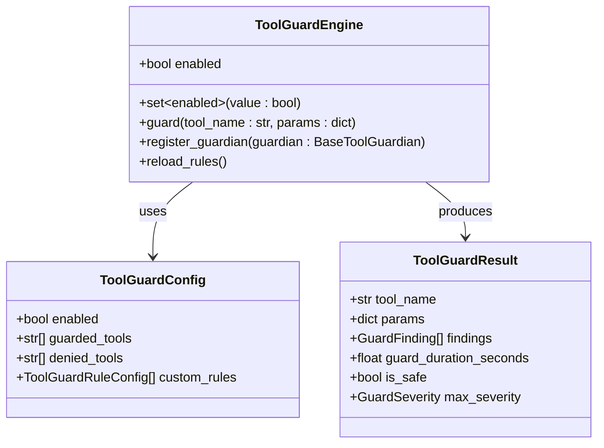
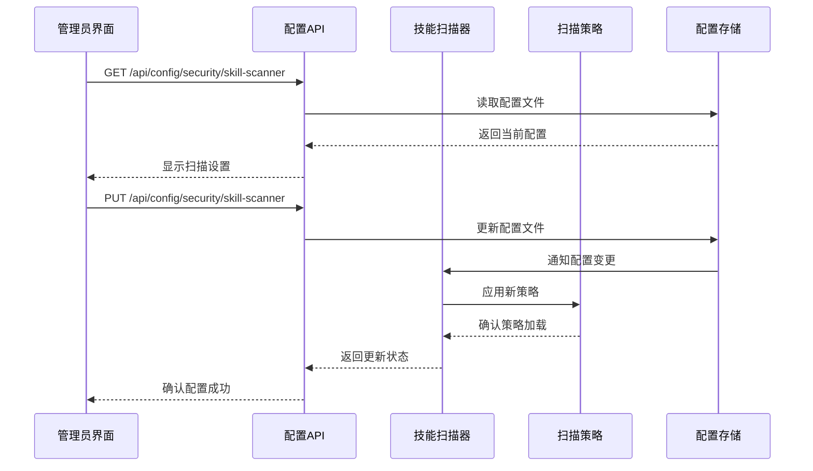
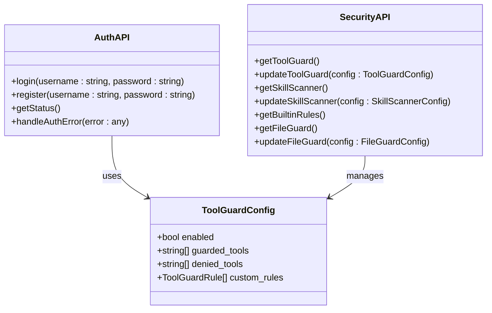
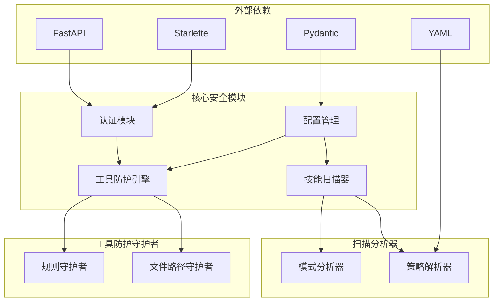

# 安全 API 端点

<cite>
**本文档引用的文件**
- [src/copaw/app/routers/auth.py](file://src/copaw/app/routers/auth.py)
- [src/copaw/app/auth.py](file://src/copaw/app/auth.py)
- [src/copaw/app/routers/config.py](file://src/copaw/app/routers/config.py)
- [console/src/api/modules/auth.ts](file://console/src/api/modules/auth.ts)
- [console/src/api/modules/security.ts](file://console/src/api/modules/security.ts)
- [src/copaw/security/__init__.py](file://src/copaw/security/__init__.py)
- [src/copaw/security/skill_scanner/scanner.py](file://src/copaw/security/skill_scanner/scanner.py)
- [src/copaw/security/skill_scanner/models.py](file://src/copaw/security/skill_scanner/models.py)
- [src/copaw/security/skill_scanner/scan_policy.py](file://src/copaw/security/skill_scanner/scan_policy.py)
- [src/copaw/security/skill_scanner/data/default_policy.yaml](file://src/copaw/security/skill_scanner/data/default_policy.yaml)
- [src/copaw/security/tool_guard/engine.py](file://src/copaw/security/tool_guard/engine.py)
- [src/copaw/security/tool_guard/models.py](file://src/copaw/security/tool_guard/models.py)
- [src/copaw/security/tool_guard/utils.py](file://src/copaw/security/tool_guard/utils.py)
- [src/copaw/security/tool_guard/rules/dangerous_shell_commands.yaml](file://src/copaw/security/tool_guard/rules/dangerous_shell_commands.yaml)
- [website/public/docs/security.zh.md](file://website/public/docs/security.zh.md)
- [website/public/docs/security.en.md](file://website/public/docs/security.en.md)
</cite>

## 目录
1. [简介](#简介)
2. [项目结构](#项目结构)
3. [核心组件](#核心组件)
4. [架构概览](#架构概览)
5. [详细组件分析](#详细组件分析)
6. [依赖关系分析](#依赖关系分析)
7. [性能考虑](#性能考虑)
8. [故障排除指南](#故障排除指南)
9. [结论](#结论)

## 简介

CoPaw 是一个基于 Python 和 TypeScript 的智能代理平台，提供了全面的安全机制来保护系统免受各种威胁。本文档详细介绍了安全 API 端点的设计和实现，包括身份验证、工具调用防护和技能扫描等核心安全功能。

该系统采用多层安全架构，确保从网络层到应用层的全方位保护。安全特性包括基于 JWT 的身份验证、工具调用参数检查、恶意代码检测以及配置管理等。

## 项目结构

CoPaw 的安全相关组件主要分布在以下目录中：

**图表来源**
- [src/copaw/security/__init__.py](file://src/copaw/security/__init__.py)
- [src/copaw/app/routers/auth.py](file://src/copaw/app/routers/auth.py)
- [src/copaw/app/routers/config.py](file://src/copaw/app/routers/config.py)

**章节来源**
- [src/copaw/security/__init__.py](file://src/copaw/security/__init__.py)
- [src/copaw/app/routers/auth.py](file://src/copaw/app/routers/auth.py)
- [src/copaw/app/routers/config.py](file://src/copaw/app/routers/config.py)

## 核心组件

### 身份验证系统

CoPaw 实现了完整的身份验证和授权机制，支持单用户模式和多种认证方式：

| 组件 | 功能描述 | 安全特性 |
|------|----------|----------|
| 登录端点 | 用户凭据验证 | HMAC-SHA256 签名令牌，7天有效期 |
| 注册端点 | 单用户账户创建 | 环境变量控制启用状态 |
| 状态检查 | 认证状态查询 | 支持禁用认证模式 |
| 令牌验证 | Bearer 令牌验证 | 自动过期检查和失效处理 |

### 工具调用防护引擎

工具调用防护系统提供实时的安全检查，防止危险操作被执行：

| 防护类型 | 检测规则 | 威胁级别 | 防护措施 |
|----------|----------|----------|----------|
| Shell 命令执行 | 文件删除、系统破坏命令 | CRITICAL/HIGH | 参数拦截和用户确认 |
| 文件访问 | 敏感文件路径访问 | HIGH | 路径白名单检查 |
| 网络滥用 | 反向连接、隧道建立 | CRITICAL | 网络连接限制 |
| 资源滥用 | 死循环、fork炸弹 | CRITICAL | 执行时间限制 |

### 技能扫描器

技能扫描器对技能包进行静态分析，检测潜在的安全威胁：

| 扫描类型 | 分析内容 | 保护范围 |
|----------|----------|----------|
| 模式匹配 | 正则表达式签名检测 | 恶意代码模式识别 |
| 文件分类 | 扩展名和内容类型分析 | 二进制文件安全检查 |
| 规则评估 | 组织策略和阈值检查 | 自定义安全策略执行 |

**章节来源**
- [src/copaw/app/routers/auth.py](file://src/copaw/app/routers/auth.py)
- [src/copaw/app/auth.py](file://src/copaw/app/auth.py)
- [src/copaw/security/tool_guard/engine.py](file://src/copaw/security/tool_guard/engine.py)
- [src/copaw/security/skill_scanner/scanner.py](file://src/copaw/security/skill_scanner/scanner.py)

## 架构概览

CoPaw 的安全架构采用分层设计，确保每个层面都有相应的保护机制：

**图表来源**
- [src/copaw/app/auth.py](file://src/copaw/app/auth.py)
- [src/copaw/app/routers/config.py](file://src/copaw/app/routers/config.py)
- [src/copaw/security/tool_guard/engine.py](file://src/copaw/security/tool_guard/engine.py)

### API 端点架构

**图表来源**
- [src/copaw/app/routers/auth.py](file://src/copaw/app/routers/auth.py)
- [src/copaw/app/routers/config.py](file://src/copaw/app/routers/config.py)
- [src/copaw/app/auth.py](file://src/copaw/app/auth.py)

## 详细组件分析

### 身份验证 API 端点

#### 登录端点 (/api/auth/login)

登录端点负责处理用户的认证请求，采用安全的密码验证流程：

**图表来源**
- [src/copaw/app/routers/auth.py](file://src/copaw/app/routers/auth.py)
- [src/copaw/app/auth.py](file://src/copaw/app/auth.py)

#### 注册端点 (/api/auth/register)

注册端点实现单用户账户的创建，具有严格的安全控制：

| 安全检查 | 描述 | 防护效果 |
|----------|------|----------|
| 环境变量验证 | 检查 COPAW_AUTH_ENABLED | 防止意外启用认证 |
| 用户存在性检查 | 确保只有一个用户 | 防止多用户攻击 |
| 输入验证 | 验证用户名和密码格式 | 防止注入攻击 |
| 密码哈希存储 | 使用盐值SHA-256哈希 | 防止密码泄露 |

**章节来源**
- [src/copaw/app/routers/auth.py](file://src/copaw/app/routers/auth.py)
- [src/copaw/app/auth.py](file://src/copaw/app/auth.py)

### 工具调用防护 API

#### 工具防护配置端点

工具调用防护系统通过多个 API 端点提供配置管理：

**图表来源**
- [src/copaw/security/tool_guard/engine.py](file://src/copaw/security/tool_guard/engine.py)
- [src/copaw/security/tool_guard/models.py](file://src/copaw/security/tool_guard/models.py)

#### 防护规则系统

工具防护系统包含预定义的危险命令检测规则：

| 规则类别 | 检测模式 | 威胁等级 | 示例模式 |
|----------|----------|----------|----------|
| 文件删除 | \\brm\\b, \\bmv\\b | HIGH | rm -rf /, mv /etc/passwd |
| 系统破坏 | mkfs\., dd \\.dev/ | CRITICAL | mkfs.ext4 /dev/sda, dd if=/dev/zero |
| 远程执行 | curl \| bash | CRITICAL | curl -sSL https://example.com/script.sh | bash |
| 权限修改 | chmod 777, chattr +i | HIGH | chmod 777 /etc/shadow |

**章节来源**
- [src/copaw/security/tool_guard/engine.py](file://src/copaw/security/tool_guard/engine.py)
- [src/copaw/security/tool_guard/models.py](file://src/copaw/security/tool_guard/models.py)
- [src/copaw/security/tool_guard/rules/dangerous_shell_commands.yaml](file://src/copaw/security/tool_guard/rules/dangerous_shell_commands.yaml)

### 技能扫描 API

#### 技能扫描配置端点

技能扫描系统提供完整的配置管理接口：

**图表来源**
- [src/copaw/app/routers/config.py](file://src/copaw/app/routers/config.py)
- [src/copaw/security/skill_scanner/scanner.py](file://src/copaw/security/skill_scanner/scanner.py)

#### 扫描策略系统

技能扫描器采用灵活的策略配置系统：

| 策略组件 | 配置项 | 默认值 | 用途 |
|----------|--------|--------|------|
| 隐藏文件策略 | benign_dotfiles | 多个开发工具配置文件 | 识别无害的隐藏文件 |
| 规则作用域 | code_only, skip_in_docs | 文档和脚本区分 | 控制规则适用范围 |
| 凭证策略 | known_test_values | 常见测试值列表 | 过滤测试数据 |
| 文件分类 | code_extensions, archive_extensions | 100+扩展名 | 文件类型识别 |
| 限制阈值 | max_file_count, max_file_size | 100文件, 5MB | 性能和安全保护 |

**章节来源**
- [src/copaw/app/routers/config.py](file://src/copaw/app/routers/config.py)
- [src/copaw/security/skill_scanner/scan_policy.py](file://src/copaw/security/skill_scanner/scan_policy.py)
- [src/copaw/security/skill_scanner/data/default_policy.yaml](file://src/copaw/security/skill_scanner/data/default_policy.yaml)

### 前端安全接口

#### 认证 API 接口

前端通过专门的模块与后端安全 API 交互：

**图表来源**
- [console/src/api/modules/auth.ts](file://console/src/api/modules/auth.ts)
- [console/src/api/modules/security.ts](file://console/src/api/modules/security.ts)

**章节来源**
- [console/src/api/modules/auth.ts](file://console/src/api/modules/auth.ts)
- [console/src/api/modules/security.ts](file://console/src/api/modules/security.ts)

## 依赖关系分析

CoPaw 的安全系统具有清晰的模块化架构，各组件之间的依赖关系如下：

**图表来源**
- [src/copaw/app/auth.py](file://src/copaw/app/auth.py)
- [src/copaw/security/tool_guard/engine.py](file://src/copaw/security/tool_guard/engine.py)
- [src/copaw/security/skill_scanner/scanner.py](file://src/copaw/security/skill_scanner/scanner.py)

### 安全配置依赖

| 组件 | 依赖项 | 用途 | 安全影响 |
|------|--------|------|----------|
| 认证中间件 | 环境变量, 配置文件 | 路由保护 | 防止未授权访问 |
| 工具防护引擎 | 规则文件, 配置管理 | 参数检查 | 防止恶意命令执行 |
| 技能扫描器 | 策略文件, 规则库 | 静态分析 | 防止恶意技能安装 |
| 配置管理 | JSON/YAML解析 | 设置持久化 | 防止配置篡改 |

**章节来源**
- [src/copaw/app/auth.py](file://src/copaw/app/auth.py)
- [src/copaw/security/tool_guard/engine.py](file://src/copaw/security/tool_guard/engine.py)
- [src/copaw/security/skill_scanner/scanner.py](file://src/copaw/security/skill_scanner/scanner.py)

## 性能考虑

CoPaw 的安全系统在保证安全性的同时，也充分考虑了性能优化：

### 认证性能优化

- **令牌缓存**: JWT 令牌验证采用内存缓存，减少重复计算
- **异步处理**: 认证检查使用异步中间件，避免阻塞请求
- **最小权限原则**: 仅对 `/api/` 路由进行认证，减少不必要的检查

### 工具防护性能

- **延迟初始化**: 工具防护引擎采用懒加载模式，按需初始化
- **规则缓存**: 预编译正则表达式，提高匹配效率
- **执行时间限制**: 为工具调用设置超时保护

### 技能扫描性能

- **文件大小限制**: 默认限制单文件大小为 5MB，防止内存溢出
- **文件数量限制**: 最大扫描 100 个文件，平衡性能和安全性
- **并行处理**: 支持多分析器并行运行

## 故障排除指南

### 常见认证问题

| 问题症状 | 可能原因 | 解决方案 |
|----------|----------|----------|
| 登录失败 | 凭据错误 | 检查用户名密码是否正确 |
| 无法注册 | 认证未启用 | 设置 COPAW_AUTH_ENABLED=true |
| 令牌过期 | 7天有效期 | 重新登录获取新令牌 |
| CORS 错误 | 预检请求未处理 | 确认 OPTIONS 请求被允许 |

### 工具防护问题

| 问题症状 | 可能原因 | 解决方案 |
|----------|----------|----------|
| 工具被错误阻止 | 规则过于严格 | 调整 guarded_tools 列表 |
| 性能下降 | 防护规则过多 | 优化规则配置 |
| 配置不生效 | 缓存未刷新 | 重启服务或手动重载规则 |

### 技能扫描问题

| 问题症状 | 可能原因 | 解决方案 |
|----------|----------|----------|
| 扫描超时 | 文件过多过大 | 调整 file_limits 配置 |
| 内存不足 | 扫描大量二进制文件 | 添加 archive_extensions 到跳过列表 |
| 结果不准确 | 规则配置不当 | 检查 scan_policy.yaml 配置 |

**章节来源**
- [src/copaw/app/auth.py](file://src/copaw/app/auth.py)
- [src/copaw/security/tool_guard/engine.py](file://src/copaw/security/tool_guard/engine.py)
- [src/copaw/security/skill_scanner/scanner.py](file://src/copaw/security/skill_scanner/scanner.py)

## 结论

CoPaw 的安全 API 端点设计体现了现代 Web 应用安全的最佳实践。通过多层次的安全架构、严格的访问控制和智能的威胁检测机制，系统能够有效保护用户免受各种安全威胁。

关键安全特性包括：
- **零信任架构**: 默认拒绝访问，仅在明确授权时允许
- **最小权限原则**: 仅暴露必要的 API 端点
- **实时监控**: 工具调用和技能安装的实时安全检查
- **灵活配置**: 支持组织特定的安全策略和规则

建议的安全最佳实践：
1. 定期审查和更新安全配置
2. 监控安全事件日志
3. 及时更新安全规则和策略
4. 实施定期的安全审计

通过这些措施，CoPaw 能够为用户提供一个既安全又易用的智能代理平台。