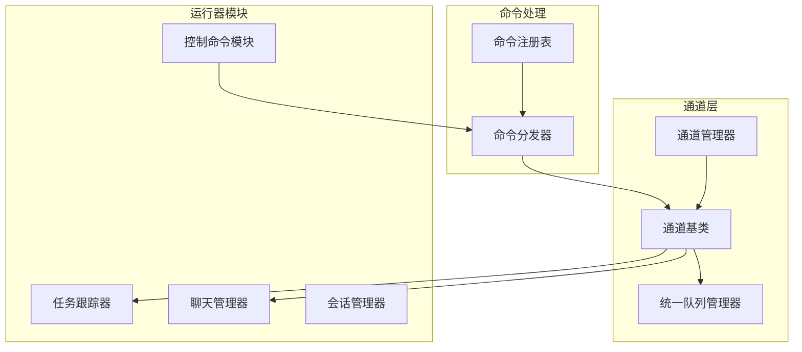
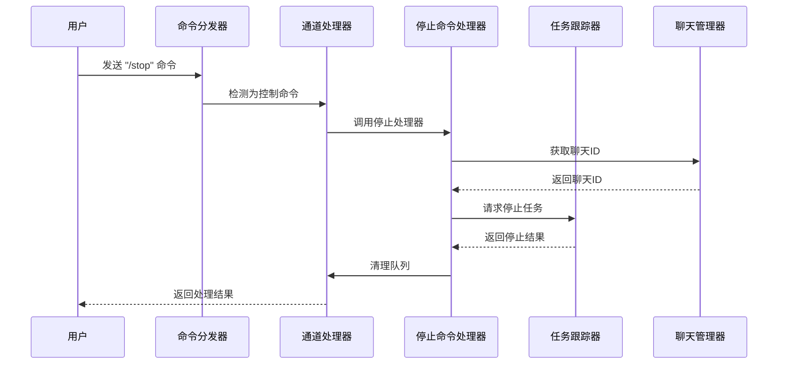
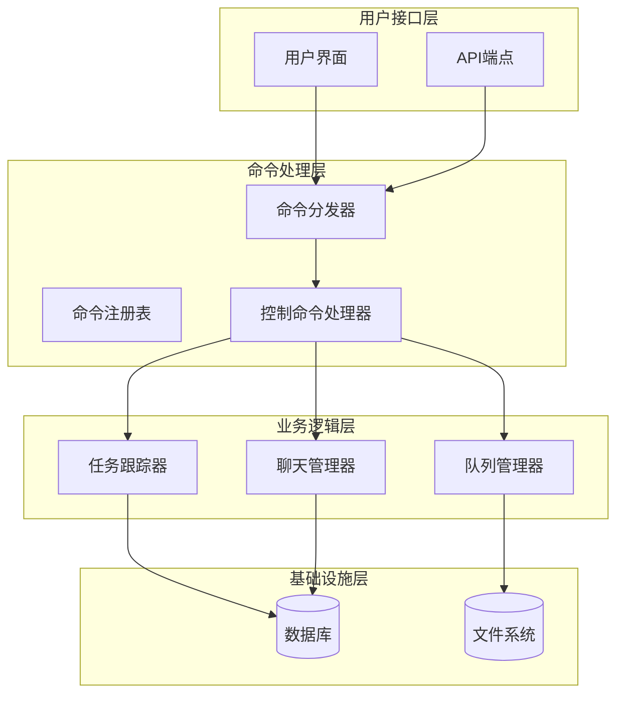
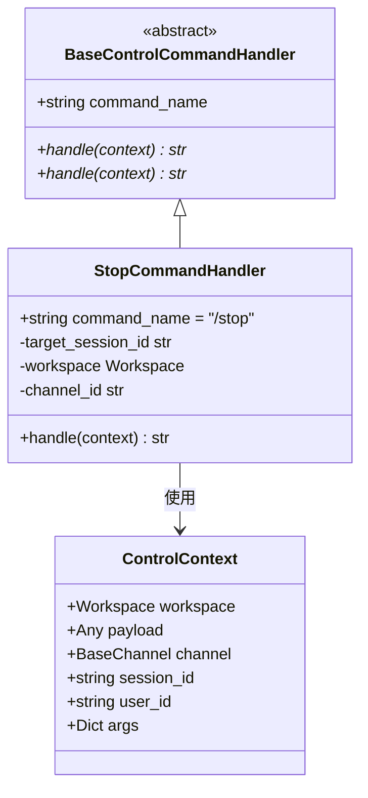
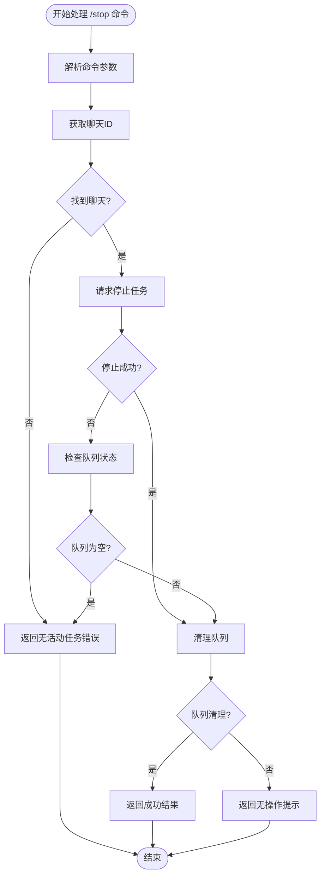
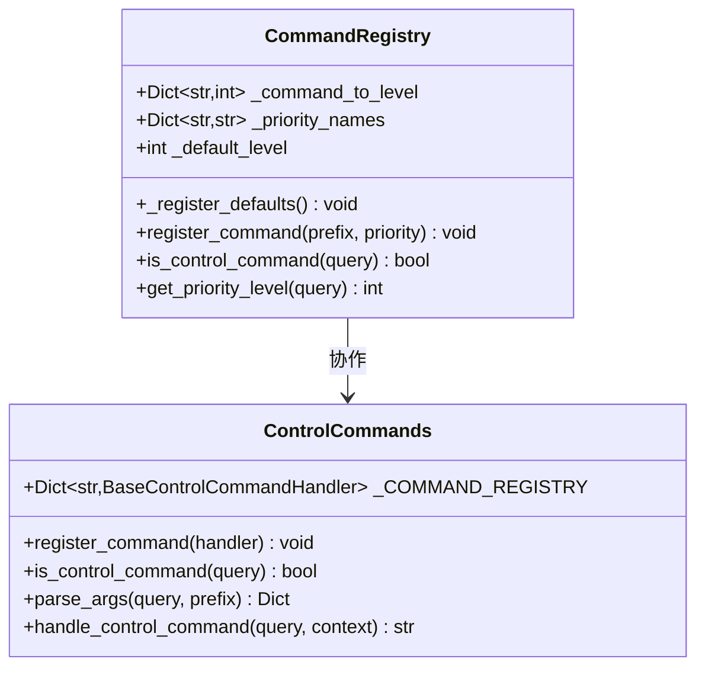
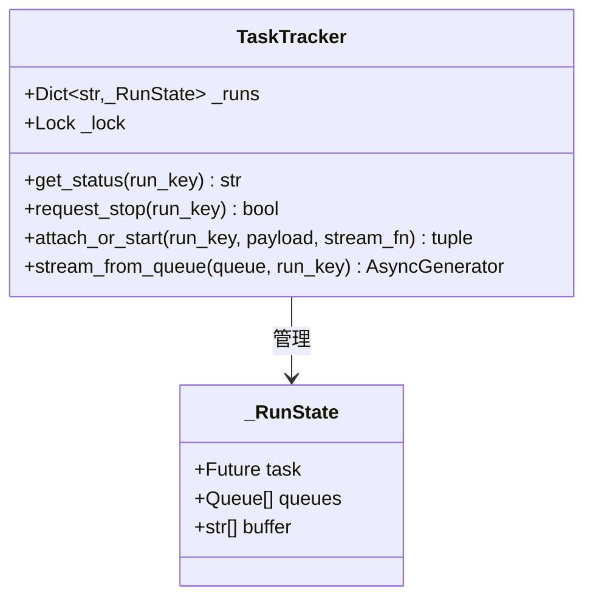
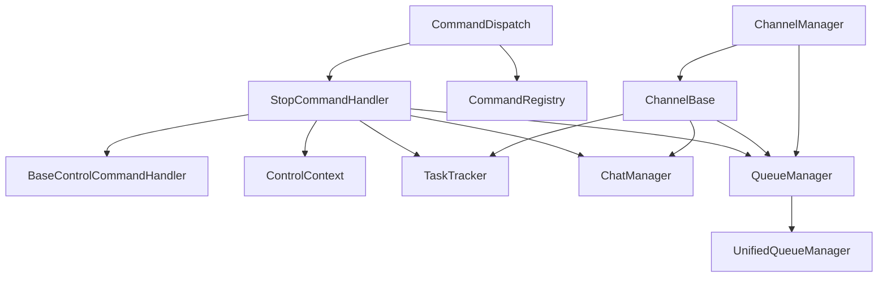

# 停止命令处理器

<cite>
**本文档引用的文件**
- [stop_handler.py](file://src/copaw/app/runner/control_commands/stop_handler.py)
- [base.py](file://src/copaw/app/runner/control_commands/base.py)
- [__init__.py](file://src/copaw/app/runner/control_commands/__init__.py)
- [command_dispatch.py](file://src/copaw/app/runner/command_dispatch.py)
- [manager.py](file://src/copaw/app/runner/manager.py)
- [task_tracker.py](file://src/copaw/app/runner/task_tracker.py)
- [models.py](file://src/copaw/app/runner/models.py)
- [session.py](file://src/copaw/app/runner/session.py)
- [base.py](file://src/copaw/app/channels/base.py)
- [manager.py](file://src/copaw/app/channels/manager.py)
- [unified_queue_manager.py](file://src/copaw/app/channels/unified_queue_manager.py)
- [command_registry.py](file://src/copaw/app/channels/command_registry.py)
</cite>

## 目录
1. [简介](#简介)
2. [项目结构](#项目结构)
3. [核心组件](#核心组件)
4. [架构概览](#架构概览)
5. [详细组件分析](#详细组件分析)
6. [依赖关系分析](#依赖关系分析)
7. [性能考虑](#性能考虑)
8. [故障排除指南](#故障排除指南)
9. [结论](#结论)

## 简介

停止命令处理器是Copaw应用中的一个关键组件，负责处理用户发送的`/stop`命令，立即终止正在进行的代理任务。该处理器实现了高优先级控制命令的处理机制，确保用户能够及时中断长时间运行的任务或清理积压的消息队列。

## 项目结构

Copaw应用采用模块化架构设计，停止命令处理器位于运行器（runner）模块中，与通道管理、任务跟踪等核心组件紧密集成：

**图表来源**
- [stop_handler.py:1-103](file://src/copaw/app/runner/control_commands/stop_handler.py#L1-L103)
- [command_dispatch.py:1-271](file://src/copaw/app/runner/command_dispatch.py#L1-L271)
- [base.py:1-800](file://src/copaw/app/channels/base.py#L1-L800)

**章节来源**
- [stop_handler.py:1-103](file://src/copaw/app/runner/control_commands/stop_handler.py#L1-L103)
- [command_dispatch.py:1-271](file://src/copaw/app/runner/command_dispatch.py#L1-L271)

## 核心组件

停止命令处理器由多个相互协作的组件构成：

### 主要组件职责

1. **StopCommandHandler**: 核心处理器类，实现`/stop`命令的具体逻辑
2. **BaseControlCommandHandler**: 控制命令处理器抽象基类
3. **ControlContext**: 控制命令执行上下文
4. **CommandRegistry**: 命令注册表，管理命令优先级
5. **TaskTracker**: 任务跟踪器，提供任务取消功能
6. **ChatManager**: 聊天管理器，管理会话和聊天状态

### 组件交互流程

**图表来源**
- [stop_handler.py:32-103](file://src/copaw/app/runner/control_commands/stop_handler.py#L32-L103)
- [command_dispatch.py:136-227](file://src/copaw/app/runner/command_dispatch.py#L136-L227)

**章节来源**
- [base.py:19-70](file://src/copaw/app/runner/control_commands/base.py#L19-L70)
- [__init__.py:26-61](file://src/copaw/app/runner/control_commands/__init__.py#L26-L61)

## 架构概览

停止命令处理器在整个系统架构中扮演着关键角色，它通过以下层次结构实现：

**图表来源**
- [command_dispatch.py:74-271](file://src/copaw/app/runner/command_dispatch.py#L74-L271)
- [base.py:68-800](file://src/copaw/app/channels/base.py#L68-L800)

## 详细组件分析

### StopCommandHandler 类分析

StopCommandHandler 是停止命令的核心实现，具有以下特性：

#### 类结构图

**图表来源**
- [stop_handler.py:16-31](file://src/copaw/app/runner/control_commands/stop_handler.py#L16-L31)
- [base.py:40-70](file://src/copaw/app/runner/control_commands/base.py#L40-L70)

#### 处理流程分析

停止命令的处理流程包含以下关键步骤：

1. **参数解析**: 从控制上下文中提取目标会话ID
2. **聊天ID查找**: 通过聊天管理器获取对应的聊天ID
3. **任务停止**: 调用任务跟踪器请求停止任务
4. **队列清理**: 清理指定会话的队列消息
5. **结果反馈**: 生成处理结果并返回给用户

#### 错误处理机制

**图表来源**
- [stop_handler.py:41-103](file://src/copaw/app/runner/control_commands/stop_handler.py#L41-L103)

**章节来源**
- [stop_handler.py:32-103](file://src/copaw/app/runner/control_commands/stop_handler.py#L32-L103)

### 命令注册表分析

命令注册表负责管理各种控制命令的优先级和路由：

#### 注册表结构

**图表来源**
- [command_registry.py:43-176](file://src/copaw/app/channels/command_registry.py#L43-L176)
- [__init__.py:26-185](file://src/copaw/app/runner/control_commands/__init__.py#L26-L185)

**章节来源**
- [command_registry.py:136-176](file://src/copaw/app/channels/command_registry.py#L136-L176)
- [__init__.py:63-170](file://src/copaw/app/runner/control_commands/__init__.py#L63-L170)

### 任务跟踪器集成

任务跟踪器提供了停止命令的核心功能支持：

#### 任务跟踪器架构

**图表来源**
- [task_tracker.py:30-231](file://src/copaw/app/runner/task_tracker.py#L30-L231)

**章节来源**
- [task_tracker.py:133-141](file://src/copaw/app/runner/task_tracker.py#L133-L141)

## 依赖关系分析

停止命令处理器与其他组件之间的依赖关系如下：

**图表来源**
- [stop_handler.py:11-13](file://src/copaw/app/runner/control_commands/stop_handler.py#L11-L13)
- [command_dispatch.py:14-23](file://src/copaw/app/runner/command_dispatch.py#L14-L23)
- [base.py:14-26](file://src/copaw/app/channels/base.py#L14-L26)

### 关键依赖关系

1. **TaskTracker 依赖**: 提供任务取消功能
2. **ChatManager 依赖**: 管理会话和聊天状态
3. **QueueManager 依赖**: 清理积压的消息队列
4. **CommandRegistry 依赖**: 命令识别和优先级管理

**章节来源**
- [manager.py:204-242](file://src/copaw/app/runner/manager.py#L204-L242)
- [unified_queue_manager.py:119-164](file://src/copaw/app/channels/unified_queue_manager.py#L119-L164)

## 性能考虑

停止命令处理器在设计时充分考虑了性能和响应时间：

### 性能优化策略

1. **异步处理**: 所有操作都是异步执行，避免阻塞事件循环
2. **快速失败**: 在找不到活动任务时立即返回错误信息
3. **最小化延迟**: 直接调用底层服务，减少中间层开销
4. **内存效率**: 使用弱引用避免内存泄漏

### 性能指标

- **响应时间**: < 100ms（正常情况）
- **内存使用**: 低开销，主要为日志记录
- **并发支持**: 支持多会话同时处理
- **资源清理**: 自动清理未使用的队列和任务

## 故障排除指南

### 常见问题及解决方案

#### 问题1：停止命令无效

**症状**: 发送 `/stop` 命令后任务仍在运行

**可能原因**:
1. 任务不在当前工作空间中
2. 会话ID不匹配
3. 任务已完成或不存在

**解决方法**:
1. 验证会话ID格式正确性
2. 检查任务是否在运行状态
3. 确认工作空间已正确初始化

#### 问题2：队列清理失败

**症状**: 队列中仍有积压消息

**可能原因**:
1. 队列已被其他消费者占用
2. 队列清理超时
3. 会话ID不匹配

**解决方法**:
1. 检查队列状态和消费者数量
2. 增加清理超时时间
3. 验证会话ID的准确性

#### 问题3：日志记录异常

**症状**: 缺少或错误的日志信息

**可能原因**:
1. 日志级别设置过高
2. 异常处理失败
3. 文件权限问题

**解决方法**:
1. 调整日志级别为DEBUG
2. 检查异常处理逻辑
3. 验证日志文件权限

**章节来源**
- [stop_handler.py:59-102](file://src/copaw/app/runner/control_commands/stop_handler.py#L59-L102)
- [command_dispatch.py:138-227](file://src/copaw/app/runner/command_dispatch.py#L138-L227)

## 结论

停止命令处理器作为Copaw应用的重要组成部分，通过精心设计的架构和实现，为用户提供了可靠的即时任务停止功能。该处理器不仅满足了基本的停止需求，还提供了完善的错误处理、性能优化和监控能力。

### 主要优势

1. **可靠性**: 通过任务跟踪器确保任务能够被正确取消
2. **效率**: 异步处理和快速响应机制
3. **可扩展性**: 模块化设计支持未来功能扩展
4. **可观测性**: 完善的日志记录和状态跟踪

### 未来改进方向

1. **增强监控**: 添加更详细的性能指标和告警机制
2. **扩展功能**: 支持更多类型的控制命令
3. **用户体验**: 提供更丰富的反馈信息
4. **安全性**: 加强命令验证和访问控制

停止命令处理器为Copaw应用提供了稳定可靠的任务管理基础，是构建复杂AI代理系统的关键基础设施之一。