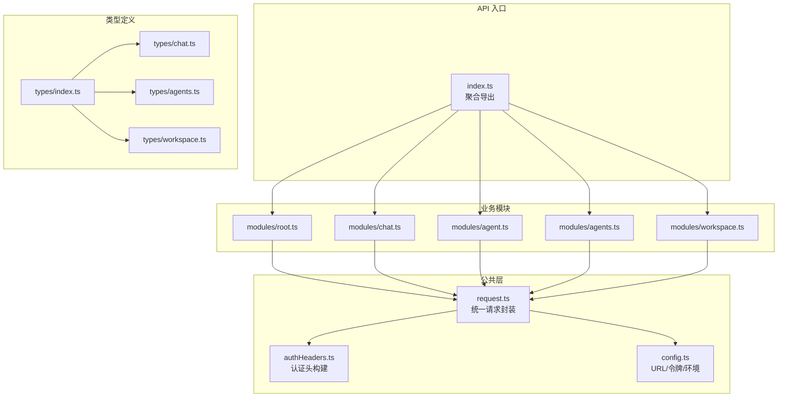
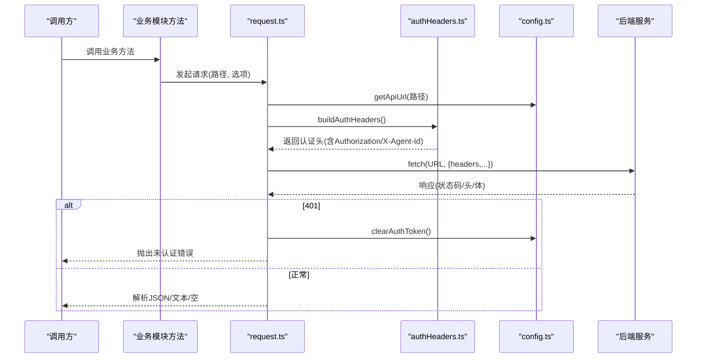
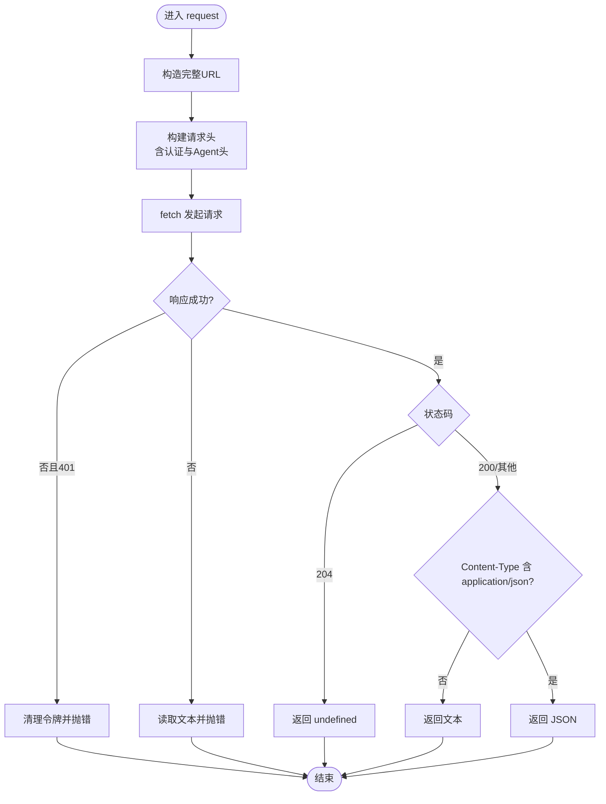
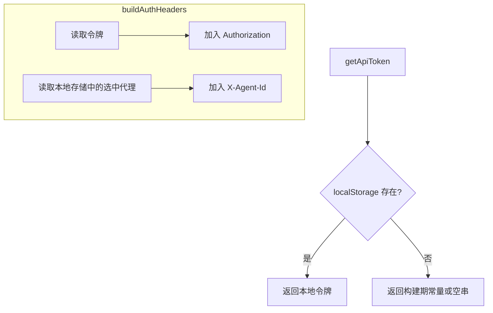
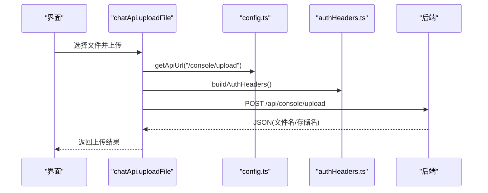
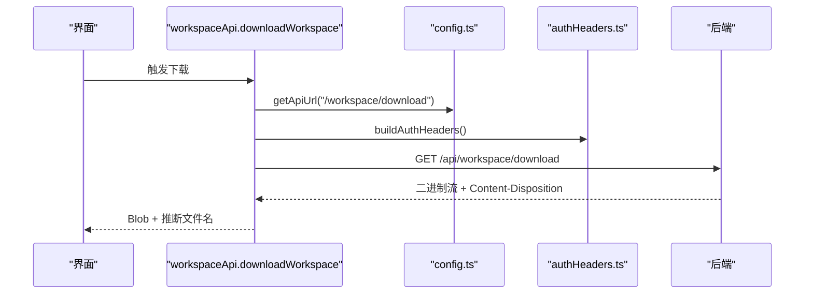
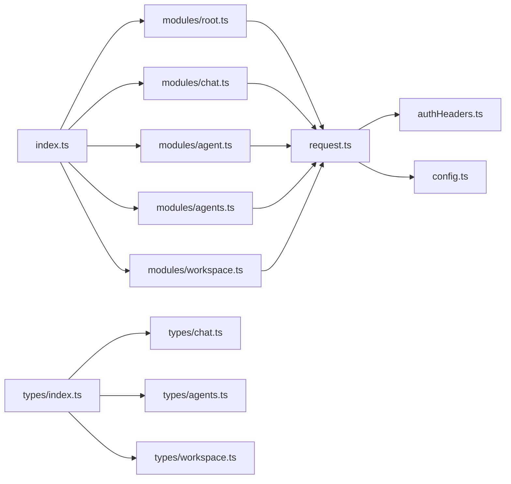

# API客户端与数据管理

<cite>
**本文引用的文件**
- [index.ts](file://console/src/api/index.ts)
- [request.ts](file://console/src/api/request.ts)
- [authHeaders.ts](file://console/src/api/authHeaders.ts)
- [config.ts](file://console/src/api/config.ts)
- [root.ts](file://console/src/api/modules/root.ts)
- [chat.ts](file://console/src/api/modules/chat.ts)
- [agent.ts](file://console/src/api/modules/agent.ts)
- [agents.ts](file://console/src/api/modules/agents.ts)
- [workspace.ts](file://console/src/api/modules/workspace.ts)
- [types/index.ts](file://console/src/api/types/index.ts)
- [chat.ts（类型）](file://console/src/api/types/chat.ts)
- [agents.ts（类型）](file://console/src/api/types/agents.ts)
- [workspace.ts（类型）](file://console/src/api/types/workspace.ts)
</cite>

## 目录
1. [简介](#简介)
2. [项目结构](#项目结构)
3. [核心组件](#核心组件)
4. [架构总览](#架构总览)
5. [组件详解](#组件详解)
6. [依赖关系分析](#依赖关系分析)
7. [性能与并发](#性能与并发)
8. [故障排查与调试](#故障排查与调试)
9. [结论](#结论)
10. [附录：API调用示例与最佳实践](#附录api调用示例与最佳实践)

## 简介
本文件面向前端开发者，系统性梳理 CoPaw 控制台的 API 客户端与数据管理方案。内容涵盖：
- 请求拦截与认证头注入机制
- 错误处理与 401 自动登出流程
- 数据类型定义与接口契约
- API 版本与路径前缀管理
- 请求配置、超时与并发控制策略
- 离线与缓存思路、数据同步建议
- 实战示例与调试技巧

## 项目结构
控制台 API 层采用“模块化聚合”的组织方式：
- 统一入口导出聚合后的 API 对象，便于按需使用
- 每个业务域（如聊天、代理、工作区等）独立模块，内部封装具体请求方法
- 公共层负责基础请求、认证头、URL 构造与令牌管理

图表来源
- [index.ts:1-85](file://console/src/api/index.ts#L1-L85)
- [request.ts:1-65](file://console/src/api/request.ts#L1-L65)
- [authHeaders.ts:1-24](file://console/src/api/authHeaders.ts#L1-L24)
- [config.ts:1-42](file://console/src/api/config.ts#L1-L42)
- [root.ts:1-8](file://console/src/api/modules/root.ts#L1-L8)
- [chat.ts:1-148](file://console/src/api/modules/chat.ts#L1-L148)
- [agent.ts:1-86](file://console/src/api/modules/agent.ts#L1-L86)
- [agents.ts:1-61](file://console/src/api/modules/agents.ts#L1-L61)
- [workspace.ts:1-149](file://console/src/api/modules/workspace.ts#L1-L149)
- [types/index.ts:1-13](file://console/src/api/types/index.ts#L1-L13)
- [chat.ts（类型）:1-32](file://console/src/api/types/chat.ts#L1-L32)
- [agents.ts（类型）:1-40](file://console/src/api/types/agents.ts#L1-L40)
- [workspace.ts（类型）:1-22](file://console/src/api/types/workspace.ts#L1-L22)

章节来源
- [index.ts:1-85](file://console/src/api/index.ts#L1-L85)
- [request.ts:1-65](file://console/src/api/request.ts#L1-L65)
- [config.ts:1-42](file://console/src/api/config.ts#L1-L42)

## 核心组件
- 统一请求函数：封装 fetch 调用、自动注入 Content-Type、认证头与 Agent 头、解析响应体、处理非 200/204 场景
- 认证头构建：从本地存储读取令牌，自动附加 Authorization；从本地存储读取选中代理标识并附加 X-Agent-Id
- 配置中心：统一构造 /api 前缀 URL；支持运行时环境变量与构建期常量回退
- 业务模块：按领域拆分，每个模块暴露一组方法，内部复用统一请求函数或直接使用 fetch

章节来源
- [request.ts:23-64](file://console/src/api/request.ts#L23-L64)
- [authHeaders.ts:4-23](file://console/src/api/authHeaders.ts#L4-L23)
- [config.ts:11-41](file://console/src/api/config.ts#L11-L41)

## 架构总览
下图展示从调用方到后端的整体链路，包括认证头注入、URL 构造与响应解析。

图表来源
- [request.ts:23-64](file://console/src/api/request.ts#L23-L64)
- [authHeaders.ts:4-23](file://console/src/api/authHeaders.ts#L4-L23)
- [config.ts:11-41](file://console/src/api/config.ts#L11-L41)

## 组件详解

### 统一请求与拦截器机制
- 内容类型：仅对带请求体的方法自动设置 JSON Content-Type，避免覆盖显式传入
- 认证头：统一注入 Authorization 与 X-Agent-Id
- 错误处理：非 200/204 抛出错误；401 清理令牌并跳转登录页
- 响应解析：204 返回 undefined；非 JSON 文本返回字符串；否则解析为 JSON

图表来源
- [request.ts:23-64](file://console/src/api/request.ts#L23-L64)

章节来源
- [request.ts:4-21](file://console/src/api/request.ts#L4-L21)
- [request.ts:36-64](file://console/src/api/request.ts#L36-L64)

### 认证头与令牌管理
- 令牌来源优先级：localStorage > 构建期常量
- 令牌持久化：登录后写入 localStorage
- 会话维度：从本地存储读取选中代理 ID 并注入 X-Agent-Id
- 401 自动登出：统一在请求层处理，避免各模块重复逻辑

图表来源
- [config.ts:23-41](file://console/src/api/config.ts#L23-L41)
- [authHeaders.ts:4-23](file://console/src/api/authHeaders.ts#L4-L23)

章节来源
- [config.ts:18-41](file://console/src/api/config.ts#L18-L41)
- [authHeaders.ts:1-24](file://console/src/api/authHeaders.ts#L1-L24)

### API 版本与路径前缀
- 固定前缀：所有业务路径均以 /api 前缀拼接
- 运行时可配置：通过环境变量覆盖基础地址
- 版本策略：当前未见显式的版本号参数或路径段，建议后续引入版本前缀（如 /api/v1）

章节来源
- [config.ts:11-16](file://console/src/api/config.ts#L11-L16)
- [root.ts:5-6](file://console/src/api/modules/root.ts#L5-L6)

### 业务模块概览与接口契约

#### 根与版本
- 提供根路径读取与版本查询
- 类型：返回对象或包含版本字段的对象

章节来源
- [root.ts:4-7](file://console/src/api/modules/root.ts#L4-L7)
- [types/index.ts:1-13](file://console/src/api/types/index.ts#L1-L13)

#### 聊天与会话
- 文件上传：multipart/form-data，返回存储路径与文件名
- 文件访问：根据选中代理 ID 生成带代理前缀的 URL
- 列表/增删改查：支持分页参数与批量删除
- 停止对话：触发后端停止推理

图表来源
- [chat.ts:36-53](file://console/src/api/modules/chat.ts#L36-L53)
- [config.ts:11-16](file://console/src/api/config.ts#L11-L16)
- [authHeaders.ts:4-23](file://console/src/api/authHeaders.ts#L4-L23)

章节来源
- [chat.ts:34-108](file://console/src/api/modules/chat.ts#L34-L108)
- [chat.ts（类型）:1-32](file://console/src/api/types/chat.ts#L1-L32)

#### 单代理管理
- 代理健康检查、进程处理、运行配置、语言与音频模式、转录提供商等
- 返回值多为简单对象或数组，便于前端直接消费

章节来源
- [agent.ts:5-86](file://console/src/api/modules/agent.ts#L5-L86)

#### 多代理管理
- 列表、详情、创建、更新、删除
- 工作区文件读写、代理记忆文件列表

章节来源
- [agents.ts:11-61](file://console/src/api/modules/agents.ts#L11-L61)
- [agents.ts（类型）:1-40](file://console/src/api/types/agents.ts#L1-L40)

#### 工作区与日记忆
- 文件列表、读取、保存
- 工作区打包下载与文件上传
- 日记忆文件列表、读取、保存
- 系统提示词文件列表维护

图表来源
- [workspace.ts:61-91](file://console/src/api/modules/workspace.ts#L61-L91)
- [config.ts:11-16](file://console/src/api/config.ts#L11-L16)
- [authHeaders.ts:4-23](file://console/src/api/authHeaders.ts#L4-L23)

章节来源
- [workspace.ts:39-149](file://console/src/api/modules/workspace.ts#L39-L149)
- [workspace.ts（类型）:1-22](file://console/src/api/types/workspace.ts#L1-L22)

## 依赖关系分析
- 模块聚合：index.ts 将各模块方法合并导出，形成统一 API 表面
- 请求复用：各业务模块依赖 request.ts，确保一致的错误与认证处理
- 认证耦合：request.ts 依赖 authHeaders.ts 与 config.ts，形成认证与 URL 的统一入口
- 类型共享：types/index.ts 汇总导出，业务模块按需引用

图表来源
- [index.ts:7-81](file://console/src/api/index.ts#L7-L81)
- [request.ts:1-3](file://console/src/api/request.ts#L1-L3)
- [authHeaders.ts:1](file://console/src/api/authHeaders.ts#L1)
- [config.ts:1-2](file://console/src/api/config.ts#L1-L2)
- [types/index.ts:1-13](file://console/src/api/types/index.ts#L1-L13)

章节来源
- [index.ts:7-81](file://console/src/api/index.ts#L7-L81)
- [request.ts:1-3](file://console/src/api/request.ts#L1-L3)

## 性能与并发
- 超时控制：当前实现未内置 fetch 超时，建议在 request 层增加 AbortController 支持
- 并发限制：未见全局并发队列或限速策略，建议在调用方或中间件层引入
- 缓存策略：未见 HTTP 缓存头或内存缓存，建议针对只读列表/详情引入轻量缓存
- 重试机制：未见自动重试，建议在 request 层按幂等方法与特定错误码实现指数退避重试

[本节为通用建议，不直接分析具体文件]

## 故障排查与调试
- 401 未认证：请求层检测到 401 会清除令牌并跳转登录页，检查令牌是否过期或被撤销
- 非 200/204：读取响应文本用于错误提示，结合后端日志定位问题
- Content-Type 不匹配：当响应非 JSON 时直接返回文本，确认接口是否返回期望格式
- 上传失败：检查 multipart/form-data 是否正确构造，以及后端对文件大小与类型的限制
- 下载异常：检查 Content-Disposition 头与文件名解析逻辑

章节来源
- [request.ts:36-52](file://console/src/api/request.ts#L36-L52)
- [chat.ts:44-51](file://console/src/api/modules/chat.ts#L44-L51)
- [workspace.ts:67-71](file://console/src/api/modules/workspace.ts#L67-L71)

## 结论
该 API 客户端以“统一请求 + 模块化业务”为核心设计，具备清晰的认证头注入与错误处理机制。建议后续完善超时、重试与缓存策略，并考虑引入版本前缀与更细粒度的并发控制，以提升稳定性与可维护性。

## 附录：API调用示例与最佳实践

- 获取版本
  - 方法：调用根模块的版本查询方法
  - 参考路径：[root.ts:6](file://console/src/api/modules/root.ts#L6)
  - 最佳实践：在应用启动时拉取版本信息，用于兼容性判断

- 上传文件并获取访问链接
  - 方法：调用聊天模块的上传方法
  - 参考路径：[chat.ts:36-53](file://console/src/api/modules/chat.ts#L36-L53)
  - 最佳实践：对大文件进行分片或进度提示；对文件类型进行白名单校验

- 生成带代理上下文的文件访问 URL
  - 方法：调用聊天模块的文件 URL 生成方法
  - 参考路径：[chat.ts:56-66](file://console/src/api/modules/chat.ts#L56-L66)
  - 最佳实践：在切换代理时刷新本地存储中的选中代理 ID

- 工作区打包下载
  - 方法：调用工作区模块的下载方法
  - 参考路径：[workspace.ts:61-91](file://console/src/api/modules/workspace.ts#L61-L91)
  - 最佳实践：在下载前检查磁盘空间与网络状况；解析 Content-Disposition 作为兜底

- 多代理文件读写
  - 方法：调用多代理模块的文件读写方法
  - 参考路径：[agents.ts:40-55](file://console/src/api/modules/agents.ts#L40-L55)
  - 最佳实践：对写入操作增加乐观更新与回滚策略

- 代理运行配置管理
  - 方法：调用单代理模块的运行配置读写方法
  - 参考路径：[agent.ts:28-35](file://console/src/api/modules/agent.ts#L28-L35)
  - 最佳实践：变更配置后触发后端热加载或重启提示

- 令牌与登录态管理
  - 方法：读取/设置/清除令牌
  - 参考路径：[config.ts:23-41](file://console/src/api/config.ts#L23-L41)
  - 最佳实践：在路由守卫中检查令牌有效性；401 时统一跳转登录页

- 类型安全与契约
  - 类型汇总：[types/index.ts:1-13](file://console/src/api/types/index.ts#L1-L13)
  - 聊天类型：[chat.ts（类型）:1-32](file://console/src/api/types/chat.ts#L1-L32)
  - 多代理类型：[agents.ts（类型）:1-40](file://console/src/api/types/agents.ts#L1-L40)
  - 工作区类型：[workspace.ts（类型）:1-22](file://console/src/api/types/workspace.ts#L1-L22)