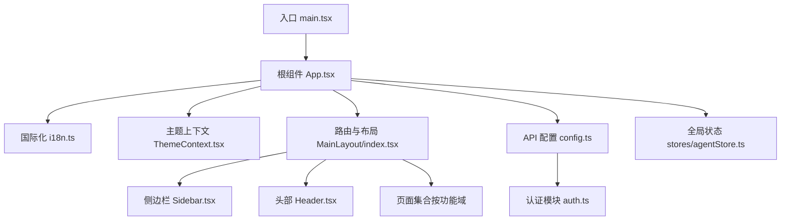
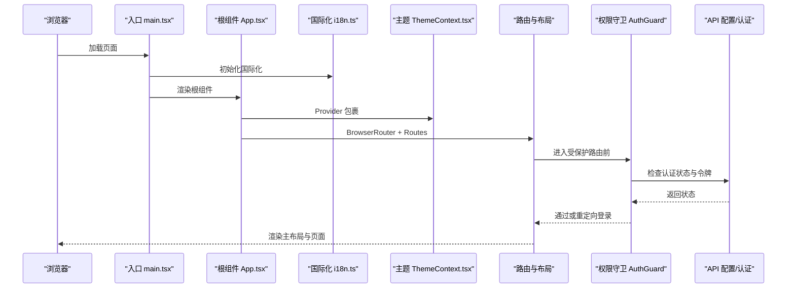
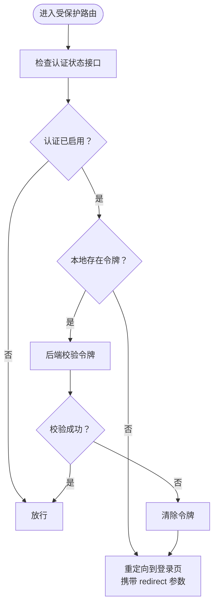
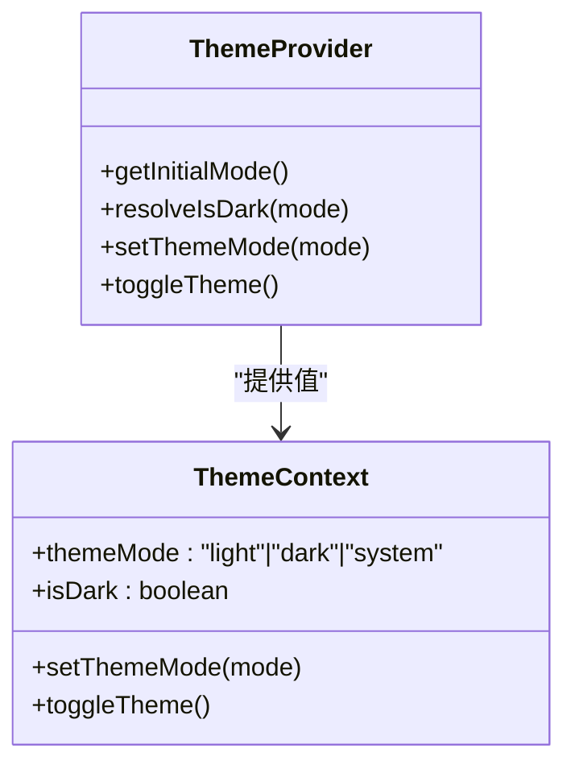
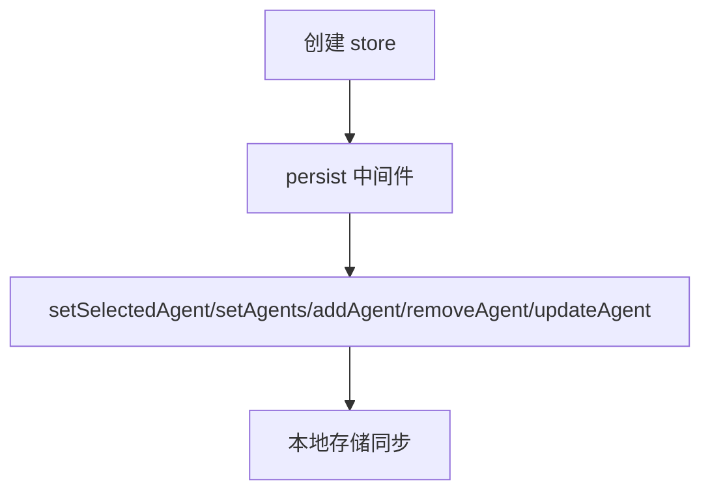
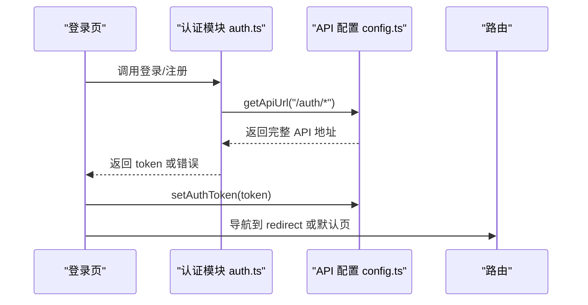
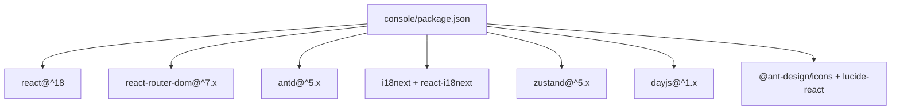

# React应用架构

<cite>
**本文引用的文件**
- [main.tsx](file://console/src/main.tsx)
- [App.tsx](file://console/src/App.tsx)
- [i18n.ts](file://console/src/i18n.ts)
- [ThemeContext.tsx](file://console/src/contexts/ThemeContext.tsx)
- [MainLayout/index.tsx](file://console/src/layouts/MainLayout/index.tsx)
- [Header.tsx](file://console/src/layouts/Header.tsx)
- [Sidebar.tsx](file://console/src/layouts/Sidebar.tsx)
- [LanguageSwitcher.tsx](file://console/src/components/LanguageSwitcher.tsx)
- [config.ts](file://console/src/api/config.ts)
- [auth.ts](file://console/src/api/modules/auth.ts)
- [agentStore.ts](file://console/src/stores/agentStore.ts)
- [package.json](file://console/package.json)
</cite>

## 目录
1. [引言](#引言)
2. [项目结构](#项目结构)
3. [核心组件](#核心组件)
4. [架构总览](#架构总览)
5. [详细组件分析](#详细组件分析)
6. [依赖关系分析](#依赖关系分析)
7. [性能考量](#性能考量)
8. [故障排查指南](#故障排查指南)
9. [结论](#结论)
10. [附录](#附录)

## 引言
本文件面向初学者与经验开发者，系统性阐述 CoPaw 控制台前端（React）应用的整体架构与实现细节。内容涵盖应用初始化流程、路由与权限控制、国际化与主题系统、全局状态管理、组件层次结构与数据流，并通过图示与路径指引帮助读者快速定位到具体实现。

## 项目结构
控制台前端位于 console/src 目录，采用“按功能域分层”的组织方式：
- 入口与根组件：main.tsx、App.tsx
- 国际化与主题：i18n.ts、ThemeContext.tsx
- 布局与页面：layouts、pages
- 组件库与通用组件：components
- API 模块与类型：api/modules、api/types
- 状态管理：stores
- 样式与常量：styles、constants

图表来源
- [main.tsx:1-31](file://console/src/main.tsx#L1-L31)
- [App.tsx:1-171](file://console/src/App.tsx#L1-L171)
- [i18n.ts:1-32](file://console/src/i18n.ts#L1-L32)
- [ThemeContext.tsx:1-105](file://console/src/contexts/ThemeContext.tsx#L1-L105)
- [MainLayout/index.tsx:1-86](file://console/src/layouts/MainLayout/index.tsx#L1-L86)
- [Sidebar.tsx:1-598](file://console/src/layouts/Sidebar.tsx#L1-L598)
- [Header.tsx:1-91](file://console/src/layouts/Header.tsx#L1-L91)
- [config.ts:1-42](file://console/src/api/config.ts#L1-L42)
- [auth.ts:1-75](file://console/src/api/modules/auth.ts#L1-L75)
- [agentStore.ts:1-47](file://console/src/stores/agentStore.ts#L1-L47)

章节来源
- [main.tsx:1-31](file://console/src/main.tsx#L1-L31)
- [App.tsx:1-171](file://console/src/App.tsx#L1-L171)
- [package.json:1-60](file://console/package.json#L1-L60)

## 核心组件
- 应用入口与初始化：在入口文件中挂载根组件并初始化国际化；对浏览器控制台输出进行轻量过滤以降低噪音。
- 根组件与路由：在根组件内完成国际化语言映射、Ant Design 本地化与主题算法切换，并基于 basename 支持子路径部署；内置登录页与受保护的主布局路由。
- 权限守卫：自定义 AuthGuard 在挂载时检查后端认证状态与本地令牌有效性，决定是否重定向至登录页。
- 主布局：MainLayout 负责侧边栏、头部与页面内容区域的组合，并声明所有子路由。
- 主题系统：ThemeContext 提供浅色/深色/系统三种模式，持久化存储用户选择，监听系统偏好变化并同步 DOM 类名。
- 国际化：i18n 初始化资源，读取本地语言设置，提供语言切换组件与页面标题等文案。
- 全局状态：使用 Zustand 管理“选中的智能体”等状态，并持久化到本地存储。
- API 层：统一的 API URL 构造、令牌获取/设置/清理，以及认证相关接口封装。

章节来源
- [main.tsx:1-31](file://console/src/main.tsx#L1-L31)
- [App.tsx:45-100](file://console/src/App.tsx#L45-L100)
- [App.tsx:106-160](file://console/src/App.tsx#L106-L160)
- [MainLayout/index.tsx:45-85](file://console/src/layouts/MainLayout/index.tsx#L45-L85)
- [ThemeContext.tsx:51-100](file://console/src/contexts/ThemeContext.tsx#L51-L100)
- [i18n.ts:1-32](file://console/src/i18n.ts#L1-L32)
- [agentStore.ts:15-46](file://console/src/stores/agentStore.ts#L15-L46)
- [config.ts:11-41](file://console/src/api/config.ts#L11-L41)
- [auth.ts:14-74](file://console/src/api/modules/auth.ts#L14-L74)

## 架构总览
下图展示了从入口到页面渲染、权限校验、主题与国际化联动的总体流程：

图表来源
- [main.tsx:1-31](file://console/src/main.tsx#L1-L31)
- [App.tsx:106-160](file://console/src/App.tsx#L106-L160)
- [App.tsx:45-100](file://console/src/App.tsx#L45-L100)
- [config.ts:11-41](file://console/src/api/config.ts#L11-L41)
- [auth.ts:44-48](file://console/src/api/modules/auth.ts#L44-L48)

## 详细组件分析

### 应用初始化与入口
- 入口文件负责：
  - 创建根节点并渲染根组件
  - 初始化国际化
  - 对控制台输出进行过滤，避免无意义警告干扰
- 根组件负责：
  - 计算 basename 以支持子路径部署
  - 将 Ant Design ConfigProvider 与自定义主题绑定
  - 绑定 dayjs 本地化与 Ant Design 本地化
  - 定义登录页与受保护路由

章节来源
- [main.tsx:1-31](file://console/src/main.tsx#L1-L31)
- [App.tsx:106-160](file://console/src/App.tsx#L106-L160)

### 权限控制与路由
- AuthGuard：
  - 首次加载时调用后端认证状态接口
  - 若启用认证且本地无令牌或验证失败，则重定向到登录页并携带 redirect 参数
  - 否则放行进入主布局
- 路由配置：
  - 登录页路由独立
  - 主布局路由下包含聊天、通道、会话、定时任务、心跳、技能、工具、MCP、工作区、智能体、模型、环境变量、安全、用量统计、语音转写等子路由
  - 默认首页重定向到聊天页

图表来源
- [App.tsx:45-100](file://console/src/App.tsx#L45-L100)
- [auth.ts:44-48](file://console/src/api/modules/auth.ts#L44-L48)
- [config.ts:23-41](file://console/src/api/config.ts#L23-L41)

章节来源
- [App.tsx:45-100](file://console/src/App.tsx#L45-L100)
- [MainLayout/index.tsx:58-79](file://console/src/layouts/MainLayout/index.tsx#L58-L79)

### 主题系统
- 用户可选模式：浅色、深色、系统
- 系统模式下监听系统配色偏好变化，自动切换
- 将 dark-mode 类名写入 <html>，用于全局样式覆盖
- 切换与持久化均通过上下文暴露的函数完成

图表来源
- [ThemeContext.tsx:15-100](file://console/src/contexts/ThemeContext.tsx#L15-L100)

章节来源
- [ThemeContext.tsx:51-100](file://console/src/contexts/ThemeContext.tsx#L51-L100)

### 国际化与语言切换
- 初始化资源：英文、俄文、中文、日文
- 语言回退策略与本地存储记忆
- 语言切换组件 LanguageSwitcher：下拉菜单切换语言并持久化
- 头部 Header 集成语言切换器与文档/FAQ/发布说明链接

章节来源
- [i18n.ts:1-32](file://console/src/i18n.ts#L1-32)
- [LanguageSwitcher.tsx:1-59](file://console/src/components/LanguageSwitcher.tsx#L1-L59)
- [Header.tsx:28-90](file://console/src/layouts/Header.tsx#L28-L90)

### 布局与导航
- MainLayout：
  - 组合侧边栏、头部与页面内容容器
  - 维护当前路径与选中菜单键值映射
  - 定义所有子路由
- Sidebar：
  - 菜单项分组与图标
  - 版本检测与更新提示
  - 账户信息修改与登出
- Header：
  - 集成智能体选择器、语言切换、主题切换、文档/FAQ/发布说明/仓库链接

章节来源
- [MainLayout/index.tsx:26-43](file://console/src/layouts/MainLayout/index.tsx#L26-L43)
- [MainLayout/index.tsx:58-79](file://console/src/layouts/MainLayout/index.tsx#L58-L79)
- [Sidebar.tsx:281-366](file://console/src/layouts/Sidebar.tsx#L281-L366)
- [Header.tsx:28-90](file://console/src/layouts/Header.tsx#L28-L90)

### 全局状态管理（Zustand）
- 使用 Zustand 管理“选中的智能体 ID”与“智能体列表”
- 通过 persist 中间件持久化到本地存储
- 提供增删改查方法，便于跨组件共享与复用

图表来源
- [agentStore.ts:15-46](file://console/src/stores/agentStore.ts#L15-L46)

章节来源
- [agentStore.ts:15-46](file://console/src/stores/agentStore.ts#L15-L46)

### API 设计与认证
- API URL 构造：支持构建带 /api 前缀的基础地址
- 令牌管理：优先从本地存储读取，其次使用构建期常量
- 认证模块：登录、注册、状态查询、更新资料
- 登录页：根据后端状态决定注册或登录流程，处理跳转与错误提示

图表来源
- [auth.ts:14-74](file://console/src/api/modules/auth.ts#L14-L74)
- [config.ts:11-41](file://console/src/api/config.ts#L11-L41)
- [LoginPage/index.tsx:35-70](file://console/src/pages/Login/index.tsx#L35-L70)

章节来源
- [config.ts:11-41](file://console/src/api/config.ts#L11-L41)
- [auth.ts:14-74](file://console/src/api/modules/auth.ts#L14-L74)
- [LoginPage/index.tsx:19-70](file://console/src/pages/Login/index.tsx#L19-L70)

## 依赖关系分析
- 运行时依赖概览（节选）：React、React Router、Ant Design、Ant Design Icons、i18next、dayjs、lucide-react、zustand 等
- 项目通过 Vite 构建，支持多模式构建与预览

图表来源
- [package.json:18-39](file://console/package.json#L18-L39)

章节来源
- [package.json:1-60](file://console/package.json#L1-L60)

## 性能考量
- 路由懒加载：建议对大型页面组件采用动态导入以减少首屏体积
- 图标与 Markdown：按需引入图标与插件，避免打包冗余
- 国际化资源：按需加载语言包，必要时拆分大体量翻译
- 主题切换：仅切换类名与主题算法，避免重复渲染
- 状态持久化：仅持久化必要字段，避免存储过大对象
- 请求缓存：对静态数据（如版本号）增加缓存策略

## 故障排查指南
- 登录后仍被重定向到登录页
  - 检查后端认证状态接口返回与本地令牌是否一致
  - 参考：[App.tsx:45-100](file://console/src/App.tsx#L45-L100)、[auth.ts:44-48](file://console/src/api/modules/auth.ts#L44-L48)
- 无法访问受保护路由
  - 确认 basename 与部署路径一致
  - 参考：[App.tsx:102-104](file://console/src/App.tsx#L102-L104)
- 主题未生效
  - 检查 <html> 是否包含 dark-mode 类名
  - 参考：[ThemeContext.tsx:58-65](file://console/src/contexts/ThemeContext.tsx#L58-L65)
- 语言切换无效
  - 确认 i18n.changeLanguage 与本地存储同步
  - 参考：[i18n.ts:22-29](file://console/src/i18n.ts#L22-L29)、[LanguageSwitcher.tsx:11-14](file://console/src/components/LanguageSwitcher.tsx#L11-L14)
- API 请求失败
  - 校验 getApiUrl 与 getApiToken 的返回值
  - 参考：[config.ts:11-41](file://console/src/api/config.ts#L11-L41)

章节来源
- [App.tsx:45-100](file://console/src/App.tsx#L45-L100)
- [ThemeContext.tsx:58-65](file://console/src/contexts/ThemeContext.tsx#L58-L65)
- [i18n.ts:22-29](file://console/src/i18n.ts#L22-L29)
- [LanguageSwitcher.tsx:11-14](file://console/src/components/LanguageSwitcher.tsx#L11-L14)
- [config.ts:11-41](file://console/src/api/config.ts#L11-L41)

## 结论
该 React 应用采用清晰的分层架构：入口与根组件负责初始化与全局配置，路由与权限守卫保障访问安全，主题与国际化提升用户体验，Zustand 提供轻量级状态管理，API 层抽象统一请求与令牌管理。整体设计兼顾易用性与扩展性，适合在多语言、多主题、多路由场景下持续演进。

## 附录
- 关键实现路径速查
  - 应用入口与初始化：[main.tsx:1-31](file://console/src/main.tsx#L1-L31)
  - 根组件与路由：[App.tsx:106-160](file://console/src/App.tsx#L106-L160)
  - 权限守卫逻辑：[App.tsx:45-100](file://console/src/App.tsx#L45-L100)
  - 主布局与路由表：[MainLayout/index.tsx:45-85](file://console/src/layouts/MainLayout/index.tsx#L45-L85)
  - 主题上下文：[ThemeContext.tsx:51-100](file://console/src/contexts/ThemeContext.tsx#L51-L100)
  - 国际化初始化：[i18n.ts:1-32](file://console/src/i18n.ts#L1-L32)
  - 语言切换组件：[LanguageSwitcher.tsx:1-59](file://console/src/components/LanguageSwitcher.tsx#L1-L59)
  - API URL 与令牌：[config.ts:11-41](file://console/src/api/config.ts#L11-L41)
  - 认证模块：[auth.ts:14-74](file://console/src/api/modules/auth.ts#L14-L74)
  - 全局状态（Zustand）：[agentStore.ts:15-46](file://console/src/stores/agentStore.ts#L15-L46)