# 前端控制台应用

<cite>
**本文档引用的文件**
- [package.json](file://console/package.json)
- [vite.config.ts](file://console/vite.config.ts)
- [main.tsx](file://console/src/main.tsx)
- [App.tsx](file://console/src/App.tsx)
- [i18n.ts](file://console/src/i18n.ts)
- [ThemeContext.tsx](file://console/src/contexts/ThemeContext.tsx)
- [ThemeToggleButton/index.tsx](file://console/src/components/ThemeToggleButton/index.tsx)
- [LanguageSwitcher/index.tsx](file://console/src/components/LanguageSwitcher/index.tsx)
- [LanguageSwitcher/index.module.less](file://console/src/components/LanguageSwitcher/index.module.less)
- [MainLayout/index.tsx](file://console/src/layouts/MainLayout/index.tsx)
- [Header.tsx](file://console/src/layouts/Header.tsx)
- [Sidebar.tsx](file://console/src/layouts/Sidebar.tsx)
- [index.module.less](file://console/src/layouts/index.module.less)
- [constants.ts](file://console/src/layouts/constants.ts)
- [Login/index.tsx](file://console/src/pages/Login/index.tsx)
- [Chat/index.tsx](file://console/src/pages/Chat/index.tsx)
- [Chat/sessionApi/index.ts](file://console/src/pages/Chat/sessionApi/index.ts)
- [Chat/utils.ts](file://console/src/pages/Chat/utils.ts)
- [Chat/OptionsPanel/defaultConfig.ts](file://console/src/pages/Chat/OptionsPanel/defaultConfig.ts)
- [Chat/components/ChatSessionDrawer/index.tsx](file://console/src/pages/Chat/components/ChatSessionDrawer/index.tsx)
- [Chat/components/ChatSessionItem/index.tsx](file://console/src/pages/Chat/components/ChatSessionItem/index.tsx)
- [Agent/Config/index.tsx](file://console/src/pages/Agent/Config/index.tsx)
- [Agent/Config/useAgentConfig.tsx](file://console/src/pages/Agent/Config/useAgentConfig.tsx)
- [Agent/Config/components/index.ts](file://console/src/pages/Agent/Config/components/index.ts)
- [Agent/Config/components/ReactAgentCard.tsx](file://console/src/pages/Agent/Config/components/ReactAgentCard.tsx)
- [Agent/Config/components/LlmRetryCard.tsx](file://console/src/pages/Agent/Config/components/LlmRetryCard.tsx)
- [Agent/Config/components/ContextManagementCard.tsx](file://console/src/pages/Agent/Config/components/ContextManagementCard.tsx)
- [Agent/Config/components/SliderWithValue.tsx](file://console/src/pages/Agent/Config/components/SliderWithValue.tsx)
- [Agent/Config/components/PageHeader.tsx](file://console/src/pages/Agent/Config/components/PageHeader.tsx)
- [Agent/Skills/index.tsx](file://console/src/pages/Agent/Skills/index.tsx)
- [Agent/Skills/useSkills.ts](file://console/src/pages/Agent/Skills/useSkills.ts)
- [Agent/Skills/components/SkillCard.tsx](file://console/src/pages/Agent/Skills/components/SkillCard.tsx)
- [Agent/Skills/components/SkillDrawer.tsx](file://console/src/pages/Agent/Skills/components/SkillDrawer.tsx)
- [Agent/SkillPool/index.tsx](file://console/src/pages/Agent/SkillPool/index.tsx)
- [Agent/SkillPool/index.module.less](file://console/src/pages/Agent/SkillPool/index.module.less)
- [Agent/SkillPool/components/BroadcastModal.tsx](file://console/src/pages/Agent/SkillPool/components/BroadcastModal.tsx)
- [Agent/SkillPool/components/ImportBuiltinModal.tsx](file://console/src/pages/Agent/SkillPool/components/ImportBuiltinModal.tsx)
- [Agent/Tools/index.tsx](file://console/src/pages/Agent/Tools/index.tsx)
- [Agent/Tools/useTools.ts](file://console/src/pages/Agent/Tools/useTools.ts)
- [Agent/Workspace/index.tsx](file://console/src/pages/Agent/Workspace/index.tsx)
- [Agent/Workspace/components/FileEditor.tsx](file://console/src/pages/Agent/Workspace/components/FileEditor.tsx)
- [Agent/Workspace/components/FileItem.tsx](file://console/src/pages/Agent/Workspace/components/FileItem.tsx)
- [Agent/Workspace/components/FileListPanel.tsx](file://console/src/pages/Agent/Workspace/components/FileListPanel.tsx)
- [Agent/Workspace/components/useAgentsData.ts](file://console/src/pages/Agent/Workspace/components/useAgentsData.ts)
- [Agent/Workspace/components/utils.ts](file://console/src/pages/Agent/Workspace/components/utils.ts)
- [Agent/MCP/index.tsx](file://console/src/pages/Agent/MCP/index.tsx)
- [Agent/MCP/useMCP.ts](file://console/src/pages/Agent/MCP/useMCP.ts)
- [Agent/MCP/components/MCPClientCard.tsx](file://console/src/pages/Agent/MCP/components/MCPClientCard.tsx)
- [Agent/MCP/components/MCPClientDrawer.tsx](file://console/src/pages/Agent/MCP/components/MCPClientDrawer.tsx)
- [Control/Channels/index.tsx](file://console/src/pages/Control/Channels/index.tsx)
- [Control/Channels/useChannels.ts](file://console/src/pages/Control/Channels/useChannels.ts)
- [Control/Channels/components/ChannelCard.tsx](file://console/src/pages/Control/Channels/components/ChannelCard.tsx)
- [Control/Channels/components/ChannelDrawer.tsx](file://console/src/pages/Control/Channels/components/ChannelDrawer.tsx)
- [Control/Sessions/index.tsx](file://console/src/pages/Control/Sessions/index.tsx)
- [Control/Sessions/useSessions.ts](file://console/src/pages/Control/Sessions/useSessions.ts)
- [Control/Sessions/components/FilterBar.tsx](file://console/src/pages/Control/Sessions/components/FilterBar.tsx)
- [Control/Sessions/components/SessionDrawer.tsx](file://console/src/pages/Control/Sessions/components/SessionDrawer.tsx)
- [Control/CronJobs/index.tsx](file://console/src/pages/Control/CronJobs/index.tsx)
- [Control/CronJobs/useCronJobs.ts](file://console/src/pages/Control/CronJobs/useCronJobs.ts)
- [Control/CronJobs/components/JobDrawer.tsx](file://console/src/pages/Control/CronJobs/components/JobDrawer.tsx)
- [Control/CronJobs/components/Columns.tsx](file://console/src/pages/Control/CronJobs/components/Columns.tsx)
- [Control/CronJobs/components/parseCron.ts](file://console/src/pages/Control/CronJobs/components/parseCron.ts)
- [Control/Heartbeat/index.tsx](file://console/src/pages/Control/Heartbeat/index.tsx)
- [Control/Heartbeat/parseEvery.ts](file://console/src/pages/Control/Heartbeat/parseEvery.ts)
- [Settings/Agents/index.tsx](file://console/src/pages/Settings/Agents/index.tsx)
- [Settings/Agents/useAgents.ts](file://console/src/pages/Settings/Agents/useAgents.ts)
- [Settings/Agents/components/AgentModal.tsx](file://console/src/pages/Settings/Agents/components/AgentModal.tsx)
- [Settings/Agents/components/AgentTable.tsx](file://console/src/pages/Settings/Agents/components/AgentTable.tsx)
- [Settings/Models/index.tsx](file://console/src/pages/Settings/Models/index.tsx)
- [Settings/Models/useProviders.ts](file://console/src/pages/Settings/Models/useProviders.ts)
- [Settings/Environments/index.tsx](file://console/src/pages/Settings/Environments/index.tsx)
- [Settings/Environments/useEnvVars.ts](file://console/src/pages/Settings/Environments/useEnvVars.ts)
- [Settings/Security/index.tsx](file://console/src/pages/Settings/Security/index.tsx)
- [Settings/Security/useSkillScanner.ts](file://console/src/pages/Settings/Security/useSkillScanner.ts)
- [Settings/Security/useToolGuard.ts](file://console/src/pages/Settings/Security/useToolGuard.ts)
- [Settings/TokenUsage/index.tsx](file://console/src/pages/Settings/TokenUsage/index.tsx)
- [Settings/VoiceTranscription/index.tsx](file://console/src/pages/Settings/VoiceTranscription/index.tsx)
- [api/index.ts](file://console/src/api/index.ts)
- [api/request.ts](file://console/src/api/request.ts)
- [api/config.ts](file://console/src/api/config.ts)
- [api/authHeaders.ts](file://console/src/api/authHeaders.ts)
- [api/modules/auth.ts](file://console/src/api/modules/auth.ts)
- [api/modules/agent.ts](file://console/src/api/modules/agent.ts)
- [api/modules/agents.ts](file://console/src/api/modules/agents.ts)
- [api/modules/chat.ts](file://console/src/api/modules/chat.ts)
- [api/modules/workspace.ts](file://console/src/api/modules/workspace.ts)
- [api/modules/skill.ts](file://console/src/api/modules/skill.ts)
- [api/modules/tools.ts](file://console/src/api/modules/tools.ts)
- [api/modules/provider.ts](file://console/src/api/modules/provider.ts)
- [api/modules/env.ts](file://console/src/api/modules/env.ts)
- [api/modules/channel.ts](file://console/src/api/modules/channel.ts)
- [api/modules/cronjob.ts](file://console/src/api/modules/cronjob.ts)
- [api/modules/heartbeat.ts](file://console/src/api/modules/heartbeat.ts)
- [api/modules/security.ts](file://console/src/api/modules/security.ts)
- [api/modules/tokenUsage.ts](file://console/src/api/modules/tokenUsage.ts)
- [api/modules/userTimezone.ts](file://console/src/api/modules/userTimezone.ts)
- [api/modules/mcp.ts](file://console/src/api/modules/mcp.ts)
- [api/modules/localModel.ts](file://console/src/api/modules/localModel.ts)
- [api/types/index.ts](file://console/src/api/types/index.ts)
- [api/types/skill.ts](file://console/src/api/types/skill.ts)
- [stores/agentStore.ts](file://console/src/stores/agentStore.ts)
- [styles/layout.css](file://console/src/styles/layout.css)
- [styles/form-override.css](file://console/src/styles/form-override.css)
- [utils/formatNumber.ts](file://console/src/utils/formatNumber.ts)
- [utils/markdown.ts](file://console/src/utils/markdown.ts)
- [locales/en.json](file://console/src/locales/en.json)
- [locales/zh.json](file://console/src/locales/zh.json)
- [locales/ja.json](file://console/src/locales/ja.json)
</cite>

## 更新摘要
**所做更改**
- 新增技能池页面功能模块，包括技能广播、内置技能导入、ZIP包批量导入等核心功能
- 完善聊天会话管理系统，增强会话抽屉组件与会话项组件的交互体验
- 升级语言切换组件，支持实时语言偏好保存与后端同步
- 扩展API模块，新增技能池相关接口与缓存机制
- 更新导航结构，将技能池页面集成到设置组菜单中

## 目录
1. [简介](#简介)
2. [项目结构](#项目结构)
3. [核心组件](#核心组件)
4. [架构总览](#架构总览)
5. [详细组件分析](#详细组件分析)
6. [依赖关系分析](#依赖关系分析)
7. [性能考量](#性能考量)
8. [故障排查指南](#故障排查指南)
9. [结论](#结论)
10. [附录](#附录)

## 简介
本文件面向CoPaw前端控制台应用，提供从整体架构到具体实现的系统化文档。内容覆盖应用入口、路由与权限控制、国际化与主题系统、响应式与样式体系、状态管理、API客户端封装、页面与组件设计、以及与后端API的数据流与交互方式。文档同时兼顾初学者的入门指导与资深开发者的深度技术细节。

**更新** 本次更新重点介绍了新增的技能池页面、聊天会话管理增强功能以及语言切换组件的改进。

## 项目结构
控制台采用Vite + React 18 + TypeScript构建，Ant Design与自研设计系统组合提供UI基础，Zustand用于轻量状态管理，i18n实现多语言支持，Less作为CSS预处理语言。项目按功能域分层组织：入口与根组件、国际化、主题上下文、布局与页面、API模块与类型、通用组件、样式与工具函数等。

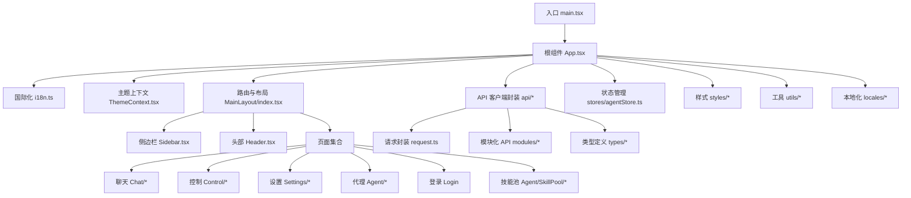

**图表来源**
- [main.tsx:1-31](file://console/src/main.tsx#L1-L31)
- [App.tsx:1-171](file://console/src/App.tsx#L1-L171)
- [MainLayout/index.tsx:1-86](file://console/src/layouts/MainLayout/index.tsx#L1-L86)
- [api/index.ts:1-85](file://console/src/api/index.ts#L1-L85)
- [stores/agentStore.ts:1-47](file://console/src/stores/agentStore.ts#L1-L47)

**章节来源**
- [package.json:1-60](file://console/package.json#L1-L60)
- [vite.config.ts:1-49](file://console/vite.config.ts#L1-L49)
- [main.tsx:1-31](file://console/src/main.tsx#L1-L31)
- [App.tsx:1-171](file://console/src/App.tsx#L1-L171)

## 核心组件
- 应用入口与初始化：在入口中引入国际化与根组件，并对控制台输出进行过滤以降低无关告警噪声。
- 根组件与全局配置：集中配置国际化语言映射、Ant Design语言包切换、dayjs本地化、主题算法切换、路由基座路径识别与重定向逻辑。
- 权限守卫：在首次渲染时检测认证状态，必要时重定向至登录页；对受保护路由进行统一鉴权。
- 主题系统：提供"浅色/深色/跟随系统"三种模式，持久化用户偏好，监听系统主题变化，通过HTML类名驱动全局样式变量。
- 国际化：支持英语、俄语、中文、日语四种语言资源，基于i18next与react-i18next，动态切换语言并持久化选择。
- 路由与布局：主布局包含侧边栏与内容区，内置路由表与默认跳转规则，承载各功能页面。
- API客户端：统一封装请求头、错误处理、JSON解析与401自动登出，模块化导出各业务API。
- 状态管理：使用Zustand轻量状态库，持久化存储代理选择与列表，简化跨组件共享。

**章节来源**
- [main.tsx:1-31](file://console/src/main.tsx#L1-L31)
- [App.tsx:45-100](file://console/src/App.tsx#L45-L100)
- [App.tsx:106-160](file://console/src/App.tsx#L106-L160)
- [ThemeContext.tsx:51-100](file://console/src/contexts/ThemeContext.tsx#L51-L100)
- [i18n.ts:1-32](file://console/src/i18n.ts#L1-L32)
- [MainLayout/index.tsx:26-43](file://console/src/layouts/MainLayout/index.tsx#L26-L43)
- [api/request.ts:23-64](file://console/src/api/request.ts#L23-L64)
- [api/index.ts:26-79](file://console/src/api/index.ts#L26-L79)
- [stores/agentStore.ts:15-46](file://console/src/stores/agentStore.ts#L15-L46)

## 架构总览
下图展示从前端入口到页面、布局、主题与国际化、API客户端的整体交互流程。

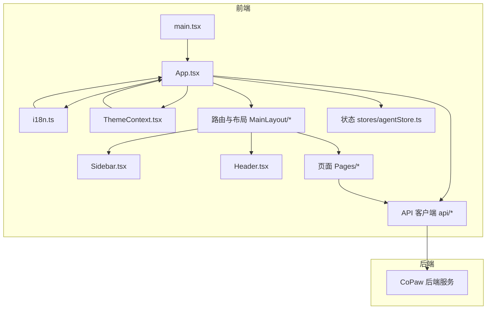

**图表来源**
- [main.tsx:1-31](file://console/src/main.tsx#L1-L31)
- [App.tsx:1-171](file://console/src/App.tsx#L1-L171)
- [MainLayout/index.tsx:1-86](file://console/src/layouts/MainLayout/index.tsx#L1-L86)
- [api/index.ts:1-85](file://console/src/api/index.ts#L1-L85)
- [stores/agentStore.ts:1-47](file://console/src/stores/agentStore.ts#L1-L47)

## 详细组件分析

### 权限控制与登录流程
- 登录页负责检测认证开关与是否已有用户，决定注册或登录模式；提交成功后写入令牌并跳转至重定向地址。
- 根组件的AuthGuard在应用启动时检查认证状态，若未启用或令牌无效则重定向至登录页。
- API层对401进行统一拦截，清空令牌并强制跳转登录。

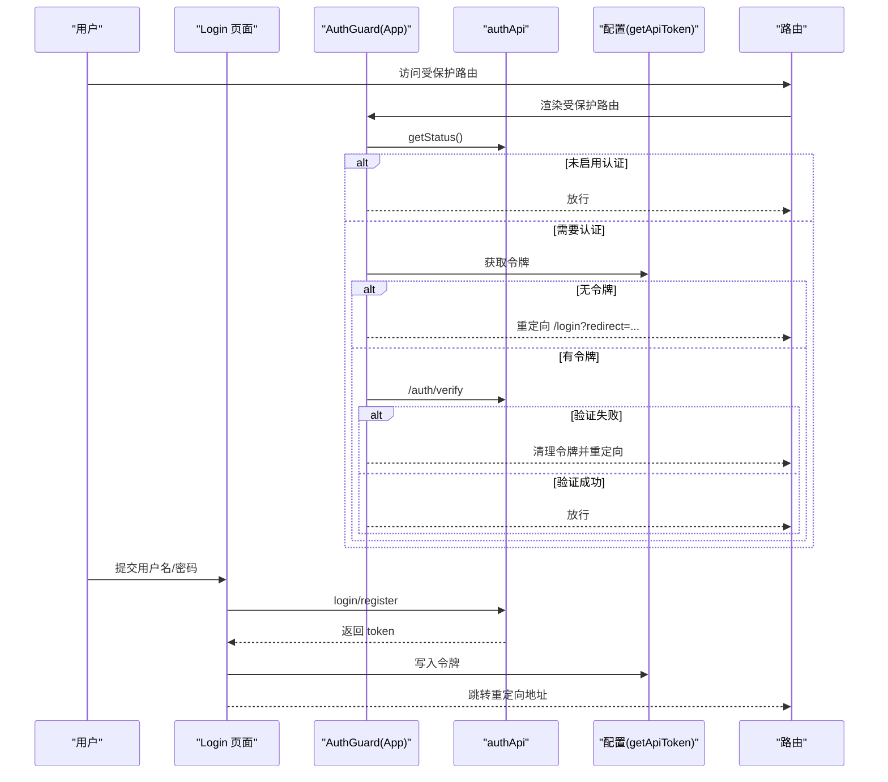

**图表来源**
- [App.tsx:45-100](file://console/src/App.tsx#L45-L100)
- [Login/index.tsx:19-70](file://console/src/pages/Login/index.tsx#L19-L70)
- [api/modules/auth.ts:14-48](file://console/src/api/modules/auth.ts#L14-L48)
- [api/request.ts:36-44](file://console/src/api/request.ts#L36-L44)

**章节来源**
- [App.tsx:45-100](file://console/src/App.tsx#L45-L100)
- [Login/index.tsx:19-70](file://console/src/pages/Login/index.tsx#L19-L70)
- [api/modules/auth.ts:14-48](file://console/src/api/modules/auth.ts#L14-L48)
- [api/request.ts:36-44](file://console/src/api/request.ts#L36-L44)

### 国际化与语言切换
- 初始化：加载多语言资源，读取本地存储的语言偏好，设置回退语言。
- 运行期：监听语言变更事件，动态更新Ant Design语言包与dayjs本地化。
- 语言切换器：提供下拉菜单切换语言并持久化。**更新** 新版本语言切换器支持实时保存语言偏好到后端。

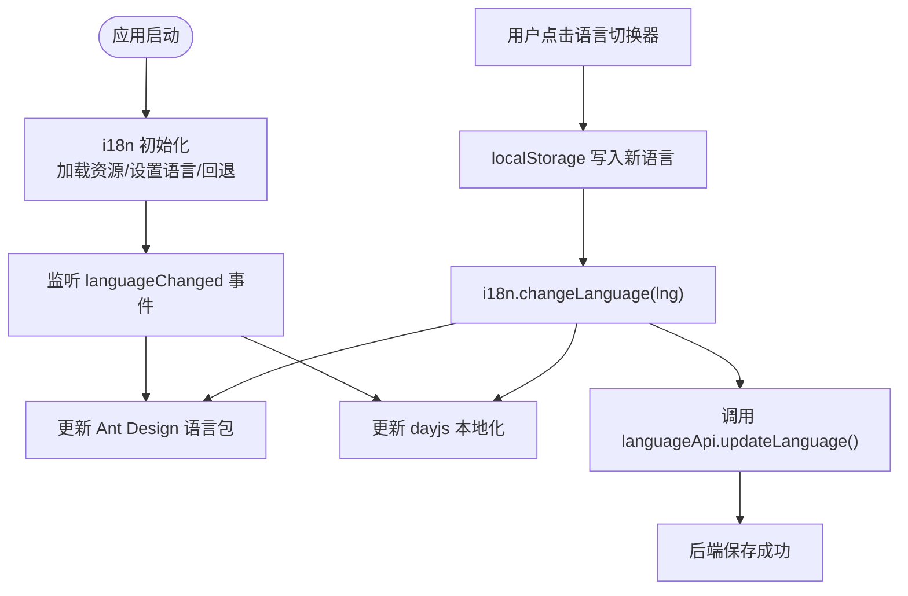

**图表来源**
- [i18n.ts:22-29](file://console/src/i18n.ts#L22-L29)
- [App.tsx:115-129](file://console/src/App.tsx#L115-L129)
- [LanguageSwitcher/index.tsx:14-22](file://console/src/components/LanguageSwitcher/index.tsx#L14-L22)

**章节来源**
- [i18n.ts:1-32](file://console/src/i18n.ts#L1-L32)
- [App.tsx:115-129](file://console/src/App.tsx#L115-L129)
- [LanguageSwitcher/index.tsx:6-58](file://console/src/components/LanguageSwitcher/index.tsx#L6-L58)

### 主题系统与切换
- 模式：支持 light/dark/system，system会根据系统配色自动切换。
- 存储：用户偏好持久化于localStorage，初始值从本地恢复。
- 应用：通过HTML元素添加/移除dark-mode类，驱动全局CSS变量；同时在ConfigProvider中切换Ant Design主题算法。
- 切换按钮：根据当前主题显示太阳/月亮图标与提示文案。

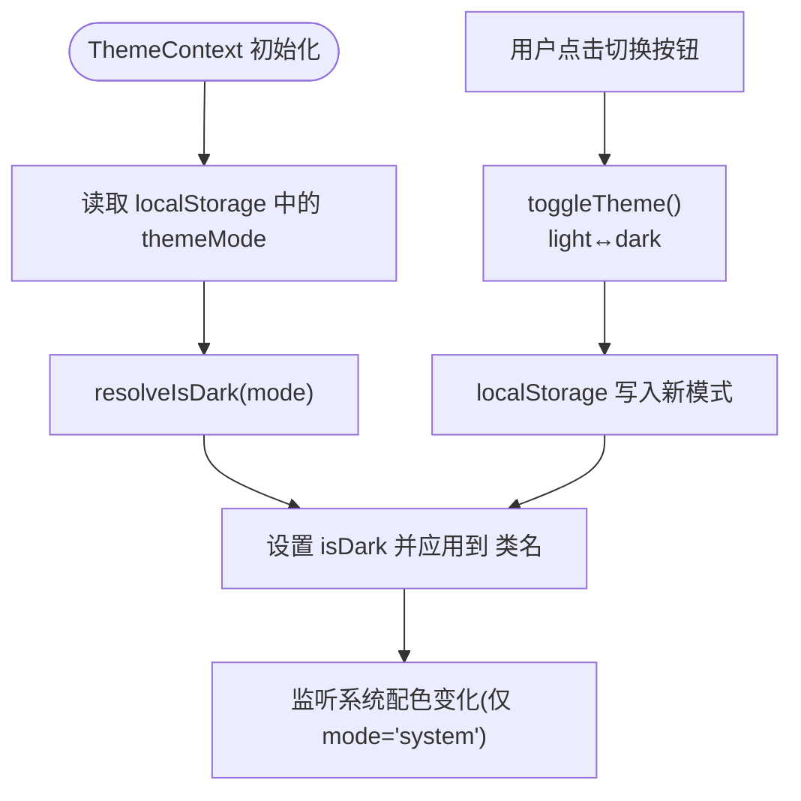

**图表来源**
- [ThemeContext.tsx:51-100](file://console/src/contexts/ThemeContext.tsx#L51-L100)
- [ThemeToggleButton/index.tsx:11-28](file://console/src/components/ThemeToggleButton/index.tsx#L11-L28)
- [App.tsx:134-144](file://console/src/App.tsx#L134-L144)

**章节来源**
- [ThemeContext.tsx:1-105](file://console/src/contexts/ThemeContext.tsx#L1-L105)
- [ThemeToggleButton/index.tsx:1-29](file://console/src/components/ThemeToggleButton/index.tsx#L1-L29)
- [App.tsx:134-144](file://console/src/App.tsx#L134-L144)

### 路由与导航结构
- 基座路径：根据当前路径判断是否带有"/console"前缀，设置BrowserRouter的basename。
- 默认路由：根路径重定向到"/chat"。
- 侧边栏与头部：根据当前路径高亮对应菜单项，配合路由表实现导航。
- 页面覆盖：主布局内嵌入"ConsoleCronBubble"等装饰性组件，保证页面内容容器稳定。
- **更新** 新增技能池页面路由，位于设置组菜单中，路径为"/skill-pool"。

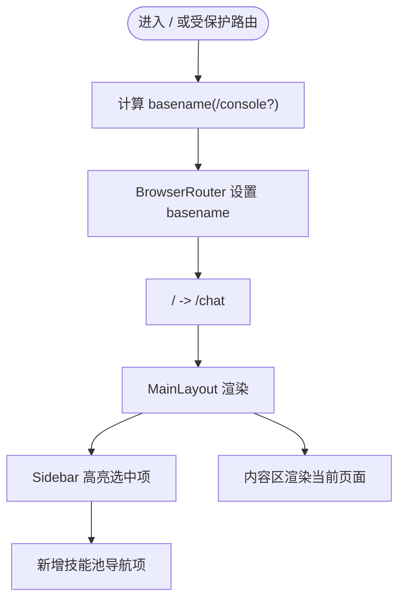

**图表来源**
- [App.tsx:102-104](file://console/src/App.tsx#L102-L104)
- [MainLayout/index.tsx:45-84](file://console/src/layouts/MainLayout/index.tsx#L45-L84)
- [Sidebar.tsx:176-180](file://console/src/layouts/Sidebar.tsx#L176-L180)

**章节来源**
- [App.tsx:102-104](file://console/src/App.tsx#L102-L104)
- [MainLayout/index.tsx:26-43](file://console/src/layouts/MainLayout/index.tsx#L26-L43)
- [MainLayout/index.tsx:55-79](file://console/src/layouts/MainLayout/index.tsx#L55-L79)
- [Sidebar.tsx:176-180](file://console/src/layouts/Sidebar.tsx#L176-L180)

### API客户端封装与数据流
- 统一请求：request函数负责拼接URL、构建请求头（含鉴权）、处理非2xx响应、区分204/文本/JSON返回。
- 模块化API：api/index.ts聚合各模块API，便于按需导入或统一访问。
- 认证头：authHeaders模块生成Authorization头，随请求自动附加。
- 数据流：页面组件调用api模块方法，经request封装后与后端交互，返回数据供页面渲染或状态更新。
- **更新** 新增技能池相关API接口，包括技能池列表、内置技能导入、ZIP包上传等功能。

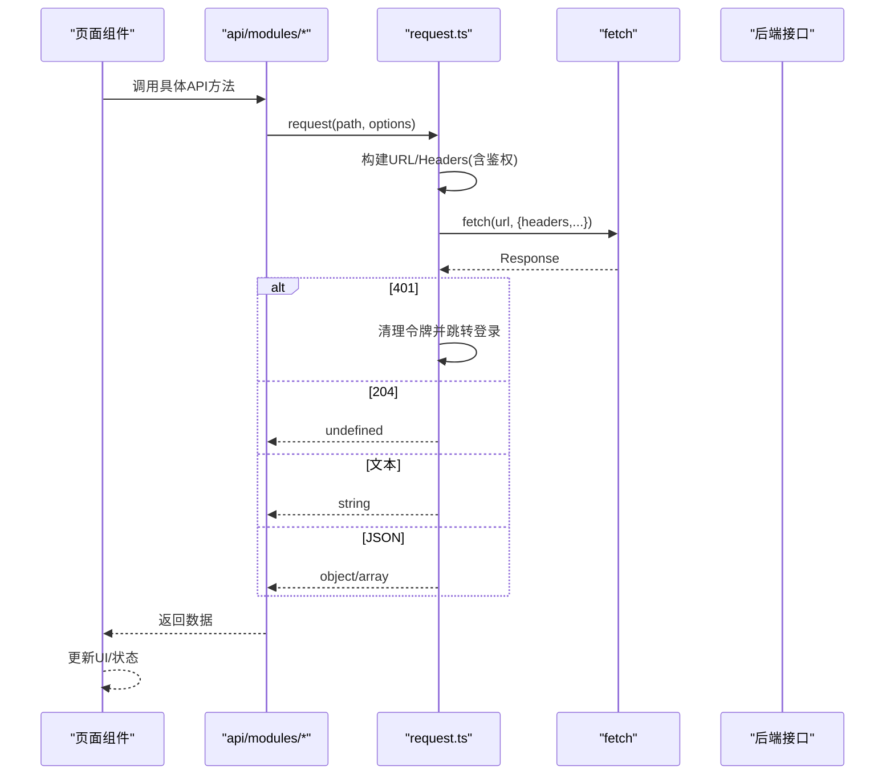

**图表来源**
- [api/request.ts:23-64](file://console/src/api/request.ts#L23-L64)
- [api/index.ts:26-79](file://console/src/api/index.ts#L26-L79)
- [api/authHeaders.ts](file://console/src/api/authHeaders.ts)

**章节来源**
- [api/request.ts:1-65](file://console/src/api/request.ts#L1-L65)
- [api/index.ts:1-85](file://console/src/api/index.ts#L1-L85)
- [api/authHeaders.ts](file://console/src/api/authHeaders.ts)

### 页面与组件设计
- 聊天页面：包含会话管理、模型选择、选项面板与消息处理工具。
- 控制页面：通道、会话、定时任务、心跳等运维控制界面，均提供抽屉/表格/筛选等交互。
- 代理配置：包含ReactAgent卡片、LLM重试策略、上下文管理、滑条组件等。
- 技能与工具：技能卡片与抽屉、工具列表与操作。
- **新增** 技能池页面：提供技能广播、内置技能导入、ZIP包批量导入、Hub技能安装等功能。
- 工作区：文件编辑器、文件列表与文件项、与代理数据联动。
- 设置页面：代理、模型、环境变量、安全扫描、令牌用量、语音转写等。

**章节来源**
- [Chat/index.tsx](file://console/src/pages/Chat/index.tsx)
- [Chat/sessionApi/index.ts](file://console/src/pages/Chat/sessionApi/index.ts)
- [Chat/utils.ts](file://console/src/pages/Chat/utils.ts)
- [Chat/OptionsPanel/defaultConfig.ts](file://console/src/pages/Chat/OptionsPanel/defaultConfig.ts)
- [Chat/components/ChatSessionDrawer/index.tsx](file://console/src/pages/Chat/components/ChatSessionDrawer/index.tsx)
- [Chat/components/ChatSessionItem/index.tsx](file://console/src/pages/Chat/components/ChatSessionItem/index.tsx)
- [Agent/Config/index.tsx](file://console/src/pages/Agent/Config/index.tsx)
- [Agent/Config/useAgentConfig.tsx](file://console/src/pages/Agent/Config/useAgentConfig.tsx)
- [Agent/Config/components/ReactAgentCard.tsx](file://console/src/pages/Agent/Config/components/ReactAgentCard.tsx)
- [Agent/Config/components/LlmRetryCard.tsx](file://console/src/pages/Agent/Config/components/LlmRetryCard.tsx)
- [Agent/Config/components/ContextManagementCard.tsx](file://console/src/pages/Agent/Config/components/ContextManagementCard.tsx)
- [Agent/Config/components/SliderWithValue.tsx](file://console/src/pages/Agent/Config/components/SliderWithValue.tsx)
- [Agent/Config/components/PageHeader.tsx](file://console/src/pages/Agent/Config/components/PageHeader.tsx)
- [Agent/Skills/index.tsx](file://console/src/pages/Agent/Skills/index.tsx)
- [Agent/Skills/useSkills.ts](file://console/src/pages/Agent/Skills/useSkills.ts)
- [Agent/Skills/components/SkillCard.tsx](file://console/src/pages/Agent/Skills/components/SkillCard.tsx)
- [Agent/Skills/components/SkillDrawer.tsx](file://console/src/pages/Agent/Skills/components/SkillDrawer.tsx)
- [Agent/SkillPool/index.tsx](file://console/src/pages/Agent/SkillPool/index.tsx)
- [Agent/SkillPool/components/BroadcastModal.tsx](file://console/src/pages/Agent/SkillPool/components/BroadcastModal.tsx)
- [Agent/SkillPool/components/ImportBuiltinModal.tsx](file://console/src/pages/Agent/SkillPool/components/ImportBuiltinModal.tsx)
- [Agent/Tools/index.tsx](file://console/src/pages/Agent/Tools/index.tsx)
- [Agent/Tools/useTools.ts](file://console/src/pages/Agent/Tools/useTools.ts)
- [Agent/Workspace/index.tsx](file://console/src/pages/Agent/Workspace/index.tsx)
- [Agent/Workspace/components/FileEditor.tsx](file://console/src/pages/Agent/Workspace/components/FileEditor.tsx)
- [Agent/Workspace/components/FileItem.tsx](file://console/src/pages/Agent/Workspace/components/FileItem.tsx)
- [Agent/Workspace/components/FileListPanel.tsx](file://console/src/pages/Agent/Workspace/components/FileListPanel.tsx)
- [Agent/Workspace/components/useAgentsData.ts](file://console/src/pages/Agent/Workspace/components/useAgentsData.ts)
- [Agent/Workspace/components/utils.ts](file://console/src/pages/Agent/Workspace/components/utils.ts)
- [Agent/MCP/index.tsx](file://console/src/pages/Agent/MCP/index.tsx)
- [Agent/MCP/useMCP.ts](file://console/src/pages/Agent/MCP/useMCP.ts)
- [Agent/MCP/components/MCPClientCard.tsx](file://console/src/pages/Agent/MCP/components/MCPClientCard.tsx)
- [Agent/MCP/components/MCPClientDrawer.tsx](file://console/src/pages/Agent/MCP/components/MCPClientDrawer.tsx)
- [Control/Channels/index.tsx](file://console/src/pages/Control/Channels/index.tsx)
- [Control/Channels/useChannels.ts](file://console/src/pages/Control/Channels/useChannels.ts)
- [Control/Channels/components/ChannelCard.tsx](file://console/src/pages/Control/Channels/components/ChannelCard.tsx)
- [Control/Channels/components/ChannelDrawer.tsx](file://console/src/pages/Control/Channels/components/ChannelDrawer.tsx)
- [Control/Sessions/index.tsx](file://console/src/pages/Control/Sessions/index.tsx)
- [Control/Sessions/useSessions.ts](file://console/src/pages/Control/Sessions/useSessions.ts)
- [Control/Sessions/components/FilterBar.tsx](file://console/src/pages/Control/Sessions/components/FilterBar.tsx)
- [Control/Sessions/components/SessionDrawer.tsx](file://console/src/pages/Control/Sessions/components/SessionDrawer.tsx)
- [Control/CronJobs/index.tsx](file://console/src/pages/Control/CronJobs/index.tsx)
- [Control/CronJobs/useCronJobs.ts](file://console/src/pages/Control/CronJobs/useCronJobs.ts)
- [Control/CronJobs/components/JobDrawer.tsx](file://console/src/pages/Control/CronJobs/components/JobDrawer.tsx)
- [Control/CronJobs/components/Columns.tsx](file://console/src/pages/Control/CronJobs/components/Columns.tsx)
- [Control/CronJobs/components/parseCron.ts](file://console/src/pages/Control/CronJobs/components/parseCron.ts)
- [Control/Heartbeat/index.tsx](file://console/src/pages/Control/Heartbeat/index.tsx)
- [Control/Heartbeat/parseEvery.ts](file://console/src/pages/Control/Heartbeat/parseEvery.ts)
- [Settings/Agents/index.tsx](file://console/src/pages/Settings/Agents/index.tsx)
- [Settings/Agents/useAgents.ts](file://console/src/pages/Settings/Agents/useAgents.ts)
- [Settings/Agents/components/AgentModal.tsx](file://console/src/pages/Settings/Agents/components/AgentModal.tsx)
- [Settings/Agents/components/AgentTable.tsx](file://console/src/pages/Settings/Agents/components/AgentTable.tsx)
- [Settings/Models/index.tsx](file://console/src/pages/Settings/Models/index.tsx)
- [Settings/Models/useProviders.ts](file://console/src/pages/Settings/Models/useProviders.ts)
- [Settings/Environments/index.tsx](file://console/src/pages/Settings/Environments/index.tsx)
- [Settings/Environments/useEnvVars.ts](file://console/src/pages/Settings/Environments/useEnvVars.ts)
- [Settings/Security/index.tsx](file://console/src/pages/Settings/Security/index.tsx)
- [Settings/Security/useSkillScanner.ts](file://console/src/pages/Settings/Security/useSkillScanner.ts)
- [Settings/Security/useToolGuard.ts](file://console/src/pages/Settings/Security/useToolGuard.ts)
- [Settings/TokenUsage/index.tsx](file://console/src/pages/Settings/TokenUsage/index.tsx)
- [Settings/VoiceTranscription/index.tsx](file://console/src/pages/Settings/VoiceTranscription/index.tsx)

### 状态管理设计
- 代理状态：使用Zustand创建带持久化的代理仓库，提供选择、增删改查等操作。
- 复用模式：在需要共享代理信息的页面与组件中通过store钩子读取/更新状态，避免重复请求与跨层级传递。

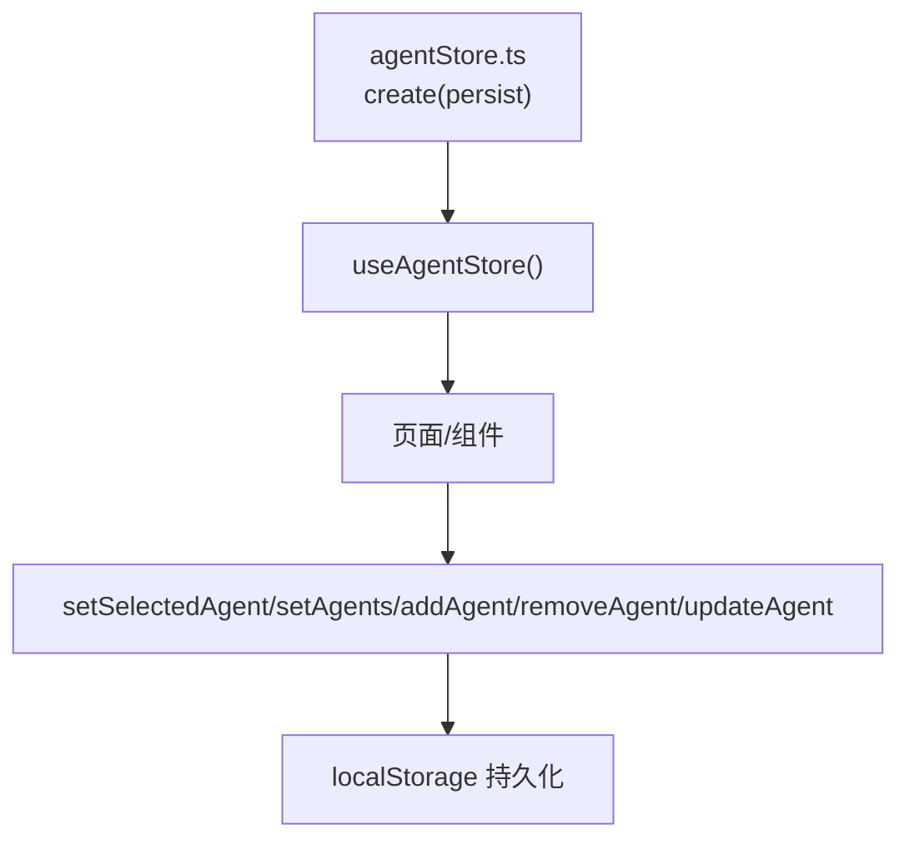

**图表来源**
- [stores/agentStore.ts:15-46](file://console/src/stores/agentStore.ts#L15-L46)

**章节来源**
- [stores/agentStore.ts:1-47](file://console/src/stores/agentStore.ts#L1-L47)

### 样式架构与组件复用
- 全局样式：通过ConfigProvider注入设计系统主题与前缀，统一全局样式。
- CSS Modules：Vite配置开启Less与CSS Modules，命名规范为[name]__[local]__[hash:base64:5]，减少样式冲突。
- 布局样式：主布局与容器采用Less模块化，确保页面容器与内容区的结构化样式。
- 组件样式：主题切换与语言切换等组件各自维护独立样式模块，便于复用与定制。
- **更新** 新增技能池页面样式模块，支持响应式网格布局与暗色模式适配。

**章节来源**
- [App.tsx:38-43](file://console/src/App.tsx#L38-L43)
- [vite.config.ts:18-27](file://console/vite.config.ts#L18-L27)
- [index.module.less](file://console/src/layouts/index.module.less)
- [styles/layout.css](file://console/src/styles/layout.css)
- [styles/form-override.css](file://console/src/styles/form-override.css)
- [Agent/SkillPool/index.module.less](file://console/src/pages/Agent/SkillPool/index.module.less)

### 技能池页面功能详解
**新增** 技能池页面提供完整的技能管理功能，包括：

- **技能广播**：支持将技能从技能池广播到多个工作区，处理重名冲突并提供重命名选项
- **内置技能导入**：从内置源导入技能，支持版本对比与冲突处理
- **ZIP包批量导入**：支持从ZIP包批量导入技能，限制文件大小并处理冲突
- **Hub技能安装**：从外部Hub安装技能，支持版本管理和覆盖选项
- **技能编辑**：支持创建、编辑、删除技能，验证前置元数据格式

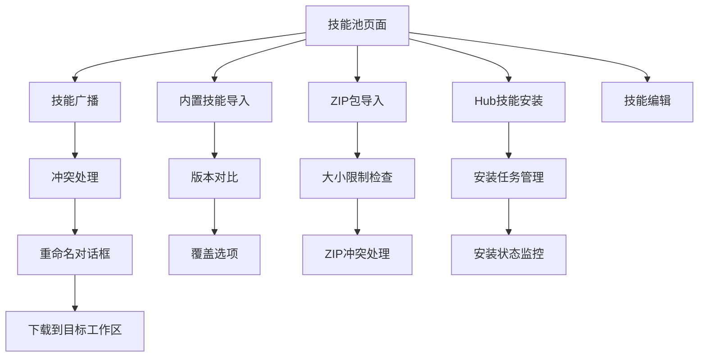

**图表来源**
- [Agent/SkillPool/index.tsx:194-281](file://console/src/pages/Agent/SkillPool/index.tsx#L194-L281)
- [Agent/SkillPool/components/BroadcastModal.tsx:21-189](file://console/src/pages/Agent/SkillPool/components/BroadcastModal.tsx#L21-L189)
- [Agent/SkillPool/components/ImportBuiltinModal.tsx:16-111](file://console/src/pages/Agent/SkillPool/components/ImportBuiltinModal.tsx#L16-L111)

**章节来源**
- [Agent/SkillPool/index.tsx:1-812](file://console/src/pages/Agent/SkillPool/index.tsx#L1-L812)
- [Agent/SkillPool/components/BroadcastModal.tsx:1-191](file://console/src/pages/Agent/SkillPool/components/BroadcastModal.tsx#L1-L191)
- [Agent/SkillPool/components/ImportBuiltinModal.tsx:1-112](file://console/src/pages/Agent/SkillPool/components/ImportBuiltinModal.tsx#L1-L112)

### 聊天会话管理增强
**更新** 聊天会话管理功能得到显著增强：

- **会话抽屉**：提供完整的会话列表管理，支持新建、重命名、删除会话
- **会话项组件**：支持内联编辑模式，提供输入框进行会话名称修改
- **会话API**：增强的SessionApi类，支持会话ID解析、历史记录获取、会话状态管理
- **持久化支持**：支持会话历史的持久化存储，处理临时ID与真实ID的映射

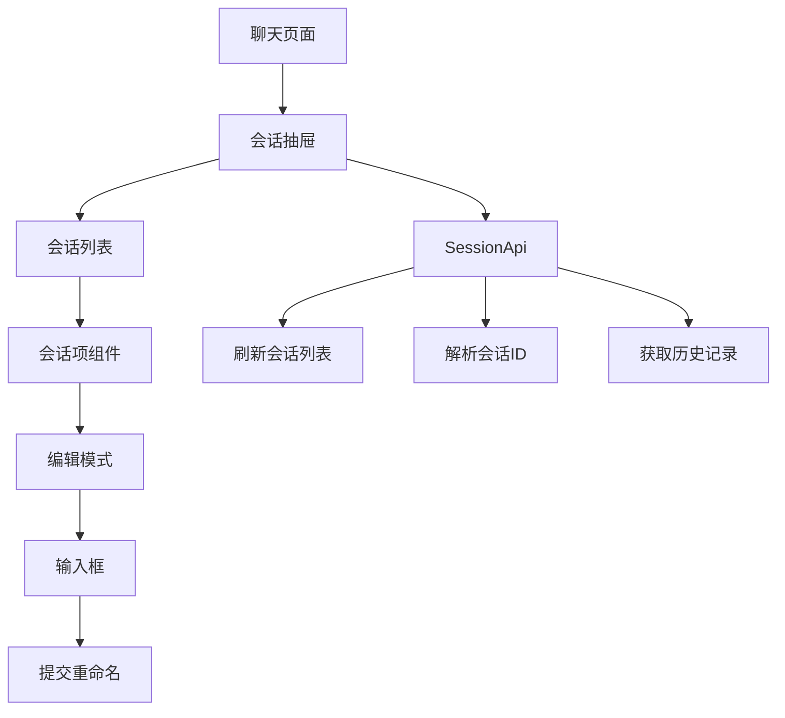

**图表来源**
- [Chat/components/ChatSessionDrawer/index.tsx:55-234](file://console/src/pages/Chat/components/ChatSessionDrawer/index.tsx#L55-L234)
- [Chat/components/ChatSessionItem/index.tsx:33-94](file://console/src/pages/Chat/components/ChatSessionItem/index.tsx#L33-L94)
- [Chat/sessionApi/index.ts:336-704](file://console/src/pages/Chat/sessionApi/index.ts#L336-L704)

**章节来源**
- [Chat/components/ChatSessionDrawer/index.tsx:1-234](file://console/src/pages/Chat/components/ChatSessionDrawer/index.tsx#L1-L234)
- [Chat/components/ChatSessionItem/index.tsx:1-94](file://console/src/pages/Chat/components/ChatSessionItem/index.tsx#L1-L94)
- [Chat/sessionApi/index.ts](file://console/src/pages/Chat/sessionApi/index.ts)

## 依赖关系分析
- 构建与运行：Vite提供开发服务器与打包能力，React与TypeScript提供类型安全与组件模型，Less与CSS Modules提升样式可维护性。
- UI生态：Ant Design与自研设计系统协同，提供丰富的UI组件与主题能力；Ant Design X Markdown用于富文本渲染。
- 状态与工具：ahooks提供常用Hooks能力，Zustand用于轻量状态管理，dayjs用于日期本地化，i18next与react-i18next实现国际化。
- 拖拽与排序：dnd-kit提供拖拽与排序能力，适用于可排序列表与工作区文件管理。
- **更新** 新增技能池相关依赖，包括技能池API模块、内置技能导入组件、ZIP包处理功能等。

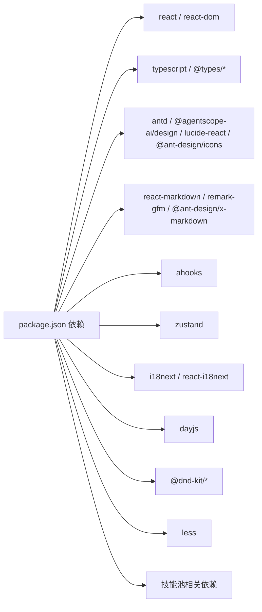

**图表来源**
- [package.json:18-39](file://console/package.json#L18-L39)

**章节来源**
- [package.json:1-60](file://console/package.json#L1-L60)
- [vite.config.ts:1-49](file://console/vite.config.ts#L1-L49)

## 性能考量
- 依赖优化：Vite在开发阶段对diff等依赖进行显式预构建，减少冷启动时间。
- 请求缓存：建议在页面级或组件级增加请求去重与缓存策略，避免重复请求相同数据。
- 图片与媒体：聊天与工作区中的图片/音频/视频建议懒加载与尺寸优化，减少首屏压力。
- 动画与滚动：长列表与抽屉组件注意虚拟化与滚动优化，避免大列表渲染卡顿。
- 打包体积：按需引入Ant Design组件与图标，避免全量引入造成体积膨胀。
- **更新** 技能池功能优化：新增技能池缓存机制，支持智能缓存失效与批量缓存清理。

**章节来源**
- [vite.config.ts:38-40](file://console/vite.config.ts#L38-L40)
- [api/modules/skill.ts:16-61](file://console/src/api/modules/skill.ts#L16-L61)

## 故障排查指南
- 登录失败/频繁跳转登录
  - 检查后端认证接口状态与令牌有效性；确认401拦截逻辑是否触发。
  - 参考：[api/request.ts:36-44](file://console/src/api/request.ts#L36-L44)，[api/modules/auth.ts:14-48](file://console/src/api/modules/auth.ts#L14-L48)
- 语言切换无效
  - 确认i18n初始化与languageChanged事件绑定；检查localStorage写入。
  - **更新** 检查语言切换器的后端同步功能是否正常工作。
  - 参考：[i18n.ts:22-29](file://console/src/i18n.ts#L22-L29)，[App.tsx:115-129](file://console/src/App.tsx#L115-L129)，[LanguageSwitcher/index.tsx:14-22](file://console/src/components/LanguageSwitcher/index.tsx#L14-L22)
- 主题不生效
  - 检查ThemeContext是否正确写入localStorage与HTML类名；确认系统配色监听。
  - 参考：[ThemeContext.tsx:58-77](file://console/src/contexts/ThemeContext.tsx#L58-L77)，[App.tsx:134-144](file://console/src/App.tsx#L134-L144)
- 路由跳转异常
  - 检查basename计算与默认路由重定向；确认MainLayout路由表。
  - **更新** 检查技能池页面路由配置是否正确。
  - 参考：[App.tsx:102-104](file://console/src/App.tsx#L102-L104)，[MainLayout/index.tsx:58-79](file://console/src/layouts/MainLayout/index.tsx#L58-L79)，[Sidebar.tsx:176-180](file://console/src/layouts/Sidebar.tsx#L176-L180)
- API请求报错
  - 查看请求头是否包含Authorization；确认content-type与响应类型处理。
  - **更新** 检查技能池相关API接口的错误处理。
  - 参考：[api/request.ts:23-64](file://console/src/api/request.ts#L23-L64)，[api/authHeaders.ts](file://console/src/api/authHeaders.ts)，[api/modules/skill.ts:112-487](file://console/src/api/modules/skill.ts#L112-L487)
- 技能池功能异常
  - **新增** 检查技能池缓存机制、ZIP包上传限制、Hub技能安装状态。
  - 参考：[Agent/SkillPool/index.tsx:75-95](file://console/src/pages/Agent/SkillPool/index.tsx#L75-L95)，[api/modules/skill.ts:135-143](file://console/src/api/modules/skill.ts#L135-L143)

**章节来源**
- [api/request.ts:36-44](file://console/src/api/request.ts#L36-L44)
- [api/modules/auth.ts:14-48](file://console/src/api/modules/auth.ts#L14-L48)
- [i18n.ts:22-29](file://console/src/i18n.ts#L22-L29)
- [ThemeContext.tsx:58-77](file://console/src/contexts/ThemeContext.tsx#L58-L77)
- [App.tsx:102-104](file://console/src/App.tsx#L102-L104)
- [MainLayout/index.tsx:58-79](file://console/src/layouts/MainLayout/index.tsx#L58-L79)
- [api/request.ts:23-64](file://console/src/api/request.ts#L23-L64)
- [LanguageSwitcher/index.tsx:14-22](file://console/src/components/LanguageSwitcher/index.tsx#L14-L22)
- [Agent/SkillPool/index.tsx:75-95](file://console/src/pages/Agent/SkillPool/index.tsx#L75-L95)
- [api/modules/skill.ts:135-143](file://console/src/api/modules/skill.ts#L135-L143)

## 结论
本控制台应用以清晰的分层架构、完善的国际化与主题系统、模块化的API客户端与状态管理，提供了良好的可扩展性与可维护性。通过统一的路由与权限控制、组件化的设计与样式体系，能够支撑从聊天、控制到设置等多维度的功能场景。

**更新** 新增的技能池页面、增强的聊天会话管理功能以及改进的语言切换组件，进一步丰富了应用的功能矩阵。建议在后续迭代中持续关注性能优化与用户体验细节，进一步完善错误处理与监控埋点。

## 附录
- 开发与构建脚本：参考package.json中的scripts字段，支持开发、构建、预览与格式化校验。
- 环境变量：Vite通过define注入VITE_API_BASE_URL、TOKEN与MOBILE等常量，便于在构建时注入配置。
- 本地化资源：locales目录包含英文、俄文、中文、日文翻译文件，便于扩展更多语言。
- **更新** 技能池API接口：提供完整的技能池管理功能，包括广播、导入、编辑等操作。
- **更新** 会话管理增强：提供更完善的会话生命周期管理与持久化支持。

**章节来源**
- [package.json:6-16](file://console/package.json#L6-L16)
- [vite.config.ts:11-16](file://console/vite.config.ts#L11-L16)
- [locales/en.json](file://console/src/locales/en.json)
- [locales/zh.json](file://console/src/locales/zh.json)
- [locales/ja.json](file://console/src/locales/ja.json)
- [api/modules/skill.ts:135-143](file://console/src/api/modules/skill.ts#L135-L143)
- [Chat/sessionApi/index.ts:475-504](file://console/src/pages/Chat/sessionApi/index.ts#L475-L504)