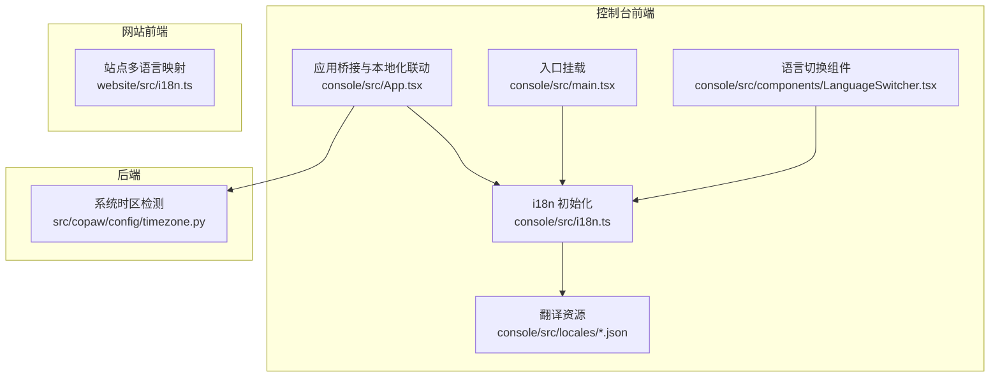
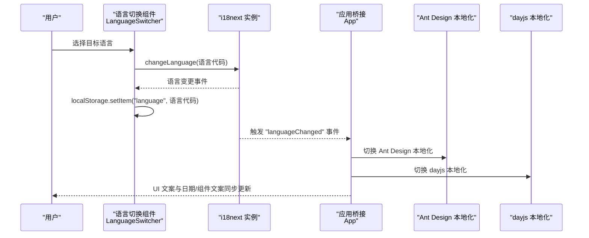
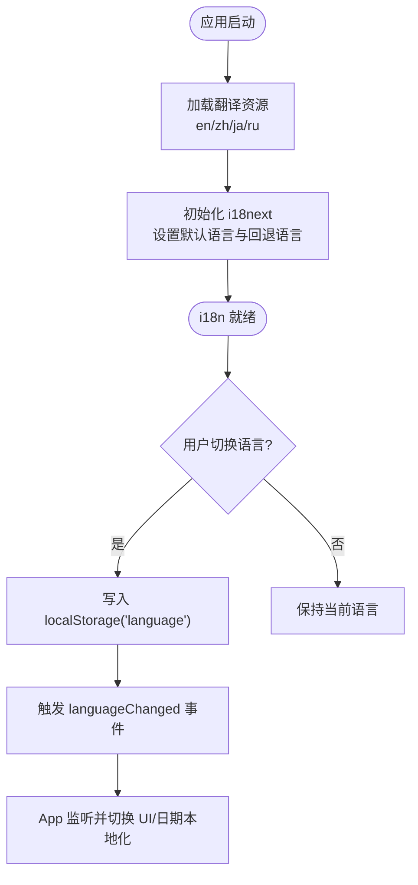
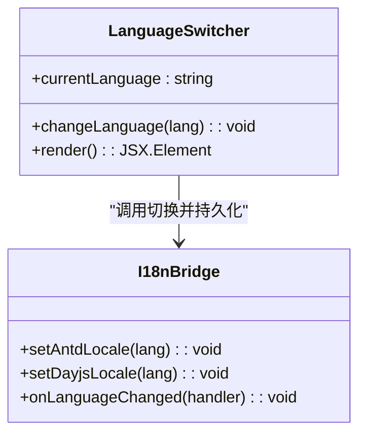
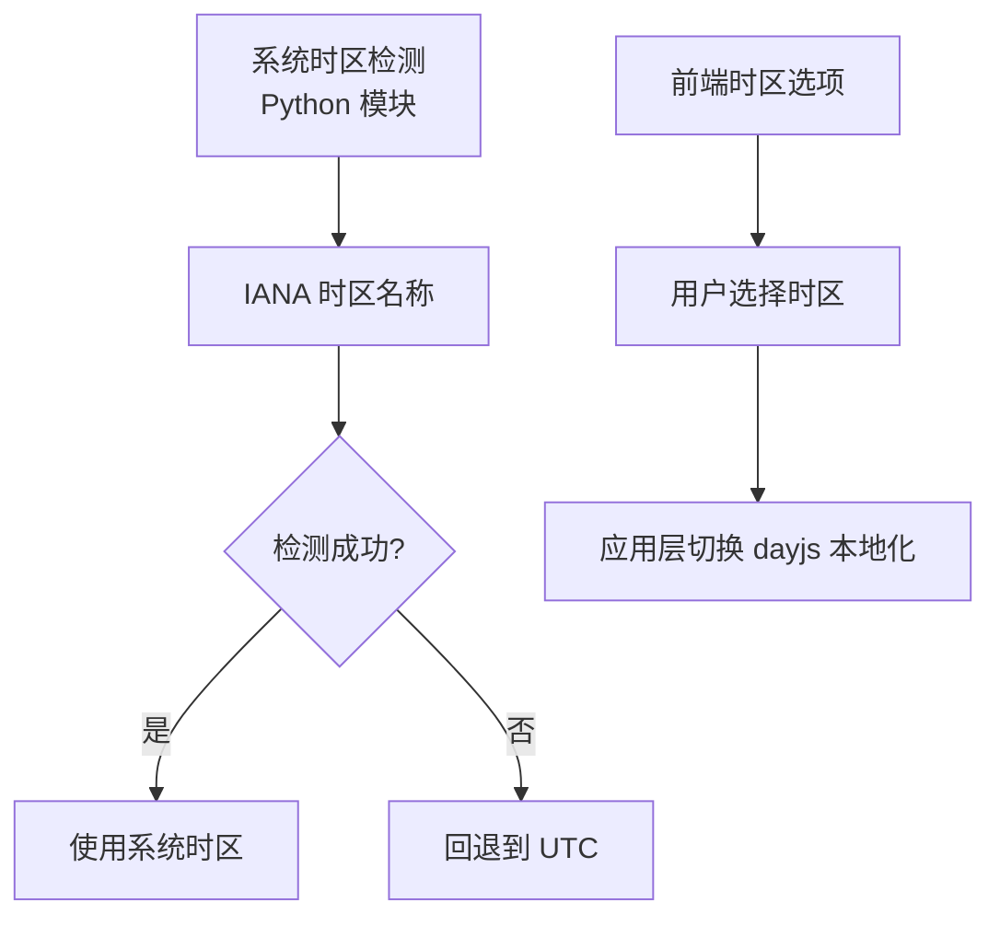
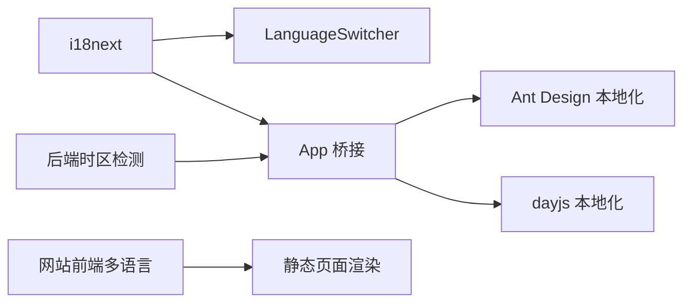

# 国际化与本地化

<cite>
**本文引用的文件**
- [console/src/i18n.ts](file://console/src/i18n.ts)
- [console/src/locales/en.json](file://console/src/locales/en.json)
- [console/src/locales/zh.json](file://console/src/locales/zh.json)
- [console/src/locales/ja.json](file://console/src/locales/ja.json)
- [console/src/components/LanguageSwitcher.tsx](file://console/src/components/LanguageSwitcher.tsx)
- [console/src/App.tsx](file://console/src/App.tsx)
- [console/src/main.tsx](file://console/src/main.tsx)
- [console/src/constants/timezone.ts](file://console/src/constants/timezone.ts)
- [src/copaw/config/timezone.py](file://src/copaw/config/timezone.py)
- [console/src/utils/formatNumber.ts](file://console/src/utils/formatNumber.ts)
- [website/src/i18n.ts](file://website/src/i18n.ts)
- [console/src/layouts/Header.tsx](file://console/src/layouts/Header.tsx)
- [console/src/pages/Login/index.tsx](file://console/src/pages/Login/index.tsx)
</cite>

## 目录
1. [简介](#简介)
2. [项目结构](#项目结构)
3. [核心组件](#核心组件)
4. [架构总览](#架构总览)
5. [详细组件分析](#详细组件分析)
6. [依赖关系分析](#依赖关系分析)
7. [性能考量](#性能考量)
8. [故障排查指南](#故障排查指南)
9. [结论](#结论)
10. [附录](#附录)

## 简介
本文件系统性梳理 CoPaw 的国际化与本地化（i18n）体系，覆盖前端 React 应用与网站前端两套 i18n 实现、翻译资源组织、语言切换机制、时区与日期/数字本地化策略、语言检测与回退规则，以及面向开发者的扩展与最佳实践。读者可据此理解如何在现有架构上新增语言、维护翻译键值、优化本地化体验。

## 项目结构
CoPaw 的国际化涉及三处主要位置：
- 控制台前端（React + TypeScript）：使用 i18next 进行键值翻译，Ant Design 本地化与 dayjs 本地化联动。
- 网站前端（React + TypeScript）：采用轻量键值映射表与工具函数实现站点文案多语言。
- 后端 Python 配置模块：提供系统时区检测能力，供后端逻辑与定时任务使用。

图表来源
- [console/src/i18n.ts:1-32](file://console/src/i18n.ts#L1-L32)
- [console/src/components/LanguageSwitcher.tsx:1-59](file://console/src/components/LanguageSwitcher.tsx#L1-L59)
- [console/src/App.tsx:1-171](file://console/src/App.tsx#L1-L171)
- [console/src/main.tsx:1-31](file://console/src/main.tsx#L1-L31)
- [website/src/i18n.ts:1-278](file://website/src/i18n.ts#L1-L278)
- [src/copaw/config/timezone.py:1-197](file://src/copaw/config/timezone.py#L1-L197)

章节来源
- [console/src/i18n.ts:1-32](file://console/src/i18n.ts#L1-L32)
- [console/src/App.tsx:1-171](file://console/src/App.tsx#L1-L171)
- [website/src/i18n.ts:1-278](file://website/src/i18n.ts#L1-L278)
- [src/copaw/config/timezone.py:1-197](file://src/copaw/config/timezone.py#L1-L197)

## 核心组件
- i18next 初始化与资源加载：集中于控制台前端的 i18n 初始化文件，加载四种语言的翻译资源，并设置默认语言与回退语言。
- 翻译资源文件：按语言划分的 JSON 文件，键名为层级化命名空间，值为具体文案。
- 语言切换组件：提供下拉菜单，调用 i18next 切换语言并将选择持久化到本地存储。
- 应用桥接：在应用层根据当前语言切换 Ant Design 本地化与 dayjs 本地化，确保 UI 组件与日期库的本地化一致。
- 网站前端多语言：网站侧采用键值映射表与工具函数，实现文档、导航、特性等文案的多语言渲染。
- 时区检测与本地化：后端提供系统 IANA 时区检测，前端提供常用时区选项，配合后端时区用于定时任务与时间显示。

章节来源
- [console/src/i18n.ts:1-32](file://console/src/i18n.ts#L1-L32)
- [console/src/locales/en.json:1-120](file://console/src/locales/en.json#L1-L120)
- [console/src/locales/zh.json:1-120](file://console/src/locales/zh.json#L1-L120)
- [console/src/locales/ja.json:1-120](file://console/src/locales/ja.json#L1-L120)
- [console/src/components/LanguageSwitcher.tsx:1-59](file://console/src/components/LanguageSwitcher.tsx#L1-L59)
- [console/src/App.tsx:1-171](file://console/src/App.tsx#L1-L171)
- [website/src/i18n.ts:1-278](file://website/src/i18n.ts#L1-L278)
- [src/copaw/config/timezone.py:1-197](file://src/copaw/config/timezone.py#L1-L197)

## 架构总览
控制台前端的 i18n 架构围绕 i18next 展开，结合 Ant Design 与 dayjs 的本地化，形成“键值翻译 + UI/日期本地化”的统一方案。网站前端采用轻量键值映射，满足静态站点的多语言需求。后端提供系统时区检测，支撑定时任务与时区相关功能。

图表来源
- [console/src/components/LanguageSwitcher.tsx:1-59](file://console/src/components/LanguageSwitcher.tsx#L1-L59)
- [console/src/App.tsx:1-171](file://console/src/App.tsx#L1-L171)
- [console/src/i18n.ts:1-32](file://console/src/i18n.ts#L1-L32)

章节来源
- [console/src/components/LanguageSwitcher.tsx:1-59](file://console/src/components/LanguageSwitcher.tsx#L1-L59)
- [console/src/App.tsx:1-171](file://console/src/App.tsx#L1-L171)
- [console/src/i18n.ts:1-32](file://console/src/i18n.ts#L1-L32)

## 详细组件分析

### i18next 初始化与资源管理
- 资源加载：初始化时引入四种语言的翻译资源，统一挂载到 translation 命名空间。
- 默认语言与回退：从本地存储读取语言偏好，若不存在则回退到英语；回退语言固定为英语。
- 插值与转义：关闭默认转义，交由框架安全处理，避免二次转义问题。

图表来源
- [console/src/i18n.ts:1-32](file://console/src/i18n.ts#L1-L32)
- [console/src/main.tsx:1-31](file://console/src/main.tsx#L1-L31)

章节来源
- [console/src/i18n.ts:1-32](file://console/src/i18n.ts#L1-L32)
- [console/src/main.tsx:1-31](file://console/src/main.tsx#L1-L31)

### 翻译资源组织与命名规范
- 文件组织：按语言划分的 JSON 文件位于 locales 目录，文件名即语言代码。
- 键命名：采用层级化命名空间（如 common、nav、agent 等），便于分组与查找。
- 插值占位：支持在文案中使用插值变量，用于动态注入数值、时间等上下文。
- 多语言覆盖：当前已提供英语、中文、日语、俄语四套资源，键结构保持一致以便替换与补全。

章节来源
- [console/src/locales/en.json:1-120](file://console/src/locales/en.json#L1-L120)
- [console/src/locales/zh.json:1-120](file://console/src/locales/zh.json#L1-L120)
- [console/src/locales/ja.json:1-120](file://console/src/locales/ja.json#L1-L120)

### 语言切换机制与持久化
- 切换流程：语言切换组件监听用户选择，调用 i18next 的 changeLanguage 方法，并将语言代码写入本地存储。
- UI 同步：应用层监听语言变更事件，动态切换 Ant Design 本地化与 dayjs 本地化，确保界面与日期文案同步更新。
- 语言标签：组件内部维护语言标签映射，保证下拉菜单显示正确的语言名称。

图表来源
- [console/src/components/LanguageSwitcher.tsx:1-59](file://console/src/components/LanguageSwitcher.tsx#L1-L59)
- [console/src/App.tsx:1-171](file://console/src/App.tsx#L1-L171)

章节来源
- [console/src/components/LanguageSwitcher.tsx:1-59](file://console/src/components/LanguageSwitcher.tsx#L1-L59)
- [console/src/App.tsx:1-171](file://console/src/App.tsx#L1-L171)

### 时区处理与日期本地化
- 系统时区检测（后端）：提供系统 IANA 时区检测函数，优先使用 Python 运行时与环境变量，其次尝试系统配置与注册表（Windows），最终回退到 UTC。
- 前端时区选项：提供常用时区选项列表，便于用户在前端界面选择。
- 日期本地化：应用层根据当前语言切换 dayjs 本地化，确保日期文案与格式符合用户语言偏好。

图表来源
- [src/copaw/config/timezone.py:1-197](file://src/copaw/config/timezone.py#L1-L197)
- [console/src/constants/timezone.ts:1-22](file://console/src/constants/timezone.ts#L1-L22)
- [console/src/App.tsx:1-171](file://console/src/App.tsx#L1-L171)

章节来源
- [src/copaw/config/timezone.py:1-197](file://src/copaw/config/timezone.py#L1-L197)
- [console/src/constants/timezone.ts:1-22](file://console/src/constants/timezone.ts#L1-L22)
- [console/src/App.tsx:1-171](file://console/src/App.tsx#L1-L171)

### 数字本地化与格式化
- 紧凑数字格式：提供紧凑数字格式化函数，支持千、百万、十亿单位缩写，适用于统计类展示。
- 本地化数字：在 dayjs 本地化基础上，结合 Ant Design 组件的本地化，确保数字与日期在不同语言环境下的一致性。

章节来源
- [console/src/utils/formatNumber.ts:1-27](file://console/src/utils/formatNumber.ts#L1-L27)
- [console/src/App.tsx:1-171](file://console/src/App.tsx#L1-L171)

### 网站前端多语言实现
- 键值映射：网站前端采用键值映射表，按语言组织导航、特性、使用案例、文档等文案。
- 渲染函数：提供工具函数根据语言与键名返回对应文案，简化页面渲染逻辑。
- 适用场景：适合静态站点、文档与营销页面的多语言展示。

章节来源
- [website/src/i18n.ts:1-278](file://website/src/i18n.ts#L1-L278)

### 登录页与头部导航的国际化使用
- 登录页：使用 useTranslation 获取翻译函数，动态渲染标题、提示、占位符与错误信息，确保认证流程的多语言一致性。
- 头部导航：根据当前语言动态显示导航标题与工具提示，外部链接根据语言选择对应文档与 FAQ 地址。

章节来源
- [console/src/pages/Login/index.tsx:1-174](file://console/src/pages/Login/index.tsx#L1-L174)
- [console/src/layouts/Header.tsx:1-91](file://console/src/layouts/Header.tsx#L1-L91)

## 依赖关系分析
- 控制台前端依赖 i18next 作为翻译引擎，Ant Design 与 dayjs 作为 UI 与日期本地化的配套。
- 语言切换组件与应用桥接共同驱动语言变更事件，确保 UI 与日期库同步更新。
- 网站前端独立维护一套键值映射，与控制台前端解耦。
- 后端时区检测模块为定时任务与上下文提供系统时区，避免硬编码时区带来的跨平台问题。

图表来源
- [console/src/i18n.ts:1-32](file://console/src/i18n.ts#L1-L32)
- [console/src/components/LanguageSwitcher.tsx:1-59](file://console/src/components/LanguageSwitcher.tsx#L1-L59)
- [console/src/App.tsx:1-171](file://console/src/App.tsx#L1-L171)
- [website/src/i18n.ts:1-278](file://website/src/i18n.ts#L1-L278)
- [src/copaw/config/timezone.py:1-197](file://src/copaw/config/timezone.py#L1-L197)

章节来源
- [console/src/i18n.ts:1-32](file://console/src/i18n.ts#L1-L32)
- [console/src/App.tsx:1-171](file://console/src/App.tsx#L1-L171)
- [website/src/i18n.ts:1-278](file://website/src/i18n.ts#L1-L278)
- [src/copaw/config/timezone.py:1-197](file://src/copaw/config/timezone.py#L1-L197)

## 性能考量
- 资源加载：一次性加载所有语言资源，减少运行时按需加载的复杂度；若未来语言规模扩大，可考虑按需懒加载策略。
- 事件监听：应用层仅在语言变更时切换本地化，避免频繁重渲染。
- 本地存储：语言选择持久化到本地存储，减少每次启动的判断成本。
- 数字格式化：紧凑数字格式化为纯计算逻辑，开销极低，适合高频展示。

## 故障排查指南
- 语言未生效：检查本地存储中是否存在 "language" 键，确认 i18next 是否触发了语言变更事件，以及应用层是否正确切换了 Ant Design 与 dayjs 本地化。
- 文案缺失：检查对应语言的 JSON 文件中是否存在该键，确保键名与层级一致。
- 日期/数字异常：确认 dayjs 本地化是否随语言切换，Ant Design 本地化是否正确映射。
- 时区错误：检查后端时区检测是否返回有效 IANA 名称，前端时区选项是否包含用户选择的时区。

章节来源
- [console/src/components/LanguageSwitcher.tsx:1-59](file://console/src/components/LanguageSwitcher.tsx#L1-L59)
- [console/src/App.tsx:1-171](file://console/src/App.tsx#L1-L171)
- [src/copaw/config/timezone.py:1-197](file://src/copaw/config/timezone.py#L1-L197)

## 结论
CoPaw 的国际化体系以 i18next 为核心，结合 Ant Design 与 dayjs 的本地化，实现了从前端 UI 到日期文案的统一多语言支持。网站前端采用键值映射表，满足静态站点的多语言需求。后端提供系统时区检测，保障定时任务与时区相关功能的准确性。整体架构清晰、扩展性强，便于新增语言与维护翻译资源。

## 附录

### 语言检测与回退规则
- 默认语言：从本地存储读取，若不存在则使用英语。
- 回退语言：固定为英语，确保任何情况下都有可用文案。
- 语言代码：组件与应用层均以短语言代码（如 en/zh/ja/ru）为主，避免带地区变体的语言代码导致的不一致。

章节来源
- [console/src/i18n.ts:1-32](file://console/src/i18n.ts#L1-L32)
- [console/src/components/LanguageSwitcher.tsx:1-59](file://console/src/components/LanguageSwitcher.tsx#L1-L59)

### 新增语言步骤（开发者指南）
- 创建翻译文件：在 locales 目录新增对应语言的 JSON 文件，键结构与现有语言保持一致。
- 更新初始化：在 i18n 初始化文件中引入新语言资源，并将其纳入资源对象。
- 更新语言切换：在语言切换组件中添加新语言选项，并维护语言标签映射。
- 更新应用桥接：在应用层增加 Ant Design 与 dayjs 的本地化映射，确保 UI 与日期文案同步。
- 后端时区：如需支持新语言的文档链接或时区选项，可在相应模块补充。

章节来源
- [console/src/i18n.ts:1-32](file://console/src/i18n.ts#L1-L32)
- [console/src/components/LanguageSwitcher.tsx:1-59](file://console/src/components/LanguageSwitcher.tsx#L1-L59)
- [console/src/App.tsx:1-171](file://console/src/App.tsx#L1-L171)

### 翻译键值管理最佳实践
- 键命名：采用层级化命名空间，避免重复与歧义；同一功能模块的键尽量集中在一个命名空间下。
- 插值使用：在文案中使用插值变量时，确保变量名清晰且与上下文一致，避免硬编码。
- 文案一致性：同一语义在不同语言中保持一致的含义与语气，必要时通过审校流程保证质量。
- 资源维护：定期清理未使用的键，合并重复键，保持资源文件整洁。

章节来源
- [console/src/locales/en.json:1-120](file://console/src/locales/en.json#L1-L120)
- [console/src/locales/zh.json:1-120](file://console/src/locales/zh.json#L1-L120)
- [console/src/locales/ja.json:1-120](file://console/src/locales/ja.json#L1-L120)