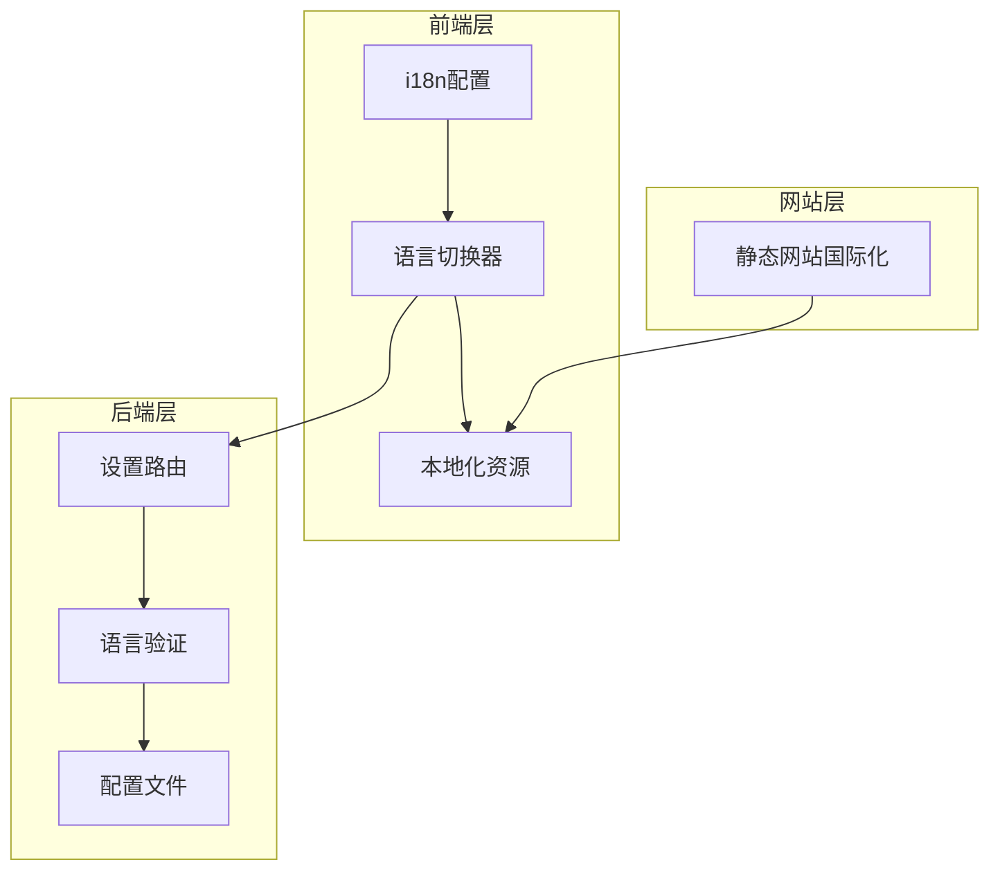
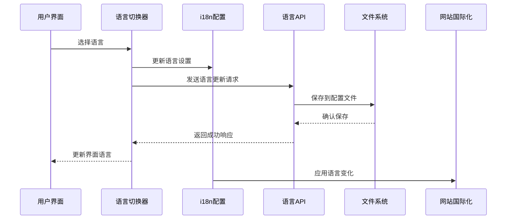
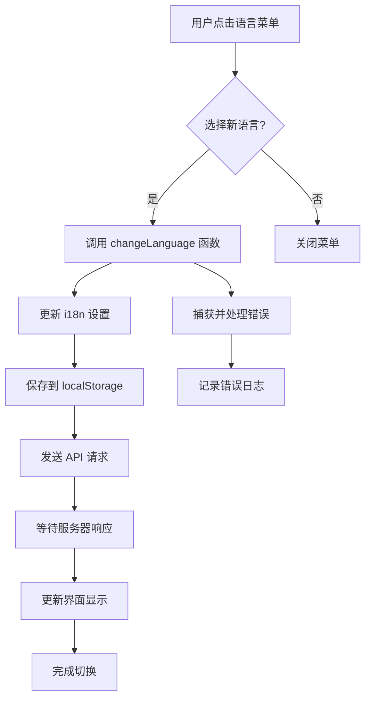
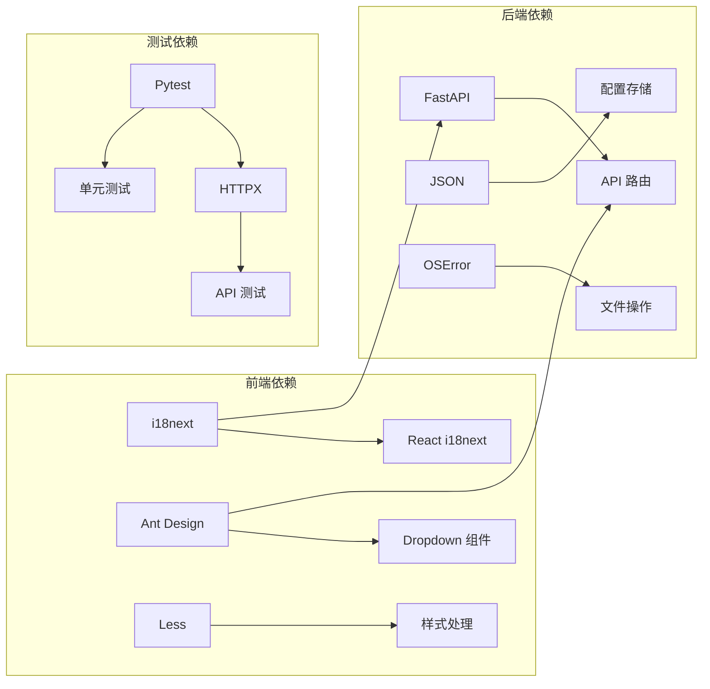

# 增强的多语言支持

<cite>
**本文档引用的文件**
- [console/src/i18n.ts](file://console/src/i18n.ts)
- [console/src/locales/en.json](file://console/src/locales/en.json)
- [console/src/locales/zh.json](file://console/src/locales/zh.json)
- [console/src/locales/ja.json](file://console/src/locales/ja.json)
- [console/src/components/LanguageSwitcher/index.tsx](file://console/src/components/LanguageSwitcher/index.tsx)
- [console/src/api/modules/language.ts](file://console/src/api/modules/language.ts)
- [src/copaw/app/routers/settings.py](file://src/copaw/app/routers/settings.py)
- [website/src/i18n.ts](file://website/src/i18n.ts)
- [tests/unit/routers/test_settings.py](file://tests/unit/routers/test_settings.py)
</cite>

## 目录
1. [简介](#简介)
2. [项目结构](#项目结构)
3. [核心组件](#核心组件)
4. [架构概览](#架构概览)
5. [详细组件分析](#详细组件分析)
6. [依赖关系分析](#依赖关系分析)
7. [性能考虑](#性能考虑)
8. [故障排除指南](#故障排除指南)
9. [结论](#结论)

## 简介

CoPaw 项目实现了全面的多语言支持系统，支持英语（en）、中文（zh）、日语（ja）和俄语（ru）四种语言。该系统采用前后端分离的架构设计，通过 React i18next 库实现前端国际化，通过 FastAPI 实现后端语言设置持久化，确保用户语言偏好能够在整个应用生命周期中得到保持。

## 项目结构

多语言支持系统主要分布在三个层面：

**图表来源**
- [console/src/i18n.ts:1-32](file://console/src/i18n.ts#L1-L32)
- [src/copaw/app/routers/settings.py:19-59](file://src/copaw/app/routers/settings.py#L19-L59)

**章节来源**
- [console/src/i18n.ts:1-32](file://console/src/i18n.ts#L1-L32)
- [console/src/locales/en.json:1-50](file://console/src/locales/en.json#L1-L50)
- [console/src/locales/zh.json:1-50](file://console/src/locales/zh.json#L1-L50)
- [console/src/locales/ja.json:1-50](file://console/src/locales/ja.json#L1-L50)

## 核心组件

### 前端国际化配置

前端使用 i18next 库实现多语言支持，配置文件位于 `console/src/i18n.ts`：

- **语言资源加载**：支持四种语言的 JSON 资源文件
- **默认语言设置**：从 localStorage 读取用户偏好，回退到英语
- **插值处理**：启用模板字符串插值功能

### 语言切换器组件

`console/src/components/LanguageSwitcher/index.tsx` 提供用户界面组件：

- **语言菜单**：包含四种语言选项
- **状态管理**：实时更新当前语言状态
- **持久化存储**：将用户选择保存到 localStorage
- **API 集成**：通过语言 API 同步服务器端设置

### 后端语言设置

`src/copaw/app/routers/settings.py` 实现语言设置的后端逻辑：

- **有效语言集合**：严格限制支持的语言范围
- **配置文件管理**：使用 JSON 文件存储语言设置
- **API 接口**：提供 GET 和 PUT 方法获取和更新语言设置

**章节来源**
- [console/src/i18n.ts:22-29](file://console/src/i18n.ts#L22-L29)
- [console/src/components/LanguageSwitcher/index.tsx:8-22](file://console/src/components/LanguageSwitcher/index.tsx#L8-L22)
- [src/copaw/app/routers/settings.py:39-59](file://src/copaw/app/routers/settings.py#L39-L59)

## 架构概览

多语言支持系统的整体架构如下：

**图表来源**
- [console/src/components/LanguageSwitcher/index.tsx:14-22](file://console/src/components/LanguageSwitcher/index.tsx#L14-L22)
- [console/src/api/modules/language.ts:6-11](file://console/src/api/modules/language.ts#L6-L11)
- [src/copaw/app/routers/settings.py:44-58](file://src/copaw/app/routers/settings.py#L44-L58)

## 详细组件分析

### i18n 配置系统

前端国际化配置的核心功能包括：

#### 语言资源管理
- **资源加载**：动态导入四种语言的 JSON 文件
- **命名空间组织**：使用 `translation` 命名空间统一管理
- **回退机制**：设置英语为默认回退语言

#### 插值系统
- **模板支持**：支持 `{{variable}}` 格式的动态内容
- **数值格式化**：自动处理数字和计数显示
- **占位符处理**：提供用户友好的输入提示

### 语言切换器实现

语言切换器组件采用现代化的设计模式：

#### 组件状态管理
- **当前语言检测**：自动识别当前激活的语言
- **语言键提取**：从完整语言标签中提取基础语言代码
- **状态同步**：确保 UI 状态与实际语言设置一致

#### 用户交互流程

**图表来源**
- [console/src/components/LanguageSwitcher/index.tsx:14-22](file://console/src/components/LanguageSwitcher/index.tsx#L14-L22)

### 后端语言设置管理

后端系统提供了完整的语言设置管理功能：

#### 语言验证机制
- **集合验证**：严格检查语言代码的有效性
- **错误处理**：对无效语言返回明确的错误信息
- **数据完整性**：确保配置文件的数据结构正确

#### 配置持久化
- **文件系统操作**：安全地读写配置文件
- **目录创建**：自动创建必要的目录结构
- **编码处理**：使用 UTF-8 编码确保国际化字符正确存储

### 本地化资源结构

四种语言的本地化资源具有统一的结构：

#### 资源文件组织
- **模块化设计**：按功能模块组织翻译键
- **层次化结构**：使用点号分隔的层级结构
- **一致性原则**：确保所有语言文件包含相同的键结构

#### 支持的语言范围
- **英语 (en)**：作为默认和回退语言
- **中文 (zh)**：简体中文支持
- **日语 (ja)**：日语本地化
- **俄语 (ru)**：俄语支持

**章节来源**
- [console/src/locales/en.json:1-1260](file://console/src/locales/en.json#L1-L1260)
- [console/src/locales/zh.json:1-1264](file://console/src/locales/zh.json#L1-L1264)
- [console/src/locales/ja.json:1-1227](file://console/src/locales/ja.json#L1-L1227)

## 依赖关系分析

多语言支持系统的依赖关系如下：

**图表来源**
- [console/src/i18n.ts:1-32](file://console/src/i18n.ts#L1-L32)
- [src/copaw/app/routers/settings.py:11-15](file://src/copaw/app/routers/settings.py#L11-L15)

**章节来源**
- [tests/unit/routers/test_settings.py:46-136](file://tests/unit/routers/test_settings.py#L46-L136)

## 性能考虑

多语言支持系统在性能方面采用了多项优化措施：

### 资源加载优化
- **按需加载**：语言资源在需要时才进行加载
- **缓存机制**：利用浏览器缓存减少重复加载
- **增量更新**：支持部分语言资源的动态更新

### 内存管理
- **资源卸载**：组件卸载时清理相关资源
- **状态优化**：最小化不必要的状态更新
- **事件监听**：及时清理事件监听器

### 网络性能
- **API 优化**：语言设置 API 设计简洁高效
- **错误处理**：快速失败机制减少无效请求
- **重试机制**：在网络异常时提供重试支持

## 故障排除指南

### 常见问题及解决方案

#### 语言切换失效
**症状**：语言切换后界面不更新
**原因**：i18n 实例未正确更新
**解决方案**：
1. 检查 `changeLanguage` 函数调用
2. 验证 localStorage 存储状态
3. 确认 API 请求成功返回

#### 语言设置未持久化
**症状**：刷新页面后语言设置丢失
**原因**：配置文件写入失败
**解决方案**：
1. 检查文件系统权限
2. 验证 JSON 格式正确性
3. 确认目录存在且可写

#### 无效语言代码
**症状**：设置无效语言代码时报错
**原因**：语言代码不在允许集合中
**解决方案**：
1. 检查语言代码格式
2. 确认使用支持的语言代码
3. 查看允许的语言列表

**章节来源**
- [tests/unit/routers/test_settings.py:77-106](file://tests/unit/routers/test_settings.py#L77-L106)

## 结论

CoPaw 项目的多语言支持系统展现了现代 Web 应用国际化设计的最佳实践。通过前后端协同、严格的语言验证、完善的错误处理和优化的性能考虑，该系统为用户提供了流畅的多语言体验。

系统的主要优势包括：
- **全面的语言支持**：涵盖四种主要语言
- **用户友好的界面**：直观的切换和管理功能
- **可靠的后端支持**：安全的配置持久化机制
- **良好的扩展性**：易于添加新的语言支持
- **完善的测试覆盖**：确保功能的稳定性和可靠性

未来可以考虑的改进方向：
- 添加更多语言支持
- 实现动态语言包加载
- 增强语言切换的用户体验
- 优化性能和内存使用