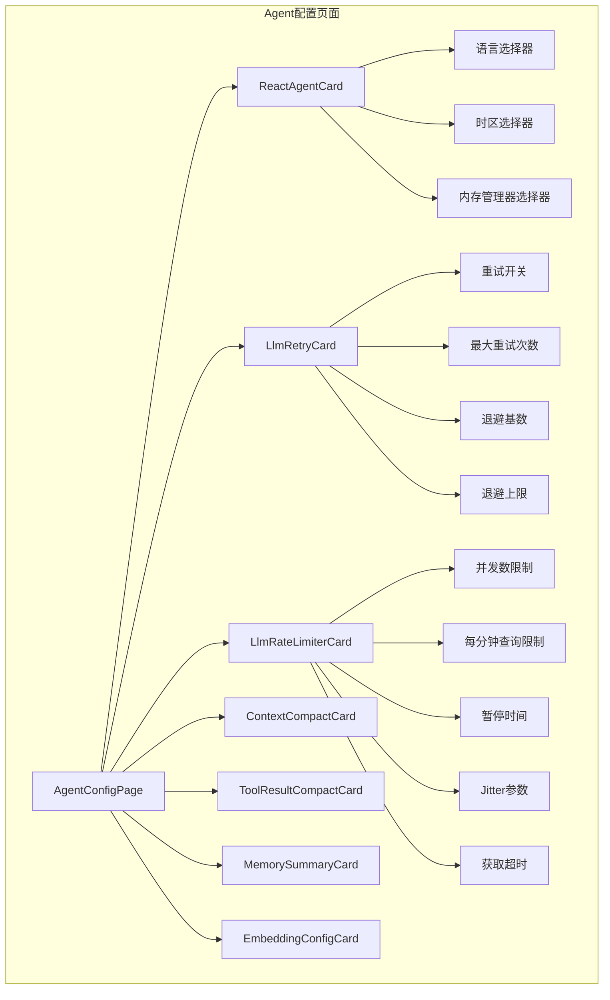
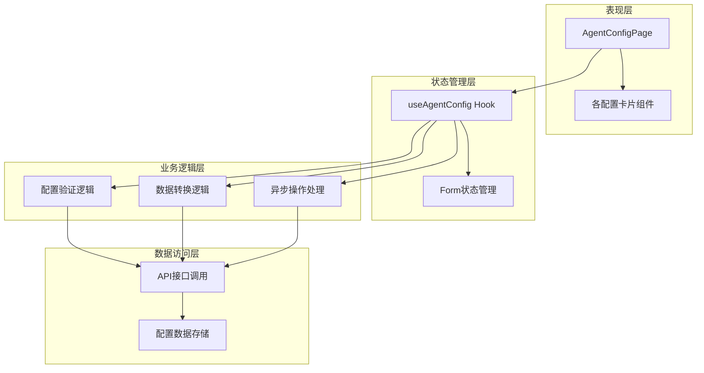
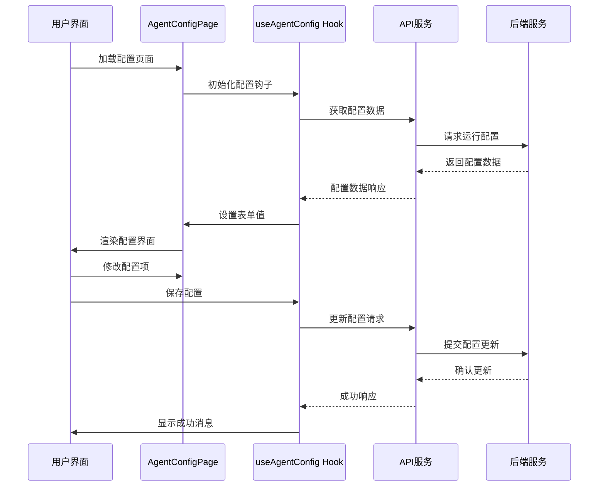
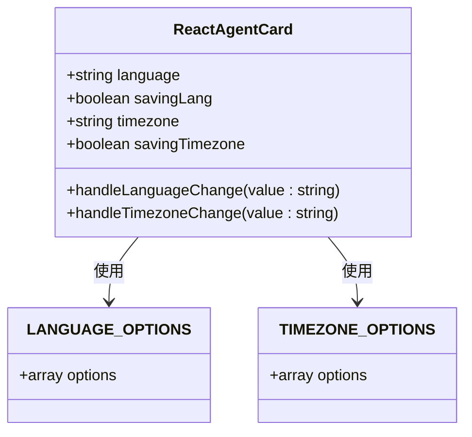
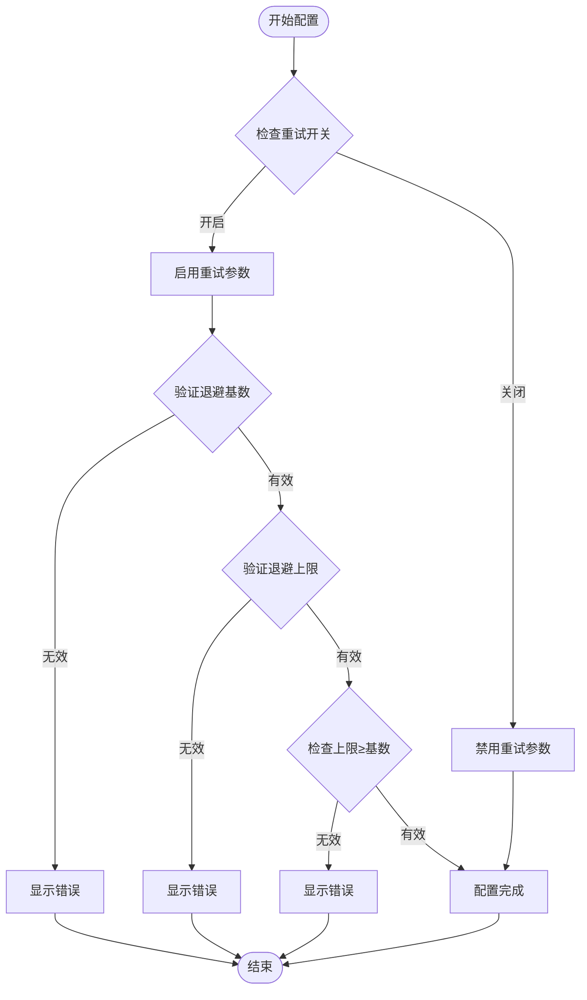
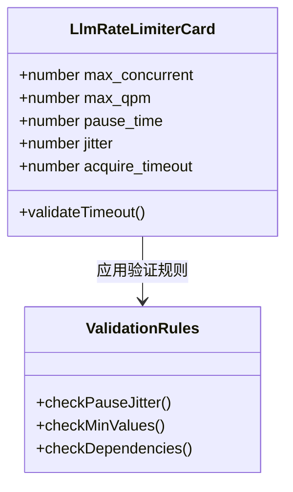
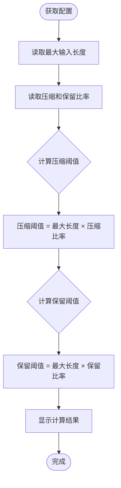
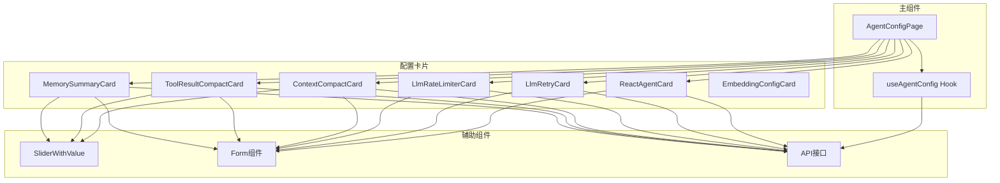

# 控制台配置卡片

<cite>
**本文档引用的文件**
- [console/src/pages/Agent/Config/index.tsx](file://console/src/pages/Agent/Config/index.tsx)
- [console/src/pages/Agent/Config/components/index.ts](file://console/src/pages/Agent/Config/components/index.ts)
- [console/src/pages/Agent/Config/useAgentConfig.tsx](file://console/src/pages/Agent/Config/useAgentConfig.tsx)
- [console/src/pages/Agent/Config/components/ReactAgentCard.tsx](file://console/src/pages/Agent/Config/components/ReactAgentCard.tsx)
- [console/src/pages/Agent/Config/components/LlmRetryCard.tsx](file://console/src/pages/Agent/Config/components/LlmRetryCard.tsx)
- [console/src/pages/Agent/Config/components/LlmRateLimiterCard.tsx](file://console/src/pages/Agent/Config/components/LlmRateLimiterCard.tsx)
- [console/src/pages/Agent/Config/components/ContextCompactCard.tsx](file://console/src/pages/Agent/Config/components/ContextCompactCard.tsx)
- [console/src/pages/Agent/Config/components/ToolResultCompactCard.tsx](file://console/src/pages/Agent/Config/components/ToolResultCompactCard.tsx)
- [console/src/pages/Agent/Config/components/MemorySummaryCard.tsx](file://console/src/pages/Agent/Config/components/MemorySummaryCard.tsx)
- [console/src/pages/Agent/Config/components/EmbeddingConfigCard.tsx](file://console/src/pages/Agent/Config/components/EmbeddingConfigCard.tsx)
- [console/src/pages/Agent/Config/components/SliderWithValue.tsx](file://console/src/pages/Agent/Config/components/SliderWithValue.tsx)
- [console/src/constants/timezone.ts](file://console/src/constants/timezone.ts)
- [console/src/pages/Agent/Config/index.module.less](file://console/src/pages/Agent/Config/index.module.less)
- [console/src/api/types/agents.ts](file://console/src/api/types/agents.ts)
</cite>

## 目录
1. [简介](#简介)
2. [项目结构](#项目结构)
3. [核心组件](#核心组件)
4. [架构概览](#架构概览)
5. [详细组件分析](#详细组件分析)
6. [依赖关系分析](#依赖关系分析)
7. [性能考虑](#性能考虑)
8. [故障排除指南](#故障排除指南)
9. [结论](#结论)

## 简介

控制台配置卡片是Copaw项目中用于管理智能体运行配置的核心界面组件。该系统提供了多个专门的配置卡片，允许用户调整智能体的各种行为参数，包括语言设置、时区配置、LLM重试机制、速率限制、上下文压缩、工具结果压缩、内存摘要和嵌入配置等。

该界面采用响应式设计，支持多语言国际化，并提供了完整的表单验证和错误处理机制。所有配置更改都会通过API实时同步到后端服务。

## 项目结构

控制台配置卡片位于控制台应用的Agent配置页面中，采用模块化组件设计：

**图表来源**
- [console/src/pages/Agent/Config/index.tsx:16-100](file://console/src/pages/Agent/Config/index.tsx#L16-L100)
- [console/src/pages/Agent/Config/components/index.ts:1-10](file://console/src/pages/Agent/Config/components/index.ts#L1-L10)

**章节来源**
- [console/src/pages/Agent/Config/index.tsx:1-103](file://console/src/pages/Agent/Config/index.tsx#L1-L103)
- [console/src/pages/Agent/Config/components/index.ts:1-10](file://console/src/pages/Agent/Config/components/index.ts#L1-L10)

## 核心组件

### 主配置页面组件

主配置页面`AgentConfigPage`作为整个配置系统的入口点，负责协调各个子组件的工作。它使用自定义的`useAgentConfig`钩子来管理状态和数据流。

### 配置钩子系统

`useAgentConfig`钩子提供了完整的配置管理功能，包括：
- 异步加载配置数据
- 表单状态管理
- 保存操作处理
- 错误处理和用户反馈
- 语言和时区的特殊处理逻辑

### 卡片组件体系

系统包含七个主要的配置卡片，每个卡片专注于特定的功能领域：

1. **ReactAgentCard** - 基础智能体配置
2. **LlmRetryCard** - LLM重试机制配置
3. **LlmRateLimiterCard** - LLM速率限制配置
4. **ContextCompactCard** - 上下文压缩配置
5. **ToolResultCompactCard** - 工具结果压缩配置
6. **MemorySummaryCard** - 内存摘要配置
7. **EmbeddingConfigCard** - 嵌入配置

**章节来源**
- [console/src/pages/Agent/Config/useAgentConfig.tsx:7-136](file://console/src/pages/Agent/Config/useAgentConfig.tsx#L7-L136)

## 架构概览

控制台配置卡片采用分层架构设计，确保了良好的可维护性和扩展性：

**图表来源**
- [console/src/pages/Agent/Config/index.tsx:16-100](file://console/src/pages/Agent/Config/index.tsx#L16-L100)
- [console/src/pages/Agent/Config/useAgentConfig.tsx:18-57](file://console/src/pages/Agent/Config/useAgentConfig.tsx#L18-L57)

### 数据流架构

配置数据在系统中的流动过程如下：

**图表来源**
- [console/src/pages/Agent/Config/useAgentConfig.tsx:18-57](file://console/src/pages/Agent/Config/useAgentConfig.tsx#L18-L57)

## 详细组件分析

### ReactAgentCard - 基础智能体配置

ReactAgentCard是智能体配置的基础组件，提供以下核心功能：

#### 语言配置功能
- 支持三种语言：中文、英文、俄文
- 实时语言切换确认机制
- 文件复制通知功能

#### 时区配置功能
- 全球20个主要时区选项
- 搜索过滤功能
- 实时时区更新

#### 内存管理器配置
- ReMeLight内存管理器支持
- 内存管理器重启警告

#### 核心参数配置
- 最大迭代次数（1-∞）
- 最大上下文长度（1000+，1024步进）

**图表来源**
- [console/src/pages/Agent/Config/components/ReactAgentCard.tsx:6-14](file://console/src/pages/Agent/Config/components/ReactAgentCard.tsx#L6-L14)
- [console/src/constants/timezone.ts:1-22](file://console/src/constants/timezone.ts#L1-L22)

**章节来源**
- [console/src/pages/Agent/Config/components/ReactAgentCard.tsx:16-129](file://console/src/pages/Agent/Config/components/ReactAgentCard.tsx#L16-L129)

### LlmRetryCard - LLM重试机制配置

LlmRetryCard专门用于配置LLM调用的重试策略：

#### 重试机制配置
- **重试开关**：启用或禁用自动重试
- **最大重试次数**：1次起，无上限
- **退避基数**：0.1起，建议≥1.0
- **退避上限**：0.5起，必须≥退避基数

#### 依赖关系验证
系统实现了复杂的依赖关系验证，确保配置参数的合理性：
- 当重试功能关闭时，相关参数自动禁用
- 退避上限必须大于等于退避基数
- 所有数值参数都有最小值约束

**图表来源**
- [console/src/pages/Agent/Config/components/LlmRetryCard.tsx:92-103](file://console/src/pages/Agent/Config/components/LlmRetryCard.tsx#L92-L103)

**章节来源**
- [console/src/pages/Agent/Config/components/LlmRetryCard.tsx:9-117](file://console/src/pages/Agent/Config/components/LlmRetryCard.tsx#L9-L117)

### LlmRateLimiterCard - LLM速率限制配置

LlmRateLimiterCard提供全面的LLM调用速率控制功能：

#### 速率限制参数
- **最大并发数**：1起，控制同时进行的LLM调用数量
- **最大QPM**：0起，控制每分钟查询次数
- **暂停时间**：1.0起，控制调用间隔
- **Jitter参数**：0.0起，添加随机抖动避免突发流量
- **获取超时**：10.0起，控制资源获取超时时间

#### 复杂验证规则
系统实现了严格的验证规则：
- 获取超时必须小于暂停时间加Jitter之和
- 所有数值参数都有合理的最小值约束

**图表来源**
- [console/src/pages/Agent/Config/components/LlmRateLimiterCard.tsx:128-141](file://console/src/pages/Agent/Config/components/LlmRateLimiterCard.tsx#L128-L141)

**章节来源**
- [console/src/pages/Agent/Config/components/LlmRateLimiterCard.tsx:9-154](file://console/src/pages/Agent/Config/components/LlmRateLimiterCard.tsx#L9-L154)

### ContextCompactCard - 上下文压缩配置

ContextCompactCard负责智能体上下文的压缩和优化：

#### 压缩算法配置
- **上下文压缩开关**：启用或禁用自动压缩
- **令牌估算除数**：2-5之间的小数，影响令牌计算精度
- **压缩比率**：0.3-0.9之间，控制压缩触发阈值
- **保留比率**：0.05-0.3之间，控制保留内容比例

#### 动态阈值计算
系统根据最大输入长度动态计算压缩和保留阈值：
- 压缩阈值 = 最大输入长度 × 压缩比率
- 保留阈值 = 最大输入长度 × 保留比率

**图表来源**
- [console/src/pages/Agent/Config/components/ContextCompactCard.tsx:24-29](file://console/src/pages/Agent/Config/components/ContextCompactCard.tsx#L24-L29)

**章节来源**
- [console/src/pages/Agent/Config/components/ContextCompactCard.tsx:10-146](file://console/src/pages/Agent/Config/components/ContextCompactCard.tsx#L10-L146)

### ToolResultCompactCard - 工具结果压缩配置

ToolResultCompactCard管理工具执行结果的压缩策略：

#### 压缩参数配置
- **压缩开关**：启用或禁用结果压缩
- **最近N条记录**：1-10之间的滑块选择
- **旧结果阈值**：100字节起，100步进
- **近期结果阈值**：1000字节起，1000步进
- **保留天数**：1-10天

#### 数据完整性验证
系统确保数据完整性：
- 近期阈值必须小于旧阈值
- 所有参数都有合理的默认范围

**章节来源**
- [console/src/pages/Agent/Config/components/ToolResultCompactCard.tsx:6-124](file://console/src/pages/Agent/Config/components/ToolResultCompactCard.tsx#L6-L124)

### MemorySummaryCard - 内存摘要配置

MemorySummaryCard提供智能体记忆系统的摘要功能：

#### 摘要功能配置
- **内存摘要开关**：启用或禁用摘要生成
- **强制内存搜索**：强制执行内存搜索
- **强制最大结果数**：1起，控制搜索结果数量
- **强制最小分数**：0-1之间的滑块
- **启动时重建索引**：应用启动时重建内存索引

**章节来源**
- [console/src/pages/Agent/Config/components/MemorySummaryCard.tsx:6-76](file://console/src/pages/Agent/Config/components/MemorySummaryCard.tsx#L6-L76)

### EmbeddingConfigCard - 嵌入配置

EmbeddingConfigCard管理向量嵌入模型的配置：

#### 嵌入模型配置
- **基础URL**：嵌入服务的基础地址
- **模型名称**：使用的具体模型
- **API密钥**：访问认证密钥
- **维度设置**：1起，256步进
- **缓存配置**：启用/禁用缓存
- **最大缓存大小**：1起
- **最大输入长度**：1024步进
- **最大批次大小**：1起

#### 条件启用逻辑
系统实现了智能的条件启用逻辑：
- 当基础URL和模型名称都存在时，启用相关配置项
- 提供重启警告信息提醒用户重新启动服务

**章节来源**
- [console/src/pages/Agent/Config/components/EmbeddingConfigCard.tsx:12-152](file://console/src/pages/Agent/Config/components/EmbeddingConfigCard.tsx#L12-L152)

### SliderWithValue - 数值滑块组件

SliderWithValue是一个通用的数值滑块组件，提供可视化数值输入：

#### 组件特性
- **数值格式化**：整数显示为整数，小数保留两位
- **滑块交互**：支持拖拽和点击选择
- **值显示**：右侧实时显示当前数值
- **自适应宽度**：根据内容自动调整布局

**章节来源**
- [console/src/pages/Agent/Config/components/SliderWithValue.tsx:12-45](file://console/src/pages/Agent/Config/components/SliderWithValue.tsx#L12-L45)

## 依赖关系分析

### 组件间依赖关系

**图表来源**
- [console/src/pages/Agent/Config/index.tsx:16-100](file://console/src/pages/Agent/Config/index.tsx#L16-L100)
- [console/src/pages/Agent/Config/components/index.ts:1-10](file://console/src/pages/Agent/Config/components/index.ts#L1-L10)

### 外部依赖

系统依赖于以下外部库和框架：
- **@agentscope-ai/design**：UI组件库
- **react-i18next**：国际化支持
- **Ant Design**：基础UI组件
- **Less**：样式预处理器

**章节来源**
- [console/src/pages/Agent/Config/index.tsx:1-14](file://console/src/pages/Agent/Config/index.tsx#L1-L14)

## 性能考虑

### 异步操作优化

系统采用了多种异步操作优化策略：

1. **并行数据加载**：使用Promise.all并行获取配置数据
2. **防抖处理**：对频繁的配置变更进行防抖处理
3. **增量更新**：只更新发生变化的配置项

### 内存管理

- **组件卸载清理**：自动清理事件监听器和定时器
- **状态重置**：支持一键重置到初始状态
- **错误边界**：提供完整的错误处理和恢复机制

### 网络优化

- **请求缓存**：对配置数据进行本地缓存
- **批量更新**：支持批量配置更新操作
- **连接复用**：复用HTTP连接减少开销

## 故障排除指南

### 常见问题及解决方案

#### 配置加载失败
**症状**：页面显示加载错误信息
**原因**：网络连接问题或API服务不可用
**解决方案**：
1. 检查网络连接状态
2. 刷新页面重试
3. 查看浏览器开发者工具中的错误信息

#### 配置保存失败
**症状**：保存按钮显示错误状态
**原因**：配置验证失败或服务器错误
**解决方案**：
1. 检查必填字段是否完整
2. 验证数值范围是否正确
3. 查看具体的错误提示信息

#### 时区选择异常
**症状**：时区列表显示不完整
**原因**：时区数据加载失败
**解决方案**：
1. 检查时区数据源
2. 刷新页面重新加载
3. 确认用户时区权限

#### 重试配置验证失败
**症状**：退避上限或重试次数显示红色
**原因**：配置参数违反验证规则
**解决方案**：
1. 确保退避上限≥退避基数
2. 检查重试次数的合理范围
3. 参考具体的错误提示信息

**章节来源**
- [console/src/pages/Agent/Config/useAgentConfig.tsx:30-36](file://console/src/pages/Agent/Config/useAgentConfig.tsx#L30-L36)
- [console/src/pages/Agent/Config/components/LlmRetryCard.tsx:92-103](file://console/src/pages/Agent/Config/components/LlmRetryCard.tsx#L92-L103)

## 结论

控制台配置卡片系统是一个功能完整、设计精良的配置管理界面。它通过模块化的组件设计、完善的表单验证、智能的依赖关系管理和丰富的用户体验，为用户提供了一个强大而易用的配置平台。

### 主要优势

1. **模块化设计**：每个配置卡片职责单一，便于维护和扩展
2. **智能验证**：复杂的依赖关系验证确保配置的合理性
3. **用户体验**：直观的界面设计和实时反馈机制
4. **国际化支持**：完整的多语言支持
5. **错误处理**：完善的错误处理和恢复机制

### 技术亮点

- 响应式表单设计
- 异步状态管理
- 条件启用逻辑
- 动态阈值计算
- 完整的验证规则

该系统为Copaw项目的智能体配置管理提供了坚实的技术基础，具有良好的可扩展性和维护性。