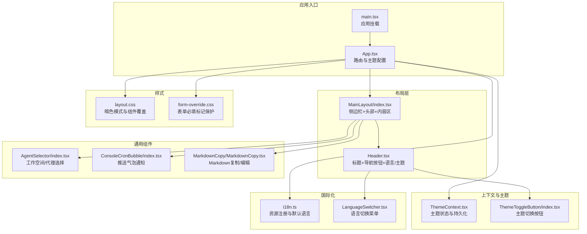
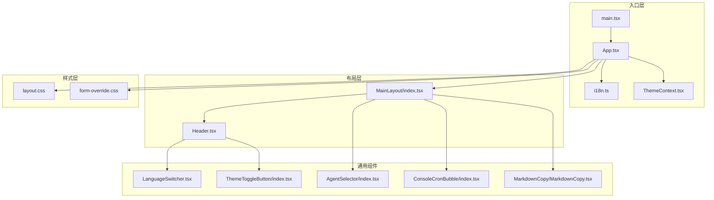
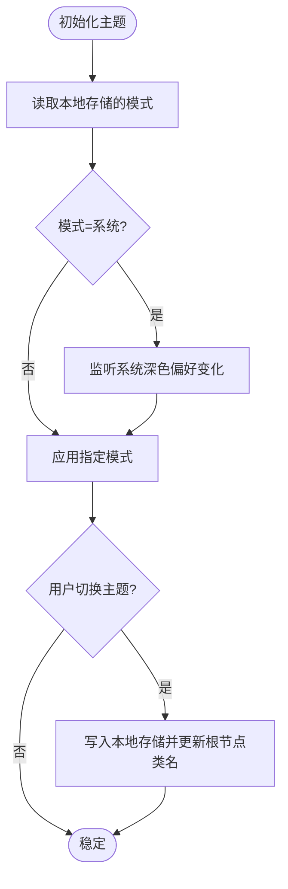
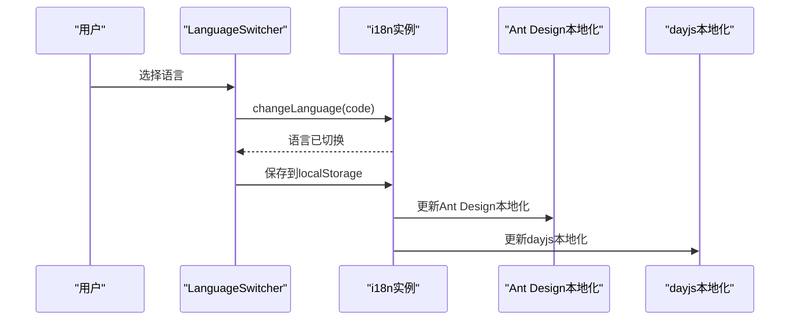
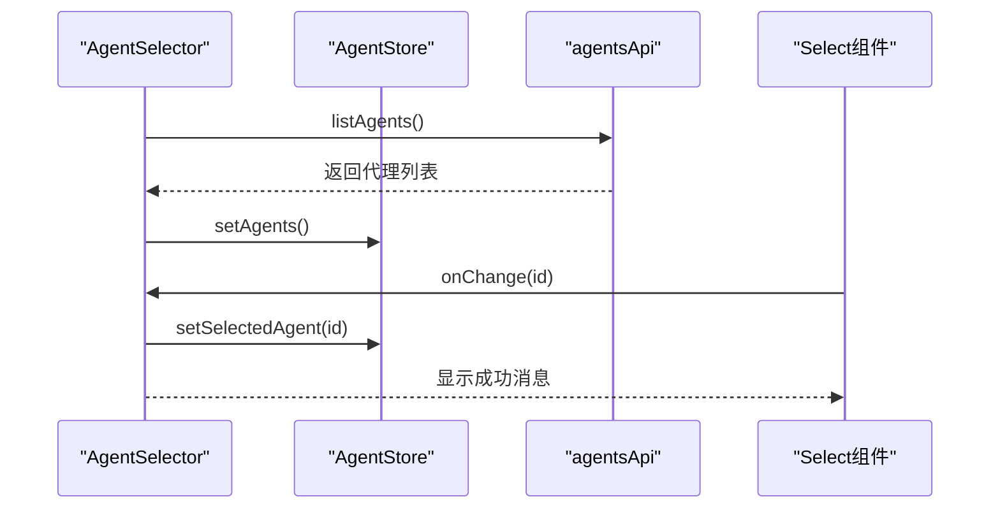
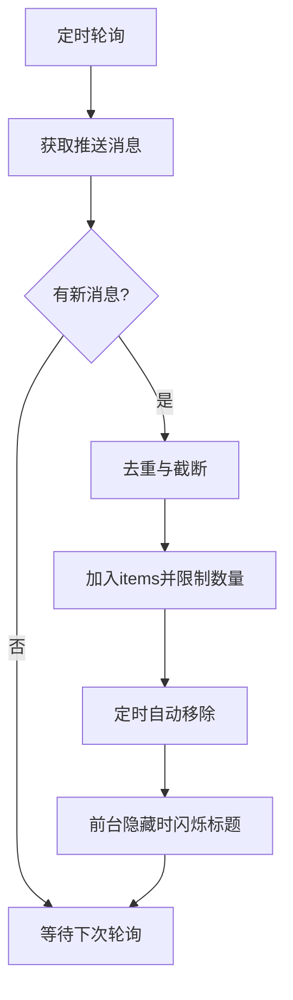
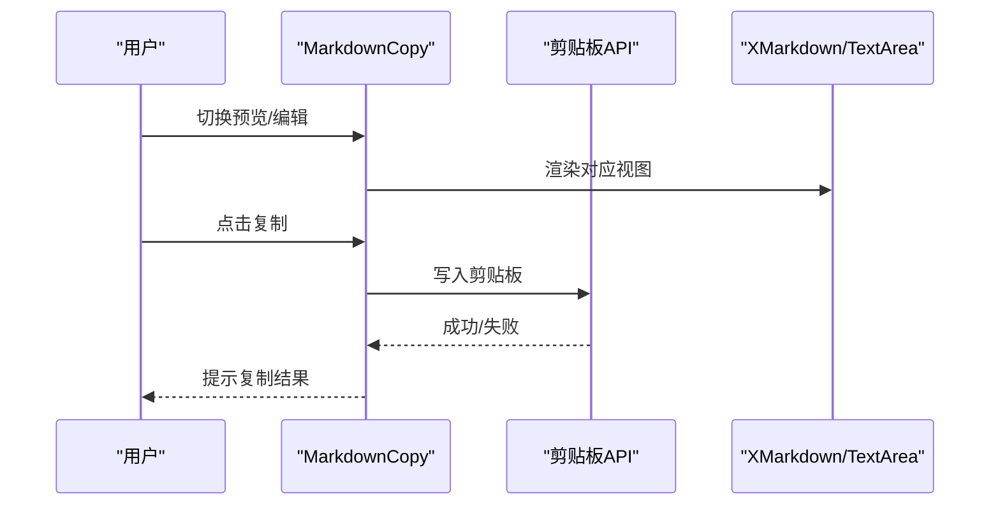
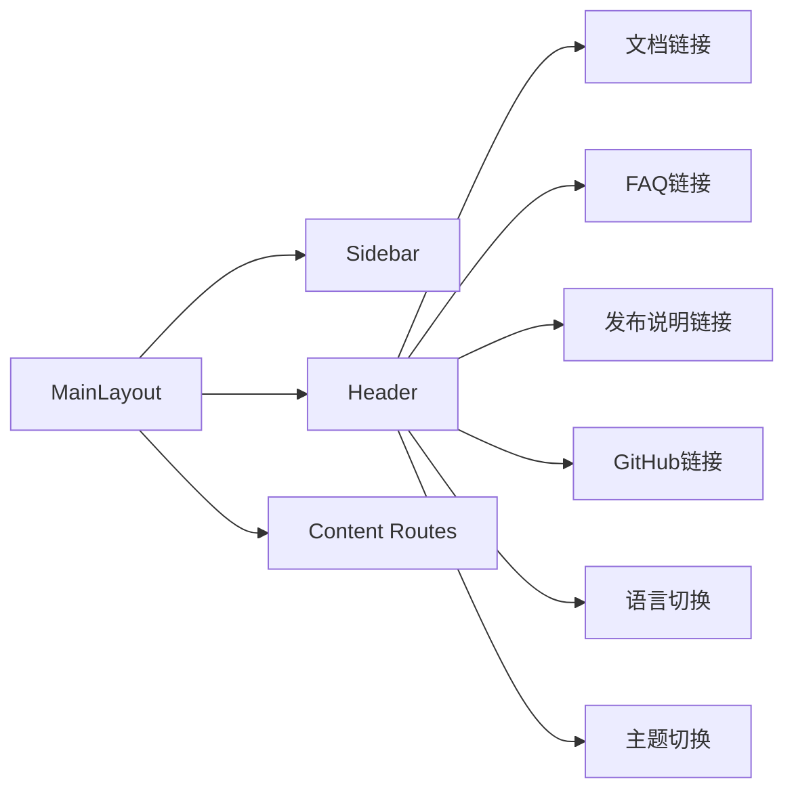
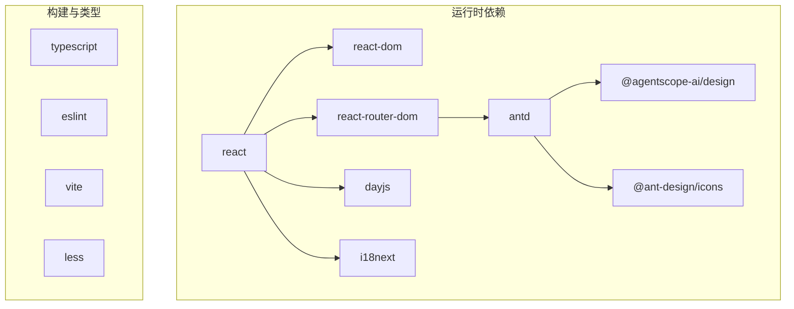

# 组件库与UI系统

<cite>
**本文引用的文件**
- [console/src/App.tsx](file://console/src/App.tsx)
- [console/src/main.tsx](file://console/src/main.tsx)
- [console/src/layouts/MainLayout/index.tsx](file://console/src/layouts/MainLayout/index.tsx)
- [console/src/layouts/Header.tsx](file://console/src/layouts/Header.tsx)
- [console/src/layouts/constants.ts](file://console/src/layouts/constants.ts)
- [console/src/contexts/ThemeContext.tsx](file://console/src/contexts/ThemeContext.tsx)
- [console/src/components/ThemeToggleButton/index.tsx](file://console/src/components/ThemeToggleButton/index.tsx)
- [console/src/components/LanguageSwitcher.tsx](file://console/src/components/LanguageSwitcher.tsx)
- [console/src/components/AgentSelector/index.tsx](file://console/src/components/AgentSelector/index.tsx)
- [console/src/components/ConsoleCronBubble/index.tsx](file://console/src/components/ConsoleCronBubble/index.tsx)
- [console/src/components/MarkdownCopy/MarkdownCopy.tsx](file://console/src/components/MarkdownCopy/MarkdownCopy.tsx)
- [console/src/styles/layout.css](file://console/src/styles/layout.css)
- [console/src/styles/form-override.css](file://console/src/styles/form-override.css)
- [console/src/i18n.ts](file://console/src/i18n.ts)
- [console/package.json](file://console/package.json)
</cite>

## 目录
1. [引言](#引言)
2. [项目结构](#项目结构)
3. [核心组件](#核心组件)
4. [架构总览](#架构总览)
5. [组件详解](#组件详解)
6. [依赖关系分析](#依赖关系分析)
7. [性能考量](#性能考量)
8. [故障排查指南](#故障排查指南)
9. [结论](#结论)
10. [附录](#附录)

## 引言
本文件面向开发者与产品团队，系统性梳理 CoPaw 控制台前端的组件库与 UI 系统，覆盖设计原则、组件分类与复用模式、布局与页面组织、样式架构与主题系统、响应式与无障碍设计、国际化与多语言、状态管理与事件处理最佳实践，并提供可操作的使用示例与定制化建议。目标是帮助团队在保持一致性的前提下高效扩展与维护 UI。

## 项目结构
控制台前端采用 React + Vite 架构，以功能域驱动的目录组织方式划分页面、布局、组件与样式资源。核心入口负责路由、主题与国际化初始化；主布局负责导航与内容区编排；主题与语言切换器作为通用交互组件；大量页面级组件围绕业务场景构建；样式通过全局 CSS 与模块化样式协同，形成统一的主题与视觉基线。

**图表来源**
- [console/src/App.tsx:106-160](file://console/src/App.tsx#L106-L160)
- [console/src/main.tsx:1-31](file://console/src/main.tsx#L1-L31)
- [console/src/layouts/MainLayout/index.tsx:45-85](file://console/src/layouts/MainLayout/index.tsx#L45-L85)
- [console/src/layouts/Header.tsx:28-90](file://console/src/layouts/Header.tsx#L28-L90)
- [console/src/contexts/ThemeContext.tsx:51-100](file://console/src/contexts/ThemeContext.tsx#L51-L100)
- [console/src/components/ThemeToggleButton/index.tsx:11-28](file://console/src/components/ThemeToggleButton/index.tsx#L11-L28)
- [console/src/components/LanguageSwitcher.tsx:6-58](file://console/src/components/LanguageSwitcher.tsx#L6-L58)
- [console/src/components/AgentSelector/index.tsx:9-100](file://console/src/components/AgentSelector/index.tsx#L9-L100)
- [console/src/components/ConsoleCronBubble/index.tsx:17-131](file://console/src/components/ConsoleCronBubble/index.tsx#L17-L131)
- [console/src/components/MarkdownCopy/MarkdownCopy.tsx:43-194](file://console/src/components/MarkdownCopy/MarkdownCopy.tsx#L43-L194)
- [console/src/styles/layout.css:1-761](file://console/src/styles/layout.css#L1-L761)
- [console/src/styles/form-override.css:1-16](file://console/src/styles/form-override.css#L1-L16)

**章节来源**
- [console/src/App.tsx:1-171](file://console/src/App.tsx#L1-L171)
- [console/src/main.tsx:1-31](file://console/src/main.tsx#L1-L31)
- [console/src/layouts/MainLayout/index.tsx:1-86](file://console/src/layouts/MainLayout/index.tsx#L1-L86)
- [console/src/layouts/Header.tsx:1-91](file://console/src/layouts/Header.tsx#L1-L91)
- [console/src/contexts/ThemeContext.tsx:1-105](file://console/src/contexts/ThemeContext.tsx#L1-L105)
- [console/src/components/ThemeToggleButton/index.tsx:1-29](file://console/src/components/ThemeToggleButton/index.tsx#L1-L29)
- [console/src/components/LanguageSwitcher.tsx:1-59](file://console/src/components/LanguageSwitcher.tsx#L1-L59)
- [console/src/components/AgentSelector/index.tsx:1-101](file://console/src/components/AgentSelector/index.tsx#L1-L101)
- [console/src/components/ConsoleCronBubble/index.tsx:1-132](file://console/src/components/ConsoleCronBubble/index.tsx#L1-L132)
- [console/src/components/MarkdownCopy/MarkdownCopy.tsx:1-195](file://console/src/components/MarkdownCopy/MarkdownCopy.tsx#L1-L195)
- [console/src/styles/layout.css:1-761](file://console/src/styles/layout.css#L1-L761)
- [console/src/styles/form-override.css:1-16](file://console/src/styles/form-override.css#L1-L16)
- [console/src/i18n.ts:1-32](file://console/src/i18n.ts#L1-L32)
- [console/src/layouts/constants.ts:1-186](file://console/src/layouts/constants.ts#L1-L186)

## 核心组件
- 应用壳与路由：在应用入口集中配置国际化、主题算法、路由前缀与鉴权守卫，确保全局一致性。
- 主布局：统一承载侧边栏、头部工具条与页面内容区，路由按路径映射到具体页面组件。
- 主题系统：提供浅色/深色/系统三态，持久化用户偏好，动态切换 HTML 根节点类名以驱动 CSS 变量覆盖。
- 国际化：集中注册多语言资源，监听语言变更并同步 Ant Design 本地化与 dayjs 本地化。
- 通用组件：语言切换器、主题切换按钮、代理选择器、推送气泡、Markdown 编辑/预览与复制。

**章节来源**
- [console/src/App.tsx:106-160](file://console/src/App.tsx#L106-L160)
- [console/src/layouts/MainLayout/index.tsx:45-85](file://console/src/layouts/MainLayout/index.tsx#L45-L85)
- [console/src/contexts/ThemeContext.tsx:51-100](file://console/src/contexts/ThemeContext.tsx#L51-L100)
- [console/src/i18n.ts:1-32](file://console/src/i18n.ts#L1-L32)

## 架构总览
应用采用“入口配置 + 布局编排 + 通用组件 + 样式覆盖”的分层架构。主题与国际化在入口层完成初始化，布局层负责导航与页面切换，通用组件提供高频交互能力，样式层通过全局 CSS 与模块化样式实现主题与组件覆盖。

**图表来源**
- [console/src/App.tsx:106-160](file://console/src/App.tsx#L106-L160)
- [console/src/main.tsx:1-31](file://console/src/main.tsx#L1-L31)
- [console/src/i18n.ts:1-32](file://console/src/i18n.ts#L1-L32)
- [console/src/contexts/ThemeContext.tsx:51-100](file://console/src/contexts/ThemeContext.tsx#L51-L100)
- [console/src/layouts/MainLayout/index.tsx:45-85](file://console/src/layouts/MainLayout/index.tsx#L45-L85)
- [console/src/layouts/Header.tsx:28-90](file://console/src/layouts/Header.tsx#L28-L90)
- [console/src/components/LanguageSwitcher.tsx:6-58](file://console/src/components/LanguageSwitcher.tsx#L6-L58)
- [console/src/components/ThemeToggleButton/index.tsx:11-28](file://console/src/components/ThemeToggleButton/index.tsx#L11-L28)
- [console/src/components/AgentSelector/index.tsx:9-100](file://console/src/components/AgentSelector/index.tsx#L9-L100)
- [console/src/components/ConsoleCronBubble/index.tsx:17-131](file://console/src/components/ConsoleCronBubble/index.tsx#L17-L131)
- [console/src/components/MarkdownCopy/MarkdownCopy.tsx:43-194](file://console/src/components/MarkdownCopy/MarkdownCopy.tsx#L43-L194)
- [console/src/styles/layout.css:1-761](file://console/src/styles/layout.css#L1-L761)
- [console/src/styles/form-override.css:1-16](file://console/src/styles/form-override.css#L1-L16)

## 组件详解

### 主题系统与样式架构
- 主题模式：支持 light/dark/system，持久化存储于本地，系统模式根据媒体查询实时切换。
- 暗色模式覆盖：通过在 HTML 根节点添加 dark-mode 类，全局 CSS 覆盖 Ant Design 与自定义组件的背景、边框、文本颜色等。
- 表单必填标记保护：防止第三方组件样式覆盖导致的红色星号丢失。
- 主题算法：基于 Ant Design 的算法切换，配合自定义前缀与主题变量覆盖。

**图表来源**
- [console/src/contexts/ThemeContext.tsx:51-100](file://console/src/contexts/ThemeContext.tsx#L51-L100)
- [console/src/styles/layout.css:9-12](file://console/src/styles/layout.css#L9-L12)

**章节来源**
- [console/src/contexts/ThemeContext.tsx:1-105](file://console/src/contexts/ThemeContext.tsx#L1-L105)
- [console/src/styles/layout.css:1-761](file://console/src/styles/layout.css#L1-L761)
- [console/src/styles/form-override.css:1-16](file://console/src/styles/form-override.css#L1-L16)
- [console/src/App.tsx:134-144](file://console/src/App.tsx#L134-L144)

### 国际化与多语言
- 资源注册：集中注册英文、俄文、中文、日文翻译资源，设置默认语言与回退语言。
- 语言切换：提供下拉菜单切换语言，同时更新 dayjs 与 Ant Design 本地化。
- 文档与链接：根据语言选择官网文档、FAQ 与发布说明链接。

**图表来源**
- [console/src/components/LanguageSwitcher.tsx:6-58](file://console/src/components/LanguageSwitcher.tsx#L6-L58)
- [console/src/i18n.ts:1-32](file://console/src/i18n.ts#L1-L32)
- [console/src/App.tsx:115-129](file://console/src/App.tsx#L115-L129)

**章节来源**
- [console/src/components/LanguageSwitcher.tsx:1-59](file://console/src/components/LanguageSwitcher.tsx#L1-L59)
- [console/src/i18n.ts:1-32](file://console/src/i18n.ts#L1-L32)
- [console/src/layouts/constants.ts:59-69](file://console/src/layouts/constants.ts#L59-L69)

### 通用组件

#### 代理选择器（AgentSelector）
- 功能：加载可用代理列表，展示名称、描述与 ID，支持选中态与数量徽标。
- 数据流：首次挂载触发加载，变更时更新选中值并提示成功消息。
- 视觉：自定义 Option 布局，包含图标、名称、描述与选中指示器。

**图表来源**
- [console/src/components/AgentSelector/index.tsx:9-100](file://console/src/components/AgentSelector/index.tsx#L9-L100)

**章节来源**
- [console/src/components/AgentSelector/index.tsx:1-101](file://console/src/components/AgentSelector/index.tsx#L1-L101)

#### 推送气泡（ConsoleCronBubble）
- 功能：轮询获取推送消息，限制最大可见数与每轮新增数，自动消失，前台隐藏时闪烁标题。
- 状态：内部维护 items 集合、seenId 集合与定时器，保证内存与性能可控。
- 无障碍：区域与关闭按钮提供可访问标签。

**图表来源**
- [console/src/components/ConsoleCronBubble/index.tsx:17-131](file://console/src/components/ConsoleCronBubble/index.tsx#L17-L131)

**章节来源**
- [console/src/components/ConsoleCronBubble/index.tsx:1-132](file://console/src/components/ConsoleCronBubble/index.tsx#L1-L132)

#### Markdown 复制（MarkdownCopy）
- 功能：支持 Markdown 预览与富文本编辑，一键复制，可配置复制按钮、查看器与文本域属性。
- 交互：预览/编辑切换、内容变更回调、安全上下文下的剪贴板 API。
- 可访问：提供必要的 ARIA 属性与语义化标签。

**图表来源**
- [console/src/components/MarkdownCopy/MarkdownCopy.tsx:43-194](file://console/src/components/MarkdownCopy/MarkdownCopy.tsx#L43-L194)

**章节来源**
- [console/src/components/MarkdownCopy/MarkdownCopy.tsx:1-195](file://console/src/components/MarkdownCopy/MarkdownCopy.tsx#L1-L195)

### 页面与布局
- 主布局：统一的侧边栏、头部与内容区，路由按路径映射到各页面组件。
- 头部：包含当前页面标题、文档/FAQ/发布说明/仓库链接、语言切换与主题切换。
- 常量：导航键到路径与标签的映射，以及文档/FAQ/发布说明链接生成逻辑。

**图表来源**
- [console/src/layouts/MainLayout/index.tsx:45-85](file://console/src/layouts/MainLayout/index.tsx#L45-L85)
- [console/src/layouts/Header.tsx:28-90](file://console/src/layouts/Header.tsx#L28-L90)
- [console/src/layouts/constants.ts:20-55](file://console/src/layouts/constants.ts#L20-L55)

**章节来源**
- [console/src/layouts/MainLayout/index.tsx:1-86](file://console/src/layouts/MainLayout/index.tsx#L1-L86)
- [console/src/layouts/Header.tsx:1-91](file://console/src/layouts/Header.tsx#L1-L91)
- [console/src/layouts/constants.ts:1-186](file://console/src/layouts/constants.ts#L1-L186)

## 依赖关系分析
- 组件依赖：通用组件依赖 Ant Design、@agentscope-ai/design、Ant Design Icons、dayjs、i18next 等；页面组件依赖路由与状态管理。
- 样式依赖：全局样式覆盖 Ant Design 与自定义组件；模块化样式用于局部组件。
- 运行时依赖：React 生态、Vite 构建、TypeScript 类型检查与 ESLint 规范。

**图表来源**
- [console/package.json:18-57](file://console/package.json#L18-L57)

**章节来源**
- [console/package.json:1-60](file://console/package.json#L1-L60)

## 性能考量
- 主题切换：仅切换 HTML 根节点类名与主题算法，避免全量重绘。
- 消息轮询：固定轮询间隔与最大可见数，限制内存占用；自动消失减少 DOM 节点数量。
- 样式覆盖：通过全局 CSS 与模块化样式分离，减少不必要的样式计算。
- 国际化：资源一次性注册，语言切换仅更新本地化适配，避免重复加载。

[本节为通用指导，无需特定文件引用]

## 故障排查指南
- 主题不生效：确认 HTML 根节点是否正确添加/移除 dark-mode 类，检查主题算法与前缀配置。
- 国际化未更新：检查语言切换回调是否调用 changeLanguage 并更新 Ant Design 与 dayjs 本地化。
- 代理选择器无数据：确认首次加载是否触发，网络请求是否返回有效数据，错误时是否有提示。
- 推送气泡不出现：检查轮询定时器是否启动、消息接口是否返回、去重集合是否溢出清理。
- 复制失败：确认是否在安全上下文（HTTPS），降级使用临时 textarea 方案。

**章节来源**
- [console/src/contexts/ThemeContext.tsx:57-65](file://console/src/contexts/ThemeContext.tsx#L57-L65)
- [console/src/components/LanguageSwitcher.tsx:11-14](file://console/src/components/LanguageSwitcher.tsx#L11-L14)
- [console/src/components/AgentSelector/index.tsx:19-30](file://console/src/components/AgentSelector/index.tsx#L19-L30)
- [console/src/components/ConsoleCronBubble/index.tsx:28-62](file://console/src/components/ConsoleCronBubble/index.tsx#L28-L62)
- [console/src/components/MarkdownCopy/MarkdownCopy.tsx:75-109](file://console/src/components/MarkdownCopy/MarkdownCopy.tsx#L75-L109)

## 结论
该 UI 系统以清晰的分层架构与统一的主题、国际化与样式策略为基础，结合高复用的通用组件与严格的依赖管理，实现了良好的可维护性与扩展性。遵循本文的设计原则与最佳实践，可在保证一致性的同时快速迭代业务页面与组件能力。

[本节为总结，无需特定文件引用]

## 附录

### 组件分类与复用模式
- 布局组件：MainLayout、Header、Sidebar（页面级）
- 业务组件：AgentSelector、ConsoleCronBubble、MarkdownCopy（跨页面复用）
- 通用组件：LanguageSwitcher、ThemeToggleButton（跨页面复用）

### 样式与主题实现要点
- 使用 HTML 根节点类名驱动暗色模式，覆盖 Ant Design 与自定义组件。
- 通过模块化样式与全局 CSS 协同，避免样式冲突。
- 表单必填标记保护，确保第三方组件不破坏视觉一致性。

### 国际化与无障碍
- 国际化：集中注册资源，切换语言时同步 Ant Design 与 dayjs。
- 无障碍：为交互元素提供 aria-label 与 region 标注，提升可访问性。

### 开发规范与扩展指南
- 新增页面：在 MainLayout 中注册路由与侧边栏项，遵循 KEY_TO_PATH 与 KEY_TO_LABEL。
- 新增通用组件：优先考虑模块化样式与可配置属性，提供必要的可访问性标签。
- 主题扩展：在 ThemeContext 中扩展模式或算法，确保全局样式覆盖完备。
- 样式扩展：在 layout.css 中补充覆盖规则，避免影响第三方组件。

**章节来源**
- [console/src/layouts/MainLayout/index.tsx:26-43](file://console/src/layouts/MainLayout/index.tsx#L26-L43)
- [console/src/layouts/constants.ts:20-55](file://console/src/layouts/constants.ts#L20-L55)
- [console/src/contexts/ThemeContext.tsx:51-100](file://console/src/contexts/ThemeContext.tsx#L51-L100)
- [console/src/styles/layout.css:1-761](file://console/src/styles/layout.css#L1-L761)
- [console/src/i18n.ts:1-32](file://console/src/i18n.ts#L1-L32)