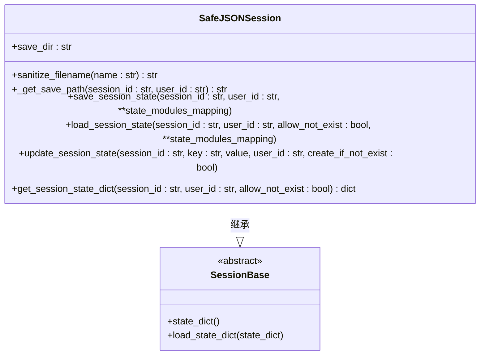
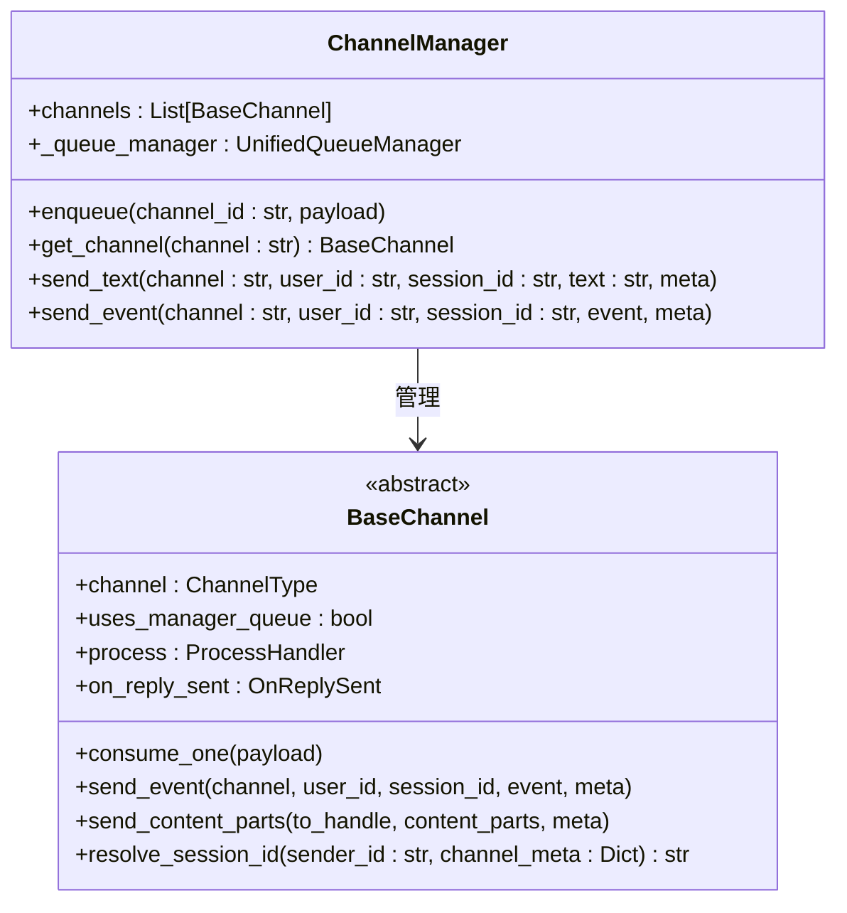
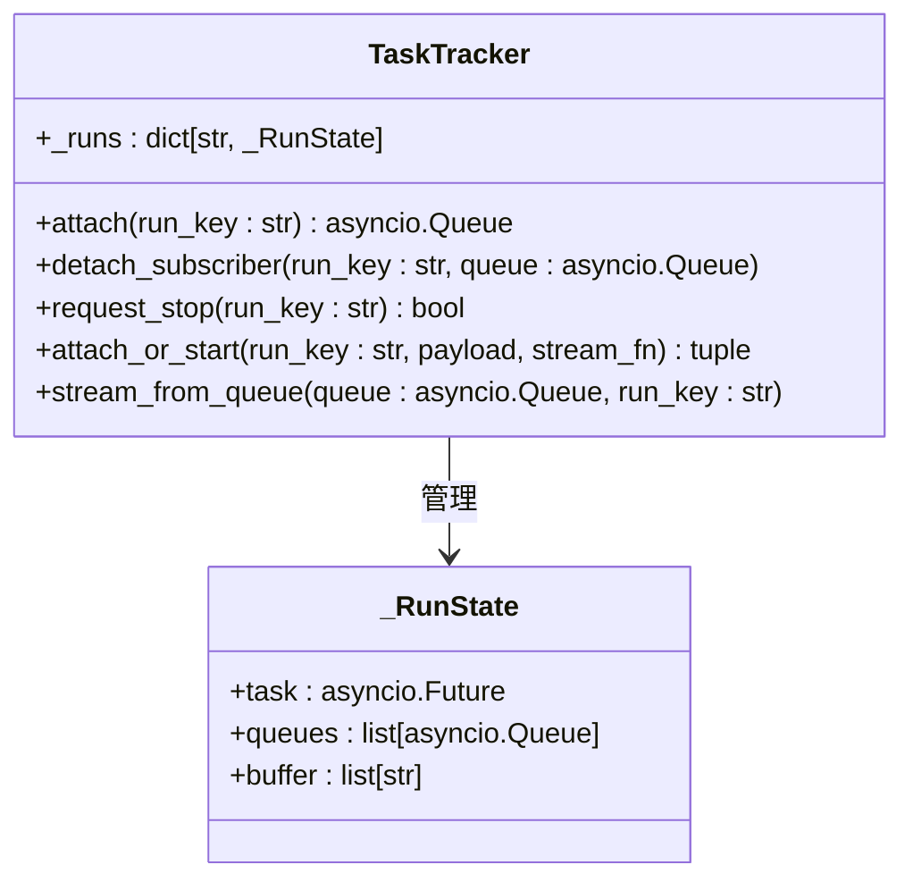
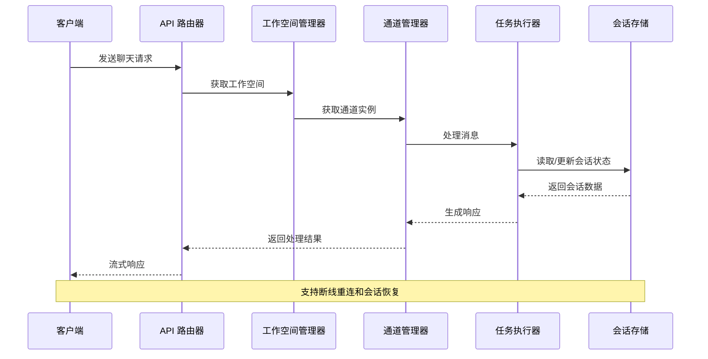
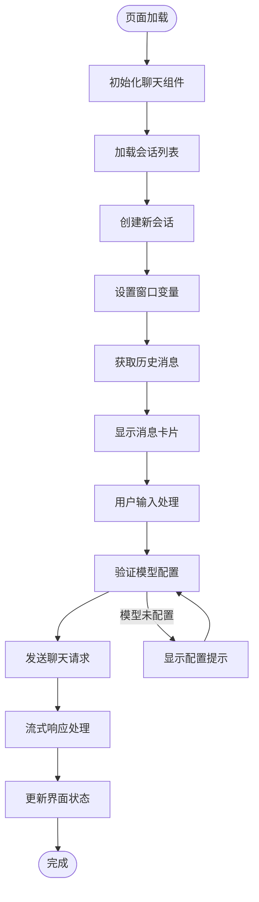
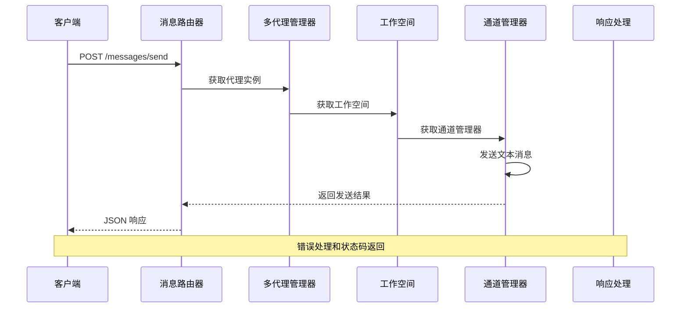
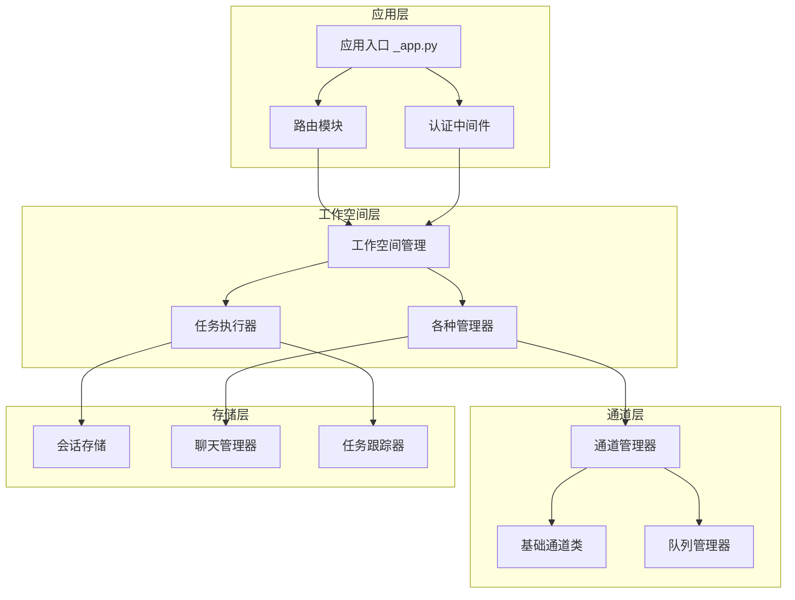

# 聊天会话管理

<cite>
**本文档引用的文件**
- [src/copaw/app/runner/session.py](file://src/copaw/app/runner/session.py)
- [src/copaw/app/routers/messages.py](file://src/copaw/app/routers/messages.py)
- [console/src/pages/Chat/index.tsx](file://console/src/pages/Chat/index.tsx)
- [console/src/pages/Chat/sessionApi/index.ts](file://console/src/pages/Chat/sessionApi/index.ts)
- [src/copaw/app/channels/base.py](file://src/copaw/app/channels/base.py)
- [src/copaw/app/channels/manager.py](file://src/copaw/app/channels/manager.py)
- [src/copaw/app/routers/console.py](file://src/copaw/app/routers/console.py)
- [src/copaw/app/runner/manager.py](file://src/copaw/app/runner/manager.py)
- [src/copaw/app/workspace/workspace.py](file://src/copaw/app/workspace/workspace.py)
- [src/copaw/app/runner/task_tracker.py](file://src/copaw/app/runner/task_tracker.py)
- [src/copaw/app/channels/unified_queue_manager.py](file://src/copaw/app/channels/unified_queue_manager.py)
- [src/copaw/app/_app.py](file://src/copaw/app/_app.py)
- [console/src/api/modules/chat.ts](file://console/src/api/modules/chat.ts)
</cite>

## 目录
1. [简介](#简介)
2. [项目结构](#项目结构)
3. [核心组件](#核心组件)
4. [架构概览](#架构概览)
5. [详细组件分析](#详细组件分析)
6. [依赖关系分析](#依赖关系分析)
7. [性能考虑](#性能考虑)
8. [故障排除指南](#故障排除指南)
9. [结论](#结论)

## 简介

CoPaw 是一个基于 AgentScope Runtime 的多通道聊天助手系统，支持多种即时通讯平台（如 DingTalk、Feishu、QQ、Discord、iMessage 等）。该系统的核心功能是提供统一的聊天会话管理，包括会话状态持久化、多通道消息路由、实时流式响应等。

系统采用前后端分离架构：前端使用 React 和 @agentscope-ai/chat 组件库构建聊天界面，后端基于 FastAPI 提供 RESTful API 和服务器推送事件（SSE）服务。通过统一的会话管理系统，用户可以在不同的聊天渠道之间无缝切换，同时保持会话状态的一致性。

## 项目结构

CoPaw 项目的整体架构分为三个主要层次：

```mermaid
graph TB
subgraph "前端层"
UI[React 前端界面]
ChatUI[@agentscope-ai/chat 组件库]
SessionAPI[会话 API 封装]
end
subgraph "应用层"
FastAPI[FastAPI 应用]
Routers[路由处理器]
Middleware[中间件]
end
subgraph "运行时层"
Workspace[工作空间管理]
Runner[任务执行器]
ChannelManager[通道管理器]
TaskTracker[任务跟踪器]
end
subgraph "基础设施层"
SessionStorage[安全 JSON 会话存储]
QueueManager[统一队列管理]
ChatManager[聊天管理器]
end
UI --> ChatUI
ChatUI --> SessionAPI
SessionAPI --> FastAPI
FastAPI --> Routers
FastAPI --> Middleware
Middleware --> Workspace
Workspace --> Runner
Workspace --> ChannelManager
Workspace --> TaskTracker
Runner --> SessionStorage
ChannelManager --> QueueManager
TaskTracker --> ChatManager
```

**图表来源**
- [src/copaw/app/_app.py:156-268](file://src/copaw/app/_app.py#L156-L268)
- [src/copaw/app/workspace/workspace.py:47-130](file://src/copaw/app/workspace/workspace.py#L47-L130)

**章节来源**
- [src/copaw/app/_app.py:156-268](file://src/copaw/app/_app.py#L156-L268)
- [src/copaw/app/workspace/workspace.py:47-130](file://src/copaw/app/workspace/workspace.py#L47-L130)

## 核心组件

### 会话状态管理

系统实现了安全的 JSON 会话存储机制，确保在不同操作系统（Windows、macOS、Linux）上的文件名兼容性。



**图表来源**
- [src/copaw/app/runner/session.py:37-237](file://src/copaw/app/runner/session.py#L37-L237)

### 多通道消息路由

系统支持多种即时通讯渠道的消息处理和路由，每个渠道都有特定的处理逻辑和配置选项。



**图表来源**
- [src/copaw/app/channels/base.py:70-800](file://src/copaw/app/channels/base.py#L70-L800)
- [src/copaw/app/channels/manager.py:68-711](file://src/copaw/app/channels/manager.py#L68-L711)

### 实时任务跟踪

系统实现了基于 asyncio 的任务跟踪机制，支持流式响应、断线重连和多订阅者模式。



**图表来源**
- [src/copaw/app/runner/task_tracker.py:30-231](file://src/copaw/app/runner/task_tracker.py#L30-L231)

**章节来源**
- [src/copaw/app/runner/session.py:37-237](file://src/copaw/app/runner/session.py#L37-L237)
- [src/copaw/app/channels/base.py:70-800](file://src/copaw/app/channels/base.py#L70-L800)
- [src/copaw/app/runner/task_tracker.py:30-231](file://src/copaw/app/runner/task_tracker.py#L30-L231)

## 架构概览

CoPaw 的整体架构采用分层设计，从底层的会话存储到顶层的用户界面，形成了完整的聊天会话管理体系。



**图表来源**
- [src/copaw/app/routers/console.py:75-151](file://src/copaw/app/routers/console.py#L75-L151)
- [src/copaw/app/workspace/workspace.py:322-389](file://src/copaw/app/workspace/workspace.py#L322-L389)

系统的核心流程包括：

1. **请求接收**：前端通过 API 路由器发送聊天请求
2. **工作空间解析**：根据请求头中的代理标识获取对应的工作空间
3. **通道处理**：通道管理器根据目标通道类型处理消息
4. **会话状态管理**：任务执行器与会话存储交互，维护对话历史
5. **响应返回**：通过服务器推送事件（SSE）向客户端流式传输响应

**章节来源**
- [src/copaw/app/routers/console.py:75-151](file://src/copaw/app/routers/console.py#L75-L151)
- [src/copaw/app/workspace/workspace.py:322-389](file://src/copaw/app/workspace/workspace.py#L322-L389)

## 详细组件分析

### 前端聊天界面

前端使用 @agentscope-ai/chat 组件库构建了现代化的聊天界面，支持多模态内容展示和实时交互。



**图表来源**
- [console/src/pages/Chat/index.tsx:259-703](file://console/src/pages/Chat/index.tsx#L259-L703)
- [console/src/pages/Chat/sessionApi/index.ts:475-504](file://console/src/pages/Chat/sessionApi/index.ts#L475-L504)

前端组件的关键特性：

1. **会话管理**：通过 SessionApi 管理会话列表、创建、删除和更新操作
2. **实时通信**：支持断线重连和流式响应处理
3. **多模态支持**：支持文本、图片、音频、视频等多种内容类型的展示
4. **文件上传**：集成文件上传和预览功能

**章节来源**
- [console/src/pages/Chat/index.tsx:259-703](file://console/src/pages/Chat/index.tsx#L259-L703)
- [console/src/pages/Chat/sessionApi/index.ts:475-504](file://console/src/pages/Chat/sessionApi/index.ts#L475-L504)

### 后端 API 处理

后端提供了完整的聊天 API 接口，支持流式响应和文件上传功能。



**图表来源**
- [src/copaw/app/routers/messages.py:75-184](file://src/copaw/app/routers/messages.py#L75-L184)

后端 API 的核心功能：

1. **消息发送**：支持跨渠道的消息发送，包括控制台、钉钉、飞书等
2. **代理路由**：根据 X-Agent-Id 请求头动态路由到对应的代理实例
3. **错误处理**：完善的异常捕获和错误响应机制
4. **权限验证**：通过认证中间件确保 API 调用的安全性

**章节来源**
- [src/copaw/app/routers/messages.py:75-184](file://src/copaw/app/routers/messages.py#L75-L184)

### 统一队列管理

系统实现了基于 asyncio 的统一队列管理机制，支持按会话和优先级的并发处理。

```mermaid
graph LR
subgraph "队列管理器"
UQM[UnifiedQueueManager]
Q1[QueueKey: (channel, session, priority)]
Q2[QueueKey: (channel, session, priority)]
QC[队列消费者]
end
subgraph "生产者"
P1[消息生产者 1]
P2[消息生产者 2]
P3[消息生产者 3]
end
subgraph "消费者"
C1[通道处理器 1]
C2[通道处理器 2]
end
P1 --> UQM
P2 --> UQM
P3 --> UQM
UQM --> Q1
UQM --> Q2
Q1 --> QC
QC --> C1
Q2 --> QC
QC --> C2
UQM -.->|自动清理| Q1
UQM -.->|自动清理| Q2
```

**图表来源**
- [src/copaw/app/channels/unified_queue_manager.py:60-498](file://src/copaw/app/channels/unified_queue_manager.py#L60-L498)

队列管理的核心特性：

1. **动态队列创建**：按需创建队列，避免固定工作池的资源浪费
2. **会话隔离**：同一会话内的消息严格按序处理，不同会话可并发处理
3. **优先级调度**：支持不同优先级的消息处理
4. **自动清理**：空闲队列自动清理，释放系统资源

**章节来源**
- [src/copaw/app/channels/unified_queue_manager.py:60-498](file://src/copaw/app/channels/unified_queue_manager.py#L60-L498)

## 依赖关系分析

系统各组件之间的依赖关系体现了清晰的分层架构设计：



**图表来源**
- [src/copaw/app/_app.py:270-441](file://src/copaw/app/_app.py#L270-L441)
- [src/copaw/app/workspace/workspace.py:142-389](file://src/copaw/app/workspace/workspace.py#L142-L389)

**章节来源**
- [src/copaw/app/_app.py:270-441](file://src/copaw/app/_app.py#L270-L441)
- [src/copaw/app/workspace/workspace.py:142-389](file://src/copaw/app/workspace/workspace.py#L142-L389)

## 性能考虑

系统在设计时充分考虑了性能优化和资源管理：

### 异步处理优化
- 使用 asyncio 实现非阻塞的异步 I/O 操作
- 通过队列管理器实现消息的批量处理和合并
- 任务跟踪器支持多订阅者模式，避免重复计算

### 内存管理
- 会话状态采用 JSON 文件存储，支持跨平台兼容
- 自动清理空闲队列，防止内存泄漏
- 任务完成后及时释放相关资源

### 网络优化
- 流式响应（SSE）减少网络延迟
- 断线重连机制保证连接稳定性
- 文件上传采用分块传输，支持大文件处理

## 故障排除指南

### 常见问题及解决方案

**会话状态丢失**
- 检查会话存储目录的读写权限
- 验证文件名是否包含非法字符
- 确认会话文件格式正确

**消息发送失败**
- 检查目标通道的配置是否正确
- 验证代理实例是否正常启动
- 查看通道管理器的日志信息

**性能问题**
- 监控队列长度和处理延迟
- 检查任务跟踪器的状态
- 优化通道处理器的实现

**章节来源**
- [src/copaw/app/runner/session.py:95-133](file://src/copaw/app/runner/session.py#L95-L133)
- [src/copaw/app/channels/manager.py:479-526](file://src/copaw/app/channels/manager.py#L479-L526)

## 结论

CoPaw 的聊天会话管理系统展现了现代聊天应用的最佳实践，通过以下关键特性实现了高效、可靠的会话管理：

1. **统一的架构设计**：前后端分离，清晰的分层架构便于维护和扩展
2. **多通道支持**：灵活的通道抽象，支持多种即时通讯平台
3. **实时通信能力**：基于 SSE 的流式响应，提供流畅的用户体验
4. **会话状态持久化**：安全的 JSON 存储机制，确保数据一致性
5. **高性能处理**：异步处理和队列管理，支持高并发场景

该系统为开发者提供了一个强大的聊天会话管理框架，可以作为构建企业级聊天应用的基础平台。通过模块化的组件设计和完善的错误处理机制，系统具有良好的可扩展性和稳定性。