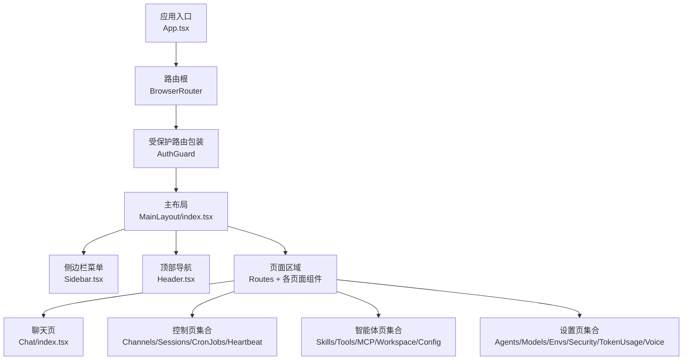
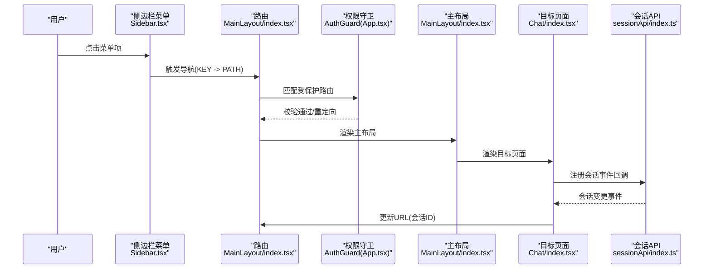
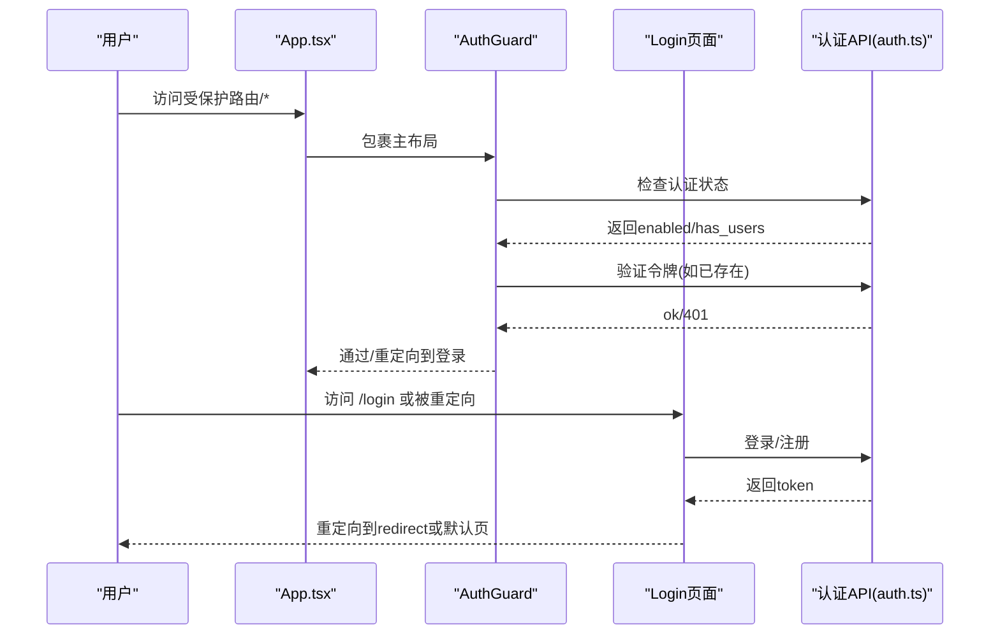
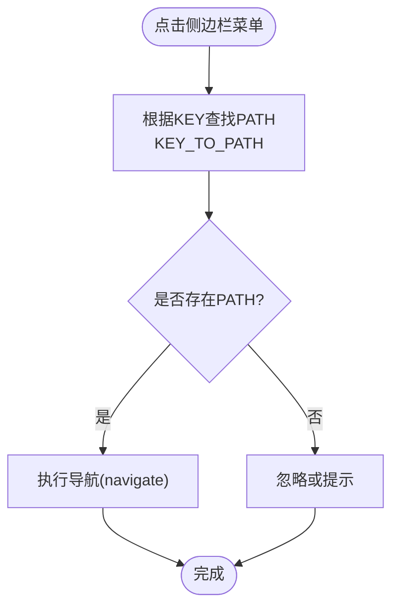
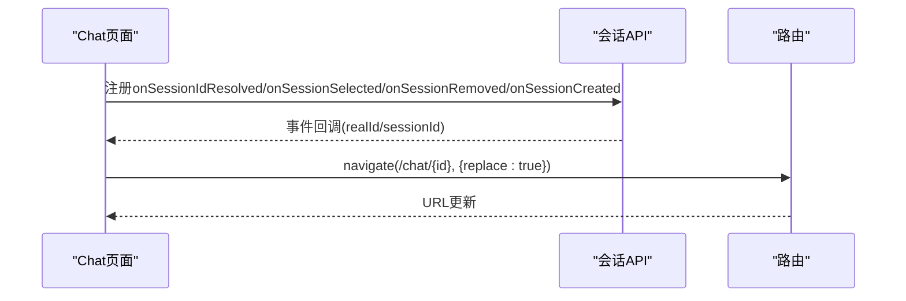
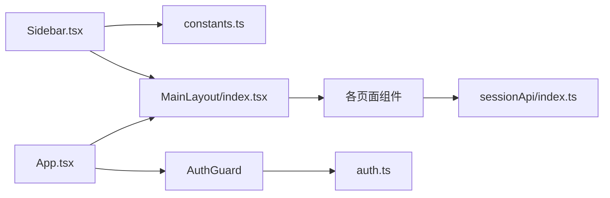

# 页面路由与导航

<cite>
**本文引用的文件**
- [App.tsx](file://console/src/App.tsx)
- [MainLayout/index.tsx](file://console/src/layouts/MainLayout/index.tsx)
- [Sidebar.tsx](file://console/src/layouts/Sidebar.tsx)
- [Header.tsx](file://console/src/layouts/Header.tsx)
- [constants.ts](file://console/src/layouts/constants.ts)
- [Chat/index.tsx](file://console/src/pages/Chat/index.tsx)
- [sessionApi/index.ts](file://console/src/pages/Chat/sessionApi/index.ts)
- [Login/index.tsx](file://console/src/pages/Login/index.tsx)
- [auth.ts](file://console/src/api/modules/auth.ts)
- [request.ts](file://console/src/api/request.ts)
</cite>

## 目录
1. [简介](#简介)
2. [项目结构](#项目结构)
3. [核心组件](#核心组件)
4. [架构总览](#架构总览)
5. [详细组件分析](#详细组件分析)
6. [依赖关系分析](#依赖关系分析)
7. [性能考量](#性能考量)
8. [故障排查指南](#故障排查指南)
9. [结论](#结论)
10. [附录：路由配置与扩展指南](#附录路由配置与扩展指南)

## 简介
本文件面向开发者，系统化梳理 CoPaw 控制台前端的页面路由与导航体系，覆盖以下主题：
- 路由配置结构与入口
- 页面组件组织与布局
- 导航流程与权限控制
- 侧边栏与头部导航、面包屑映射思路
- 路由参数传递、状态保持与历史记录管理
- 页面组件组织模式与最佳实践
- 实际路由配置示例与导航组件使用方法
- 扩展与定制指南

## 项目结构
控制台采用 React + react-router-dom 的单页应用（SPA）架构，路由根组件位于应用入口，主布局负责承载侧边栏、头部与内容区，并在其中声明各业务页面路由。

图表来源
- [App.tsx:132-159](file://console/src/App.tsx#L132-L159)
- [MainLayout/index.tsx:50-85](file://console/src/layouts/MainLayout/index.tsx#L50-L85)
- [Sidebar.tsx:420-430](file://console/src/layouts/Sidebar.tsx#L420-L430)
- [Header.tsx:28-91](file://console/src/layouts/Header.tsx#L28-L91)

章节来源
- [App.tsx:132-159](file://console/src/App.tsx#L132-L159)
- [MainLayout/index.tsx:50-85](file://console/src/layouts/MainLayout/index.tsx#L50-L85)

## 核心组件
- 应用入口与基础路由
  - 应用根组件在入口处配置浏览器路由基座路径与国际化、主题等全局上下文，定义登录页与受保护的主布局路由。
- 主布局与导航骨架
  - 主布局包含侧边栏、头部与内容区；内容区集中声明所有页面路由。
- 侧边栏菜单
  - 通过常量表将菜单键映射到具体路径，点击菜单项触发路由跳转。
- 权限守卫
  - 自定义 AuthGuard 在进入受保护路由前检查认证状态，必要时重定向至登录页。
- 聊天页会话同步
  - 聊天页通过会话 API 事件回调与 URL 同步，确保会话切换、新建、删除时地址栏与真实会话 ID 保持一致。

章节来源
- [App.tsx:132-159](file://console/src/App.tsx#L132-L159)
- [MainLayout/index.tsx:50-85](file://console/src/layouts/MainLayout/index.tsx#L50-L85)
- [Sidebar.tsx:420-430](file://console/src/layouts/Sidebar.tsx#L420-L430)
- [constants.ts:20-37](file://console/src/layouts/constants.ts#L20-L37)
- [Chat/index.tsx:270-320](file://console/src/pages/Chat/index.tsx#L270-L320)

## 架构总览
下图展示从用户交互到页面渲染与状态更新的关键路径，包括权限校验、菜单导航、URL 同步与会话管理。

图表来源
- [Sidebar.tsx:420-430](file://console/src/layouts/Sidebar.tsx#L420-L430)
- [constants.ts:20-37](file://console/src/layouts/constants.ts#L20-L37)
- [MainLayout/index.tsx:58-79](file://console/src/layouts/MainLayout/index.tsx#L58-L79)
- [App.tsx:45-100](file://console/src/App.tsx#L45-L100)
- [Chat/index.tsx:270-320](file://console/src/pages/Chat/index.tsx#L270-L320)
- [sessionApi/index.ts:363-383](file://console/src/pages/Chat/sessionApi/index.ts#L363-L383)

## 详细组件分析

### 权限守卫与登录流程
- AuthGuard
  - 首先检查后端认证开关状态；若启用则读取本地令牌并调用后端验证接口；失败则清理令牌并重定向到登录页，携带当前路径作为重定向参数。
  - 登录页根据后端返回的认证状态决定注册或登录流程，并将令牌存入本地存储，随后按参数重定向。
- 登录页
  - 读取查询参数 redirect，限定为绝对路径且非外链，避免安全风险；成功后跳转至目标页。

图表来源
- [App.tsx:45-100](file://console/src/App.tsx#L45-L100)
- [Login/index.tsx:19-70](file://console/src/pages/Login/index.tsx#L19-L70)
- [auth.ts:14-48](file://console/src/api/modules/auth.ts#L14-L48)

章节来源
- [App.tsx:45-100](file://console/src/App.tsx#L45-L100)
- [Login/index.tsx:19-70](file://console/src/pages/Login/index.tsx#L19-L70)
- [auth.ts:14-48](file://console/src/api/modules/auth.ts#L14-L48)

### 侧边栏导航与菜单键到路径映射
- 菜单项分组与图标，统一通过常量表维护键值对，点击菜单项时根据键查找对应路径并触发导航。
- 支持折叠状态与打开分组的持久化，便于用户体验优化。

图表来源
- [Sidebar.tsx:420-430](file://console/src/layouts/Sidebar.tsx#L420-L430)
- [constants.ts:20-37](file://console/src/layouts/constants.ts#L20-L37)

章节来源
- [Sidebar.tsx:420-430](file://console/src/layouts/Sidebar.tsx#L420-L430)
- [constants.ts:20-37](file://console/src/layouts/constants.ts#L20-L37)

### 聊天页会话与URL同步
- 聊天页监听会话 API 的多个事件回调，当会话 ID 解析、选中、移除或新建时，自动更新 URL，保证地址栏与当前会话一致。
- 使用 ref 缓存 navigate 函数与当前 chatId，避免闭包陷阱导致的导航异常。

图表来源
- [Chat/index.tsx:270-320](file://console/src/pages/Chat/index.tsx#L270-L320)
- [sessionApi/index.ts:363-383](file://console/src/pages/Chat/sessionApi/index.ts#L363-L383)

章节来源
- [Chat/index.tsx:270-320](file://console/src/pages/Chat/index.tsx#L270-L320)
- [sessionApi/index.ts:363-383](file://console/src/pages/Chat/sessionApi/index.ts#L363-L383)

### 主布局与页面路由声明
- 主布局集中声明所有页面路由，包含聊天、控制、智能体、设置等模块，首页重定向至聊天页。
- 通过路由嵌套与路径通配符，确保受保护路由包裹主布局。

章节来源
- [MainLayout/index.tsx:50-85](file://console/src/layouts/MainLayout/index.tsx#L50-L85)
- [App.tsx:146-156](file://console/src/App.tsx#L146-L156)

### 头部导航与外部链接
- 头部根据当前选中的菜单键动态显示标题，并提供文档、FAQ、发布说明与 GitHub 链接，支持在桌面端通过 webview 打开外部链接。

章节来源
- [Header.tsx:28-91](file://console/src/layouts/Header.tsx#L28-L91)
- [constants.ts:59-69](file://console/src/layouts/constants.ts#L59-L69)

## 依赖关系分析
- 组件耦合
  - 侧边栏与常量表强耦合，菜单键到路径映射集中管理，便于扩展与一致性维护。
  - 聊天页与会话 API 强耦合，通过事件回调实现 URL 同步，降低页面内部状态复杂度。
  - 权限守卫与认证 API 弱耦合，通过接口抽象隔离网络层。
- 外部依赖
  - react-router-dom 提供路由与导航能力；antd/antd-style 提供 UI 与主题；lucide-react 提供图标。
- 潜在循环依赖
  - 当前结构清晰，未发现循环导入；建议新增页面时遵循“布局声明路由、菜单键映射路径”的约定，避免在菜单组件内直接引入页面组件。

图表来源
- [Sidebar.tsx:420-430](file://console/src/layouts/Sidebar.tsx#L420-L430)
- [constants.ts:20-37](file://console/src/layouts/constants.ts#L20-L37)
- [MainLayout/index.tsx:58-79](file://console/src/layouts/MainLayout/index.tsx#L58-L79)
- [Chat/index.tsx:270-320](file://console/src/pages/Chat/index.tsx#L270-L320)
- [sessionApi/index.ts:363-383](file://console/src/pages/Chat/sessionApi/index.ts#L363-L383)
- [App.tsx:45-100](file://console/src/App.tsx#L45-L100)
- [auth.ts:14-48](file://console/src/api/modules/auth.ts#L14-L48)

章节来源
- [Sidebar.tsx:420-430](file://console/src/layouts/Sidebar.tsx#L420-L430)
- [constants.ts:20-37](file://console/src/layouts/constants.ts#L20-L37)
- [MainLayout/index.tsx:58-79](file://console/src/layouts/MainLayout/index.tsx#L58-L79)
- [Chat/index.tsx:270-320](file://console/src/pages/Chat/index.tsx#L270-L320)
- [sessionApi/index.ts:363-383](file://console/src/pages/Chat/sessionApi/index.ts#L363-L383)
- [App.tsx:45-100](file://console/src/App.tsx#L45-L100)
- [auth.ts:14-48](file://console/src/api/modules/auth.ts#L14-L48)

## 性能考量
- 路由切换
  - 使用 replace 导航减少历史栈冗余，尤其在会话 URL 同步场景中避免重复历史条目。
- 会话事件回调
  - 通过 ref 缓存 navigate 与 chatId，避免每次渲染产生新的回调函数实例，降低重渲染成本。
- 菜单展开状态
  - 折叠状态下重置打开分组，减少不必要的子菜单渲染。
- 国际化与主题
  - 语言切换与主题切换仅影响 ConfigProvider 与样式，不影响路由与页面树结构。

## 故障排查指南
- 登录后仍被重定向到登录页
  - 检查认证开关与令牌是否正确存储；确认后端验证接口返回状态；查看权限守卫日志。
- 跳转路径异常或被拦截
  - 确认登录页 redirect 参数合法性（必须以 / 开头且非外链）；检查 AuthGuard 重定向逻辑。
- 聊天会话 URL 不更新
  - 确认会话 API 事件回调已注册；检查当前页面是否处于激活状态；核对 navigate 调用时机。
- 401 未认证
  - 网络请求拦截器会在 401 时清理令牌并跳转登录页；检查请求头构建与后端鉴权策略。

章节来源
- [App.tsx:45-100](file://console/src/App.tsx#L45-L100)
- [Login/index.tsx:35-70](file://console/src/pages/Login/index.tsx#L35-L70)
- [Chat/index.tsx:270-320](file://console/src/pages/Chat/index.tsx#L270-L320)
- [request.ts:36-44](file://console/src/api/request.ts#L36-L44)

## 结论
该路由与导航体系以“布局集中声明路由、菜单键映射路径、权限守卫统一拦截、页面与会话解耦同步”为核心设计原则，既保证了功能完整性，又兼顾了可扩展性与可维护性。通过事件驱动的 URL 同步与严格的参数校验，提升了用户体验与安全性。

## 附录：路由配置与扩展指南

### 路由配置结构与页面组织
- 路由入口
  - 在应用入口配置浏览器路由基座与受保护路由包裹，声明登录页与主布局路由。
- 主布局路由声明
  - 在主布局中集中声明各页面路由，包含首页重定向与模块化页面集合。
- 页面组织模式
  - 每个模块页面独立目录，包含样式、组件与逻辑钩子；页面组件职责单一，通过 hooks 抽离跨页面逻辑（如会话 API）。

章节来源
- [App.tsx:132-159](file://console/src/App.tsx#L132-L159)
- [MainLayout/index.tsx:50-85](file://console/src/layouts/MainLayout/index.tsx#L50-L85)

### 权限控制与路由守卫实现
- 在路由外层包裹 AuthGuard，进入前检查认证状态与令牌有效性。
- 登录页读取 redirect 参数并进行合法性校验，成功后重定向至目标页。
- 401 时清理令牌并跳转登录页，确保安全边界。

章节来源
- [App.tsx:45-100](file://console/src/App.tsx#L45-L100)
- [Login/index.tsx:19-70](file://console/src/pages/Login/index.tsx#L19-L70)
- [request.ts:36-44](file://console/src/api/request.ts#L36-L44)

### 侧边栏导航与菜单键映射
- 菜单项统一在常量表中维护键值对，点击菜单项时根据键查找路径并导航。
- 支持分组展开状态与折叠行为，提升导航效率。

章节来源
- [Sidebar.tsx:420-430](file://console/src/layouts/Sidebar.tsx#L420-L430)
- [constants.ts:20-37](file://console/src/layouts/constants.ts#L20-L37)

### 路由参数传递、状态保持与历史记录
- 参数传递
  - 通过 navigate 的 replace 选项控制历史栈；聊天页使用 replace 保持简洁的历史记录。
- 状态保持
  - 使用 ref 缓存 navigate 与 chatId，避免闭包陷阱；会话 API 事件回调集中处理 URL 同步。
- 历史记录
  - 仅在必要时添加新历史条目，避免重复导航造成历史栈膨胀。

章节来源
- [Chat/index.tsx:270-320](file://console/src/pages/Chat/index.tsx#L270-L320)
- [sessionApi/index.ts:363-383](file://console/src/pages/Chat/sessionApi/index.ts#L363-L383)

### 页面跳转与导航组件使用方法
- 侧边栏跳转
  - 通过菜单项的 onClick 回调，读取 KEY_TO_PATH 并调用 navigate。
- 头部跳转
  - 通过常量表提供的 URL 工具函数生成文档、FAQ、发布说明与 GitHub 链接。
- 登录页跳转
  - 读取查询参数 redirect，限定为内部路径后重定向。

章节来源
- [Sidebar.tsx:420-430](file://console/src/layouts/Sidebar.tsx#L420-L430)
- [constants.ts:59-69](file://console/src/layouts/constants.ts#L59-L69)
- [Login/index.tsx:35-70](file://console/src/pages/Login/index.tsx#L35-L70)

### 扩展与定制指南
- 新增页面路由
  - 在主布局中新增路由声明，确保受保护路由包裹；如需侧边栏可见，补充菜单项与键值映射。
- 新增菜单项
  - 在常量表中添加 KEY_TO_PATH 与 KEY_TO_LABEL 映射；在侧边栏菜单中添加对应项。
- 新增权限控制
  - 在 AuthGuard 中增加额外校验逻辑（如角色、资源访问），并在登录页处理多租户/多用户场景。
- 会话与URL同步
  - 若新增页面需要会话状态同步，参考聊天页注册会话 API 事件回调的方式，确保 URL 与状态一致。
- 面包屑导航
  - 可基于当前路径与 KEY_TO_LABEL 动态生成面包屑文案；若需要更复杂的层级关系，可在路由层级上显式声明面包屑数据。