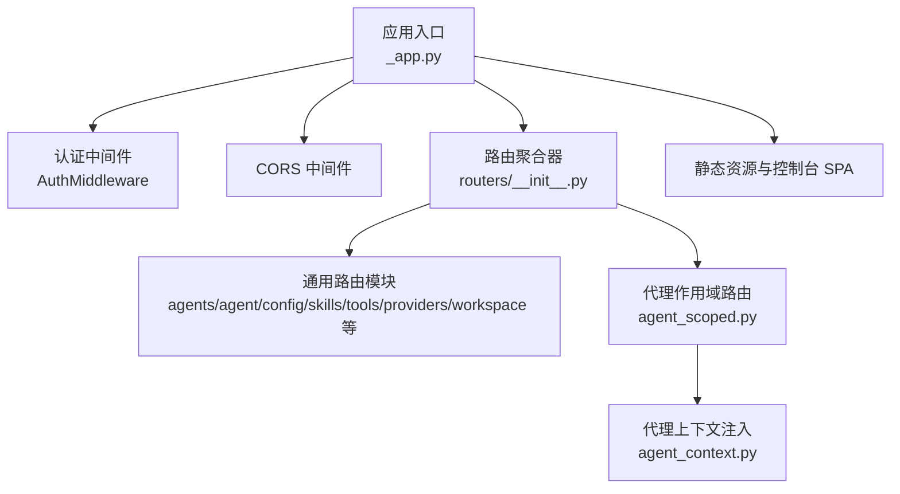
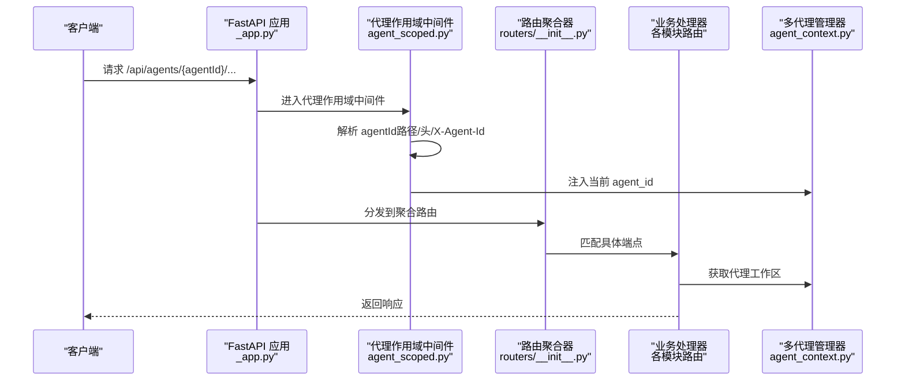
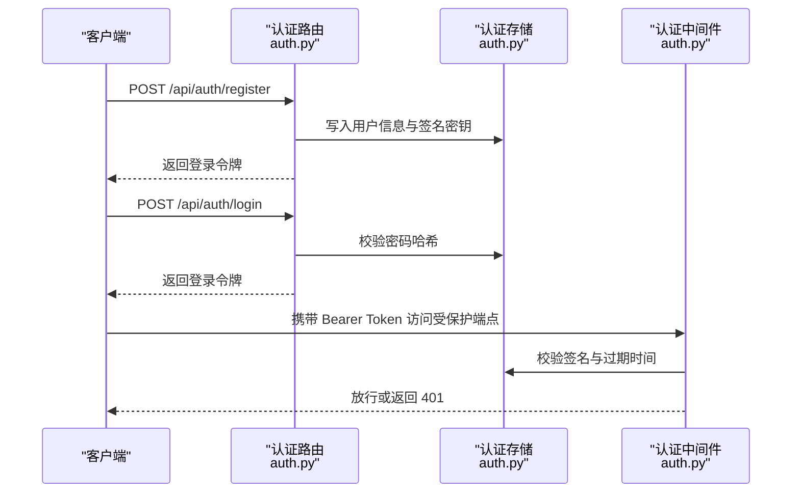
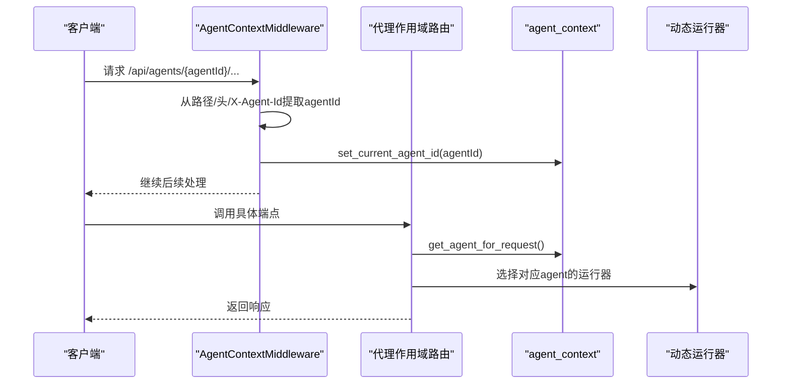
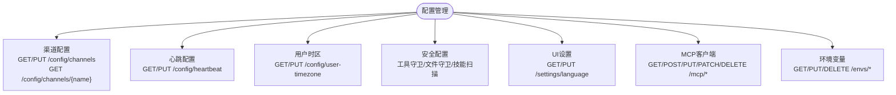
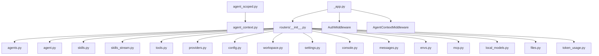

# API路由系统

<cite>
**本文档引用的文件**
- [src/copaw/app/routers/__init__.py](file://src/copaw/app/routers/__init__.py)
- [src/copaw/app/_app.py](file://src/copaw/app/_app.py)
- [src/copaw/app/routers/agent.py](file://src/copaw/app/routers/agent.py)
- [src/copaw/app/routers/agents.py](file://src/copaw/app/routers/agents.py)
- [src/copaw/app/routers/auth.py](file://src/copaw/app/routers/auth.py)
- [src/copaw/app/routers/workspace.py](file://src/copaw/app/routers/workspace.py)
- [src/copaw/app/routers/agent_scoped.py](file://src/copaw/app/routers/agent_scoped.py)
- [src/copaw/app/routers/skills.py](file://src/copaw/app/routers/skills.py)
- [src/copaw/app/routers/skills_stream.py](file://src/copaw/app/routers/skills_stream.py)
- [src/copaw/app/routers/tools.py](file://src/copaw/app/routers/tools.py)
- [src/copaw/app/routers/providers.py](file://src/copaw/app/routers/providers.py)
- [src/copaw/app/routers/config.py](file://src/copaw/app/routers/config.py)
- [src/copaw/app/routers/settings.py](file://src/copaw/app/routers/settings.py)
- [src/copaw/app/auth.py](file://src/copaw/app/auth.py)
- [src/copaw/app/agent_context.py](file://src/copaw/app/agent_context.py)
- [src/copaw/constant.py](file://src/copaw/constant.py)
- [src/copaw/config/config.py](file://src/copaw/config/config.py)
- [src/copaw/app/routers/schemas_config.py](file://src/copaw/app/routers/schemas_config.py)
- [src/copaw/cli/http.py](file://src/copaw/cli/http.py)
- [src/copaw/app/routers/console.py](file://src/copaw/app/routers/console.py)
- [src/copaw/app/routers/envs.py](file://src/copaw/app/routers/envs.py)
- [src/copaw/app/routers/mcp.py](file://src/copaw/app/routers/mcp.py)
- [src/copaw/app/routers/local_models.py](file://src/copaw/app/routers/local_models.py)
- [src/copaw/app/routers/messages.py](file://src/copaw/app/routers/messages.py)
- [src/copaw/app/routers/files.py](file://src/copaw/app/routers/files.py)
- [src/copaw/app/routers/token_usage.py](file://src/copaw/app/routers/token_usage.py)
</cite>

## 目录
1. [简介](#简介)
2. [项目结构](#项目结构)
3. [核心组件](#核心组件)
4. [架构总览](#架构总览)
5. [详细组件分析](#详细组件分析)
6. [依赖关系分析](#依赖关系分析)
7. [性能考虑](#性能考虑)
8. [故障排除指南](#故障排除指南)
9. [结论](#结论)
10. [附录](#附录)

## 简介
本文件为 CoPaw API 路由系统的全面技术文档，覆盖 RESTful API 设计原则、路由分组策略、中间件机制、请求响应处理、认证授权与权限控制、API 版本管理、安全与兼容性、以及开发运维支持（文档生成、测试工具、性能监控）等内容。通过分层解析各路由模块的功能划分、端点设计、参数校验、错误处理策略，帮助开发者快速理解并高效使用系统提供的 API。

## 项目结构
CoPaw 基于 FastAPI 构建，采用"模块化路由 + 中间件"的组织方式：
- 应用入口与中间件：在应用启动时注册认证中间件、CORS 中间件、代理静态资源，并挂载各子路由。
- 路由聚合：统一在路由器聚合器中引入所有业务路由模块。
- 多代理隔离：通过"代理作用域路由"为每个 agent 提供独立上下文。
- 配置与上下文：全局配置与代理上下文通过上下文变量与中间件注入，确保多代理场景下的正确路由与权限控制。



**章节来源**
- [src/copaw/app/_app.py:243-344](file://src/copaw/app/_app.py#L243-L344)
- [src/copaw/app/routers/__init__.py:24-44](file://src/copaw/app/routers/__init__.py#L24-L44)
- [src/copaw/app/routers/agent_scoped.py:53-91](file://src/copaw/app/routers/agent_scoped.py#L53-L91)

## 核心组件
- 路由聚合器：集中引入并挂载所有业务路由，形成统一的 /api 前缀。
- 代理作用域路由：为每个 agent 提供独立命名空间，注入 agent 上下文，支持跨模块共享。
- 认证中间件：基于 Bearer Token 的鉴权，自动跳过公开路径与本地回环请求。
- 全局配置与上下文：通过上下文变量与中间件注入当前 agent，支持热重载与动态切换。
- 安全与合规：工具守卫、技能扫描、白名单机制，保障导入与启用的安全性。

**章节来源**
- [src/copaw/app/routers/__init__.py:24-44](file://src/copaw/app/routers/__init__.py#L24-L44)
- [src/copaw/app/routers/agent_scoped.py:15-51](file://src/copaw/app/routers/agent_scoped.py#L15-L51)
- [src/copaw/app/auth.py:339-404](file://src/copaw/app/auth.py#L339-L404)
- [src/copaw/app/agent_context.py:22-83](file://src/copaw/app/agent_context.py#L22-L83)

## 架构总览
CoPaw 的 API 架构遵循"单体服务 + 多代理隔离"的设计：
- 单体服务：统一暴露 /api 前缀的所有端点。
- 多代理隔离：通过 /api/agents/{agentId}/ 下的子路由，将不同 agent 的操作隔离到各自工作区。
- 动态运行器：根据请求中的 agent 上下文，动态路由到对应的工作区运行器，实现多代理并发与热重载。



**图表来源**
- [src/copaw/app/_app.py:329-340](file://src/copaw/app/_app.py#L329-L340)
- [src/copaw/app/routers/agent_scoped.py:15-51](file://src/copaw/app/routers/agent_scoped.py#L15-L51)
- [src/copaw/app/routers/__init__.py:24-44](file://src/copaw/app/routers/__init__.py#L24-L44)
- [src/copaw/app/agent_context.py:22-83](file://src/copaw/app/agent_context.py#L22-L83)

## 详细组件分析

### 认证与授权模块（/api/auth）
- 登录：当启用认证时，凭用户名密码换取 Bearer Token；未启用或无用户时返回空 token。
- 注册：仅允许一次注册，需显式开启认证环境变量。
- 状态查询：返回认证开关与是否存在用户。
- 令牌验证：校验 Bearer Token 是否有效且未过期。
- 更新资料：支持更新用户名与密码，必要时轮换会话密钥以失效旧会话。



**图表来源**
- [src/copaw/app/routers/auth.py:42-114](file://src/copaw/app/routers/auth.py#L42-L114)
- [src/copaw/app/auth.py:214-331](file://src/copaw/app/auth.py#L214-L331)
- [src/copaw/app/auth.py:339-404](file://src/copaw/app/auth.py#L339-L404)

**章节来源**
- [src/copaw/app/routers/auth.py:42-174](file://src/copaw/app/routers/auth.py#L42-L174)
- [src/copaw/app/auth.py:191-331](file://src/copaw/app/auth.py#L191-L331)

### 多代理管理（/api/agents 与 /api/agents/{agentId}/*）
- 列表与详情：获取所有代理配置与指定代理的完整配置。
- 创建与更新：自动生成短 ID，初始化工作区目录与默认文件，支持热重载。
- 删除：禁止删除默认代理，停止实例后仅移除引用，保留工作区以防误删。
- 文件与内存：读取/写入代理工作区内的 Markdown 文件，支持工作区与记忆区分离。
- 运行配置：获取/更新代理运行配置（如最大迭代次数、重试策略、上下文长度等），异步触发热重载。

```mermaid
flowchart TD
Start(["请求进入 /api/agents"]) --> Action{"动作类型？"}
Action --> |GET /api/agents| List["列出所有代理"]
Action --> |POST /api/agents| Create["创建新代理<br/>生成ID/初始化目录/保存配置"]
Action --> |PUT /api/agents/{agentId}| Update["更新代理配置<br/>异步热重载"]
Action --> |DELETE /api/agents/{agentId}| Delete["停止实例/移除引用/保留工作区"]
Action --> |GET /api/agents/{agentId}/files| ListFiles["列出工作区文件"]
Action --> |GET /api/agents/{agentId}/memory| ListMemory["列出记忆文件"]
Action --> |GET/PUT /api/agent/*| AgentOps["代理文件/语言/音频模式等操作"]
List --> End(["返回结果"])
Create --> End
Update --> End
Delete --> End
ListFiles --> End
ListMemory --> End
AgentOps --> End
```

**图表来源**
- [src/copaw/app/routers/agents.py:130-172](file://src/copaw/app/routers/agents.py#L130-L172)
- [src/copaw/app/routers/agents.py:199-264](file://src/copaw/app/routers/agents.py#L199-L264)
- [src/copaw/app/routers/agents.py:273-315](file://src/copaw/app/routers/agents.py#L273-L315)
- [src/copaw/app/routers/agents.py:323-353](file://src/copaw/app/routers/agents.py#L323-L353)
- [src/copaw/app/routers/agents.py:362-416](file://src/copaw/app/routers/agents.py#L362-L416)
- [src/copaw/app/routers/agent.py:46-108](file://src/copaw/app/routers/agent.py#L46-L108)

**章节来源**
- [src/copaw/app/routers/agents.py:130-353](file://src/copaw/app/routers/agents.py#L130-L353)
- [src/copaw/app/routers/agent.py:46-108](file://src/copaw/app/routers/agent.py#L46-L108)

### 代理作用域路由与上下文注入（/api/agents/{agentId}/*）
- 作用域路由：将 agent 子路由挂载到 /api/agents/{agentId}/ 前缀下，统一管理 agent 文件、技能、工具、配置、工作区等。
- 上下文注入：优先从路径提取 agentId，其次从 X-Agent-Id 头部获取；若均无则回退到配置中的活跃代理。
- 动态运行器：根据当前 agentId 动态选择对应的工作区运行器，实现多代理并发与热重载。



**图表来源**
- [src/copaw/app/routers/agent_scoped.py:15-51](file://src/copaw/app/routers/agent_scoped.py#L15-L51)
- [src/copaw/app/agent_context.py:22-83](file://src/copaw/app/agent_context.py#L22-L83)

**章节来源**
- [src/copaw/app/routers/agent_scoped.py:15-91](file://src/copaw/app/routers/agent_scoped.py#L15-L91)
- [src/copaw/app/agent_context.py:22-118](file://src/copaw/app/agent_context.py#L22-L118)

### 技能管理（/api/skills 与 /api/skills-stream）
**更新** 新增技能池管理、批量操作、AI优化流式接口等增强功能

- 列表与可用技能：返回内置与自定义技能清单，标注启用状态。
- 从 Hub 安装：支持从技能库批量安装，支持异步任务跟踪、取消与扫描失败处理。
- 上传 ZIP：支持从本地 ZIP 导入技能，内置安全扫描与大小限制。
- 启用/禁用/删除：对技能进行启用、禁用与永久删除（仅限自定义技能）。
- 批量操作：支持批量启用/禁用，扫描失败时返回结构化错误。
- 技能池管理：支持技能池的创建、编辑、上传、下载、内置同步等功能。
- AI优化：提供流式技能内容优化接口，支持多语言优化规则。

```mermaid
flowchart TD
S(["请求 /api/skills"]) --> List["GET /skills<br/>列出技能"]
S --> Search["GET /skills/hub/search<br/>搜索Hub技能"]
S --> Install["POST /skills/hub/install<br/>安装Hub技能"]
S --> InstallAsync["POST /skills/hub/install/start<br/>开始异步安装"]
S --> Status["GET /skills/hub/install/status/{task_id}<br/>查询安装状态"]
S --> Cancel["POST /skills/hub/install/cancel/{task_id}<br/>取消安装"]
S --> Upload["POST /skills/upload<br/>上传ZIP导入"]
S --> Create["POST /skills<br/>创建技能"]
S --> Enable["POST /skills/{name}/enable<br/>启用技能"]
S --> Disable["POST /skills/{name}/disable<br/>禁用技能"]
S --> Delete["DELETE /skills/{name}<br/>删除技能"]
S --> BatchEnable["POST /skills/batch-enable<br/>批量启用"]
S --> BatchDisable["POST /skills/batch-disable<br/>批量禁用"]
SP(["技能池管理"]) --> PoolList["GET /skills/pool<br/>列出技能池"]
SP --> PoolCreate["POST /skills/pool/create<br/>创建池技能"]
SP --> PoolUploadZip["POST /skills/pool/upload-zip<br/>上传池ZIP"]
SP --> PoolImport["POST /skills/pool/import<br/>从Hub导入池技能"]
SP --> PoolDownload["POST /skills/pool/download<br/>下载到工作区"]
SP --> PoolImportBuiltin["POST /skills/pool/import-builtin<br/>导入内置技能"]
SP --> PoolUpdateBuiltin["POST /skills/pool/{name}/update-builtin<br/>更新内置技能"]
SP --> PoolDelete["DELETE /skills/pool/{name}<br/>删除池技能"]
SP --> PoolConfig["GET/PUT/DELETE /skills/pool/{name}/config<br/>池技能配置"]
AI(["AI优化流"]) --> OptimizeStream["POST /skills/ai/optimize/stream<br/>流式优化技能"]
```



**图表来源**
- [src/copaw/app/routers/skills.py:122-161](file://src/copaw/app/routers/skills.py#L122-L161)
- [src/copaw/app/routers/skills.py:196-211](file://src/copaw/app/routers/skills.py#L196-L211)
- [src/copaw/app/routers/skills.py:344-388](file://src/copaw/app/routers/skills.py#L344-L388)
- [src/copaw/app/routers/skills.py:391-421](file://src/copaw/app/routers/skills.py#L391-L421)
- [src/copaw/app/routers/skills.py:424-430](file://src/copaw/app/routers/skills.py#L424-L430)
- [src/copaw/app/routers/skills.py:432-452](file://src/copaw/app/routers/skills.py#L432-L452)
- [src/copaw/app/routers/skills.py:463-514](file://src/copaw/app/routers/skills.py#L463-L514)
- [src/copaw/app/routers/skills.py:568-588](file://src/copaw/app/routers/skills.py#L568-L588)
- [src/copaw/app/routers/skills.py:626-693](file://src/copaw/app/routers/skills.py#L626-L693)
- [src/copaw/app/routers/skills.py:517-566](file://src/copaw/app/routers/skills.py#L517-L566)
- [src/copaw/app/routers/skills.py:696-713](file://src/copaw/app/routers/skills.py#L696-L713)
- [src/copaw/app/routers/skills_stream.py:166-245](file://src/copaw/app/routers/skills_stream.py#L166-L245)

**章节来源**
- [src/copaw/app/routers/skills.py:122-1279](file://src/copaw/app/routers/skills.py#L122-L1279)
- [src/copaw/app/routers/skills_stream.py:166-245](file://src/copaw/app/routers/skills_stream.py#L166-L245)

### 工具管理（/api/tools）
- 列出内置工具：返回工具名称、启用状态与描述。
- 切换工具：按工具名切换启用状态，异步触发热重载。

**章节来源**
- [src/copaw/app/routers/tools.py:29-133](file://src/copaw/app/routers/tools.py#L29-L133)

### 模型与提供商（/api/models）
- 列出提供商：返回所有提供商信息。
- 配置提供商：更新 API Key、Base URL、聊天模型类名与生成参数。
- 自定义提供商：创建/删除自定义提供商。
- 测试连接与发现模型：测试提供商连通性与自动发现可用模型。
- 模型探测：探测图像/视频多模态能力。
- 设置/获取当前激活模型：支持代理级与全局级覆盖。

**章节来源**
- [src/copaw/app/routers/providers.py:84-121](file://src/copaw/app/routers/providers.py#L84-L121)
- [src/copaw/app/routers/providers.py:130-148](file://src/copaw/app/routers/providers.py#L130-L148)
- [src/copaw/app/routers/providers.py:211-236](file://src/copaw/app/routers/providers.py#L211-L236)
- [src/copaw/app/routers/providers.py:243-271](file://src/copaw/app/routers/providers.py#L243-L271)
- [src/copaw/app/routers/providers.py:284-299](file://src/copaw/app/routers/providers.py#L284-L299)
- [src/copaw/app/routers/providers.py:310-317](file://src/copaw/app/routers/providers.py#L310-L317)
- [src/copaw/app/routers/providers.py:330-338](file://src/copaw/app/routers/providers.py#L330-L338)
- [src/copaw/app/routers/providers.py:374-378](file://src/copaw/app/routers/providers.py#L374-L378)
- [src/copaw/app/routers/providers.py:390-398](file://src/copaw/app/routers/providers.py#L390-L398)
- [src/copaw/app/routers/providers.py:406-476](file://src/copaw/app/routers/providers.py#L406-L476)

### 配置管理（/api/config）
**更新** 新增全局UI设置、MCP客户端管理、环境变量管理等

- 渠道配置：列出/更新所有渠道配置，支持热重载。
- 单个渠道：按名称获取/更新单个渠道配置。
- 心跳配置：获取/更新心跳周期、目标与活跃时段，异步重调度。
- 用户时区：获取/设置用户 IANA 时区。
- 安全配置：
  - 工具守卫：获取/更新规则与启用状态，异步重载规则引擎。
  - 文件守卫：获取/更新敏感路径列表，异步重载规则引擎。
  - 技能扫描：获取/更新扫描策略与白名单，支持查看/清理被阻历史记录。
- 全局UI设置：获取/设置UI语言等全局设置。
- MCP客户端管理：获取/创建/更新/删除MCP客户端配置。
- 环境变量管理：批量获取/设置/删除环境变量。



**图表来源**
- [src/copaw/app/routers/config.py:64-98](file://src/copaw/app/routers/config.py#L64-L98)
- [src/copaw/app/routers/config.py:117-152](file://src/copaw/app/routers/config.py#L117-L152)
- [src/copaw/app/routers/config.py:161-196](file://src/copaw/app/routers/config.py#L161-L196)
- [src/copaw/app/routers/config.py:205-265](file://src/copaw/app/routers/config.py#L205-L265)
- [src/copaw/app/routers/config.py:273-325](file://src/copaw/app/routers/config.py#L273-L325)
- [src/copaw/app/routers/config.py:354-379](file://src/copaw/app/routers/config.py#L354-L379)
- [src/copaw/app/routers/config.py:385-413](file://src/copaw/app/routers/config.py#L385-L413)
- [src/copaw/app/routers/config.py:446-500](file://src/copaw/app/routers/config.py#L446-L500)
- [src/copaw/app/routers/config.py:506-527](file://src/copaw/app/routers/config.py#L506-L527)
- [src/copaw/app/routers/config.py:534-564](file://src/copaw/app/routers/config.py#L534-L564)
- [src/copaw/app/routers/config.py:576-602](file://src/copaw/app/routers/config.py#L576-L602)
- [src/copaw/app/routers/config.py:609-624](file://src/copaw/app/routers/config.py#L609-L624)
- [src/copaw/app/routers/settings.py:39-59](file://src/copaw/app/routers/settings.py#L39-L59)
- [src/copaw/app/routers/mcp.py:192-388](file://src/copaw/app/routers/mcp.py#L192-L388)
- [src/copaw/app/routers/envs.py:32-81](file://src/copaw/app/routers/envs.py#L32-L81)

**章节来源**
- [src/copaw/app/routers/config.py:64-624](file://src/copaw/app/routers/config.py#L64-L624)
- [src/copaw/app/routers/settings.py:39-59](file://src/copaw/app/routers/settings.py#L39-L59)
- [src/copaw/app/routers/mcp.py:192-388](file://src/copaw/app/routers/mcp.py#L192-L388)
- [src/copaw/app/routers/envs.py:32-81](file://src/copaw/app/routers/envs.py#L32-L81)

### 工作区打包与上传（/api/workspace）
- 下载：将整个代理工作区打包为 zip 并流式返回。
- 上传：接收 zip 并合并到工作区，内置路径穿越校验与大小限制。

**章节来源**
- [src/copaw/app/routers/workspace.py:126-150](file://src/copaw/app/routers/workspace.py#L126-L150)
- [src/copaw/app/routers/workspace.py:165-202](file://src/copaw/app/routers/workspace.py#L165-L202)

### 代理文件与语言（/api/agent）
- 文件读写：读取/写入工作区与记忆区 Markdown 文件。
- 语言设置：获取/更新代理语言，必要时复制对应语言的模板文件。
- 音频模式与转录：获取/设置音频处理模式与转录提供商类型，检查本地 Whisper 可用性，列出可用转录提供商并设置当前提供商。

**章节来源**
- [src/copaw/app/routers/agent.py:46-108](file://src/copaw/app/routers/agent.py#L46-L108)
- [src/copaw/app/routers/agent.py:117-178](file://src/copaw/app/routers/agent.py#L117-L178)
- [src/copaw/app/routers/agent.py:205-261](file://src/copaw/app/routers/agent.py#L205-L261)
- [src/copaw/app/routers/agent.py:272-308](file://src/copaw/app/routers/agent.py#L272-L308)
- [src/copaw/app/routers/agent.py:319-363](file://src/copaw/app/routers/agent.py#L319-L363)
- [src/copaw/app/routers/agent.py:374-380](file://src/copaw/app/routers/agent.py#L374-L380)
- [src/copaw/app/routers/agent.py:391-401](file://src/copaw/app/routers/agent.py#L391-L401)
- [src/copaw/app/routers/agent.py:412-426](file://src/copaw/app/routers/agent.py#L412-L426)

### 控制台与消息（/api/console 与 /api/messages）
**更新** 新增控制台聊天流式接口、消息发送功能

- 控制台聊天：支持流式聊天响应，断开重连，媒体文件上传。
- 消息发送：支持向各种渠道主动发送消息，包括控制台、钉钉、飞书等。

**章节来源**
- [src/copaw/app/routers/console.py:68-219](file://src/copaw/app/routers/console.py#L68-L219)
- [src/copaw/app/routers/messages.py:75-184](file://src/copaw/app/routers/messages.py#L75-L184)

### 文件与本地模型（/api/files 与 /api/local-models）
**更新** 新增文件预览接口、本地模型管理功能

- 文件预览：安全地预览文件内容，防止路径穿越攻击。
- 本地模型管理：管理本地模型下载、服务器启动/停止、llama.cpp集成等。

**章节来源**
- [src/copaw/app/routers/files.py:9-25](file://src/copaw/app/routers/files.py#L9-L25)
- [src/copaw/app/routers/local_models.py:97-331](file://src/copaw/app/routers/local_models.py#L97-L331)

### 令牌使用统计（/api/token-usage）
- 令牌使用统计：按日期、模型、提供商聚合统计令牌使用情况，支持日期范围查询。

**章节来源**
- [src/copaw/app/routers/token_usage.py:23-62](file://src/copaw/app/routers/token_usage.py#L23-L62)

## 依赖关系分析
- 路由聚合器集中引入各业务路由，形成统一的 /api 前缀。
- 代理作用域路由依赖代理上下文注入，确保下游端点访问正确的代理工作区。
- 认证中间件依赖认证存储与 JWT 验证逻辑，自动跳过公开路径与本地回环请求。
- 全局配置与上下文通过上下文变量与中间件注入，支持热重载与动态切换。



**图表来源**
- [src/copaw/app/routers/__init__.py:5-43](file://src/copaw/app/routers/__init__.py#L5-L43)
- [src/copaw/app/routers/agent_scoped.py:53-91](file://src/copaw/app/routers/agent_scoped.py#L53-L91)
- [src/copaw/app/_app.py:250-265](file://src/copaw/app/_app.py#L250-L265)

**章节来源**
- [src/copaw/app/routers/__init__.py:5-43](file://src/copaw/app/routers/__init__.py#L5-L43)
- [src/copaw/app/routers/agent_scoped.py:53-91](file://src/copaw/app/routers/agent_scoped.py#L53-L91)
- [src/copaw/app/_app.py:250-265](file://src/copaw/app/_app.py#L250-L265)

## 性能考虑
- 异步热重载：配置更新后通过后台任务触发热重载，避免阻塞请求。
- 流式下载：工作区打包采用流式返回，降低内存占用。
- 路由优先级：代理作用域中间件优先从路径提取 agentId，减少额外解析成本。
- 依赖注入：通过依赖函数获取 ProviderManager 实例，避免重复初始化。
- 技能扫描：异步执行技能安全扫描，避免阻塞主流程。
- 流式AI优化：使用SSE协议实现实时技能内容优化反馈。

## 故障排除指南
- 认证相关
  - 未启用认证：/api/auth/* 端点返回空 token 或直接放行。
  - 令牌无效/过期：返回 401，提示无效或过期。
  - 无令牌访问受保护端点：返回 401。
- 代理相关
  - 代理不存在：返回 404。
  - 多代理管理器未初始化：返回 500。
- 技能相关
  - 安全扫描失败：返回 422，包含严重级别与扫描发现明细。
  - Hub 安装失败：返回 502，上游/配额问题。
  - 技能池冲突：返回 409，包含冲突详情。
- 工作区相关
  - 上传 zip 非法或路径穿越：返回 400。
  - 工作区不存在：返回 404。
- 配置相关
  - 渠道不存在：返回 404。
  - 时区为空：返回 400。
  - MCP客户端不存在：返回 404。
  - 环境变量键为空：返回 400。

**章节来源**
- [src/copaw/app/auth.py:339-404](file://src/copaw/app/auth.py#L339-L404)
- [src/copaw/app/routers/agents.py:330-353](file://src/copaw/app/routers/agents.py#L330-L353)
- [src/copaw/app/routers/skills.py:28-50](file://src/copaw/app/routers/skills.py#L28-L50)
- [src/copaw/app/routers/workspace.py:56-71](file://src/copaw/app/routers/workspace.py#L56-L71)
- [src/copaw/app/routers/config.py:173-195](file://src/copaw/app/routers/config.py#L173-L195)
- [src/copaw/app/routers/config.py:374-378](file://src/copaw/app/routers/config.py#L374-L378)
- [src/copaw/app/routers/mcp.py:217-232](file://src/copaw/app/routers/mcp.py#L217-232)
- [src/copaw/app/routers/envs.py:54-60](file://src/copaw/app/routers/envs.py#L54-L60)

## 结论
CoPaw 的 API 路由系统以模块化与中间件为核心，实现了清晰的 RESTful 设计、严格的认证授权、灵活的代理隔离与强大的安全控制。通过统一的路由聚合与上下文注入，系统在保证易用性的同时，兼顾了可扩展性与安全性，适合在多代理场景下稳定运行。新增的技能池管理、AI优化流式接口、MCP客户端管理、环境变量管理等功能进一步增强了系统的灵活性和实用性。

## 附录

### API 使用示例与参数说明
- 认证
  - 登录：POST /api/auth/login，请求体包含 username 与 password。
  - 注册：POST /api/auth/register，请求体包含 username 与 password。
  - 验证：GET /api/auth/verify，请求头 Authorization: Bearer <token>。
- 代理管理
  - 创建代理：POST /api/agents，请求体包含 name、description、workspace_dir、language。
  - 更新代理：PUT /api/agents/{agentId}，请求体为部分字段更新。
  - 删除代理：DELETE /api/agents/{agentId}。
  - 列出代理文件：GET /api/agents/{agentId}/files。
  - 读取代理文件：GET /api/agents/{agentId}/files/{filename}。
  - 写入代理文件：PUT /api/agents/{agentId}/files/{filename}，请求体为 {content: "..."}。
- 技能管理
  - 从 Hub 安装：POST /api/skills/hub/install，请求体包含 bundle_url、version、enable、overwrite。
  - 开始异步安装：POST /api/skills/hub/install/start，返回任务ID。
  - 查询安装状态：GET /api/skills/hub/install/status/{task_id}。
  - 取消安装：POST /api/skills/hub/install/cancel/{task_id}。
  - 上传 ZIP：POST /api/skills/upload，表单文件字段 file，查询参数 enable/overwrite。
  - 启用技能：POST /api/skills/{name}/enable。
  - 禁用技能：POST /api/skills/{name}/disable。
  - 删除技能：DELETE /api/skills/{name}。
  - 批量启用：POST /api/skills/batch-enable。
  - 批量禁用：POST /api/skills/batch-disable。
  - 技能池创建：POST /api/skills/pool/create。
  - 技能池上传：POST /api/skills/pool/upload-zip。
  - 技能池下载：POST /api/skills/pool/download。
  - AI优化：POST /api/skills/ai/optimize/stream。
- 工具管理
  - 列出工具：GET /api/tools。
  - 切换工具：PATCH /api/tools/{tool_name}/toggle。
- 模型与提供商
  - 列出提供商：GET /api/models。
  - 配置提供商：PUT /api/models/{provider_id}/config，请求体包含 api_key/base_url/chat_model/generate_kwargs。
  - 创建自定义提供商：POST /api/models/custom-providers。
  - 测试提供商：POST /api/models/{provider_id}/test。
  - 发现模型：POST /api/models/{provider_id}/discover。
  - 测试模型：POST /api/models/{provider_id}/models/test。
  - 设置当前激活模型：PUT /api/models/active，请求体包含 provider_id 与 model。
- 配置管理
  - 列出渠道：GET /api/config/channels。
  - 更新渠道：PUT /api/config/channels。
  - 获取单个渠道：GET /api/config/channels/{channel_name}。
  - 更新单个渠道：PUT /api/config/channels/{channel_name}。
  - 获取心跳：GET /api/config/heartbeat。
  - 更新心跳：PUT /api/config/heartbeat，请求体包含 enabled/every/target/activeHours。
  - 获取/设置用户时区：GET /api/config/user-timezone 与 PUT /api/config/user-timezone。
  - 工具守卫：GET /api/config/security/tool-guard 与 PUT /api/config/security/tool-guard。
  - 文件守卫：GET /api/config/security/file-guard 与 PUT /api/config/security/file-guard。
  - 技能扫描：GET /api/config/security/skill-scanner 与 PUT /api/config/security/skill-scanner。
  - 获取/设置UI语言：GET /api/settings/language 与 PUT /api/settings/language。
  - MCP客户端管理：GET/POST/PUT/PATCH/DELETE /api/mcp/*。
  - 环境变量管理：GET /api/envs，PUT /api/envs，DELETE /api/envs/{key}。
- 工作区
  - 下载工作区：GET /api/workspace/download。
  - 上传工作区：POST /api/workspace/upload，表单文件字段 file。
- 控制台与消息
  - 控制台聊天：POST /api/console/chat，流式响应。
  - 发送消息：POST /api/messages/send。
- 文件与本地模型
  - 文件预览：GET /api/files/preview/{filepath}。
  - 本地模型管理：GET/POST/DELETE /api/local-models/*。
  - 令牌使用统计：GET /api/token-usage。

**章节来源**
- [src/copaw/app/routers/auth.py:42-174](file://src/copaw/app/routers/auth.py#L42-L174)
- [src/copaw/app/routers/agents.py:199-353](file://src/copaw/app/routers/agents.py#L199-L353)
- [src/copaw/app/routers/skills.py:344-452](file://src/copaw/app/routers/skills.py#L344-L452)
- [src/copaw/app/routers/tools.py:29-133](file://src/copaw/app/routers/tools.py#L29-L133)
- [src/copaw/app/routers/providers.py:84-476](file://src/copaw/app/routers/providers.py#L84-L476)
- [src/copaw/app/routers/config.py:64-624](file://src/copaw/app/routers/config.py#L64-L624)
- [src/copaw/app/routers/workspace.py:126-202](file://src/copaw/app/routers/workspace.py#L126-L202)
- [src/copaw/app/routers/console.py:68-219](file://src/copaw/app/routers/console.py#L68-L219)
- [src/copaw/app/routers/messages.py:75-184](file://src/copaw/app/routers/messages.py#L75-L184)
- [src/copaw/app/routers/files.py:9-25](file://src/copaw/app/routers/files.py#L9-L25)
- [src/copaw/app/routers/local_models.py:97-331](file://src/copaw/app/routers/local_models.py#L97-L331)
- [src/copaw/app/routers/token_usage.py:23-62](file://src/copaw/app/routers/token_usage.py#L23-L62)

### 开发与运维支持
- 文档生成：可通过环境变量控制是否暴露 /docs、/redoc、/openapi.json。
- CLI 工具：提供基础 HTTP 客户端封装，自动添加 /api 前缀与超时设置。
- 日志与调试：应用启动时设置日志级别，支持文件句柄输出；提供调试历史文件与加载/导出命令。
- 性能监控：内置令牌使用统计接口，支持按日期范围查询。
- 安全审计：技能扫描、工具守卫、文件守卫提供完整的安全审计能力。

**章节来源**
- [src/copaw/constant.py:143-145](file://src/copaw/constant.py#L143-L145)
- [src/copaw/app/_app.py:323-326](file://src/copaw/app/_app.py#L323-L326)
- [src/copaw/cli/http.py:14-44](file://src/copaw/cli/http.py#L14-L44)