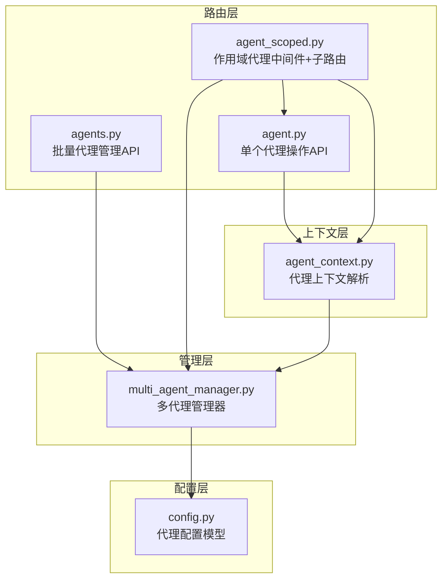
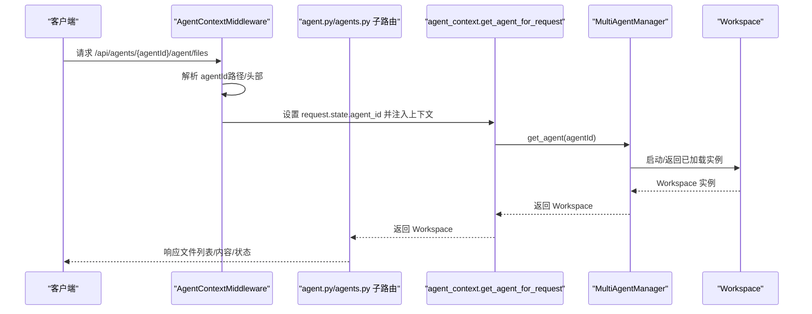
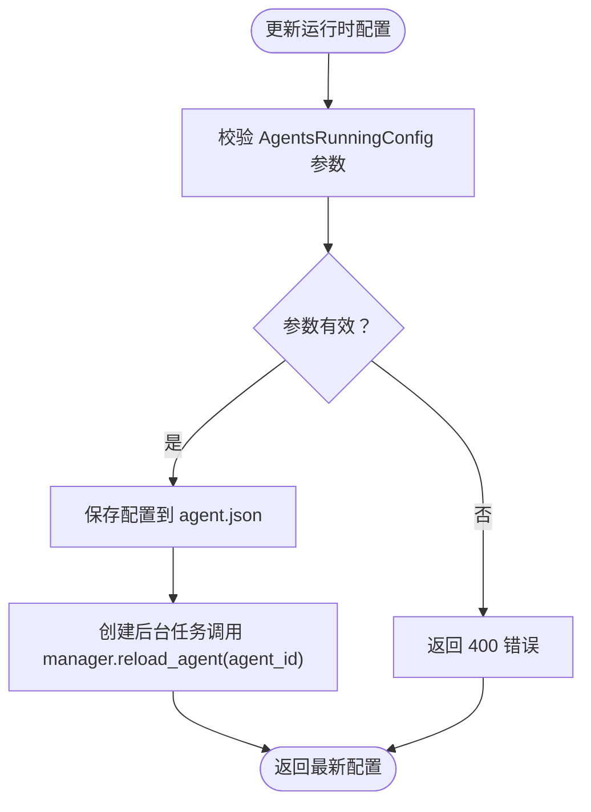
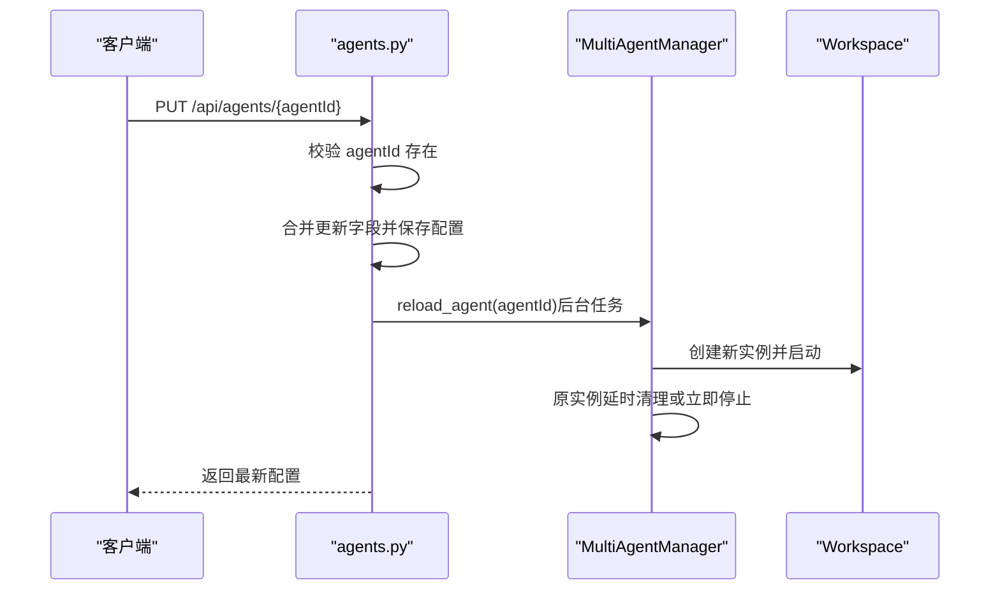
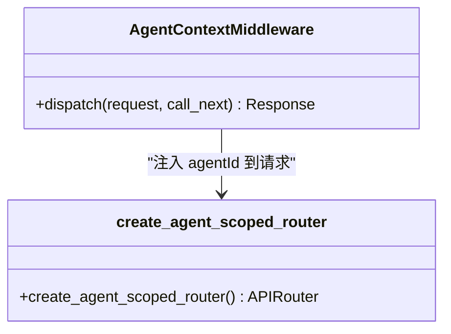
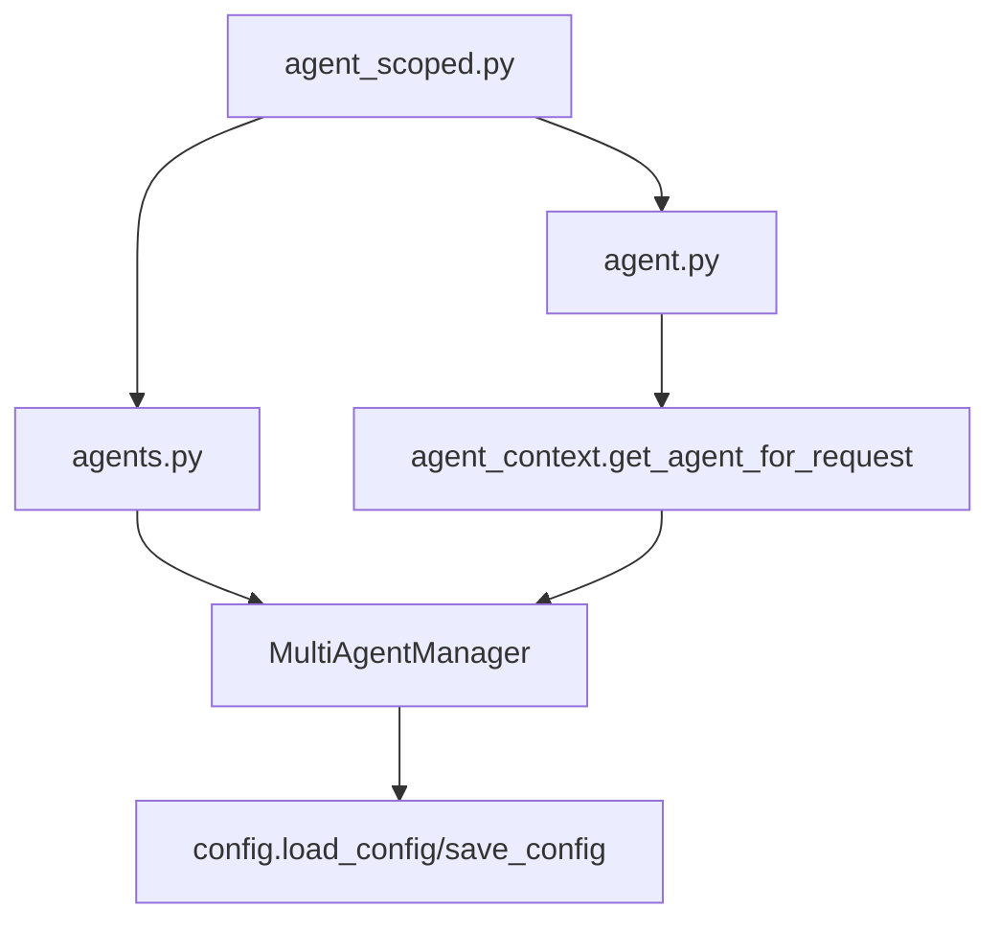

# 代理管理路由

<cite>
**本文档引用的文件**
- [agent.py](file://src/copaw/app/routers/agent.py)
- [agents.py](file://src/copaw/app/routers/agents.py)
- [agent_scoped.py](file://src/copaw/app/routers/agent_scoped.py)
- [multi_agent_manager.py](file://src/copaw/app/multi_agent_manager.py)
- [agent_context.py](file://src/copaw/app/agent_context.py)
- [_app.py](file://src/copaw/app/_app.py)
- [config.py](file://src/copaw/config/config.py)
- [multi-agent.en.md](file://website/public/docs/multi-agent.en.md)
- [agent.ts](file://console/src/api/types/agent.ts)
</cite>

## 目录
1. [简介](#简介)
2. [项目结构](#项目结构)
3. [核心组件](#核心组件)
4. [架构总览](#架构总览)
5. [详细组件分析](#详细组件分析)
6. [依赖关系分析](#依赖关系分析)
7. [性能考虑](#性能考虑)
8. [故障排除指南](#故障排除指南)
9. [结论](#结论)

## 简介
本文件为 CoPaw 代理管理路由模块的技术文档，聚焦以下三个路由模块：
- 单个代理操作 API：提供与当前激活代理或通过上下文注入的特定代理进行交互的端点，包括工作区文件读写、内存文件读写、语言设置、运行时配置热更新、系统提示文件列表等。
- 批量代理管理 API：提供对多个代理实例的统一管理能力，包括列出、创建、更新、删除代理，以及访问各代理的工作区文件与内存文件。
- 作用域代理 API：通过中间件将代理上下文注入到请求中，使下游所有 API 可以基于指定代理 ID 进行操作。

文档将详细说明 HTTP 端点、请求参数校验、响应数据结构、错误处理机制，并结合零停机重载、代理状态监控等核心业务逻辑，给出参数说明、响应格式、错误码定义与实际使用案例。

## 项目结构
代理管理路由位于应用层路由模块中，采用按功能分层的组织方式：
- 路由层：单个代理 API、批量代理 API、作用域代理中间件与子路由挂载
- 上下文层：代理上下文解析与注入
- 管理层：多代理管理器负责代理实例的生命周期与零停机重载
- 配置层：代理配置模型与全局配置加载

图表来源
- [agent.py:1-533](file://src/copaw/app/routers/agent.py#L1-L533)
- [agents.py:1-620](file://src/copaw/app/routers/agents.py#L1-L620)
- [agent_scoped.py:1-92](file://src/copaw/app/routers/agent_scoped.py#L1-L92)
- [agent_context.py:1-118](file://src/copaw/app/agent_context.py#L1-L118)
- [multi_agent_manager.py:1-451](file://src/copaw/app/multi_agent_manager.py#L1-L451)
- [config.py:1-200](file://src/copaw/config/config.py#L1-L200)

章节来源
- [agent.py:1-533](file://src/copaw/app/routers/agent.py#L1-L533)
- [agents.py:1-620](file://src/copaw/app/routers/agents.py#L1-L620)
- [agent_scoped.py:1-92](file://src/copaw/app/routers/agent_scoped.py#L1-L92)
- [agent_context.py:1-118](file://src/copaw/app/agent_context.py#L1-L118)
- [multi_agent_manager.py:1-451](file://src/copaw/app/multi_agent_manager.py#L1-L451)
- [config.py:1-200](file://src/copaw/config/config.py#L1-L200)

## 核心组件
- 单个代理 API（agent.py）
  - 工作区文件：列出/读取/写入工作区 Markdown 文件
  - 内存文件：列出/读取/写入内存 Markdown 文件
  - 语言设置：获取/更新代理语言（支持 zh/en/ru），并可按需复制对应语言的 MD 文件
  - 音频模式：获取/更新音频处理模式（auto/native）
  - 音频转写：获取/设置转写提供者类型（disabled/whisper_api/local_whisper）、转写提供者 ID；检查本地 Whisper 可用性；列出可用转写提供者
  - 运行时配置：获取/更新 AgentsRunningConfig，触发后台热重载
  - 系统提示文件：获取/更新系统提示 Markdown 文件列表，触发后台热重载
- 批量代理 API（agents.py）
  - 列出所有代理，合并 PROFILE.md 描述
  - 获取/创建/更新/删除代理
  - 访问指定代理的工作区文件与内存文件
  - 初始化代理工作区（复制默认 MD 文件、技能、心跳清单、空 JSON 文件）
- 作用域代理 API（agent_scoped.py）
  - 中间件优先从路径提取 agentId，其次从 X-Agent-Id 头部获取
  - 将 agentId 注入 request.state 并设置到上下文变量，供下游 API 使用
  - 统一挂载 agent、skills、tools、config、mcp、workspace、cron、chats、console 等子路由

章节来源
- [agent.py:40-533](file://src/copaw/app/routers/agent.py#L40-L533)
- [agents.py:124-620](file://src/copaw/app/routers/agents.py#L124-L620)
- [agent_scoped.py:15-92](file://src/copaw/app/routers/agent_scoped.py#L15-L92)

## 架构总览
代理管理路由通过中间件注入代理上下文，使下游 API 能够在无显式 agentId 的情况下自动定位当前代理。多代理管理器负责代理实例的懒加载、启动、停止与零停机重载。配置层提供代理配置模型与全局配置加载。

图表来源
- [agent_scoped.py:15-51](file://src/copaw/app/routers/agent_scoped.py#L15-L51)
- [agent_context.py:22-84](file://src/copaw/app/agent_context.py#L22-L84)
- [multi_agent_manager.py:34-82](file://src/copaw/app/multi_agent_manager.py#L34-L82)

章节来源
- [_app.py:149-200](file://src/copaw/app/_app.py#L149-L200)
- [agent_scoped.py:53-92](file://src/copaw/app/routers/agent_scoped.py#L53-L92)
- [agent_context.py:1-118](file://src/copaw/app/agent_context.py#L1-L118)
- [multi_agent_manager.py:1-451](file://src/copaw/app/multi_agent_manager.py#L1-L451)

## 详细组件分析

### 单个代理操作 API（agent.py）

- 端点设计
  - 工作区文件
    - GET /api/agent/files → 列出工作区 Markdown 文件
    - GET /api/agent/files/{md_name} → 读取工作区 Markdown 文件
    - PUT /api/agent/files/{md_name} → 写入工作区 Markdown 文件
  - 内存文件
    - GET /api/agent/memory → 列出内存 Markdown 文件
    - GET /api/agent/memory/{md_name} → 读取内存 Markdown 文件
    - PUT /api/agent/memory/{md_name} → 写入内存 Markdown 文件
  - 语言设置
    - GET /api/agent/language → 获取代理语言
    - PUT /api/agent/language → 更新代理语言（校验 zh/en/ru，必要时复制对应语言 MD 文件）
  - 音频模式
    - GET /api/agent/audio-mode → 获取音频模式
    - PUT /api/agent/audio-mode → 更新音频模式（校验 auto/native）
  - 转写提供者
    - GET /api/agent/transcription-provider-type → 获取转写提供者类型
    - PUT /api/agent/transcription-provider-type → 设置转写提供者类型（校验 disabled/whisper_api/local_whisper）
    - GET /api/agent/local-whisper-status → 检查本地 Whisper 可用性
    - GET /api/agent/transcription-providers → 列出可用转写提供者及当前配置
    - PUT /api/agent/transcription-provider → 设置转写提供者 ID（可清空）
  - 运行时配置
    - GET /api/agent/running-config → 获取 AgentsRunningConfig
    - PUT /api/agent/running-config → 更新 AgentsRunningConfig，异步触发后台热重载
  - 系统提示文件
    - GET /api/agent/system-prompt-files → 获取系统提示文件列表
    - PUT /api/agent/system-prompt-files → 更新系统提示文件列表，异步触发后台热重载

- 请求参数与响应
  - 文件元数据模型 MdFileInfo：包含 filename、path、size、created_time、modified_time
  - 文件内容模型 MdFileContent：包含 content 字段
  - AgentsRunningConfig：运行时配置字段集合（最大迭代次数、LLM 重试策略、输入长度限制、内存压缩策略等）
  - 语言设置：PUT 体包含 language 字段，返回 language、copied_files、agent_id
  - 音频模式/转写提供者：PUT 体包含相应字段，返回更新后的值
  - 运行时配置/系统提示文件：PUT 体为完整对象或数组，返回更新后的对象/数组

- 错误处理
  - 400：参数无效（如语言不在允许集合、音频模式不在允许集合、转写提供者类型不在允许集合）
  - 404：文件未找到（读取文件时）
  - 500：内部异常（通用异常捕获）

- 零停机重载
  - 运行时配置与系统提示文件更新后，通过后台任务触发 MultiAgentManager.reload_agent(agent_id)，确保新实例立即生效，旧实例在无活跃任务时立即停止，有活跃任务则延时清理，保证流式/事件推送不中断。

图表来源
- [agent.py:444-480](file://src/copaw/app/routers/agent.py#L444-L480)
- [multi_agent_manager.py:200-312](file://src/copaw/app/multi_agent_manager.py#L200-L312)

章节来源
- [agent.py:40-533](file://src/copaw/app/routers/agent.py#L40-L533)
- [agent.ts:9-22](file://console/src/api/types/agent.ts#L9-L22)

### 批量代理管理 API（agents.py）

- 端点设计
  - 列出代理：GET /api/agents → 返回 AgentListResponse（agents: AgentSummary[]）
  - 获取代理详情：GET /api/agents/{agentId} → 返回 AgentProfileConfig
  - 创建代理：POST /api/agents → 返回 AgentProfileRef（包含生成的 agent_id 与 workspace_dir）
  - 更新代理：PUT /api/agents/{agentId} → 返回 AgentProfileConfig，触发后台热重载
  - 删除代理：DELETE /api/agents/{agentId} → 返回成功状态，停止运行中的实例并移除配置
  - 访问代理工作区文件
    - GET /api/agents/{agentId}/files → 列出工作区 Markdown 文件
    - GET /api/agents/{agentId}/files/{filename} → 读取工作区 Markdown 文件
    - PUT /api/agents/{agentId}/files/{filename} → 写入工作区 Markdown 文件
  - 访问代理内存文件
    - GET /api/agents/{agentId}/memory → 列出内存 Markdown 文件
  - 初始化代理工作区：_initialize_agent_workspace（复制默认 MD 文件、技能、心跳清单、空 JSON 文件）

- 数据模型
  - AgentSummary：id、name、description、workspace_dir
  - AgentListResponse：agents
  - CreateAgentRequest：name、description、workspace_dir、language
  - AgentProfileConfig：代理完整配置（含 channels、mcp、heartbeat、tools、running、system_prompt_files 等）

- 错误处理
  - 404：代理不存在（获取/读取文件时）
  - 400：不可删除 default 代理
  - 500：内部异常（通用异常捕获）

- 零停机重载
  - 更新代理配置后，通过后台任务触发 MultiAgentManager.reload_agent(agent_id)，实现无缝切换。

图表来源
- [agents.py:267-316](file://src/copaw/app/routers/agents.py#L267-L316)
- [multi_agent_manager.py:200-312](file://src/copaw/app/multi_agent_manager.py#L200-L312)

章节来源
- [agents.py:124-620](file://src/copaw/app/routers/agents.py#L124-L620)
- [config.py:461-1008](file://src/copaw/config/config.py#L461-L1008)

### 作用域代理 API（agent_scoped.py）

- 设计目标
  - 通过中间件将 agentId 注入到请求上下文中，使下游所有 API（agent、skills、tools、config、mcp、workspace、cron、chats、console）无需显式传参即可访问指定代理
  - 支持两种注入方式：路径优先（/api/agents/{agentId}/...），其次头部（X-Agent-Id）

- 中间件行为
  - 从路径解析 agentId 并写入 request.state.agent_id
  - 从 X-Agent-Id 头部回退
  - 设置上下文变量，供动态运行器与其它组件使用

- 子路由挂载
  - 统一前缀 /api/agents/{agentId}
  - 包含 agent、skills、tools、config、mcp、workspace、cron、chats、console 等子路由

图表来源
- [agent_scoped.py:15-92](file://src/copaw/app/routers/agent_scoped.py#L15-L92)

章节来源
- [agent_scoped.py:1-92](file://src/copaw/app/routers/agent_scoped.py#L1-L92)
- [agent_context.py:1-118](file://src/copaw/app/agent_context.py#L1-L118)

## 依赖关系分析

图表来源
- [agent.py:1-533](file://src/copaw/app/routers/agent.py#L1-L533)
- [agents.py:1-620](file://src/copaw/app/routers/agents.py#L1-L620)
- [agent_scoped.py:1-92](file://src/copaw/app/routers/agent_scoped.py#L1-L92)
- [agent_context.py:1-118](file://src/copaw/app/agent_context.py#L1-L118)
- [multi_agent_manager.py:1-451](file://src/copaw/app/multi_agent_manager.py#L1-L451)
- [config.py:1-200](file://src/copaw/config/config.py#L1-L200)

章节来源
- [agent.py:1-533](file://src/copaw/app/routers/agent.py#L1-L533)
- [agents.py:1-620](file://src/copaw/app/routers/agents.py#L1-L620)
- [agent_scoped.py:1-92](file://src/copaw/app/routers/agent_scoped.py#L1-L92)
- [agent_context.py:1-118](file://src/copaw/app/agent_context.py#L1-L118)
- [multi_agent_manager.py:1-451](file://src/copaw/app/multi_agent_manager.py#L1-L451)
- [config.py:1-200](file://src/copaw/config/config.py#L1-L200)

## 性能考虑
- 懒加载与并发启动：多代理管理器在首次请求时才创建并启动代理实例，支持并发预加载所有已配置代理，减少冷启动延迟。
- 零停机重载：仅在原子替换实例时持有锁，其余步骤（创建新实例、旧实例清理）均在无锁状态下执行，最小化阻塞时间。
- 异步热重载：配置更新通过后台任务触发，避免阻塞主请求线程。
- 文件 I/O：工作区/内存文件读写封装在 AgentMdManager 中，异常统一转换为 HTTP 错误码。

## 故障排除指南
- 400 错误
  - 语言设置：language 不在允许集合（zh/en/ru）
  - 音频模式：audio_mode 不在允许集合（auto/native）
  - 转写提供者类型：transcription_provider_type 不在允许集合（disabled/whisper_api/local_whisper）
- 404 错误
  - 代理不存在：GET /api/agents/{agentId} 或读取代理文件时
  - 文件不存在：读取工作区/内存文件时
- 500 错误
  - 多代理管理器未初始化
  - 代理实例启动失败
  - 其他未捕获异常

章节来源
- [agent.py:215-224](file://src/copaw/app/routers/agent.py#L215-L224)
- [agent.py:294-304](file://src/copaw/app/routers/agent.py#L294-L304)
- [agent.py:350-359](file://src/copaw/app/routers/agent.py#L350-L359)
- [agents.py:330-340](file://src/copaw/app/routers/agents.py#L330-L340)
- [agents.py:370-416](file://src/copaw/app/routers/agents.py#L370-L416)
- [agent_context.py:62-83](file://src/copaw/app/agent_context.py#L62-L83)

## 结论
代理管理路由模块通过清晰的职责分离与中间件注入机制，实现了对单个代理与多代理实例的统一管理。其核心特性包括：
- 代理上下文自动解析与注入，简化下游 API 使用
- 零停机重载保障配置变更的平滑过渡
- 完整的 CRUD 与文件管理能力，覆盖代理配置、工作区与内存文件
- 严格的参数校验与错误处理，提升系统稳定性

建议在生产环境中配合健康检查与可观测性工具，持续监控代理实例状态与重载成功率，确保服务高可用。