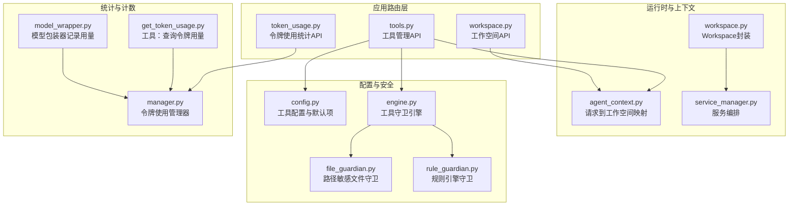
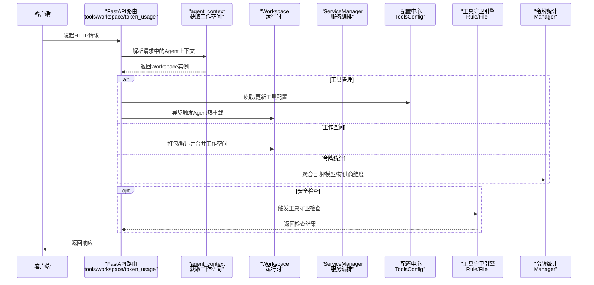
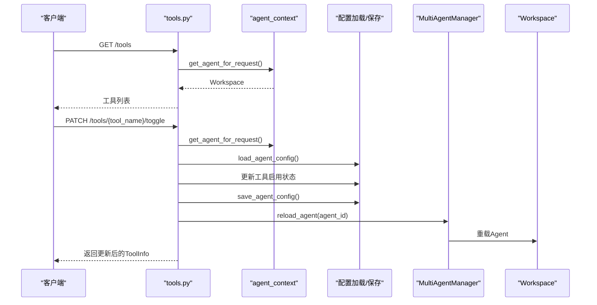
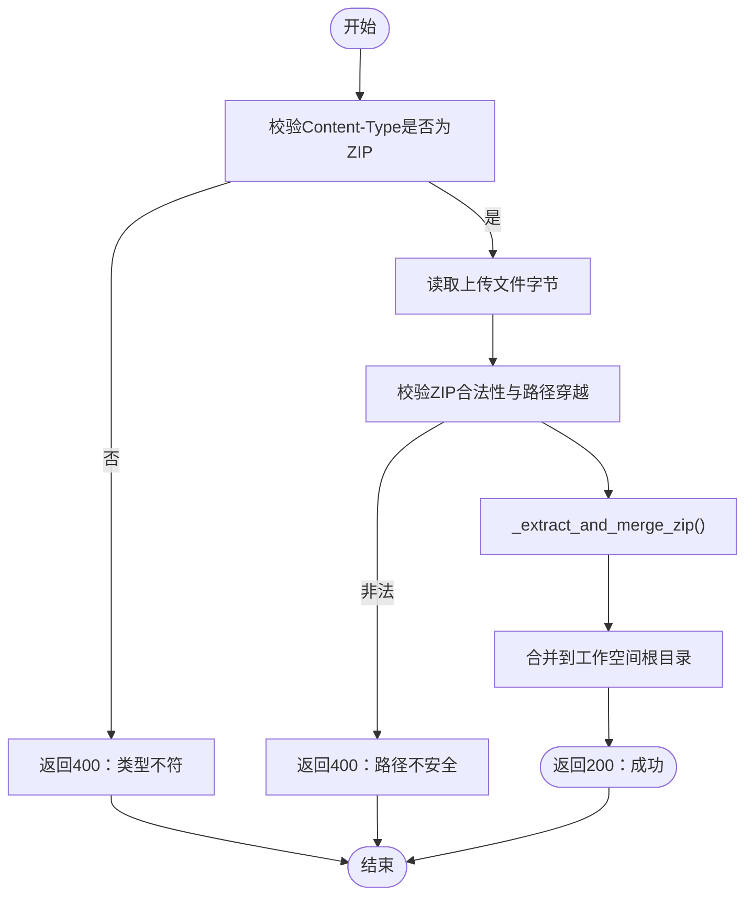
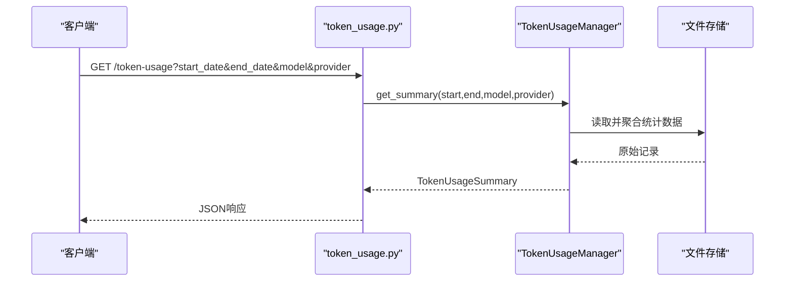
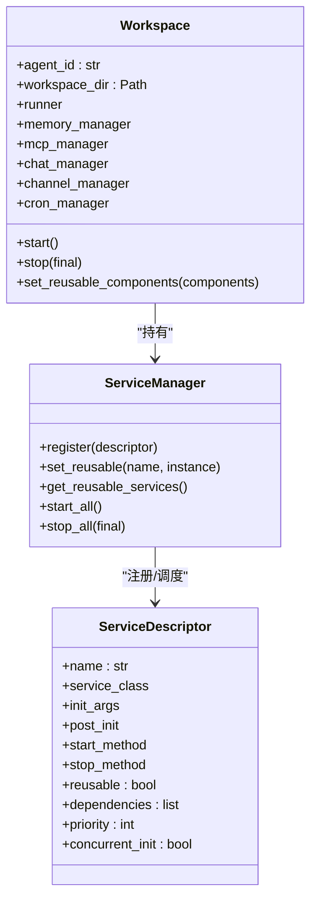
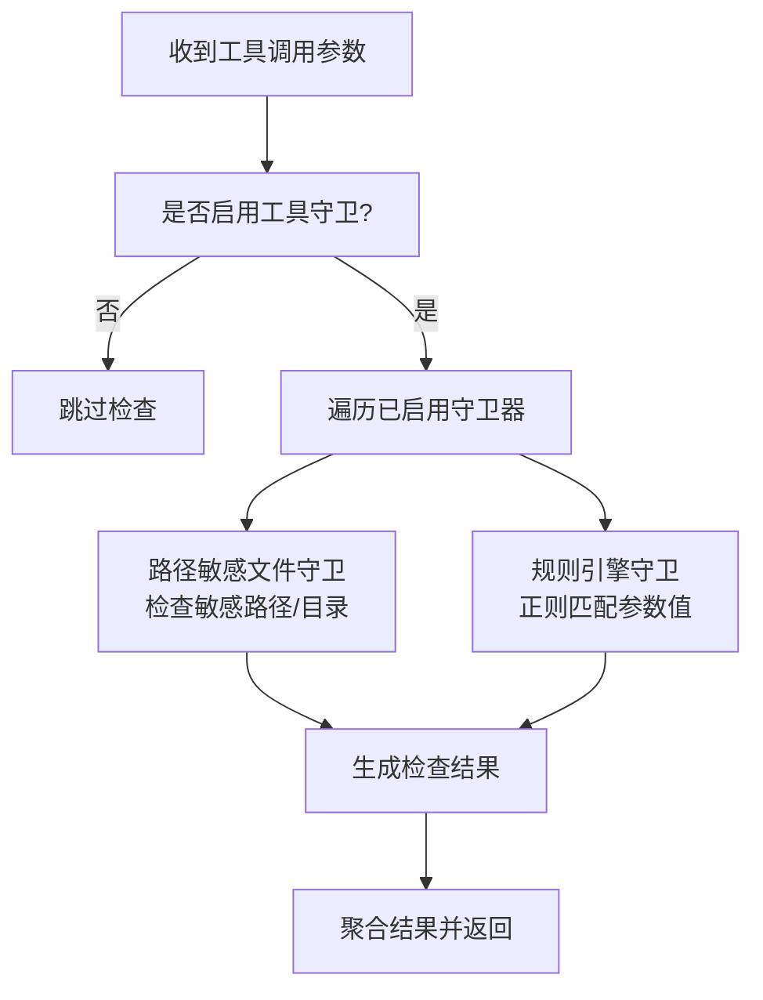
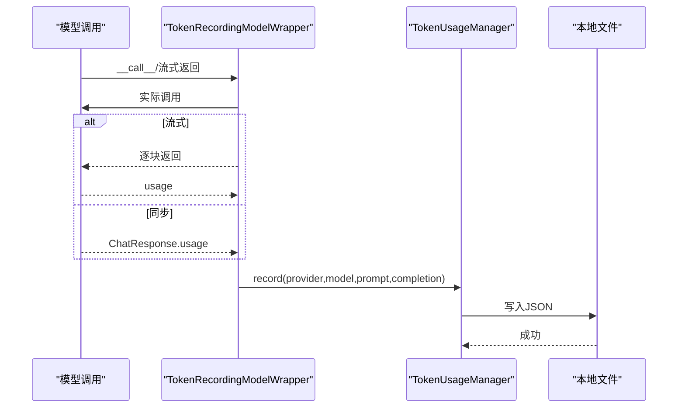
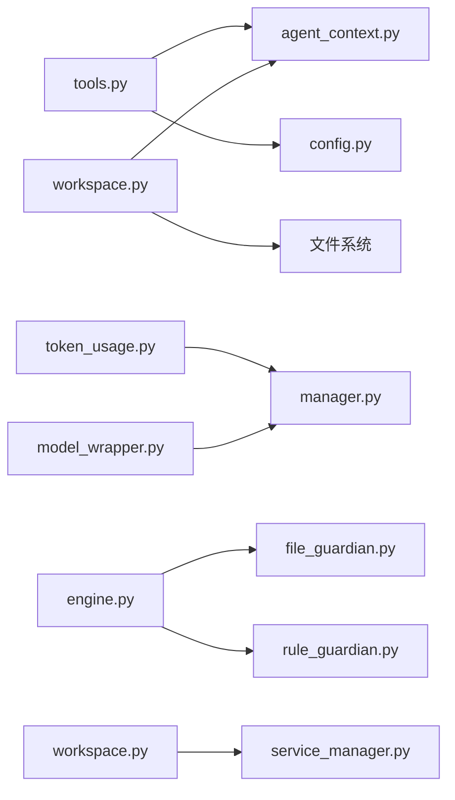

# 工作空间工具路由

<cite>
**本文引用的文件**
- [tools.py](file://src/copaw/app/routers/tools.py)
- [workspace.py](file://src/copaw/app/routers/workspace.py)
- [token_usage.py](file://src/copaw/app/routers/token_usage.py)
- [workspace.py](file://src/copaw/app/workspace/workspace.py)
- [service_manager.py](file://src/copaw/app/workspace/service_manager.py)
- [agent_context.py](file://src/copaw/app/agent_context.py)
- [config.py](file://src/copaw/config/config.py)
- [manager.py](file://src/copaw/token_usage/manager.py)
- [model_wrapper.py](file://src/copaw/token_usage/model_wrapper.py)
- [__init__.py](file://src/copaw/agents/tools/__init__.py)
- [get_token_usage.py](file://src/copaw/agents/tools/get_token_usage.py)
- [engine.py](file://src/copaw/security/tool_guard/engine.py)
- [file_guardian.py](file://src/copaw/security/tool_guard/guardians/file_guardian.py)
- [rule_guardian.py](file://src/copaw/security/tool_guard/guardians/rule_guardian.py)
</cite>

## 目录
1. [简介](#简介)
2. [项目结构](#项目结构)
3. [核心组件](#核心组件)
4. [架构总览](#架构总览)
5. [详细组件分析](#详细组件分析)
6. [依赖分析](#依赖分析)
7. [性能考虑](#性能考虑)
8. [故障排查指南](#故障排查指南)
9. [结论](#结论)
10. [附录](#附录)

## 简介
本文件面向CoPaw工作空间工具路由模块，系统性梳理工具管理API（tools.py）、工作空间管理API（workspace.py）与令牌使用统计API（token_usage.py）的设计与实现。文档覆盖以下要点：
- 工具注册、配置与启用/禁用的API设计与实现细节
- 工作空间文件打包下载与ZIP上传合并的流程与安全校验
- 令牌使用统计的数据模型、聚合逻辑与查询接口
- 安全控制：工具调用守卫（路径敏感文件与规则引擎）
- 工作空间隔离与数据持久化策略
- API参数规范、响应格式、错误处理与性能监控最佳实践

## 项目结构
工作空间工具路由位于后端应用层，围绕FastAPI路由组织，配合配置中心、工作空间运行时与安全守卫共同完成工具与资源的统一管理。

图表来源
- [tools.py:1-133](file://src/copaw/app/routers/tools.py#L1-L133)
- [workspace.py:1-203](file://src/copaw/app/routers/workspace.py#L1-L203)
- [token_usage.py:1-62](file://src/copaw/app/routers/token_usage.py#L1-L62)
- [agent_context.py:1-118](file://src/copaw/app/agent_context.py#L1-L118)
- [workspace.py:1-367](file://src/copaw/app/workspace/workspace.py#L1-L367)
- [service_manager.py:1-415](file://src/copaw/app/workspace/service_manager.py#L1-L415)
- [config.py:692-791](file://src/copaw/config/config.py#L692-L791)
- [engine.py:1-238](file://src/copaw/security/tool_guard/engine.py#L1-L238)
- [file_guardian.py:1-342](file://src/copaw/security/tool_guard/guardians/file_guardian.py#L1-L342)
- [rule_guardian.py:1-383](file://src/copaw/security/tool_guard/guardians/rule_guardian.py#L1-L383)
- [manager.py:1-309](file://src/copaw/token_usage/manager.py#L1-L309)
- [model_wrapper.py:1-71](file://src/copaw/token_usage/model_wrapper.py#L1-L71)
- [get_token_usage.py:1-86](file://src/copaw/agents/tools/get_token_usage.py#L1-L86)

章节来源
- [tools.py:1-133](file://src/copaw/app/routers/tools.py#L1-L133)
- [workspace.py:1-203](file://src/copaw/app/routers/workspace.py#L1-L203)
- [token_usage.py:1-62](file://src/copaw/app/routers/token_usage.py#L1-L62)
- [agent_context.py:1-118](file://src/copaw/app/agent_context.py#L1-L118)
- [workspace.py:1-367](file://src/copaw/app/workspace/workspace.py#L1-L367)
- [service_manager.py:1-415](file://src/copaw/app/workspace/service_manager.py#L1-L415)
- [config.py:692-791](file://src/copaw/config/config.py#L692-L791)
- [engine.py:1-238](file://src/copaw/security/tool_guard/engine.py#L1-L238)
- [file_guardian.py:1-342](file://src/copaw/security/tool_guard/guardians/file_guardian.py#L1-L342)
- [rule_guardian.py:1-383](file://src/copaw/security/tool_guard/guardians/rule_guardian.py#L1-L383)
- [manager.py:1-309](file://src/copaw/token_usage/manager.py#L1-L309)
- [model_wrapper.py:1-71](file://src/copaw/token_usage/model_wrapper.py#L1-L71)
- [get_token_usage.py:1-86](file://src/copaw/agents/tools/get_token_usage.py#L1-L86)

## 核心组件
- 工具管理API（tools.py）
  - 列出内置工具及其启用状态
  - 按工具名切换启用状态，并异步热重载对应Agent
- 工作空间API（workspace.py）
  - 下载当前Agent工作空间为ZIP流式返回
  - 上传ZIP并合并到工作空间，含路径穿越校验与阻断
- 令牌使用统计API（token_usage.py）
  - 查询指定日期范围内的令牌使用汇总，支持按模型与提供商过滤
- 工作空间运行时（workspace.py + service_manager.py）
  - Workspace封装独立Agent运行时，统一注册与启动服务
  - ServiceManager按优先级并发/顺序启动服务，支持可复用组件热重载
- 配置与工具定义（config.py）
  - 内置工具清单与默认启用状态
- 安全守卫（engine.py + file_guardian.py + rule_guardian.py）
  - 规则引擎与路径敏感文件守卫，拦截高危工具调用
- 统计与计数（manager.py + model_wrapper.py + get_token_usage.py）
  - 文件级持久化统计、模型调用包装器自动记录、工具查询汇总

章节来源
- [tools.py:21-133](file://src/copaw/app/routers/tools.py#L21-L133)
- [workspace.py:112-203](file://src/copaw/app/routers/workspace.py#L112-L203)
- [token_usage.py:23-62](file://src/copaw/app/routers/token_usage.py#L23-L62)
- [workspace.py:39-367](file://src/copaw/app/workspace/workspace.py#L39-L367)
- [service_manager.py:74-415](file://src/copaw/app/workspace/service_manager.py#L74-L415)
- [config.py:692-791](file://src/copaw/config/config.py#L692-L791)
- [engine.py:53-238](file://src/copaw/security/tool_guard/engine.py#L53-L238)
- [file_guardian.py:161-342](file://src/copaw/security/tool_guard/guardians/file_guardian.py#L161-L342)
- [rule_guardian.py:280-383](file://src/copaw/security/tool_guard/guardians/rule_guardian.py#L280-L383)
- [manager.py:62-309](file://src/copaw/token_usage/manager.py#L62-L309)
- [model_wrapper.py:15-71](file://src/copaw/token_usage/model_wrapper.py#L15-L71)
- [get_token_usage.py:12-86](file://src/copaw/agents/tools/get_token_usage.py#L12-L86)

## 架构总览
下图展示从HTTP请求到工作空间与安全控制的整体交互：

图表来源
- [tools.py:29-133](file://src/copaw/app/routers/tools.py#L29-L133)
- [workspace.py:126-203](file://src/copaw/app/routers/workspace.py#L126-L203)
- [token_usage.py:28-62](file://src/copaw/app/routers/token_usage.py#L28-L62)
- [agent_context.py:22-84](file://src/copaw/app/agent_context.py#L22-L84)
- [workspace.py:311-358](file://src/copaw/app/workspace/workspace.py#L311-L358)
- [service_manager.py:171-323](file://src/copaw/app/workspace/service_manager.py#L171-L323)
- [config.py:777-791](file://src/copaw/config/config.py#L777-L791)
- [engine.py:169-227](file://src/copaw/security/tool_guard/engine.py#L169-L227)
- [manager.py:198-294](file://src/copaw/token_usage/manager.py#L198-L294)

## 详细组件分析

### 工具管理API（tools.py）
- 接口职责
  - 列出当前Agent的内置工具清单及启用状态
  - 按工具名切换启用状态，并持久化配置，随后异步热重载Agent
- 关键流程
  - 获取当前Agent工作空间
  - 读取Agent配置或回退至全局配置中的工具定义
  - 更新工具启用状态并保存配置
  - 后台任务触发多Agent管理器的Agent重载
- 数据模型
  - ToolInfo：包含名称、启用状态与描述
- 错误处理
  - 未找到工具时返回404
- 性能与并发
  - 配置更新与热重载采用异步后台任务，避免阻塞请求线程

图表来源
- [tools.py:29-133](file://src/copaw/app/routers/tools.py#L29-L133)
- [agent_context.py:22-84](file://src/copaw/app/agent_context.py#L22-L84)
- [config.py:777-791](file://src/copaw/config/config.py#L777-L791)

章节来源
- [tools.py:21-133](file://src/copaw/app/routers/tools.py#L21-L133)
- [agent_context.py:22-84](file://src/copaw/app/agent_context.py#L22-L84)
- [config.py:692-791](file://src/copaw/config/config.py#L692-L791)

### 工作空间API（workspace.py）
- 接口职责
  - 下载：将Agent工作空间打包为ZIP并通过StreamingResponse流式返回
  - 上传：接收ZIP并合并到工作空间，严格校验路径安全性
- 关键流程
  - 下载：在异步线程中递归扫描目录并写入内存ZIP缓冲区，设置合适的Content-Disposition
  - 上传：校验内容类型与ZIP有效性，解析并解压到临时目录，再合并到目标工作空间
- 安全控制
  - 路径穿越检测：确保ZIP内路径不越权指向工作空间之外
  - 合并策略：文件覆盖、目录递归合并，保留非ZIP路径的现有文件
- 错误处理
  - 非法ZIP、类型不符、解压失败、合并异常均转换为HTTP异常

图表来源
- [workspace.py:126-203](file://src/copaw/app/routers/workspace.py#L126-L203)
- [workspace.py:56-105](file://src/copaw/app/routers/workspace.py#L56-L105)

章节来源
- [workspace.py:112-203](file://src/copaw/app/routers/workspace.py#L112-L203)

### 令牌使用统计API（token_usage.py）
- 接口职责
  - 查询指定日期范围内的令牌使用汇总，支持按模型与提供商过滤
- 关键流程
  - 参数解析：YYYY-MM-DD字符串转date，默认30天窗口
  - 调用TokenUsageManager聚合统计，返回TokenUsageSummary
- 数据模型
  - TokenUsageSummary：包含总量与按模型、提供商、日期的聚合视图

图表来源
- [token_usage.py:28-62](file://src/copaw/app/routers/token_usage.py#L28-L62)
- [manager.py:198-294](file://src/copaw/token_usage/manager.py#L198-L294)

章节来源
- [token_usage.py:13-62](file://src/copaw/app/routers/token_usage.py#L13-L62)
- [manager.py:62-309](file://src/copaw/token_usage/manager.py#L62-L309)

### 工作空间运行时与服务编排（workspace.py + service_manager.py）
- Workspace
  - 将Runner、MemoryManager、MCPClientManager、ChatManager、ChannelManager、CronManager等组件封装为独立运行时
  - 提供start/stop生命周期管理，支持可复用组件热重载
- ServiceManager
  - 通过ServiceDescriptor声明式注册服务，按优先级与并发策略启动/停止
  - 支持可复用组件标记与迁移，避免重启带来的资源重建

图表来源
- [workspace.py:39-367](file://src/copaw/app/workspace/workspace.py#L39-L367)
- [service_manager.py:30-415](file://src/copaw/app/workspace/service_manager.py#L30-L415)

章节来源
- [workspace.py:39-367](file://src/copaw/app/workspace/workspace.py#L39-L367)
- [service_manager.py:74-415](file://src/copaw/app/workspace/service_manager.py#L74-L415)

### 安全控制：工具守卫（engine.py + file_guardian.py + rule_guardian.py）
- 工具守卫引擎
  - 默认启用，支持动态加载规则与敏感文件集合
  - 聚合多个守卫器（路径守卫、规则守卫）的结果
- 路径敏感文件守卫
  - 基于配置的敏感文件/目录白名单，阻断对敏感路径的访问
  - 对shell命令进行路径提取与匹配
- 规则引擎守卫
  - 加载YAML规则，基于正则匹配参数值，支持排除模式
  - 可通过配置禁用特定规则或添加自定义规则

图表来源
- [engine.py:169-227](file://src/copaw/security/tool_guard/engine.py#L169-L227)
- [file_guardian.py:290-342](file://src/copaw/security/tool_guard/guardians/file_guardian.py#L290-L342)
- [rule_guardian.py:329-383](file://src/copaw/security/tool_guard/guardians/rule_guardian.py#L329-L383)

章节来源
- [engine.py:53-238](file://src/copaw/security/tool_guard/engine.py#L53-L238)
- [file_guardian.py:161-342](file://src/copaw/security/tool_guard/guardians/file_guardian.py#L161-L342)
- [rule_guardian.py:280-383](file://src/copaw/security/tool_guard/guardians/rule_guardian.py#L280-L383)

### 令牌统计记录与查询（manager.py + model_wrapper.py + get_token_usage.py）
- 记录机制
  - 模型包装器在同步/流式调用后记录prompt/completion tokens与调用次数
  - 使用文件锁保证并发写入一致性
- 查询机制
  - 按日期范围聚合，支持按模型与提供商过滤
  - 输出按模型、提供商、日期的统计视图

图表来源
- [model_wrapper.py:40-71](file://src/copaw/token_usage/model_wrapper.py#L40-L71)
- [manager.py:110-156](file://src/copaw/token_usage/manager.py#L110-L156)

章节来源
- [manager.py:62-309](file://src/copaw/token_usage/manager.py#L62-L309)
- [model_wrapper.py:15-71](file://src/copaw/token_usage/model_wrapper.py#L15-L71)
- [get_token_usage.py:12-86](file://src/copaw/agents/tools/get_token_usage.py#L12-L86)

## 依赖分析
- 路由层依赖
  - tools.py依赖agent_context与配置中心，用于解析当前Agent并读写工具配置
  - workspace.py依赖agent_context与文件系统操作，负责工作空间打包与解压
  - token_usage.py依赖令牌统计管理器，提供聚合查询
- 运行时依赖
  - Workspace通过ServiceManager统一管理各子系统，支持可复用组件热重载
- 安全依赖
  - 工具守卫引擎聚合多个守卫器，规则与敏感文件配置来自配置中心
- 统计依赖
  - 模型包装器依赖令牌统计管理器；工具查询同样依赖管理器

图表来源
- [tools.py:1-133](file://src/copaw/app/routers/tools.py#L1-L133)
- [workspace.py:1-203](file://src/copaw/app/routers/workspace.py#L1-L203)
- [token_usage.py:1-62](file://src/copaw/app/routers/token_usage.py#L1-L62)
- [agent_context.py:1-118](file://src/copaw/app/agent_context.py#L1-L118)
- [config.py:692-791](file://src/copaw/config/config.py#L692-L791)
- [engine.py:1-238](file://src/copaw/security/tool_guard/engine.py#L1-L238)
- [file_guardian.py:1-342](file://src/copaw/security/tool_guard/guardians/file_guardian.py#L1-L342)
- [rule_guardian.py:1-383](file://src/copaw/security/tool_guard/guardians/rule_guardian.py#L1-L383)
- [manager.py:1-309](file://src/copaw/token_usage/manager.py#L1-L309)
- [model_wrapper.py:1-71](file://src/copaw/token_usage/model_wrapper.py#L1-L71)
- [workspace.py:1-367](file://src/copaw/app/workspace/workspace.py#L1-L367)
- [service_manager.py:1-415](file://src/copaw/app/workspace/service_manager.py#L1-L415)

章节来源
- [tools.py:1-133](file://src/copaw/app/routers/tools.py#L1-L133)
- [workspace.py:1-203](file://src/copaw/app/routers/workspace.py#L1-L203)
- [token_usage.py:1-62](file://src/copaw/app/routers/token_usage.py#L1-L62)
- [agent_context.py:1-118](file://src/copaw/app/agent_context.py#L1-L118)
- [config.py:692-791](file://src/copaw/config/config.py#L692-L791)
- [engine.py:1-238](file://src/copaw/security/tool_guard/engine.py#L1-L238)
- [file_guardian.py:1-342](file://src/copaw/security/tool_guard/guardians/file_guardian.py#L1-L342)
- [rule_guardian.py:1-383](file://src/copaw/security/tool_guard/guardians/rule_guardian.py#L1-L383)
- [manager.py:1-309](file://src/copaw/token_usage/manager.py#L1-L309)
- [model_wrapper.py:1-71](file://src/copaw/token_usage/model_wrapper.py#L1-L71)
- [workspace.py:1-367](file://src/copaw/app/workspace/workspace.py#L1-L367)
- [service_manager.py:1-415](file://src/copaw/app/workspace/service_manager.py#L1-L415)

## 性能考虑
- 异步I/O与并发
  - 工作空间下载与上传使用异步线程池执行阻塞操作，避免阻塞事件循环
  - 服务启动支持同优先级并发初始化，缩短冷启动时间
- 缓存与复用
  - 可复用组件（如MemoryManager、ChatManager）在热重载时直接迁移，减少重建成本
- 统计写入
  - 令牌统计采用文件锁与异步写入，降低竞争条件风险
- 安全检查
  - 守卫器在工具调用前快速扫描，避免高危参数进入执行阶段

[本节为通用指导，无需列出具体文件来源]

## 故障排查指南
- 工具管理
  - 404：工具名不存在或Agent未配置工具集
  - 热重载失败：查看后台日志，确认MultiAgentManager可用且Agent存在
- 工作空间
  - 400：上传文件类型不符或ZIP无效
  - 路径穿越：确保ZIP内路径不越权，如出现“unsafe path”提示需修正压缩包
  - 500：合并失败通常由磁盘权限或临时目录问题导致
- 令牌统计
  - 查询无数据：确认统计文件是否存在，或检查日期范围是否正确
  - 记录失败：检查文件写入权限与磁盘空间
- 安全控制
  - 工具被阻断：检查敏感文件配置与规则文件，必要时调整或临时关闭守卫

章节来源
- [tools.py:95-105](file://src/copaw/app/routers/tools.py#L95-L105)
- [workspace.py:56-105](file://src/copaw/app/routers/workspace.py#L56-L105)
- [manager.py:73-109](file://src/copaw/token_usage/manager.py#L73-L109)

## 结论
本模块以清晰的路由分层、强隔离的工作空间运行时与完善的工具守卫体系，实现了工具管理、工作空间文件操作与令牌统计的统一入口。通过异步与并发优化、可复用组件热重载以及严格的路径与规则安全控制，既保证了易用性也兼顾了安全性与性能。

[本节为总结性内容，无需列出具体文件来源]

## 附录

### API参数规范与响应格式
- 工具管理
  - GET /tools：返回工具信息数组（名称、启用状态、描述）
  - PATCH /tools/{tool_name}/toggle：返回ToolInfo对象
- 工作空间
  - GET /workspace/download：返回application/zip流，文件名为包含agent_id与时间戳
  - POST /workspace/upload：接收multipart/form-data，字段为zip文件；成功返回{"success": true}
- 令牌使用统计
  - GET /token-usage：查询参数start_date、end_date、model、provider；返回TokenUsageSummary

章节来源
- [tools.py:29-133](file://src/copaw/app/routers/tools.py#L29-L133)
- [workspace.py:112-203](file://src/copaw/app/routers/workspace.py#L112-L203)
- [token_usage.py:23-62](file://src/copaw/app/routers/token_usage.py#L23-L62)

### 工具调用示例与最佳实践
- 工具调用
  - 使用工具守卫引擎对高危参数进行预检，建议在调用前先执行guard
  - 对shell命令参数进行路径提取与敏感文件检查
- 工作空间操作
  - 下载前确认工作空间目录存在；上传前校验ZIP合法性与内容类型
  - 合并策略会覆盖同名文件，谨慎处理重要配置文件
- 使用量统计
  - 通过模型包装器自动记录，查询时按需过滤模型与提供商
  - 建议定期清理旧统计文件，避免磁盘占用增长

章节来源
- [engine.py:169-227](file://src/copaw/security/tool_guard/engine.py#L169-L227)
- [file_guardian.py:290-342](file://src/copaw/security/tool_guard/guardians/file_guardian.py#L290-L342)
- [rule_guardian.py:329-383](file://src/copaw/security/tool_guard/guardians/rule_guardian.py#L329-L383)
- [workspace.py:153-203](file://src/copaw/app/routers/workspace.py#L153-L203)
- [model_wrapper.py:40-71](file://src/copaw/token_usage/model_wrapper.py#L40-L71)