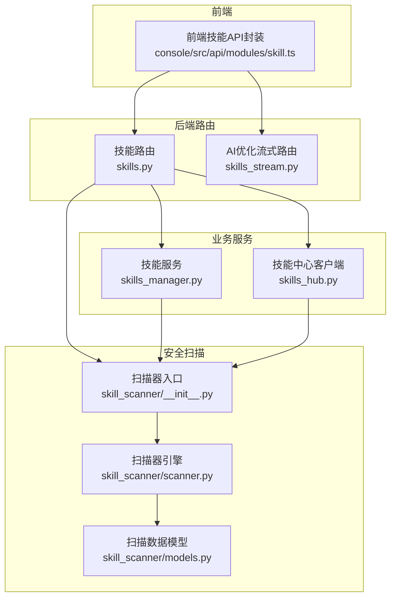
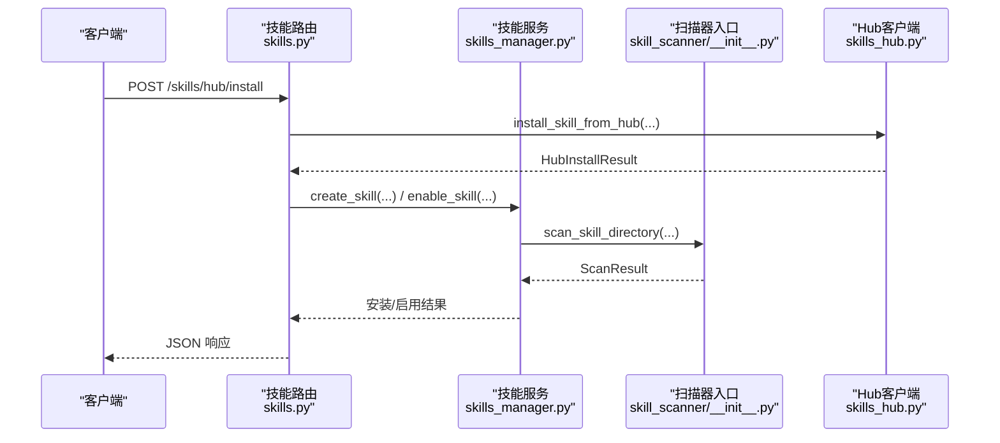
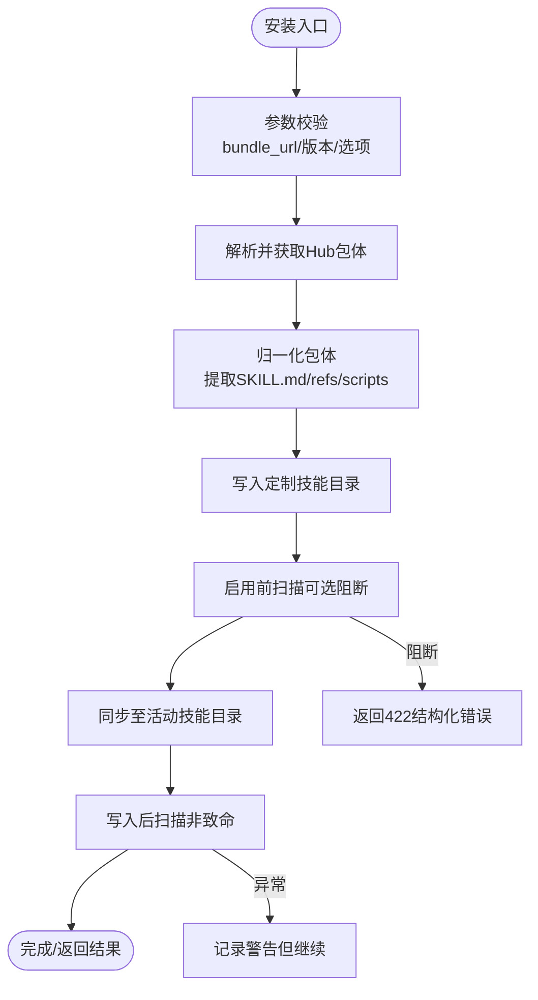
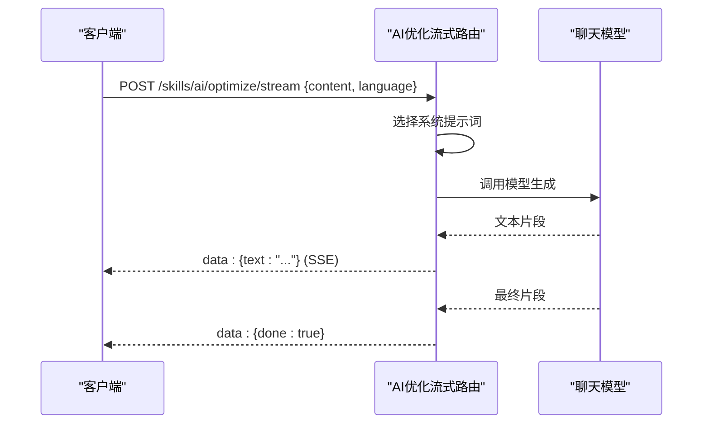
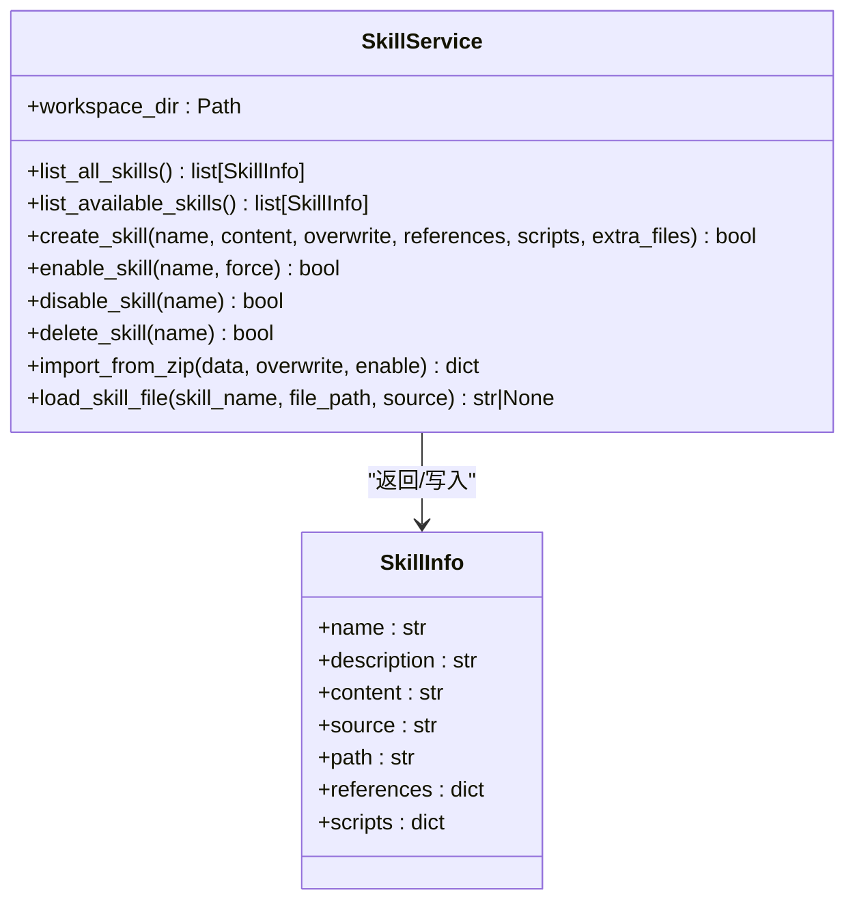
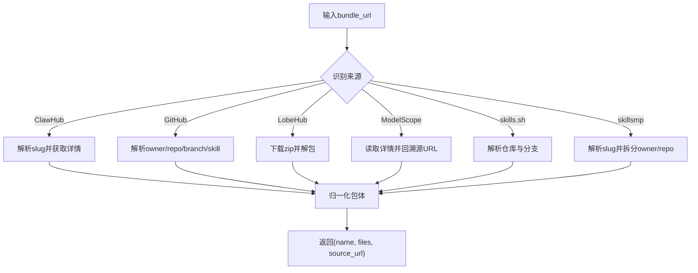
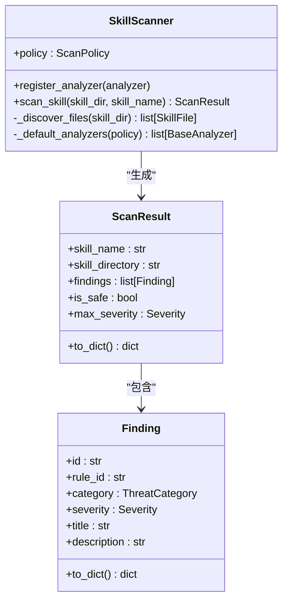
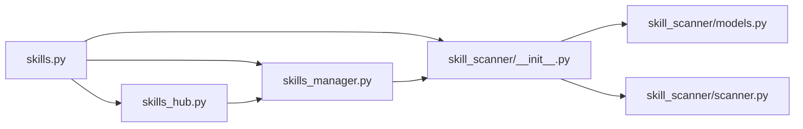

# 技能管理路由

<cite>
**本文档引用的文件**
- [skills.py](file://src/copaw/app/routers/skills.py)
- [skills_stream.py](file://src/copaw/app/routers/skills_stream.py)
- [skills_manager.py](file://src/copaw/agents/skills_manager.py)
- [skills_hub.py](file://src/copaw/agents/skills_hub.py)
- [skill_scanner/__init__.py](file://src/copaw/security/skill_scanner/__init__.py)
- [skill_scanner/scanner.py](file://src/copaw/security/skill_scanner/scanner.py)
- [skill_scanner/models.py](file://src/copaw/security/skill_scanner/models.py)
- [skill.ts](file://console/src/api/modules/skill.ts)
- [skill.ts 类型定义](file://console/src/api/types/skill.ts)
</cite>

## 目录
1. [简介](#简介)
2. [项目结构](#项目结构)
3. [核心组件](#核心组件)
4. [架构总览](#架构总览)
5. [详细组件分析](#详细组件分析)
6. [依赖关系分析](#依赖关系分析)
7. [性能考虑](#性能考虑)
8. [故障排除指南](#故障排除指南)
9. [结论](#结论)
10. [附录](#附录)

## 简介
本文件为 CoPaw 技能管理路由模块的全面技术文档，覆盖技能搜索、安装、卸载、启用/禁用、批量操作、上传导入、文件加载等核心功能的 API 设计与实现；深入解析技能中心集成 API（skills.py）与技能流式传输 API（skills_stream.py）的技术架构与使用方式；阐述技能元数据管理、版本控制、依赖关系处理等数据模型设计；提供安装流程、状态监控、错误处理的完整 API 调用示例；解释权限控制、安全验证、性能优化等关键技术实现，并给出参数验证、响应格式、错误码定义与最佳实践指南。

## 项目结构
技能管理路由位于后端 FastAPI 应用中，主要由以下模块组成：
- 路由层：技能管理路由（skills.py）、AI 优化流式路由（skills_stream.py）
- 业务服务层：技能服务（skills_manager.py）、技能中心客户端（skills_hub.py）
- 安全扫描：技能扫描器（skill_scanner/*）
- 前端 API 封装：技能 API 模块（console/src/api/modules/skill.ts）

**图表来源**
- [skills.py:119-753](file://src/copaw/app/routers/skills.py#L119-L753)
- [skills_stream.py:124-245](file://src/copaw/app/routers/skills_stream.py#L124-L245)
- [skills_manager.py:654-1233](file://src/copaw/agents/skills_manager.py#L654-L1233)
- [skills_hub.py:1513-1599](file://src/copaw/agents/skills_hub.py#L1513-L1599)
- [skill_scanner/__init__.py:393-505](file://src/copaw/security/skill_scanner/__init__.py#L393-L505)
- [skill_scanner/scanner.py:76-319](file://src/copaw/security/skill_scanner/scanner.py#L76-L319)
- [skill_scanner/models.py:19-235](file://src/copaw/security/skill_scanner/models.py#L19-L235)

**章节来源**
- [skills.py:1-753](file://src/copaw/app/routers/skills.py#L1-L753)
- [skills_stream.py:1-245](file://src/copaw/app/routers/skills_stream.py#L1-L245)
- [skills_manager.py:1-1233](file://src/copaw/agents/skills_manager.py#L1-L1233)
- [skills_hub.py:1-1619](file://src/copaw/agents/skills_hub.py#L1-L1619)
- [skill_scanner/__init__.py:1-505](file://src/copaw/security/skill_scanner/__init__.py#L1-L505)
- [skill_scanner/scanner.py:1-319](file://src/copaw/security/skill_scanner/scanner.py#L1-L319)
- [skill_scanner/models.py:1-235](file://src/copaw/security/skill_scanner/models.py#L1-L235)

## 核心组件
- 技能路由（skills.py）
  - 提供技能列表、可用技能、启用/禁用、删除、批量启用/禁用、从 Hub 安装、上传 ZIP 导入、文件加载等接口
  - 支持 Hub 安装的异步任务管理（启动、轮询、取消）
  - 集成安全扫描（422 结构化响应）
- AI 优化流式路由（skills_stream.py）
  - 提供基于 AI 的技能内容优化流式接口（SSE）
  - 支持多语言系统提示词与增量文本输出
- 技能服务（skills_manager.py）
  - 技能 CRUD、启用/禁用、删除、ZIP 导入、文件加载
  - 同步策略：内置技能优先级、定制技能覆盖、活动技能同步
  - 安全扫描钩子（创建、导入、启用前/后）
- 技能中心客户端（skills_hub.py）
  - 多源 Hub 解析与下载：ClawHub、GitHub、LobeHub、ModelScope、skills.sh、skillsmp
  - 统一包体归一化、版本选择、取消检查、重试与超时
- 技能扫描器（skill_scanner/*）
  - 扫描策略、文件发现、分析器注册、结果聚合、缓存与白名单
  - 异常类型 SkillScanError 用于阻断式安全策略

**章节来源**
- [skills.py:122-753](file://src/copaw/app/routers/skills.py#L122-L753)
- [skills_stream.py:166-245](file://src/copaw/app/routers/skills_stream.py#L166-L245)
- [skills_manager.py:654-1233](file://src/copaw/agents/skills_manager.py#L654-L1233)
- [skills_hub.py:1513-1599](file://src/copaw/agents/skills_hub.py#L1513-L1599)
- [skill_scanner/__init__.py:393-505](file://src/copaw/security/skill_scanner/__init__.py#L393-L505)
- [skill_scanner/scanner.py:76-319](file://src/copaw/security/skill_scanner/scanner.py#L76-L319)
- [skill_scanner/models.py:19-235](file://src/copaw/security/skill_scanner/models.py#L19-L235)

## 架构总览
技能管理采用“路由层-服务层-扫描器-存储”的分层架构：
- 路由层负责请求解析、参数校验、异常映射与响应格式化
- 服务层负责业务逻辑与文件系统操作（工作区目录结构：active/customized/builtin）
- 扫描器在关键节点执行安全扫描，支持阻断或告警模式
- Hub 客户端统一抽象多源技能包获取与归一化

**图表来源**
- [skills.py:344-388](file://src/copaw/app/routers/skills.py#L344-L388)
- [skills_hub.py:1567-1599](file://src/copaw/agents/skills_hub.py#L1567-L1599)
- [skills_manager.py:726-967](file://src/copaw/agents/skills_manager.py#L726-L967)
- [skill_scanner/__init__.py:415-505](file://src/copaw/security/skill_scanner/__init__.py#L415-L505)

## 详细组件分析

### 技能路由（skills.py）
- 列表与可用技能
  - GET /skills：列出所有技能（内置+定制），并标注是否已启用
  - GET /skills/available：仅列出当前已启用的技能
- 启用/禁用/删除
  - POST /skills/{skill_name}/enable：将技能复制到 active_skills 并触发热重载
  - POST /skills/{skill_name}/disable：从 active_skills 删除并热重载
  - DELETE /skills/{skill_name}：永久删除定制技能
- 批量操作
  - POST /skills/batch-enable：批量启用（遇阻断返回 422）
  - POST /skills/batch-disable：批量禁用
- Hub 安装与任务管理
  - POST /skills/hub/install：立即安装（阻塞）
  - POST /skills/hub/install/start：启动异步安装任务，返回 HubInstallTask
  - GET /skills/hub/install/status/{task_id}：轮询任务状态
  - POST /skills/hub/install/cancel/{task_id}：取消任务
- 上传与创建
  - POST /skills/upload：上传 ZIP 并导入（可选启用/覆盖）
  - POST /skills：创建新技能（含 references/scripts 树形结构）
- 文件加载
  - GET /skills/{skill_name}/files/{source}/{file_path:path}：从内置或定制技能加载特定文件
- 安全扫描集成
  - 对 Hub 安装、上传导入、创建、启用均进行扫描，失败时返回 422 结构化错误

**图表来源**
- [skills.py:344-388](file://src/copaw/app/routers/skills.py#L344-L388)
- [skills_hub.py:1567-1599](file://src/copaw/agents/skills_hub.py#L1567-L1599)
- [skills_manager.py:726-967](file://src/copaw/agents/skills_manager.py#L726-L967)
- [skill_scanner/__init__.py:415-505](file://src/copaw/security/skill_scanner/__init__.py#L415-L505)

**章节来源**
- [skills.py:122-753](file://src/copaw/app/routers/skills.py#L122-L753)

### AI 优化流式路由（skills_stream.py）
- 接口：POST /skills/ai/optimize/stream
- 输入：content（待优化技能内容）、language（en/zh/ru）
- 输出：SSE 流，逐段返回增量文本，结束时发送 done 标记
- 模型获取：通过工厂方法创建当前聊天模型实例
- 错误处理：模型不可用时返回 JSON 错误；异常时以 JSON 错误消息形式返回

**图表来源**
- [skills_stream.py:166-245](file://src/copaw/app/routers/skills_stream.py#L166-L245)

**章节来源**
- [skills_stream.py:166-245](file://src/copaw/app/routers/skills_stream.py#L166-L245)

### 技能服务（skills_manager.py）
- 数据模型
  - SkillInfo：技能元数据（name/description/content/source/path/references/scripts）
  - 目录结构：workspace/customized_skills、workspace/active_skills、src/copaw/agents/skills（内置）
- 关键能力
  - list_all_skills/list_available_skills：读取内置与定制技能并去重
  - create_skill：创建技能（支持 references/scripts 树形结构）
  - enable_skill/disable_skill/delete_skill/import_from_zip/load_skill_file
  - 同步策略：内置优先、定制覆盖、活动目录热重载
- 安全扫描
  - 创建/导入/启用前后扫描，阻断或记录告警

**图表来源**
- [skills_manager.py:28-1233](file://src/copaw/agents/skills_manager.py#L28-L1233)

**章节来源**
- [skills_manager.py:654-1233](file://src/copaw/agents/skills_manager.py#L654-L1233)

### 技能中心客户端（skills_hub.py）
- 多源支持
  - ClawHub、GitHub、LobeHub、ModelScope、skills.sh、skillsmp
- 解析与下载
  - URL 解析、版本选择、文件收集、包体归一化
- 取消与重试
  - 上下文取消检查、指数退避重试、超时控制
- 安全限制
  - ZIP 大小与条目数限制、路径合法性校验、符号链接拒绝

**图表来源**
- [skills_hub.py:1539-1599](file://src/copaw/agents/skills_hub.py#L1539-L1599)

**章节来源**
- [skills_hub.py:1513-1599](file://src/copaw/agents/skills_hub.py#L1513-L1599)

### 技能扫描器（skill_scanner/*）
- 扫描器入口
  - scan_skill_directory：按配置模式执行扫描，支持缓存、白名单、超时
  - SkillScanError：当阻断模式启用且存在高危问题时抛出
- 扫描器引擎
  - 文件发现：递归遍历、跳过符号链接、扩展名过滤、大小与数量限制
  - 分析器注册：默认 PatternAnalyzer，可扩展其他分析器
  - 结果聚合：去重、严重性排序、统计
- 数据模型
  - Severity/ThreatCategory/Finding/ScanResult

**图表来源**
- [skill_scanner/scanner.py:76-319](file://src/copaw/security/skill_scanner/scanner.py#L76-L319)
- [skill_scanner/models.py:19-235](file://src/copaw/security/skill_scanner/models.py#L19-L235)
- [skill_scanner/__init__.py:393-505](file://src/copaw/security/skill_scanner/__init__.py#L393-L505)

**章节来源**
- [skill_scanner/__init__.py:393-505](file://src/copaw/security/skill_scanner/__init__.py#L393-L505)
- [skill_scanner/scanner.py:76-319](file://src/copaw/security/skill_scanner/scanner.py#L76-L319)
- [skill_scanner/models.py:19-235](file://src/copaw/security/skill_scanner/models.py#L19-L235)

## 依赖关系分析
- 路由层依赖服务层与 Hub 客户端，同时在关键路径调用扫描器
- 服务层依赖扫描器与文件系统操作，负责目录同步与安全钩子
- Hub 客户端依赖网络请求与包体解析，最终交由服务层落盘
- 扫描器依赖策略与分析器插件，结果被路由与服务层消费

**图表来源**
- [skills.py:13-22](file://src/copaw/app/routers/skills.py#L13-L22)
- [skills_manager.py:654-1233](file://src/copaw/agents/skills_manager.py#L654-L1233)
- [skills_hub.py:1513-1599](file://src/copaw/agents/skills_hub.py#L1513-L1599)
- [skill_scanner/__init__.py:393-505](file://src/copaw/security/skill_scanner/__init__.py#L393-L505)
- [skill_scanner/models.py:19-235](file://src/copaw/security/skill_scanner/models.py#L19-L235)
- [skill_scanner/scanner.py:76-319](file://src/copaw/security/skill_scanner/scanner.py#L76-L319)

**章节来源**
- [skills.py:1-753](file://src/copaw/app/routers/skills.py#L1-L753)
- [skills_manager.py:1-1233](file://src/copaw/agents/skills_manager.py#L1-L1233)
- [skills_hub.py:1-1619](file://src/copaw/agents/skills_hub.py#L1-L1619)
- [skill_scanner/__init__.py:1-505](file://src/copaw/security/skill_scanner/__init__.py#L1-L505)

## 性能考虑
- I/O 与并发
  - Hub 安装使用异步任务与线程事件，避免阻塞主请求
  - ZIP 导入与 Hub 下载采用分块读取与大小/条目限制，防止内存膨胀
- 缓存与白名单
  - 扫描结果按目录 mtime 缓存，减少重复扫描开销
  - 白名单支持按内容哈希快速放行
- 目录同步
  - 内置与定制技能合并时去重，避免重复写入
  - 活动技能同步仅在变更时更新，降低磁盘压力

[本节为通用性能建议，不直接分析具体文件]

## 故障排除指南
- 安全扫描阻断
  - 现象：安装/启用返回 422，包含 findings 列表
  - 处理：根据 findings 修复风险项或调整扫描策略
  - 参考：[scan_error_response:28-50](file://src/copaw/app/routers/skills.py#L28-L50)、[SkillScanError:393-413](file://src/copaw/security/skill_scanner/__init__.py#L393-L413)
- Hub 安装失败
  - 现象：400/502，可能为上游限速或无效 URL
  - 处理：检查 bundle_url、设置 GITHUB_TOKEN、重试
  - 参考：[install_from_hub:344-388](file://src/copaw/app/routers/skills.py#L344-L388)、[install_skill_from_hub:1567-1599](file://src/copaw/agents/skills_hub.py#L1567-L1599)
- ZIP 导入异常
  - 现象：400/500，可能为非法 ZIP、过大或缺少 SKILL.md
  - 处理：确认 ZIP 结构与内容、调整大小限制
  - 参考：[import_from_zip:1027-1113](file://src/copaw/agents/skills_manager.py#L1027-L1113)
- 文件加载失败
  - 现象：返回 null，可能为路径非法或文件不存在
  - 处理：检查 file_path 是否以 references/ 或 scripts/ 开头
  - 参考：[load_skill_file:1114-1233](file://src/copaw/agents/skills_manager.py#L1114-L1233)

**章节来源**
- [skills.py:28-50](file://src/copaw/app/routers/skills.py#L28-L50)
- [skills_hub.py:1567-1599](file://src/copaw/agents/skills_hub.py#L1567-L1599)
- [skills_manager.py:1027-1233](file://src/copaw/agents/skills_manager.py#L1027-L1233)
- [skill_scanner/__init__.py:393-505](file://src/copaw/security/skill_scanner/__init__.py#L393-L505)

## 结论
技能管理路由模块通过清晰的分层设计实现了从 Hub 获取、本地导入、启用/禁用、批量操作与安全扫描的完整闭环。路由层提供统一 API 与流式能力，服务层负责稳健的文件系统操作与同步策略，扫描器保障安全基线。结合异步任务与缓存机制，整体具备良好的可扩展性与运行时稳定性。

[本节为总结性内容，不直接分析具体文件]

## 附录

### API 定义与调用示例（基于前端封装）
- 列出技能
  - GET /skills
  - 参考：[listSkills](file://console/src/api/modules/skill.ts#L16)
- 搜索 Hub 技能
  - GET /skills/hub/search?q=...&limit=...
  - 参考：[searchHubSkills:48-51](file://console/src/api/modules/skill.ts#L48-L51)
- 安装 Hub 技能（阻塞）
  - POST /skills/hub/install
  - 参考：[installHubSkill:53-71](file://console/src/api/modules/skill.ts#L53-L71)
- 安装 Hub 技能（异步）
  - POST /skills/hub/install/start
  - GET /skills/hub/install/status/{task_id}
  - POST /skills/hub/install/cancel/{task_id}
  - 参考：[startHubSkillInstall:73-98](file://console/src/api/modules/skill.ts#L73-L98)、[getHubSkillInstallStatus:100-117](file://console/src/api/modules/skill.ts#L100-L117)、[cancelHubSkillInstall:119-125](file://console/src/api/modules/skill.ts#L119-L125)
- 上传 ZIP 导入
  - POST /skills/upload?enable=&overwrite=
  - 参考：[uploadSkill:191-224](file://console/src/api/modules/skill.ts#L191-L224)
- AI 优化流式
  - POST /skills/ai/optimize/stream
  - 参考：[streamOptimizeSkill:127-189](file://console/src/api/modules/skill.ts#L127-L189)

**章节来源**
- [skill.ts:1-226](file://console/src/api/modules/skill.ts#L1-L226)

### 数据模型与响应格式
- 技能规范（SkillSpec）
  - 字段：name、description、content、source、path、enabled
  - 参考：[SkillSpec:53-57](file://src/copaw/app/routers/skills.py#L53-L57)、[SkillSpec 类型:1-8](file://console/src/api/types/skill.ts#L1-L8)
- Hub 技能规范（HubSkillSpec）
  - 字段：slug、name、description、version、source_url
  - 参考：[HubSkillSpec:74-80](file://src/copaw/app/routers/skills.py#L74-L80)、[HubSkillSpec 类型:10-16](file://console/src/api/types/skill.ts#L10-L16)
- Hub 安装任务（HubInstallTask）
  - 字段：task_id、bundle_url、version、enable、overwrite、status、error、result、created_at、updated_at
  - 参考：[HubInstallTask:100-111](file://src/copaw/app/routers/skills.py#L100-L111)

**章节来源**
- [skills.py:53-111](file://src/copaw/app/routers/skills.py#L53-L111)
- [skill.ts 类型定义:1-16](file://console/src/api/types/skill.ts#L1-L16)

### 参数验证与错误码
- 公共错误
  - 400：参数非法（如上传类型不符、ZIP 过大、Hub URL 无效）
  - 404：任务未找到、技能未找到
  - 422：安全扫描阻断（包含 findings 列表）
  - 500/502：内部错误或上游限速
- Hub 安装
  - 400：bundle_url 非法或值错误
  - 502：上游错误或限速
- ZIP 导入
  - 400：非法 ZIP 或缺少 SKILL.md
  - 500：导入失败

**章节来源**
- [skills.py:344-388](file://src/copaw/app/routers/skills.py#L344-L388)
- [skills_manager.py:1027-1113](file://src/copaw/agents/skills_manager.py#L1027-L1113)

### 最佳实践
- 安装前先扫描：对来自 Hub 或上传的技能执行安全扫描，必要时开启阻断模式
- 使用异步安装：大包或网络不稳定场景使用 /start + /status + /cancel
- 控制 ZIP 规模：遵守大小与条目限制，确保解压后结构合法
- 合理使用白名单：对已知安全技能配置白名单与内容哈希
- 监控与日志：关注扫描器缓存命中率与告警历史，定期清理阻断记录

[本节为通用最佳实践，不直接分析具体文件]