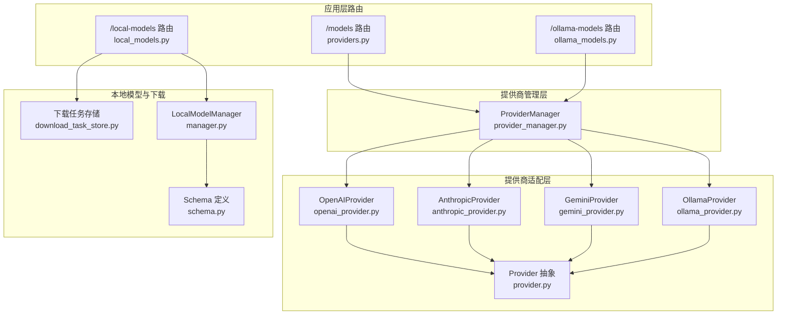
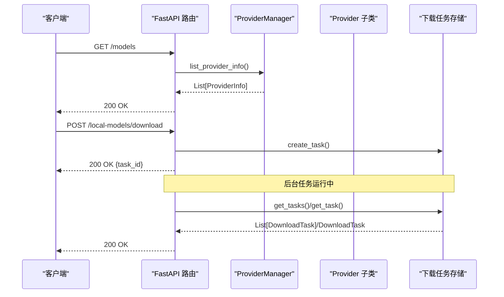
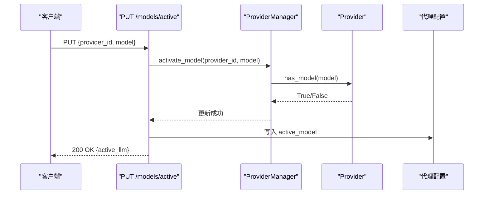
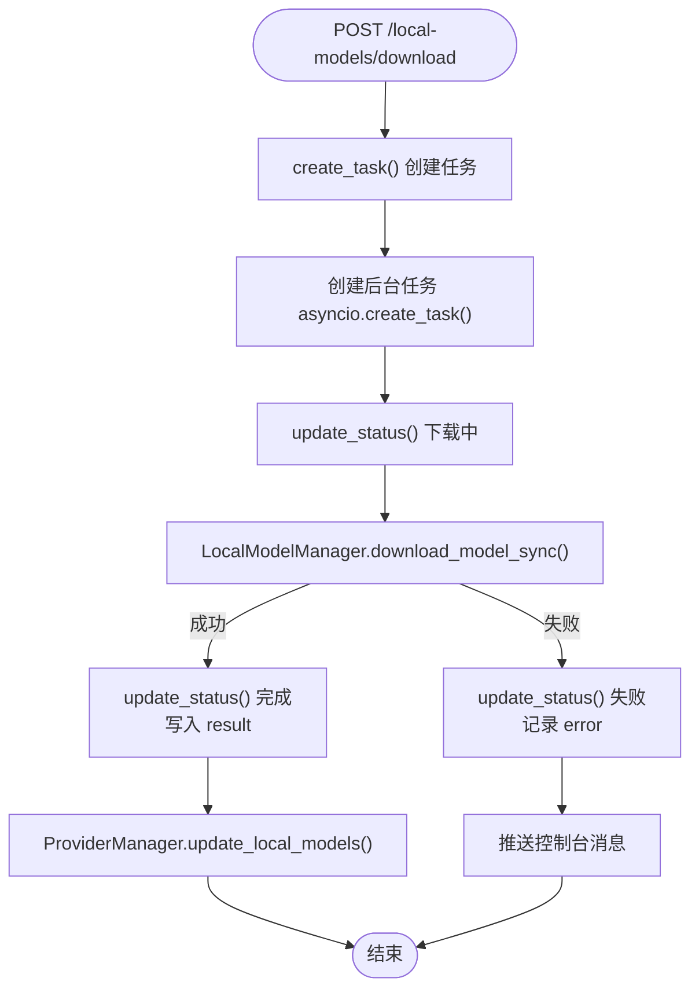
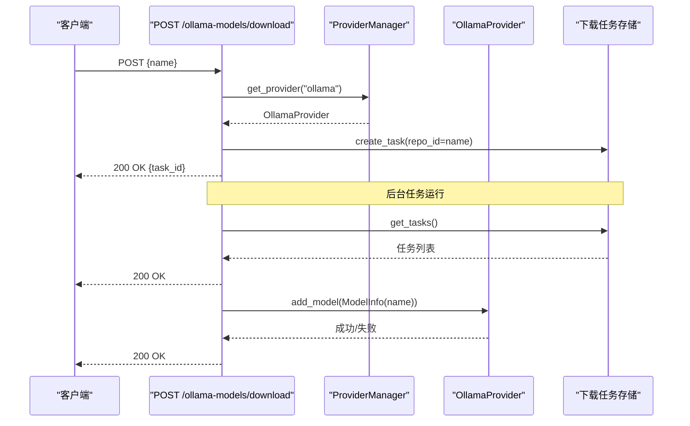
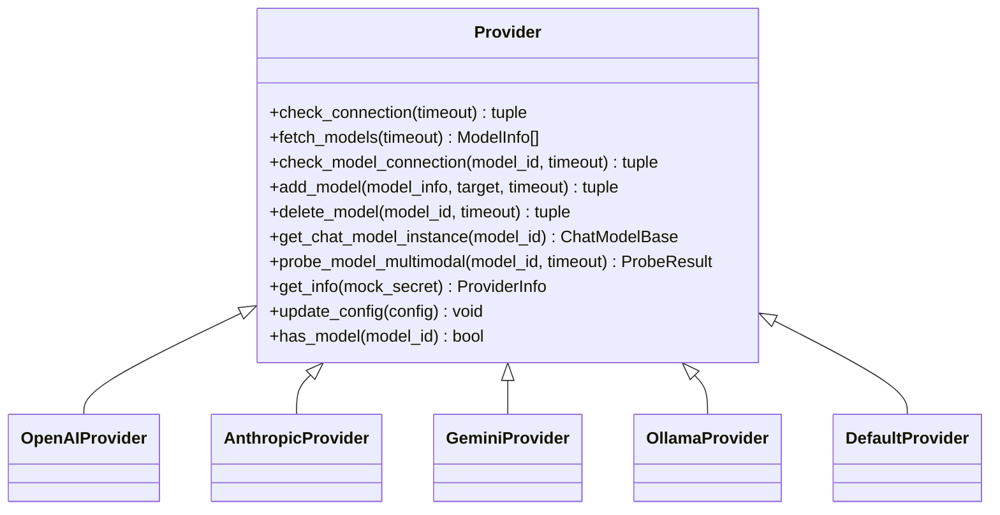
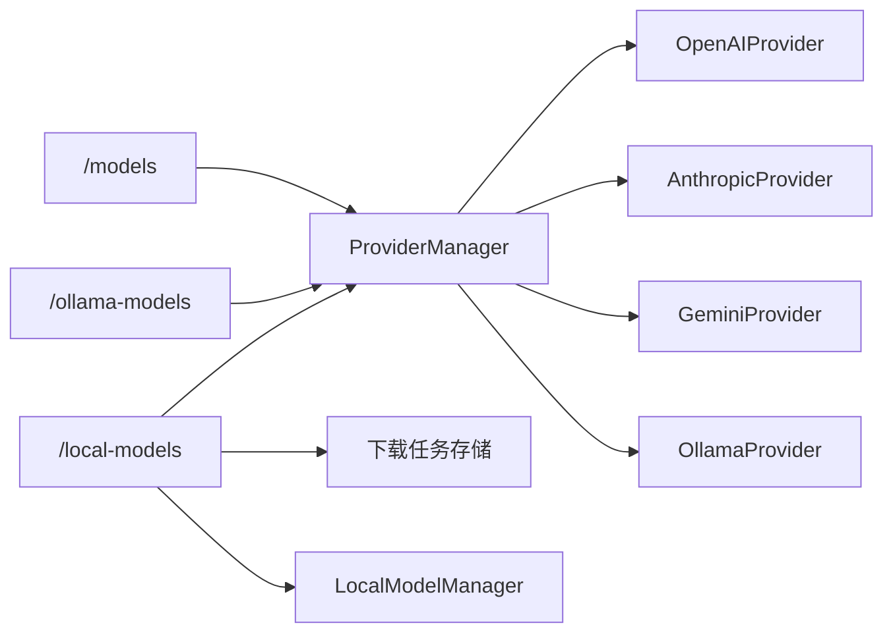

# 模型提供商路由

<cite>
**本文档引用的文件**
- [providers.py](file://src/copaw/app/routers/providers.py)
- [local_models.py](file://src/copaw/app/routers/local_models.py)
- [ollama_models.py](file://src/copaw/app/routers/ollama_models.py)
- [provider_manager.py](file://src/copaw/providers/provider_manager.py)
- [provider.py](file://src/copaw/providers/provider.py)
- [models.py](file://src/copaw/providers/models.py)
- [openai_provider.py](file://src/copaw/providers/openai_provider.py)
- [anthropic_provider.py](file://src/copaw/providers/anthropic_provider.py)
- [gemini_provider.py](file://src/copaw/providers/gemini_provider.py)
- [ollama_provider.py](file://src/copaw/providers/ollama_provider.py)
- [multimodal_prober.py](file://src/copaw/providers/multimodal_prober.py)
- [download_task_store.py](file://src/copaw/app/download_task_store.py)
- [schema.py](file://src/copaw/local_models/schema.py)
- [manager.py](file://src/copaw/local_models/manager.py)
</cite>

## 目录
1. [简介](#简介)
2. [项目结构](#项目结构)
3. [核心组件](#核心组件)
4. [架构总览](#架构总览)
5. [详细组件分析](#详细组件分析)
6. [依赖关系分析](#依赖关系分析)
7. [性能考虑](#性能考虑)
8. [故障排查指南](#故障排查指南)
9. [结论](#结论)
10. [附录](#附录)

## 简介
本文件面向CoPaw的“模型提供商路由”模块，系统性梳理云模型提供商API（providers.py）、本地模型管理API（local_models.py）与Ollama模型API（ollama_models.py）的设计原理与实现细节。文档覆盖以下关键主题：
- 模型提供商配置、API密钥管理、模型列表查询等核心功能的API接口
- 模型参数配置、推理调用、结果处理的完整使用示例
- 模型切换机制、负载均衡、性能监控等技术实现
- 参数验证、响应格式、错误处理与性能优化指南
- 多模型提供商集成、模型缓存策略、资源管理等高级功能

## 项目结构
CoPaw在后端通过FastAPI路由模块对外暴露模型与提供商管理能力，核心文件组织如下：
- 应用层路由：提供统一的REST API入口，负责请求解析、参数校验与响应封装
- 提供商管理层：集中管理内置与自定义提供商，维护活跃模型槽位，执行模型发现与能力探测
- 提供商适配层：针对不同云厂商或本地平台（如OpenAI、Anthropic、Gemini、Ollama、llama.cpp/MLX）实现统一抽象
- 本地模型与下载任务：支持从HuggingFace/ModelScope下载本地模型，并以后台任务跟踪状态
- 多模态探测：对图像/视频输入能力进行探测，避免误判

图表来源
- [providers.py:1-477](file://src/copaw/app/routers/providers.py#L1-L477)
- [local_models.py:1-320](file://src/copaw/app/routers/local_models.py#L1-L320)
- [ollama_models.py:1-291](file://src/copaw/app/routers/ollama_models.py#L1-L291)
- [provider_manager.py:573-800](file://src/copaw/providers/provider_manager.py#L573-L800)
- [provider.py:100-272](file://src/copaw/providers/provider.py#L100-L272)
- [openai_provider.py:25-550](file://src/copaw/providers/openai_provider.py#L25-L550)
- [anthropic_provider.py:27-256](file://src/copaw/providers/anthropic_provider.py#L27-L256)
- [gemini_provider.py:27-332](file://src/copaw/providers/gemini_provider.py#L27-L332)
- [ollama_provider.py:22-210](file://src/copaw/providers/ollama_provider.py#L22-L210)
- [download_task_store.py:1-131](file://src/copaw/app/download_task_store.py#L1-L131)
- [manager.py:94-413](file://src/copaw/local_models/manager.py#L94-L413)
- [schema.py:12-59](file://src/copaw/local_models/schema.py#L12-L59)

章节来源
- [providers.py:1-477](file://src/copaw/app/routers/providers.py#L1-L477)
- [provider_manager.py:573-800](file://src/copaw/providers/provider_manager.py#L573-L800)

## 核心组件
- 模型提供商路由（/models）
  - 列出所有提供商、配置提供商、创建/删除自定义提供商、发现模型、测试连接与单个模型可用性、探测多模态能力、设置/获取当前活跃模型
- 本地模型路由（/local-models）
  - 列出已下载本地模型、发起后台下载任务、查询下载状态、取消下载、删除本地模型
- Ollama模型路由（/ollama-models）
  - 列出Ollama模型、发起后台拉取任务、查询下载状态、取消拉取、删除模型
- 提供商管理器（ProviderManager）
  - 维护内置/自定义提供商集合，持久化配置，更新活跃模型槽位，自动探测多模态能力
- 提供商抽象与适配
  - Provider抽象定义统一接口；各云厂商/本地平台实现具体逻辑（连接检查、模型发现、能力探测、实例化聊天模型）

章节来源
- [providers.py:79-477](file://src/copaw/app/routers/providers.py#L79-L477)
- [local_models.py:94-320](file://src/copaw/app/routers/local_models.py#L94-L320)
- [ollama_models.py:152-291](file://src/copaw/app/routers/ollama_models.py#L152-L291)
- [provider_manager.py:628-800](file://src/copaw/providers/provider_manager.py#L628-L800)
- [provider.py:100-272](file://src/copaw/providers/provider.py#L100-L272)

## 架构总览
CoPaw采用“路由层-管理层-适配层”的分层架构：
- 路由层：FastAPI路由负责HTTP请求处理、参数校验与响应封装
- 管理层：ProviderManager集中管理提供商生命周期、模型发现与活跃槽位
- 适配层：Provider及其子类实现与具体平台的交互细节
- 本地模型：独立的下载任务存储与本地模型管理器，支持并发与取消

图表来源
- [providers.py:79-122](file://src/copaw/app/routers/providers.py#L79-L122)
- [local_models.py:123-168](file://src/copaw/app/routers/local_models.py#L123-L168)
- [download_task_store.py:43-131](file://src/copaw/app/download_task_store.py#L43-L131)

## 详细组件分析

### 云模型提供商API（/models）
- 功能概览
  - 列出提供商：返回所有内置与自定义提供商信息
  - 配置提供商：更新base_url、api_key、chat_model、generate_kwargs等
  - 创建/删除自定义提供商：支持动态扩展提供商生态
  - 发现模型：从提供商API拉取可用模型列表并持久化
  - 测试连接/模型：验证提供商与特定模型连通性
  - 探测多模态：对图像/视频输入能力进行探测
  - 设置/获取活跃模型：按代理维度保存当前使用的模型槽位

- 关键流程（设置活跃模型）

图表来源
- [providers.py:440-477](file://src/copaw/app/routers/providers.py#L440-L477)
- [provider_manager.py:738-754](file://src/copaw/providers/provider_manager.py#L738-L754)
- [provider.py:192-197](file://src/copaw/providers/provider.py#L192-L197)

- 关键数据结构
  - ProviderInfo：提供商元数据（id、name、base_url、api_key、chat_model、models、extra_models、api_key_prefix、is_local、freeze_url、require_api_key、support_model_discovery、support_connection_check、generate_kwargs）
  - ModelInfo：模型元数据（id、name、supports_multimodal、supports_image、supports_video、probe_source）
  - ModelSlotConfig：模型槽位（provider_id、model）
  - ActiveModelsInfo：活跃模型响应体

- 错误处理与参数校验
  - 未找到提供商/模型时返回404/400
  - 配置更新失败抛出异常并转换为HTTP错误
  - 连接测试与模型测试捕获平台特定异常并返回可读消息

章节来源
- [providers.py:79-477](file://src/copaw/app/routers/providers.py#L79-L477)
- [provider.py:43-98](file://src/copaw/providers/provider.py#L43-L98)
- [models.py:74-81](file://src/copaw/providers/models.py#L74-L81)

### 本地模型管理API（/local-models）
- 功能概览
  - 列出本地模型：返回已下载模型清单（含后端类型、来源、文件大小、本地路径、显示名）
  - 下载模型：创建后台任务，返回task_id；支持取消
  - 查询下载状态：轮询任务状态（pending/downloading/completed/failed/cancelled）
  - 删除本地模型：清理磁盘文件并更新清单

- 并发与取消机制
  - 使用内存中的任务存储（线程安全锁）管理任务生命周期
  - 支持取消未完成的任务，后台协程被取消后清理残留文件

- 关键流程（后台下载）

图表来源
- [local_models.py:123-256](file://src/copaw/app/routers/local_models.py#L123-L256)
- [download_task_store.py:43-131](file://src/copaw/app/download_task_store.py#L43-L131)
- [manager.py:94-413](file://src/copaw/local_models/manager.py#L94-L413)

- 关键数据结构
  - DownloadRequest：repo_id、filename、backend、source
  - LocalModelResponse：id、repo_id、filename、backend、source、file_size、local_path、display_name
  - DownloadTaskResponse：task_id、status、repo_id、filename、backend、source、error、result
  - BackendType/DownloadSource：枚举类型
  - LocalModelInfo：本地模型元数据

章节来源
- [local_models.py:94-320](file://src/copaw/app/routers/local_models.py#L94-L320)
- [download_task_store.py:18-131](file://src/copaw/app/download_task_store.py#L18-L131)
- [schema.py:12-59](file://src/copaw/local_models/schema.py#L12-L59)
- [manager.py:94-413](file://src/copaw/local_models/manager.py#L94-L413)

### Ollama模型API（/ollama-models）
- 功能概览
  - 列出Ollama模型：通过Ollama SDK列出已存在的模型
  - 拉取模型：创建后台任务，调用Ollama SDK拉取模型
  - 取消拉取：取消未完成任务并停止后台协程
  - 删除模型：调用Ollama SDK删除模型

- 异常处理
  - 对连接错误、导入错误、运行时错误进行分类处理
  - 通过统一的连接检测函数识别Ollama不可达场景

- 关键流程（拉取模型）

图表来源
- [ollama_models.py:193-230](file://src/copaw/app/routers/ollama_models.py#L193-L230)
- [provider_manager.py:550-557](file://src/copaw/providers/provider_manager.py#L550-L557)
- [ollama_provider.py:122-148](file://src/copaw/providers/ollama_provider.py#L122-L148)
- [download_task_store.py:43-131](file://src/copaw/app/download_task_store.py#L43-L131)

章节来源
- [ollama_models.py:152-291](file://src/copaw/app/routers/ollama_models.py#L152-L291)
- [ollama_provider.py:22-210](file://src/copaw/providers/ollama_provider.py#L22-L210)

### 提供商抽象与适配
- Provider抽象
  - 定义统一接口：check_connection、fetch_models、check_model_connection、add_model/delete_model、get_chat_model_instance、probe_model_multimodal、get_info、update_config、has_model
  - 默认实现：DefaultProvider用于本地平台（如llama.cpp/MLX），不实现聊天模型实例化
- 具体适配
  - OpenAIProvider：支持多模态探测（图像/视频），兼容DashScope等兼容端点
  - AnthropicProvider：基于Messages API探测图像能力
  - GeminiProvider：基于generateContent API探测图像/视频能力
  - OllamaProvider：通过OpenAI兼容端点代理多模态探测

图表来源
- [provider.py:100-272](file://src/copaw/providers/provider.py#L100-L272)
- [openai_provider.py:25-550](file://src/copaw/providers/openai_provider.py#L25-L550)
- [anthropic_provider.py:27-256](file://src/copaw/providers/anthropic_provider.py#L27-L256)
- [gemini_provider.py:27-332](file://src/copaw/providers/gemini_provider.py#L27-L332)
- [ollama_provider.py:22-210](file://src/copaw/providers/ollama_provider.py#L22-L210)

章节来源
- [provider.py:100-272](file://src/copaw/providers/provider.py#L100-L272)
- [openai_provider.py:25-550](file://src/copaw/providers/openai_provider.py#L25-L550)
- [anthropic_provider.py:27-256](file://src/copaw/providers/anthropic_provider.py#L27-L256)
- [gemini_provider.py:27-332](file://src/copaw/providers/gemini_provider.py#L27-L332)
- [ollama_provider.py:22-210](file://src/copaw/providers/ollama_provider.py#L22-L210)

### 多模态探测与能力判断
- 探测策略
  - 图像探测：发送最小尺寸的红色PNG，要求模型能识别颜色关键词
  - 视频探测：发送最小尺寸的蓝色MP4，要求模型能识别移动内容
  - 两阶段策略：先图像探测，若失败则跳过视频探测，避免误报
- 结果封装
  - ProbeResult：supports_image/supports_video/image_message/video_message
  - _is_media_keyword_error：根据异常消息关键字判断是否明确不支持

章节来源
- [multimodal_prober.py:75-102](file://src/copaw/providers/multimodal_prober.py#L75-L102)
- [openai_provider.py:165-550](file://src/copaw/providers/openai_provider.py#L165-L550)
- [anthropic_provider.py:166-256](file://src/copaw/providers/anthropic_provider.py#L166-L256)
- [gemini_provider.py:142-332](file://src/copaw/providers/gemini_provider.py#L142-L332)

## 依赖关系分析
- 路由到管理层
  - /models路由依赖ProviderManager进行提供商管理与活跃模型槽位操作
  - /local-models与/ollama-models路由依赖ProviderManager更新本地模型状态
- 管理层到适配层
  - ProviderManager聚合多种Provider实现，统一对外接口
  - 自动探测多模态能力仅对非本地提供商生效
- 本地模型链路
  - 下载任务存储与LocalModelManager解耦，便于并发与取消
  - 删除本地模型后同步更新ProviderManager的本地模型缓存

图表来源
- [providers.py:31-40](file://src/copaw/app/routers/providers.py#L31-L40)
- [local_models.py:133-156](file://src/copaw/app/routers/local_models.py#L133-L156)
- [ollama_models.py:207-217](file://src/copaw/app/routers/ollama_models.py#L207-L217)
- [provider_manager.py:628-800](file://src/copaw/providers/provider_manager.py#L628-L800)

章节来源
- [provider_manager.py:628-800](file://src/copaw/providers/provider_manager.py#L628-L800)
- [download_task_store.py:18-131](file://src/copaw/app/download_task_store.py#L18-L131)
- [manager.py:94-413](file://src/copaw/local_models/manager.py#L94-L413)

## 性能考虑
- 并发与异步
  - 路由层广泛使用async/await，后台任务通过asyncio协程管理
  - ProviderManager在激活模型时对非本地模型进行后台多模态探测，避免阻塞主流程
- 资源管理
  - 本地模型清单采用JSON文件持久化，定期清理已完成/失败/取消的任务
  - 删除本地模型时递归清理目录与空父目录，保持磁盘整洁
- 超时与重试
  - 各Provider实现均传入timeout参数，避免长时间阻塞
  - 对外部SDK调用进行异常捕获与降级处理

[本节为通用性能建议，无需特定文件来源]

## 故障排查指南
- 常见问题与定位
  - 无法连接提供商：检查base_url与api_key；使用/test接口验证；查看ProviderManager日志
  - 模型不可用：使用/models/{provider_id}/models/test接口测试；确认模型ID正确且在提供商列表中
  - Ollama不可达：确认Ollama服务运行；检查环境变量OLLAMA_HOST；使用/_is_ollama_connection_error检测连接错误
  - 本地模型下载失败：查看下载任务状态与错误信息；确认网络可达与磁盘空间充足
- 日志与可观测性
  - ProviderManager与各Provider实现均输出详细日志，便于定位异常
  - 控制台推送用于通知下载进度与失败原因

章节来源
- [providers.py:211-236](file://src/copaw/app/routers/providers.py#L211-L236)
- [ollama_models.py:59-69](file://src/copaw/app/routers/ollama_models.py#L59-L69)
- [local_models.py:243-256](file://src/copaw/app/routers/local_models.py#L243-L256)

## 结论
CoPaw的模型提供商路由模块通过清晰的分层设计与统一的Provider抽象，实现了对多家云模型提供商与本地模型平台的一致化管理。其特性包括：
- 完整的提供商生命周期管理（配置、发现、测试、多模态探测）
- 灵活的本地模型下载与状态追踪
- 可扩展的Provider适配层，便于接入新平台
- 良好的错误处理与可观测性，便于运维与排障

[本节为总结性内容，无需特定文件来源]

## 附录

### API参考与使用示例

- 获取活跃模型（GET /models/active）
  - 请求：无
  - 响应：ActiveModelsInfo(active_llm: ModelSlotConfig)
  - 示例：返回当前代理或全局的活跃模型槽位

- 设置活跃模型（PUT /models/active）
  - 请求体：{provider_id: string, model: string}
  - 响应：ActiveModelsInfo(active_llm)
  - 示例：将活跃模型切换至指定提供商与模型

- 列出提供商（GET /models）
  - 响应：List[ProviderInfo]
  - 示例：展示所有内置与自定义提供商

- 配置提供商（PUT /models/{provider_id}/config）
  - 请求体：{api_key?: string, base_url?: string, chat_model?: string, generate_kwargs?: dict}
  - 响应：ProviderInfo
  - 示例：更新OpenAI提供商的API密钥与基础URL

- 发现模型（POST /models/{provider_id}/discover）
  - 请求体：{api_key?: string, base_url?: string, chat_model?: string}
  - 响应：DiscoverModelsResponse(success: bool, models: List[ModelInfo], message: string, added_count: int)
  - 示例：从DashScope拉取可用模型并持久化

- 测试提供商（POST /models/{provider_id}/test）
  - 请求体：{api_key?: string, base_url?: string, chat_model?: string}
  - 响应：TestConnectionResponse(success: bool, message: string)
  - 示例：验证DashScope连接是否正常

- 测试模型（POST /models/{provider_id}/models/test）
  - 请求体：{model_id: string}
  - 响应：TestConnectionResponse(success: bool, message: string)
  - 示例：验证特定模型是否可用

- 探测多模态（POST /models/{provider_id}/models/{model_id:path}/probe-multimodal）
  - 响应：ProbeMultimodalResponse(supports_image: bool, supports_video: bool, supports_multimodal: bool, image_message: string, video_message: string)
  - 示例：探测Qwen/GPT-4o等模型的图像/视频输入能力

- 列出本地模型（GET /local-models）
  - 查询参数：backend?: string
  - 响应：List[LocalModelResponse]
  - 示例：返回所有已下载的本地模型清单

- 下载本地模型（POST /local-models/download）
  - 请求体：{repo_id: string, filename?: string, backend: "llamacpp"|"mlx", source: "huggingface"|"modelscope"}
  - 响应：DownloadTaskResponse(task_id: string, status: string, ...)
  - 示例：从HuggingFace下载Qwen3-8B-GGUF模型

- 查询下载状态（GET /local-models/download-status）
  - 查询参数：backend?: string
  - 响应：List[DownloadTaskResponse]
  - 示例：轮询下载进度

- 取消下载（POST /local-models/cancel-download/{task_id}）
  - 响应：{status: "cancelled", task_id: string}
  - 示例：取消未完成的下载任务

- 删除本地模型（DELETE /local-models/{model_id:path}）
  - 响应：{"status": "deleted", "model_id": string}
  - 示例：删除已下载的本地模型文件

- 列出Ollama模型（GET /ollama-models）
  - 响应：List[OllamaModelResponse]
  - 示例：返回Ollama已存在的模型列表

- 拉取Ollama模型（POST /ollama-models/download）
  - 请求体：{name: string}
  - 响应：OllamaDownloadTaskResponse(task_id: string, status: string, ...)
  - 示例：从Ollama仓库拉取llama3:8b模型

- 取消Ollama拉取（DELETE /ollama-models/download/{task_id}）
  - 响应：{status: "cancelled", task_id: string}
  - 示例：取消未完成的拉取任务

- 删除Ollama模型（DELETE /ollama-models/{name:path}）
  - 响应：{"status": "deleted", "name": string}
  - 示例：删除Ollama上的模型

章节来源
- [providers.py:79-477](file://src/copaw/app/routers/providers.py#L79-L477)
- [local_models.py:94-320](file://src/copaw/app/routers/local_models.py#L94-L320)
- [ollama_models.py:152-291](file://src/copaw/app/routers/ollama_models.py#L152-L291)