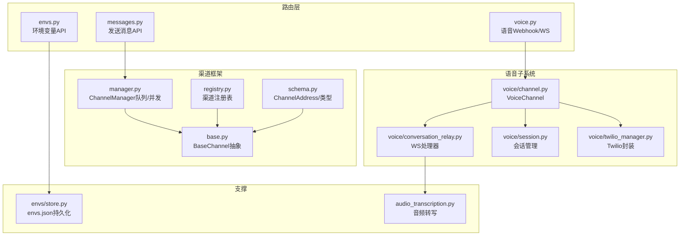
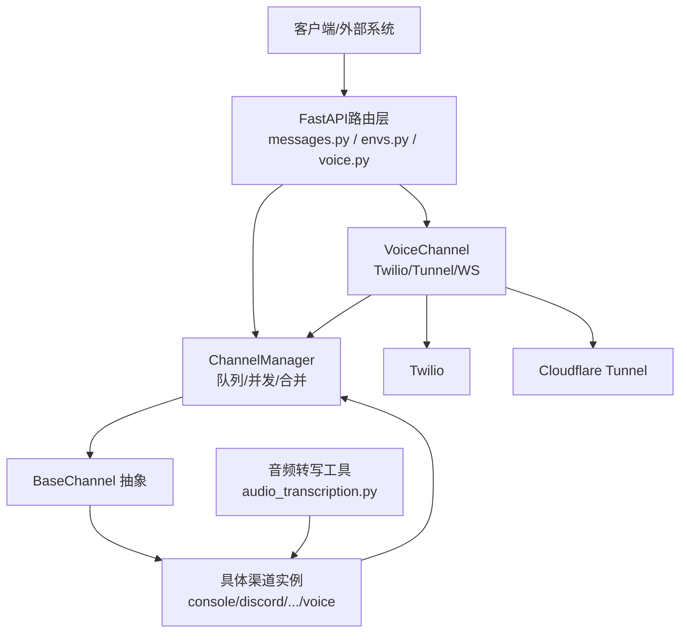
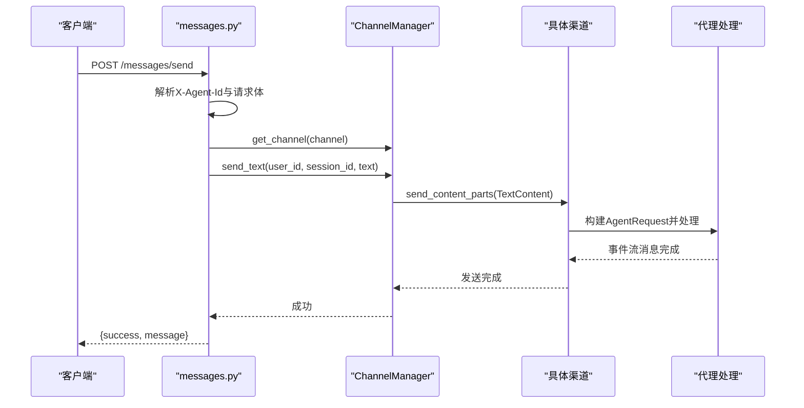
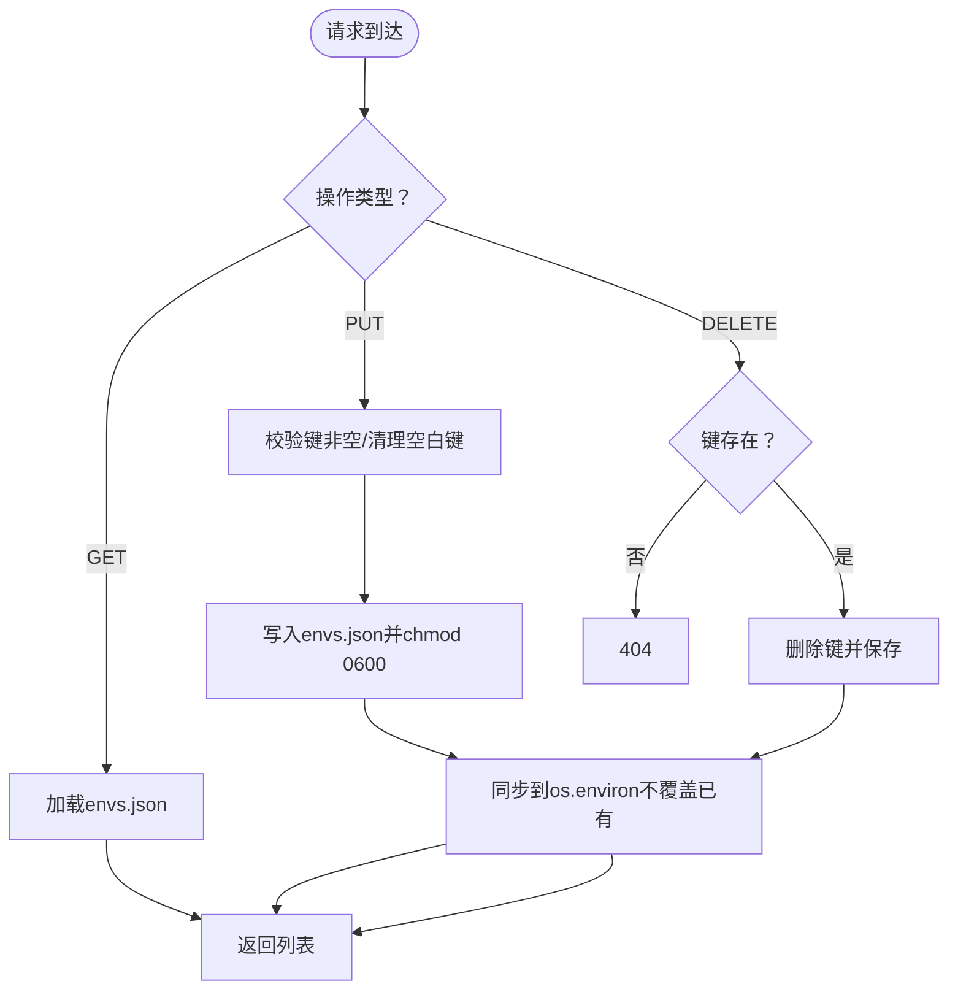
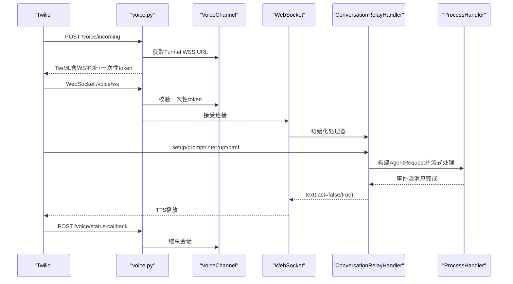
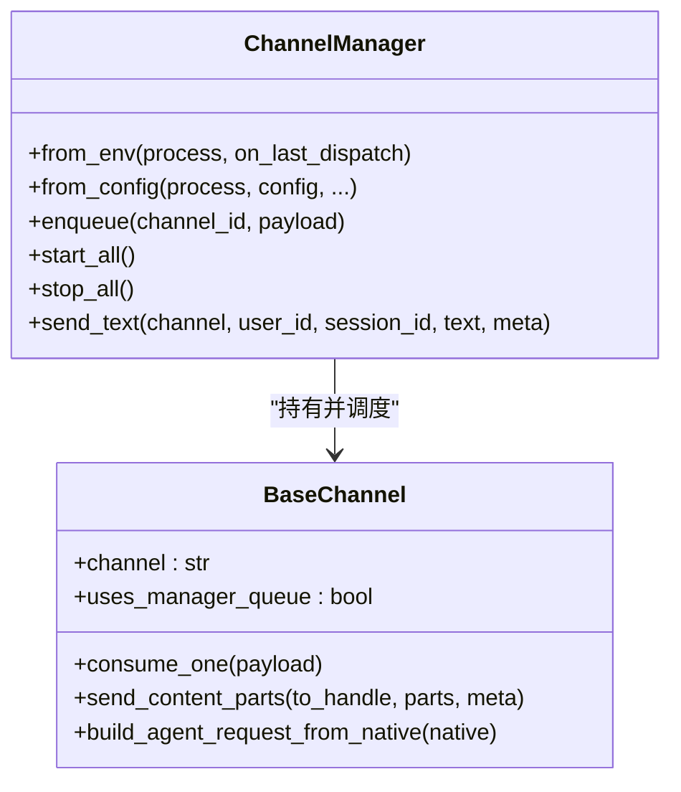
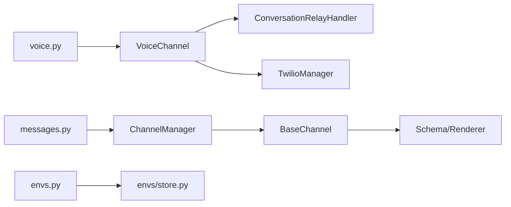

# 消息通信路由

<cite>
**本文引用的文件**
- [src/copaw/app/routers/messages.py](file://src/copaw/app/routers/messages.py)
- [src/copaw/app/routers/envs.py](file://src/copaw/app/routers/envs.py)
- [src/copaw/app/routers/voice.py](file://src/copaw/app/routers/voice.py)
- [src/copaw/app/channels/manager.py](file://src/copaw/app/channels/manager.py)
- [src/copaw/app/channels/base.py](file://src/copaw/app/channels/base.py)
- [src/copaw/app/channels/voice/channel.py](file://src/copaw/app/channels/voice/channel.py)
- [src/copaw/app/channels/voice/conversation_relay.py](file://src/copaw/app/channels/voice/conversation_relay.py)
- [src/copaw/app/channels/voice/session.py](file://src/copaw/app/channels/voice/session.py)
- [src/copaw/app/channels/voice/twilio_manager.py](file://src/copaw/app/channels/voice/twilio_manager.py)
- [src/copaw/app/channels/registry.py](file://src/copaw/app/channels/registry.py)
- [src/copaw/app/channels/schema.py](file://src/copaw/app/channels/schema.py)
- [src/copaw/envs/store.py](file://src/copaw/envs/store.py)
- [src/copaw/agents/utils/audio_transcription.py](file://src/copaw/agents/utils/audio_transcription.py)
</cite>

## 目录
1. [简介](#简介)
2. [项目结构](#项目结构)
3. [核心组件](#核心组件)
4. [架构总览](#架构总览)
5. [详细组件分析](#详细组件分析)
6. [依赖分析](#依赖分析)
7. [性能考虑](#性能考虑)
8. [故障排查指南](#故障排查指南)
9. [结论](#结论)
10. [附录](#附录)

## 简介
本文件面向CoPaw的消息通信路由模块，系统性梳理并解释以下三类API与相关基础设施：
- 消息处理API：对外提供“向指定渠道发送文本消息”的REST接口，支持多代理、多会话、多渠道路由与状态追踪。
- 环境变量管理API：提供环境变量的批量读取、替换保存与单键删除能力，确保配置持久化与进程注入。
- 语音处理API：基于Twilio的来电接入、WebSocket对话中继与状态回调，实现“语音转文字—实时对话—TTS播报”的完整链路。

文档同时覆盖消息队列管理、并发处理、数据一致性、WebSocket连接、实时数据传输与性能优化策略，并给出调用示例与最佳实践。

## 项目结构
围绕消息通信路由的关键目录与文件如下：
- 路由层：messages.py、envs.py、voice.py
- 渠道框架：base.py、manager.py、registry.py、schema.py
- 语音子系统：voice/channel.py、voice/conversation_relay.py、voice/session.py、voice/twilio_manager.py
- 环境变量存储：envs/store.py
- 音频转写工具：agents/utils/audio_transcription.py

**图表来源**
- [src/copaw/app/routers/messages.py:1-184](file://src/copaw/app/routers/messages.py#L1-L184)
- [src/copaw/app/routers/envs.py:1-81](file://src/copaw/app/routers/envs.py#L1-L81)
- [src/copaw/app/routers/voice.py:1-184](file://src/copaw/app/routers/voice.py#L1-L184)
- [src/copaw/app/channels/manager.py:1-580](file://src/copaw/app/channels/manager.py#L1-L580)
- [src/copaw/app/channels/base.py:1-868](file://src/copaw/app/channels/base.py#L1-L868)
- [src/copaw/app/channels/voice/channel.py:1-240](file://src/copaw/app/channels/voice/channel.py#L1-L240)
- [src/copaw/app/channels/voice/conversation_relay.py:1-289](file://src/copaw/app/channels/voice/conversation_relay.py#L1-L289)
- [src/copaw/app/channels/voice/session.py:1-73](file://src/copaw/app/channels/voice/session.py#L1-L73)
- [src/copaw/app/channels/voice/twilio_manager.py:1-58](file://src/copaw/app/channels/voice/twilio_manager.py#L1-L58)
- [src/copaw/app/channels/registry.py:1-138](file://src/copaw/app/channels/registry.py#L1-L138)
- [src/copaw/app/channels/schema.py:1-71](file://src/copaw/app/channels/schema.py#L1-L71)
- [src/copaw/envs/store.py:1-243](file://src/copaw/envs/store.py#L1-L243)
- [src/copaw/agents/utils/audio_transcription.py:1-318](file://src/copaw/agents/utils/audio_transcription.py#L1-L318)

**章节来源**
- [src/copaw/app/routers/messages.py:1-184](file://src/copaw/app/routers/messages.py#L1-L184)
- [src/copaw/app/routers/envs.py:1-81](file://src/copaw/app/routers/envs.py#L1-L81)
- [src/copaw/app/routers/voice.py:1-184](file://src/copaw/app/routers/voice.py#L1-L184)
- [src/copaw/app/channels/manager.py:1-580](file://src/copaw/app/channels/manager.py#L1-L580)
- [src/copaw/app/channels/base.py:1-868](file://src/copaw/app/channels/base.py#L1-L868)
- [src/copaw/app/channels/voice/channel.py:1-240](file://src/copaw/app/channels/voice/channel.py#L1-L240)
- [src/copaw/app/channels/voice/conversation_relay.py:1-289](file://src/copaw/app/channels/voice/conversation_relay.py#L1-L289)
- [src/copaw/app/channels/voice/session.py:1-73](file://src/copaw/app/channels/voice/session.py#L1-L73)
- [src/copaw/app/channels/voice/twilio_manager.py:1-58](file://src/copaw/app/channels/voice/twilio_manager.py#L1-L58)
- [src/copaw/app/channels/registry.py:1-138](file://src/copaw/app/channels/registry.py#L1-L138)
- [src/copaw/app/channels/schema.py:1-71](file://src/copaw/app/channels/schema.py#L1-L71)
- [src/copaw/envs/store.py:1-243](file://src/copaw/envs/store.py#L1-L243)
- [src/copaw/agents/utils/audio_transcription.py:1-318](file://src/copaw/agents/utils/audio_transcription.py#L1-L318)

## 核心组件
- 消息发送API（messages.py）
  - 提供POST /messages/send，支持通过X-Agent-Id标识代理，向任意渠道发送文本消息。
  - 内部通过ChannelManager解析目标渠道、用户与会话，调用send_text进行发送。
  - 返回统一的响应模型，包含成功标志与状态信息。
- 环境变量管理API（envs.py）
  - GET /envs：列出所有环境变量。
  - PUT /envs：全量替换环境变量（清理不存在的键），校验键名非空。
  - DELETE /envs/{key}：删除单个环境变量，若不存在返回404。
  - 基于envs.json持久化与os.environ同步注入。
- 语音处理API（voice.py）
  - POST /voice/incoming：Twilio Webhook入口，生成带一次性token的WebSocket地址，返回TwiML引导通话进入ConversationRelay。
  - WebSocket /voice/ws：单次通话的长连接，校验一次性token后交由ConversationRelayHandler处理事件流。
  - POST /voice/status-callback：Twilio状态回调，用于结束会话或清理资源。
  - VoiceChannel负责启动Cloudflare隧道、配置Twilio Webhook、维护会话与token池。

**章节来源**
- [src/copaw/app/routers/messages.py:75-184](file://src/copaw/app/routers/messages.py#L75-L184)
- [src/copaw/app/routers/envs.py:32-81](file://src/copaw/app/routers/envs.py#L32-L81)
- [src/copaw/app/routers/voice.py:84-184](file://src/copaw/app/routers/voice.py#L84-L184)
- [src/copaw/app/channels/manager.py:528-580](file://src/copaw/app/channels/manager.py#L528-L580)
- [src/copaw/envs/store.py:151-243](file://src/copaw/envs/store.py#L151-L243)
- [src/copaw/app/channels/voice/channel.py:81-240](file://src/copaw/app/channels/voice/channel.py#L81-L240)

## 架构总览
CoPaw的消息通信采用“路由层—渠道框架—具体渠道/语音”的分层设计。路由层负责HTTP/WebSocket入口与参数校验；渠道框架负责消息入队、去抖合并、并发消费与发送；具体渠道实现各自协议适配；语音子系统在VoiceChannel中集成Twilio与Cloudflare Tunnel，通过ConversationRelay实现实时中继。

**图表来源**
- [src/copaw/app/routers/messages.py:1-184](file://src/copaw/app/routers/messages.py#L1-L184)
- [src/copaw/app/routers/envs.py:1-81](file://src/copaw/app/routers/envs.py#L1-L81)
- [src/copaw/app/routers/voice.py:1-184](file://src/copaw/app/routers/voice.py#L1-L184)
- [src/copaw/app/channels/manager.py:1-580](file://src/copaw/app/channels/manager.py#L1-L580)
- [src/copaw/app/channels/base.py:1-868](file://src/copaw/app/channels/base.py#L1-L868)
- [src/copaw/app/channels/voice/channel.py:1-240](file://src/copaw/app/channels/voice/channel.py#L1-L240)
- [src/copaw/agents/utils/audio_transcription.py:1-318](file://src/copaw/agents/utils/audio_transcription.py#L1-L318)

## 详细组件分析

### 消息发送API（messages.py）
- 请求体模型
  - 字段：channel（渠道名）、target_user（用户ID）、target_session（会话ID）、text（文本内容）。
- 处理流程
  - 从请求上下文获取MultiAgentManager，解析代理工作区。
  - 获取渠道管理器ChannelManager，记录日志。
  - 调用ChannelManager.send_text，内部转换为内容片段并发送。
- 错误处理
  - 代理未找到：404。
  - 渠道未初始化：500。
  - 发送失败：404/500并记录异常。
- 并发与一致性
  - ChannelManager使用队列与多消费者，按会话键去抖合并，保证同一会话内消息顺序与完整性。

**图表来源**
- [src/copaw/app/routers/messages.py:75-184](file://src/copaw/app/routers/messages.py#L75-L184)
- [src/copaw/app/channels/manager.py:528-580](file://src/copaw/app/channels/manager.py#L528-L580)
- [src/copaw/app/channels/base.py:674-752](file://src/copaw/app/channels/base.py#L674-L752)

**章节来源**
- [src/copaw/app/routers/messages.py:37-184](file://src/copaw/app/routers/messages.py#L37-L184)
- [src/copaw/app/channels/manager.py:528-580](file://src/copaw/app/channels/manager.py#L528-L580)
- [src/copaw/app/channels/base.py:674-752](file://src/copaw/app/channels/base.py#L674-L752)

### 环境变量管理API（envs.py）
- 列表：GET /envs，返回排序后的键值对列表。
- 批量保存：PUT /envs，全量替换，校验键名非空并清理空白键。
- 删除：DELETE /envs/{key}，若不存在返回404。
- 存储策略
  - envs.json作为持久化存储，权限严格控制（0600）。
  - 启动时仅注入非受保护键到os.environ，避免覆盖系统/运行时环境。

**图表来源**
- [src/copaw/app/routers/envs.py:32-81](file://src/copaw/app/routers/envs.py#L32-L81)
- [src/copaw/envs/store.py:151-243](file://src/copaw/envs/store.py#L151-L243)

**章节来源**
- [src/copaw/app/routers/envs.py:32-81](file://src/copaw/app/routers/envs.py#L32-L81)
- [src/copaw/envs/store.py:151-243](file://src/copaw/envs/store.py#L151-L243)

### 语音处理API（voice.py）
- 入口与签名验证
  - /voice/incoming：校验Twilio签名，构造WebSocket URL并返回TwiML。
  - /voice/status-callback：接收Twilio状态回调，必要时结束会话。
- WebSocket中继
  - /voice/ws：校验一次性token后，创建ConversationRelayHandler处理事件流。
  - 支持中断、DTMF等消息类型，按事件流实时回传TTS令牌。
- 会话与通道
  - VoiceChannel：启动Cloudflare Tunnel、配置Twilio Webhook、维护会话与一次性token。
  - CallSessionManager：记录活跃会话、结束会话、统计数量。
  - TwilioManager：异步封装Twilio SDK，更新来电号码的Webhook。

**图表来源**
- [src/copaw/app/routers/voice.py:84-184](file://src/copaw/app/routers/voice.py#L84-L184)
- [src/copaw/app/channels/voice/channel.py:81-240](file://src/copaw/app/channels/voice/channel.py#L81-L240)
- [src/copaw/app/channels/voice/conversation_relay.py:60-289](file://src/copaw/app/channels/voice/conversation_relay.py#L60-L289)
- [src/copaw/app/channels/voice/session.py:28-73](file://src/copaw/app/channels/voice/session.py#L28-L73)
- [src/copaw/app/channels/voice/twilio_manager.py:31-58](file://src/copaw/app/channels/voice/twilio_manager.py#L31-L58)

**章节来源**
- [src/copaw/app/routers/voice.py:84-184](file://src/copaw/app/routers/voice.py#L84-L184)
- [src/copaw/app/channels/voice/channel.py:81-240](file://src/copaw/app/channels/voice/channel.py#L81-L240)
- [src/copaw/app/channels/voice/conversation_relay.py:60-289](file://src/copaw/app/channels/voice/conversation_relay.py#L60-L289)
- [src/copaw/app/channels/voice/session.py:28-73](file://src/copaw/app/channels/voice/session.py#L28-L73)
- [src/copaw/app/channels/voice/twilio_manager.py:31-58](file://src/copaw/app/channels/voice/twilio_manager.py#L31-L58)

### 渠道框架与消息队列（manager.py、base.py）
- ChannelManager
  - 为每个启用渠道创建队列与固定数量消费者，按会话键去抖合并，避免重复与乱序。
  - 提供enqueue、start_all、stop_all等生命周期管理。
  - send_text内部将文本封装为内容片段并调用渠道send_content_parts。
- BaseChannel
  - 定义统一的请求构建、内容渲染、发送与错误处理钩子。
  - 支持时间去抖（debounce）、无文本缓冲（no-text debounce）与媒体附件发送。
  - 提供会话解析、允许/拒绝策略与提及要求等安全控制。

**图表来源**
- [src/copaw/app/channels/manager.py:114-580](file://src/copaw/app/channels/manager.py#L114-L580)
- [src/copaw/app/channels/base.py:69-800](file://src/copaw/app/channels/base.py#L69-L800)

**章节来源**
- [src/copaw/app/channels/manager.py:114-580](file://src/copaw/app/channels/manager.py#L114-L580)
- [src/copaw/app/channels/base.py:69-800](file://src/copaw/app/channels/base.py#L69-L800)

### 渠道注册与路由（registry.py、schema.py）
- 注册表
  - 内置渠道映射（如console、discord、dingtalk、voice等），支持自定义渠道动态发现。
- ChannelAddress
  - 统一路由标识（kind/id/extra），简化发送目标解析与扩展。

**章节来源**
- [src/copaw/app/channels/registry.py:19-138](file://src/copaw/app/channels/registry.py#L19-L138)
- [src/copaw/app/channels/schema.py:12-71](file://src/copaw/app/channels/schema.py#L12-L71)

### 音频转写工具（audio_transcription.py）
- 支持两种模式
  - 本地Whisper：依赖ffmpeg与openai-whisper，适合离线场景。
  - Whisper API：通过OpenAI兼容端点，可配置不同提供商。
- 可用性检查与配置读取
  - 检查依赖可用性、列出可用提供商、读取配置中的转写提供者ID与模型名。
- 异步转写入口
  - 根据配置选择后端，返回转写文本或None。

**章节来源**
- [src/copaw/agents/utils/audio_transcription.py:87-318](file://src/copaw/agents/utils/audio_transcription.py#L87-L318)

## 依赖分析
- 路由层依赖渠道框架
  - messages.py依赖ChannelManager的send_text；voice.py依赖VoiceChannel与ConversationRelayHandler。
- 渠道框架依赖
  - ChannelManager依赖BaseChannel抽象与注册表；BaseChannel依赖渲染器与消息Schema。
- 语音子系统
  - VoiceChannel依赖TwilioManager与Cloudflare Tunnel驱动；ConversationRelayHandler依赖会话管理与ProcessHandler。
- 环境变量
  - envs.py直接依赖envs/store.py进行持久化与注入。

**图表来源**
- [src/copaw/app/routers/messages.py:1-184](file://src/copaw/app/routers/messages.py#L1-L184)
- [src/copaw/app/routers/voice.py:1-184](file://src/copaw/app/routers/voice.py#L1-L184)
- [src/copaw/app/channels/manager.py:1-580](file://src/copaw/app/channels/manager.py#L1-L580)
- [src/copaw/app/channels/base.py:1-868](file://src/copaw/app/channels/base.py#L1-L868)
- [src/copaw/app/channels/voice/channel.py:1-240](file://src/copaw/app/channels/voice/channel.py#L1-L240)
- [src/copaw/app/channels/voice/conversation_relay.py:1-289](file://src/copaw/app/channels/voice/conversation_relay.py#L1-L289)
- [src/copaw/app/channels/voice/twilio_manager.py:1-58](file://src/copaw/app/channels/voice/twilio_manager.py#L1-L58)
- [src/copaw/envs/store.py:1-243](file://src/copaw/envs/store.py#L1-L243)

**章节来源**
- [src/copaw/app/routers/messages.py:1-184](file://src/copaw/app/routers/messages.py#L1-L184)
- [src/copaw/app/routers/voice.py:1-184](file://src/copaw/app/routers/voice.py#L1-L184)
- [src/copaw/app/channels/manager.py:1-580](file://src/copaw/app/channels/manager.py#L1-L580)
- [src/copaw/app/channels/base.py:1-868](file://src/copaw/app/channels/base.py#L1-L868)
- [src/copaw/app/channels/voice/channel.py:1-240](file://src/copaw/app/channels/voice/channel.py#L1-L240)
- [src/copaw/app/channels/voice/conversation_relay.py:1-289](file://src/copaw/app/channels/voice/conversation_relay.py#L1-L289)
- [src/copaw/app/channels/voice/twilio_manager.py:1-58](file://src/copaw/app/channels/voice/twilio_manager.py#L1-L58)
- [src/copaw/envs/store.py:1-243](file://src/copaw/envs/store.py#L1-L243)

## 性能考虑
- 队列与并发
  - 每渠道固定消费者数量，按会话键去抖合并，避免重复与乱序，提升吞吐。
  - 队列最大长度限制，防止内存膨胀。
- 去抖与缓冲
  - 时间去抖与无文本缓冲策略减少无效消息与重复内容，降低下游压力。
- 语音实时性
  - WebSocket直连，事件完成后立即发送last标记，缩短TTS播放延迟。
  - 一次性token与会话管理避免重放与资源泄漏。
- I/O与阻塞
  - 语音转写与Twilio API调用通过异步执行器或异步客户端，避免阻塞事件循环。
- 配置与持久化
  - 环境变量持久化与最小化注入，减少启动时IO与冲突。

[本节为通用性能建议，无需特定文件引用]

## 故障排查指南
- 消息发送失败
  - 检查代理ID是否正确、渠道是否启用、ChannelManager是否初始化。
  - 关注404（渠道不存在）与500（发送异常）错误码与日志。
- 语音接入问题
  - 确认Twilio签名验证通过、Cloudflare Tunnel已启动且可访问。
  - 检查一次性token是否过期或被消耗。
  - 关注WebSocket断开与会话结束日志。
- 环境变量异常
  - 检查envs.json权限与内容格式，确认受保护键未被注入到进程环境。
  - 使用GET /envs核对当前生效配置。

**章节来源**
- [src/copaw/app/routers/messages.py:166-184](file://src/copaw/app/routers/messages.py#L166-L184)
- [src/copaw/app/routers/voice.py:42-82](file://src/copaw/app/routers/voice.py#L42-L82)
- [src/copaw/app/channels/voice/channel.py:138-158](file://src/copaw/app/channels/voice/channel.py#L138-L158)
- [src/copaw/envs/store.py:151-243](file://src/copaw/envs/store.py#L151-L243)

## 结论
CoPaw的消息通信路由以清晰的分层设计实现了高扩展性与高可靠性：
- 路由层提供简洁一致的API，屏蔽渠道差异。
- 渠道框架通过队列、去抖与并发机制保障消息有序与高效处理。
- 语音子系统整合Twilio与Tunnel，提供低延迟的实时对话体验。
- 环境变量管理确保配置安全持久与可控注入。
结合本文提供的调用示例、流程图与最佳实践，可在生产环境中稳定部署与运维。

[本节为总结性内容，无需特定文件引用]

## 附录

### API接口规范与调用示例
- 发送消息（messages.py）
  - 方法与路径：POST /api/messages/send
  - 请求头：X-Agent-Id（可选，默认"default"）
  - 请求体字段：channel、target_user、target_session、text
  - 响应：success、message
  - 示例（curl）：见messages.py中的示例注释。
- 环境变量（envs.py）
  - GET /api/envs：返回键值对列表
  - PUT /api/envs：全量替换，请求体为键值字典
  - DELETE /api/envs/{key}：删除指定键
- 语音（voice.py）
  - POST /voice/incoming：Twilio Webhook入口
  - WebSocket /voice/ws：一次性token校验后建立连接
  - POST /voice/status-callback：状态回调

**章节来源**
- [src/copaw/app/routers/messages.py:75-109](file://src/copaw/app/routers/messages.py#L75-L109)
- [src/copaw/app/routers/envs.py:32-81](file://src/copaw/app/routers/envs.py#L32-L81)
- [src/copaw/app/routers/voice.py:84-184](file://src/copaw/app/routers/voice.py#L84-L184)

### 实时通信与WebSocket要点
- 一次性token：避免重放与滥用，超量时自动清理。
- 会话管理：记录活跃会话、结束与统计，确保资源回收。
- 事件流：消息完成后立即发送last标记，提升TTS播放体验。

**章节来源**
- [src/copaw/app/channels/voice/channel.py:213-240](file://src/copaw/app/channels/voice/channel.py#L213-L240)
- [src/copaw/app/channels/voice/session.py:28-73](file://src/copaw/app/channels/voice/session.py#L28-L73)
- [src/copaw/app/channels/voice/conversation_relay.py:185-226](file://src/copaw/app/channels/voice/conversation_relay.py#L185-L226)

### 音频转写配置与可用性
- 本地Whisper：需要ffmpeg与openai-whisper，适合离线与隐私场景。
- Whisper API：通过OpenAI兼容端点，需配置提供商凭据与模型名称。
- 可用性检查：返回ffmpeg与whisper安装状态，辅助诊断。

**章节来源**
- [src/copaw/agents/utils/audio_transcription.py:122-148](file://src/copaw/agents/utils/audio_transcription.py#L122-L148)
- [src/copaw/agents/utils/audio_transcription.py:236-288](file://src/copaw/agents/utils/audio_transcription.py#L236-L288)