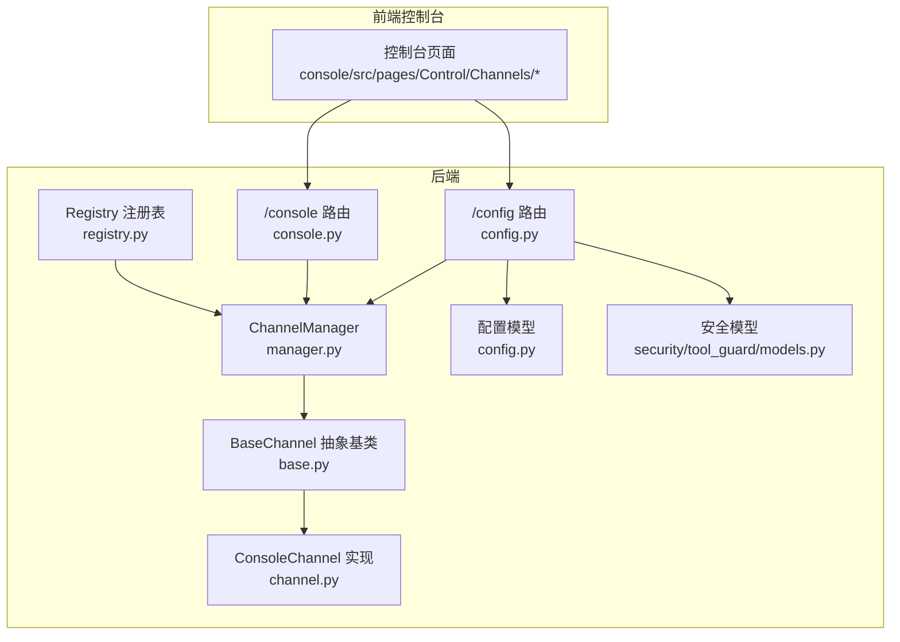
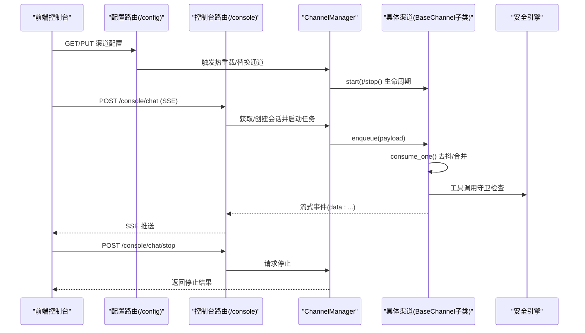
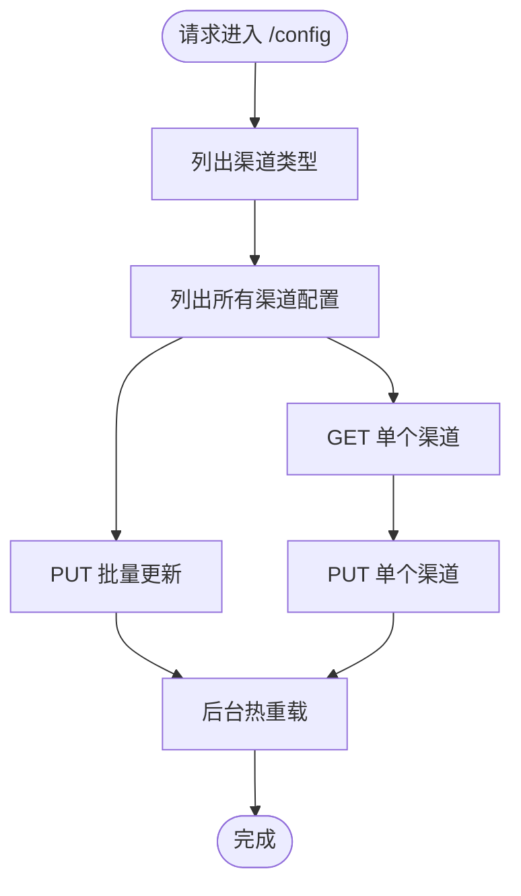
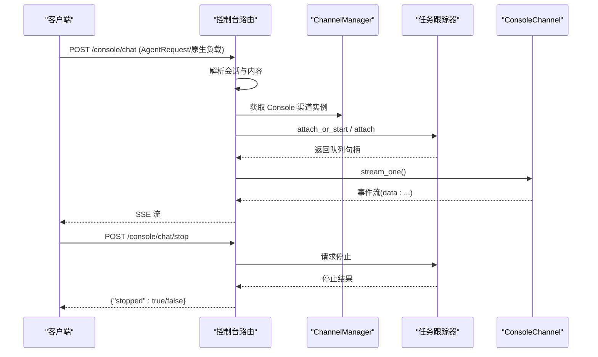
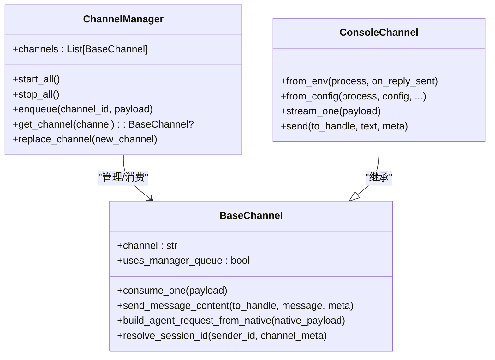
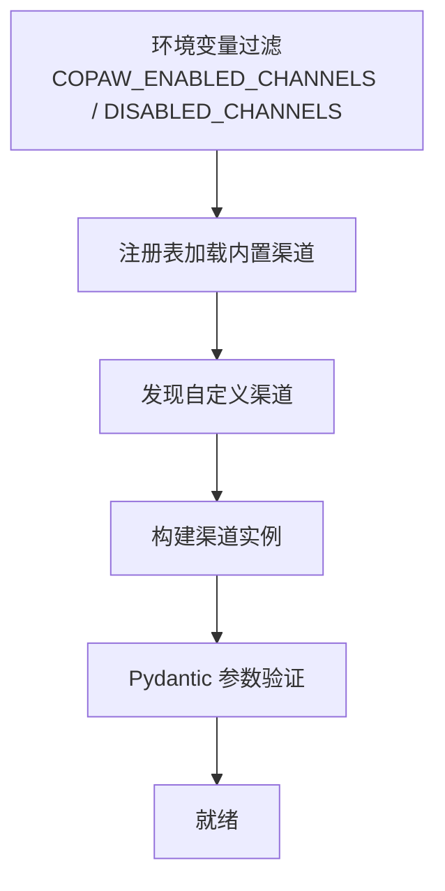
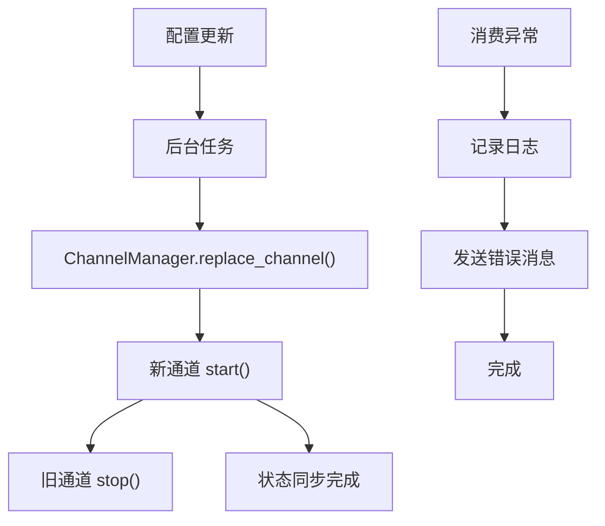
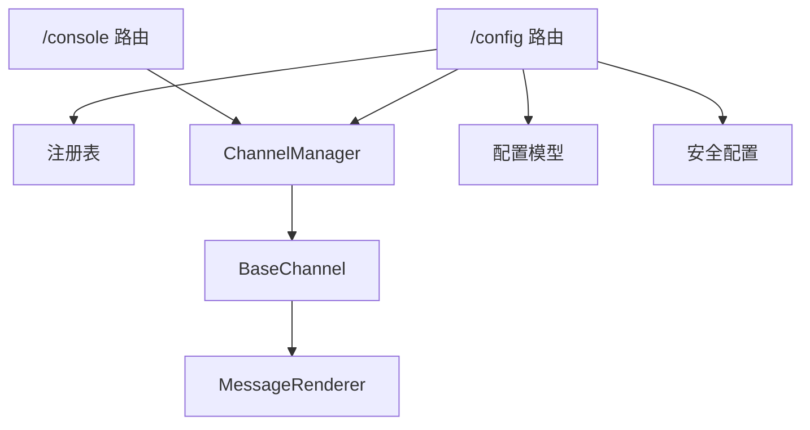

# 渠道管理路由

<cite>
**本文档引用的文件**
- [config.py](file://src/copaw/app/routers/config.py)
- [console.py](file://src/copaw/app/routers/console.py)
- [manager.py](file://src/copaw/app/channels/manager.py)
- [base.py](file://src/copaw/app/channels/base.py)
- [registry.py](file://src/copaw/app/channels/registry.py)
- [schema.py](file://src/copaw/app/channels/schema.py)
- [config.py](file://src/copaw/config/config.py)
- [channel.py](file://src/copaw/app/channels/console/channel.py)
- [models.py](file://src/copaw/security/tool_guard/models.py)
- [utils.py](file://src/copaw/config/utils.py)
</cite>

## 目录
1. [简介](#简介)
2. [项目结构](#项目结构)
3. [核心组件](#核心组件)
4. [架构总览](#架构总览)
5. [详细组件分析](#详细组件分析)
6. [依赖关系分析](#依赖关系分析)
7. [性能考虑](#性能考虑)
8. [故障排除指南](#故障排除指南)
9. [结论](#结论)
10. [附录](#附录)

## 简介
本文件为 CoPaw 渠道管理路由模块的技术文档，重点覆盖以下内容：
- 渠道配置管理 API（config.py）：提供渠道类型管理、配置参数验证、心跳与路由设置、安全策略配置等接口。
- 控制台交互 API（console.py）：提供聊天流式输出、文件上传下载、推送消息等控制台交互能力。
- 渠道类型管理与配置参数验证：基于 Pydantic 的配置模型与环境过滤机制。
- 连接状态监控与热重载：通过后台任务触发配置热更新与通道替换。
- 错误处理与重连机制：统一的错误捕获、消息去抖与重连策略。
- 安全控制与合规：工具调用守卫、技能扫描白名单、文件访问限制等。
- 性能优化与故障排除：队列并发、会话合并、超时与退避策略等。

## 项目结构
CoPaw 的渠道管理路由位于后端 FastAPI 路由器中，配合通道管理器与基础通道类实现统一的消息收发与状态管理。前端控制台页面通过 API 与后端交互，实现渠道配置与聊天体验。

图表来源
- [config.py:1-625](file://src/copaw/app/routers/config.py#L1-L625)
- [console.py:1-247](file://src/copaw/app/routers/console.py#L1-L247)
- [manager.py:1-580](file://src/copaw/app/channels/manager.py#L1-L580)
- [base.py:1-868](file://src/copaw/app/channels/base.py#L1-L868)
- [registry.py:1-138](file://src/copaw/app/channels/registry.py#L1-L138)
- [config.py:1-1196](file://src/copaw/config/config.py#L1-L1196)
- [channel.py:1-506](file://src/copaw/app/channels/console/channel.py#L1-L506)
- [models.py:1-185](file://src/copaw/security/tool_guard/models.py#L1-L185)

章节来源
- [config.py:1-625](file://src/copaw/app/routers/config.py#L1-L625)
- [console.py:1-247](file://src/copaw/app/routers/console.py#L1-L247)

## 核心组件
- 配置路由（/config）
  - 渠道列表与类型枚举、批量更新、单个渠道更新与查询。
  - 心跳配置读取与更新，并异步重调度。
  - 用户时区、代理路由、安全策略（工具守卫、文件守卫、技能扫描）。
- 控制台路由（/console）
  - 聊天流式输出（SSE）、断线重连、停止运行中的聊天。
  - 文件上传与媒体目录服务、推送消息拉取。
- 渠道管理器（ChannelManager）
  - 统一队列与消费者循环，按会话合并请求，支持多工作线程并行处理。
  - 动态替换通道实例，保证平滑切换。
- 基础通道（BaseChannel）
  - 消息去抖、会话解析、请求构建、事件处理与错误回调。
  - 内容渲染与发送，支持文本、图片、音频、视频、文件等多类型。
- 注册表（Registry）
  - 内置与自定义渠道注册，支持环境过滤启用/禁用。
- 配置模型（Config）
  - 各渠道配置模型（如 Telegram、DingTalk、Console 等），统一的 BaseChannelConfig。
- ConsoleChannel
  - 控制台输出通道，打印到终端并推送消息到前端。
- 安全模型（ToolGuard）
  - 工具调用守卫的威胁分类、严重级别、审计发现与结果聚合。

章节来源
- [config.py:1-625](file://src/copaw/app/routers/config.py#L1-L625)
- [console.py:1-247](file://src/copaw/app/routers/console.py#L1-L247)
- [manager.py:1-580](file://src/copaw/app/channels/manager.py#L1-L580)
- [base.py:1-868](file://src/copaw/app/channels/base.py#L1-L868)
- [registry.py:1-138](file://src/copaw/app/channels/registry.py#L1-L138)
- [config.py:1-1196](file://src/copaw/config/config.py#L1-L1196)
- [channel.py:1-506](file://src/copaw/app/channels/console/channel.py#L1-L506)
- [models.py:1-185](file://src/copaw/security/tool_guard/models.py#L1-L185)

## 架构总览
下图展示从前端到后端的调用链路与关键组件交互。

图表来源
- [config.py:111-152](file://src/copaw/app/routers/config.py#L111-L152)
- [console.py:68-151](file://src/copaw/app/routers/console.py#L68-L151)
- [manager.py:322-382](file://src/copaw/app/channels/manager.py#L322-L382)
- [base.py:443-583](file://src/copaw/app/channels/base.py#L443-L583)
- [models.py:60-185](file://src/copaw/security/tool_guard/models.py#L60-L185)

## 详细组件分析

### 配置路由（/config）设计与实现
- 渠道类型与列表
  - 列出可用渠道类型与当前配置；内置渠道通过注册表与环境过滤决定是否启用。
  - 支持返回渠道是否为内置类型标记。
- 批量与单个渠道配置
  - PUT /config/channels：一次性替换所有渠道配置，保存后触发后台热重载。
  - GET/PUT /config/channels/{channel_name}：按名称查询或更新单个渠道配置。
- 心跳配置
  - GET/PUT /config/heartbeat：读取或更新心跳间隔、目标与活跃时段，并异步重调度。
- 用户时区
  - GET/PUT /config/user-timezone：读取或设置用户 IANA 时区。
- 代理路由与 LLM 路由
  - GET/PUT /config/agents/llm-routing：读取或更新代理 LLM 路由策略（本地优先/云端优先）。
- 安全策略
  - 工具守卫：GET/PUT /config/security/tool-guard，列出内置规则，动态启用/禁用与重载规则。
  - 文件守卫：GET/PUT /config/security/file-guard，控制敏感路径与开关。
  - 技能扫描：GET/PUT /config/security/skill-scanner，白名单增删与历史记录清理。

图表来源
- [config.py:59-152](file://src/copaw/app/routers/config.py#L59-L152)

章节来源
- [config.py:59-152](file://src/copaw/app/routers/config.py#L59-L152)
- [config.py:268-325](file://src/copaw/app/routers/config.py#L268-L325)
- [config.py:352-379](file://src/copaw/app/routers/config.py#L352-L379)
- [config.py:382-501](file://src/copaw/app/routers/config.py#L382-L501)
- [config.py:503-564](file://src/copaw/app/routers/config.py#L503-L564)

### 控制台路由（/console）设计与实现
- 聊天流式输出（SSE）
  - POST /console/chat：接收 AgentRequest 或原生负载，解析会话与内容，启动或附加到现有任务队列，返回 SSE 流。
  - 支持断线重连（reconnect=true），通过任务跟踪器附加到已运行的会话。
  - 支持停止运行中的聊天（POST /console/chat/stop）。
- 文件上传与媒体服务
  - POST /console/upload：限制最大大小，生成唯一文件名，写入媒体目录，返回可访问 URL。
  - GET /console/files/{agent_id}/{filename}：安全地提供媒体文件服务，防止路径穿越。
- 推送消息
  - GET /console/push-messages：按会话拉取消息或获取最近未消费消息。

图表来源
- [console.py:68-166](file://src/copaw/app/routers/console.py#L68-L166)
- [channel.py:272-364](file://src/copaw/app/channels/console/channel.py#L272-L364)

章节来源
- [console.py:68-166](file://src/copaw/app/routers/console.py#L68-L166)
- [console.py:169-229](file://src/copaw/app/routers/console.py#L169-L229)
- [console.py:232-246](file://src/copaw/app/routers/console.py#L232-L246)

### 渠道管理器（ChannelManager）与基础通道（BaseChannel）
- ChannelManager
  - 为每个启用的渠道创建队列与消费者任务，支持多工作线程并行处理同一渠道的不同会话。
  - 提供会话级去抖与批量合并，避免重复与乱序问题。
  - 支持动态替换单个渠道实例，保证在不中断其他渠道的情况下进行热切换。
- BaseChannel
  - 统一的消费流程：将负载转换为 AgentRequest，应用去抖与合并，执行处理循环，发送消息并处理错误。
  - 支持时间去抖（debounce）与内容去抖（无文本缓冲直到出现文本），音频消息可绕过去抖立即处理。
  - 提供渲染器将消息转换为可发送的内容部件（文本、图片、音频、视频、文件、拒绝）。

图表来源
- [manager.py:114-580](file://src/copaw/app/channels/manager.py#L114-L580)
- [base.py:69-868](file://src/copaw/app/channels/base.py#L69-L868)
- [channel.py:57-506](file://src/copaw/app/channels/console/channel.py#L57-L506)

章节来源
- [manager.py:114-580](file://src/copaw/app/channels/manager.py#L114-L580)
- [base.py:69-868](file://src/copaw/app/channels/base.py#L69-L868)
- [channel.py:57-506](file://src/copaw/app/channels/console/channel.py#L57-L506)

### 渠道类型管理与配置参数验证
- 渠道类型管理
  - 内置渠道键集合与注册表加载，支持自定义渠道动态发现与注册。
  - 通过环境变量 COPAW_ENABLED_CHANNELS/COPAW_DISABLED_CHANNELS 对渠道进行启用/禁用过滤。
- 配置参数验证
  - 使用 Pydantic 模型定义各渠道配置字段与默认值，确保参数合法性。
  - BaseChannelConfig 提供通用字段（启用、前缀、过滤策略、权限策略等）。
  - 渠道特定配置（如 Telegram、DingTalk、Console 等）在配置模型中定义。

图表来源
- [registry.py:19-137](file://src/copaw/app/channels/registry.py#L19-L137)
- [utils.py:346-366](file://src/copaw/config/utils.py#L346-L366)
- [config.py:31-208](file://src/copaw/config/config.py#L31-L208)

章节来源
- [registry.py:19-137](file://src/copaw/app/channels/registry.py#L19-L137)
- [utils.py:346-366](file://src/copaw/config/utils.py#L346-L366)
- [config.py:31-208](file://src/copaw/config/config.py#L31-L208)

### 渠道状态同步、错误处理与重连机制
- 状态同步
  - 配置更新后通过后台任务触发热重载，ChannelManager 替换旧通道实例并启动新实例。
  - 心跳配置更新后异步重调度，确保调度器与配置一致。
- 错误处理
  - BaseChannel 在消费失败时调用 _on_consume_error，默认通过 send_content_parts 发送错误文本。
  - 控制台路由对异常进行日志记录并返回 JSON 错误事件。
- 重连机制
  - 部分渠道（如 QQ）实现指数退避与快速断开限速策略，避免频繁重连导致封禁。
  - ConsoleChannel 作为输出通道，主要负责消息渲染与推送，不涉及网络重连。

图表来源
- [config.py:132-150](file://src/copaw/app/routers/config.py#L132-L150)
- [manager.py:434-497](file://src/copaw/app/channels/manager.py#L434-L497)
- [base.py:631-646](file://src/copaw/app/channels/base.py#L631-L646)
- [console.py:130-142](file://src/copaw/app/routers/console.py#L130-L142)

章节来源
- [config.py:132-150](file://src/copaw/app/routers/config.py#L132-L150)
- [manager.py:434-497](file://src/copaw/app/channels/manager.py#L434-L497)
- [base.py:631-646](file://src/copaw/app/channels/base.py#L631-L646)
- [console.py:130-142](file://src/copaw/app/routers/console.py#L130-L142)

### 渠道配置模板与参数校验规则
- 渠道配置模板
  - Console 渠道：启用标志、媒体目录、机器人前缀等。
  - Telegram/DingTalk/Feishu 等：令牌、密钥、域名、主题等。
- 参数校验规则
  - Pydantic 字段约束（必填、范围、枚举值等）。
  - BaseChannelConfig 通用字段：启用、前缀、过滤策略、权限策略、提及要求等。
  - 环境过滤：仅允许指定渠道启用或禁用。

章节来源
- [config.py:31-208](file://src/copaw/config/config.py#L31-L208)
- [config.py:222-234](file://src/copaw/config/config.py#L222-L234)
- [config.py:419-442](file://src/copaw/config/config.py#L419-L442)
- [utils.py:346-366](file://src/copaw/config/utils.py#L346-L366)

### 响应数据格式与使用示例
- 渠道配置
  - GET /config/channels：返回渠道键到配置对象的映射，内置类型标记 isBuiltin。
  - PUT /config/channels：返回更新后的 ChannelConfig。
  - GET/PUT /config/channels/{channel_name}：返回对应渠道配置。
- 心跳配置
  - GET /config/heartbeat：返回心跳配置（含活跃时段）。
  - PUT /config/heartbeat：返回更新后的心跳配置。
- 用户时区
  - GET/PUT /config/user-timezone：返回或设置时区。
- 安全策略
  - GET /config/security/tool-guard：返回工具守卫配置。
  - GET /config/security/skill-scanner：返回技能扫描配置。
  - GET /config/security/skill-scanner/whitelist：返回白名单条目列表。
- 控制台交互
  - POST /console/chat：返回 SSE 事件流，事件类型包含消息完成与响应事件。
  - POST /console/chat/stop：返回停止结果。
  - POST /console/upload：返回存储后的文件名与大小。
  - GET /console/files/{agent_id}/{filename}：返回文件内容。
  - GET /console/push-messages：返回推送消息列表。

章节来源
- [config.py:59-196](file://src/copaw/app/routers/config.py#L59-L196)
- [config.py:268-325](file://src/copaw/app/routers/config.py#L268-L325)
- [config.py:352-379](file://src/copaw/app/routers/config.py#L352-L379)
- [config.py:382-564](file://src/copaw/app/routers/config.py#L382-L564)
- [console.py:68-246](file://src/copaw/app/routers/console.py#L68-L246)

## 依赖关系分析
- 路由器依赖
  - /config 依赖配置模型与环境过滤函数，以及 ChannelManager 的热重载能力。
  - /console 依赖 ChannelManager 的通道实例与任务跟踪器。
- 渠道层依赖
  - ChannelManager 依赖注册表与基础通道抽象类，按可用渠道创建实例。
  - BaseChannel 依赖渲染器与消息内容类型，实现统一的发送与渲染逻辑。
- 安全层依赖
  - 工具守卫与技能扫描配置通过路由器暴露，实时生效于处理流程。

图表来源
- [config.py:1-625](file://src/copaw/app/routers/config.py#L1-L625)
- [console.py:1-247](file://src/copaw/app/routers/console.py#L1-L247)
- [registry.py:1-138](file://src/copaw/app/channels/registry.py#L1-L138)
- [manager.py:1-580](file://src/copaw/app/channels/manager.py#L1-L580)
- [base.py:1-868](file://src/copaw/app/channels/base.py#L1-L868)

章节来源
- [config.py:1-625](file://src/copaw/app/routers/config.py#L1-L625)
- [console.py:1-247](file://src/copaw/app/routers/console.py#L1-L247)
- [registry.py:1-138](file://src/copaw/app/channels/registry.py#L1-L138)
- [manager.py:1-580](file://src/copaw/app/channels/manager.py#L1-L580)
- [base.py:1-868](file://src/copaw/app/channels/base.py#L1-L868)

## 性能考虑
- 并发与队列
  - ChannelManager 为每个渠道维护固定大小队列，每渠道多个消费者工作线程并行处理不同会话，提升吞吐量。
- 会话合并与去抖
  - 基于会话键的去抖与批量合并，减少重复与乱序，降低下游压力。
- 异步热重载
  - 配置更新与心跳重调度均采用非阻塞后台任务，避免阻塞主请求循环。
- I/O 与编码
  - ConsoleChannel 在 Windows 上进行 stdout 编码修复，避免管道场景下的编码错误。
- 超时与退避
  - 部分渠道（如 QQ）实现指数退避与快速断开限速，避免频繁重连导致封禁。

[本节为通用性能讨论，无需特定文件来源]

## 故障排除指南
- 渠道不可用或未启用
  - 检查环境变量 COPAW_ENABLED_CHANNELS/COPAW_DISABLED_CHANNELS 是否正确过滤渠道。
  - 确认注册表已加载内置渠道且未抛出异常。
- 配置更新无效
  - 确认 PUT /config/channels 成功返回并触发后台热重载。
  - 检查 ChannelManager.replace_channel 是否成功启动新通道并停止旧通道。
- 控制台聊天无法断线重连
  - 确认请求体中 reconnect=true，并提供正确的会话标识。
  - 检查任务跟踪器是否仍存在该会话的任务句柄。
- 文件上传失败
  - 检查文件大小是否超过限制，媒体目录是否存在且可写。
- SSE 流异常
  - 查看日志中异常堆栈，确认 BaseChannel._run_process_loop 是否抛出异常。
- 工具调用被拦截
  - 检查工具守卫规则与严重级别，必要时调整规则或临时禁用守卫。

章节来源
- [utils.py:346-366](file://src/copaw/config/utils.py#L346-L366)
- [registry.py:43-76](file://src/copaw/app/channels/registry.py#L43-L76)
- [config.py:132-150](file://src/copaw/app/routers/config.py#L132-L150)
- [manager.py:434-497](file://src/copaw/app/channels/manager.py#L434-L497)
- [console.py:112-128](file://src/copaw/app/routers/console.py#L112-L128)
- [console.py:185-191](file://src/copaw/app/routers/console.py#L185-L191)
- [base.py:576-582](file://src/copaw/app/channels/base.py#L576-L582)

## 结论
CoPaw 的渠道管理路由模块通过清晰的路由分层、统一的通道抽象与强大的管理器，实现了灵活的渠道配置、稳定的交互体验与可扩展的安全控制。配置热重载、会话去抖与批量合并、异步错误处理与 SSE 流式输出共同构成了高可用的渠道基础设施。建议在生产环境中结合环境变量进行渠道过滤，并根据业务需求调整工具守卫与技能扫描策略，以平衡安全性与易用性。

[本节为总结性内容，无需特定文件来源]

## 附录
- 关键接口一览
  - /config/channels：GET/PUT 列出与批量更新渠道配置
  - /config/channels/{channel_name}：GET/PUT 查询与更新单个渠道配置
  - /config/heartbeat：GET/PUT 心跳配置
  - /config/user-timezone：GET/PUT 用户时区
  - /config/security/tool-guard：GET/PUT 工具守卫
  - /config/security/file-guard：GET/PUT 文件守卫
  - /config/security/skill-scanner：GET/PUT 技能扫描
  - /console/chat：POST 聊天流式输出
  - /console/chat/stop：POST 停止聊天
  - /console/upload：POST 文件上传
  - /console/files/{agent_id}/{filename}：GET 文件服务
  - /console/push-messages：GET 推送消息

[本节为概览性内容，无需特定文件来源]