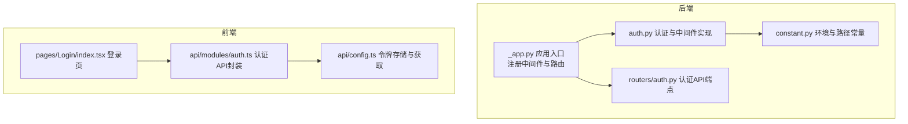
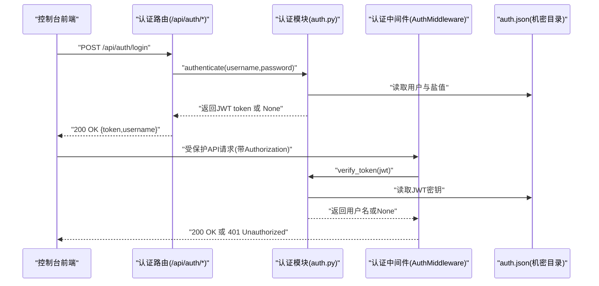
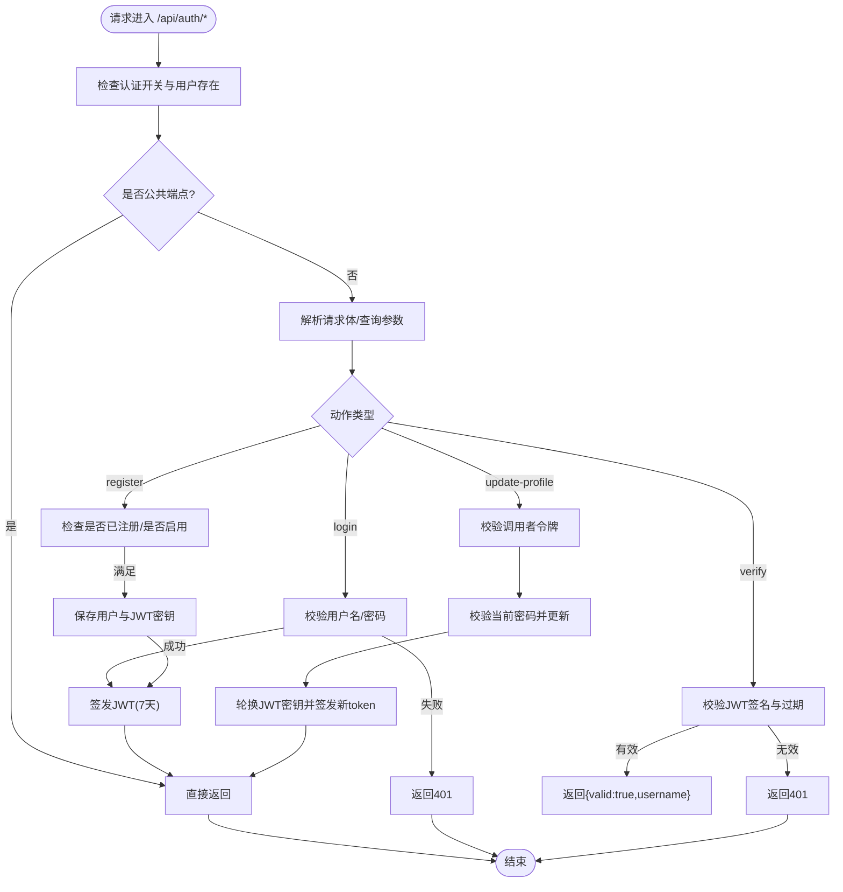
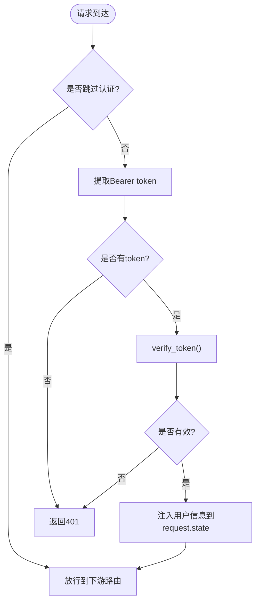
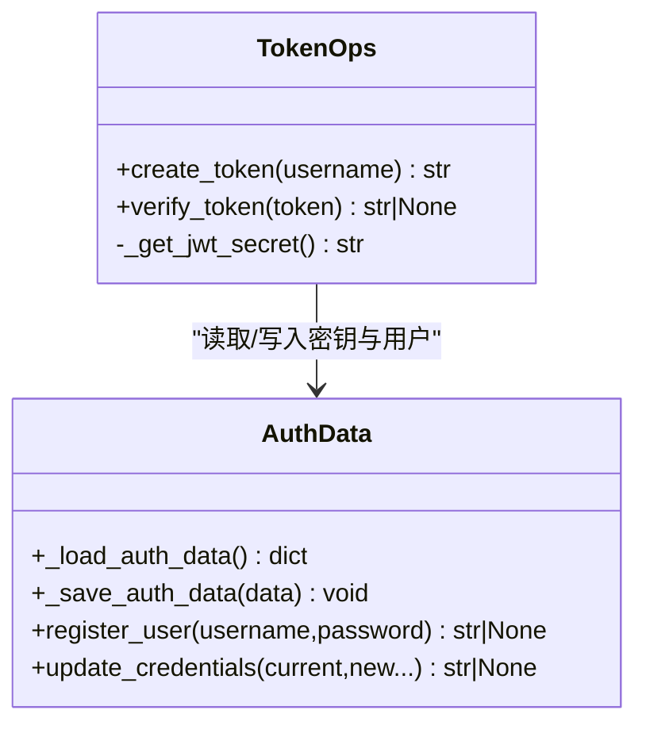
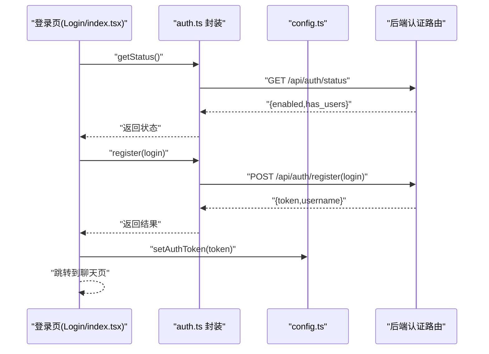
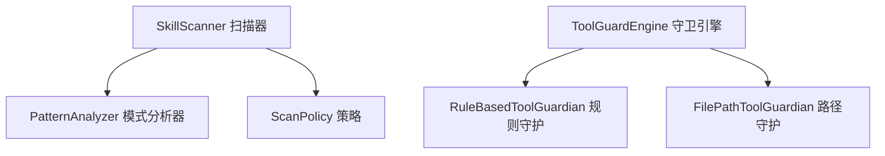
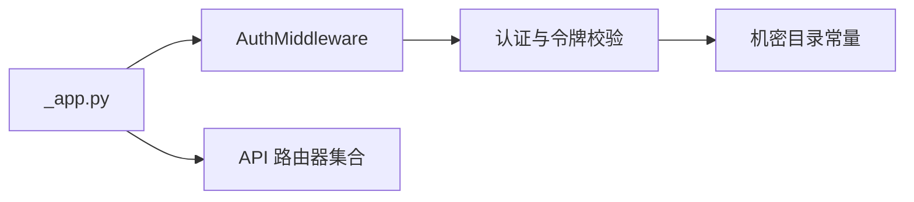

# 认证授权路由

<cite>
**本文引用的文件**
- [src/copaw/app/routers/auth.py](file://src/copaw/app/routers/auth.py)
- [src/copaw/app/auth.py](file://src/copaw/app/auth.py)
- [src/copaw/app/_app.py](file://src/copaw/app/_app.py)
- [src/copaw/constant.py](file://src/copaw/constant.py)
- [console/src/api/modules/auth.ts](file://console/src/api/modules/auth.ts)
- [console/src/api/config.ts](file://console/src/api/config.ts)
- [console/src/pages/Login/index.tsx](file://console/src/pages/Login/index.tsx)
- [website/public/docs/security.zh.md](file://website/public/docs/security.zh.md)
- [SECURITY.md](file://SECURITY.md)
- [src/copaw/security/skill_scanner/scanner.py](file://src/copaw/security/skill_scanner/scanner.py)
- [src/copaw/security/tool_guard/engine.py](file://src/copaw/security/tool_guard/engine.py)
- [src/copaw/utils/logging.py](file://src/copaw/utils/logging.py)
</cite>

## 目录
1. [简介](#简介)
2. [项目结构](#项目结构)
3. [核心组件](#核心组件)
4. [架构总览](#架构总览)
5. [详细组件分析](#详细组件分析)
6. [依赖分析](#依赖分析)
7. [性能考虑](#性能考虑)
8. [故障排查指南](#故障排查指南)
9. [结论](#结论)
10. [附录](#附录)

## 简介
本文件面向CoPaw认证授权路由模块，系统化阐述用户身份验证、JWT令牌管理、权限控制与中间件拦截策略的设计与实现。文档覆盖以下关键主题：
- 用户登录与注册流程、状态查询与令牌校验接口
- JWT令牌生成、签名、过期时间与刷新策略
- 基于FastAPI中间件的受保护路由与公共路由策略
- 前端认证API封装、本地存储与错误处理
- 安全策略配置、访问控制与信任模型
- 并发会话管理、令牌轮换与安全审计建议

## 项目结构
认证授权相关代码主要分布在后端Python服务与前端控制台两部分：
- 后端
  - 认证路由：/api/auth/*
  - 认证中间件：全局拦截受保护API并校验Bearer令牌
  - 密钥与数据持久化：auth.json（仅运行用户可读写）
- 前端
  - 控制台登录页与认证API封装
  - 令牌本地存储与请求头注入

**图表来源**
- [src/copaw/app/_app.py:253-253](file://src/copaw/app/_app.py#L253-L253)
- [src/copaw/app/auth.py:339-405](file://src/copaw/app/auth.py#L339-L405)
- [src/copaw/app/routers/auth.py:19-114](file://src/copaw/app/routers/auth.py#L19-L114)
- [src/copaw/constant.py:72-86](file://src/copaw/constant.py#L72-L86)
- [console/src/pages/Login/index.tsx:10-70](file://console/src/pages/Login/index.tsx#L10-L70)
- [console/src/api/modules/auth.ts:14-74](file://console/src/api/modules/auth.ts#L14-L74)
- [console/src/api/config.ts:23-41](file://console/src/api/config.ts#L23-L41)

**章节来源**
- [src/copaw/app/_app.py:253-253](file://src/copaw/app/_app.py#L253-L253)
- [src/copaw/app/auth.py:339-405](file://src/copaw/app/auth.py#L339-L405)
- [src/copaw/app/routers/auth.py:19-114](file://src/copaw/app/routers/auth.py#L19-L114)
- [src/copaw/constant.py:72-86](file://src/copaw/constant.py#L72-L86)
- [console/src/pages/Login/index.tsx:10-70](file://console/src/pages/Login/index.tsx#L10-L70)
- [console/src/api/modules/auth.ts:14-74](file://console/src/api/modules/auth.ts#L14-L74)
- [console/src/api/config.ts:23-41](file://console/src/api/config.ts#L23-L41)

## 核心组件
- 认证API端点
  - POST /api/auth/login：用户名+密码登录，返回token与username
  - POST /api/auth/register：首次注册（单用户），需开启认证
  - GET /api/auth/status：查询认证是否启用与是否存在用户
  - GET /api/auth/verify：校验Bearer令牌有效性
  - POST /api/auth/update-profile：更新当前用户信息（当前密码校验）
- 认证中间件
  - 全局拦截受保护路由，提取Authorization头或WebSocket查询参数中的token
  - 放行公共路径与OPTIONS预检请求；支持本地回环地址豁免
- 令牌与数据持久化
  - HMAC-SHA256签名的JWT，7天过期
  - auth.json保存用户凭据与JWT密钥，严格文件权限
- 前端认证
  - 控制台登录页调用认证API，成功后localStorage存储token
  - 所有受保护API请求自动附加Authorization: Bearer token

**章节来源**
- [src/copaw/app/routers/auth.py:42-114](file://src/copaw/app/routers/auth.py#L42-L114)
- [src/copaw/app/auth.py:339-405](file://src/copaw/app/auth.py#L339-L405)
- [src/copaw/app/auth.py:114-132](file://src/copaw/app/auth.py#L114-L132)
- [src/copaw/app/auth.py:166-188](file://src/copaw/app/auth.py#L166-L188)
- [console/src/api/modules/auth.ts:14-74](file://console/src/api/modules/auth.ts#L14-L74)
- [console/src/api/config.ts:23-41](file://console/src/api/config.ts#L23-L41)

## 架构总览
下图展示从客户端到后端认证流程的关键交互：

**图表来源**
- [src/copaw/app/routers/auth.py:42-52](file://src/copaw/app/routers/auth.py#L42-L52)
- [src/copaw/app/auth.py:315-331](file://src/copaw/app/auth.py#L315-L331)
- [src/copaw/app/auth.py:135-158](file://src/copaw/app/auth.py#L135-L158)
- [src/copaw/app/auth.py:339-370](file://src/copaw/app/auth.py#L339-L370)
- [src/copaw/app/auth.py:166-188](file://src/copaw/app/auth.py#L166-L188)

## 详细组件分析

### 认证API端点
- 登录
  - 输入：用户名、密码
  - 行为：若认证未启用，返回空token；否则校验凭据并签发7天JWT
  - 错误：401无效凭据
- 注册
  - 输入：用户名、密码
  - 行为：仅允许一次注册；需通过环境变量启用认证
  - 错误：403未启用/已存在用户；400参数缺失；409注册失败
- 状态
  - 输出：enabled、has_users
- 令牌校验
  - 输入：Authorization: Bearer token
  - 行为：校验签名与过期时间
  - 错误：401无token或无效/过期
- 更新资料
  - 输入：current_password + 新用户名/新密码
  - 行为：校验当前密码；更新凭据并轮换JWT密钥，签发新token
  - 错误：400参数非法；401当前密码错误；403未启用/无用户

**图表来源**
- [src/copaw/app/routers/auth.py:42-174](file://src/copaw/app/routers/auth.py#L42-L174)
- [src/copaw/app/auth.py:214-238](file://src/copaw/app/auth.py#L214-L238)
- [src/copaw/app/auth.py:273-307](file://src/copaw/app/auth.py#L273-L307)
- [src/copaw/app/auth.py:135-158](file://src/copaw/app/auth.py#L135-L158)

**章节来源**
- [src/copaw/app/routers/auth.py:42-174](file://src/copaw/app/routers/auth.py#L42-L174)
- [src/copaw/app/auth.py:214-238](file://src/copaw/app/auth.py#L214-L238)
- [src/copaw/app/auth.py:273-307](file://src/copaw/app/auth.py#L273-L307)
- [src/copaw/app/auth.py:135-158](file://src/copaw/app/auth.py#L135-L158)

### 认证中间件与受保护路由
- 中间件职责
  - 跳过公共路径与OPTIONS预检
  - 提取Authorization头或WebSocket查询参数中的token
  - 校验token并注入request.state.user
- 受保护范围
  - 默认仅对/api/*路由生效
  - 本地回环(127.0.0.1/::1)请求豁免（CLI不受影响）

**图表来源**
- [src/copaw/app/auth.py:339-405](file://src/copaw/app/auth.py#L339-L405)

**章节来源**
- [src/copaw/app/auth.py:339-405](file://src/copaw/app/auth.py#L339-L405)

### 令牌生成与校验
- 令牌结构
  - 载荷：sub(用户名)、iat(签发时间)、exp(过期时间)
  - 签名：HMAC-SHA256(secret, base64url(载荷))
  - 过期：7天
- 密钥管理
  - 首次使用生成随机密钥并保存至auth.json
  - 更新密码时轮换密钥，使旧会话失效
- 存储与传输
  - 前端：localStorage存储token
  - 传输：Authorization: Bearer token

**图表来源**
- [src/copaw/app/auth.py:114-158](file://src/copaw/app/auth.py#L114-L158)
- [src/copaw/app/auth.py:166-188](file://src/copaw/app/auth.py#L166-L188)
- [src/copaw/app/auth.py:214-238](file://src/copaw/app/auth.py#L214-L238)
- [src/copaw/app/auth.py:273-307](file://src/copaw/app/auth.py#L273-L307)

**章节来源**
- [src/copaw/app/auth.py:114-158](file://src/copaw/app/auth.py#L114-L158)
- [src/copaw/app/auth.py:166-188](file://src/copaw/app/auth.py#L166-L188)
- [src/copaw/app/auth.py:214-238](file://src/copaw/app/auth.py#L214-L238)
- [src/copaw/app/auth.py:273-307](file://src/copaw/app/auth.py#L273-L307)

### 前端认证API与登录页
- 登录页逻辑
  - 首先调用/status判断是否启用认证与是否存在用户
  - 若无用户则进入注册流程，否则进入登录流程
  - 成功后将token写入localStorage并跳转
- API封装
  - login/register/status/update-profile
  - 自动处理非2xx响应并抛出错误

**图表来源**
- [console/src/pages/Login/index.tsx:19-70](file://console/src/pages/Login/index.tsx#L19-L70)
- [console/src/api/modules/auth.ts:14-74](file://console/src/api/modules/auth.ts#L14-L74)
- [console/src/api/config.ts:32-34](file://console/src/api/config.ts#L32-L34)

**章节来源**
- [console/src/pages/Login/index.tsx:19-70](file://console/src/pages/Login/index.tsx#L19-L70)
- [console/src/api/modules/auth.ts:14-74](file://console/src/api/modules/auth.ts#L14-L74)
- [console/src/api/config.ts:32-34](file://console/src/api/config.ts#L32-L34)

### 安全策略与信任模型
- 认证开关与单用户
  - 通过环境变量启用；仅允许注册一个用户
  - 忘记密码：删除机密目录下的auth.json并重启服务以重新注册
- 令牌与文件安全
  - 令牌7天过期；auth.json权限0o600（仅所有者读写）
  - 本地回环请求豁免认证；OPTIONS预检请求放行
- 信任模型
  - 同一实例内已认证调用者视为可信操作员
  - 技能与工具调用不在认证边界内，仅在信任范围内运行

**章节来源**
- [website/public/docs/security.zh.md:165-176](file://website/public/docs/security.zh.md#L165-L176)
- [website/public/docs/security.zh.md:314-328](file://website/public/docs/security.zh.md#L314-L328)
- [SECURITY.md:65-118](file://SECURITY.md#L65-L118)
- [src/copaw/app/auth.py:191-200](file://src/copaw/app/auth.py#L191-L200)
- [src/copaw/app/auth.py:183-188](file://src/copaw/app/auth.py#L183-L188)

### 安全增强：技能扫描与工具守卫
- 技能扫描器
  - 扫描技能包文件，基于规则识别风险
  - 可配置策略与文件限制，支持去重与失败记录
- 工具守卫引擎
  - 在工具调用前进行参数级安全检查
  - 可动态注册守护者并支持规则重载

**图表来源**
- [src/copaw/security/skill_scanner/scanner.py:76-242](file://src/copaw/security/skill_scanner/scanner.py#L76-L242)
- [src/copaw/security/tool_guard/engine.py:53-226](file://src/copaw/security/tool_guard/engine.py#L53-L226)

**章节来源**
- [src/copaw/security/skill_scanner/scanner.py:76-242](file://src/copaw/security/skill_scanner/scanner.py#L76-L242)
- [src/copaw/security/tool_guard/engine.py:53-226](file://src/copaw/security/tool_guard/engine.py#L53-L226)

## 依赖分析
- 应用入口
  - 注册Agent上下文中间件与Auth中间件
  - 包含所有API路由器，挂载在/api前缀下
- 认证模块
  - 依赖机密目录常量与环境变量加载
  - 通过中间件拦截受保护路由

**图表来源**
- [src/copaw/app/_app.py:251-253](file://src/copaw/app/_app.py#L251-L253)
- [src/copaw/app/_app.py:329-344](file://src/copaw/app/_app.py#L329-L344)
- [src/copaw/app/auth.py:339-405](file://src/copaw/app/auth.py#L339-L405)
- [src/copaw/constant.py:72-86](file://src/copaw/constant.py#L72-L86)

**章节来源**
- [src/copaw/app/_app.py:251-253](file://src/copaw/app/_app.py#L251-L253)
- [src/copaw/app/_app.py:329-344](file://src/copaw/app/_app.py#L329-L344)
- [src/copaw/app/auth.py:339-405](file://src/copaw/app/auth.py#L339-L405)
- [src/copaw/constant.py:72-86](file://src/copaw/constant.py#L72-L86)

## 性能考虑
- 令牌校验为O(1)，仅涉及HMAC比较与JSON解析
- 中间件按路径与方法快速判定是否跳过认证，避免不必要的校验
- auth.json读写采用最小必要权限与严格文件权限，降低I/O风险
- 建议
  - 保持JWT短周期（当前7天）以降低泄露风险
  - 对高频受保护路由，确保客户端正确缓存与复用token
  - 使用OPTIONS预检与静态资源白名单减少中间件开销

[本节为通用指导，无需特定文件引用]

## 故障排查指南
- 常见错误与定位
  - 401未认证/无效或过期令牌：检查Authorization头是否正确、前端是否正确存储token
  - 403认证未启用/已注册：确认环境变量与注册状态
  - 400参数非法：检查请求体字段是否为空
- 日志与审计
  - 后端日志命名空间为copaw，可通过文件处理器输出到工作目录日志
  - 建议在生产环境开启文件日志并设置合适级别
- 安全审计要点
  - 确认auth.json权限为0o600
  - 轮换密码后旧token自动失效（密钥轮换）
  - 如遇异常，优先检查机密目录权限与文件完整性

**章节来源**
- [src/copaw/utils/logging.py:104-184](file://src/copaw/utils/logging.py#L104-L184)
- [src/copaw/app/auth.py:183-188](file://src/copaw/app/auth.py#L183-L188)
- [src/copaw/app/auth.py:297-307](file://src/copaw/app/auth.py#L297-L307)

## 结论
CoPaw认证授权路由采用轻量、纯标准库实现的JWT方案，结合FastAPI中间件完成受保护路由拦截。其设计强调：
- 单用户、可选启用的认证模式，适合个人助理场景
- 严格的机密文件权限与密钥轮换机制，提升安全性
- 前后端协同的令牌生命周期管理，保障用户体验与安全

建议在生产环境中：
- 明确启用认证并妥善保管初始凭据
- 配置CORS与静态资源白名单
- 结合技能扫描与工具守卫强化运行时安全

[本节为总结，无需特定文件引用]

## 附录

### API参考与调用示例（路径与含义）
- GET /api/auth/status
  - 返回：enabled(boolean)、has_users(boolean)
  - 用途：前端决定显示登录或注册
- POST /api/auth/register
  - 请求体：{username, password}
  - 返回：{token, username}
  - 用途：首次注册单用户
- POST /api/auth/login
  - 请求体：{username, password}
  - 返回：{token, username}
  - 用途：登录获取令牌
- GET /api/auth/verify
  - 请求头：Authorization: Bearer token
  - 返回：{valid: true, username}
  - 用途：前端定期校验令牌有效性
- POST /api/auth/update-profile
  - 请求头：Authorization: Bearer token
  - 请求体：{current_password, new_username?, new_password?}
  - 返回：{token, username}
  - 用途：修改用户名/密码并签发新token

**章节来源**
- [src/copaw/app/routers/auth.py:42-174](file://src/copaw/app/routers/auth.py#L42-L174)

### 安全最佳实践清单
- 环境配置
  - 明确设置认证开关与机密目录
- 令牌管理
  - 前端仅存储token，避免明文密码
  - 令牌过期后提示重新登录
- 文件与网络
  - 严格限制auth.json权限
  - 启用CORS白名单与静态资源豁免
- 运行时安全
  - 启用技能扫描与工具守卫
  - 限制多用户共享同一实例

**章节来源**
- [website/public/docs/security.zh.md:314-328](file://website/public/docs/security.zh.md#L314-L328)
- [SECURITY.md:65-118](file://SECURITY.md#L65-L118)
- [src/copaw/security/skill_scanner/scanner.py:76-242](file://src/copaw/security/skill_scanner/scanner.py#L76-L242)
- [src/copaw/security/tool_guard/engine.py:53-226](file://src/copaw/security/tool_guard/engine.py#L53-L226)