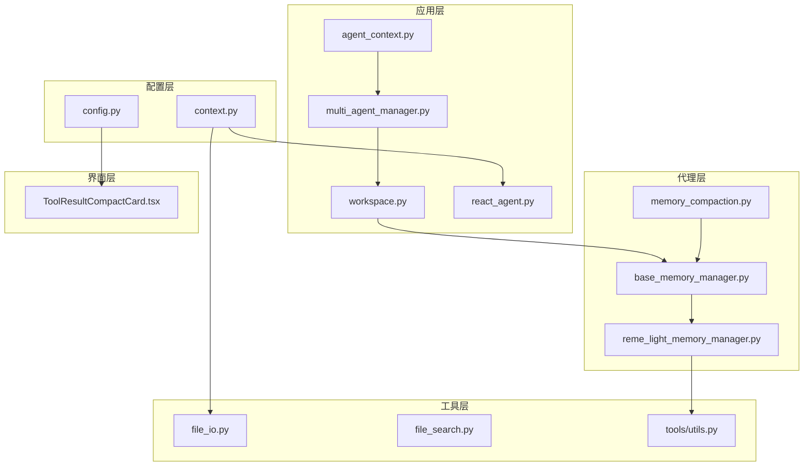
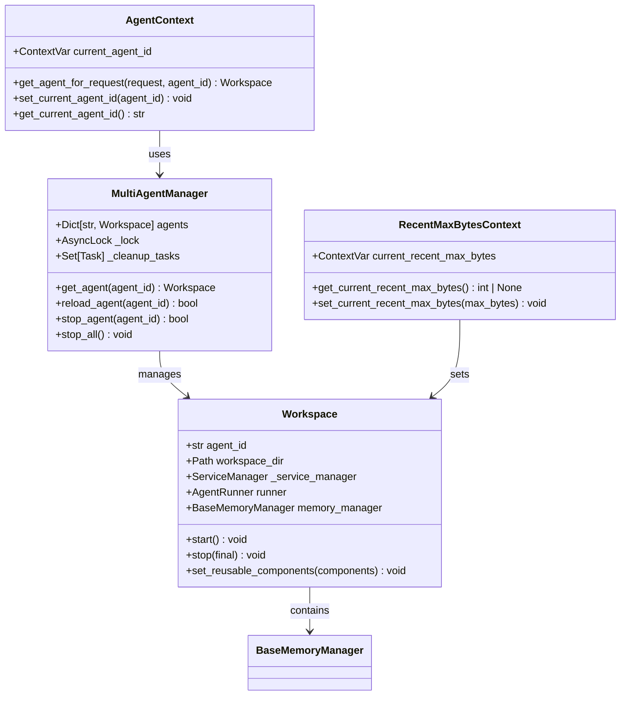
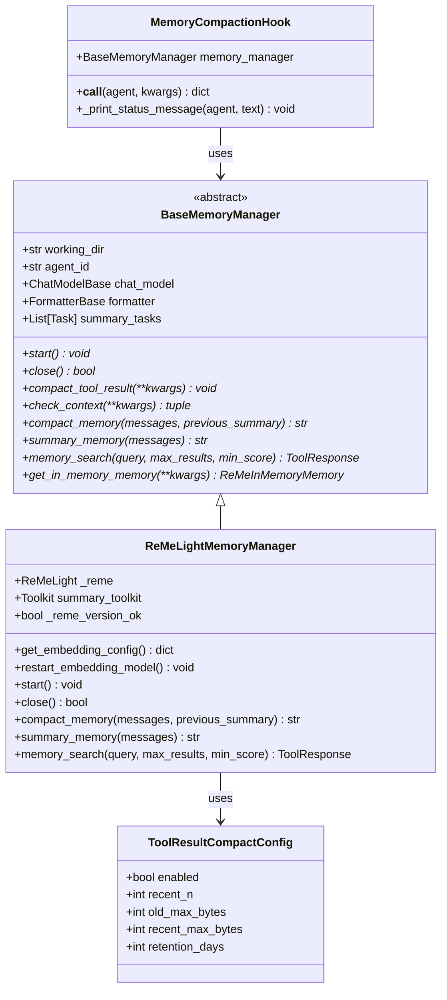
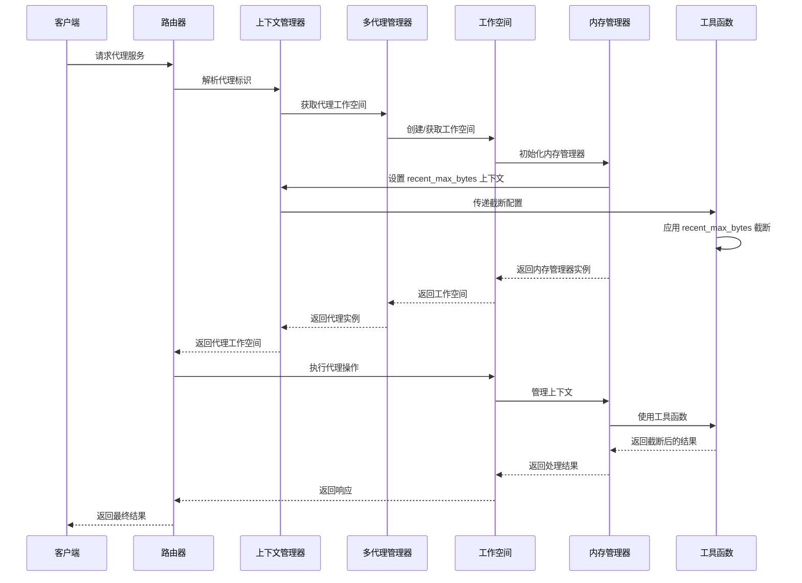
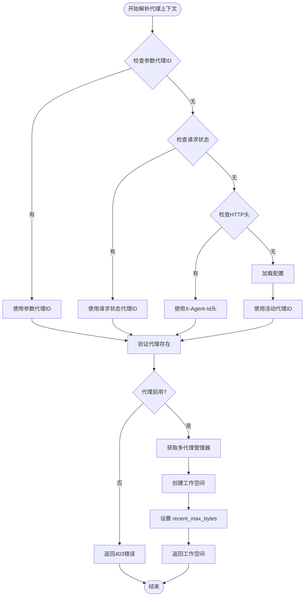
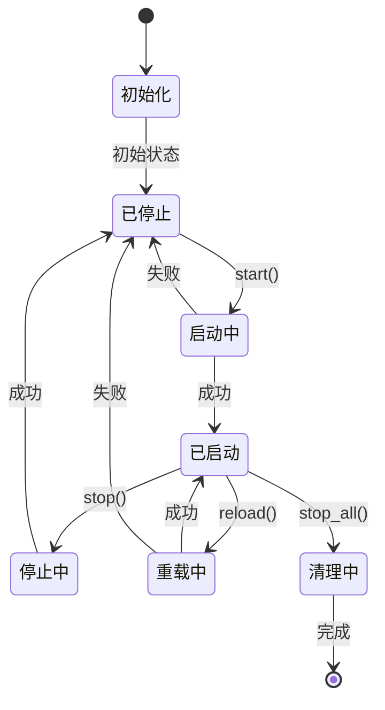
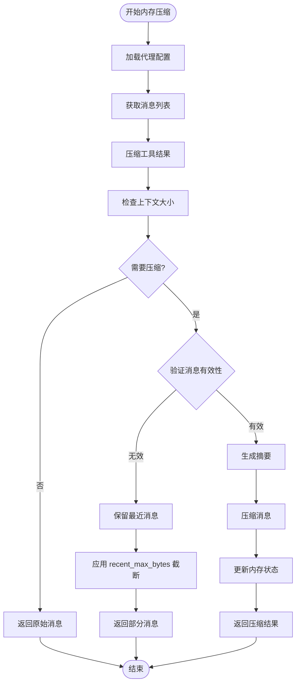
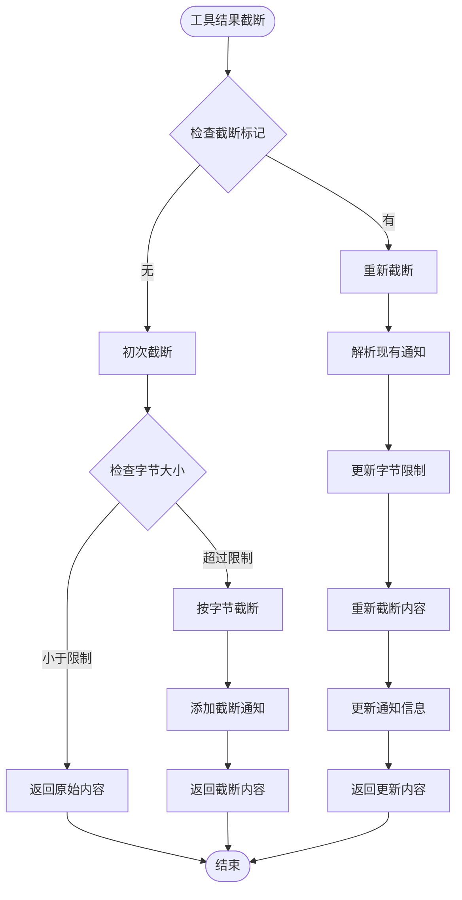
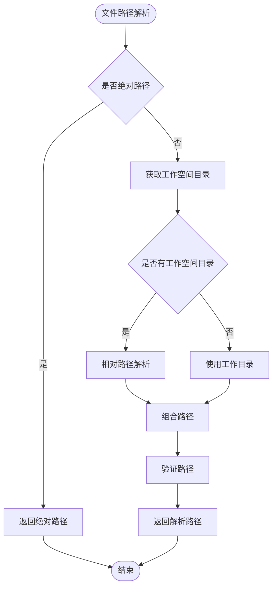
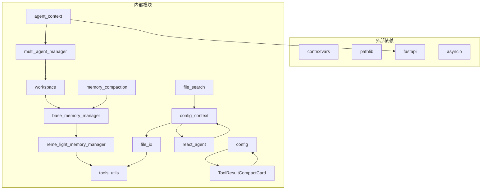

# 上下文管理重构

<cite>
**本文档引用的文件**
- [agent_context.py](file://src/copaw/app/agent_context.py)
- [context.py](file://src/copaw/config/context.py)
- [multi_agent_manager.py](file://src/copaw/app/multi_agent_manager.py)
- [workspace.py](file://src/copaw/app/workspace/workspace.py)
- [memory_compaction.py](file://src/copaw/agents/hooks/memory_compaction.py)
- [base_memory_manager.py](file://src/copaw/agents/memory/base_memory_manager.py)
- [reme_light_memory_manager.py](file://src/copaw/agents/memory/reme_light_memory_manager.py)
- [file_io.py](file://src/copaw/agents/tools/file_io.py)
- [file_search.py](file://src/copaw/agents/tools/file_search.py)
- [utils.py](file://src/copaw/agents/tools/utils.py)
- [react_agent.py](file://src/copaw/agents/react_agent.py)
- [config.py](file://src/copaw/config/config.py)
- [ToolResultCompactCard.tsx](file://console/src/pages/Agent/Config/components/ToolResultCompactCard.tsx)
- [context.en.md](file://website/public/docs/context.en.md)
- [context.zh.md](file://website/public/docs/context.zh.md)
- [constant.py](file://src/copaw/constant.py)
</cite>

## 更新摘要
**所做更改**
- 新增 recent_max_bytes 配置项的详细说明和实现分析
- 更新内存压缩机制章节，包含智能截断工具结果的功能
- 添加工具结果压缩配置的完整说明
- 更新故障排除指南，包含 recent_max_bytes 相关问题

## 目录
1. [简介](#简介)
2. [项目结构](#项目结构)
3. [核心组件](#核心组件)
4. [架构概览](#架构概览)
5. [详细组件分析](#详细组件分析)
6. [依赖关系分析](#依赖关系分析)
7. [性能考虑](#性能考虑)
8. [故障排除指南](#故障排除指南)
9. [结论](#结论)

## 简介

CoPaw 的上下文管理重构是一个重要的系统性改进，旨在优化多代理环境下的上下文处理机制。该重构主要围绕三个核心方面展开：代理上下文变量管理、工作空间目录上下文传递，以及内存压缩机制的优化。

这次重构的核心目标是解决多代理场景下的上下文隔离问题，确保每个代理实例能够独立管理其上下文状态，同时提供高效的内存管理和自动压缩功能。**新增的 recent_max_bytes 配置**进一步增强了工具结果的智能截断能力，防止大文件输出导致的内存问题。

## 项目结构

CoPaw 采用模块化的架构设计，上下文管理相关的代码分布在多个关键模块中：

**图表来源**
- [agent_context.py:1-141](file://src/copaw/app/agent_context.py#L1-L141)
- [multi_agent_manager.py:1-462](file://src/copaw/app/multi_agent_manager.py#L1-L462)
- [workspace.py:1-377](file://src/copaw/app/workspace/workspace.py#L1-L377)
- [react_agent.py:950-1043](file://src/copaw/agents/react_agent.py#L950-L1043)

**章节来源**
- [agent_context.py:1-141](file://src/copaw/app/agent_context.py#L1-L141)
- [context.py:1-59](file://src/copaw/config/context.py#L1-L59)
- [multi_agent_manager.py:1-462](file://src/copaw/app/multi_agent_manager.py#L1-L462)

## 核心组件

### 代理上下文管理器

代理上下文管理器是整个重构的核心组件，负责在多代理环境中维护和传递代理状态信息。

**图表来源**
- [multi_agent_manager.py:17-462](file://src/copaw/app/multi_agent_manager.py#L17-L462)
- [workspace.py:47-377](file://src/copaw/app/workspace/workspace.py#L47-L377)
- [agent_context.py:15-141](file://src/copaw/app/agent_context.py#L15-L141)
- [context.py:36-59](file://src/copaw/config/context.py#L36-L59)

### 内存管理组件

内存管理组件提供了完整的上下文压缩和管理功能，包括自动压缩、摘要生成和搜索功能。**新增的 recent_max_bytes 配置**使得工具结果能够在最近消息和旧消息之间采用不同的截断策略。

**图表来源**
- [base_memory_manager.py:21-224](file://src/copaw/agents/memory/base_memory_manager.py#L21-L224)
- [reme_light_memory_manager.py:31-353](file://src/copaw/agents/memory/reme_light_memory_manager.py#L31-L353)
- [memory_compaction.py:27-214](file://src/copaw/agents/hooks/memory_compaction.py#L27-L214)
- [config.py:363-386](file://src/copaw/config/config.py#L363-L386)

**章节来源**
- [base_memory_manager.py:1-224](file://src/copaw/agents/memory/base_memory_manager.py#L1-L224)
- [reme_light_memory_manager.py:1-353](file://src/copaw/agents/memory/reme_light_memory_manager.py#L1-L353)
- [memory_compaction.py:1-214](file://src/copaw/agents/hooks/memory_compaction.py#L1-L214)
- [config.py:363-386](file://src/copaw/config/config.py#L363-L386)

## 架构概览

CoPaw 的上下文管理重构采用了分层架构设计，确保了系统的可扩展性和维护性。**新增的 recent_max_bytes 配置**通过上下文变量机制在整个系统中传递，实现了智能的工具结果截断。

**图表来源**
- [agent_context.py:22-106](file://src/copaw/app/agent_context.py#L22-L106)
- [multi_agent_manager.py:34-82](file://src/copaw/app/multi_agent_manager.py#L34-L82)
- [workspace.py:321-368](file://src/copaw/app/workspace/workspace.py#L321-L368)
- [react_agent.py:958-967](file://src/copaw/agents/react_agent.py#L958-L967)

## 详细组件分析

### 代理上下文解析器

代理上下文解析器负责从多种来源确定当前请求应该使用的代理实例：

**图表来源**
- [agent_context.py:22-106](file://src/copaw/app/agent_context.py#L22-L106)

**章节来源**
- [agent_context.py:1-141](file://src/copaw/app/agent_context.py#L1-L141)

### 工作空间生命周期管理

工作空间管理器提供了完整的生命周期管理功能，支持零停机重载：

**图表来源**
- [workspace.py:321-368](file://src/copaw/app/workspace/workspace.py#L321-L368)
- [multi_agent_manager.py:200-311](file://src/copaw/app/multi_agent_manager.py#L200-L311)

**章节来源**
- [workspace.py:1-377](file://src/copaw/app/workspace/workspace.py#L1-L377)
- [multi_agent_manager.py:1-462](file://src/copaw/app/multi_agent_manager.py#L1-L462)

### 内存压缩机制

内存压缩机制通过钩子模式实现了智能的上下文管理，**新增的 recent_max_bytes 配置**使得最近的消息可以使用更高的字节限制，而旧消息使用较低的限制。

**图表来源**
- [memory_compaction.py:62-214](file://src/copaw/agents/hooks/memory_compaction.py#L62-L214)
- [reme_light_memory_manager.py:240-300](file://src/copaw/agents/memory/reme_light_memory_manager.py#L240-L300)

**章节来源**
- [memory_compaction.py:1-214](file://src/copaw/agents/hooks/memory_compaction.py#L1-L214)
- [reme_light_memory_manager.py:1-353](file://src/copaw/agents/memory/reme_light_memory_manager.py#L1-L353)

### 工具结果智能截断

**新增功能**：工具结果智能截断机制通过 recent_max_bytes 配置实现了差异化截断策略：

**图表来源**
- [utils.py:151-227](file://src/copaw/agents/tools/utils.py#L151-L227)
- [file_io.py:166-174](file://src/copaw/agents/tools/file_io.py#L166-L174)

**章节来源**
- [utils.py:1-227](file://src/copaw/agents/tools/utils.py#L1-L227)
- [file_io.py:150-349](file://src/copaw/agents/tools/file_io.py#L150-L349)

### 文件工具路径解析

文件工具通过上下文变量实现了多代理环境下的路径解析：

**图表来源**
- [file_io.py:19-36](file://src/copaw/agents/tools/file_io.py#L19-L36)
- [context.py:18-33](file://src/copaw/config/context.py#L18-L33)

**章节来源**
- [file_io.py:1-360](file://src/copaw/agents/tools/file_io.py#L1-L360)
- [file_search.py:131-167](file://src/copaw/agents/tools/file_search.py#L131-L167)
- [context.py:1-59](file://src/copaw/config/context.py#L1-L59)

## 依赖关系分析

上下文管理重构涉及多个模块间的复杂依赖关系，**新增的 recent_max_bytes 配置**增加了以下依赖：

**图表来源**
- [agent_context.py:6-10](file://src/copaw/app/agent_context.py#L6-L10)
- [context.py:8-9](file://src/copaw/config/context.py#L8-L9)
- [file_io.py:12-16](file://src/copaw/agents/tools/file_io.py#L12-L16)

**章节来源**
- [agent_context.py:1-141](file://src/copaw/app/agent_context.py#L1-L141)
- [context.py:1-59](file://src/copaw/config/context.py#L1-L59)
- [file_io.py:1-360](file://src/copaw/agents/tools/file_io.py#L1-L360)

## 性能考虑

上下文管理重构在性能方面进行了多项优化，**新增的 recent_max_bytes 配置**进一步提升了内存使用效率：

### 异步处理优化
- 使用 `asyncio.Lock` 实现线程安全的并发访问
- 支持零停机重载，最小化服务中断时间
- 异步任务管理和清理机制

### 内存管理优化
- **智能的工具结果截断策略**：最近消息使用 higher recent_max_bytes，旧消息使用较低 old_max_bytes
- 后台摘要生成任务队列
- 缓存机制减少重复计算

### 资源管理优化
- 工作空间懒加载机制
- 可重用组件的热重载支持
- 自动清理过期资源

### 字节级截断优化
- **recent_max_bytes 配置**：默认 50000 字节，允许最近消息获得更大的内存空间
- **old_max_bytes 配置**：默认 3000 字节，限制旧消息的内存占用
- **recent_n 配置**：默认 2，指定应用 recent_max_bytes 的最近消息数量

## 故障排除指南

### 常见问题及解决方案

**代理未找到错误**
- 检查代理配置文件中的代理ID
- 验证代理是否已启用
- 确认代理工作空间目录存在

**内存压缩失败**
- 检查 ReMe 版本兼容性
- 验证嵌入模型配置
- 查看日志中的详细错误信息

**路径解析错误**
- 确认工作空间目录权限
- 检查相对路径解析逻辑
- 验证文件系统访问权限

**工具结果截断异常**
- **recent_max_bytes 配置问题**：确认 recent_max_bytes 是否大于 old_max_bytes
- **截断标记损坏**：检查 TRUNCATION_NOTICE_MARKER 是否正确处理
- **内存不足**：监控系统内存使用情况，适当调整截断阈值

**配置验证错误**
- **recent_max_bytes 必须大于 old_max_bytes**：前端表单已添加验证规则
- **recent_n 必须为正整数**：默认值为 2，范围 1-10
- **retention_days 合法性**：默认 5 天，范围 1-10 天

**章节来源**
- [agent_context.py:64-106](file://src/copaw/app/agent_context.py#L64-L106)
- [reme_light_memory_manager.py:129-144](file://src/copaw/agents/memory/reme_light_memory_manager.py#L129-L144)
- [file_io.py:84-104](file://src/copaw/agents/tools/file_io.py#L84-L104)
- [ToolResultCompactCard.tsx:75-88](file://console/src/pages/Agent/Config/components/ToolResultCompactCard.tsx#L75-L88)

## 结论

CoPaw 的上下文管理重构成功实现了多代理环境下的高效上下文管理。通过引入上下文变量、工作空间管理和智能内存压缩机制，系统在保持高可用性的同时显著提升了性能表现。

**新增的 recent_max_bytes 配置**是本次重构的重要创新，它通过以下方式解决了实际问题：

### 主要成果
- 实现了完整的代理上下文隔离机制
- 提供了灵活的工作空间生命周期管理
- 建立了智能的内存压缩和搜索功能
- **新增了工具结果的智能截断机制**，防止大文件输出导致的内存问题
- 确保了系统的可扩展性和维护性

### 技术亮点
- **差异化截断策略**：最近消息（recent_max_bytes）vs 旧消息（old_max_bytes）
- **智能上下文传递**：通过 contextvars 机制在整个系统中传递配置
- **前端配置验证**：确保配置的合理性和一致性
- **向后兼容性**：不影响现有功能，仅增强新能力

这些改进为 CoPaw 在复杂多代理场景下的稳定运行奠定了坚实基础，同时也为未来的功能扩展提供了良好的架构支撑。**recent_max_bytes 配置**的引入特别适用于处理大型文件输出、日志文件和数据导出等场景，有效防止了内存溢出问题。