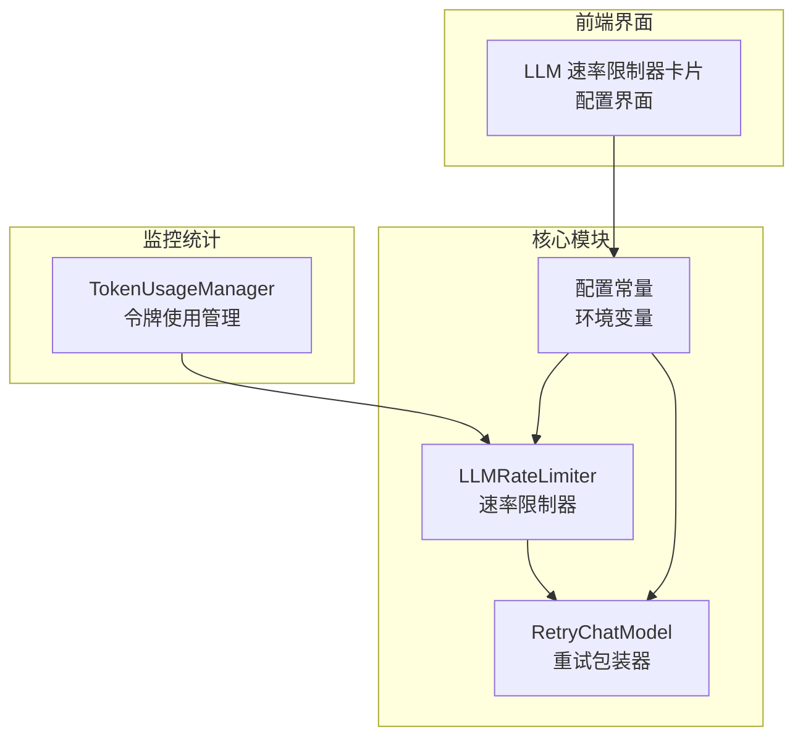
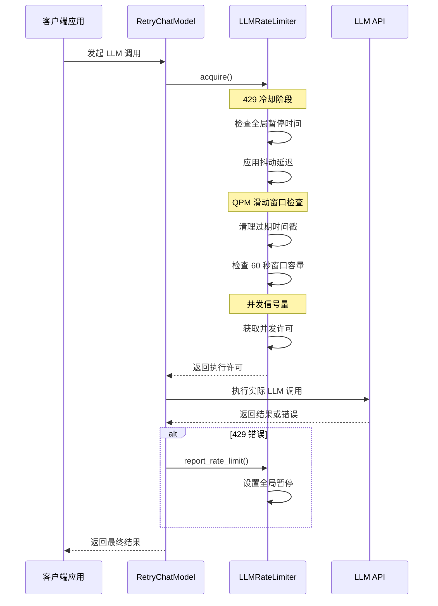
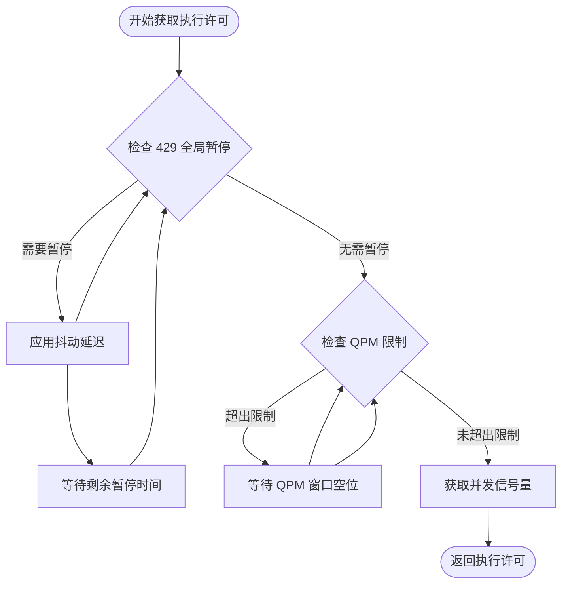
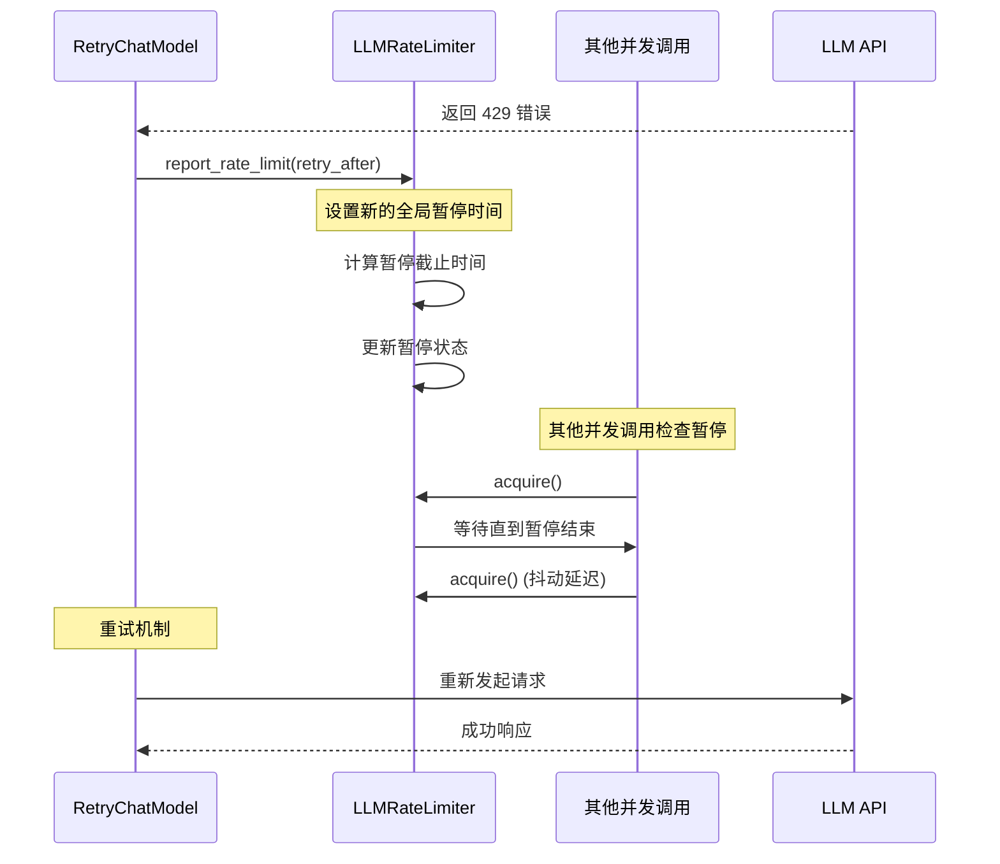
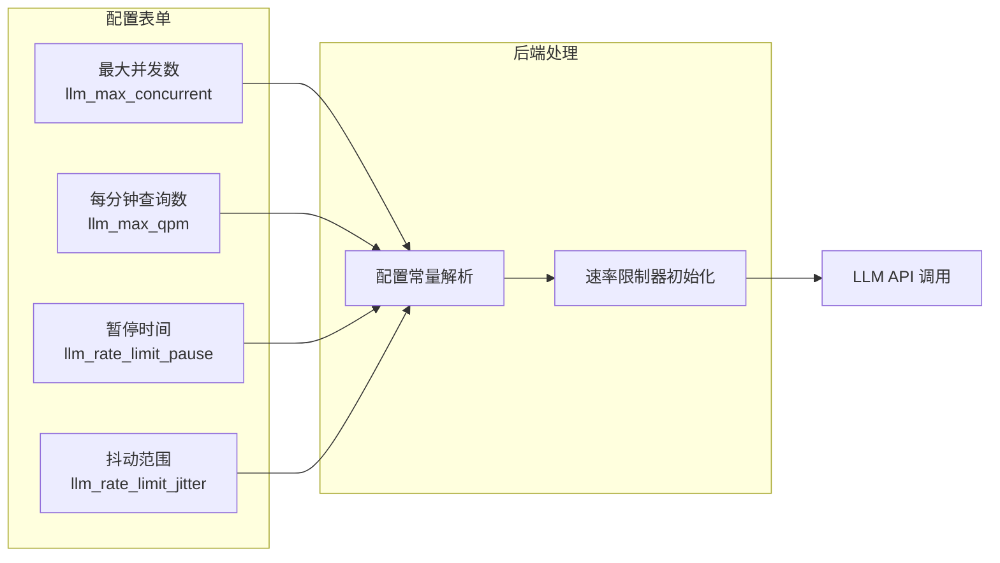
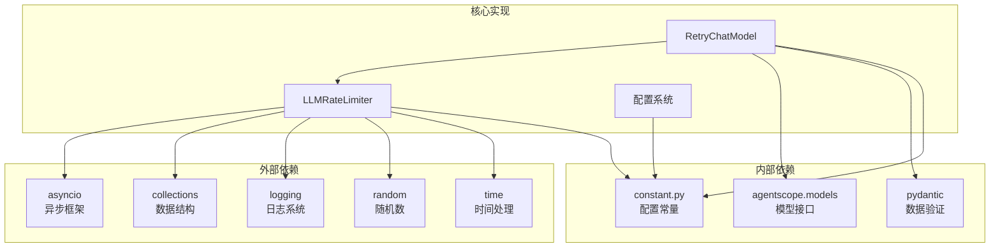

# 全局速率限制系统

<cite>
**本文档引用的文件**
- [src/copaw/providers/rate_limiter.py](file://src/copaw/providers/rate_limiter.py)
- [src/copaw/providers/retry_chat_model.py](file://src/copaw/providers/retry_chat_model.py)
- [src/copaw/constant.py](file://src/copaw/constant.py)
- [console/src/pages/Agent/Config/components/LlmRateLimiterCard.tsx](file://console/src/pages/Agent/Config/components/LlmRateLimiterCard.tsx)
- [src/copaw/config/config.py](file://src/copaw/config/config.py)
- [src/copaw/token_usage/manager.py](file://src/copaw/token_usage/manager.py)
</cite>

## 目录
1. [简介](#简介)
2. [项目结构](#项目结构)
3. [核心组件](#核心组件)
4. [架构概览](#架构概览)
5. [详细组件分析](#详细组件分析)
6. [依赖关系分析](#依赖关系分析)
7. [性能考虑](#性能考虑)
8. [故障排除指南](#故障排除指南)
9. [结论](#结论)

## 简介

全局速率限制系统是 CoPaw 框架中的关键基础设施，用于防止 LLM API 调用过载和 429 状态码错误。该系统通过多种机制协同工作，包括并发控制、查询每分钟（QPM）限制、全局暂停协调和抖动机制，确保系统在高负载情况下仍能稳定运行。

系统的核心特性包括：
- 基于滑动窗口的 QPM 限制（60 秒时间窗）
- 异步信号量并发控制
- 全局 429 错误暂停协调
- 每等待者抖动机制避免惊群效应
- 统一的重试机制集成

## 项目结构

全局速率限制系统主要分布在以下模块中：



**图表来源**
- [src/copaw/providers/rate_limiter.py:1-279](file://src/copaw/providers/rate_limiter.py#L1-L279)
- [src/copaw/providers/retry_chat_model.py:1-466](file://src/copaw/providers/retry_chat_model.py#L1-L466)
- [src/copaw/constant.py:181-243](file://src/copaw/constant.py#L181-L243)

**章节来源**
- [src/copaw/providers/rate_limiter.py:1-279](file://src/copaw/providers/rate_limiter.py#L1-L279)
- [src/copaw/providers/retry_chat_model.py:1-466](file://src/copaw/providers/retry_chat_model.py#L1-L466)
- [src/copaw/constant.py:181-243](file://src/copaw/constant.py#L181-L243)

## 核心组件

### LLMRateLimiter 类

LLMRateLimiter 是全局速率限制系统的核心类，实现了完整的速率限制逻辑：

**主要功能：**
- 并发控制：使用 asyncio.Semaphore 限制同时进行的 LLM 调用数量
- QPM 限制：维护 60 秒滑动窗口记录请求时间戳
- 全局暂停：当收到 429 错误时设置全局暂停时间戳
- 抖动机制：为每个等待者添加随机偏移量避免同时唤醒

**关键属性：**
- `_max_concurrent`: 最大并发请求数
- `_max_qpm`: 每分钟最大查询数
- `_pause_until`: 全局暂停截止时间
- `_request_times`: 60 秒内请求时间戳队列

**章节来源**
- [src/copaw/providers/rate_limiter.py:30-196](file://src/copaw/providers/rate_limiter.py#L30-L196)

### RetryChatModel 类

RetryChatModel 是 LLM 调用的重试包装器，集成了速率限制功能：

**主要特性：**
- 透明重试：对临时错误（429、超时、连接错误）进行指数退避重试
- 流式支持：正确处理流式响应的重试和资源释放
- 速率限制集成：在每次调用前获取执行许可
- 取消安全：确保取消操作不会导致资源泄漏

**章节来源**
- [src/copaw/providers/retry_chat_model.py:201-466](file://src/copaw/providers/retry_chat_model.py#L201-L466)

### 配置常量系统

系统通过环境变量和配置常量提供灵活的参数调整：

**关键配置项：**
- `LLM_MAX_CONCURRENT`: 最大并发数（默认 10）
- `LLM_MAX_QPM`: 每分钟最大查询数（默认 600）
- `LLM_RATE_LIMIT_PAUSE`: 默认 429 暂停时间（默认 5.0 秒）
- `LLM_RATE_LIMIT_JITTER`: 暂停抖动范围（默认 1.0 秒）
- `LLM_ACQUIRE_TIMEOUT`: 获取许可的最大等待时间（默认 300.0 秒）

**章节来源**
- [src/copaw/constant.py:204-243](file://src/copaw/constant.py#L204-L243)

## 架构概览

全局速率限制系统采用分层架构设计，确保各个组件之间的清晰分离和职责明确：



**图表来源**
- [src/copaw/providers/retry_chat_model.py:266-347](file://src/copaw/providers/retry_chat_model.py#L266-L347)
- [src/copaw/providers/rate_limiter.py:70-174](file://src/copaw/providers/rate_limiter.py#L70-L174)

## 详细组件分析

### 速率限制算法实现

系统实现了三层保护机制来防止 API 过载：



**图表来源**
- [src/copaw/providers/rate_limiter.py:70-144](file://src/copaw/providers/rate_limiter.py#L70-L144)

### 429 错误处理机制

当系统检测到 429 错误时，会触发全局暂停协调机制：



**图表来源**
- [src/copaw/providers/retry_chat_model.py:323-340](file://src/copaw/providers/retry_chat_model.py#L323-L340)
- [src/copaw/providers/rate_limiter.py:152-174](file://src/copaw/providers/rate_limiter.py#L152-L174)

### 前端配置界面集成

前端提供了可视化的速率限制配置界面：



**图表来源**
- [console/src/pages/Agent/Config/components/LlmRateLimiterCard.tsx:1-88](file://console/src/pages/Agent/Config/components/LlmRateLimiterCard.tsx#L1-L88)

**章节来源**
- [console/src/pages/Agent/Config/components/LlmRateLimiterCard.tsx:1-88](file://console/src/pages/Agent/Config/components/LlmRateLimiterCard.tsx#L1-L88)

### 统计监控系统

系统提供了详细的运行时统计信息：

| 统计指标 | 描述 | 用途 |
|---------|------|------|
| `max_concurrent` | 最大并发数配置 | 监控并发限制效果 |
| `current_in_flight` | 当前进行中的调用数 | 实时负载监控 |
| `max_qpm` | QPM 配置值 | 验证速率限制设置 |
| `requests_last_60s` | 最近 60 秒请求数 | 性能基准评估 |
| `is_paused` | 是否处于全局暂停状态 | 429 错误检测 |
| `pause_remaining_s` | 暂停剩余时间 | 系统健康度评估 |

**章节来源**
- [src/copaw/providers/rate_limiter.py:175-196](file://src/copaw/providers/rate_limiter.py#L175-L196)

## 依赖关系分析

全局速率限制系统与其他组件的依赖关系如下：



**图表来源**
- [src/copaw/providers/rate_limiter.py:19-27](file://src/copaw/providers/rate_limiter.py#L19-L27)
- [src/copaw/providers/retry_chat_model.py:26-48](file://src/copaw/providers/retry_chat_model.py#L26-L48)

**章节来源**
- [src/copaw/providers/rate_limiter.py:19-27](file://src/copaw/providers/rate_limiter.py#L19-L27)
- [src/copaw/providers/retry_chat_model.py:26-48](file://src/copaw/providers/retry_chat_model.py#L26-L48)

## 性能考虑

### 并发控制优化

系统通过信号量机制有效控制并发调用数量，避免 API 过载：

- **默认并发限制**：10 个并发调用，适用于大多数场景
- **动态调整**：根据 API 配额和响应时间调整并发数
- **资源回收**：及时释放信号量，防止资源泄漏

### QPM 限制效率

滑动窗口算法提供了高效的 QPM 限制实现：

- **时间复杂度**：O(n) 清理过期条目，n 为过期请求数
- **空间复杂度**：O(w) 存储 60 秒窗口内的请求时间戳
- **内存优化**：自动清理过期数据，避免无限增长

### 响应时间优化

抖动机制有效避免了惊群效应：

- **抖动范围**：±1.0 秒的随机延迟
- **负载分散**：均匀分布重试时间点
- **系统稳定性**：防止大量请求同时到达

## 故障排除指南

### 常见问题诊断

**问题 1：请求长时间阻塞**
- 检查 `acquire_timeout` 配置是否过短
- 查看 `total_paused` 统计值确认暂停时间
- 验证网络连接和 API 可达性

**问题 2：频繁出现 429 错误**
- 检查 `max_qpm` 设置是否过低
- 监控 `requests_last_60s` 指标
- 调整 `llm_rate_limit_pause` 参数

**问题 3：并发数不足**
- 增加 `llm_max_concurrent` 配置
- 检查上游 API 的并发限制
- 优化任务调度策略

### 调试工具

系统提供了多种调试和监控工具：

**统计信息获取**
```python
limiter = await get_rate_limiter()
stats = limiter.stats()
print(stats)
```

**重置速率限制器**
```python
reset_rate_limiter()  # 用于测试或服务重启
```

**章节来源**
- [src/copaw/providers/rate_limiter.py:175-196](file://src/copaw/providers/rate_limiter.py#L175-L196)
- [src/copaw/providers/rate_limiter.py:275-278](file://src/copaw/providers/rate_limiter.py#L275-L278)

## 结论

全局速率限制系统通过多层次的保护机制，为 LLM API 调用提供了全面的保护。系统的设计充分考虑了性能、稳定性和可维护性，能够有效防止 API 过载和 429 错误。

**主要优势：**
- **多层防护**：并发控制、QPM 限制、全局暂停协调
- **智能重试**：指数退避和流式支持
- **可视化配置**：前端界面提供直观的参数调整
- **完整监控**：详细的运行时统计和调试信息

**适用场景：**
- 高并发 LLM 应用
- 多代理协作系统
- 批量 API 调用场景
- 资源受限环境

该系统为 CoPaw 框架提供了可靠的基础设施，确保在各种负载条件下都能保持稳定的性能表现。