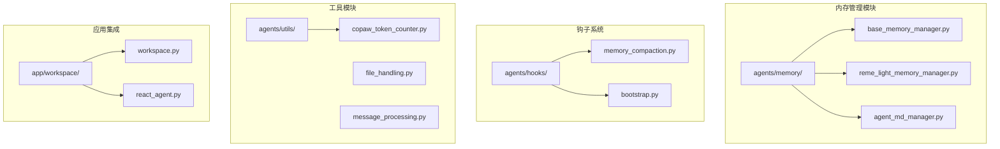
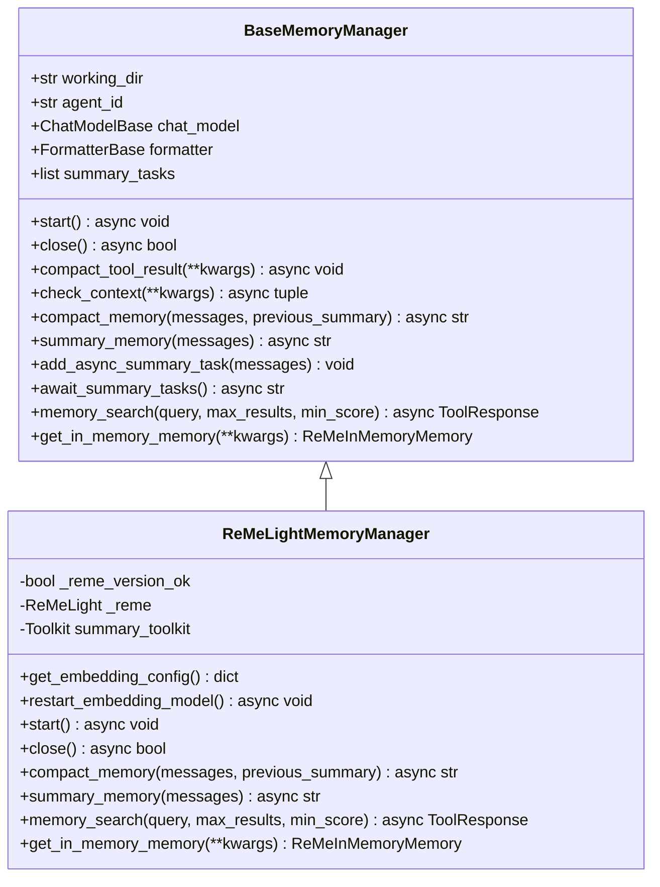
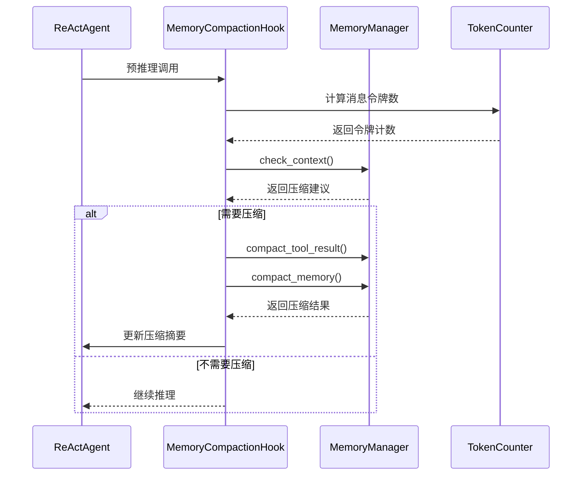
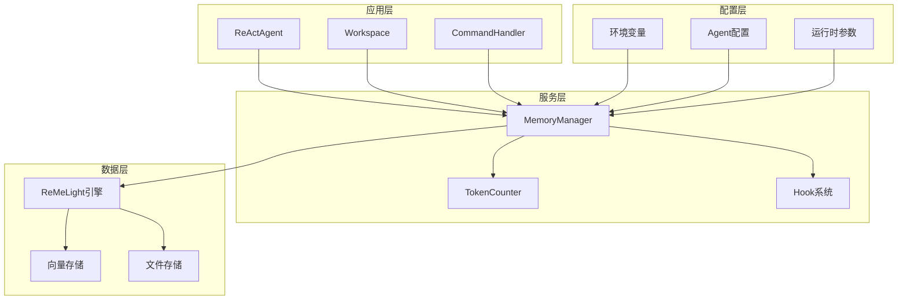
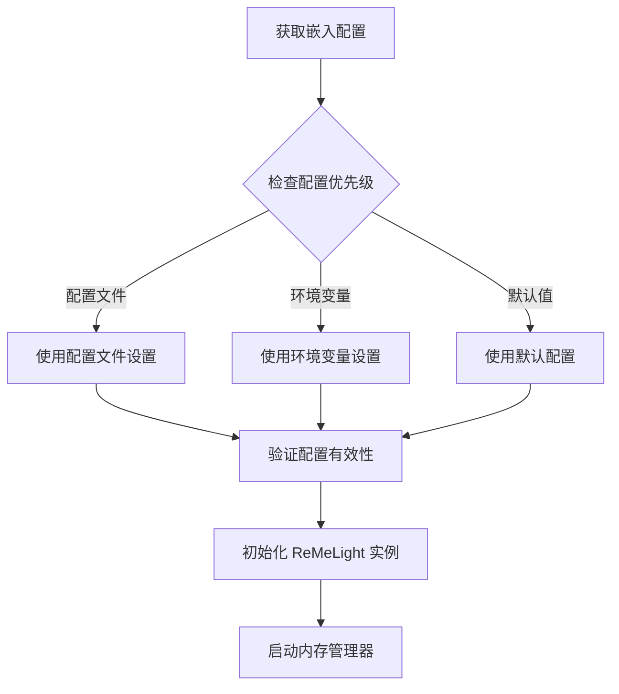
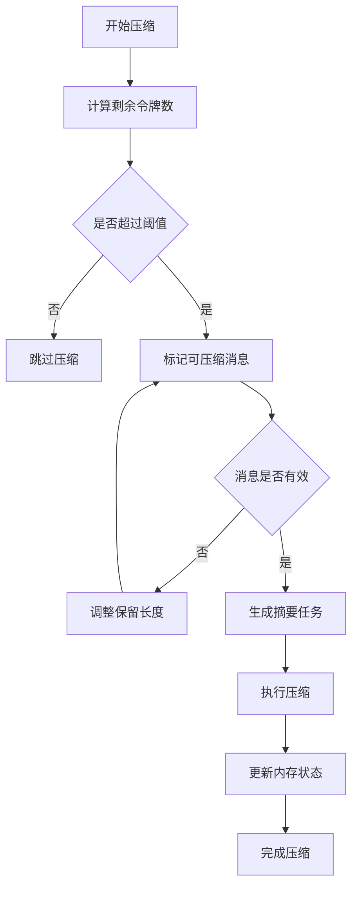
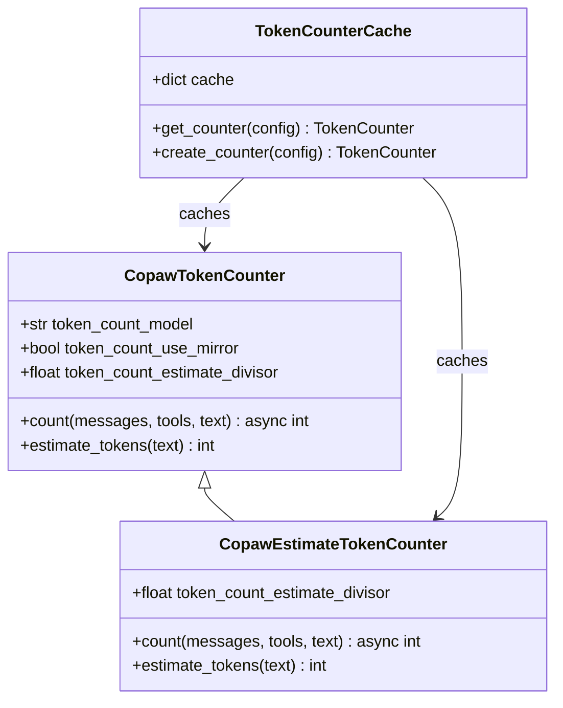
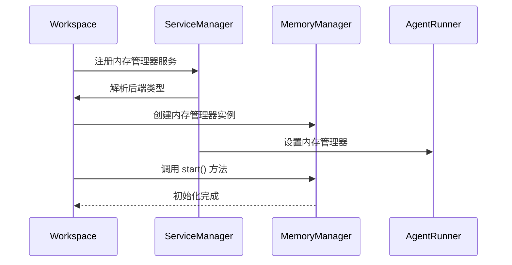
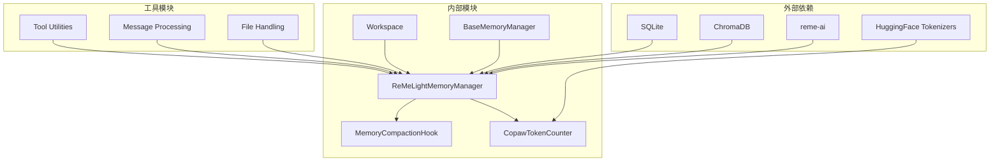
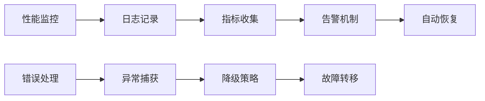

# 内存管理系统重构

<cite>
**本文档引用的文件**
- [base_memory_manager.py](file://src/copaw/agents/memory/base_memory_manager.py)
- [reme_light_memory_manager.py](file://src/copaw/agents/memory/reme_light_memory_manager.py)
- [memory_compaction.py](file://src/copaw/agents/hooks/memory_compaction.py)
- [copaw_token_counter.py](file://src/copaw/agents/utils/copaw_token_counter.py)
- [constant.py](file://src/copaw/constant.py)
- [workspace.py](file://src/copaw/app/workspace/workspace.py)
- [react_agent.py](file://src/copaw/agents/react_agent.py)
- [memory_search.py](file://src/copaw/agents/tools/memory_search.py)
- [command_handler.py](file://src/copaw/agents/command_handler.py)
</cite>

## 目录
1. [简介](#简介)
2. [项目结构](#项目结构)
3. [核心组件](#核心组件)
4. [架构概览](#架构概览)
5. [详细组件分析](#详细组件分析)
6. [依赖关系分析](#依赖关系分析)
7. [性能考虑](#性能考虑)
8. [故障排除指南](#故障排除指南)
9. [结论](#结论)

## 简介

CoPaw 内存管理系统重构项目旨在提供一个可扩展、可配置且高性能的对话记忆管理解决方案。该系统基于 ReMeLight 技术，实现了智能的上下文压缩、记忆检索和生命周期管理功能。

重构后的系统采用了模块化设计，通过抽象基类定义统一接口，支持多种内存管理后端，并提供了完整的错误处理和监控机制。

## 项目结构

内存管理系统主要分布在以下目录中：

**图表来源**
- [base_memory_manager.py:1-224](file://src/copaw/agents/memory/base_memory_manager.py#L1-L224)
- [reme_light_memory_manager.py:1-353](file://src/copaw/agents/memory/reme_light_memory_manager.py#L1-L353)
- [memory_compaction.py:1-214](file://src/copaw/agents/hooks/memory_compaction.py#L1-L214)

**章节来源**
- [base_memory_manager.py:1-224](file://src/copaw/agents/memory/base_memory_manager.py#L1-L224)
- [reme_light_memory_manager.py:1-353](file://src/copaw/agents/memory/reme_light_memory_manager.py#L1-L353)
- [memory_compaction.py:1-214](file://src/copaw/agents/hooks/memory_compaction.py#L1-L214)

## 核心组件

### 抽象基类设计

内存管理系统的核心是 `BaseMemoryManager` 抽象基类，它定义了所有内存管理器必须实现的标准接口：

**图表来源**
- [base_memory_manager.py:21-224](file://src/copaw/agents/memory/base_memory_manager.py#L21-L224)
- [reme_light_memory_manager.py:31-353](file://src/copaw/agents/memory/reme_light_memory_manager.py#L31-L353)

### 记忆压缩钩子

`MemoryCompactionHook` 是系统的核心组件，负责监控上下文大小并在需要时自动进行记忆压缩：

**图表来源**
- [memory_compaction.py:62-214](file://src/copaw/agents/hooks/memory_compaction.py#L62-L214)
- [base_memory_manager.py:74-100](file://src/copaw/agents/memory/base_memory_manager.py#L74-L100)

**章节来源**
- [base_memory_manager.py:21-224](file://src/copaw/agents/memory/base_memory_manager.py#L21-L224)
- [reme_light_memory_manager.py:31-353](file://src/copaw/agents/memory/reme_light_memory_manager.py#L31-L353)
- [memory_compaction.py:27-214](file://src/copaw/agents/hooks/memory_compaction.py#L27-L214)

## 架构概览

内存管理系统采用分层架构设计，确保了良好的可扩展性和维护性：

**图表来源**
- [workspace.py:38-45](file://src/copaw/app/workspace/workspace.py#L38-L45)
- [react_agent.py:325-350](file://src/copaw/agents/react_agent.py#L325-L350)
- [constant.py:12-70](file://src/copaw/constant.py#L12-L70)

## 详细组件分析

### ReMeLight 内存管理器

`ReMeLightMemoryManager` 是内存管理系统的具体实现，封装了 ReMeLight 引擎并提供了完整的内存管理功能：

#### 核心功能特性

1. **智能版本管理**: 自动检测和验证 ReMeLight 版本兼容性
2. **动态嵌入配置**: 支持从配置文件、环境变量和默认值中获取嵌入设置
3. **多后端支持**: 自动选择最适合的存储后端（local/chroma/sqlite）
4. **异步任务管理**: 提供后台摘要生成和清理机制

#### 配置管理机制

**图表来源**
- [reme_light_memory_manager.py:168-187](file://src/copaw/agents/memory/reme_light_memory_manager.py#L168-L187)
- [reme_light_memory_manager.py:88-112](file://src/copaw/agents/memory/reme_light_memory_manager.py#L88-L112)

#### 性能优化策略

1. **懒加载机制**: 延迟初始化聊天模型和格式化器
2. **缓存策略**: Token 计数器实例缓存，避免重复创建
3. **异步处理**: 后台摘要生成，不影响主线程性能
4. **资源管理**: 自动清理过期文件和无效数据

**章节来源**
- [reme_light_memory_manager.py:31-353](file://src/copaw/agents/memory/reme_light_memory_manager.py#L31-L353)

### 记忆压缩算法

系统实现了智能的记忆压缩算法，能够有效控制上下文窗口大小：

#### 压缩策略

**图表来源**
- [memory_compaction.py:129-202](file://src/copaw/agents/hooks/memory_compaction.py#L129-L202)

#### 压缩参数配置

| 参数名称 | 默认值 | 说明 |
|---------|--------|------|
| memory_compact_ratio | 0.7 | 上下文压缩比例 |
| memory_compact_reserve | 0.15 | 保留区域比例 |
| memory_compact_keep_recent | 3 | 最近保留的消息数量 |
| token_count_estimate_divisor | 3.75 | 字符估算除数 |

**章节来源**
- [memory_compaction.py:27-214](file://src/copaw/agents/hooks/memory_compaction.py#L27-L214)
- [constant.py:157-169](file://src/copaw/constant.py#L157-L169)

### Token 计数系统

`CopawTokenCounter` 提供了灵活的令牌计数解决方案：

#### 计数模式

1. **精确计数模式**: 使用 HuggingFace 分词器进行准确计数
2. **估算模式**: 基于字符长度进行快速估算
3. **混合模式**: 自动在精确和估算之间切换

#### 缓存机制

**图表来源**
- [copaw_token_counter.py:20-154](file://src/copaw/agents/utils/copaw_token_counter.py#L20-L154)
- [copaw_token_counter.py:156-200](file://src/copaw/agents/utils/copaw_token_counter.py#L156-L200)

**章节来源**
- [copaw_token_counter.py:1-301](file://src/copaw/agents/utils/copaw_token_counter.py#L1-L301)

### 工作空间集成

`Workspace` 类负责内存管理器的整体协调和生命周期管理：

#### 服务注册机制

**图表来源**
- [workspace.py:169-190](file://src/copaw/app/workspace/workspace.py#L169-L190)
- [workspace.py:38-45](file://src/copaw/app/workspace/workspace.py#L38-L45)

**章节来源**
- [workspace.py:1-200](file://src/copaw/app/workspace/workspace.py#L1-L200)
- [react_agent.py:325-350](file://src/copaw/agents/react_agent.py#L325-L350)

## 依赖关系分析

内存管理系统的关键依赖关系如下：

**图表来源**
- [reme_light_memory_manager.py:65-71](file://src/copaw/agents/memory/reme_light_memory_manager.py#L65-L71)
- [copaw_token_counter.py:12-12](file://src/copaw/agents/utils/copaw_token_counter.py#L12-L12)

### 循环依赖检测

系统设计避免了循环依赖：
- `BaseMemoryManager` 不依赖具体实现
- `MemoryCompactionHook` 仅依赖抽象接口
- `Workspace` 通过工厂方法创建具体实例
- 工具模块保持无状态设计

**章节来源**
- [base_memory_manager.py:1-224](file://src/copaw/agents/memory/base_memory_manager.py#L1-L224)
- [memory_compaction.py:1-214](file://src/copaw/agents/hooks/memory_compaction.py#L1-L214)

## 性能考虑

### 内存优化策略

1. **延迟初始化**: 只在需要时创建昂贵的对象
2. **对象池**: 复用 Token 计数器实例
3. **异步处理**: 避免阻塞主线程
4. **缓存机制**: 减少重复计算

### 并发处理

系统支持高并发场景：
- 异步任务队列管理
- 无锁数据结构
- 原子操作保证
- 资源竞争防护

### 监控和诊断

## 故障排除指南

### 常见问题及解决方案

#### ReMeLight 版本不兼容

**症状**: 系统警告版本不匹配
**解决方案**: 
1. 检查已安装版本
2. 安装指定版本的 reme-ai 包
3. 重启应用程序

#### 内存管理器初始化失败

**症状**: 内存管理器无法启动
**排查步骤**:
1. 检查工作目录权限
2. 验证嵌入配置正确性
3. 确认存储后端可用性

#### Token 计数异常

**症状**: 令牌计数不准确或报错
**解决方法**:
1. 切换到估算模式
2. 检查分词器下载
3. 清理缓存重新初始化

**章节来源**
- [reme_light_memory_manager.py:129-144](file://src/copaw/agents/memory/reme_light_memory_manager.py#L129-L144)
- [memory_compaction.py:143-150](file://src/copaw/agents/hooks/memory_compaction.py#L143-L150)

### 调试工具

系统提供了多种调试工具：
- `/history` 命令查看历史记录
- `/dump_history` 导出调试信息
- 详细的日志输出
- 性能指标监控

**章节来源**
- [command_handler.py:113-130](file://src/copaw/agents/command_handler.py#L113-L130)

## 结论

CoPaw 内存管理系统重构项目成功实现了以下目标：

1. **模块化设计**: 通过抽象基类实现了高度可扩展的架构
2. **性能优化**: 采用多种优化策略确保系统高效运行
3. **易用性提升**: 提供直观的配置界面和丰富的调试工具
4. **稳定性保障**: 完善的错误处理和监控机制

重构后的系统不仅满足了当前的需求，还为未来的功能扩展奠定了坚实的基础。通过合理的架构设计和实现细节，系统能够在各种环境下稳定运行并提供优秀的用户体验。