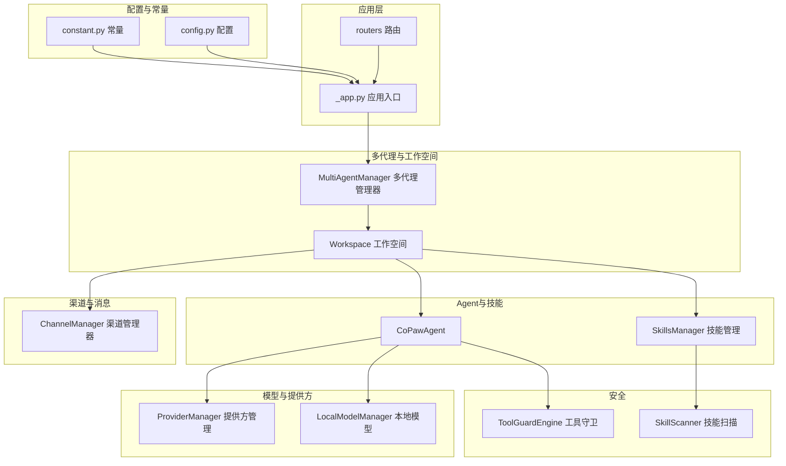
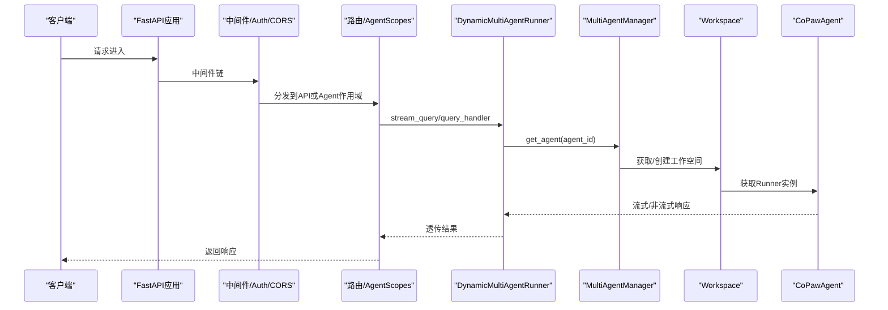
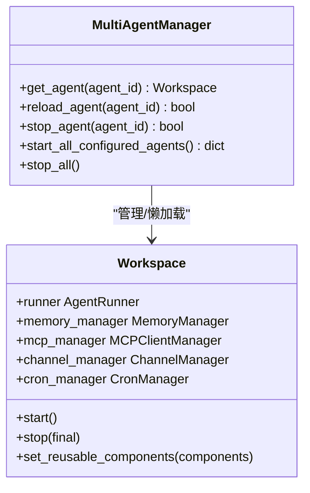
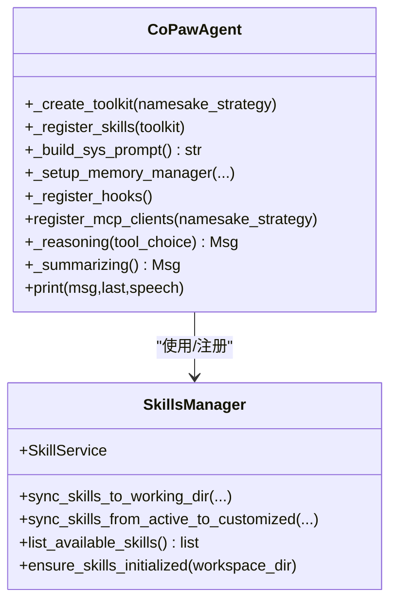
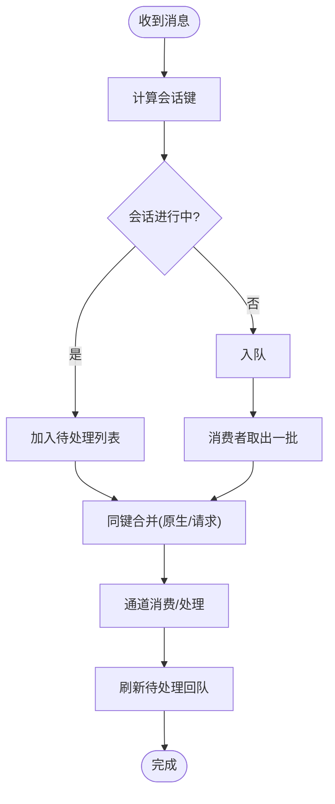
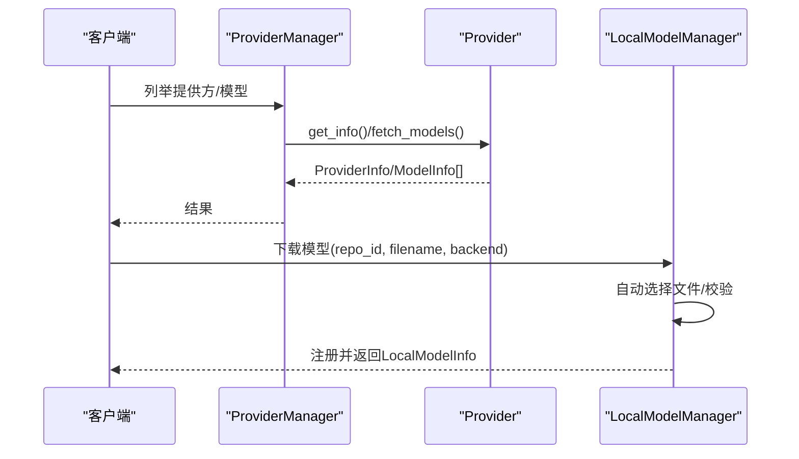
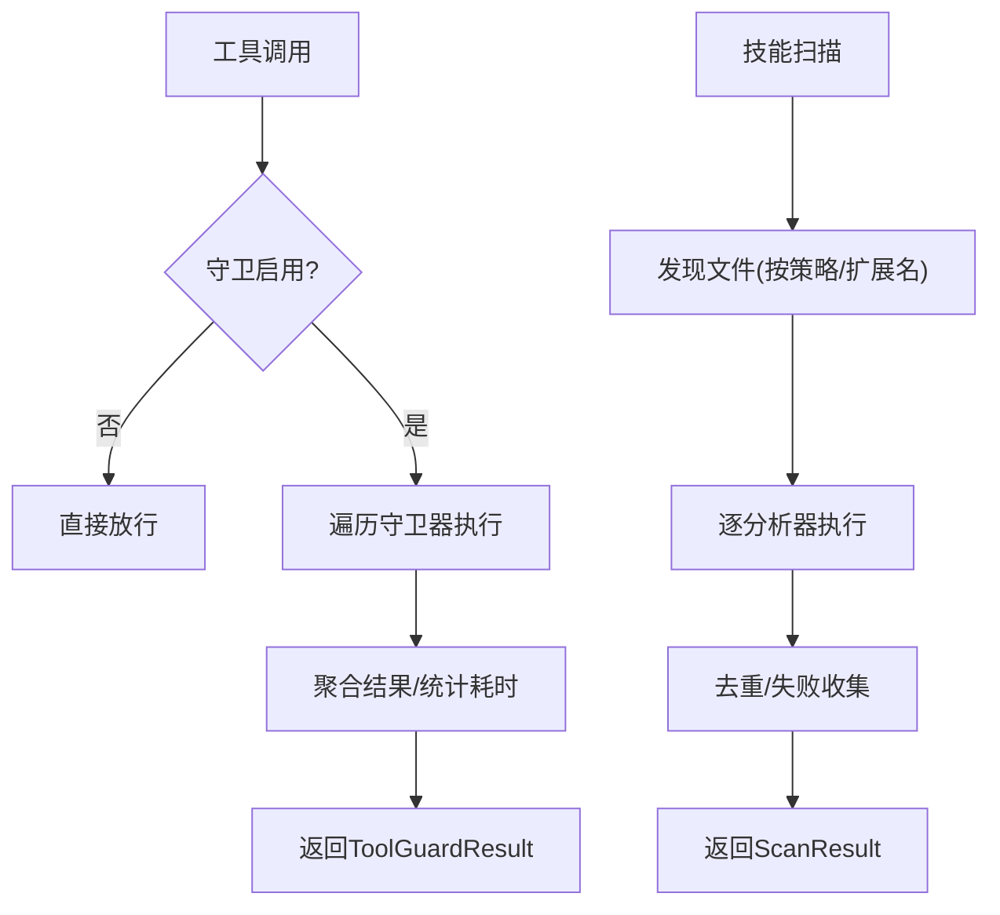
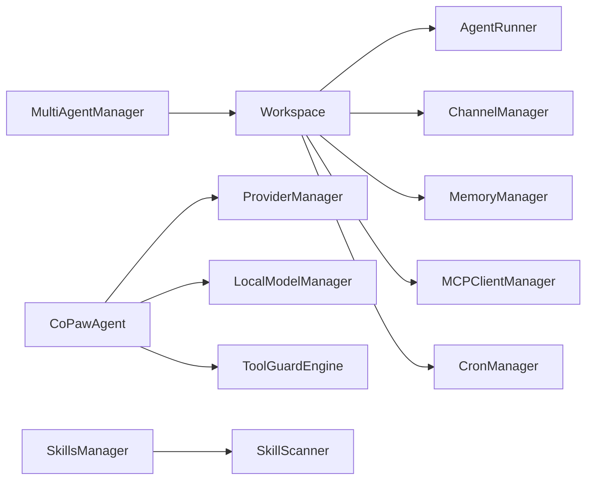

# 后端核心模块

<cite>
**本文档引用的文件**
- [src/copaw/__init__.py](file://src/copaw/__init__.py)
- [src/copaw/app/_app.py](file://src/copaw/app/_app.py)
- [src/copaw/app/multi_agent_manager.py](file://src/copaw/app/multi_agent_manager.py)
- [src/copaw/app/workspace/workspace.py](file://src/copaw/app/workspace/workspace.py)
- [src/copaw/app/channels/manager.py](file://src/copaw/app/channels/manager.py)
- [src/copaw/agents/react_agent.py](file://src/copaw/agents/react_agent.py)
- [src/copaw/agents/skills_manager.py](file://src/copaw/agents/skills_manager.py)
- [src/copaw/providers/provider_manager.py](file://src/copaw/providers/provider_manager.py)
- [src/copaw/local_models/manager.py](file://src/copaw/local_models/manager.py)
- [src/copaw/security/tool_guard/engine.py](file://src/copaw/security/tool_guard/engine.py)
- [src/copaw/security/skill_scanner/scanner.py](file://src/copaw/security/skill_scanner/scanner.py)
- [src/copaw/app/routers/agent.py](file://src/copaw/app/routers/agent.py)
- [src/copaw/config/config.py](file://src/copaw/config/config.py)
- [src/copaw/constant.py](file://src/copaw/constant.py)
</cite>

## 目录
1. [引言](#引言)
2. [项目结构](#项目结构)
3. [核心组件](#核心组件)
4. [架构总览](#架构总览)
5. [详细组件分析](#详细组件分析)
6. [依赖关系分析](#依赖关系分析)
7. [性能考虑](#性能考虑)
8. [故障排查指南](#故障排查指南)
9. [结论](#结论)
10. [附录](#附录)

## 引言
本文件面向CoPaw后端核心模块，提供从架构到实现细节的全景式技术文档。重点覆盖多代理管理、技能系统、渠道适配器、安全防护（工具守卫与技能扫描）、本地模型推理等关键能力，并结合实际代码路径说明接口、配置项与数据流，帮助初学者快速上手，同时为资深开发者提供深入的技术参考。

## 项目结构
CoPaw后端采用分层与模块化设计：应用入口负责生命周期与中间件装配；多代理管理器统一调度多个工作空间；每个工作空间封装运行器、通道管理、内存管理、MCP客户端与计划任务；Agent层集成工具、技能与记忆；Provider与Local Models提供模型能力；安全子系统保障工具调用与技能包扫描；配置与常量模块贯穿全局。

图表来源
- [src/copaw/app/_app.py:243-411](file://src/copaw/app/_app.py#L243-L411)
- [src/copaw/app/multi_agent_manager.py:17-451](file://src/copaw/app/multi_agent_manager.py#L17-L451)
- [src/copaw/app/workspace/workspace.py:39-367](file://src/copaw/app/workspace/workspace.py#L39-L367)
- [src/copaw/app/channels/manager.py:114-580](file://src/copaw/app/channels/manager.py#L114-L580)
- [src/copaw/agents/react_agent.py:67-800](file://src/copaw/agents/react_agent.py#L67-L800)
- [src/copaw/agents/skills_manager.py:654-1233](file://src/copaw/agents/skills_manager.py#L654-L1233)
- [src/copaw/providers/provider_manager.py:573-1126](file://src/copaw/providers/provider_manager.py#L573-L1126)
- [src/copaw/local_models/manager.py:94-413](file://src/copaw/local_models/manager.py#L94-L413)
- [src/copaw/security/tool_guard/engine.py:53-238](file://src/copaw/security/tool_guard/engine.py#L53-L238)
- [src/copaw/security/skill_scanner/scanner.py:76-319](file://src/copaw/security/skill_scanner/scanner.py#L76-L319)
- [src/copaw/config/config.py:1-1196](file://src/copaw/config/config.py#L1-L1196)
- [src/copaw/constant.py:1-210](file://src/copaw/constant.py#L1-L210)

章节来源
- [src/copaw/app/_app.py:1-411](file://src/copaw/app/_app.py#L1-L411)
- [src/copaw/constant.py:1-210](file://src/copaw/constant.py#L1-L210)

## 核心组件
- 多代理管理器（MultiAgentManager）：按需加载、零停机热重载、并发启动、任务追踪与优雅停止。
- 工作空间（Workspace）：统一聚合Runner、ChannelManager、MemoryManager、MCPClientManager、CronManager等服务。
- CoPawAgent：ReActAgent扩展，内置工具、动态技能注册、内存管理钩子、媒体块过滤与工具守卫拦截。
- 技能管理（SkillsManager）：内置/定制/激活技能同步、版本控制、ZIP导入与校验、目录树构建与读取。
- 渠道管理器（ChannelManager）：队列化处理、去抖合并、会话级锁、多消费者并行、替换与热切换。
- 模型提供方（ProviderManager）：内置/自定义提供方、模型发现、活跃模型管理、多模态探测。
- 本地模型（LocalModelManager）：GGUF/MLX模型下载、清单管理、自动选择文件、完整性校验。
- 安全引擎：工具守卫（Rule/FileGuardian）与技能扫描（PatternAnalyzer）双轨并行。
- 配置与常量：类型安全环境变量解析、默认配置、运行时参数与全局常量。

章节来源
- [src/copaw/app/multi_agent_manager.py:17-451](file://src/copaw/app/multi_agent_manager.py#L17-L451)
- [src/copaw/app/workspace/workspace.py:39-367](file://src/copaw/app/workspace/workspace.py#L39-L367)
- [src/copaw/agents/react_agent.py:67-800](file://src/copaw/agents/react_agent.py#L67-L800)
- [src/copaw/agents/skills_manager.py:654-1233](file://src/copaw/agents/skills_manager.py#L654-L1233)
- [src/copaw/app/channels/manager.py:114-580](file://src/copaw/app/channels/manager.py#L114-L580)
- [src/copaw/providers/provider_manager.py:573-1126](file://src/copaw/providers/provider_manager.py#L573-L1126)
- [src/copaw/local_models/manager.py:94-413](file://src/copaw/local_models/manager.py#L94-L413)
- [src/copaw/security/tool_guard/engine.py:53-238](file://src/copaw/security/tool_guard/engine.py#L53-L238)
- [src/copaw/security/skill_scanner/scanner.py:76-319](file://src/copaw/security/skill_scanner/scanner.py#L76-L319)
- [src/copaw/config/config.py:1-1196](file://src/copaw/config/config.py#L1-L1196)
- [src/copaw/constant.py:1-210](file://src/copaw/constant.py#L1-L210)

## 架构总览
应用通过FastAPI启动，注入认证、CORS、代理上下文中间件与静态资源路由；生命周期中完成多代理迁移与初始化、ProviderManager单例化、Approval服务绑定；动态Runner根据请求头选择对应Agent实例；各Agent在工作空间内复用可热重用组件，实现零停机升级。

图表来源
- [src/copaw/app/_app.py:49-146](file://src/copaw/app/_app.py#L49-L146)
- [src/copaw/app/multi_agent_manager.py:34-82](file://src/copaw/app/multi_agent_manager.py#L34-L82)

章节来源
- [src/copaw/app/_app.py:149-248](file://src/copaw/app/_app.py#L149-L248)

## 详细组件分析

### 多代理管理与工作空间
- 多代理管理器支持懒加载、并发启动、原子替换与延迟清理，确保零停机热重载。
- 工作空间以服务描述符声明式注册Runner、MemoryManager、MCP、Channel、Cron等组件，支持可复用组件热重用。

图表来源
- [src/copaw/app/multi_agent_manager.py:17-451](file://src/copaw/app/multi_agent_manager.py#L17-L451)
- [src/copaw/app/workspace/workspace.py:39-367](file://src/copaw/app/workspace/workspace.py#L39-L367)

章节来源
- [src/copaw/app/multi_agent_manager.py:17-451](file://src/copaw/app/multi_agent_manager.py#L17-L451)
- [src/copaw/app/workspace/workspace.py:134-367](file://src/copaw/app/workspace/workspace.py#L134-L367)

### Agent与技能系统
- CoPawAgent继承ReActAgent，集成工具集、动态技能注册、内存管理钩子、媒体块预/被动过滤、工具守卫拦截。
- 技能管理提供内置/定制/激活三层同步、版本比较、差异检测、ZIP导入校验与目录树构建。

图表来源
- [src/copaw/agents/react_agent.py:67-800](file://src/copaw/agents/react_agent.py#L67-L800)
- [src/copaw/agents/skills_manager.py:654-1233](file://src/copaw/agents/skills_manager.py#L654-L1233)

章节来源
- [src/copaw/agents/react_agent.py:87-800](file://src/copaw/agents/react_agent.py#L87-L800)
- [src/copaw/agents/skills_manager.py:210-420](file://src/copaw/agents/skills_manager.py#L210-L420)

### 渠道适配器与消息处理
- ChannelManager基于队列与多消费者模型，按会话键去抖合并，支持原生负载合并与请求合并，提供替换与热切换能力。

图表来源
- [src/copaw/app/channels/manager.py:42-112](file://src/copaw/app/channels/manager.py#L42-L112)
- [src/copaw/app/channels/manager.py:322-364](file://src/copaw/app/channels/manager.py#L322-L364)

章节来源
- [src/copaw/app/channels/manager.py:114-580](file://src/copaw/app/channels/manager.py#L114-L580)

### 模型提供方与本地模型推理
- ProviderManager集中管理内置/自定义提供方，支持模型发现、活跃模型设置、多模态探测与持久化。
- LocalModelManager提供GGUF/MLX模型下载、清单管理、自动文件选择与完整性校验。

图表来源
- [src/copaw/providers/provider_manager.py:628-800](file://src/copaw/providers/provider_manager.py#L628-L800)
- [src/copaw/local_models/manager.py:98-330](file://src/copaw/local_models/manager.py#L98-L330)

章节来源
- [src/copaw/providers/provider_manager.py:573-1126](file://src/copaw/providers/provider_manager.py#L573-L1126)
- [src/copaw/local_models/manager.py:94-413](file://src/copaw/local_models/manager.py#L94-L413)

### 安全防护：工具守卫与技能扫描
- 工具守卫引擎按配置启用/禁用，聚合多种守卫器（规则/文件路径），支持仅执行always_run守卫与失败收集。
- 技能扫描器遍历技能包，按策略与文件分类规则过滤，运行分析器并去重聚合结果。

图表来源
- [src/copaw/security/tool_guard/engine.py:169-227](file://src/copaw/security/tool_guard/engine.py#L169-L227)
- [src/copaw/security/skill_scanner/scanner.py:148-242](file://src/copaw/security/skill_scanner/scanner.py#L148-L242)

章节来源
- [src/copaw/security/tool_guard/engine.py:53-238](file://src/copaw/security/tool_guard/engine.py#L53-L238)
- [src/copaw/security/skill_scanner/scanner.py:76-319](file://src/copaw/security/skill_scanner/scanner.py#L76-L319)

### 配置与常量
- 配置模块提供类型安全的通道、运行、路由、MCP、工具等配置类，支持默认值与校验。
- 常量模块统一解析环境变量，提供工作目录、日志级别、CORS、LLM重试、内存压缩等全局常量。

章节来源
- [src/copaw/config/config.py:1-1196](file://src/copaw/config/config.py#L1-L1196)
- [src/copaw/constant.py:1-210](file://src/copaw/constant.py#L1-L210)

## 依赖关系分析
- 组件耦合度：多代理管理器与工作空间之间为“管理-被管理”关系；工作空间内部通过服务管理器解耦各子系统；Agent与Provider/Local Models/安全模块松耦合，通过工厂与配置交互。
- 外部依赖：FastAPI、agentscope、pydantic、asyncio、huggingface_hub、modelscope等。
- 循环依赖：未见循环导入；服务注册与启动顺序严格控制，避免竞态。

图表来源
- [src/copaw/app/multi_agent_manager.py:17-451](file://src/copaw/app/multi_agent_manager.py#L17-L451)
- [src/copaw/app/workspace/workspace.py:134-367](file://src/copaw/app/workspace/workspace.py#L134-L367)
- [src/copaw/agents/react_agent.py:67-800](file://src/copaw/agents/react_agent.py#L67-L800)
- [src/copaw/agents/skills_manager.py:654-1233](file://src/copaw/agents/skills_manager.py#L654-L1233)
- [src/copaw/providers/provider_manager.py:573-1126](file://src/copaw/providers/provider_manager.py#L573-L1126)
- [src/copaw/local_models/manager.py:94-413](file://src/copaw/local_models/manager.py#L94-L413)
- [src/copaw/security/tool_guard/engine.py:53-238](file://src/copaw/security/tool_guard/engine.py#L53-L238)
- [src/copaw/security/skill_scanner/scanner.py:76-319](file://src/copaw/security/skill_scanner/scanner.py#L76-L319)

章节来源
- [src/copaw/app/multi_agent_manager.py:17-451](file://src/copaw/app/multi_agent_manager.py#L17-L451)
- [src/copaw/app/workspace/workspace.py:134-367](file://src/copaw/app/workspace/workspace.py#L134-L367)

## 性能考虑
- 并发与异步：多代理管理器并发启动所有配置的Agent；ChannelManager每通道多消费者并行处理；工作空间服务并发初始化。
- 零停机热重载：原子替换旧实例，后台延迟清理，避免新请求中断与旧任务丢失。
- 缓存与持久化：ProviderManager缓存模型信息与活跃模型；本地模型清单持久化；内存压缩阈值与保留比例可调。
- I/O优化：技能ZIP导入限制解压体积与路径合法性；模型下载自动选择文件与完整性校验；通道队列容量与去抖合并减少重复处理。

## 故障排查指南
- 多代理启动失败
  - 现象：启动阶段抛出异常或部分Agent未加载。
  - 排查：查看应用启动日志与MultiAgentManager错误堆栈；确认配置文件与工作空间目录权限；检查ProviderManager初始化与模型可用性。
  - 参考路径
    - [src/copaw/app/_app.py:178-227](file://src/copaw/app/_app.py#L178-L227)
    - [src/copaw/app/multi_agent_manager.py:382-445](file://src/copaw/app/multi_agent_manager.py#L382-L445)
- 渠道消息堆积或乱序
  - 现象：消息延迟、重复或顺序错乱。
  - 排查：检查ChannelManager队列大小与消费者任务状态；确认去抖键生成逻辑与会话锁；验证合并策略是否正确。
  - 参考路径
    - [src/copaw/app/channels/manager.py:365-426](file://src/copaw/app/channels/manager.py#L365-L426)
- 工具调用被拦截或拒绝
  - 现象：工具执行前被工具守卫拦截。
  - 排查：检查COPAW_TOOL_GUARD_ENABLED与配置；查看守卫器规则与拒绝工具集合；确认审批超时与失败统计。
  - 参考路径
    - [src/copaw/security/tool_guard/engine.py:35-164](file://src/copaw/security/tool_guard/engine.py#L35-L164)
- 技能包扫描不通过
  - 现象：技能包存在高危模式或敏感文件。
  - 排查：检查扫描策略与文件分类；确认文件大小与数量上限；查看分析器失败记录与去重策略。
  - 参考路径
    - [src/copaw/security/skill_scanner/scanner.py:100-242](file://src/copaw/security/skill_scanner/scanner.py#L100-L242)
- 本地模型下载失败
  - 现象：下载中断、文件不完整或缺少必要文件。
  - 排查：确认网络与仓库可用性；检查自动选择文件与后端类型；验证MLX目录完整性。
  - 参考路径
    - [src/copaw/local_models/manager.py:124-362](file://src/copaw/local_models/manager.py#L124-L362)

章节来源
- [src/copaw/app/_app.py:178-227](file://src/copaw/app/_app.py#L178-L227)
- [src/copaw/app/channels/manager.py:365-426](file://src/copaw/app/channels/manager.py#L365-L426)
- [src/copaw/security/tool_guard/engine.py:35-164](file://src/copaw/security/tool_guard/engine.py#L35-L164)
- [src/copaw/security/skill_scanner/scanner.py:100-242](file://src/copaw/security/skill_scanner/scanner.py#L100-L242)
- [src/copaw/local_models/manager.py:124-362](file://src/copaw/local_models/manager.py#L124-L362)

## 结论
CoPaw后端通过多代理管理器与工作空间实现了高可用、可扩展的Agent运行时；Agent层整合工具、技能与安全机制；Provider与本地模型为推理提供灵活的多模态能力；渠道适配器保证跨平台消息一致性；配置与常量体系确保部署灵活性与可观测性。整体架构清晰、边界明确、扩展性强，适合在生产环境中稳定运行与持续演进。

## 附录

### 关键接口与返回值示例（路径）
- 多代理管理
  - 获取Agent：[get_agent:34-82](file://src/copaw/app/multi_agent_manager.py#L34-L82)
  - 热重载：[reload_agent:200-311](file://src/copaw/app/multi_agent_manager.py#L200-L311)
  - 停止：[stop_agent:180-198](file://src/copaw/app/multi_agent_manager.py#L180-L198)
- 工作空间
  - 启动/停止：[start/stop:311-357](file://src/copaw/app/workspace/workspace.py#L311-L357)
  - 设置可复用组件：[set_reusable_components:279-310](file://src/copaw/app/workspace/workspace.py#L279-L310)
- Agent文件管理路由
  - 读写工作文件：[list/read/write:46-108](file://src/copaw/app/routers/agent.py#L46-L108)
  - 语言与音频模式：[get/put:187-308](file://src/copaw/app/routers/agent.py#L187-L308)
- 技能管理
  - 同步技能：[sync_skills_to_working_dir:210-287](file://src/copaw/agents/skills_manager.py#L210-L287)
  - 列表与读取：[list_available_skills/_read_skills_from_dir:371-497](file://src/copaw/agents/skills_manager.py#L371-L497)
- 渠道管理
  - 入队/消费：[enqueue/start_all/stop_all:304-426](file://src/copaw/app/channels/manager.py#L304-L426)
  - 替换通道：[replace_channel:434-498](file://src/copaw/app/channels/manager.py#L434-L498)
- 提供方管理
  - 激活模型：[activate_model:738-753](file://src/copaw/providers/provider_manager.py#L738-L753)
  - 添加/删除模型：[add_model_to_provider/delete_model_from_provider:782-830](file://src/copaw/providers/provider_manager.py#L782-L830)
- 本地模型
  - 下载与注册：[download_model_sync/_register_model:98-122](file://src/copaw/local_models/manager.py#L98-L122)
  - 列表/删除：[list/get/delete:52-86](file://src/copaw/local_models/manager.py#L52-L86)
- 安全
  - 工具守卫：[guard:169-227](file://src/copaw/security/tool_guard/engine.py#L169-L227)
  - 技能扫描：[scan_skill:148-242](file://src/copaw/security/skill_scanner/scanner.py#L148-L242)