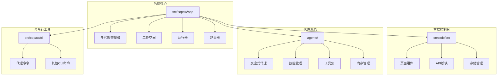
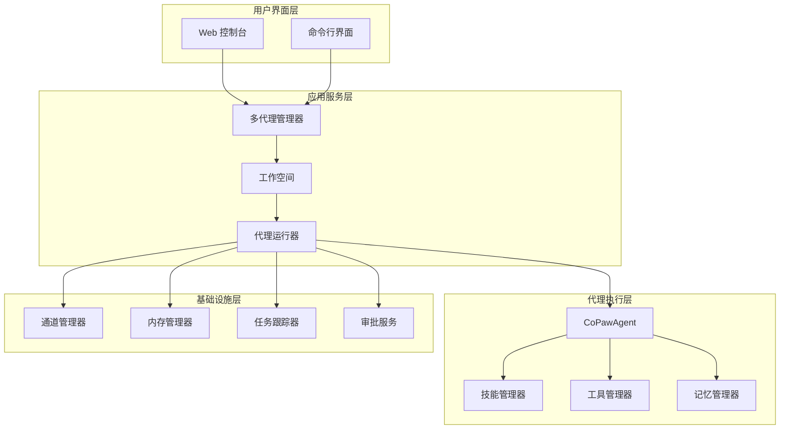
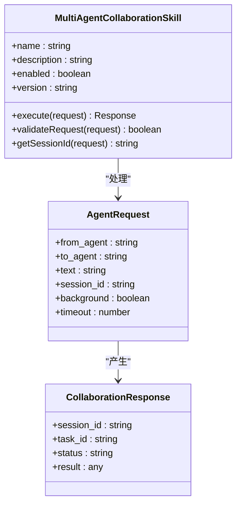
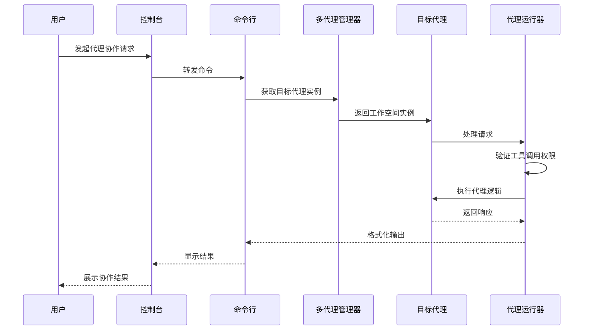
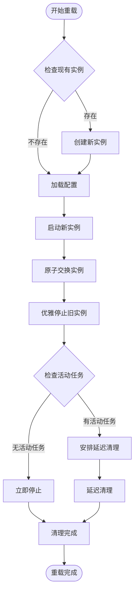
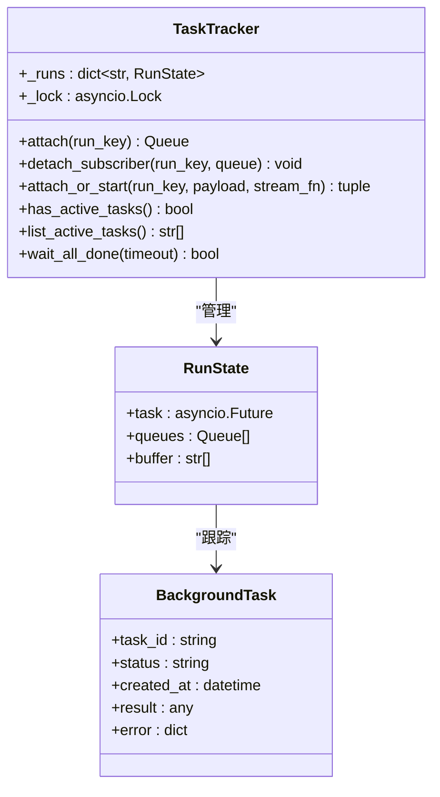
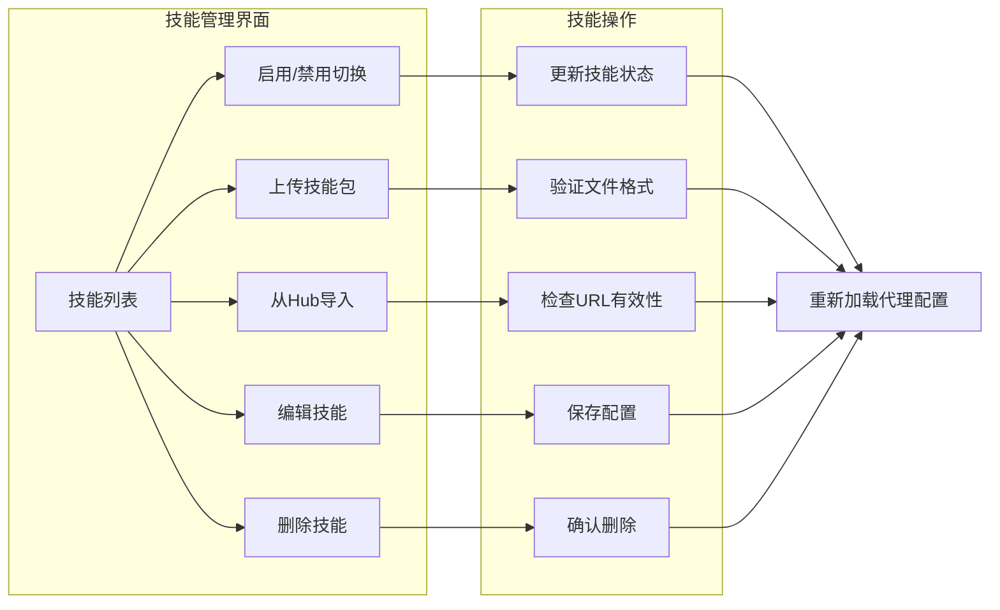
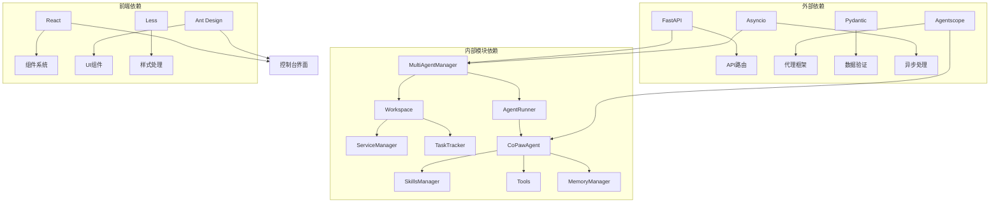

# 多代理协作增强

<cite>
**本文档引用的文件**
- [src/copaw/app/multi_agent_manager.py](file://src/copaw/app/multi_agent_manager.py)
- [src/copaw/app/workspace/workspace.py](file://src/copaw/app/workspace/workspace.py)
- [src/copaw/app/runner/runner.py](file://src/copaw/app/runner/runner.py)
- [src/copaw/app/runner/task_tracker.py](file://src/copaw/app/runner/task_tracker.py)
- [src/copaw/cli/agents_cmd.py](file://src/copaw/cli/agents_cmd.py)
- [src/copaw/agents/react_agent.py](file://src/copaw/agents/react_agent.py)
- [src/copaw/agents/skills/multi_agent_collaboration/SKILL.md](file://src/copaw/agents/skills/multi_agent_collaboration/SKILL.md)
- [src/copaw/app/routers/agent.py](file://src/copaw/app/routers/agent.py)
- [console/src/pages/Agent/Skills/index.tsx](file://console/src/pages/Agent/Skills/index.tsx)
- [console/src/pages/Agent/Skills/useSkills.ts](file://console/src/pages/Agent/Skills/useSkills.ts)
- [console/src/api/modules/agents.ts](file://console/src/api/modules/agents.ts)
- [console/src/api/modules/agent.ts](file://console/src/api/modules/agent.ts)
</cite>

## 目录
1. [简介](#简介)
2. [项目结构](#项目结构)
3. [核心组件](#核心组件)
4. [架构概览](#架构概览)
5. [详细组件分析](#详细组件分析)
6. [依赖关系分析](#依赖关系分析)
7. [性能考虑](#性能考虑)
8. [故障排除指南](#故障排除指南)
9. [结论](#结论)

## 简介

多代理协作增强是 CoPaw 框架中的一个关键特性，它允许系统内的多个 AI 代理之间进行协作和通信。该项目通过提供统一的管理接口、零停机重载机制和安全的跨代理通信能力，实现了高效的多代理协作环境。

该系统的核心目标是：
- 提供零停机的多代理协作能力
- 支持实时和后台任务模式的代理间通信
- 实现智能的代理选择和路由机制
- 确保协作过程中的安全性和可控性
- 提供完整的监控和管理界面

## 项目结构

CoPaw 项目采用模块化设计，主要包含以下核心目录：

**图表来源**
- [src/copaw/app/multi_agent_manager.py:1-462](file://src/copaw/app/multi_agent_manager.py#L1-L462)
- [src/copaw/app/workspace/workspace.py:1-377](file://src/copaw/app/workspace/workspace.py#L1-L377)

**章节来源**
- [src/copaw/app/multi_agent_manager.py:1-462](file://src/copaw/app/multi_agent_manager.py#L1-L462)
- [src/copaw/app/workspace/workspace.py:1-377](file://src/copaw/app/workspace/workspace.py#L1-L377)

## 核心组件

### 多代理管理器 (MultiAgentManager)

MultiAgentManager 是整个多代理协作系统的核心控制器，负责管理多个代理实例的生命周期和协作。

**主要功能**：
- 懒加载代理实例
- 零停机重载机制
- 并发访问控制
- 资源清理和回收

**关键特性**：
- 使用异步锁确保线程安全
- 支持热重载而不中断服务
- 自动清理旧实例资源
- 提供代理状态监控

### 工作空间 (Workspace)

每个 Workspace 代表一个独立的代理运行时环境，封装了完整的代理运行所需的所有组件。

**核心组件**：
- AgentRunner：代理请求处理器
- ChannelManager：通信渠道管理
- BaseMemoryManager：对话记忆管理
- MCPClientManager：MCP 工具客户端管理
- CronManager：计划任务管理

### 代理运行器 (AgentRunner)

AgentRunner 负责处理代理请求，集成工具保护机制和审批流程。

**主要职责**：
- 处理代理查询请求
- 管理工具调用审批
- 支持命令分发
- 处理错误和异常情况

**章节来源**
- [src/copaw/app/multi_agent_manager.py:17-462](file://src/copaw/app/multi_agent_manager.py#L17-L462)
- [src/copaw/app/workspace/workspace.py:47-377](file://src/copaw/app/workspace/workspace.py#L47-L377)
- [src/copaw/app/runner/runner.py:61-539](file://src/copaw/app/runner/runner.py#L61-L539)

## 架构概览

多代理协作系统采用分层架构设计，确保各组件之间的松耦合和高内聚。

**图表来源**
- [src/copaw/app/multi_agent_manager.py:17-82](file://src/copaw/app/multi_agent_manager.py#L17-L82)
- [src/copaw/app/workspace/workspace.py:47-123](file://src/copaw/app/workspace/workspace.py#L47-L123)
- [src/copaw/app/runner/runner.py:61-92](file://src/copaw/app/runner/runner.py#L61-L92)

## 详细组件分析

### 多代理协作技能

多代理协作技能是系统中最核心的功能模块，提供了完整的代理间通信能力。

#### 技能配置和管理

**图表来源**
- [src/copaw/agents/skills/multi_agent_collaboration/SKILL.md:1-474](file://src/copaw/agents/skills/multi_agent_collaboration/SKILL.md#L1-L474)

#### 代理间通信流程

**图表来源**
- [src/copaw/cli/agents_cmd.py:511-680](file://src/copaw/cli/agents_cmd.py#L511-L680)
- [src/copaw/app/multi_agent_manager.py:34-82](file://src/copaw/app/multi_agent_manager.py#L34-L82)

**章节来源**
- [src/copaw/agents/skills/multi_agent_collaboration/SKILL.md:1-474](file://src/copaw/agents/skills/multi_agent_collaboration/SKILL.md#L1-L474)
- [src/copaw/cli/agents_cmd.py:1-680](file://src/copaw/cli/agents_cmd.py#L1-L680)

### 零停机重载机制

系统实现了先进的零停机重载机制，确保代理更新过程中不中断服务。

**图表来源**
- [src/copaw/app/multi_agent_manager.py:200-311](file://src/copaw/app/multi_agent_manager.py#L200-L311)

#### 重载流程详解

**步骤1：实例检查和准备**
- 检查目标代理是否正在运行
- 加载最新配置信息
- 准备新实例的启动参数

**步骤2：新实例创建**
- 创建新的 Workspace 实例
- 复用可重用组件（如内存管理器、聊天管理器）
- 启动新实例的服务组件

**步骤3：原子交换**
- 使用异步锁确保交换过程的原子性
- 替换旧实例为新实例
- 维护代理管理器的引用关系

**步骤4：优雅停止**
- 检查是否有活动任务
- 如果有活动任务，安排延迟清理
- 如果无活动任务，立即停止

**章节来源**
- [src/copaw/app/multi_agent_manager.py:200-311](file://src/copaw/app/multi_agent_manager.py#L200-L311)

### 任务跟踪和状态管理

系统提供了强大的任务跟踪机制，支持后台任务的监控和管理。

**图表来源**
- [src/copaw/app/runner/task_tracker.py:30-231](file://src/copaw/app/runner/task_tracker.py#L30-L231)

**章节来源**
- [src/copaw/app/runner/task_tracker.py:1-231](file://src/copaw/app/runner/task_tracker.py#L1-L231)

### 前端控制台集成

前端控制台提供了完整的多代理协作管理界面。

#### 技能管理界面

**图表来源**
- [console/src/pages/Agent/Skills/index.tsx:14-304](file://console/src/pages/Agent/Skills/index.tsx#L14-L304)

**章节来源**
- [console/src/pages/Agent/Skills/index.tsx:1-304](file://console/src/pages/Agent/Skills/index.tsx#L1-L304)
- [console/src/pages/Agent/Skills/useSkills.ts:1-411](file://console/src/pages/Agent/Skills/useSkills.ts#L1-L411)

## 依赖关系分析

多代理协作系统展现了清晰的依赖层次结构，确保了模块间的解耦和可维护性。

**图表来源**
- [src/copaw/app/multi_agent_manager.py:1-14](file://src/copaw/app/multi_agent_manager.py#L1-L14)
- [src/copaw/agents/react_agent.py:1-67](file://src/copaw/agents/react_agent.py#L1-L67)

**章节来源**
- [src/copaw/app/multi_agent_manager.py:1-14](file://src/copaw/app/multi_agent_manager.py#L1-L14)
- [src/copaw/agents/react_agent.py:1-67](file://src/copaw/agents/react_agent.py#L1-L67)

## 性能考虑

多代理协作系统在设计时充分考虑了性能优化，采用了多种策略来确保高效运行。

### 异步处理和并发控制

系统广泛使用异步编程模型来提高并发处理能力：
- 使用 asyncio.Lock 确保线程安全
- 实现非阻塞的 I/O 操作
- 采用事件驱动的架构模式

### 内存管理和资源优化

- 实现懒加载机制，只在需要时创建代理实例
- 支持可重用组件的热重载
- 提供自动清理机制防止内存泄漏

### 缓存和会话管理

- 实现会话级别的缓存机制
- 支持会话状态的持久化
- 提供会话恢复和重连功能

## 故障排除指南

### 常见问题和解决方案

**问题1：代理实例无法启动**
- 检查配置文件的有效性
- 验证工作空间目录的权限
- 确认依赖服务的可用性

**问题2：零停机重载失败**
- 检查旧实例的活动任务状态
- 验证新实例的启动日志
- 确认资源清理的完整性

**问题3：代理间通信超时**
- 检查网络连接的稳定性
- 验证目标代理的可用性
- 调整超时参数设置

**问题4：技能加载失败**
- 检查技能包的完整性
- 验证技能配置的正确性
- 确认权限设置的合理性

**章节来源**
- [src/copaw/app/multi_agent_manager.py:83-179](file://src/copaw/app/multi_agent_manager.py#L83-L179)
- [src/copaw/cli/agents_cmd.py:272-372](file://src/copaw/cli/agents_cmd.py#L272-L372)

## 结论

多代理协作增强项目通过精心设计的架构和实现，成功地构建了一个功能强大、性能优异的多代理协作平台。系统的主要优势包括：

**技术优势**：
- 零停机重载机制确保了服务的连续性
- 模块化的架构设计便于维护和扩展
- 异步处理模型提供了优秀的性能表现

**功能特性**：
- 完整的代理间通信能力
- 灵活的任务调度和管理
- 安全的工具调用控制机制

**用户体验**：
- 直观的前端控制台界面
- 丰富的配置选项和自定义能力
- 完善的监控和诊断工具

该系统为构建复杂的多代理应用场景奠定了坚实的基础，为未来的功能扩展和技术演进提供了充足的空间。