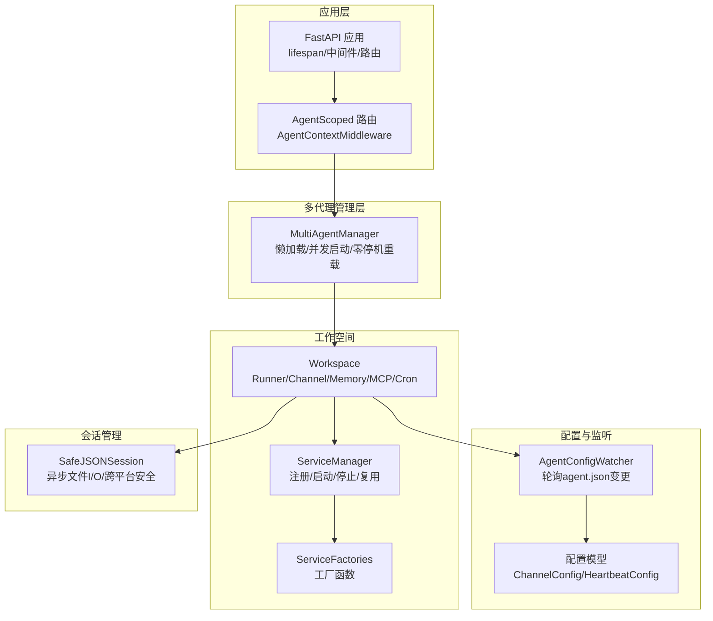
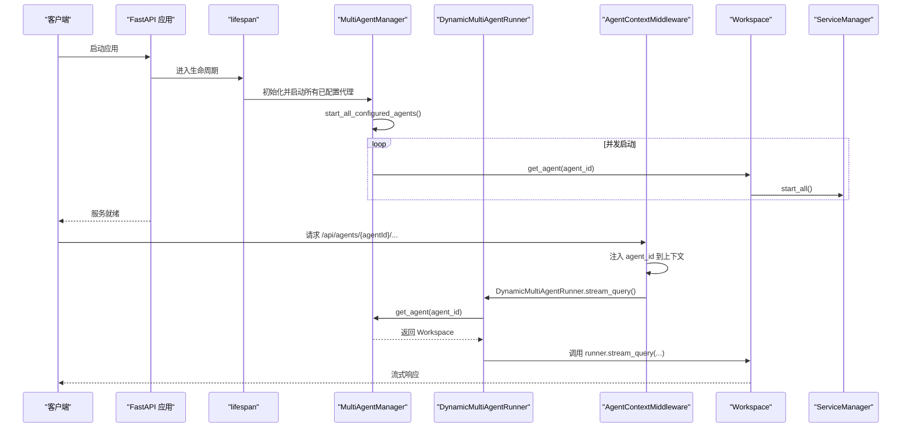
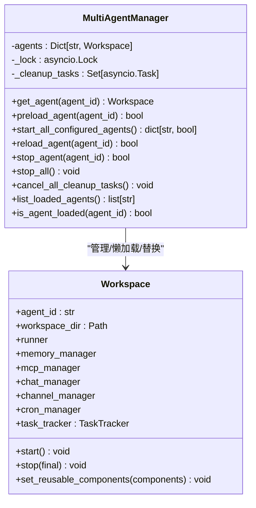
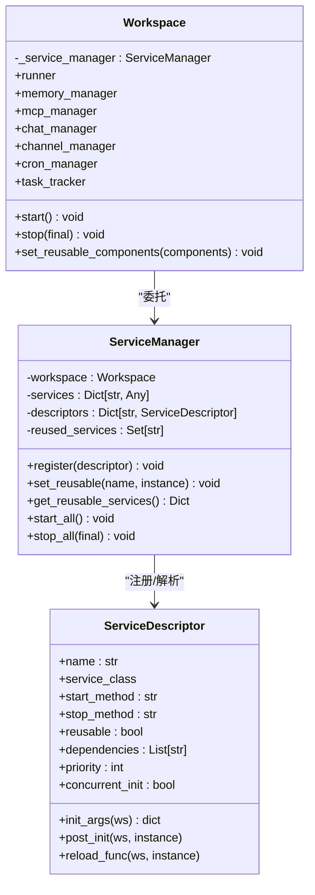
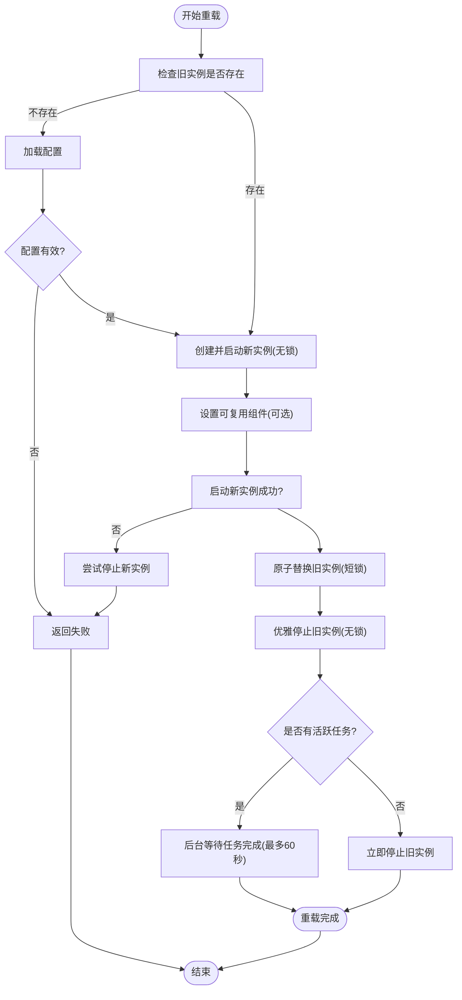
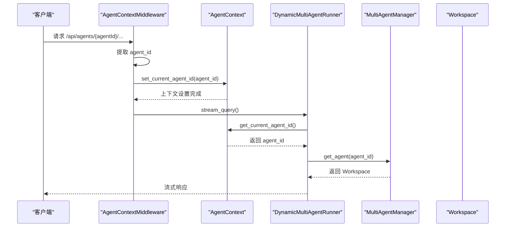
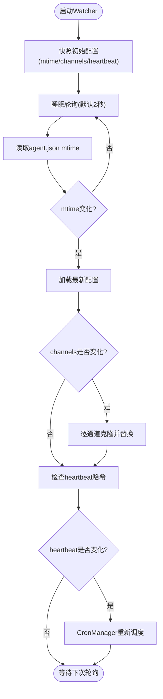
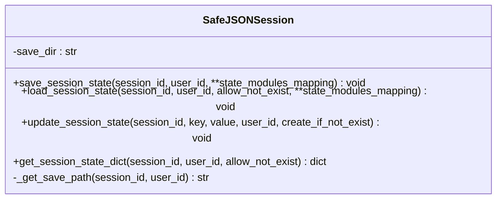
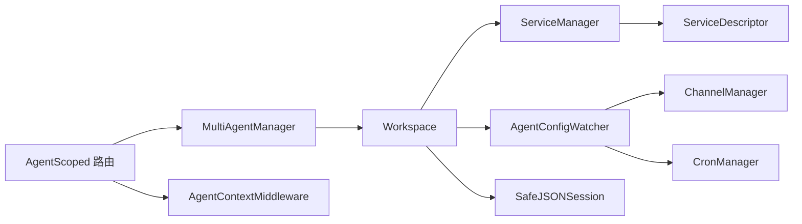

# 多代理管理系统

<cite>
**本文引用的文件列表**
- [multi_agent_manager.py](file://src/copaw/app/multi_agent_manager.py)
- [_app.py](file://src/copaw/app/_app.py)
- [agent_context.py](file://src/copaw/app/agent_context.py)
- [agent_config_watcher.py](file://src/copaw/app/agent_config_watcher.py)
- [workspace.py](file://src/copaw/app/workspace/workspace.py)
- [service_manager.py](file://src/copaw/app/workspace/service_manager.py)
- [service_factories.py](file://src/copaw/app/workspace/service_factories.py)
- [agent_scoped.py](file://src/copaw/app/routers/agent_scoped.py)
- [manager.py](file://src/copaw/app/runner/manager.py)
- [session.py](file://src/copaw/app/runner/session.py)
- [config.py](file://src/copaw/config/config.py)
</cite>

## 目录
1. [简介](#简介)
2. [项目结构](#项目结构)
3. [核心组件](#核心组件)
4. [架构总览](#架构总览)
5. [详细组件分析](#详细组件分析)
6. [依赖关系分析](#依赖关系分析)
7. [性能考量](#性能考量)
8. [故障排查指南](#故障排查指南)
9. [结论](#结论)
10. [附录](#附录)

## 简介
本技术文档围绕CoPaw多代理管理系统，系统性阐述多代理生命周期管理机制、零停机重载实现、代理配置管理与热更新、代理状态监控、会话管理机制、代理上下文管理、配置监听器机制以及会话状态持久化等核心能力。文档以MultiAgentManager为中心，结合Workspace、ServiceManager、AgentConfigWatcher、AgentContext、AgentScoped路由与Runner等模块，给出代码级架构图、调用序列图与流程图，并提供可定位到源码路径的示例说明，帮助读者快速理解并高效运维该系统。

## 项目结构
CoPaw采用“应用层（FastAPI）+ 多代理管理层 + 工作空间（Workspace）+ 服务管理（ServiceManager）+ 配置与监听”的分层设计：
- 应用层：FastAPI应用、中间件、路由与生命周期管理
- 多代理管理层：MultiAgentManager负责代理实例的懒加载、并发启动、零停机重载与统一停止
- 工作空间：Workspace封装Runner、ChannelManager、MemoryManager、MCPClientManager、CronManager等组件
- 服务管理：ServiceManager以声明式描述注册组件，支持优先级、并发初始化、依赖解析与可复用组件
- 配置与监听：AgentConfigWatcher轮询agent.json变更，自动重载通道与心跳；AgentContext与AgentScoped路由提供请求级上下文隔离
- 会话管理：SafeJSONSession提供跨平台安全的会话状态持久化

图表来源
- [_app.py:149-241](file://src/copaw/app/_app.py#L149-L241)
- [agent_scoped.py:15-51](file://src/copaw/app/routers/agent_scoped.py#L15-L51)
- [multi_agent_manager.py:17-33](file://src/copaw/app/multi_agent_manager.py#L17-L33)
- [workspace.py:39-78](file://src/copaw/app/workspace/workspace.py#L39-L78)
- [service_manager.py:74-91](file://src/copaw/app/workspace/service_manager.py#L74-L91)
- [service_factories.py:18-34](file://src/copaw/app/workspace/service_factories.py#L18-L34)
- [agent_config_watcher.py:35-73](file://src/copaw/app/agent_config_watcher.py#L35-L73)
- [config.py:189-200](file://src/copaw/config/config.py#L189-L200)
- [session.py:37-70](file://src/copaw/app/runner/session.py#L37-L70)

章节来源
- [_app.py:149-241](file://src/copaw/app/_app.py#L149-L241)
- [agent_scoped.py:15-51](file://src/copaw/app/routers/agent_scoped.py#L15-L51)
- [multi_agent_manager.py:17-33](file://src/copaw/app/multi_agent_manager.py#L17-L33)
- [workspace.py:39-78](file://src/copaw/app/workspace/workspace.py#L39-L78)
- [service_manager.py:74-91](file://src/copaw/app/workspace/service_manager.py#L74-L91)
- [service_factories.py:18-34](file://src/copaw/app/workspace/service_factories.py#L18-L34)
- [agent_config_watcher.py:35-73](file://src/copaw/app/agent_config_watcher.py#L35-L73)
- [config.py:189-200](file://src/copaw/config/config.py#L189-L200)
- [session.py:37-70](file://src/copaw/app/runner/session.py#L37-L70)

## 核心组件
- MultiAgentManager：集中管理多个Workspace实例，支持懒加载、并发启动、零停机重载、优雅停止与清理任务管理
- Workspace：单个代理的工作空间，封装Runner、ChannelManager、MemoryManager、MCPClientManager、CronManager等组件，通过ServiceManager统一生命周期管理
- ServiceManager：声明式服务注册与生命周期管理，支持优先级、并发初始化、依赖解析、可复用组件传递
- AgentConfigWatcher：轮询agent.json变更，自动重载通道与心跳，实现配置热更新
- AgentContext与AgentScoped路由：在请求链路中注入agent上下文，确保不同代理的隔离访问
- SafeJSONSession：跨平台安全的会话状态持久化，避免文件名非法字符导致的异常

章节来源
- [multi_agent_manager.py:17-33](file://src/copaw/app/multi_agent_manager.py#L17-L33)
- [workspace.py:39-78](file://src/copaw/app/workspace/workspace.py#L39-L78)
- [service_manager.py:74-91](file://src/copaw/app/workspace/service_manager.py#L74-L91)
- [agent_config_watcher.py:35-73](file://src/copaw/app/agent_config_watcher.py#L35-L73)
- [agent_context.py:22-84](file://src/copaw/app/agent_context.py#L22-L84)
- [agent_scoped.py:15-51](file://src/copaw/app/routers/agent_scoped.py#L15-L51)
- [session.py:37-70](file://src/copaw/app/runner/session.py#L37-L70)

## 架构总览
多代理系统的关键控制流包括应用启动、代理懒加载、请求路由到指定代理、零停机重载与优雅停止。下图展示了从FastAPI应用启动到请求路由、再到代理实例的完整调用链。

图表来源
- [_app.py:149-241](file://src/copaw/app/_app.py#L149-L241)
- [agent_scoped.py:15-51](file://src/copaw/app/routers/agent_scoped.py#L15-L51)
- [multi_agent_manager.py:34-82](file://src/copaw/app/multi_agent_manager.py#L34-L82)
- [workspace.py:311-337](file://src/copaw/app/workspace/workspace.py#L311-L337)

章节来源
- [_app.py:149-241](file://src/copaw/app/_app.py#L149-L241)
- [agent_scoped.py:15-51](file://src/copaw/app/routers/agent_scoped.py#L15-L51)
- [multi_agent_manager.py:34-82](file://src/copaw/app/multi_agent_manager.py#L34-L82)
- [workspace.py:311-337](file://src/copaw/app/workspace/workspace.py#L311-L337)

## 详细组件分析

### MultiAgentManager 设计与实现
MultiAgentManager采用“懒加载 + 原子替换 + 延迟清理”的零停机重载策略，最小化锁持有时间，最大化并发与可用性。

- 懒加载：首次请求时才创建并启动Workspace
- 并发启动：启动所有已配置代理，使用gather并发执行
- 零停机重载：先创建新实例，再原子替换旧实例，最后延迟清理旧实例
- 优雅停止：对有活跃任务的实例进行后台清理，避免中断正在进行的流式任务
- 清理任务跟踪：记录并取消后台清理任务，确保关闭时无孤儿任务

图表来源
- [multi_agent_manager.py:17-33](file://src/copaw/app/multi_agent_manager.py#L17-L33)
- [workspace.py:39-78](file://src/copaw/app/workspace/workspace.py#L39-L78)

章节来源
- [multi_agent_manager.py:17-33](file://src/copaw/app/multi_agent_manager.py#L17-L33)
- [multi_agent_manager.py:200-311](file://src/copaw/app/multi_agent_manager.py#L200-L311)
- [multi_agent_manager.py:338-362](file://src/copaw/app/multi_agent_manager.py#L338-L362)
- [workspace.py:39-78](file://src/copaw/app/workspace/workspace.py#L39-L78)

### Workspace 生命周期与服务管理
Workspace通过ServiceManager以声明式方式注册服务，支持优先级、并发初始化、依赖解析与可复用组件传递，确保启动顺序与资源复用的可控性。

- 服务注册：Runner、MemoryManager、MCPClientManager、ChatManager、Runner启动、ChannelManager、CronManager、AgentConfigWatcher、MCPConfigWatcher
- 可复用组件：MemoryManager、ChatManager在重载时可直接复用，减少重建成本
- 启停策略：按优先级分组并发启动，反向优先级顺序停止，可跳过可复用组件

图表来源
- [service_manager.py:30-72](file://src/copaw/app/workspace/service_manager.py#L30-L72)
- [service_manager.py:74-91](file://src/copaw/app/workspace/service_manager.py#L74-L91)
- [workspace.py:134-278](file://src/copaw/app/workspace/workspace.py#L134-L278)

章节来源
- [service_manager.py:74-91](file://src/copaw/app/workspace/service_manager.py#L74-L91)
- [workspace.py:134-278](file://src/copaw/app/workspace/workspace.py#L134-L278)
- [service_factories.py:18-34](file://src/copaw/app/workspace/service_factories.py#L18-L34)

### 零停机重载流程
零停机重载的核心在于“先创建新实例，再原子替换，最后延迟清理旧实例”。该流程最小化锁持有时间，确保新请求立即由新实例处理，同时保证旧实例中的活跃任务不被中断。

图表来源
- [multi_agent_manager.py:200-311](file://src/copaw/app/multi_agent_manager.py#L200-L311)
- [multi_agent_manager.py:83-179](file://src/copaw/app/multi_agent_manager.py#L83-L179)

章节来源
- [multi_agent_manager.py:200-311](file://src/copaw/app/multi_agent_manager.py#L200-L311)
- [multi_agent_manager.py:83-179](file://src/copaw/app/multi_agent_manager.py#L83-L179)

### 代理上下文管理与会话路由
- AgentContextMiddleware从路径或头部提取agentId，注入到上下文变量，供后续组件使用
- AgentContext提供get_agent_for_request，按优先级选择目标agent：参数覆盖、请求状态、请求头、配置默认
- DynamicMultiAgentRunner根据当前agentId动态路由到对应Workspace的runner，实现多代理共享同一Runner接口

图表来源
- [agent_scoped.py:15-51](file://src/copaw/app/routers/agent_scoped.py#L15-L51)
- [agent_context.py:22-84](file://src/copaw/app/agent_context.py#L22-L84)
- [_app.py:49-137](file://src/copaw/app/_app.py#L49-L137)

章节来源
- [agent_scoped.py:15-51](file://src/copaw/app/routers/agent_scoped.py#L15-L51)
- [agent_context.py:22-84](file://src/copaw/app/agent_context.py#L22-L84)
- [_app.py:49-137](file://src/copaw/app/_app.py#L49-L137)

### 配置热更新与监听
AgentConfigWatcher轮询agent.json的mtime变化，检测channels与heartbeat变更，自动重载相关组件，实现无需重启的服务热更新。

- 轮询间隔：默认2秒
- 变更检测：channels快照哈希、heartbeat哈希
- 组件重载：逐通道克隆并替换，心跳变更触发CronManager重新调度
- 异常处理：失败时回滚到旧配置，不影响运行

图表来源
- [agent_config_watcher.py:74-96](file://src/copaw/app/agent_config_watcher.py#L74-L96)
- [agent_config_watcher.py:240-278](file://src/copaw/app/agent_config_watcher.py#L240-L278)

章节来源
- [agent_config_watcher.py:35-73](file://src/copaw/app/agent_config_watcher.py#L35-L73)
- [agent_config_watcher.py:178-217](file://src/copaw/app/agent_config_watcher.py#L178-L217)
- [agent_config_watcher.py:218-239](file://src/copaw/app/agent_config_watcher.py#L218-L239)
- [agent_config_watcher.py:252-278](file://src/copaw/app/agent_config_watcher.py#L252-L278)

### 会话状态持久化
SafeJSONSession提供跨平台安全的会话状态持久化，解决Windows文件名非法字符问题，并使用异步文件I/O避免阻塞事件循环。

- 文件名清洗：将非法字符替换为安全字符
- 异步读写：使用aiofiles进行非阻塞I/O
- 状态模块映射：支持多模块状态字典的保存与加载
- 更新键路径：支持点号路径更新嵌套字段

图表来源
- [session.py:37-70](file://src/copaw/app/runner/session.py#L37-L70)
- [session.py:71-133](file://src/copaw/app/runner/session.py#L71-L133)
- [session.py:134-200](file://src/copaw/app/runner/session.py#L134-L200)

章节来源
- [session.py:37-70](file://src/copaw/app/runner/session.py#L37-L70)
- [session.py:71-133](file://src/copaw/app/runner/session.py#L71-L133)
- [session.py:134-200](file://src/copaw/app/runner/session.py#L134-L200)

### 代理启动、停止、重启操作示例（代码路径）
- 启动所有已配置代理：[start_all_configured_agents:399-445](file://src/copaw/app/multi_agent_manager.py#L399-L445)
- 懒加载单个代理：[get_agent:34-82](file://src/copaw/app/multi_agent_manager.py#L34-L82)
- 停止单个代理：[stop_agent:180-198](file://src/copaw/app/multi_agent_manager.py#L180-L198)
- 停止全部代理：[stop_all:338-362](file://src/copaw/app/multi_agent_manager.py#L338-L362)
- 零停机重载：[reload_agent:200-311](file://src/copaw/app/multi_agent_manager.py#L200-L311)
- 设置可复用组件：[set_reusable_components:279-310](file://src/copaw/app/workspace/workspace.py#L279-L310)

章节来源
- [multi_agent_manager.py:399-445](file://src/copaw/app/multi_agent_manager.py#L399-L445)
- [multi_agent_manager.py:34-82](file://src/copaw/app/multi_agent_manager.py#L34-L82)
- [multi_agent_manager.py:180-198](file://src/copaw/app/multi_agent_manager.py#L180-L198)
- [multi_agent_manager.py:338-362](file://src/copaw/app/multi_agent_manager.py#L338-L362)
- [multi_agent_manager.py:200-311](file://src/copaw/app/multi_agent_manager.py#L200-L311)
- [workspace.py:279-310](file://src/copaw/app/workspace/workspace.py#L279-L310)

## 依赖关系分析
- MultiAgentManager依赖Workspace与配置加载工具，用于懒加载与并发启动
- Workspace依赖ServiceManager进行组件注册与生命周期管理
- ServiceManager依赖ServiceDescriptor进行声明式配置，支持可复用组件与并发初始化
- AgentConfigWatcher依赖ChannelManager与CronManager，实现配置热更新
- AgentContextMiddleware与AgentScoped路由共同提供请求级上下文隔离
- SafeJSONSession作为会话状态持久化组件，被Runner与ChatManager使用

图表来源
- [multi_agent_manager.py:17-33](file://src/copaw/app/multi_agent_manager.py#L17-L33)
- [workspace.py:134-278](file://src/copaw/app/workspace/workspace.py#L134-L278)
- [service_manager.py:30-72](file://src/copaw/app/workspace/service_manager.py#L30-L72)
- [agent_config_watcher.py:35-73](file://src/copaw/app/agent_config_watcher.py#L35-L73)
- [agent_scoped.py:53-91](file://src/copaw/app/routers/agent_scoped.py#L53-L91)
- [agent_context.py:22-84](file://src/copaw/app/agent_context.py#L22-L84)
- [session.py:37-70](file://src/copaw/app/runner/session.py#L37-L70)

章节来源
- [multi_agent_manager.py:17-33](file://src/copaw/app/multi_agent_manager.py#L17-L33)
- [workspace.py:134-278](file://src/copaw/app/workspace/workspace.py#L134-L278)
- [service_manager.py:30-72](file://src/copaw/app/workspace/service_manager.py#L30-L72)
- [agent_config_watcher.py:35-73](file://src/copaw/app/agent_config_watcher.py#L35-L73)
- [agent_scoped.py:53-91](file://src/copaw/app/routers/agent_scoped.py#L53-L91)
- [agent_context.py:22-84](file://src/copaw/app/agent_context.py#L22-L84)
- [session.py:37-70](file://src/copaw/app/runner/session.py#L37-L70)

## 性能考量
- 并发启动：MultiAgentManager在启动阶段使用gather并发启动所有已配置代理，显著缩短启动时间
- 最小锁持有：零停机重载仅在原子替换阶段持有锁，其余步骤均在无锁状态下进行，降低阻塞
- 可复用组件：MemoryManager、ChatManager在重载时复用，避免重复初始化带来的开销
- 异步I/O：SafeJSONSession使用异步文件I/O，避免阻塞事件循环
- 优先级与并发：ServiceManager按优先级分组并发启动，缩短整体启动时间

章节来源
- [multi_agent_manager.py:417-445](file://src/copaw/app/multi_agent_manager.py#L417-L445)
- [multi_agent_manager.py:290-311](file://src/copaw/app/multi_agent_manager.py#L290-L311)
- [service_manager.py:171-200](file://src/copaw/app/workspace/service_manager.py#L171-L200)
- [session.py:71-133](file://src/copaw/app/runner/session.py#L71-L133)

## 故障排查指南
- 启动失败：检查配置文件与agent.json是否存在，确认Workspace启动日志与异常堆栈
- 零停机重载失败：查看新实例启动失败后的清理逻辑，确认旧实例是否仍正常服务
- 清理任务异常：调用cancel_all_cleanup_tasks确保后台清理任务被取消或完成
- 配置热更新无效：确认AgentConfigWatcher是否启动、轮询间隔是否合理、channels与heartbeat变更是否被正确识别
- 会话状态丢失：检查SafeJSONSession的保存目录权限与文件名清洗逻辑，确认异步I/O未抛出异常

章节来源
- [multi_agent_manager.py:313-337](file://src/copaw/app/multi_agent_manager.py#L313-L337)
- [agent_config_watcher.py:86-96](file://src/copaw/app/agent_config_watcher.py#L86-L96)
- [session.py:134-200](file://src/copaw/app/runner/session.py#L134-L200)

## 结论
CoPaw多代理管理系统通过MultiAgentManager实现了多代理的集中管理与零停机重载，配合Workspace与ServiceManager的声明式服务管理、AgentConfigWatcher的配置热更新、AgentContext与AgentScoped路由的上下文隔离，以及SafeJSONSession的跨平台会话持久化，构建了高可用、高性能、易运维的多代理运行时。该架构既满足了生产环境对稳定性与连续性的要求，也为后续扩展与演进提供了清晰的边界与接口。

## 附录
- 配置模型概览：ChannelConfig、HeartbeatConfig等模型定义位于配置模块，支持丰富的通道与心跳配置
- 会话管理：ChatManager负责聊天规格的CRUD，SafeJSONSession负责状态持久化

章节来源
- [config.py:189-200](file://src/copaw/config/config.py#L189-L200)
- [manager.py:17-24](file://src/copaw/app/runner/manager.py#L17-L24)
- [session.py:37-70](file://src/copaw/app/runner/session.py#L37-L70)