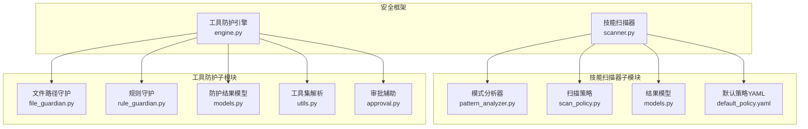
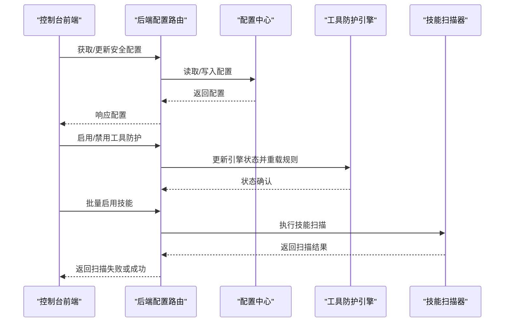
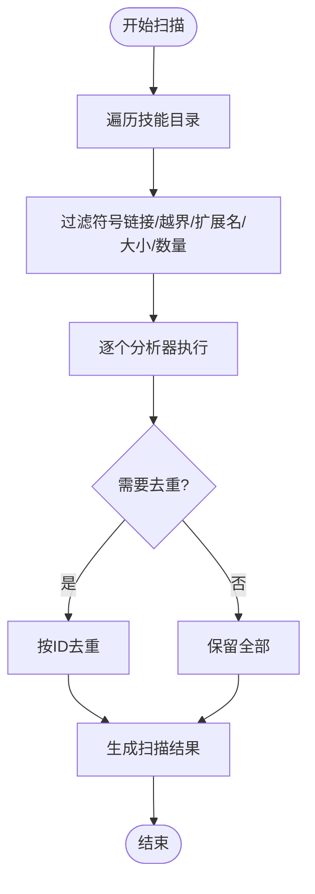
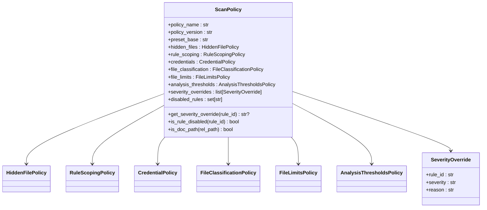
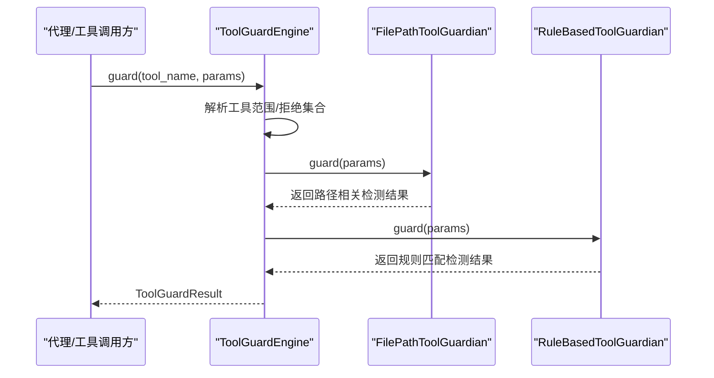
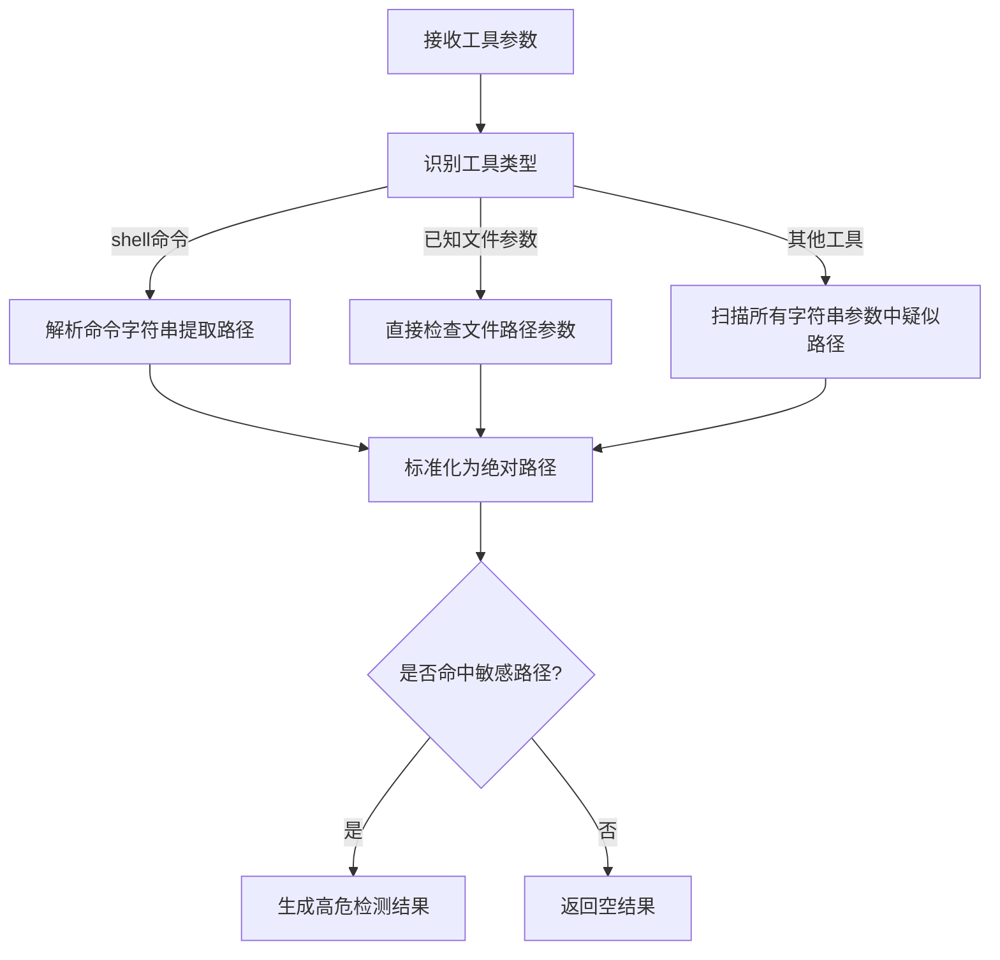
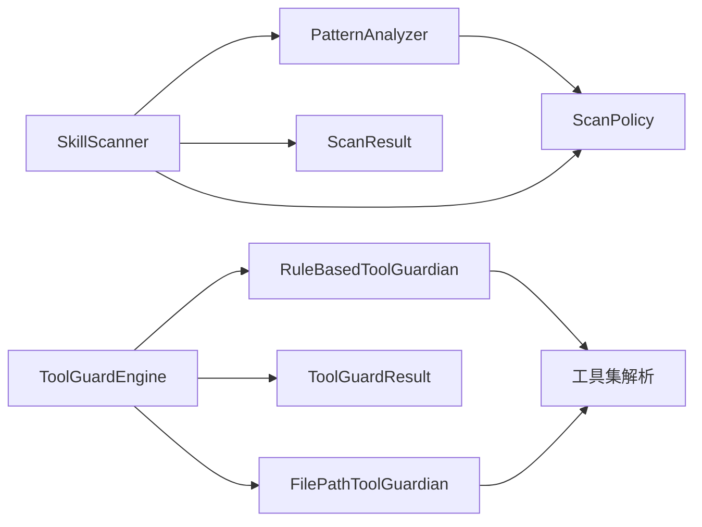

# 安全增强

<cite>
**本文档引用的文件**
- [src/copaw/security/__init__.py](file://src/copaw/security/__init__.py)
- [src/copaw/security/skill_scanner/scanner.py](file://src/copaw/security/skill_scanner/scanner.py)
- [src/copaw/security/skill_scanner/models.py](file://src/copaw/security/skill_scanner/models.py)
- [src/copaw/security/skill_scanner/scan_policy.py](file://src/copaw/security/skill_scanner/scan_policy.py)
- [src/copaw/security/skill_scanner/data/default_policy.yaml](file://src/copaw/security/skill_scanner/data/default_policy.yaml)
- [src/copaw/security/skill_scanner/analyzers/pattern_analyzer.py](file://src/copaw/security/skill_scanner/analyzers/pattern_analyzer.py)
- [src/copaw/security/tool_guard/engine.py](file://src/copaw/security/tool_guard/engine.py)
- [src/copaw/security/tool_guard/models.py](file://src/copaw/security/tool_guard/models.py)
- [src/copaw/security/tool_guard/utils.py](file://src/copaw/security/tool_guard/utils.py)
- [src/copaw/security/tool_guard/approval.py](file://src/copaw/security/tool_guard/approval.py)
- [src/copaw/security/tool_guard/guardians/file_guardian.py](file://src/copaw/security/tool_guard/guardians/file_guardian.py)
- [src/copaw/security/tool_guard/guardians/rule_guardian.py](file://src/copaw/security/tool_guard/guardians/rule_guardian.py)
- [src/copaw/security/tool_guard/rules/dangerous_shell_commands.yaml](file://src/copaw/security/tool_guard/rules/dangerous_shell_commands.yaml)
- [src/copaw/app/routers/config.py](file://src/copaw/app/routers/config.py)
- [console/src/pages/Settings/Security/index.tsx](file://console/src/pages/Settings/Security/index.tsx)
- [console/src/pages/Settings/Security/useToolGuard.ts](file://console/src/pages/Settings/Security/useToolGuard.ts)
- [console/src/pages/Settings/Security/useSkillScanner.ts](file://console/src/pages/Settings/Security/useSkillScanner.ts)
- [console/src/api/modules/security.ts](file://console/src/api/modules/security.ts)
</cite>

## 目录
1. [简介](#简介)
2. [项目结构](#项目结构)
3. [核心组件](#核心组件)
4. [架构总览](#架构总览)
5. [详细组件分析](#详细组件分析)
6. [依赖关系分析](#依赖关系分析)
7. [性能考量](#性能考量)
8. [故障排除指南](#故障排除指南)
9. [结论](#结论)
10. [附录](#附录)

## 简介
本文件系统性梳理 CoPaw 的安全增强机制，重点覆盖两大子系统：技能包静态扫描（Skill Scanner）与工具调用前置防护（Tool Guard）。前者在技能安装/激活前对技能目录进行静态安全检查，后者在工具执行前对参数进行规则匹配与路径校验，防止命令注入、敏感文件访问、资源滥用等高危行为。两个子系统相互独立、可独立启用/禁用，并通过统一的配置中心与控制台界面进行管理。

## 项目结构
安全框架位于 `src/copaw/security/`，包含以下模块：
- 技能扫描器（skill_scanner）
  - 扫描器主入口与文件发现
  - 分析器（PatternAnalyzer）
  - 策略（ScanPolicy）与默认策略
  - 结果模型（Finding/ScanResult）
- 工具防护（tool_guard）
  - 引擎（ToolGuardEngine）与守护者（Guardians）
  - 路径守护（FilePathToolGuardian）
  - 规则守护（RuleBasedToolGuardian）
  - 配置解析与日志输出
  - 审批辅助（ApprovalDecision）

图表来源
- [src/copaw/security/skill_scanner/scanner.py:76-319](file://src/copaw/security/skill_scanner/scanner.py#L76-L319)
- [src/copaw/security/tool_guard/engine.py:53-238](file://src/copaw/security/tool_guard/engine.py#L53-L238)

章节来源
- [src/copaw/security/__init__.py:1-17](file://src/copaw/security/__init__.py#L1-L17)

## 核心组件
- 技能扫描器（SkillScanner）
  - 负责遍历技能目录、加载策略、运行分析器、聚合结果并判定是否安全
  - 支持跳过扩展名、文件大小限制、最大文件数等安全阈值
- 工具防护引擎（ToolGuardEngine）
  - 统一编排多个守护者（规则守护、文件路径守护），在工具调用前进行参数扫描与路径校验
  - 支持按环境变量/配置动态启停、工具范围与拒绝列表
- 扫描策略（ScanPolicy）
  - 提供组织级策略：隐藏文件处理、规则作用域、凭证抑制、文件分类、文件限制、阈值与严重性覆盖
- 防护结果模型（ToolGuardResult）
  - 封装单次工具调用的检测结果，支持严重性分级与摘要统计

章节来源
- [src/copaw/security/skill_scanner/scanner.py:76-319](file://src/copaw/security/skill_scanner/scanner.py#L76-L319)
- [src/copaw/security/tool_guard/engine.py:53-238](file://src/copaw/security/tool_guard/engine.py#L53-L238)
- [src/copaw/security/skill_scanner/scan_policy.py:156-476](file://src/copaw/security/skill_scanner/scan_policy.py#L156-L476)
- [src/copaw/security/tool_guard/models.py:103-185](file://src/copaw/security/tool_guard/models.py#L103-L185)

## 架构总览
下图展示从控制台到后端再到安全子系统的调用链路与职责边界：

图表来源
- [src/copaw/app/routers/config.py:461-516](file://src/copaw/app/routers/config.py#L461-L516)
- [src/copaw/security/tool_guard/engine.py:169-226](file://src/copaw/security/tool_guard/engine.py#L169-L226)
- [src/copaw/security/skill_scanner/scanner.py:148-242](file://src/copaw/security/skill_scanner/scanner.py#L148-L242)

## 详细组件分析

### 技能扫描器（SkillScanner）
- 文件发现与安全过滤
  - 遍历技能目录，跳过符号链接、超出边界路径、指定扩展名（如图片/压缩包/可执行文件）、超过大小限制的文件
  - 达到最大文件数量时提前终止，避免资源耗尽
- 分析器编排
  - 按策略加载分析器（默认为 PatternAnalyzer），逐个执行并收集结果
  - 对重复的检测结果按策略去重
- 结果判定
  - 依据最高严重级别判断是否安全；提供按严重级别/威胁类别的查询方法

图表来源
- [src/copaw/security/skill_scanner/scanner.py:248-299](file://src/copaw/security/skill_scanner/scanner.py#L248-L299)
- [src/copaw/security/skill_scanner/scanner.py:194-242](file://src/copaw/security/skill_scanner/scanner.py#L194-L242)

章节来源
- [src/copaw/security/skill_scanner/scanner.py:76-319](file://src/copaw/security/skill_scanner/scanner.py#L76-L319)

### 扫描策略（ScanPolicy）
- 策略分层与合并
  - 内置默认策略与用户自定义策略深度合并，仅覆盖差异部分
  - 支持预设策略名称（如 balanced）
- 关键策略项
  - 隐藏文件处理：允许的点文件/点目录白名单
  - 规则作用域：仅在特定文件类型/路径生效的规则集合
  - 凭证抑制：测试占位符与常见测试值自动抑制
  - 文件分类：静止文件/结构化文件/归档/代码文件扩展名映射
  - 文件限制：最大文件数、单文件大小、最大引用深度、名称/描述长度
  - 阈值与覆盖：最小置信度、正则长度上限、规则严重性覆盖、禁用规则集合

图表来源
- [src/copaw/security/skill_scanner/scan_policy.py:156-476](file://src/copaw/security/skill_scanner/scan_policy.py#L156-L476)

章节来源
- [src/copaw/security/skill_scanner/scan_policy.py:1-476](file://src/copaw/security/skill_scanner/scan_policy.py#L1-L476)
- [src/copaw/security/skill_scanner/data/default_policy.yaml:1-245](file://src/copaw/security/skill_scanner/data/default_policy.yaml#L1-L245)

### 工具防护引擎（ToolGuardEngine）
- 守护者编排
  - 默认守护者：文件路径守护（FilePathToolGuardian）、规则守护（RuleBasedToolGuardian）
  - 支持注册/注销额外守护者；支持仅执行 always_run 的守护者
- 工具范围与拒绝
  - 通过环境变量/配置解析受保护工具集合与无条件拒绝工具集合
  - 支持“保护全部”“保护空集”“保护指定集合”的灵活语义
- 运行时控制
  - 可按需启用/禁用；支持重载规则与刷新工具集合

图表来源
- [src/copaw/security/tool_guard/engine.py:169-226](file://src/copaw/security/tool_guard/engine.py#L169-L226)
- [src/copaw/security/tool_guard/guardians/file_guardian.py:290-341](file://src/copaw/security/tool_guard/guardians/file_guardian.py#L290-L341)
- [src/copaw/security/tool_guard/guardians/rule_guardian.py:329-382](file://src/copaw/security/tool_guard/guardians/rule_guardian.py#L329-L382)

章节来源
- [src/copaw/security/tool_guard/engine.py:53-238](file://src/copaw/security/tool_guard/engine.py#L53-L238)
- [src/copaw/security/tool_guard/utils.py:63-126](file://src/copaw/security/tool_guard/utils.py#L63-L126)

### 文件路径守护（FilePathToolGuardian）
- 功能要点
  - 将配置中的敏感路径标准化为绝对路径，区分文件与目录两类阻断
  - 对 shell 命令参数提取候选路径，进行去重与启发式识别
  - 对命中敏感路径的参数生成高严重性检测结果
- 路径解析与校验
  - 支持相对路径解析至工作区根目录
  - 对重定向操作符（如 `>`, `>>`, `2>&1` 等）进行分离/附着两种场景的路径提取

图表来源
- [src/copaw/security/tool_guard/guardians/file_guardian.py:111-158](file://src/copaw/security/tool_guard/guardians/file_guardian.py#L111-L158)
- [src/copaw/security/tool_guard/guardians/file_guardian.py:290-341](file://src/copaw/security/tool_guard/guardians/file_guardian.py#L290-L341)

章节来源
- [src/copaw/security/tool_guard/guardians/file_guardian.py:161-342](file://src/copaw/security/tool_guard/guardians/file_guardian.py#L161-L342)

### 规则守护（RuleBasedToolGuardian）
- 规则来源
  - 内置 YAML 规则目录（如危险 shell 命令规则）
  - 配置中心自定义规则与禁用规则集合
- 匹配逻辑
  - 将参数值转换为字符串后进行正则匹配
  - 支持排除模式（exclude_patterns）与上下文片段截取
  - 严格按工具/参数维度应用规则，避免误报

章节来源
- [src/copaw/security/tool_guard/guardians/rule_guardian.py:280-383](file://src/copaw/security/tool_guard/guardians/rule_guardian.py#L280-L383)
- [src/copaw/security/tool_guard/rules/dangerous_shell_commands.yaml:1-183](file://src/copaw/security/tool_guard/rules/dangerous_shell_commands.yaml#L1-L183)

### 控制台与后端集成
- 控制台页面
  - 提供工具防护开关、受保护工具集合、内置规则查看与编辑、自定义规则增删改
  - 提供技能扫描器配置与被阻止历史记录管理
- 后端路由
  - 提供获取/更新工具防护配置、获取内置规则、获取/更新技能扫描器配置、管理被阻止历史与白名单等接口
- 数据模型
  - 前端通过 API 模块与后端交互，使用强类型模型确保数据一致性

章节来源
- [console/src/pages/Settings/Security/index.tsx:237-389](file://console/src/pages/Settings/Security/index.tsx#L237-L389)
- [console/src/pages/Settings/Security/useToolGuard.ts:1-85](file://console/src/pages/Settings/Security/useToolGuard.ts#L1-L85)
- [console/src/pages/Settings/Security/useSkillScanner.ts:1-85](file://console/src/pages/Settings/Security/useSkillScanner.ts#L1-L85)
- [console/src/api/modules/security.ts:101-148](file://console/src/api/modules/security.ts#L101-L148)
- [src/copaw/app/routers/config.py:461-635](file://src/copaw/app/routers/config.py#L461-L635)

## 依赖关系分析
- 子系统解耦
  - 技能扫描器与工具防护引擎彼此独立，可单独启用/禁用
  - 分析器与守护者均通过策略/配置驱动，便于扩展新规则与新检测逻辑
- 外部依赖
  - 正则表达式、YAML 解析、文件系统遍历、配置加载
- 潜在风险
  - 正则复杂度过高可能影响性能
  - 规则过多可能导致误报，需结合策略进行收敛

图表来源
- [src/copaw/security/skill_scanner/analyzers/pattern_analyzer.py:38-200](file://src/copaw/security/skill_scanner/analyzers/pattern_analyzer.py#L38-L200)
- [src/copaw/security/skill_scanner/scan_policy.py:156-476](file://src/copaw/security/skill_scanner/scan_policy.py#L156-L476)
- [src/copaw/security/skill_scanner/models.py:168-235](file://src/copaw/security/skill_scanner/models.py#L168-L235)
- [src/copaw/security/tool_guard/guardians/rule_guardian.py:280-383](file://src/copaw/security/tool_guard/guardians/rule_guardian.py#L280-L383)
- [src/copaw/security/tool_guard/guardians/file_guardian.py:161-342](file://src/copaw/security/tool_guard/guardians/file_guardian.py#L161-L342)
- [src/copaw/security/tool_guard/engine.py:53-238](file://src/copaw/security/tool_guard/engine.py#L53-L238)
- [src/copaw/security/tool_guard/models.py:103-185](file://src/copaw/security/tool_guard/models.py#L103-L185)

## 性能考量
- 技能扫描
  - 通过最大文件数与文件大小限制避免大规模扫描导致的内存与 CPU 峰值
  - 采用“先行匹配再多行回退”的策略减少不必要的全文扫描
- 工具防护
  - 字符串化参数后进行快速正则匹配；仅在必要时提取 shell 命令中的路径
  - 通过 always_run 守护者保证路径检查的最低成本覆盖
- 建议
  - 合理设置策略阈值，避免规则数量过大
  - 使用环境变量/配置优先级快速调整防护强度

## 故障排除指南
- 工具防护未生效
  - 检查 COPAW_TOOL_GUARD_ENABLED 环境变量与配置中心 enabled 字段
  - 确认受保护工具集合是否为空或仅包含非目标工具
- 路径误报
  - 检查敏感路径配置是否包含误伤路径，必要时调整敏感文件列表
  - 使用规则排除模式（exclude_patterns）降低误报
- 扫描结果异常
  - 检查策略中的规则作用域与文件分类，确认规则是否按预期触发
  - 查看扫描日志与去重策略是否导致结果缺失
- 控制台无法保存配置
  - 确认后端路由 /config/security/* 是否正常响应
  - 检查前端请求体格式与字段命名是否符合后端模型

章节来源
- [src/copaw/security/tool_guard/engine.py:35-71](file://src/copaw/security/tool_guard/engine.py#L35-L71)
- [src/copaw/security/tool_guard/utils.py:63-126](file://src/copaw/security/tool_guard/utils.py#L63-L126)
- [src/copaw/app/routers/config.py:461-516](file://src/copaw/app/routers/config.py#L461-L516)

## 结论
本安全增强方案通过“静态扫描 + 前置防护”的双轨机制，有效降低了技能安装与工具执行过程中的安全风险。策略化与可配置的设计使得组织能够根据自身合规要求灵活调整检测强度与范围；前后端一体化的管理界面进一步提升了运维效率。建议在生产环境中结合业务场景持续优化规则集与阈值，并定期审查被阻止历史与白名单，以实现安全与可用性的平衡。

## 附录
- 关键术语
  - 严重性等级：CRITICAL/HIGH/MEDIUM/LOW/INFO/SAFE
  - 威胁类别：命令注入、数据泄露、路径穿越、敏感文件访问、网络滥用、权限提升等
- 常用配置项
  - 工具防护：enabled、guarded_tools、denied_tools、custom_rules、disabled_rules
  - 技能扫描：策略文件、文件分类、文件限制、规则覆盖与禁用