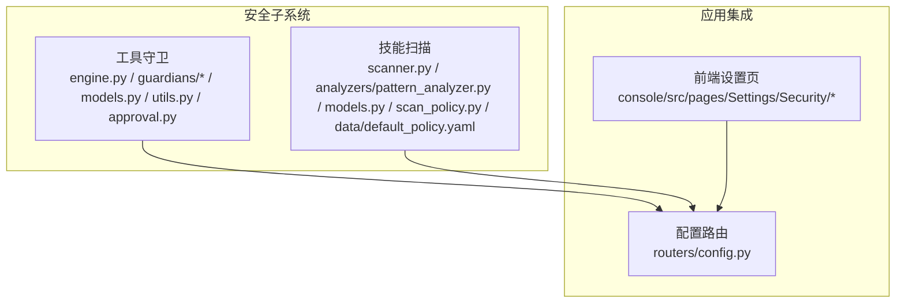
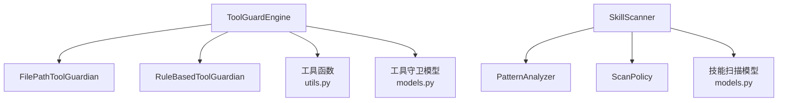
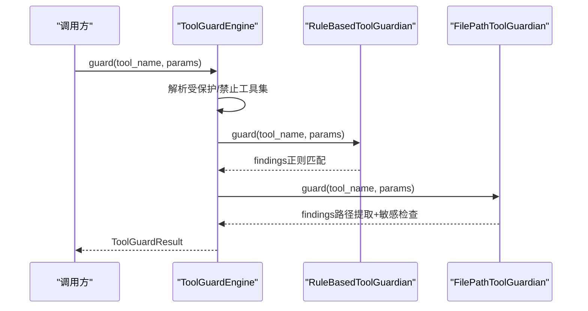
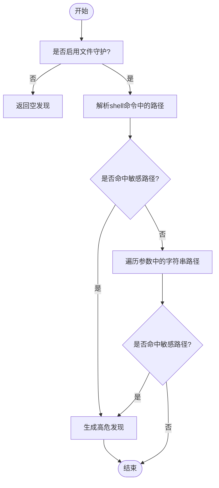
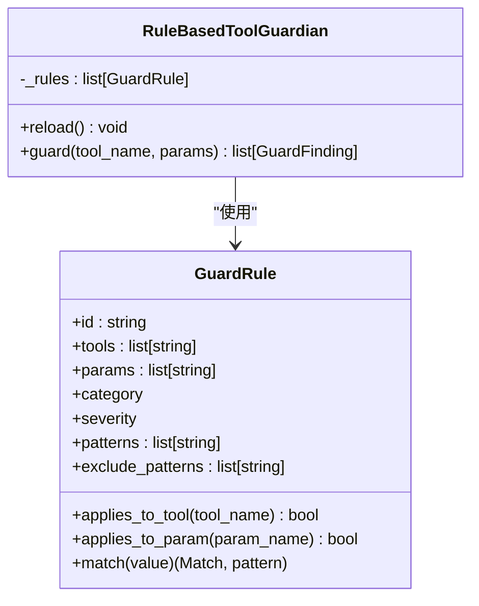
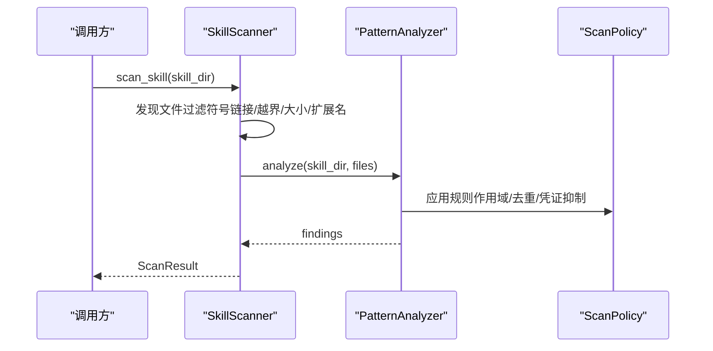
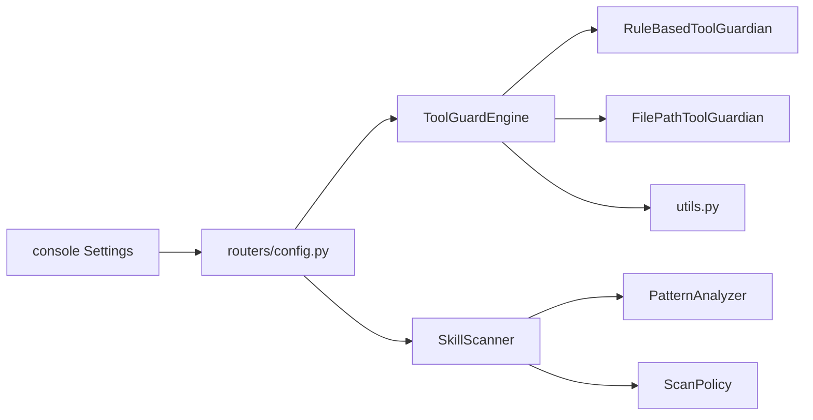

# 安全防护系统

<cite>
**本文引用的文件**
- [src/copaw/security/__init__.py](file://src/copaw/security/__init__.py)
- [src/copaw/security/tool_guard/engine.py](file://src/copaw/security/tool_guard/engine.py)
- [src/copaw/security/tool_guard/guardians/file_guardian.py](file://src/copaw/security/tool_guard/guardians/file_guardian.py)
- [src/copaw/security/tool_guard/guardians/rule_guardian.py](file://src/copaw/security/tool_guard/guardians/rule_guardian.py)
- [src/copaw/security/tool_guard/models.py](file://src/copaw/security/tool_guard/models.py)
- [src/copaw/security/tool_guard/utils.py](file://src/copaw/security/tool_guard/utils.py)
- [src/copaw/security/tool_guard/approval.py](file://src/copaw/security/tool_guard/approval.py)
- [src/copaw/security/tool_guard/rules/dangerous_shell_commands.yaml](file://src/copaw/security/tool_guard/rules/dangerous_shell_commands.yaml)
- [src/copaw/security/skill_scanner/scanner.py](file://src/copaw/security/skill_scanner/scanner.py)
- [src/copaw/security/skill_scanner/models.py](file://src/copaw/security/skill_scanner/models.py)
- [src/copaw/security/skill_scanner/scan_policy.py](file://src/copaw/security/skill_scanner/scan_policy.py)
- [src/copaw/security/skill_scanner/data/default_policy.yaml](file://src/copaw/security/skill_scanner/data/default_policy.yaml)
- [src/copaw/security/skill_scanner/analyzers/pattern_analyzer.py](file://src/copaw/security/skill_scanner/analyzers/pattern_analyzer.py)
- [src/copaw/security/skill_scanner/rules/signatures/command_injection.yaml](file://src/copaw/security/skill_scanner/rules/signatures/command_injection.yaml)
- [src/copaw/security/skill_scanner/rules/signatures/hardcoded_secrets.yaml](file://src/copaw/security/skill_scanner/rules/signatures/hardcoded_secrets.yaml)
- [src/copaw/security/skill_scanner/rules/signatures/data_exfiltration.yaml](file://src/copaw/security/skill_scanner/rules/signatures/data_exfiltration.yaml)
- [src/copaw/security/skill_scanner/rules/signatures/obfuscation.yaml](file://src/copaw/security/skill_scanner/rules/signatures/obfuscation.yaml)
- [src/copaw/app/routers/config.py](file://src/copaw/app/routers/config.py)
- [console/src/pages/Settings/Security/useToolGuard.ts](file://console/src/pages/Settings/Security/useToolGuard.ts)
- [console/src/pages/Settings/Security/index.tsx](file://console/src/pages/Settings/Security/index.tsx)
- [website/public/docs/security.en.md](file://website/public/docs/security.en.md)
</cite>

## 更新摘要
**所做更改**
- 更新了技能扫描器规则增强部分，新增多种威胁检测规则
- 改进了文件守卫处理机制，增强了路径提取和敏感文件检查
- 新增了详细的规则配置示例和威胁检测流程说明
- 更新了安全策略配置和违规处理策略章节

## 目录
1. [简介](#简介)
2. [项目结构](#项目结构)
3. [核心组件](#核心组件)
4. [架构总览](#架构总览)
5. [关键组件详解](#关键组件详解)
6. [依赖关系分析](#依赖关系分析)
7. [性能与可扩展性](#性能与可扩展性)
8. [故障排查指南](#故障排查指南)
9. [结论](#结论)
10. [附录](#附录)

## 简介
本技术文档面向CoPaw安全防护系统，聚焦以下核心能力：
- 工具守卫引擎（ToolGuardEngine）：对工具调用参数进行预执行扫描，识别命令注入、数据泄露、敏感路径访问等高危模式。
- 技能扫描器（SkillScanner）：在技能包安装/激活前进行静态分析，基于签名规则与策略配置发现潜在威胁。
- 访问控制机制：通过"受保护工具集""禁止工具集""敏感文件/目录白名单/黑名单"等策略实现细粒度控制。
- 安全策略配置：支持环境变量、配置文件与运行时API的多级覆盖，提供灵活的规则与策略管理。

文档同时提供规则配置示例、威胁检测流程、违规处理策略、安全审计日志与异常行为检测、权限验证与合规建议等实践指导。

## 项目结构
安全子系统位于src/copaw/security，按职责划分为两大部分：
- 工具守卫（tool_guard）：包含引擎、守护者（文件路径与规则驱动）、模型、工具函数、审批辅助与内置规则。
- 技能扫描（skill_scanner）：包含扫描器、策略、分析器（签名规则）、模型与默认策略数据。

**图表来源**
- [src/copaw/security/tool_guard/engine.py:53-238](file://src/copaw/security/tool_guard/engine.py#L53-L238)
- [src/copaw/security/skill_scanner/scanner.py:76-319](file://src/copaw/security/skill_scanner/scanner.py#L76-L319)
- [src/copaw/app/routers/config.py:407-453](file://src/copaw/app/routers/config.py#L407-L453)
- [console/src/pages/Settings/Security/useToolGuard.ts:1-47](file://console/src/pages/Settings/Security/useToolGuard.ts#L1-L47)

**章节来源**
- [src/copaw/security/__init__.py:1-17](file://src/copaw/security/__init__.py#L1-L17)

## 核心组件
- 工具守卫引擎（ToolGuardEngine）
  - 职责：编排多个守护者（FilePathToolGuardian、RuleBasedToolGuardian），聚合结果并输出ToolGuardResult。
  - 关键特性：支持启用开关、受保护工具集、禁止工具集、动态重载规则与敏感路径列表。
- 文件路径守护者（FilePathToolGuardian）
  - 职责：阻断对敏感文件/目录的访问；从shell命令中提取路径并进行启发式判定。
- 规则守护者（RuleBasedToolGuardian）
  - 职责：加载YAML规则，对参数字符串进行正则匹配，生成GuardFinding。
- 技能扫描器（SkillScanner）
  - 职责：遍历技能目录，加载分析器（默认PatternAnalyzer），产出ScanResult。
- 扫描策略（ScanPolicy）
  - 职责：组织隐藏文件、规则作用域、凭证抑制、文件分类、文件限制、阈值、严重性覆盖与禁用规则等。
- 数据模型
  - 工具守卫模型：GuardFinding、ToolGuardResult、枚举（严重性、威胁类别）。
  - 技能扫描模型：Finding、ScanResult、枚举（严重性、威胁类别）、文件模型SkillFile。

**章节来源**
- [src/copaw/security/tool_guard/engine.py:53-238](file://src/copaw/security/tool_guard/engine.py#L53-L238)
- [src/copaw/security/tool_guard/guardians/file_guardian.py:161-342](file://src/copaw/security/tool_guard/guardians/file_guardian.py#L161-L342)
- [src/copaw/security/tool_guard/guardians/rule_guardian.py:280-383](file://src/copaw/security/tool_guard/guardians/rule_guardian.py#L280-L383)
- [src/copaw/security/skill_scanner/scanner.py:76-319](file://src/copaw/security/skill_scanner/scanner.py#L76-L319)
- [src/copaw/security/skill_scanner/scan_policy.py:156-476](file://src/copaw/security/skill_scanner/scan_policy.py#L156-L476)
- [src/copaw/security/tool_guard/models.py:25-185](file://src/copaw/security/tool_guard/models.py#L25-L185)
- [src/copaw/security/skill_scanner/models.py:19-235](file://src/copaw/security/skill_scanner/models.py#L19-L235)

## 架构总览
工具守卫与技能扫描分别独立演进，通过统一的模型词汇（严重性、威胁类别、发现、结果）保持一致性，并在运行时通过配置与API进行统一管理。

**图表来源**
- [src/copaw/security/tool_guard/engine.py:53-238](file://src/copaw/security/tool_guard/engine.py#L53-L238)
- [src/copaw/security/tool_guard/guardians/file_guardian.py:161-342](file://src/copaw/security/tool_guard/guardians/file_guardian.py#L161-L342)
- [src/copaw/security/tool_guard/guardians/rule_guardian.py:280-383](file://src/copaw/security/tool_guard/guardians/rule_guardian.py#L280-L383)
- [src/copaw/security/tool_guard/utils.py:63-163](file://src/copaw/security/tool_guard/utils.py#L63-L163)
- [src/copaw/security/tool_guard/models.py:25-185](file://src/copaw/security/tool_guard/models.py#L25-L185)
- [src/copaw/security/skill_scanner/scanner.py:76-319](file://src/copaw/security/skill_scanner/scanner.py#L76-L319)
- [src/copaw/security/skill_scanner/analyzers/pattern_analyzer.py:236-393](file://src/copaw/security/skill_scanner/analyzers/pattern_analyzer.py#L236-L393)
- [src/copaw/security/skill_scanner/scan_policy.py:156-476](file://src/copaw/security/skill_scanner/scan_policy.py#L156-L476)
- [src/copaw/security/skill_scanner/models.py:19-235](file://src/copaw/security/skill_scanner/models.py#L19-L235)

## 关键组件详解

### 工具守卫引擎（ToolGuardEngine）
- 规则匹配算法
  - 对每个守护者，遍历参数字典，将非空值转换为字符串后进行匹配。
  - 规则对象按工具名与参数名过滤后，逐条尝试正则匹配，命中即生成GuardFinding。
  - 支持排除模式（exclude_patterns）优先过滤。
- 路径提取与敏感文件检查
  - 针对execute_shell_command，使用shell解析提取路径候选，结合启发式判断与规范化路径进行敏感文件/目录比对。
  - 对已知文件工具仅检查特定参数；对其他工具扫描所有字符串参数中疑似路径令牌。
- 受保护工具集与禁止工具集
  - 通过环境变量、配置文件或构造函数解析，支持"全部""无""显式列表"三种语义。
  - 禁止工具集直接拒绝，不进入审批流程。
- 动态重载
  - 支持重新加载规则与敏感路径集合，便于在线调整策略。

**图表来源**
- [src/copaw/security/tool_guard/engine.py:169-227](file://src/copaw/security/tool_guard/engine.py#L169-L227)
- [src/copaw/security/tool_guard/guardians/rule_guardian.py:329-383](file://src/copaw/security/tool_guard/guardians/rule_guardian.py#L329-L383)
- [src/copaw/security/tool_guard/guardians/file_guardian.py:290-342](file://src/copaw/security/tool_guard/guardians/file_guardian.py#L290-L342)

**章节来源**
- [src/copaw/security/tool_guard/engine.py:53-238](file://src/copaw/security/tool_guard/engine.py#L53-L238)
- [src/copaw/security/tool_guard/guardians/rule_guardian.py:280-383](file://src/copaw/security/tool_guard/guardians/rule_guardian.py#L280-L383)
- [src/copaw/security/tool_guard/guardians/file_guardian.py:161-342](file://src/copaw/security/tool_guard/guardians/file_guardian.py#L161-L342)
- [src/copaw/security/tool_guard/utils.py:63-163](file://src/copaw/security/tool_guard/utils.py#L63-L163)

### 文件路径守护者（FilePathToolGuardian）
- 敏感路径管理
  - 支持从配置加载敏感文件/目录列表，默认保护密钥目录。
  - 提供增删改接口，内部维护绝对化后的集合。
- 路径提取与启发式
  - 对shell命令使用安全分词，识别重定向操作符及其目标路径。
  - 使用启发式规则过滤URL、MIME、选项等非路径令牌。
- 命中处理
  - 生成高危发现（敏感文件访问），附带修复建议与元数据（解析后的绝对路径）。

**图表来源**
- [src/copaw/security/tool_guard/guardians/file_guardian.py:290-342](file://src/copaw/security/tool_guard/guardians/file_guardian.py#L290-L342)
- [src/copaw/security/tool_guard/guardians/file_guardian.py:111-159](file://src/copaw/security/tool_guard/guardians/file_guardian.py#L111-L159)

**章节来源**
- [src/copaw/security/tool_guard/guardians/file_guardian.py:161-342](file://src/copaw/security/tool_guard/guardians/file_guardian.py#L161-L342)

### 规则守护者（RuleBasedToolGuardian）
- 规则加载
  - 默认从内置规则目录加载；支持自定义目录与额外规则。
  - 合并配置中的自定义规则与禁用规则ID，构建活跃规则集。
- 匹配流程
  - 过滤适用规则（工具名/参数名），对参数字符串进行正则匹配与排除过滤。
  - 生成上下文片段，封装为GuardFinding。

**图表来源**
- [src/copaw/security/tool_guard/guardians/rule_guardian.py:52-146](file://src/copaw/security/tool_guard/guardians/rule_guardian.py#L52-L146)
- [src/copaw/security/tool_guard/guardians/rule_guardian.py:280-383](file://src/copaw/security/tool_guard/guardians/rule_guardian.py#L280-L383)

**章节来源**
- [src/copaw/security/tool_guard/guardians/rule_guardian.py:280-383](file://src/copaw/security/tool_guard/guardians/rule_guardian.py#L280-L383)
- [src/copaw/security/tool_guard/rules/dangerous_shell_commands.yaml:1-183](file://src/copaw/security/tool_guard/rules/dangerous_shell_commands.yaml#L1-L183)

### 技能扫描器（SkillScanner）
- 文件发现与过滤
  - 递归遍历技能目录，跳过符号链接与越界路径；按策略与硬性阈值过滤扩展名与大小。
- 分析器编排
  - 依次调用各分析器（默认PatternAnalyzer），收集Findings。
- 结果聚合
  - 去重、统计最高严重性、记录耗时与失败的分析器。

**图表来源**
- [src/copaw/security/skill_scanner/scanner.py:148-242](file://src/copaw/security/skill_scanner/scanner.py#L148-L242)
- [src/copaw/security/skill_scanner/analyzers/pattern_analyzer.py:265-347](file://src/copaw/security/skill_scanner/analyzers/pattern_analyzer.py#L265-L347)
- [src/copaw/security/skill_scanner/scan_policy.py:156-476](file://src/copaw/security/skill_scanner/scan_policy.py#L156-L476)

**章节来源**
- [src/copaw/security/skill_scanner/scanner.py:76-319](file://src/copaw/security/skill_scanner/scanner.py#L76-L319)
- [src/copaw/security/skill_scanner/analyzers/pattern_analyzer.py:236-393](file://src/copaw/security/skill_scanner/analyzers/pattern_analyzer.py#L236-L393)
- [src/copaw/security/skill_scanner/scan_policy.py:156-476](file://src/copaw/security/skill_scanner/scan_policy.py#L156-L476)

### 扫描策略（ScanPolicy）
- 组织化配置项
  - 隐藏文件策略、规则作用域（仅代码/文档区）、凭证抑制、文件分类（惰性/结构化/归档/代码）、文件限制、分析阈值、严重性覆盖、禁用规则。
- 加载与合并
  - 内置默认策略与用户策略深度合并，仅覆盖差异部分。
- 运行期辅助
  - 文档路径识别、规则ID覆盖查询、规则禁用查询等。

**章节来源**
- [src/copaw/security/skill_scanner/scan_policy.py:156-476](file://src/copaw/security/skill_scanner/scan_policy.py#L156-L476)
- [src/copaw/security/skill_scanner/data/default_policy.yaml:1-245](file://src/copaw/security/skill_scanner/data/default_policy.yaml#L1-L245)

### 数据模型与审批
- 工具守卫模型
  - GuardFinding、ToolGuardResult、严重性与威胁类别枚举，支持序列化与摘要统计。
- 审批辅助
  - ApprovalDecision枚举与格式化摘要工具，用于生成用户可见的风险摘要。

**章节来源**
- [src/copaw/security/tool_guard/models.py:25-185](file://src/copaw/security/tool_guard/models.py#L25-L185)
- [src/copaw/security/tool_guard/approval.py:12-38](file://src/copaw/security/tool_guard/approval.py#L12-L38)

## 依赖关系分析
- 模块内聚与耦合
  - 工具守卫与技能扫描模块内聚良好，彼此独立，通过各自的模型共享概念层（严重性、类别、发现、结果）。
  - 引擎与守护者之间采用组合关系，守护者可插拔扩展。
- 外部依赖
  - YAML解析（规则与策略）、正则表达式（规则与签名）、文件系统（技能扫描）、配置加载（config.json）。
- 配置与API
  - 后端提供安全配置读取与更新接口，前端设置页支持开关、受保护工具集、内置/自定义规则管理与禁用规则选择。

**图表来源**
- [src/copaw/security/tool_guard/engine.py:53-238](file://src/copaw/security/tool_guard/engine.py#L53-L238)
- [src/copaw/security/skill_scanner/scanner.py:76-319](file://src/copaw/security/skill_scanner/scanner.py#L76-L319)
- [src/copaw/app/routers/config.py:407-453](file://src/copaw/app/routers/config.py#L407-L453)
- [console/src/pages/Settings/Security/useToolGuard.ts:1-47](file://console/src/pages/Settings/Security/useToolGuard.ts#L1-L47)

**章节来源**
- [src/copaw/app/routers/config.py:407-453](file://src/copaw/app/routers/config.py#L407-L453)
- [console/src/pages/Settings/Security/index.tsx:237-270](file://console/src/pages/Settings/Security/index.tsx#L237-L270)

## 性能与可扩展性
- 性能特征
  - 工具守卫：参数字符串转正则匹配，时间复杂度近似O(N×M)，N为参数数量，M为规则数；路径提取采用线性扫描与安全分词，开销可控。
  - 技能扫描：文件发现与内容读取为I/O瓶颈；正则匹配为CPU瓶颈；可通过策略限制文件数量与大小，避免超大包导致扫描耗时。
- 优化建议
  - 缓存规则编译结果（已内置），减少重复编译开销。
  - 合理设置文件上限与扩展名过滤，降低I/O压力。
  - 将高成本分析器（如LLM）作为可选扩展，按需加载。
- 可扩展性
  - 守护者与分析器均支持注册扩展，策略与规则可由配置与环境变量动态调整。

## 故障排查指南
- 工具守卫未生效
  - 检查启用开关与受保护工具集配置；确认环境变量与配置文件优先级。
  - 查看日志中的结构化告警摘要，定位最高严重性与耗时。
- 规则未命中或误报
  - 检查规则目录与禁用规则ID；必要时添加自定义规则或调整严重性覆盖。
  - 对于路径提取问题，确认shell命令语法与重定向操作符格式。
- 技能扫描超时或内存占用高
  - 调整文件限制策略（最大文件数、单文件大小）；排除归档与二进制文件。
  - 检查规则文件长度与正则复杂度，避免过长或回溯严重的模式。
- 审批与前端配置
  - 通过后端API查看当前配置；前端设置页支持实时切换与规则管理。

**章节来源**
- [src/copaw/security/tool_guard/utils.py:63-163](file://src/copaw/security/tool_guard/utils.py#L63-L163)
- [src/copaw/security/tool_guard/guardians/rule_guardian.py:153-232](file://src/copaw/security/tool_guard/guardians/rule_guardian.py#L153-L232)
- [src/copaw/security/skill_scanner/scan_policy.py:236-304](file://src/copaw/security/skill_scanner/scan_policy.py#L236-L304)
- [src/copaw/app/routers/config.py:407-453](file://src/copaw/app/routers/config.py#L407-L453)
- [console/src/pages/Settings/Security/useToolGuard.ts:1-47](file://console/src/pages/Settings/Security/useToolGuard.ts#L1-L47)

## 结论
CoPaw安全防护系统通过"工具守卫+技能扫描"的双轨机制，实现了对工具调用与技能包的全链路安全控制。其设计强调：
- 策略可配置、规则可扩展、模型可复用；
- 前后端联动，支持在线调整与可视化管理；
- 严格的边界控制（路径提取、符号链接过滤、越界路径检测）与可追溯的审计日志。

建议在生产环境中结合组织安全基线，持续迭代规则与策略，确保在安全与可用性之间取得平衡。

## 附录

### 安全规则配置示例（工具守卫）
- 启用/禁用
  - 通过后端API或前端设置页切换全局开关。
- 受保护工具集
  - 支持"全部""无""显式列表"，优先级：构造函数 > 环境变量 > 配置文件 > 内置高危集。
- 禁止工具集
  - 列表中的工具直接拒绝，无需审批。
- 自定义规则
  - 在配置中添加规则条目，支持工具/参数范围、正则模式、排除模式、严重性与修复建议。
- 内置规则
  - 默认加载危险shell命令规则集，涵盖rm/mv破坏、fork炸弹、管道到shell、反连/隧道、权限变更、混淆执行等场景。

**章节来源**
- [src/copaw/security/tool_guard/utils.py:63-126](file://src/copaw/security/tool_guard/utils.py#L63-L126)
- [src/copaw/security/tool_guard/rules/dangerous_shell_commands.yaml:1-183](file://src/copaw/security/tool_guard/rules/dangerous_shell_commands.yaml#L1-L183)
- [src/copaw/app/routers/config.py:407-453](file://src/copaw/app/routers/config.py#L407-L453)
- [console/src/pages/Settings/Security/index.tsx:237-270](file://console/src/pages/Settings/Security/index.tsx#L237-L270)
- [website/public/docs/security.en.md:35-57](file://website/public/docs/security.en.md#L35-L57)

### 威胁检测流程（技能扫描）
- 步骤
  - 读取策略（默认策略与组织策略合并）。
  - 发现文件（过滤符号链接、越界、大小与扩展名）。
  - 加载分析器（默认PatternAnalyzer）。
  - 对每份文件按规则扫描，应用作用域与去重策略。
  - 生成ScanResult，包含最高严重性、耗时与失败分析器列表。
- 典型威胁类别
  - 命令注入、数据泄露、硬编码凭证、社会工程、资源滥用、供应链攻击等。

**章节来源**
- [src/copaw/security/skill_scanner/scanner.py:148-242](file://src/copaw/security/skill_scanner/scanner.py#L148-L242)
- [src/copaw/security/skill_scanner/analyzers/pattern_analyzer.py:265-347](file://src/copaw/security/skill_scanner/analyzers/pattern_analyzer.py#L265-L347)
- [src/copaw/security/skill_scanner/scan_policy.py:156-476](file://src/copaw/security/skill_scanner/scan_policy.py#L156-L476)

### 违规处理策略
- 工具守卫
  - 高危发现触发审批流程；低/中危可自动放行或提示确认。
  - 生成结构化日志，包含严重性、规则ID、匹配值与修复建议。
- 技能扫描
  - 若存在CRITICAL/HIGH发现，阻止安装/激活；提供详细报告与修复建议。
- 审批摘要
  - 前端以简洁Markdown摘要呈现风险要点，支持展开更多发现。

**章节来源**
- [src/copaw/security/tool_guard/models.py:103-185](file://src/copaw/security/tool_guard/models.py#L103-L185)
- [src/copaw/security/tool_guard/approval.py:20-38](file://src/copaw/security/tool_guard/approval.py#L20-L38)
- [console/src/pages/Settings/Security/useToolGuard.ts:1-47](file://console/src/pages/Settings/Security/useToolGuard.ts#L1-L47)

### 安全审计日志与异常行为检测
- 工具守卫日志
  - 结构化输出每条发现与汇总信息，区分高危与一般级别。
- 技能扫描日志
  - 输出扫描耗时、文件计数、最高严重性与失败分析器。
- 异常行为检测建议
  - 基于历史基线建立阈值（如高频高危规则命中、异常路径模式），结合外部SIEM进行关联分析。

**章节来源**
- [src/copaw/security/tool_guard/utils.py:128-163](file://src/copaw/security/tool_guard/utils.py#L128-L163)
- [src/copaw/security/skill_scanner/scanner.py:235-242](file://src/copaw/security/skill_scanner/scanner.py#L235-L242)

### 权限验证与合规要求
- 最小权限原则
  - 严格限制工具调用范围与参数；对敏感文件/目录实施白名单/黑名单。
- 合规建议
  - 定期审查规则与策略；对硬编码凭证与高危命令保持零容忍；保留审计轨迹并定期归档。
- 风险评估
  - 基于威胁类别分布与历史事件，评估风险暴露面并制定缓解计划。

### 技能扫描器规则增强详情

#### 命令注入威胁检测
技能扫描器新增了全面的命令注入检测规则，涵盖多种危险模式：

- **危险代码执行函数**：检测eval()、exec()、compile()等危险函数调用
- **Shell命令注入**：识别os.system()、subprocess模块的危险用法
- **路径遍历漏洞**：检测文件路径构造中的安全问题
- **SQL注入风险**：识别字符串格式化导致的SQL注入
- **SVG/JS恶意脚本**：检测嵌入式脚本标签和事件处理器
- **PDF恶意代码**：识别PDF文件中的JavaScript动作

**章节来源**
- [src/copaw/security/skill_scanner/rules/signatures/command_injection.yaml:1-195](file://src/copaw/security/skill_scanner/rules/signatures/command_injection.yaml#L1-L195)

#### 硬编码凭证检测增强
新增了针对各种类型凭证的检测规则：

- **云服务密钥**：AWS访问密钥、Stripe API密钥、Google API密钥
- **私钥检测**：完整的私钥块检测，避免文档示例误报
- **连接字符串**：数据库连接字符串中的硬编码凭据
- **JWT令牌**：JSON Web Token的检测与处理
- **密码变量**：硬编码的密码和密钥变量

**章节来源**
- [src/copaw/security/skill_scanner/rules/signatures/hardcoded_secrets.yaml:1-150](file://src/copaw/security/skill_scanner/rules/signatures/hardcoded_secrets.yaml#L1-L150)

#### 数据泄露检测规则
强化了数据外泄检测能力：

- **网络请求检测**：requests、httpx、aiohttp等网络库的可疑使用
- **敏感文件访问**：系统敏感文件的读取操作
- **Base64编码传输**：编码后的数据外泄模式
- **JavaScript文件系统**：Node.js环境下的文件操作检测
- **Socket连接**：直接的网络套接字连接

**章节来源**
- [src/copaw/security/skill_scanner/rules/signatures/data_exfiltration.yaml:1-142](file://src/copaw/security/skill_scanner/rules/signatures/data_exfiltration.yaml#L1-L142)

#### 混淆与恶意代码检测
新增了针对混淆技术和恶意代码的检测：

- **Base64解码执行链**：检测编码执行的常见模式
- **十六进制Blob**：大型十六进制编码的数据块
- **XOR编码**：异或运算的混淆模式
- **二进制文件**：可执行文件的检测与处理

**章节来源**
- [src/copaw/security/skill_scanner/rules/signatures/obfuscation.yaml:1-47](file://src/copaw/security/skill_scanner/rules/signatures/obfuscation.yaml#L1-L47)

#### 文件发现与过滤改进
技能扫描器在文件发现阶段进行了多项改进：

- **符号链接过滤**：完全跳过符号链接以防止路径遍历攻击
- **越界路径检测**：确保所有文件都在技能目录边界内
- **文件大小限制**：可配置的最大文件大小限制
- **扩展名过滤**：智能的文件类型分类和过滤
- **性能优化**：文件数量上限控制，避免超大包扫描

**章节来源**
- [src/copaw/security/skill_scanner/scanner.py:248-299](file://src/copaw/security/skill_scanner/scanner.py#L248-L299)

#### 分析器增强功能
PatternAnalyzer增加了多项新功能：

- **规则去重**：可配置的重复发现去重机制
- **测试凭证过滤**：自动过滤常见的测试占位符
- **文件类型缓存**：规则按文件类型的智能缓存
- **多行模式支持**：更好的跨行匹配能力
- **性能优化**：规则编译结果的缓存机制

**章节来源**
- [src/copaw/security/skill_scanner/analyzers/pattern_analyzer.py:338-393](file://src/copaw/security/skill_scanner/analyzers/pattern_analyzer.py#L338-L393)

#### 策略配置增强
默认策略文件增加了更多配置选项：

- **隐藏文件策略**：更精确的点文件和点目录处理
- **规则作用域**：文档和代码文件的不同规则应用
- **凭证抑制**：测试凭证和占位符的自动过滤
- **文件分类**：更细致的文件类型分类
- **分析阈值**：正则表达式的长度和复杂度限制

**章节来源**
- [src/copaw/security/skill_scanner/data/default_policy.yaml:1-245](file://src/copaw/security/skill_scanner/data/default_policy.yaml#L1-L245)