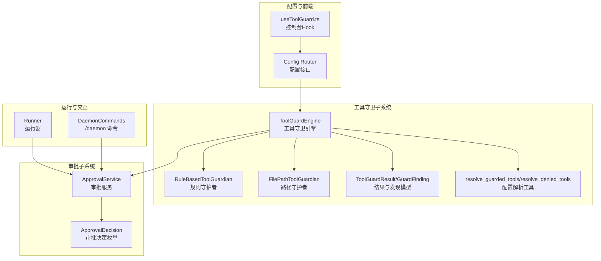
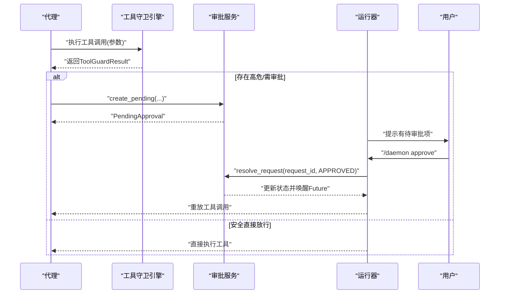
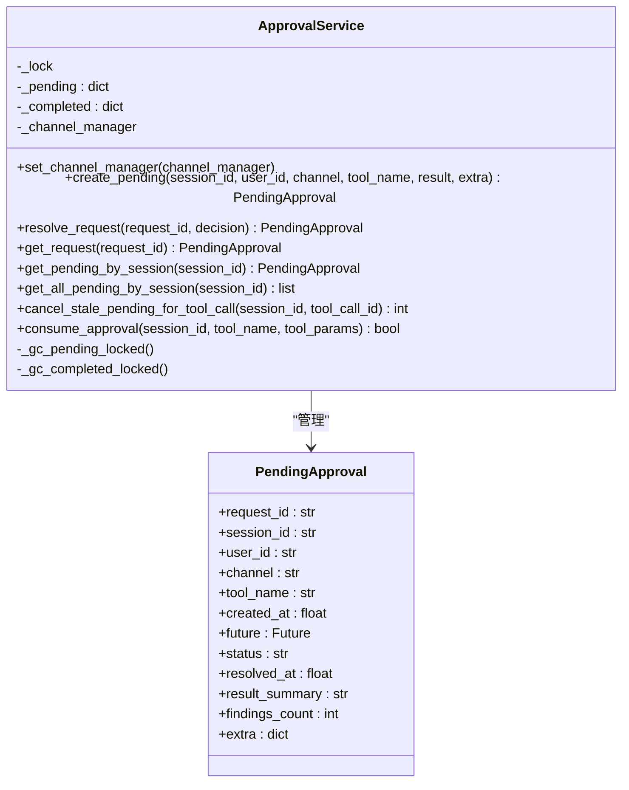
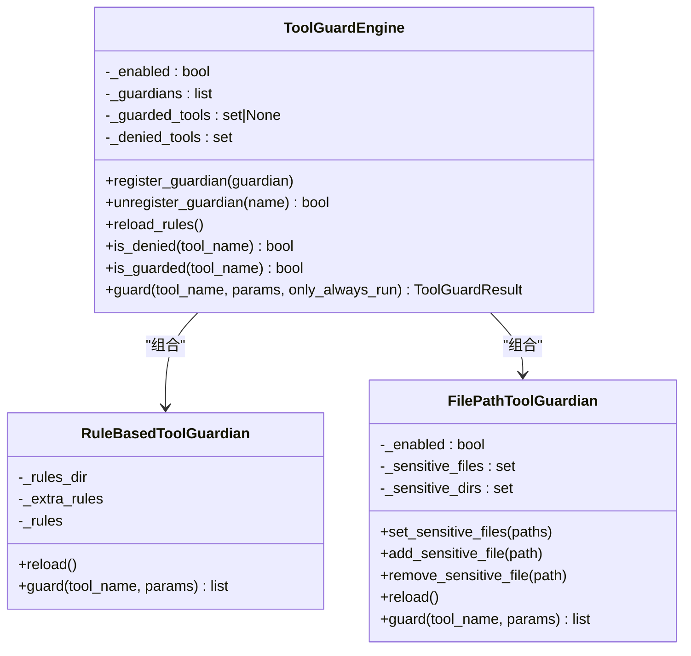
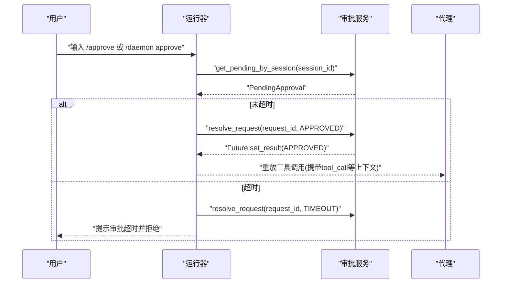
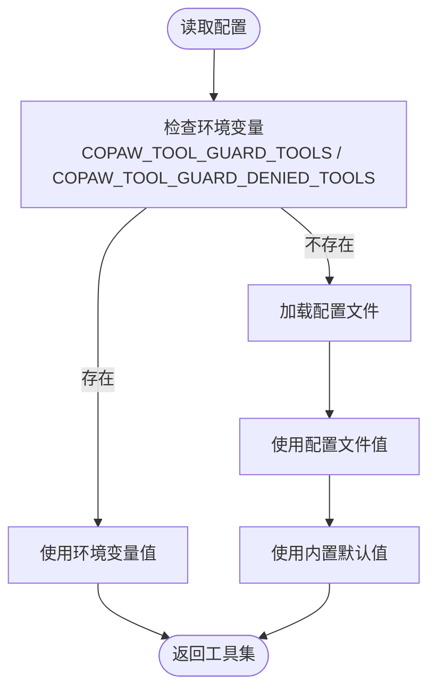
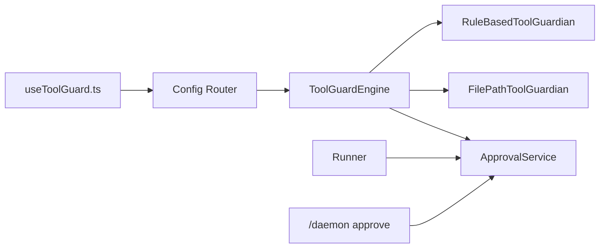

# 审批系统

<cite>
**本文引用的文件**
- [src/copaw/app/approvals/service.py](file://src/copaw/app/approvals/service.py)
- [src/copaw/security/tool_guard/approval.py](file://src/copaw/security/tool_guard/approval.py)
- [src/copaw/security/tool_guard/engine.py](file://src/copaw/security/tool_guard/engine.py)
- [src/copaw/security/tool_guard/guardians/rule_guardian.py](file://src/copaw/security/tool_guard/guardians/rule_guardian.py)
- [src/copaw/security/tool_guard/guardians/file_guardian.py](file://src/copaw/security/tool_guard/guardians/file_guardian.py)
- [src/copaw/security/tool_guard/models.py](file://src/copaw/security/tool_guard/models.py)
- [src/copaw/security/tool_guard/utils.py](file://src/copaw/security/tool_guard/utils.py)
- [src/copaw/agents/tool_guard_mixin.py](file://src/copaw/agents/tool_guard_mixin.py)
- [src/copaw/app/runner/runner.py](file://src/copaw/app/runner/runner.py)
- [src/copaw/app/runner/daemon_commands.py](file://src/copaw/app/runner/daemon_commands.py)
- [src/copaw/app/routers/config.py](file://src/copaw/app/routers/config.py)
- [console/src/pages/Settings/Security/useToolGuard.ts](file://console/src/pages/Settings/Security/useToolGuard.ts)
- [src/copaw/constant.py](file://src/copaw/constant.py)
- [src/copaw/config/config.py](file://src/copaw/config/config.py)
- [src/copaw/security/tool_guard/rules/dangerous_shell_commands.yaml](file://src/copaw/security/tool_guard/rules/dangerous_shell_commands.yaml)
</cite>

## 目录
1. [简介](#简介)
2. [项目结构](#项目结构)
3. [核心组件](#核心组件)
4. [架构总览](#架构总览)
5. [详细组件分析](#详细组件分析)
6. [依赖分析](#依赖分析)
7. [性能考虑](#性能考虑)
8. [故障排查指南](#故障排查指南)
9. [结论](#结论)
10. [附录](#附录)

## 简介
本文件面向CoPaw审批系统，聚焦“工具调用安全审批”能力，系统性阐述审批服务的架构设计、审批流程管理、权限控制机制与运行时行为。内容涵盖：
- 审批请求的生成与审批状态跟踪
- 审批决策处理与超时回收
- 审批配置示例：如何设置审批规则、定义审批人列表、配置审批流程
- 审批状态管理、审批历史记录、审批通知机制
- 实际审批场景案例：高风险工具调用、敏感技能执行、批量操作审批
- 审批效率优化、审批策略定制、审批审计日志

## 项目结构
审批系统由“工具守卫引擎 + 审批服务 + 运行器/命令处理器 + 控制台配置”四部分协同构成：
- 工具守卫引擎负责在工具调用前进行参数扫描与风险判定
- 审批服务集中管理待审批与已完成审批记录，并支持超时回收
- 运行器拦截用户输入，识别审批指令并驱动审批决策
- 控制台提供规则与工具范围的可视化配置入口

**图表来源**
- [src/copaw/security/tool_guard/engine.py:53-237](file://src/copaw/security/tool_guard/engine.py#L53-L237)
- [src/copaw/security/tool_guard/guardians/rule_guardian.py:280-383](file://src/copaw/security/tool_guard/guardians/rule_guardian.py#L280-L383)
- [src/copaw/security/tool_guard/guardians/file_guardian.py:161-342](file://src/copaw/security/tool_guard/guardians/file_guardian.py#L161-L342)
- [src/copaw/security/tool_guard/models.py:103-185](file://src/copaw/security/tool_guard/models.py#L103-L185)
- [src/copaw/security/tool_guard/utils.py:63-126](file://src/copaw/security/tool_guard/utils.py#L63-L126)
- [src/copaw/app/approvals/service.py:58-341](file://src/copaw/app/approvals/service.py#L58-L341)
- [src/copaw/security/tool_guard/approval.py:12-38](file://src/copaw/security/tool_guard/approval.py#L12-L38)
- [src/copaw/app/runner/runner.py:1-164](file://src/copaw/app/runner/runner.py#L1-L164)
- [src/copaw/app/runner/daemon_commands.py:185-223](file://src/copaw/app/runner/daemon_commands.py#L185-L223)
- [src/copaw/app/routers/config.py:407-453](file://src/copaw/app/routers/config.py#L407-L453)
- [console/src/pages/Settings/Security/useToolGuard.ts:13-124](file://console/src/pages/Settings/Security/useToolGuard.ts#L13-L124)

**章节来源**
- [src/copaw/security/tool_guard/engine.py:53-237](file://src/copaw/security/tool_guard/engine.py#L53-L237)
- [src/copaw/app/approvals/service.py:58-341](file://src/copaw/app/approvals/service.py#L58-L341)
- [src/copaw/app/runner/runner.py:1-164](file://src/copaw/app/runner/runner.py#L1-L164)
- [src/copaw/app/runner/daemon_commands.py:185-223](file://src/copaw/app/runner/daemon_commands.py#L185-L223)
- [src/copaw/app/routers/config.py:407-453](file://src/copaw/app/routers/config.py#L407-L453)
- [console/src/pages/Settings/Security/useToolGuard.ts:13-124](file://console/src/pages/Settings/Security/useToolGuard.ts#L13-L124)

## 核心组件
- 工具守卫引擎：按配置加载规则守护者与路径守护者，聚合扫描结果并输出ToolGuardResult
- 规则守护者：基于YAML签名规则对工具参数进行正则匹配，生成GuardFinding
- 路径守护者：扫描文件路径与shell命令中的敏感路径，阻断高危访问
- 审批服务：集中存储待审批与已完成审批记录，支持超时回收、参数校验与消费一次性审批
- 运行器与/daemon命令：拦截用户输入，识别审批指令并驱动审批决策
- 配置解析与控制台：通过环境变量/配置文件/控制台三通道配置工具守卫范围与规则

**章节来源**
- [src/copaw/security/tool_guard/engine.py:53-237](file://src/copaw/security/tool_guard/engine.py#L53-L237)
- [src/copaw/security/tool_guard/guardians/rule_guardian.py:280-383](file://src/copaw/security/tool_guard/guardians/rule_guardian.py#L280-L383)
- [src/copaw/security/tool_guard/guardians/file_guardian.py:161-342](file://src/copaw/security/tool_guard/guardians/file_guardian.py#L161-L342)
- [src/copaw/app/approvals/service.py:58-341](file://src/copaw/app/approvals/service.py#L58-L341)
- [src/copaw/app/runner/runner.py:1-164](file://src/copaw/app/runner/runner.py#L1-L164)
- [src/copaw/app/runner/daemon_commands.py:185-223](file://src/copaw/app/runner/daemon_commands.py#L185-L223)
- [src/copaw/security/tool_guard/utils.py:63-126](file://src/copaw/security/tool_guard/utils.py#L63-L126)

## 架构总览
审批系统围绕“工具调用前置守卫 + 审批决策 + 执行放行”的闭环构建。关键交互如下：
- 当代理执行工具调用时，先经工具守卫引擎扫描
- 若存在高危或需人工确认的风险，生成PendingApproval并等待审批
- 用户通过聊天发送“/daemon approve”或等价指令，运行器解析后调用审批服务完成决策
- 审批服务更新状态并唤醒等待的Future，运行器据此决定是否重放工具调用

**图表来源**
- [src/copaw/security/tool_guard/engine.py:169-226](file://src/copaw/security/tool_guard/engine.py#L169-L226)
- [src/copaw/app/approvals/service.py:80-135](file://src/copaw/app/approvals/service.py#L80-L135)
- [src/copaw/app/runner/runner.py:120-164](file://src/copaw/app/runner/runner.py#L120-L164)
- [src/copaw/app/runner/daemon_commands.py:185-223](file://src/copaw/app/runner/daemon_commands.py#L185-L223)

## 详细组件分析

### 组件A：审批服务（ApprovalService）
- 职责
  - 维护待审批与已完成审批字典
  - 提供创建待审批、解析审批、查询审批、取消过期/重复待审批、消费一次性审批等功能
  - 支持超时回收与容量限制，避免内存膨胀
- 关键数据结构
  - PendingApproval：包含请求ID、会话ID、用户ID、渠道、工具名、创建时间、Future、状态、结果摘要、发现计数、额外信息等
- 关键流程
  - 创建待审批：生成UUID、构造PendingApproval、加入待审批队列并触发GC
  - 解析审批：从待审批移除、写入状态与结束时间、加入已完成队列并触发GC
  - 消费一次性审批：在指定会话内，若最近一次审批匹配工具名且参数一致，则视为可用，立即放行
  - 取消过期/重复待审批：基于时间与工具调用ID清理孤儿记录
- 并发与一致性
  - 使用异步锁保护内部状态
  - Future用于跨协程唤醒

**图表来源**
- [src/copaw/app/approvals/service.py:35-114](file://src/copaw/app/approvals/service.py#L35-L114)
- [src/copaw/app/approvals/service.py:116-173](file://src/copaw/app/approvals/service.py#L116-L173)
- [src/copaw/app/approvals/service.py:174-215](file://src/copaw/app/approvals/service.py#L174-L215)
- [src/copaw/app/approvals/service.py:217-262](file://src/copaw/app/approvals/service.py#L217-L262)
- [src/copaw/app/approvals/service.py:268-326](file://src/copaw/app/approvals/service.py#L268-L326)

**章节来源**
- [src/copaw/app/approvals/service.py:58-341](file://src/copaw/app/approvals/service.py#L58-L341)

### 组件B：工具守卫引擎与守护者
- 工具守卫引擎
  - 负责注册/卸载守护者、按配置解析受保护工具集与禁止工具集、聚合扫描结果
  - 支持启用开关、规则重载、仅执行always_run守护者等
- 规则守护者
  - 加载YAML规则，支持内置与自定义规则合并，支持禁用特定规则ID
  - 对字符串化参数值进行正则匹配，生成GuardFinding
- 路径守护者
  - 扫描文件路径与shell命令中的敏感路径，阻断对敏感目录/文件的访问
  - 支持配置化敏感路径集合，默认保护密钥目录

**图表来源**
- [src/copaw/security/tool_guard/engine.py:53-237](file://src/copaw/security/tool_guard/engine.py#L53-L237)
- [src/copaw/security/tool_guard/guardians/rule_guardian.py:280-383](file://src/copaw/security/tool_guard/guardians/rule_guardian.py#L280-L383)
- [src/copaw/security/tool_guard/guardians/file_guardian.py:161-342](file://src/copaw/security/tool_guard/guardians/file_guardian.py#L161-L342)

**章节来源**
- [src/copaw/security/tool_guard/engine.py:53-237](file://src/copaw/security/tool_guard/engine.py#L53-L237)
- [src/copaw/security/tool_guard/guardians/rule_guardian.py:280-383](file://src/copaw/security/tool_guard/guardians/rule_guardian.py#L280-L383)
- [src/copaw/security/tool_guard/guardians/file_guardian.py:161-342](file://src/copaw/security/tool_guard/guardians/file_guardian.py#L161-L342)

### 组件C：审批生命周期与运行器交互
- 运行器拦截用户输入，识别“批准”指令，查询当前会话的待审批项
- 若超时则自动拒绝并通知；若存在待审批则解析为“批准”，并将工具调用上下文回传给运行器
- 审批服务通过Future唤醒等待的协程，运行器据此决定是否重放工具调用

**图表来源**
- [src/copaw/app/runner/runner.py:120-164](file://src/copaw/app/runner/runner.py#L120-L164)
- [src/copaw/app/runner/daemon_commands.py:185-223](file://src/copaw/app/runner/daemon_commands.py#L185-L223)
- [src/copaw/app/approvals/service.py:116-135](file://src/copaw/app/approvals/service.py#L116-L135)

**章节来源**
- [src/copaw/app/runner/runner.py:1-164](file://src/copaw/app/runner/runner.py#L1-L164)
- [src/copaw/app/runner/daemon_commands.py:185-223](file://src/copaw/app/runner/daemon_commands.py#L185-L223)

### 组件D：配置与控制台
- 配置解析
  - 受保护工具集：支持空/星号/关闭/逗号分隔等多形态，优先级：环境变量 > 配置文件 > 内置默认
  - 禁止工具集：环境变量/COPAW_TOOL_GUARD_DENIED_TOOLS > 配置文件 > 默认空集
- 控制台
  - 提供开关、受保护工具选择、内置规则浏览、自定义规则增删改、禁用规则ID列表
  - 保存时合并为ToolGuardConfig并提交到后端

**图表来源**
- [src/copaw/security/tool_guard/utils.py:63-126](file://src/copaw/security/tool_guard/utils.py#L63-L126)
- [src/copaw/app/routers/config.py:407-453](file://src/copaw/app/routers/config.py#L407-L453)
- [console/src/pages/Settings/Security/useToolGuard.ts:13-124](file://console/src/pages/Settings/Security/useToolGuard.ts#L13-L124)

**章节来源**
- [src/copaw/security/tool_guard/utils.py:63-126](file://src/copaw/security/tool_guard/utils.py#L63-L126)
- [src/copaw/app/routers/config.py:407-453](file://src/copaw/app/routers/config.py#L407-L453)
- [console/src/pages/Settings/Security/useToolGuard.ts:13-124](file://console/src/pages/Settings/Security/useToolGuard.ts#L13-L124)

## 依赖分析
- 组件耦合
  - 工具守卫引擎与守护者：松耦合，通过统一接口聚合结果
  - 审批服务与运行器：通过Future与会话ID解耦，降低直接依赖
  - 控制台与配置接口：通过HTTP API解耦，便于前端扩展
- 外部依赖
  - 配置加载、环境变量解析、工作目录常量
  - 日志系统用于结构化输出扫描结果摘要

**图表来源**
- [src/copaw/security/tool_guard/engine.py:53-237](file://src/copaw/security/tool_guard/engine.py#L53-L237)
- [src/copaw/app/approvals/service.py:58-341](file://src/copaw/app/approvals/service.py#L58-L341)
- [src/copaw/app/runner/runner.py:1-164](file://src/copaw/app/runner/runner.py#L1-L164)
- [src/copaw/app/runner/daemon_commands.py:185-223](file://src/copaw/app/runner/daemon_commands.py#L185-L223)
- [src/copaw/app/routers/config.py:407-453](file://src/copaw/app/routers/config.py#L407-L453)
- [console/src/pages/Settings/Security/useToolGuard.ts:13-124](file://console/src/pages/Settings/Security/useToolGuard.ts#L13-L124)

**章节来源**
- [src/copaw/security/tool_guard/engine.py:53-237](file://src/copaw/security/tool_guard/engine.py#L53-L237)
- [src/copaw/app/approvals/service.py:58-341](file://src/copaw/app/approvals/service.py#L58-L341)
- [src/copaw/app/runner/runner.py:1-164](file://src/copaw/app/runner/runner.py#L1-L164)
- [src/copaw/app/runner/daemon_commands.py:185-223](file://src/copaw/app/runner/daemon_commands.py#L185-L223)
- [src/copaw/app/routers/config.py:407-453](file://src/copaw/app/routers/config.py#L407-L453)
- [console/src/pages/Settings/Security/useToolGuard.ts:13-124](file://console/src/pages/Settings/Security/useToolGuard.ts#L13-L124)

## 性能考虑
- 异步并发
  - 审批服务使用异步锁与Future，避免阻塞事件循环
- GC与容量控制
  - 待审批与已完成记录均设有最大数量与过期时间阈值，定期清理避免内存膨胀
- 扫描效率
  - 规则守护者预编译正则表达式，路径守护者采用启发式快速过滤
- 超时控制
  - 运行器根据全局超时常量判断是否自动拒绝，减少长时间挂起

**章节来源**
- [src/copaw/app/approvals/service.py:24-27](file://src/copaw/app/approvals/service.py#L24-L27)
- [src/copaw/app/approvals/service.py:268-326](file://src/copaw/app/approvals/service.py#L268-L326)
- [src/copaw/security/tool_guard/guardians/rule_guardian.py:96-115](file://src/copaw/security/tool_guard/guardians/rule_guardian.py#L96-L115)
- [src/copaw/app/runner/runner.py:120-144](file://src/copaw/app/runner/runner.py#L120-L144)
- [src/copaw/constant.py:200-210](file://src/copaw/constant.py#L200-L210)

## 故障排查指南
- 审批未生效
  - 检查工具守卫是否启用、受保护工具集是否包含目标工具
  - 查看扫描结果摘要与最高严重级别，确认是否存在高危发现
- 审批超时
  - 运行器会在超时后自动拒绝并通知；可调整超时阈值或尽快审批
- 参数不匹配导致一次性审批被拒绝
  - 消费一次性审批时会比对参数，若不一致将拒绝并删除该记录
- 规则未生效
  - 确认规则是否被禁用、是否正确合并到引擎中、是否触发only_always_run分支

**章节来源**
- [src/copaw/app/runner/runner.py:120-144](file://src/copaw/app/runner/runner.py#L120-L144)
- [src/copaw/app/approvals/service.py:217-262](file://src/copaw/app/approvals/service.py#L217-L262)
- [src/copaw/security/tool_guard/engine.py:148-153](file://src/copaw/security/tool_guard/engine.py#L148-L153)
- [src/copaw/security/tool_guard/utils.py:63-126](file://src/copaw/security/tool_guard/utils.py#L63-L126)

## 结论
CoPaw审批系统通过“工具守卫 + 审批服务 + 运行器交互 + 配置控制台”的完整链路，实现了对高风险工具调用的可控审批。系统具备良好的扩展性（可插拔守护者）、可观测性（结构化日志与摘要）与可运维性（超时回收、容量控制、配置热更新）。建议在生产环境中结合业务场景定制规则与工具范围，并通过控制台持续优化审批策略。

## 附录

### 审批配置示例（控制台操作）
- 启用/禁用工具守卫
- 选择受保护工具集：支持“全部”“无”“特定工具列表”
- 禁止工具集：对某些工具直接拒绝，无需审批
- 自定义规则：新增/编辑/删除规则，设置严重级别与修复建议
- 禁用内置规则：通过规则ID快速屏蔽不需要的规则

**章节来源**
- [console/src/pages/Settings/Security/useToolGuard.ts:13-124](file://console/src/pages/Settings/Security/useToolGuard.ts#L13-L124)
- [src/copaw/app/routers/config.py:407-453](file://src/copaw/app/routers/config.py#L407-L453)

### 审批状态管理与历史
- 待审批：按创建顺序排队，FIFO消费
- 已完成：记录状态、结束时间、摘要与发现计数
- 超时/拒绝：自动回收并标记为TIMEOUT/DENIED
- 历史容量：限制最大条目数与保留时间，避免无限增长

**章节来源**
- [src/copaw/app/approvals/service.py:144-172](file://src/copaw/app/approvals/service.py#L144-L172)
- [src/copaw/app/approvals/service.py:268-326](file://src/copaw/app/approvals/service.py#L268-L326)

### 审批通知机制
- 审批服务可持有渠道管理器引用，用于推送通知（如待审批提醒）
- 运行器在超时/批准后向用户反馈消息

**章节来源**
- [src/copaw/app/approvals/service.py:72-74](file://src/copaw/app/approvals/service.py#L72-L74)
- [src/copaw/app/runner/runner.py:120-144](file://src/copaw/app/runner/runner.py#L120-L144)

### 实际审批场景案例
- 高风险工具调用
  - 示例：危险shell命令（如格式化磁盘、反连、fork炸弹等）
  - 规则覆盖：命令注入、资源滥用、网络滥用、权限提升等威胁类别
- 敏感技能执行
  - 示例：对敏感文件/目录的读写、修改SSH密钥、sudoers等
  - 路径守护者自动阻断并生成高危发现
- 批量操作审批
  - 示例：批量删除、批量权限变更
  - 通过一次性审批消费机制，确保参数一致性与最小授权

**章节来源**
- [src/copaw/security/tool_guard/rules/dangerous_shell_commands.yaml:12-120](file://src/copaw/security/tool_guard/rules/dangerous_shell_commands.yaml#L12-L120)
- [src/copaw/security/tool_guard/guardians/file_guardian.py:161-342](file://src/copaw/security/tool_guard/guardians/file_guardian.py#L161-L342)
- [src/copaw/app/approvals/service.py:217-262](file://src/copaw/app/approvals/service.py#L217-L262)