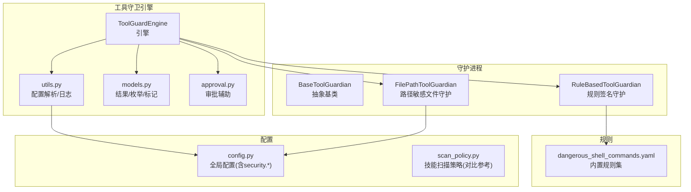
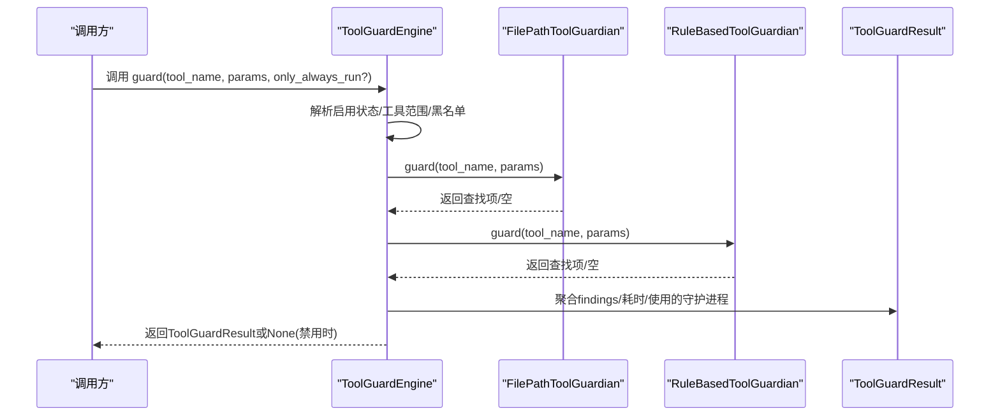
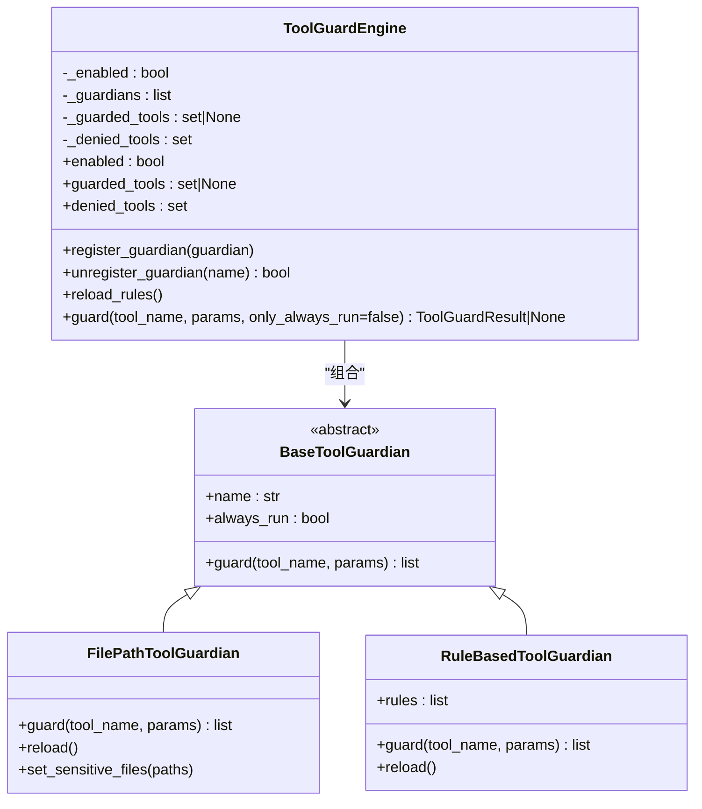
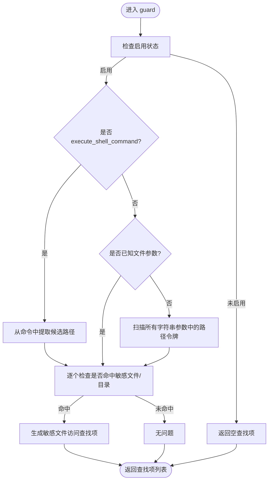
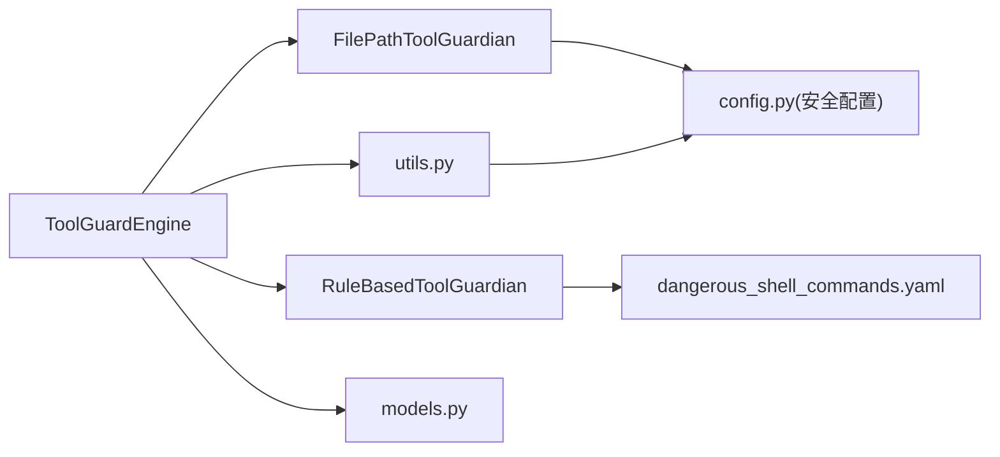

# 工具守卫引擎

<cite>
**本文引用的文件**
- [engine.py](file://src/copaw/security/tool_guard/engine.py)
- [models.py](file://src/copaw/security/tool_guard/models.py)
- [approval.py](file://src/copaw/security/tool_guard/approval.py)
- [utils.py](file://src/copaw/security/tool_guard/utils.py)
- [guardians/__init__.py](file://src/copaw/security/tool_guard/guardians/__init__.py)
- [file_guardian.py](file://src/copaw/security/tool_guard/guardians/file_guardian.py)
- [rule_guardian.py](file://src/copaw/security/tool_guard/guardians/rule_guardian.py)
- [dangerous_shell_commands.yaml](file://src/copaw/security/tool_guard/rules/dangerous_shell_commands.yaml)
- [config.py](file://src/copaw/config/config.py)
- [scan_policy.py](file://src/copaw/security/skill_scanner/scan_policy.py)
- [command_dispatch.py](file://src/copaw/app/runner/command_dispatch.py)
</cite>

## 目录
1. [简介](#简介)
2. [项目结构](#项目结构)
3. [核心组件](#核心组件)
4. [架构总览](#架构总览)
5. [详细组件分析](#详细组件分析)
6. [依赖分析](#依赖分析)
7. [性能考虑](#性能考虑)
8. [故障排查指南](#故障排查指南)
9. [结论](#结论)
10. [附录](#附录)

## 简介
本文件面向CoPaw工具守卫引擎（ToolGuard），系统性阐述其架构设计、守护进程管理机制、规则匹配算法与拦截流程，并覆盖初始化、守护进程注册、工具调用拦截、结果模型、配置管理、性能监控、启用/禁用机制、环境变量与配置文件优先级、安全策略执行、异常处理与日志记录等运行时管理要点。文档同时提供可直接定位到源码路径的示例，帮助读者快速上手并扩展。

## 项目结构
工具守卫引擎位于安全子系统中，围绕“引擎-守护进程-规则”三层组织：
- 引擎层：负责生命周期管理、守护进程注册与调度、结果聚合与性能统计
- 守护进程层：抽象基类与具体实现（路径敏感文件守护、基于签名规则的守护）
- 规则层：内置YAML规则与可配置自定义规则
- 配置层：环境变量、配置文件与默认值的优先级解析
- 结果与审批：统一的结果模型、严重级别、查找摘要与审批辅助

图表来源
- [engine.py:53-238](file://src/copaw/security/tool_guard/engine.py#L53-L238)
- [utils.py:63-163](file://src/copaw/security/tool_guard/utils.py#L63-L163)
- [models.py:103-185](file://src/copaw/security/tool_guard/models.py#L103-L185)
- [approval.py:12-38](file://src/copaw/security/tool_guard/approval.py#L12-L38)
- [guardians/__init__.py:17-62](file://src/copaw/security/tool_guard/guardians/__init__.py#L17-L62)
- [file_guardian.py:161-342](file://src/copaw/security/tool_guard/guardians/file_guardian.py#L161-L342)
- [rule_guardian.py:280-383](file://src/copaw/security/tool_guard/guardians/rule_guardian.py#L280-L383)
- [dangerous_shell_commands.yaml:1-120](file://src/copaw/security/tool_guard/rules/dangerous_shell_commands.yaml#L1-L120)
- [config.py:1-800](file://src/copaw/config/config.py#L1-L800)
- [scan_policy.py:1-476](file://src/copaw/security/skill_scanner/scan_policy.py#L1-L476)

章节来源
- [engine.py:1-238](file://src/copaw/security/tool_guard/engine.py#L1-L238)
- [utils.py:1-163](file://src/copaw/security/tool_guard/utils.py#L1-L163)
- [models.py:1-185](file://src/copaw/security/tool_guard/models.py#L1-L185)
- [guardians/__init__.py:1-62](file://src/copaw/security/tool_guard/guardians/__init__.py#L1-L62)
- [file_guardian.py:1-342](file://src/copaw/security/tool_guard/guardians/file_guardian.py#L1-L342)
- [rule_guardian.py:1-383](file://src/copaw/security/tool_guard/guardians/rule_guardian.py#L1-L383)
- [dangerous_shell_commands.yaml:1-120](file://src/copaw/security/tool_guard/rules/dangerous_shell_commands.yaml#L1-L120)
- [config.py:1-800](file://src/copaw/config/config.py#L1-L800)
- [scan_policy.py:1-476](file://src/copaw/security/skill_scanner/scan_policy.py#L1-L476)

## 核心组件
- ToolGuardEngine：单例引擎，负责守护进程集合的加载、注册、调度与结果聚合；支持按需仅执行always_run守护进程
- BaseToolGuardian：抽象基类，定义guard接口与通用属性（名称、是否总是执行）
- FilePathToolGuardian：路径敏感文件守护，对已知文件工具参数、shell命令与任意字符串参数进行路径提取与阻断
- RuleBasedToolGuardian：基于YAML签名规则的守护，支持内置规则、自定义规则与禁用规则列表
- ToolGuardResult：工具调用拦截后的统一结果模型，包含严重级别、查找项、耗时、使用/失败的守护进程列表等
- ApprovalDecision：审批决策枚举（批准/拒绝/超时），配合结果摘要用于交互式审批
- 工具集解析与日志：resolve_guarded_tools/resolve_denied_tools解析工具范围与黑名单；log_findings输出结构化日志

章节来源
- [engine.py:53-238](file://src/copaw/security/tool_guard/engine.py#L53-L238)
- [guardians/__init__.py:17-62](file://src/copaw/security/tool_guard/guardians/__init__.py#L17-L62)
- [file_guardian.py:161-342](file://src/copaw/security/tool_guard/guardians/file_guardian.py#L161-L342)
- [rule_guardian.py:280-383](file://src/copaw/security/tool_guard/guardians/rule_guardian.py#L280-L383)
- [models.py:103-185](file://src/copaw/security/tool_guard/models.py#L103-L185)
- [approval.py:12-38](file://src/copaw/security/tool_guard/approval.py#L12-L38)
- [utils.py:63-163](file://src/copaw/security/tool_guard/utils.py#L63-L163)

## 架构总览
工具守卫引擎采用“延迟单例 + 可插拔守护进程”的架构模式，通过统一入口在工具调用前执行多路安全检查，最终以标准化结果返回给上层（如代理执行器或审批流程）。

图表来源
- [engine.py:169-227](file://src/copaw/security/tool_guard/engine.py#L169-L227)
- [file_guardian.py:290-342](file://src/copaw/security/tool_guard/guardians/file_guardian.py#L290-L342)
- [rule_guardian.py:329-383](file://src/copaw/security/tool_guard/guardians/rule_guardian.py#L329-L383)
- [models.py:103-185](file://src/copaw/security/tool_guard/models.py#L103-L185)

## 详细组件分析

### 引擎：ToolGuardEngine
- 单例获取：get_guard_engine惰性初始化，避免重复实例
- 启用控制：优先读取环境变量COPAW_TOOL_GUARD_ENABLED，其次config.json，最后默认开启
- 默认守护进程：构造时自动装配FilePathToolGuardian与RuleBasedToolGuardian（失败会记录警告）
- 工具范围与黑名单：resolve_guarded_tools/resolve_denied_tools支持环境变量、配置文件与默认集
- 调用拦截：guard遍历守护进程，收集findings并记录耗时；only_always_run可仅执行always_run守护
- 动态重载：reload_rules触发各守护进程reload并刷新工具集

图表来源
- [engine.py:53-238](file://src/copaw/security/tool_guard/engine.py#L53-L238)
- [guardians/__init__.py:17-62](file://src/copaw/security/tool_guard/guardians/__init__.py#L17-L62)
- [file_guardian.py:161-342](file://src/copaw/security/tool_guard/guardians/file_guardian.py#L161-L342)
- [rule_guardian.py:280-383](file://src/copaw/security/tool_guard/guardians/rule_guardian.py#L280-L383)

章节来源
- [engine.py:35-238](file://src/copaw/security/tool_guard/engine.py#L35-L238)
- [utils.py:63-126](file://src/copaw/security/tool_guard/utils.py#L63-L126)

### 守护进程：BaseToolGuardian
- 接口最小化：仅定义guard方法，便于新增检测引擎（如语义/LLM型）
- 属性：name标识守护进程名，always_run用于强制执行（如路径级检查）

章节来源
- [guardians/__init__.py:17-62](file://src/copaw/security/tool_guard/guardians/__init__.py#L17-L62)

### 守护进程：FilePathToolGuardian
- 能力：针对敏感文件/目录阻断；支持shell命令中的路径抽取；对所有字符串参数进行启发式路径识别
- 配置：从config.json读取security.file_guard.enabled与sensitive_files，默认保护secret目录
- 规则：支持绝对路径与目录（末尾斜杠/反斜杠）两种形式；路径规范化后比较
- 输出：生成高危敏感文件访问查找项，附带修复建议与元数据

图表来源
- [file_guardian.py:290-342](file://src/copaw/security/tool_guard/guardians/file_guardian.py#L290-L342)
- [utils.py:98-126](file://src/copaw/security/tool_guard/utils.py#L98-L126)

章节来源
- [file_guardian.py:161-342](file://src/copaw/security/tool_guard/guardians/file_guardian.py#L161-L342)
- [utils.py:50-126](file://src/copaw/security/tool_guard/utils.py#L50-L126)

### 守护进程：RuleBasedToolGuardian
- 能力：基于YAML签名规则的正则匹配，支持工具/参数作用域、排除规则、严重级别与修复建议
- 规则来源：内置rules目录下的dangerous_shell_commands.yaml；支持config.json中custom_rules与disabled_rules
- 加载策略：默认加载内置规则；可指定自定义目录/文件；支持动态重载
- 输出：为每个匹配生成查找项，包含规则ID、类别、严重级别、上下文片段与修复建议

章节来源
- [rule_guardian.py:280-383](file://src/copaw/security/tool_guard/guardians/rule_guardian.py#L280-L383)
- [dangerous_shell_commands.yaml:1-120](file://src/copaw/security/tool_guard/rules/dangerous_shell_commands.yaml#L1-L120)
- [config.py:1-800](file://src/copaw/config/config.py#L1-L800)

### 结果模型：ToolGuardResult
- 字段：工具名、参数、查找项列表、耗时、使用的守护进程、失败的守护进程、时间戳
- 辅助属性：is_safe（无CRITICAL/HIGH）、max_severity（最高严重级别）、分组查询findings_by_severity/category
- 序列化：to_dict输出安全格式，包含摘要信息与失败守护进程

章节来源
- [models.py:103-185](file://src/copaw/security/tool_guard/models.py#L103-L185)

### 审批与摘要：ApprovalDecision 与 format_findings_summary
- ApprovalDecision：批准/拒绝/超时三种结果
- format_findings_summary：将ToolGuardResult转为简洁Markdown摘要，限制显示数量

章节来源
- [approval.py:12-38](file://src/copaw/security/tool_guard/approval.py#L12-L38)
- [models.py:103-185](file://src/copaw/security/tool_guard/models.py#L103-L185)

### 配置与日志：utils.py
- 工具范围解析：resolve_guarded_tools优先级为构造传入 > 环境变量 > 配置 > 内置高风险集
- 黑名单解析：resolve_denied_tools优先级为构造传入 > 环境变量 > 配置 > 空集
- 日志：log_findings按严重级别输出结构化日志，包含工具、参数、规则、描述与匹配值

章节来源
- [utils.py:63-163](file://src/copaw/security/tool_guard/utils.py#L63-L163)

## 依赖分析
- 引擎依赖守护进程集合与配置解析模块；守护进程依赖配置与常量；规则守护依赖YAML规则文件；结果模型独立于守护进程，便于跨模块复用
- 配置解析遵循“环境变量 > 配置文件 > 默认值”的优先级，确保运行时灵活调整

图表来源
- [engine.py:53-238](file://src/copaw/security/tool_guard/engine.py#L53-L238)
- [file_guardian.py:161-342](file://src/copaw/security/tool_guard/guardians/file_guardian.py#L161-L342)
- [rule_guardian.py:280-383](file://src/copaw/security/tool_guard/guardians/rule_guardian.py#L280-L383)
- [utils.py:63-163](file://src/copaw/security/tool_guard/utils.py#L63-L163)
- [dangerous_shell_commands.yaml:1-120](file://src/copaw/security/tool_guard/rules/dangerous_shell_commands.yaml#L1-L120)
- [config.py:1-800](file://src/copaw/config/config.py#L1-L800)

章节来源
- [engine.py:53-238](file://src/copaw/security/tool_guard/engine.py#L53-L238)
- [utils.py:63-163](file://src/copaw/security/tool_guard/utils.py#L63-L163)
- [file_guardian.py:161-342](file://src/copaw/security/tool_guard/guardians/file_guardian.py#L161-L342)
- [rule_guardian.py:280-383](file://src/copaw/security/tool_guard/guardians/rule_guardian.py#L280-L383)
- [dangerous_shell_commands.yaml:1-120](file://src/copaw/security/tool_guard/rules/dangerous_shell_commands.yaml#L1-L120)
- [config.py:1-800](file://src/copaw/config/config.py#L1-L800)

## 性能考虑
- 规则匹配：RuleBasedToolGuardian对每个参数值做字符串化扫描，建议合理控制参数大小与复杂度；必要时在上层裁剪输入
- 路径提取：FilePathToolGuardian对shell命令进行词法拆分与去重，注意命令长度与嵌套重定向场景
- 耗时统计：引擎记录guard_duration_seconds，可用于性能监控与阈值告警
- 并发与异常：引擎在调用守护进程时捕获异常并记录，不影响整体流程；建议在上层结合异步/并发策略优化吞吐

## 故障排查指南
- 启用/禁用不生效
  - 检查环境变量COPAW_TOOL_GUARD_ENABLED优先级是否被设置
  - 确认config.json中security.tool_guard.enabled是否正确
  - 使用get_guard_engine().enabled查看当前状态
- 工具未被拦截
  - 检查COPAW_TOOL_GUARD_TOOLS与COPAW_TOOL_GUARD_DENIED_TOOLS环境变量
  - 确认config.json中security.tool_guard.guarded_tools与denied_tools
  - 若工具名不在默认高风险集且未显式声明，则可能未受保护
- 规则未生效
  - 检查rules目录是否存在与权限
  - 确认config.json中security.tool_guard.custom_rules与disabled_rules
  - 使用reload_rules触发规则重载
- 审批摘要与结果
  - 使用format_findings_summary生成摘要
  - 通过ToolGuardResult的is_safe/max_severity判断是否需要人工干预
- 日志
  - 使用log_findings输出结构化日志，定位高危查找项与耗时

章节来源
- [engine.py:35-154](file://src/copaw/security/tool_guard/engine.py#L35-L154)
- [utils.py:63-163](file://src/copaw/security/tool_guard/utils.py#L63-L163)
- [approval.py:20-38](file://src/copaw/security/tool_guard/approval.py#L20-L38)
- [models.py:121-185](file://src/copaw/security/tool_guard/models.py#L121-L185)

## 结论
工具守卫引擎通过“引擎-守护进程-规则”解耦设计，提供了可插拔的安全拦截能力。其配置优先级清晰、结果模型统一、日志结构化，既满足开箱即用，也支持深度定制。建议在生产环境中结合审批流程与性能监控，持续优化规则集与工具范围，确保安全与可用性的平衡。

## 附录

### 配置选项与优先级
- 启用开关
  - COPAW_TOOL_GUARD_ENABLED（环境变量） > config.json（security.tool_guard.enabled） > 默认开启
- 工具范围
  - 构造传入 > COPAW_TOOL_GUARD_TOOLS（环境变量） > config.json（security.tool_guard.guarded_tools） > 内置高风险集
- 黑名单
  - 构造传入 > COPAW_TOOL_GUARD_DENIED_TOOLS（环境变量） > config.json（security.tool_guard.denied_tools） > 空集
- 文件守护
  - config.json（security.file_guard.enabled）与security.file_guard.sensitive_files决定敏感文件/目录集

章节来源
- [engine.py:35-51](file://src/copaw/security/tool_guard/engine.py#L35-L51)
- [utils.py:63-126](file://src/copaw/security/tool_guard/utils.py#L63-L126)
- [file_guardian.py:54-80](file://src/copaw/security/tool_guard/guardians/file_guardian.py#L54-L80)
- [config.py:1-800](file://src/copaw/config/config.py#L1-L800)

### 代码示例（路径定位）
- 初始化引擎与获取单例
  - [get_guard_engine:232-238](file://src/copaw/security/tool_guard/engine.py#L232-L238)
- 注册/注销守护进程
  - [register_guardian/unregister_guardian:108-118](file://src/copaw/security/tool_guard/engine.py#L108-L118)
- 执行工具调用拦截
  - [guard:169-227](file://src/copaw/security/tool_guard/engine.py#L169-L227)
- 重载规则与工具集
  - [reload_rules/_reload_tool_sets:148-154](file://src/copaw/security/tool_guard/engine.py#L148-L154)
- 配置工具范围/黑名单
  - [resolve_guarded_tools/resolve_denied_tools:63-126](file://src/copaw/security/tool_guard/utils.py#L63-L126)
- 记录查找项日志
  - [log_findings:128-163](file://src/copaw/security/tool_guard/utils.py#L128-L163)
- 规则加载与重载
  - [load_rules_from_directory/reload:188-314](file://src/copaw/security/tool_guard/guardians/rule_guardian.py#L188-L314)
- 路径敏感文件守护
  - [FilePathToolGuardian.guard:290-342](file://src/copaw/security/tool_guard/guardians/file_guardian.py#L290-L342)
- 审批摘要
  - [format_findings_summary:20-38](file://src/copaw/security/tool_guard/approval.py#L20-L38)