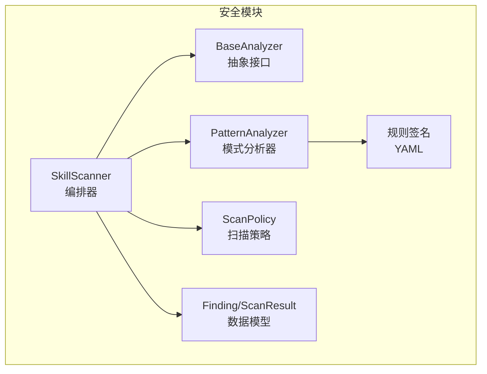
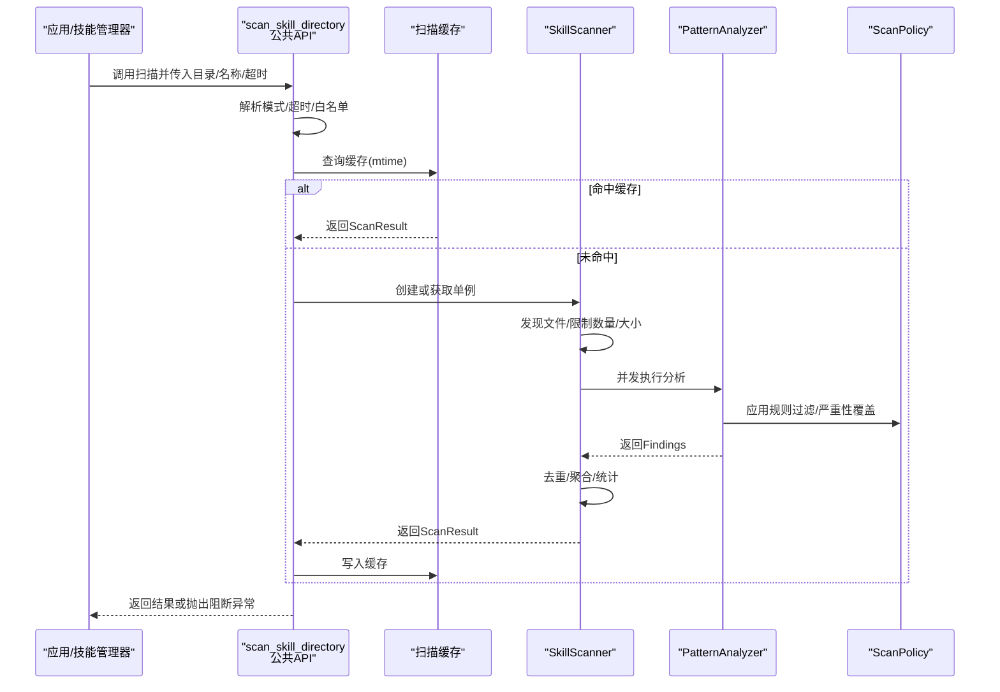
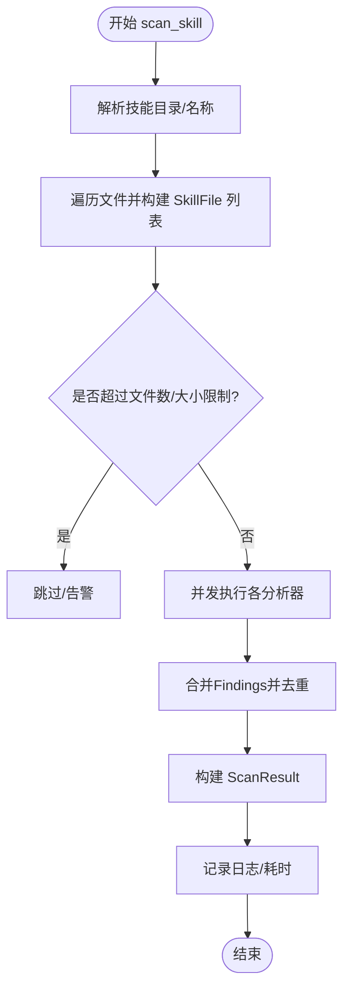
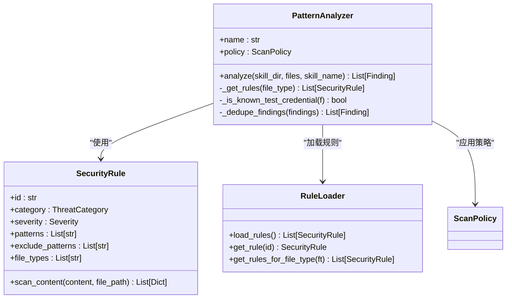
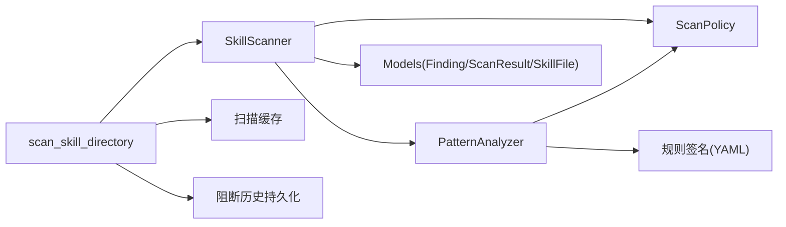

# 技能扫描器

<cite>
**本文引用的文件**
- [src/copaw/security/skill_scanner/__init__.py](file://src/copaw/security/skill_scanner/__init__.py)
- [src/copaw/security/skill_scanner/scanner.py](file://src/copaw/security/skill_scanner/scanner.py)
- [src/copaw/security/skill_scanner/models.py](file://src/copaw/security/skill_scanner/models.py)
- [src/copaw/security/skill_scanner/scan_policy.py](file://src/copaw/security/skill_scanner/scan_policy.py)
- [src/copaw/security/skill_scanner/analyzers/__init__.py](file://src/copaw/security/skill_scanner/analyzers/__init__.py)
- [src/copaw/security/skill_scanner/analyzers/pattern_analyzer.py](file://src/copaw/security/skill_scanner/analyzers/pattern_analyzer.py)
- [src/copaw/security/skill_scanner/data/default_policy.yaml](file://src/copaw/security/skill_scanner/data/default_policy.yaml)
- [src/copaw/security/skill_scanner/rules/signatures/command_injection.yaml](file://src/copaw/security/skill_scanner/rules/signatures/command_injection.yaml)
- [src/copaw/security/skill_scanner/rules/signatures/data_exfiltration.yaml](file://src/copaw/security/skill_scanner/rules/signatures/data_exfiltration.yaml)
- [src/copaw/security/skill_scanner/rules/signatures/hardcoded_secrets.yaml](file://src/copaw/security/skill_scanner/rules/signatures/hardcoded_secrets.yaml)
- [src/copaw/security/skill_scanner/rules/signatures/prompt_injection.yaml](file://src/copaw/security/skill_scanner/rules/signatures/prompt_injection.yaml)
- [console/src/pages/Settings/Security/useSkillScanner.ts](file://console/src/pages/Settings/Security/useSkillScanner.ts)
- [console/src/api/modules/security.ts](file://console/src/api/modules/security.ts)
- [src/copaw/agents/skills_manager.py](file://src/copaw/agents/skills_manager.py)
</cite>

## 目录
1. [简介](#简介)
2. [项目结构](#项目结构)
3. [核心组件](#核心组件)
4. [架构总览](#架构总览)
5. [详细组件分析](#详细组件分析)
6. [依赖分析](#依赖分析)
7. [性能考虑](#性能考虑)
8. [故障排查指南](#故障排查指南)
9. [结论](#结论)
10. [附录](#附录)

## 简介
本文件面向CoPaw技能扫描器（SkillScanner）提供系统化技术文档，覆盖整体架构、威胁检测算法、扫描策略配置与规则匹配机制。重点包括：
- 扫描器初始化流程与控制流
- 威胁分析引擎（当前为基于YAML正则的模式分析器）
- 规则匹配机制与签名库组织
- 扫描策略配置（策略文件、严重性覆盖、文件分类、阈值等）
- 实际威胁检测案例与误报处理
- 性能优化与扫描结果解读

## 项目结构
技能扫描器位于安全子模块中，采用“编排器 + 分析器插件 + 策略 + 规则签名”的分层设计：
- 编排器：负责文件发现、并发调用分析器、聚合结果、缓存与白名单判定
- 分析器：抽象接口 + 模式分析器（基于YAML正则签名）
- 策略：可定制的组织级扫描策略（合并内置默认策略）
- 规则：按威胁类别组织的YAML签名集合

图表来源
- [src/copaw/security/skill_scanner/scanner.py:76-319](file://src/copaw/security/skill_scanner/scanner.py#L76-L319)
- [src/copaw/security/skill_scanner/analyzers/__init__.py:21-90](file://src/copaw/security/skill_scanner/analyzers/__init__.py#L21-L90)
- [src/copaw/security/skill_scanner/analyzers/pattern_analyzer.py:236-393](file://src/copaw/security/skill_scanner/analyzers/pattern_analyzer.py#L236-L393)
- [src/copaw/security/skill_scanner/scan_policy.py:156-476](file://src/copaw/security/skill_scanner/scan_policy.py#L156-L476)
- [src/copaw/security/skill_scanner/models.py:16-235](file://src/copaw/security/skill_scanner/models.py#L16-L235)

章节来源
- [src/copaw/security/skill_scanner/__init__.py:1-76](file://src/copaw/security/skill_scanner/__init__.py#L1-L76)
- [src/copaw/security/skill_scanner/scanner.py:1-179](file://src/copaw/security/skill_scanner/scanner.py#L1-L179)

## 核心组件
- 编排器（SkillScanner）：负责扫描入口、文件发现、并发执行分析器、去重与聚合、日志记录与耗时统计
- 抽象分析器（BaseAnalyzer）：最小接口约束，便于扩展LLM/行为分析等新分析器
- 模式分析器（PatternAnalyzer）：加载YAML规则，逐行/多行正则匹配，生成Finding
- 扫描策略（ScanPolicy）：组织级策略，含隐藏文件、规则作用域、凭证抑制、文件分类、阈值、严重性覆盖、禁用规则等
- 数据模型（Finding/ScanResult/SkillFile/枚举）：统一的威胁发现、结果聚合与序列化

章节来源
- [src/copaw/security/skill_scanner/scanner.py:76-242](file://src/copaw/security/skill_scanner/scanner.py#L76-L242)
- [src/copaw/security/skill_scanner/analyzers/__init__.py:21-90](file://src/copaw/security/skill_scanner/analyzers/__init__.py#L21-L90)
- [src/copaw/security/skill_scanner/analyzers/pattern_analyzer.py:236-347](file://src/copaw/security/skill_scanner/analyzers/pattern_analyzer.py#L236-L347)
- [src/copaw/security/skill_scanner/scan_policy.py:156-476](file://src/copaw/security/skill_scanner/scan_policy.py#L156-L476)
- [src/copaw/security/skill_scanner/models.py:16-235](file://src/copaw/security/skill_scanner/models.py#L16-L235)

## 架构总览
下图展示从应用侧到扫描器内部的调用链路与关键对象交互。

图表来源
- [src/copaw/security/skill_scanner/__init__.py:415-505](file://src/copaw/security/skill_scanner/__init__.py#L415-L505)
- [src/copaw/security/skill_scanner/scanner.py:148-242](file://src/copaw/security/skill_scanner/scanner.py#L148-L242)
- [src/copaw/security/skill_scanner/analyzers/pattern_analyzer.py:265-347](file://src/copaw/security/skill_scanner/analyzers/pattern_analyzer.py#L265-L347)

## 详细组件分析

### 组件A：编排器（SkillScanner）
职责与流程要点：
- 文件发现：递归遍历技能包，排除符号链接、越界路径、跳过扩展名、大小与数量限制
- 并发执行：使用线程池并发调用已注册分析器
- 结果聚合：收集所有Findings，按策略去重，构造ScanResult
- 日志与统计：记录扫描耗时、是否安全、使用的分析器列表

图表来源
- [src/copaw/security/skill_scanner/scanner.py:148-242](file://src/copaw/security/skill_scanner/scanner.py#L148-L242)
- [src/copaw/security/skill_scanner/scanner.py:248-299](file://src/copaw/security/skill_scanner/scanner.py#L248-L299)

章节来源
- [src/copaw/security/skill_scanner/scanner.py:76-319](file://src/copaw/security/skill_scanner/scanner.py#L76-L319)

### 组件B：抽象分析器接口（BaseAnalyzer）
- 最小接口：analyze(skill_dir, files, skill_name) -> List[Finding]
- 提供策略访问与名称标识，便于在编排器中统一调度

章节来源
- [src/copaw/security/skill_scanner/analyzers/__init__.py:21-90](file://src/copaw/security/skill_scanner/analyzers/__init__.py#L21-L90)

### 组件C：模式分析器（PatternAnalyzer）
- 规则加载：从默认或自定义目录加载YAML规则，构建SecurityRule对象
- 匹配策略：
  - 行内匹配：快速扫描，支持排除正则
  - 多行匹配：对包含换行的模式进行全文匹配，并定位行号
- 策略集成：应用ScanPolicy的规则过滤、严重性覆盖、凭证抑制、去重
- 输出：生成Finding（含规则ID、类别、严重性、位置、修复建议）

图表来源
- [src/copaw/security/skill_scanner/analyzers/pattern_analyzer.py:236-393](file://src/copaw/security/skill_scanner/analyzers/pattern_analyzer.py#L236-L393)
- [src/copaw/security/skill_scanner/analyzers/pattern_analyzer.py:38-230](file://src/copaw/security/skill_scanner/analyzers/pattern_analyzer.py#L38-L230)

章节来源
- [src/copaw/security/skill_scanner/analyzers/pattern_analyzer.py:236-393](file://src/copaw/security/skill_scanner/analyzers/pattern_analyzer.py#L236-L393)

### 组件D：扫描策略（ScanPolicy）
- 结构化策略：隐藏文件、规则作用域、凭证抑制、文件分类、文件限制、分析阈值、严重性覆盖、禁用规则
- 合并机制：用户策略与内置默认策略深度合并，仅覆盖指定字段
- 运行期辅助：文档路径判断、规则过滤、严重性覆盖查询

章节来源
- [src/copaw/security/skill_scanner/scan_policy.py:156-476](file://src/copaw/security/skill_scanner/scan_policy.py#L156-L476)
- [src/copaw/security/skill_scanner/data/default_policy.yaml:1-245](file://src/copaw/security/skill_scanner/data/default_policy.yaml#L1-L245)

### 组件E：数据模型（Finding/ScanResult/SkillFile/枚举）
- 枚举：Severity（CRITICAL/HIGH/MEDIUM/LOW/INFO/SAFE）、ThreatCategory（涵盖命令注入、数据外泄、硬编码密钥、提示词注入等）
- 数据模型：SkillFile（路径、相对路径、类型、大小）、Finding（规则ID、类别、严重性、标题、描述、文件路径、行号、片段、修复建议、元数据）、ScanResult（聚合Findings、是否安全、最大严重性、时间戳等）

章节来源
- [src/copaw/security/skill_scanner/models.py:16-235](file://src/copaw/security/skill_scanner/models.py#L16-L235)

### 组件F：公共API与阻断逻辑（scan_skill_directory）
- 配置优先级：环境变量 > 应用配置 > 默认
- 白名单：支持内容哈希校验，避免重复扫描
- 缓存：基于目录与文件最新修改时间的轻量缓存（LRU上限）
- 阻断：当结果不安全且模式为block时抛出SkillScanError；否则记录警告历史

章节来源
- [src/copaw/security/skill_scanner/__init__.py:85-505](file://src/copaw/security/skill_scanner/__init__.py#L85-L505)

## 依赖分析
- 编排器依赖：BaseAnalyzer接口、PatternAnalyzer、ScanPolicy、SkillFile/Finding/ScanResult
- 模式分析器依赖：RuleLoader、SecurityRule、ScanPolicy
- 公共API依赖：配置加载、白名单、阻断历史持久化、缓存

图表来源
- [src/copaw/security/skill_scanner/scanner.py:76-134](file://src/copaw/security/skill_scanner/scanner.py#L76-L134)
- [src/copaw/security/skill_scanner/analyzers/pattern_analyzer.py:236-260](file://src/copaw/security/skill_scanner/analyzers/pattern_analyzer.py#L236-L260)
- [src/copaw/security/skill_scanner/__init__.py:347-505](file://src/copaw/security/skill_scanner/__init__.py#L347-L505)

章节来源
- [src/copaw/security/skill_scanner/scanner.py:76-134](file://src/copaw/security/skill_scanner/scanner.py#L76-L134)
- [src/copaw/security/skill_scanner/analyzers/pattern_analyzer.py:236-260](file://src/copaw/security/skill_scanner/analyzers/pattern_analyzer.py#L236-L260)
- [src/copaw/security/skill_scanner/__init__.py:347-505](file://src/copaw/security/skill_scanner/__init__.py#L347-L505)

## 性能考虑
- 并发执行：编排器使用线程池并发调用分析器，提升吞吐
- 快速匹配：模式分析器先做行内匹配，再对跨行模式做全文匹配，兼顾速度与覆盖
- 早停与限流：文件发现阶段严格限制数量与大小，避免大体积技能包拖慢扫描
- 缓存：基于mtime的轻量缓存，减少重复扫描开销
- 正则安全：内置长度限制与非法正则告警，防止资源滥用

章节来源
- [src/copaw/security/skill_scanner/scanner.py:116-127](file://src/copaw/security/skill_scanner/scanner.py#L116-L127)
- [src/copaw/security/skill_scanner/scan_policy.py:36-67](file://src/copaw/security/skill_scanner/scan_policy.py#L36-L67)
- [src/copaw/security/skill_scanner/__init__.py:347-380](file://src/copaw/security/skill_scanner/__init__.py#L347-L380)

## 故障排查指南
常见问题与处理建议：
- 扫描被阻断（阻断模式）
  - 现象：抛出SkillScanError，包含最高严重性与前N条发现摘要
  - 排查：检查ScanResult.findings，定位规则ID与文件行号；必要时调整策略或修复代码
- 超时
  - 现象：返回None并记录超时日志
  - 排查：增大timeout或优化规则/策略，减少扫描范围
- 白名单误判
  - 现象：技能被跳过扫描
  - 排查：确认白名单条目与技能名称/内容哈希一致
- 历史记录
  - 功能：记录被阻断/警告的技能，支持清理与删除特定条目
  - 排查：通过UI或API查看历史，核对content_hash与技能目录一致性

章节来源
- [src/copaw/security/skill_scanner/__init__.py:393-505](file://src/copaw/security/skill_scanner/__init__.py#L393-L505)
- [console/src/pages/Settings/Security/useSkillScanner.ts:1-128](file://console/src/pages/Settings/Security/useSkillScanner.ts#L1-L128)
- [console/src/api/modules/security.ts:69-148](file://console/src/api/modules/security.ts#L69-L148)

## 结论
CoPaw技能扫描器以“轻量、可扩展、策略驱动”为核心设计，当前以YAML正则签名为基础，结合策略化规则作用域、严重性覆盖与凭证抑制，形成可定制的静态威胁检测能力。通过编排器的并发与缓存机制，兼顾性能与可维护性。未来可按需扩展行为/LLM分析器，保持与现有编排器的解耦。

## 附录

### 扫描策略配置示例与最佳实践
- 加载内置默认策略并叠加组织策略
  - 使用内置默认策略作为基线，仅覆盖差异项
- 关键策略项说明
  - hidden_files：声明“良性”的点文件/点目录
  - rule_scoping：限定规则适用范围（如仅脚本/仅代码），并启用去重
  - credentials：声明测试值与占位符，自动抑制误报
  - file_classification：将扩展名归类为“惰性/结构化/归档/代码”，影响扫描范围
  - file_limits：限制文件数量、单文件大小、名称/描述长度等
  - analysis_thresholds：最小置信度、最大正则长度
  - severity_overrides：按规则ID覆盖严重性
  - disabled_rules：禁用特定规则
- 示例参考
  - 内置默认策略：[default_policy.yaml:1-245](file://src/copaw/security/skill_scanner/data/default_policy.yaml#L1-L245)
  - 规则签名示例（命令注入/数据外泄/硬编码密钥/提示词注入）：
    - [command_injection.yaml:1-195](file://src/copaw/security/skill_scanner/rules/signatures/command_injection.yaml#L1-L195)
    - [data_exfiltration.yaml:1-142](file://src/copaw/security/skill_scanner/rules/signatures/data_exfiltration.yaml#L1-L142)
    - [hardcoded_secrets.yaml:1-150](file://src/copaw/security/skill_scanner/rules/signatures/hardcoded_secrets.yaml#L1-L150)
    - [prompt_injection.yaml:1-59](file://src/copaw/security/skill_scanner/rules/signatures/prompt_injection.yaml#L1-L59)

章节来源
- [src/copaw/security/skill_scanner/scan_policy.py:236-476](file://src/copaw/security/skill_scanner/scan_policy.py#L236-L476)
- [src/copaw/security/skill_scanner/data/default_policy.yaml:1-245](file://src/copaw/security/skill_scanner/data/default_policy.yaml#L1-L245)
- [src/copaw/security/skill_scanner/rules/signatures/command_injection.yaml:1-195](file://src/copaw/security/skill_scanner/rules/signatures/command_injection.yaml#L1-L195)
- [src/copaw/security/skill_scanner/rules/signatures/data_exfiltration.yaml:1-142](file://src/copaw/security/skill_scanner/rules/signatures/data_exfiltration.yaml#L1-L142)
- [src/copaw/security/skill_scanner/rules/signatures/hardcoded_secrets.yaml:1-150](file://src/copaw/security/skill_scanner/rules/signatures/hardcoded_secrets.yaml#L1-L150)
- [src/copaw/security/skill_scanner/rules/signatures/prompt_injection.yaml:1-59](file://src/copaw/security/skill_scanner/rules/signatures/prompt_injection.yaml#L1-L59)

### 扫描初始化与集成点
- 应用侧调用
  - 在技能创建/激活流程中调用scan_skill_directory，依据返回结果决定继续或阻断
- UI与配置
  - 通过前端useSkillScanner与security API管理扫描模式、超时、白名单与阻断历史

章节来源
- [src/copaw/agents/skills_manager.py:863-875](file://src/copaw/agents/skills_manager.py#L863-L875)
- [console/src/pages/Settings/Security/useSkillScanner.ts:1-128](file://console/src/pages/Settings/Security/useSkillScanner.ts#L1-L128)
- [console/src/api/modules/security.ts:103-148](file://console/src/api/modules/security.ts#L103-L148)