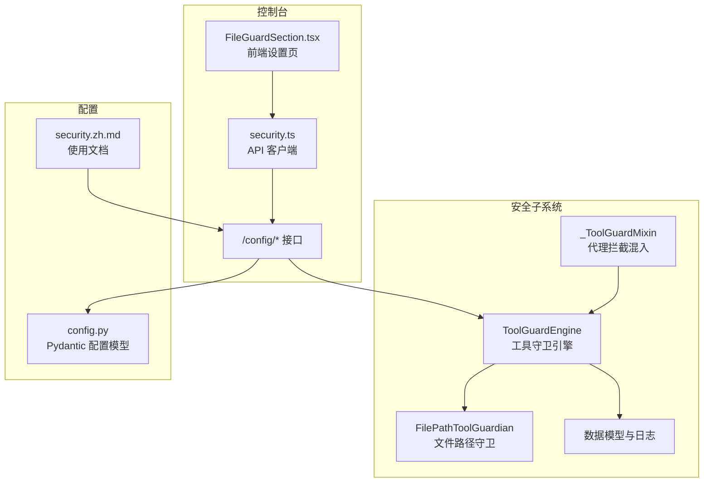
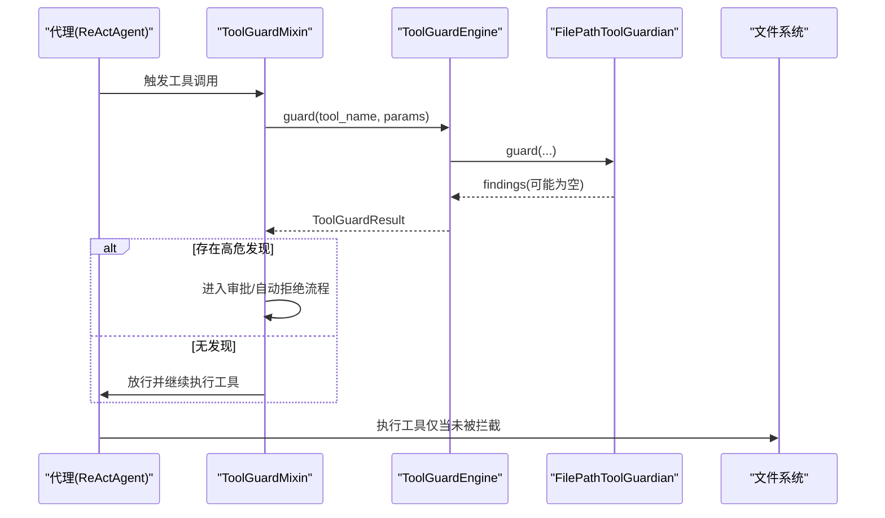
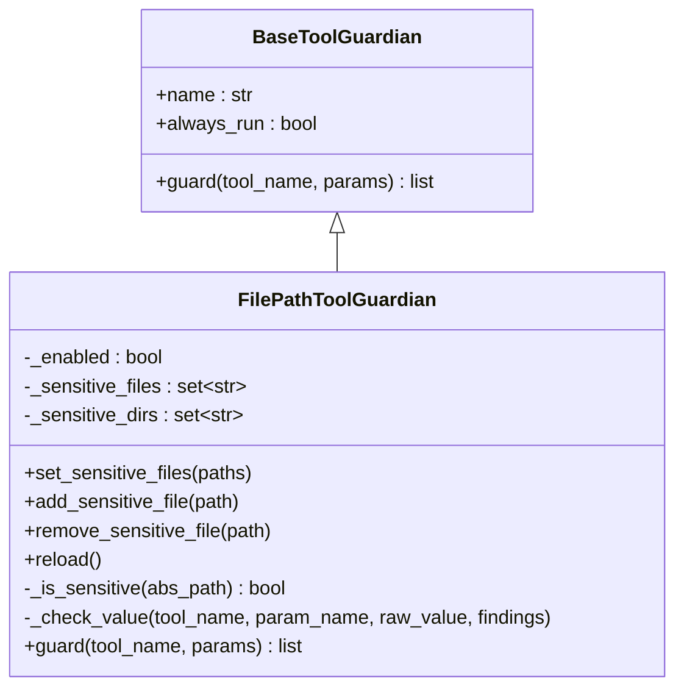
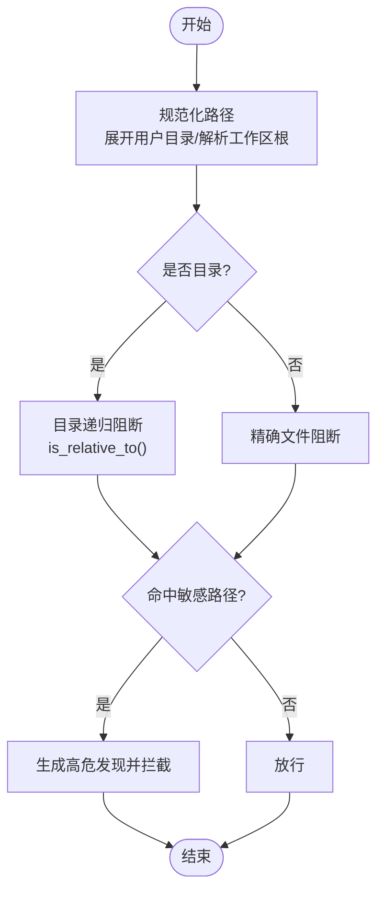
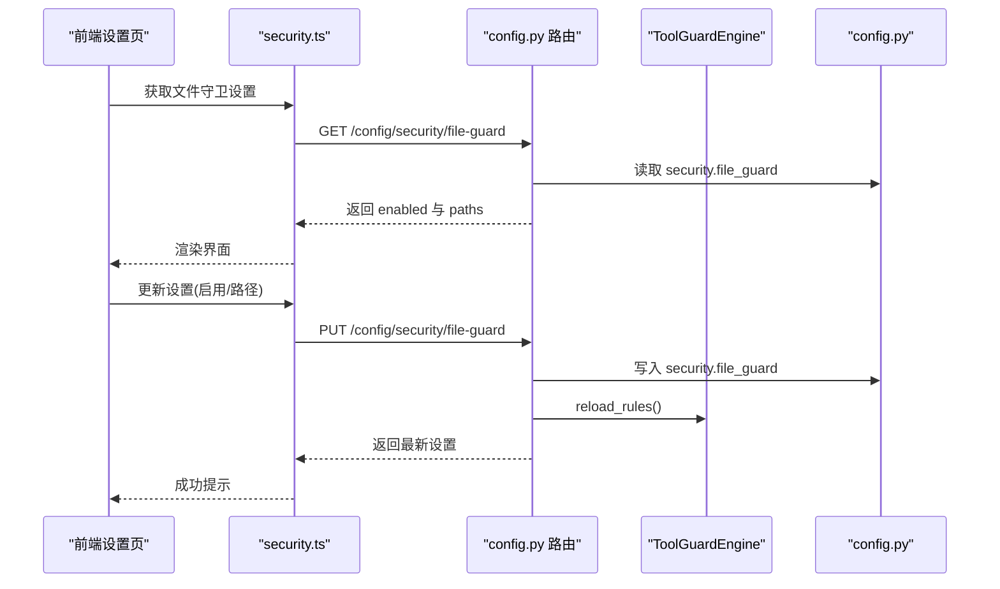
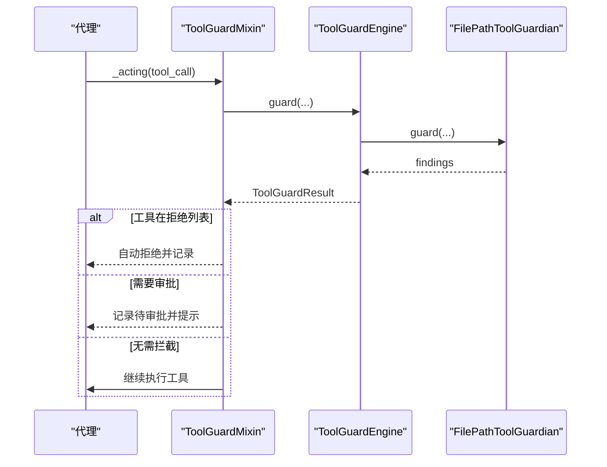
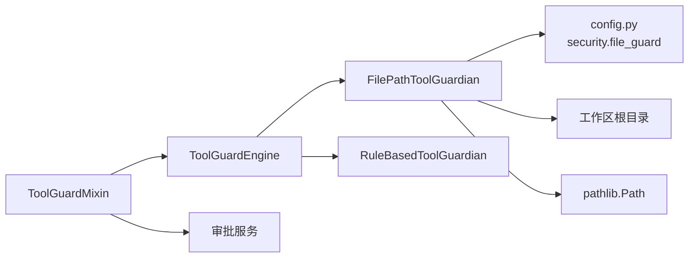

# 文件路径守卫

<cite>
**本文引用的文件**
- [src/copaw/security/tool_guard/guardians/file_guardian.py](file://src/copaw/security/tool_guard/guardians/file_guardian.py)
- [src/copaw/agents/tool_guard_mixin.py](file://src/copaw/agents/tool_guard_mixin.py)
- [src/copaw/security/tool_guard/engine.py](file://src/copaw/security/tool_guard/engine.py)
- [src/copaw/security/tool_guard/models.py](file://src/copaw/security/tool_guard/models.py)
- [src/copaw/security/tool_guard/utils.py](file://src/copaw/security/tool_guard/utils.py)
- [src/copaw/security/tool_guard/guardians/__init__.py](file://src/copaw/security/tool_guard/guardians/__init__.py)
- [src/copaw/app/routers/config.py](file://src/copaw/app/routers/config.py)
- [console/src/pages/Settings/Security/components/FileGuardSection.tsx](file://console/src/pages/Settings/Security/components/FileGuardSection.tsx)
- [console/src/api/modules/security.ts](file://console/src/api/modules/security.ts)
- [website/public/docs/security.zh.md](file://website/public/docs/security.zh.md)
- [src/copaw/config/config.py](file://src/copaw/config/config.py)
</cite>

## 目录
1. [简介](#简介)
2. [项目结构](#项目结构)
3. [核心组件](#核心组件)
4. [架构总览](#架构总览)
5. [详细组件分析](#详细组件分析)
6. [依赖关系分析](#依赖关系分析)
7. [性能考量](#性能考量)
8. [故障排查指南](#故障排查指南)
9. [结论](#结论)
10. [附录](#附录)

## 简介
本文件路径守卫（FilePathToolGuardian）是 CoPaw 安全体系中的关键组件，用于在工具调用前对文件路径进行严格校验与拦截，防止对敏感文件与目录的访问。其核心能力包括：
- 路径规范化与解析：统一相对路径、用户目录展开、工作区根目录定位。
- 危险路径检测：基于配置的敏感文件/目录白名单与黑名单策略。
- Shell 命令路径提取：从命令行参数中提取并校验重定向与路径参数。
- 统一拦截与审批流程：与工具守卫引擎协同，支持自动拒绝、预审批与人工审批。

## 项目结构
围绕文件路径守卫的相关模块分布如下：
- 守护者基类与具体实现：guardians/__init__.py、guardians/file_guardian.py
- 工具守卫引擎：security/tool_guard/engine.py
- 数据模型与日志：security/tool_guard/models.py、security/tool_guard/utils.py
- 控制台接口与前端：app/routers/config.py、console/src/pages/Settings/Security/components/FileGuardSection.tsx、console/src/api/modules/security.ts
- 文档与配置：website/public/docs/security.zh.md、src/copaw/config/config.py

**图表来源**
- [src/copaw/security/tool_guard/engine.py:53-238](file://src/copaw/security/tool_guard/engine.py#L53-L238)
- [src/copaw/security/tool_guard/guardians/file_guardian.py:161-342](file://src/copaw/security/tool_guard/guardians/file_guardian.py#L161-L342)
- [src/copaw/agents/tool_guard_mixin.py:45-782](file://src/copaw/agents/tool_guard_mixin.py#L45-L782)
- [src/copaw/app/routers/config.py:443-503](file://src/copaw/app/routers/config.py#L443-L503)
- [console/src/pages/Settings/Security/components/FileGuardSection.tsx:1-91](file://console/src/pages/Settings/Security/components/FileGuardSection.tsx#L1-L91)
- [console/src/api/modules/security.ts:77-99](file://console/src/api/modules/security.ts#L77-L99)
- [src/copaw/config/config.py:889-1196](file://src/copaw/config/config.py#L889-L1196)
- [website/public/docs/security.zh.md:55-89](file://website/public/docs/security.zh.md#L55-L89)

**章节来源**
- [src/copaw/security/tool_guard/engine.py:53-238](file://src/copaw/security/tool_guard/engine.py#L53-L238)
- [src/copaw/security/tool_guard/guardians/file_guardian.py:161-342](file://src/copaw/security/tool_guard/guardians/file_guardian.py#L161-L342)
- [src/copaw/agents/tool_guard_mixin.py:45-782](file://src/copaw/agents/tool_guard_mixin.py#L45-L782)
- [src/copaw/app/routers/config.py:443-503](file://src/copaw/app/routers/config.py#L443-L503)
- [console/src/pages/Settings/Security/components/FileGuardSection.tsx:1-91](file://console/src/pages/Settings/Security/components/FileGuardSection.tsx#L1-L91)
- [console/src/api/modules/security.ts:77-99](file://console/src/api/modules/security.ts#L77-L99)
- [website/public/docs/security.zh.md:55-89](file://website/public/docs/security.zh.md#L55-L89)
- [src/copaw/config/config.py:889-1196](file://src/copaw/config/config.py#L889-L1196)

## 核心组件
- FilePathToolGuardian：负责敏感文件/目录的判定、路径规范化、Shell 命令路径提取与拦截。
- ToolGuardEngine：编排所有守护者，聚合结果并输出 ToolGuardResult。
- ToolGuardMixin：在代理执行工具调用前进行拦截、审批与回放。
- 数据模型与工具：GuardFinding、ToolGuardResult、日志与配置解析工具。

**章节来源**
- [src/copaw/security/tool_guard/guardians/file_guardian.py:161-342](file://src/copaw/security/tool_guard/guardians/file_guardian.py#L161-L342)
- [src/copaw/security/tool_guard/engine.py:53-238](file://src/copaw/security/tool_guard/engine.py#L53-L238)
- [src/copaw/agents/tool_guard_mixin.py:45-782](file://src/copaw/agents/tool_guard_mixin.py#L45-L782)
- [src/copaw/security/tool_guard/models.py:60-185](file://src/copaw/security/tool_guard/models.py#L60-L185)
- [src/copaw/security/tool_guard/utils.py:18-163](file://src/copaw/security/tool_guard/utils.py#L18-L163)

## 架构总览
文件路径守卫在工具调用生命周期中的位置如下：

**图表来源**
- [src/copaw/agents/tool_guard_mixin.py:251-382](file://src/copaw/agents/tool_guard_mixin.py#L251-L382)
- [src/copaw/security/tool_guard/engine.py:169-226](file://src/copaw/security/tool_guard/engine.py#L169-L226)
- [src/copaw/security/tool_guard/guardians/file_guardian.py:290-342](file://src/copaw/security/tool_guard/guardians/file_guardian.py#L290-L342)

## 详细组件分析

### FilePathToolGuardian 实现原理
- 敏感路径集合维护：支持文件与目录两类条目，目录以“/”结尾或为目录对象时按目录模式处理，递归阻断其下所有文件。
- 路径规范化：统一使用绝对路径，支持用户目录展开与工作区根目录定位；相对路径在当前工作区解析。
- Shell 命令路径提取：使用安全分词器解析命令，识别分离式与附着式重定向操作符，稳定去重候选路径。
- 拦截策略：对已知文件工具直接检查对应参数；对 Shell 命令提取路径后逐一校验；对其他工具扫描所有疑似路径的字符串参数。
- 发现记录：生成 GuardFinding，标记威胁类别为敏感文件访问，严重级别为高。

**图表来源**
- [src/copaw/security/tool_guard/guardians/__init__.py:17-62](file://src/copaw/security/tool_guard/guardians/__init__.py#L17-L62)
- [src/copaw/security/tool_guard/guardians/file_guardian.py:161-342](file://src/copaw/security/tool_guard/guardians/file_guardian.py#L161-L342)

**章节来源**
- [src/copaw/security/tool_guard/guardians/file_guardian.py:46-158](file://src/copaw/security/tool_guard/guardians/file_guardian.py#L46-L158)
- [src/copaw/security/tool_guard/guardians/file_guardian.py:161-342](file://src/copaw/security/tool_guard/guardians/file_guardian.py#L161-L342)

### 文件访问权限检查与路径遍历防护
- 目录递归阻断：以“/”结尾的路径或目录对象被视作目录守卫，使用路径相对性判断实现递归阻断。
- 相对路径解析：在当前工作区根目录下解析相对路径，避免越权访问。
- Shell 重定向识别：支持多种重定向操作符，分别处理分离式与附着式写法，确保覆盖典型命令场景。

**图表来源**
- [src/copaw/security/tool_guard/guardians/file_guardian.py:46-51](file://src/copaw/security/tool_guard/guardians/file_guardian.py#L46-L51)
- [src/copaw/security/tool_guard/guardians/file_guardian.py:192-198](file://src/copaw/security/tool_guard/guardians/file_guardian.py#L192-L198)
- [src/copaw/security/tool_guard/guardians/file_guardian.py:226-234](file://src/copaw/security/tool_guard/guardians/file_guardian.py#L226-L234)

**章节来源**
- [src/copaw/security/tool_guard/guardians/file_guardian.py:192-234](file://src/copaw/security/tool_guard/guardians/file_guardian.py#L192-L234)

### 配置与策略管理
- 配置项：
  - enabled：启用/禁用文件路径守卫。
  - sensitive_files：敏感文件/目录列表；空列表时默认保护密钥目录。
- 控制台接口：
  - GET /config/security/file-guard：获取当前启用状态与敏感路径列表。
  - PUT /config/security/file-guard：更新启用状态与敏感路径列表，并触发规则重载。
- 前端设置页：提供开关、新增、删除与保存操作，实时同步至后端配置。

**图表来源**
- [src/copaw/app/routers/config.py:456-500](file://src/copaw/app/routers/config.py#L456-L500)
- [console/src/pages/Settings/Security/components/FileGuardSection.tsx:31-91](file://console/src/pages/Settings/Security/components/FileGuardSection.tsx#L31-L91)
- [console/src/api/modules/security.ts:93-99](file://console/src/api/modules/security.ts#L93-L99)
- [src/copaw/security/tool_guard/engine.py:148-153](file://src/copaw/security/tool_guard/engine.py#L148-L153)

**章节来源**
- [src/copaw/app/routers/config.py:456-500](file://src/copaw/app/routers/config.py#L456-L500)
- [console/src/pages/Settings/Security/components/FileGuardSection.tsx:1-91](file://console/src/pages/Settings/Security/components/FileGuardSection.tsx#L1-L91)
- [console/src/api/modules/security.ts:77-99](file://console/src/api/modules/security.ts#L77-L99)
- [website/public/docs/security.zh.md:69-89](file://website/public/docs/security.zh.md#L69-L89)

### 审批与拦截流程
- 自动拒绝：若工具在“拒绝列表”，直接生成高危发现并阻断。
- 预审批：若工具在“受保护范围”，且存在预审批令牌，则跳过拦截。
- 人工审批：若存在高危发现且需要审批，将阻断工具调用并记录待审批信息，等待用户确认。
- 回放队列：在强制回放期间，清理审批过程中的中间消息，保持对话历史整洁。

**图表来源**
- [src/copaw/agents/tool_guard_mixin.py:302-356](file://src/copaw/agents/tool_guard_mixin.py#L302-L356)
- [src/copaw/security/tool_guard/engine.py:169-226](file://src/copaw/security/tool_guard/engine.py#L169-L226)

**章节来源**
- [src/copaw/agents/tool_guard_mixin.py:251-587](file://src/copaw/agents/tool_guard_mixin.py#L251-L587)

### 安全案例分析
- 案例1：尝试读取系统敏感文件
  - 触发点：工具参数包含系统敏感文件路径。
  - 处理：FilePathToolGuardian 直接命中敏感文件集，生成高危发现并拦截。
- 案例2：Shell 命令重定向写入敏感目录
  - 触发点：命令字符串包含重定向操作符与敏感路径。
  - 处理：提取候选路径并进行规范化与递归阻断判断，命中后拦截。
- 案例3：相对路径逃逸
  - 触发点：相对路径经工作区根解析后落入敏感目录。
  - 处理：规范化为绝对路径后仍命中目录守卫，拦截生效。

**章节来源**
- [src/copaw/security/tool_guard/guardians/file_guardian.py:111-158](file://src/copaw/security/tool_guard/guardians/file_guardian.py#L111-L158)
- [src/copaw/security/tool_guard/guardians/file_guardian.py:226-234](file://src/copaw/security/tool_guard/guardians/file_guardian.py#L226-L234)

## 依赖关系分析
- FilePathToolGuardian 依赖：
  - 配置加载：从 config.json 读取 security.file_guard.enabled 与 sensitive_files。
  - 工作区根：通过上下文获取当前工作区目录，用于相对路径解析。
  - 路径库：使用 pathlib 进行路径规范化与相对性判断。
- ToolGuardEngine 依赖：
  - 默认守护者：初始化 FilePathToolGuardian 与 RuleBasedToolGuardian。
  - 规则重载：支持运行时重新加载敏感路径与受保护工具集。
- ToolGuardMixin 依赖：
  - 引擎与审批服务：在拦截后进入审批流程或自动拒绝。
  - 会话上下文：根据会话 ID 决定是否需要审批。

**图表来源**
- [src/copaw/security/tool_guard/guardians/file_guardian.py:41-80](file://src/copaw/security/tool_guard/guardians/file_guardian.py#L41-L80)
- [src/copaw/security/tool_guard/engine.py:84-102](file://src/copaw/security/tool_guard/engine.py#L84-L102)
- [src/copaw/agents/tool_guard_mixin.py:57-65](file://src/copaw/agents/tool_guard_mixin.py#L57-L65)

**章节来源**
- [src/copaw/security/tool_guard/guardians/file_guardian.py:41-80](file://src/copaw/security/tool_guard/guardians/file_guardian.py#L41-L80)
- [src/copaw/security/tool_guard/engine.py:84-102](file://src/copaw/security/tool_guard/engine.py#L84-L102)
- [src/copaw/agents/tool_guard_mixin.py:57-65](file://src/copaw/agents/tool_guard_mixin.py#L57-L65)

## 性能考量
- 路径规范化与相对性判断：使用绝对路径与 is_relative_to，复杂度与路径层级线性相关。
- Shell 命令解析：采用分词器与最长前缀匹配重定向操作符，避免误判与重复提取。
- 去重策略：候选路径稳定去重，降低重复计算与重复告警。
- 异常容错：守护者执行异常不影响整体流程，记录失败并继续后续守护者。

**章节来源**
- [src/copaw/security/tool_guard/guardians/file_guardian.py:111-158](file://src/copaw/security/tool_guard/guardians/file_guardian.py#L111-L158)
- [src/copaw/security/tool_guard/engine.py:214-223](file://src/copaw/security/tool_guard/engine.py#L214-L223)

## 故障排查指南
- 高危发现日志：工具守卫会输出结构化日志，包含严重性、工具名、参数名、规则 ID、描述与匹配值，便于快速定位。
- 审计与清理：被拦截的消息会打上标记，可在多模块间清理，避免历史污染。
- 配置校验：若敏感路径不生效，检查 config.json 的 security.file_guard.enabled 与 sensitive_files 是否正确，或通过控制台接口确认当前生效值。

**章节来源**
- [src/copaw/security/tool_guard/utils.py:128-163](file://src/copaw/security/tool_guard/utils.py#L128-L163)
- [src/copaw/agents/tool_guard_mixin.py:212-246](file://src/copaw/agents/tool_guard_mixin.py#L212-L246)
- [src/copaw/app/routers/config.py:456-500](file://src/copaw/app/routers/config.py#L456-L500)

## 结论
文件路径守卫通过严格的路径规范化、目录递归阻断与 Shell 命令路径提取，构建了面向敏感文件与目录的强约束防线。配合工具守卫引擎与审批流程，实现了自动化与可审计的工具调用安全管控。建议结合业务场景合理配置敏感路径列表，并定期审查与更新，以持续提升系统安全性。

## 附录

### 配置示例与字段说明
- 配置位置：config.json 中的 security.file_guard
- 字段说明：
  - enabled：启用/禁用文件路径守卫（默认：true）。
  - sensitive_files：敏感文件/目录路径列表；以“/”结尾的路径视为目录守卫，递归阻断其下所有文件与子目录。
- 默认行为：当 sensitive_files 为空时，默认保护密钥目录。

**章节来源**
- [website/public/docs/security.zh.md:69-89](file://website/public/docs/security.zh.md#L69-L89)
- [src/copaw/security/tool_guard/guardians/file_guardian.py:64-79](file://src/copaw/security/tool_guard/guardians/file_guardian.py#L64-L79)