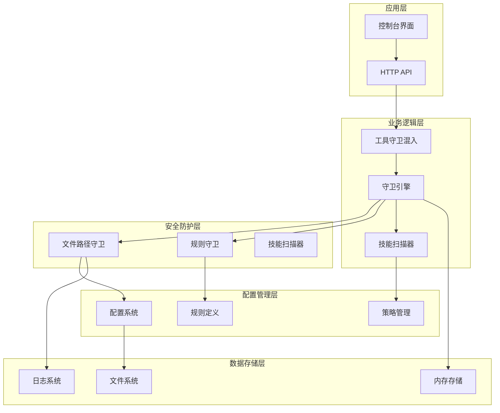
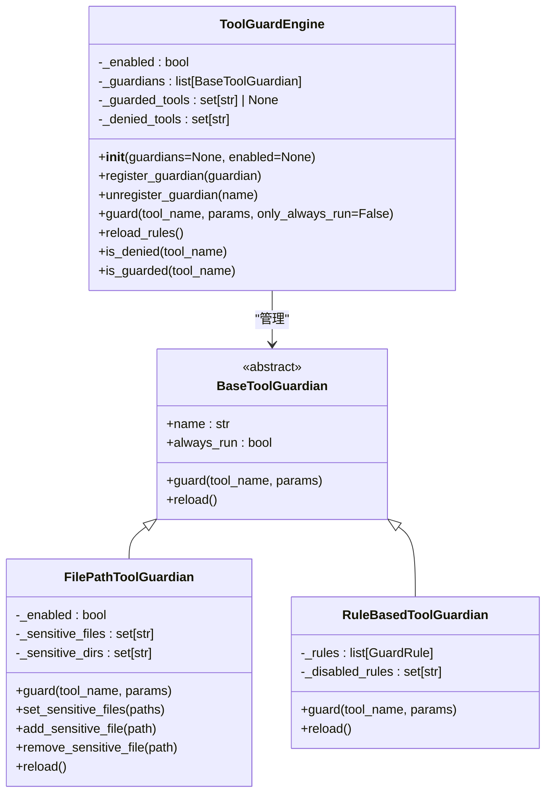
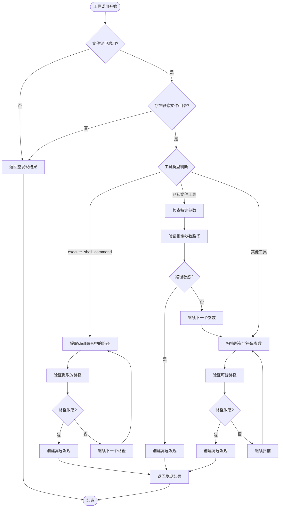
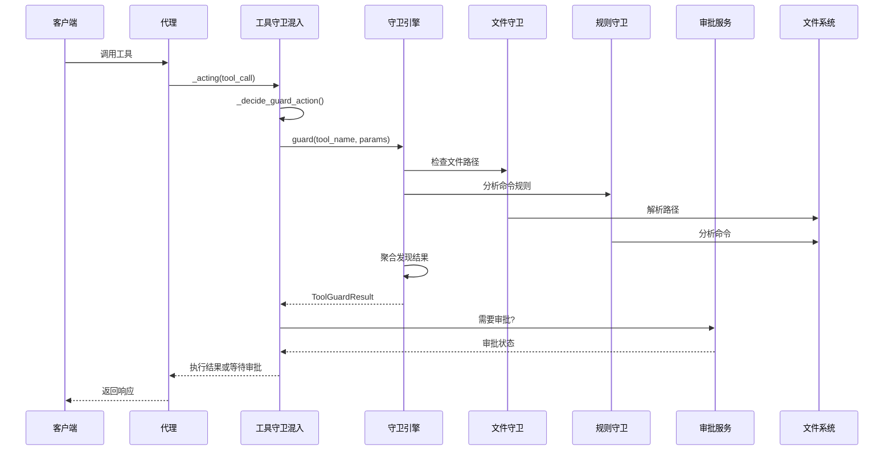
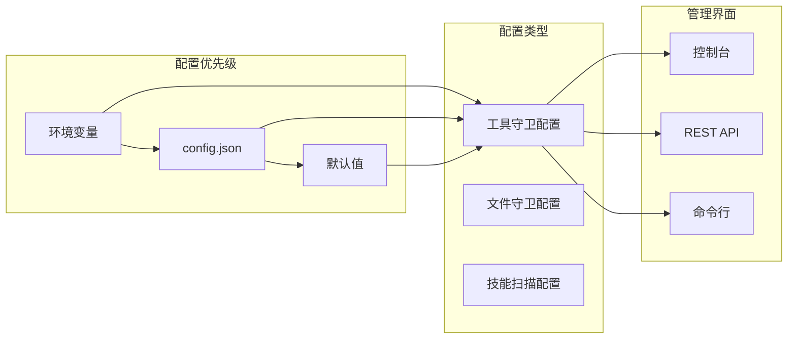
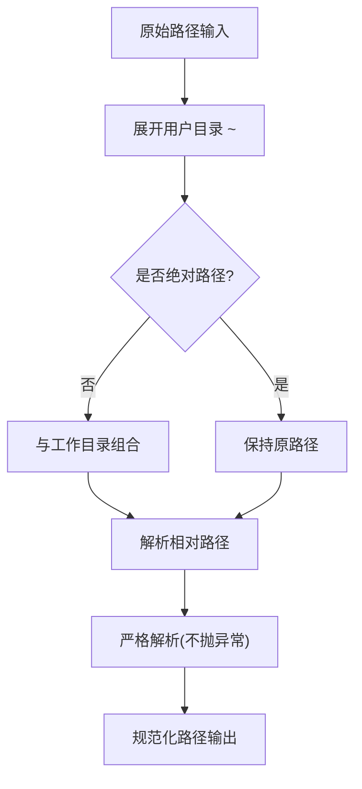
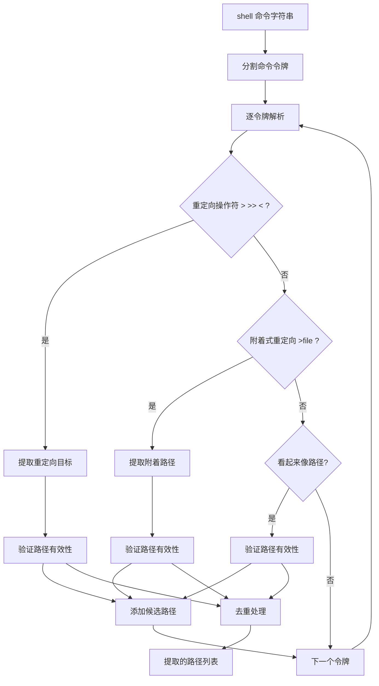
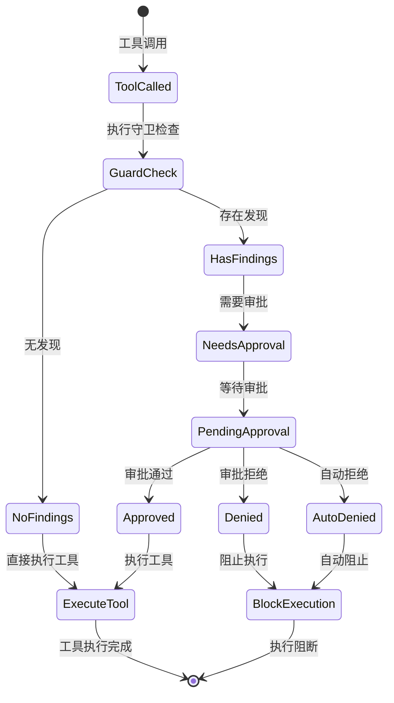
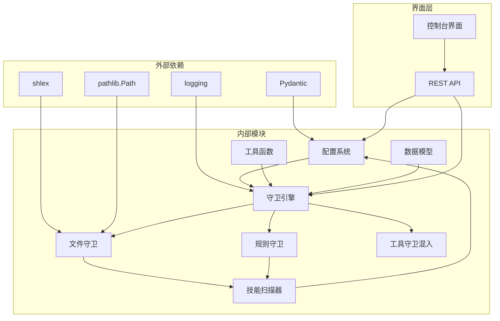

# 文件路径守卫增强

<cite>
**本文档引用的文件**
- [src/copaw/security/tool_guard/engine.py](file://src/copaw/security/tool_guard/engine.py)
- [src/copaw/security/tool_guard/guardians/file_guardian.py](file://src/copaw/security/tool_guard/guardians/file_guardian.py)
- [src/copaw/security/tool_guard/models.py](file://src/copaw/security/tool_guard/models.py)
- [src/copaw/security/tool_guard/utils.py](file://src/copaw/security/tool_guard/utils.py)
- [src/copaw/security/tool_guard/rules/dangerous_shell_commands.yaml](file://src/copaw/security/tool_guard/rules/dangerous_shell_commands.yaml)
- [src/copaw/security/skill_scanner/scanner.py](file://src/copaw/security/skill_scanner/scanner.py)
- [src/copaw/security/skill_scanner/data/default_policy.yaml](file://src/copaw/security/skill_scanner/data/default_policy.yaml)
- [src/copaw/agents/tool_guard_mixin.py](file://src/copaw/agents/tool_guard_mixin.py)
- [src/copaw/app/routers/config.py](file://src/copaw/app/routers/config.py)
- [console/src/pages/Settings/Security/components/FileGuardSection.tsx](file://console/src/pages/Settings/Security/components/FileGuardSection.tsx)
- [console/src/pages/Settings/Security/useToolGuard.ts](file://console/src/pages/Settings/Security/useToolGuard.ts)
- [website/public/docs/security.zh.md](file://website/public/docs/security.zh.md)
- [website/public/docs/security.en.md](file://website/public/docs/security.en.md)
</cite>

## 目录
1. [简介](#简介)
2. [项目结构](#项目结构)
3. [核心组件](#核心组件)
4. [架构概览](#架构概览)
5. [详细组件分析](#详细组件分析)
6. [依赖关系分析](#依赖关系分析)
7. [性能考虑](#性能考虑)
8. [故障排除指南](#故障排除指南)
9. [结论](#结论)

## 简介

文件路径守卫增强是 CoPaw 安全系统的重要组成部分，旨在防止代理工具对敏感文件和目录的未授权访问。该系统通过多层防护机制，包括文件路径验证、shell 命令解析、威胁检测和实时监控，为整个平台提供全面的文件安全保护。

该增强功能的核心价值在于：
- **实时路径验证**：在工具调用时即时检查文件路径安全性
- **智能路径解析**：自动识别和提取 shell 命令中的文件路径
- **多维度威胁检测**：结合静态路径检查和动态命令分析
- **可配置的防护策略**：支持灵活的白名单/黑名单配置
- **用户友好的管理界面**：提供直观的控制台管理功能

## 项目结构

CoPaw 的安全架构采用分层设计，主要分为以下几个层次：

**图表来源**
- [src/copaw/agents/tool_guard_mixin.py:45-70](file://src/copaw/agents/tool_guard_mixin.py#L45-L70)
- [src/copaw/security/tool_guard/engine.py:53-80](file://src/copaw/security/tool_guard/engine.py#L53-L80)

**章节来源**
- [src/copaw/agents/tool_guard_mixin.py:1-200](file://src/copaw/agents/tool_guard_mixin.py#L1-L200)
- [src/copaw/security/tool_guard/engine.py:1-100](file://src/copaw/security/tool_guard/engine.py#L1-L100)

## 核心组件

### 工具守卫引擎 (ToolGuardEngine)

工具守卫引擎是整个安全系统的核心协调器，负责管理多个守卫守护程序并聚合它们的发现结果。

**图表来源**
- [src/copaw/security/tool_guard/engine.py:53-103](file://src/copaw/security/tool_guard/engine.py#L53-L103)
- [src/copaw/security/tool_guard/guardians/file_guardian.py:161-177](file://src/copaw/security/tool_guard/guardians/file_guardian.py#L161-L177)

### 文件路径守卫 (FilePathToolGuardian)

文件路径守卫专门负责检查文件路径参数，防止对敏感文件和目录的访问。

**图表来源**
- [src/copaw/security/tool_guard/guardians/file_guardian.py:290-341](file://src/copaw/security/tool_guard/guardians/file_guardian.py#L290-L341)

### 数据模型 (GuardFinding 和 ToolGuardResult)

安全系统使用标准化的数据模型来表示发现的安全问题和处理结果。

**章节来源**
- [src/copaw/security/tool_guard/engine.py:1-238](file://src/copaw/security/tool_guard/engine.py#L1-L238)
- [src/copaw/security/tool_guard/guardians/file_guardian.py:1-342](file://src/copaw/security/tool_guard/guardians/file_guardian.py#L1-L342)
- [src/copaw/security/tool_guard/models.py:1-185](file://src/copaw/security/tool_guard/models.py#L1-L185)

## 架构概览

CoPaw 的文件路径守卫增强采用了多层次的安全架构，确保在不同层面都能提供有效的防护。

**图表来源**
- [src/copaw/agents/tool_guard_mixin.py:251-356](file://src/copaw/agents/tool_guard_mixin.py#L251-L356)
- [src/copaw/security/tool_guard/engine.py:169-226](file://src/copaw/security/tool_guard/engine.py#L169-L226)

### 配置管理架构

系统提供了灵活的配置管理机制，支持多种配置源和优先级：

**图表来源**
- [src/copaw/security/tool_guard/utils.py:63-125](file://src/copaw/security/tool_guard/utils.py#L63-L125)
- [src/copaw/app/routers/config.py:407-453](file://src/copaw/app/routers/config.py#L407-L453)

**章节来源**
- [src/copaw/security/tool_guard/utils.py:1-163](file://src/copaw/security/tool_guard/utils.py#L1-L163)
- [src/copaw/app/routers/config.py:407-453](file://src/copaw/app/routers/config.py#L407-L453)

## 详细组件分析

### 文件路径解析算法

文件路径守卫实现了复杂的路径解析算法，能够准确识别各种形式的文件路径：

#### 路径规范化流程

**图表来源**
- [src/copaw/security/tool_guard/guardians/file_guardian.py:46-51](file://src/copaw/security/tool_guard/guardians/file_guardian.py#L46-L51)

#### Shell 命令路径提取

对于 `execute_shell_command` 工具，系统能够智能提取命令中的文件路径：

**图表来源**
- [src/copaw/security/tool_guard/guardians/file_guardian.py:111-158](file://src/copaw/security/tool_guard/guardians/file_guardian.py#L111-L158)

### 威胁检测规则

系统内置了多种威胁检测规则，用于识别潜在的安全风险：

#### 危险 Shell 命令规则

| 规则ID | 威胁类别 | 严重级别 | 检测模式 | 描述 |
|--------|----------|----------|----------|------|
| TOOL_CMD_DANGEROUS_RM | 命令注入 | HIGH | `\\brm\\b` | 包含 'rm' 的命令可能造成数据丢失 |
| TOOL_CMD_DANGEROUS_MV | 命令注入 | HIGH | `\\bmv\\b` | 包含 'mv' 的命令可能意外移动或覆盖文件 |
| TOOL_CMD_FS_DESTRUCTION | 命令注入 | CRITICAL | `\\b(mkfs(\\.[a-zA-Z0-9_]+)?\\bmke2fs\\b\\bdd\\s+.*of=\\/dev\\/` | 低级磁盘格式化或擦除命令 |
| TOOL_CMD_PIPE_TO_SHELL | 代码执行 | CRITICAL | `\\b(curl\\|wget)\\b\\s+.*\\|.*\\b(bash\\|sh\\|zsh\\|ash\\|dash)\\b` | 'curl \| bash' 模式用于下载并立即执行远程有效载荷 |
| TOOL_CMD_REVERSE_SHELL | 网络滥用 | CRITICAL | `\\/dev\\/(tcp\\|udp)\\//` | 尝试建立反向 shell 或未经授权的网络隧道 |

**章节来源**
- [src/copaw/security/tool_guard/rules/dangerous_shell_commands.yaml:1-120](file://src/copaw/security/tool_guard/rules/dangerous_shell_commands.yaml#L1-L120)

### 审批流程管理

当检测到潜在威胁时，系统会触发审批流程：

**图表来源**
- [src/copaw/agents/tool_guard_mixin.py:251-356](file://src/copaw/agents/tool_guard_mixin.py#L251-L356)

**章节来源**
- [src/copaw/agents/tool_guard_mixin.py:251-587](file://src/copaw/agents/tool_guard_mixin.py#L251-L587)

### 控制台管理界面

系统提供了完整的控制台管理界面，支持用户对文件守卫进行配置和监控：

#### 文件守卫配置界面

| 功能特性 | 描述 | 用户界面元素 |
|----------|------|-------------|
| 启用/禁用切换 | 控制文件守卫的整体开关 | Switch 组件 |
| 路径管理 | 添加、删除、查看受保护路径 | 表格 + 操作按钮 |
| 实时状态显示 | 显示当前配置状态和统计信息 | 状态标签 |
| 快速操作 | 支持批量操作和一键重置 | 批量操作按钮 |

#### 工具守卫配置界面

| 配置项 | 类型 | 默认值 | 描述 |
|--------|------|--------|------|
| enabled | boolean | true | 启用或禁用工具守卫 |
| guarded_tools | array | 内置高风险工具集 | 受保护的工具列表 |
| denied_tools | array | [] | 无条件拒绝的工具 |
| custom_rules | array | [] | 自定义规则 |
| disabled_rules | array | [] | 禁用的内置规则 |

**章节来源**
- [console/src/pages/Settings/Security/components/FileGuardSection.tsx:1-182](file://console/src/pages/Settings/Security/components/FileGuardSection.tsx#L1-L182)
- [console/src/pages/Settings/Security/useToolGuard.ts:1-47](file://console/src/pages/Settings/Security/useToolGuard.ts#L1-L47)

## 依赖关系分析

CoPaw 的文件路径守卫增强系统具有清晰的模块化架构，各组件之间的依赖关系如下：

**图表来源**
- [src/copaw/security/tool_guard/engine.py:18-30](file://src/copaw/security/tool_guard/engine.py#L18-L30)
- [src/copaw/security/tool_guard/guardians/file_guardian.py:8-16](file://src/copaw/security/tool_guard/guardians/file_guardian.py#L8-L16)

### 关键依赖关系

1. **配置系统集成**：所有守卫组件都依赖配置系统来获取运行时配置
2. **路径解析依赖**：文件守卫依赖 Python 标准库的路径解析能力
3. **规则加载机制**：规则守卫依赖 YAML 配置文件进行规则定义
4. **审批服务集成**：审批流程需要与外部审批服务进行通信
5. **日志系统集成**：所有安全事件都需要记录到统一的日志系统

**章节来源**
- [src/copaw/security/tool_guard/engine.py:1-100](file://src/copaw/security/tool_guard/engine.py#L1-L100)
- [src/copaw/security/tool_guard/guardians/file_guardian.py:1-50](file://src/copaw/security/tool_guard/guardians/file_guardian.py#L1-L50)

## 性能考虑

文件路径守卫增强系统在设计时充分考虑了性能优化，采用多种策略确保系统的高效运行：

### 路径解析优化

1. **缓存机制**：敏感路径集合会被缓存，避免重复解析
2. **早期退出**：在检测到不需要的路径时立即停止处理
3. **智能跳过**：跳过明显非路径的字符串参数
4. **批量处理**：对多个路径进行批量验证和处理

### 内存管理

1. **惰性初始化**：守卫组件按需初始化，减少启动时间
2. **对象池**：复用临时对象，减少垃圾回收压力
3. **内存限制**：对大型文件和复杂命令设置内存使用限制
4. **及时清理**：定期清理不再使用的中间结果

### 并发处理

1. **异步处理**：使用 asyncio 处理并发任务
2. **锁机制**：使用 asyncio.Lock 确保线程安全
3. **超时控制**：为长时间运行的操作设置超时限制
4. **资源限制**：限制同时处理的工具调用数量

## 故障排除指南

### 常见问题诊断

#### 文件守卫不生效

**症状**：工具调用没有被拦截，敏感文件仍然可以被访问

**排查步骤**：
1. 检查配置文件中的 `security.file_guard.enabled` 设置
2. 验证敏感文件列表是否正确配置
3. 确认工具名称是否在受保护工具列表中
4. 检查日志中是否有错误信息

**解决方案**：
- 更新配置文件并重启服务
- 验证路径解析逻辑
- 检查权限设置

#### 审批流程异常

**症状**：工具调用被正确拦截但审批界面无法正常显示

**排查步骤**：
1. 检查审批服务的可用性
2. 验证会话ID的有效性
3. 确认消息存储的完整性
4. 检查网络连接状态

**解决方案**：
- 重启审批服务
- 清理消息存储
- 检查网络配置

#### 性能问题

**症状**：系统响应缓慢，工具调用延迟增加

**排查步骤**：
1. 监控 CPU 和内存使用率
2. 检查磁盘 I/O 性能
3. 分析日志中的性能瓶颈
4. 评估规则复杂度

**解决方案**：
- 优化规则配置
- 增加系统资源
- 调整并发设置

**章节来源**
- [src/copaw/agents/tool_guard_mixin.py:251-356](file://src/copaw/agents/tool_guard_mixin.py#L251-L356)
- [src/copaw/security/tool_guard/engine.py:209-226](file://src/copaw/security/tool_guard/engine.py#L209-L226)

## 结论

文件路径守卫增强为 CoPaw 平台提供了全面而强大的文件安全保护机制。通过多层次的防护策略、智能化的路径解析算法和灵活的配置管理，系统能够在不影响用户体验的前提下，有效防止敏感文件的未授权访问。

### 主要优势

1. **全面防护**：覆盖文件路径访问、shell 命令执行和技能安装等多个攻击面
2. **智能检测**：结合静态规则和动态分析，提高威胁检测的准确性
3. **灵活配置**：支持细粒度的权限控制和自定义规则
4. **用户友好**：提供直观的管理界面和详细的审计日志
5. **高性能**：采用多种优化策略，确保系统的高效运行

### 未来发展方向

1. **机器学习集成**：引入 ML 模型提高威胁检测的智能化水平
2. **实时威胁情报**：集成外部威胁情报源，提供更全面的防护
3. **行为分析**：基于用户行为模式进行异常检测
4. **云原生支持**：优化在容器化环境中的部署和运行
5. **合规性增强**：满足更多行业标准和法规要求

通过持续的技术创新和架构优化，文件路径守卫增强将继续为 CoPaw 平台提供可靠的安全保障，为用户创造更加安全可信的 AI 应用环境。