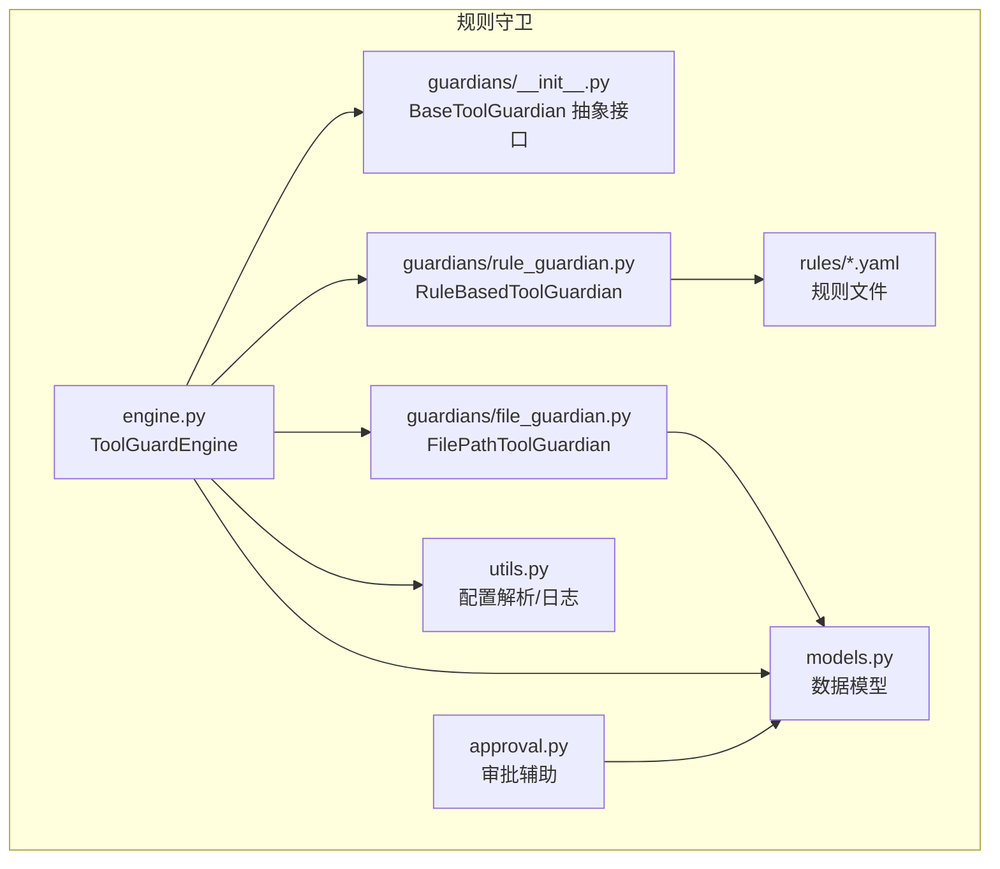
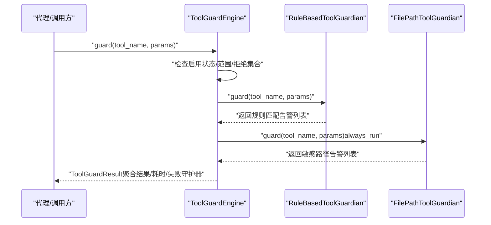
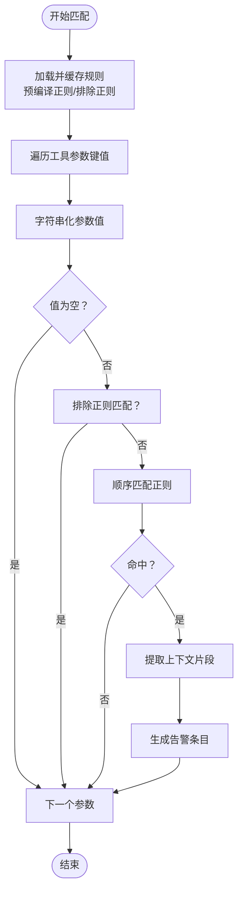
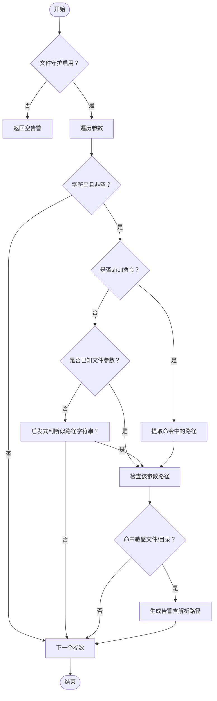
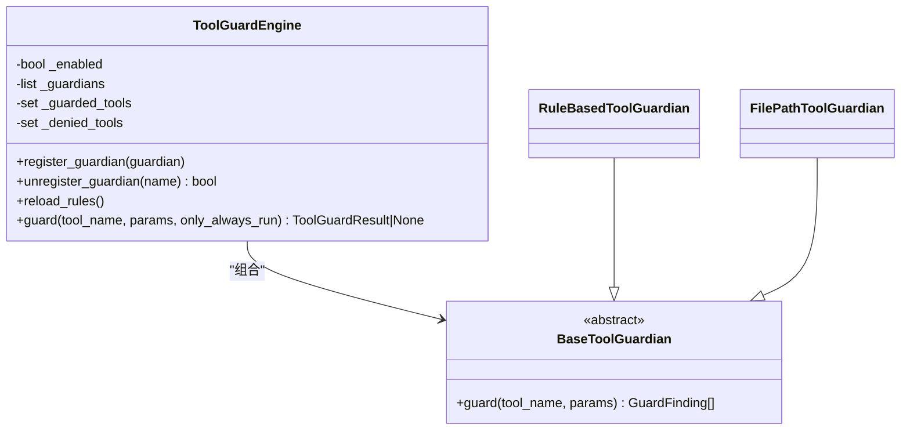
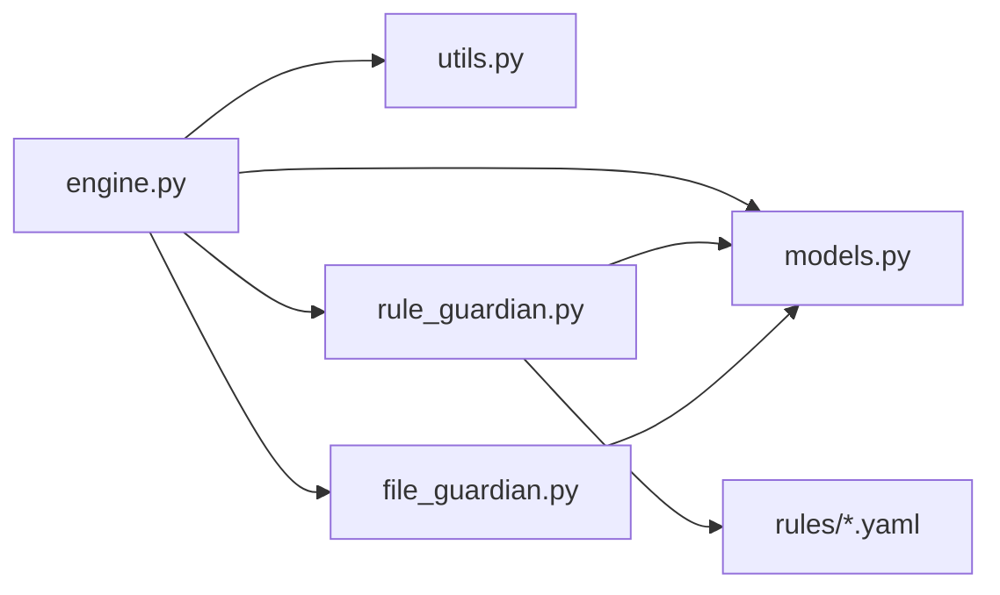

# 规则守卫

<cite>
**本文引用的文件**
- [src/copaw/security/tool_guard/__init__.py](file://src/copaw/security/tool_guard/__init__.py)
- [src/copaw/security/tool_guard/engine.py](file://src/copaw/security/tool_guard/engine.py)
- [src/copaw/security/tool_guard/models.py](file://src/copaw/security/tool_guard/models.py)
- [src/copaw/security/tool_guard/utils.py](file://src/copaw/security/tool_guard/utils.py)
- [src/copaw/security/tool_guard/guardians/__init__.py](file://src/copaw/security/tool_guard/guardians/__init__.py)
- [src/copaw/security/tool_guard/guardians/rule_guardian.py](file://src/copaw/security/tool_guard/guardians/rule_guardian.py)
- [src/copaw/security/tool_guard/guardians/file_guardian.py](file://src/copaw/security/tool_guard/guardians/file_guardian.py)
- [src/copaw/security/tool_guard/rules/dangerous_shell_commands.yaml](file://src/copaw/security/tool_guard/rules/dangerous_shell_commands.yaml)
- [src/copaw/security/tool_guard/approval.py](file://src/copaw/security/tool_guard/approval.py)
- [src/copaw/agents/tool_guard_mixin.py](file://src/copaw/agents/tool_guard_mixin.py)
</cite>

## 目录
1. [简介](#简介)
2. [项目结构](#项目结构)
3. [核心组件](#核心组件)
4. [架构总览](#架构总览)
5. [详细组件分析](#详细组件分析)
6. [依赖关系分析](#依赖关系分析)
7. [性能考量](#性能考量)
8. [故障排查指南](#故障排查指南)
9. [结论](#结论)
10. [附录](#附录)

## 简介
本文件面向CoPaw规则守卫组件（RuleBasedToolGuardian）的技术文档，系统阐述其规则引擎架构、规则匹配算法、威胁检测机制与运行时管理能力。重点覆盖：
- 规则文件格式与语法规则
- 规则优先级与生效范围
- 危险命令、文件操作、网络访问等安全策略配置示例
- 规则缓存、动态加载与更新策略
- 调试、性能优化与规则冲突处理
- 安全规则模板与最佳实践

规则守卫在工具调用前对参数进行扫描，识别命令注入、数据外泄、敏感文件访问、路径穿越、资源滥用、网络滥用等风险，并通过统一结果模型聚合告警，供上层审批流程或自动阻断使用。

## 项目结构
规则守卫位于安全子系统中，采用“守护器（Guardian）+ 引擎（Engine）+ 模型（Models）+ 工具（Utils）”分层设计，规则以YAML文件形式组织，支持默认内置规则与用户自定义规则叠加。

图表来源
- [src/copaw/security/tool_guard/engine.py:53-238](file://src/copaw/security/tool_guard/engine.py#L53-L238)
- [src/copaw/security/tool_guard/guardians/__init__.py:17-62](file://src/copaw/security/tool_guard/guardians/__init__.py#L17-L62)
- [src/copaw/security/tool_guard/guardians/rule_guardian.py:280-383](file://src/copaw/security/tool_guard/guardians/rule_guardian.py#L280-L383)
- [src/copaw/security/tool_guard/guardians/file_guardian.py:161-342](file://src/copaw/security/tool_guard/guardians/file_guardian.py#L161-L342)
- [src/copaw/security/tool_guard/models.py:103-185](file://src/copaw/security/tool_guard/models.py#L103-L185)
- [src/copaw/security/tool_guard/utils.py:63-163](file://src/copaw/security/tool_guard/utils.py#L63-L163)
- [src/copaw/security/tool_guard/approval.py:12-38](file://src/copaw/security/tool_guard/approval.py#L12-L38)

章节来源
- [src/copaw/security/tool_guard/__init__.py:1-59](file://src/copaw/security/tool_guard/__init__.py#L1-L59)
- [src/copaw/security/tool_guard/engine.py:53-238](file://src/copaw/security/tool_guard/engine.py#L53-L238)
- [src/copaw/security/tool_guard/guardians/__init__.py:17-62](file://src/copaw/security/tool_guard/guardians/__init__.py#L17-L62)

## 核心组件
- ToolGuardEngine：守护器编排器，负责注册/注销守护器、按工具名与范围执行、聚合结果、记录耗时与失败信息；支持懒加载单例。
- RuleBasedToolGuardian：基于YAML签名规则的正则匹配守护器，扫描参数字符串表示值，命中即生成告警。
- FilePathToolGuardian：基于路径的敏感文件/目录阻断守护器，支持从配置加载敏感列表、路径提取与归一化。
- 数据模型：统一的威胁分类、严重级别、告警条目与结果聚合模型。
- 工具函数：工具集范围解析（允许/拒绝）、规则日志输出、环境变量与配置优先级解析。
- 审批辅助：将告警摘要格式化为可读文本，供审批界面展示。

章节来源
- [src/copaw/security/tool_guard/engine.py:53-238](file://src/copaw/security/tool_guard/engine.py#L53-L238)
- [src/copaw/security/tool_guard/guardians/rule_guardian.py:280-383](file://src/copaw/security/tool_guard/guardians/rule_guardian.py#L280-L383)
- [src/copaw/security/tool_guard/guardians/file_guardian.py:161-342](file://src/copaw/security/tool_guard/guardians/file_guardian.py#L161-L342)
- [src/copaw/security/tool_guard/models.py:25-185](file://src/copaw/security/tool_guard/models.py#L25-L185)
- [src/copaw/security/tool_guard/utils.py:63-163](file://src/copaw/security/tool_guard/utils.py#L63-L163)
- [src/copaw/security/tool_guard/approval.py:12-38](file://src/copaw/security/tool_guard/approval.py#L12-L38)

## 架构总览
规则守卫在工具调用前拦截，依据配置决定是否启用、对哪些工具进行保护、哪些工具直接拒绝。引擎遍历已注册守护器，收集所有告警并汇总为结果对象，同时输出结构化日志。

图表来源
- [src/copaw/security/tool_guard/engine.py:169-227](file://src/copaw/security/tool_guard/engine.py#L169-L227)
- [src/copaw/security/tool_guard/guardians/rule_guardian.py:329-383](file://src/copaw/security/tool_guard/guardians/rule_guardian.py#L329-L383)
- [src/copaw/security/tool_guard/guardians/file_guardian.py:290-342](file://src/copaw/security/tool_guard/guardians/file_guardian.py#L290-L342)

## 详细组件分析

### RuleBasedToolGuardian 规则引擎
- 规则来源
  - 内置规则目录：默认加载指定规则文件集合。
  - 配置扩展：从配置中读取自定义规则与禁用规则ID，合并后过滤禁用项。
  - 运行时注入：支持构造时传入额外规则。
- 规则加载与缓存
  - 加载逻辑：按目录/文件列表加载YAML，逐条构建规则对象，预编译正则与排除正则。
  - 缓存策略：规则对象在内存中常驻，仅在显式reload或配置变更时刷新。
- 匹配算法
  - 对每个工具参数值，先转为字符串再进行匹配。
  - 先检查排除模式，若匹配则跳过；否则按顺序匹配正则，命中后截取上下文片段，生成告警。
- 命中判定与上下文
  - 告警包含规则ID、类别、严重级别、描述、参数名、匹配值、匹配模式、上下文片段、修复建议等。
- 动态规则加载与更新
  - 提供reload方法，触发重新加载内置+配置+额外规则并应用禁用过滤。
  - 引擎在配置变化时统一调用各守护器reload，确保规则即时生效。

图表来源
- [src/copaw/security/tool_guard/guardians/rule_guardian.py:153-231](file://src/copaw/security/tool_guard/guardians/rule_guardian.py#L153-L231)
- [src/copaw/security/tool_guard/guardians/rule_guardian.py:329-383](file://src/copaw/security/tool_guard/guardians/rule_guardian.py#L329-L383)

章节来源
- [src/copaw/security/tool_guard/guardians/rule_guardian.py:52-146](file://src/copaw/security/tool_guard/guardians/rule_guardian.py#L52-L146)
- [src/copaw/security/tool_guard/guardians/rule_guardian.py:153-231](file://src/copaw/security/tool_guard/guardians/rule_guardian.py#L153-L231)
- [src/copaw/security/tool_guard/guardians/rule_guardian.py:239-273](file://src/copaw/security/tool_guard/guardians/rule_guardian.py#L239-L273)
- [src/copaw/security/tool_guard/guardians/rule_guardian.py:311-314](file://src/copaw/security/tool_guard/guardians/rule_guardian.py#L311-L314)
- [src/copaw/security/tool_guard/guardians/rule_guardian.py:329-383](file://src/copaw/security/tool_guard/guardians/rule_guardian.py#L329-L383)

### FilePathToolGuardian 敏感路径守护
- 启用与敏感列表
  - 支持从配置开关与敏感文件/目录列表加载；默认包含秘密目录。
  - 可在运行时重载配置，动态更新敏感集合。
- 路径处理
  - 归一化：相对路径解析到工作区根，展开波浪号，绝对化并去冗余。
  - 目录与文件：目录以斜杠结尾或目录对象视为目录约束，其余视为文件约束。
- 命中检测
  - 已知文件类工具：仅检查声明的文件路径参数。
  - Shell命令：使用安全分词提取重定向与路径令牌，逐一检查。
  - 其他工具：对所有疑似路径的字符串参数进行检查。
- 告警内容
  - 统一使用敏感文件访问类别与高严重级别，附带修复建议与解析后的绝对路径元数据。

图表来源
- [src/copaw/security/tool_guard/guardians/file_guardian.py:290-342](file://src/copaw/security/tool_guard/guardians/file_guardian.py#L290-L342)
- [src/copaw/security/tool_guard/guardians/file_guardian.py:111-158](file://src/copaw/security/tool_guard/guardians/file_guardian.py#L111-L158)

章节来源
- [src/copaw/security/tool_guard/guardians/file_guardian.py:161-225](file://src/copaw/security/tool_guard/guardians/file_guardian.py#L161-L225)
- [src/copaw/security/tool_guard/guardians/file_guardian.py:226-266](file://src/copaw/security/tool_guard/guardians/file_guardian.py#L226-L266)
- [src/copaw/security/tool_guard/guardians/file_guardian.py:290-342](file://src/copaw/security/tool_guard/guardians/file_guardian.py#L290-L342)

### ToolGuardEngine 引擎与生命周期
- 默认守护器
  - 自动注册文件路径守护器与规则守护器；异常不影响其他守护器初始化。
- 注册与注销
  - 支持运行时注册/注销守护器，便于扩展新引擎。
- 工具范围与拒绝集合
  - 通过环境变量、配置文件与默认集合解析受保护工具集；支持“全部”“无”等特殊值。
  - 拒绝集合用于无条件阻断，不进入审批流程。
- 执行流程
  - 判断启用状态；根据only_always_run选择执行守护器集合；捕获守护器异常并记录；统计耗时。
- 规则热更新
  - 提供reload_rules统一触发各守护器reload与范围/拒绝集合刷新。

图表来源
- [src/copaw/security/tool_guard/engine.py:53-238](file://src/copaw/security/tool_guard/engine.py#L53-L238)
- [src/copaw/security/tool_guard/guardians/__init__.py:17-62](file://src/copaw/security/tool_guard/guardians/__init__.py#L17-L62)
- [src/copaw/security/tool_guard/guardians/rule_guardian.py:280-383](file://src/copaw/security/tool_guard/guardians/rule_guardian.py#L280-L383)
- [src/copaw/security/tool_guard/guardians/file_guardian.py:161-342](file://src/copaw/security/tool_guard/guardians/file_guardian.py#L161-L342)

章节来源
- [src/copaw/security/tool_guard/engine.py:84-102](file://src/copaw/security/tool_guard/engine.py#L84-L102)
- [src/copaw/security/tool_guard/engine.py:141-154](file://src/copaw/security/tool_guard/engine.py#L141-L154)
- [src/copaw/security/tool_guard/engine.py:169-227](file://src/copaw/security/tool_guard/engine.py#L169-L227)

### 数据模型与日志
- 威胁分类与严重级别枚举覆盖命令注入、数据外泄、路径穿越、敏感文件访问、网络滥用、凭证暴露、资源滥用、提示注入、代码执行、权限提升等。
- 告警条目包含唯一ID、规则ID、类别、严重级别、标题、描述、工具名、参数名、匹配值、匹配模式、上下文片段、修复建议、守护器名与元数据。
- 结果聚合包含工具名、参数、告警列表、耗时、使用的守护器、失败的守护器、时间戳等；提供按严重级别与类别的筛选方法。
- 日志输出遵循结构化格式，区分高/低严重级别的日志级别，便于审计与监控。

章节来源
- [src/copaw/security/tool_guard/models.py:25-185](file://src/copaw/security/tool_guard/models.py#L25-L185)
- [src/copaw/security/tool_guard/utils.py:128-163](file://src/copaw/security/tool_guard/utils.py#L128-L163)

### 规则文件格式与语法规则
- 文件位置：默认位于规则目录下，可通过构造参数或配置覆盖。
- 规则字段
  - id：规则唯一标识
  - tool(s)/param(s)：目标工具/参数名，支持多值与空表示全匹配
  - category：威胁类别（来自枚举）
  - severity：严重级别（来自枚举）
  - patterns/exclude_patterns：正则表达式列表（忽略大小写）
  - description/remediation：描述与修复建议
- 规则加载
  - 支持目录批量加载与文件白名单加载；错误与无效规则会被跳过并记录警告。
- 示例规则：内置危险Shell命令规则涵盖破坏性命令、fork炸弹、管道下载执行、反连/隧道、持久化与提权、危险权限修改、混淆规避等场景。

章节来源
- [src/copaw/security/tool_guard/guardians/rule_guardian.py:8-22](file://src/copaw/security/tool_guard/guardians/rule_guardian.py#L8-L22)
- [src/copaw/security/tool_guard/guardians/rule_guardian.py:153-231](file://src/copaw/security/tool_guard/guardians/rule_guardian.py#L153-L231)
- [src/copaw/security/tool_guard/rules/dangerous_shell_commands.yaml:1-120](file://src/copaw/security/tool_guard/rules/dangerous_shell_commands.yaml#L1-L120)

### 规则优先级与生效范围
- 工具范围解析优先级：构造参数 > 环境变量 > 配置文件 > 默认高危集合；支持“全部”“无”等特殊值。
- 拒绝集合：高于一切，命中即直接阻断。
- 规则作用域：按工具名与参数名过滤，未指定则默认全匹配；排除正则优先于匹配正则。
- 严重级别：结果聚合时按严重级别排序取最高值，用于快速决策。

章节来源
- [src/copaw/security/tool_guard/utils.py:63-126](file://src/copaw/security/tool_guard/utils.py#L63-L126)
- [src/copaw/security/tool_guard/guardians/rule_guardian.py:119-146](file://src/copaw/security/tool_guard/guardians/rule_guardian.py#L119-L146)
- [src/copaw/security/tool_guard/models.py:121-144](file://src/copaw/security/tool_guard/models.py#L121-L144)

### 运行时管理：缓存、动态加载与更新
- 规则缓存：规则对象与预编译正则在内存中缓存，避免重复I/O与编译开销。
- 动态加载：支持从目录/文件列表加载；支持从配置读取自定义规则与禁用规则ID。
- 更新策略：引擎提供统一reload_rules入口，依次调用守护器reload并刷新工具范围/拒绝集合。
- 环境与配置：守护器启用、工具范围、拒绝集合均可通过环境变量与配置文件动态调整。

章节来源
- [src/copaw/security/tool_guard/guardians/rule_guardian.py:304-314](file://src/copaw/security/tool_guard/guardians/rule_guardian.py#L304-L314)
- [src/copaw/security/tool_guard/engine.py:148-154](file://src/copaw/security/tool_guard/engine.py#L148-L154)
- [src/copaw/security/tool_guard/utils.py:50-126](file://src/copaw/security/tool_guard/utils.py#L50-L126)

### 审批与集成
- 审批摘要：将告警摘要格式化为简洁的Markdown文本，限制显示数量。
- 上层集成：代理混入在工具调用前执行守卫决策，若命中拒绝集合则自动拒绝并记录；若需审批则进入审批流程；否则放行。

章节来源
- [src/copaw/security/tool_guard/approval.py:12-38](file://src/copaw/security/tool_guard/approval.py#L12-L38)
- [src/copaw/agents/tool_guard_mixin.py:251-356](file://src/copaw/agents/tool_guard_mixin.py#L251-L356)

## 依赖关系分析
- 组件耦合
  - 引擎与守护器通过抽象接口解耦，新增守护器无需改动引擎。
  - 规则守护器依赖规则文件与正则库；文件守护器依赖配置与路径解析。
- 外部依赖
  - YAML解析、正则编译、配置加载、日志框架。
- 循环依赖
  - 未见循环导入；模型与工具函数被守护器与引擎共同依赖。

图表来源
- [src/copaw/security/tool_guard/engine.py:25-28](file://src/copaw/security/tool_guard/engine.py#L25-L28)
- [src/copaw/security/tool_guard/guardians/rule_guardian.py:33-34](file://src/copaw/security/tool_guard/guardians/rule_guardian.py#L33-L34)
- [src/copaw/security/tool_guard/guardians/file_guardian.py:14-16](file://src/copaw/security/tool_guard/guardians/file_guardian.py#L14-L16)

章节来源
- [src/copaw/security/tool_guard/engine.py:25-28](file://src/copaw/security/tool_guard/engine.py#L25-L28)
- [src/copaw/security/tool_guard/guardians/rule_guardian.py:33-34](file://src/copaw/security/tool_guard/guardians/rule_guardian.py#L33-L34)
- [src/copaw/security/tool_guard/guardians/file_guardian.py:14-16](file://src/copaw/security/tool_guard/guardians/file_guardian.py#L14-L16)

## 性能考量
- 正则匹配成本
  - 预编译正则与排除正则减少运行时开销；按顺序匹配命中即短路。
  - 字符串化参数值可能带来额外成本，建议仅对必要参数扫描。
- 规则规模
  - 大量规则会增加匹配链长度；可通过工具/参数作用域缩小扫描范围。
- I/O与缓存
  - 规则文件只在加载/重载时读取；规则对象与正则缓存于内存。
- 并发与锁
  - 审批决策在互斥锁内完成，避免并发竞态；实际工具执行在锁外并行，保证吞吐。

章节来源
- [src/copaw/security/tool_guard/guardians/rule_guardian.py:96-116](file://src/copaw/security/tool_guard/guardians/rule_guardian.py#L96-L116)
- [src/copaw/security/tool_guard/guardians/rule_guardian.py:343-357](file://src/copaw/security/tool_guard/guardians/rule_guardian.py#L343-L357)
- [src/copaw/agents/tool_guard_mixin.py:251-283](file://src/copaw/agents/tool_guard_mixin.py#L251-L283)

## 故障排查指南
- 规则加载失败
  - 检查规则文件是否存在、YAML格式是否正确、正则是否有效；引擎会记录警告并跳过无效条目。
- 守护器初始化失败
  - 文件路径守护器或规则守护器初始化异常会被记录但不影响其他守护器；检查配置与依赖。
- 告警过多或误报
  - 使用排除正则降低误报；缩小工具/参数作用域；调整严重级别阈值。
- 审批流卡顿
  - 关注引擎耗时统计；排查正则复杂度与规则数量；确认only_always_run路径是否正确。
- 环境变量与配置
  - 确认启用开关、工具范围、拒绝集合的优先级设置；必要时临时关闭以定位问题。

章节来源
- [src/copaw/security/tool_guard/guardians/rule_guardian.py:153-185](file://src/copaw/security/tool_guard/guardians/rule_guardian.py#L153-L185)
- [src/copaw/security/tool_guard/engine.py:88-101](file://src/copaw/security/tool_guard/engine.py#L88-L101)
- [src/copaw/security/tool_guard/utils.py:128-163](file://src/copaw/security/tool_guard/utils.py#L128-L163)

## 结论
规则守卫通过“规则引擎 + 路径守护”的双轨机制，在工具调用前提供快速、可扩展、可配置的安全防护。其设计强调：
- 易扩展：抽象接口与默认守护器组合，支持插件化扩展。
- 可运维：规则热加载、范围/拒绝集合动态解析、结构化日志与审批摘要。
- 可观测：统一模型与告警聚合，便于审计与可视化。

## 附录

### 规则配置示例与最佳实践
- 危险命令规则
  - 建议覆盖破坏性命令、管道下载执行、反连/隧道、fork炸弹、持久化与提权、危险权限修改、混淆规避等场景。
  - 使用排除正则过滤合法场景（如注释行），避免误报。
- 文件操作规则
  - 将敏感目录与关键文件加入拒绝列表；对shell命令进行路径提取与归一化比对。
  - 对已知文件参数严格校验，对未知参数采用启发式路径识别。
- 网络访问规则
  - 识别反连、隧道、远程下载等模式；结合参数作用域限定扫描范围。
- 最佳实践
  - 分层治理：默认高危集合 + 组织策略 + 项目自定义。
  - 渐进增强：先启用高价值规则，逐步完善覆盖。
  - 审计留痕：开启结构化日志，定期复盘告警与修复建议。

章节来源
- [src/copaw/security/tool_guard/rules/dangerous_shell_commands.yaml:1-120](file://src/copaw/security/tool_guard/rules/dangerous_shell_commands.yaml#L1-L120)
- [src/copaw/security/tool_guard/guardians/file_guardian.py:161-225](file://src/copaw/security/tool_guard/guardians/file_guardian.py#L161-L225)