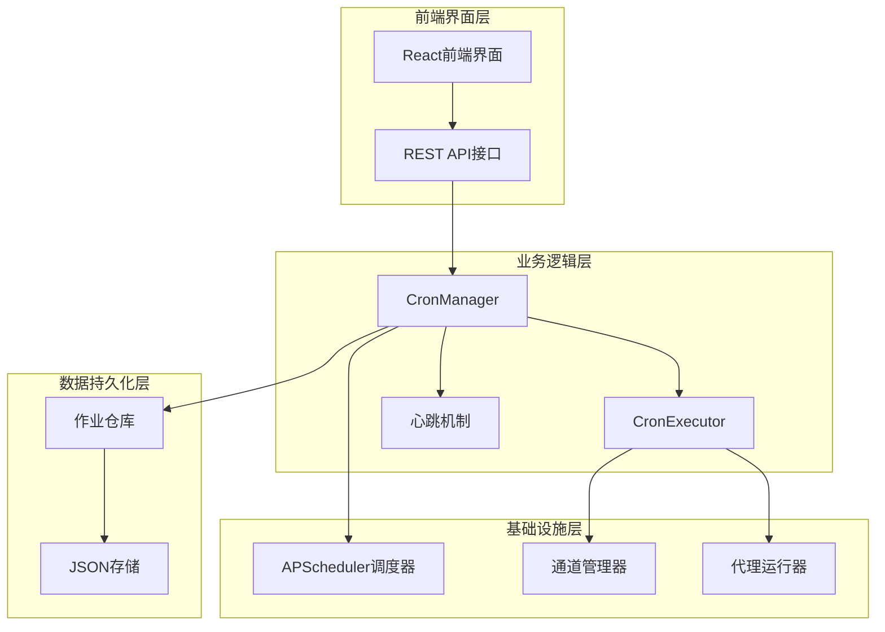
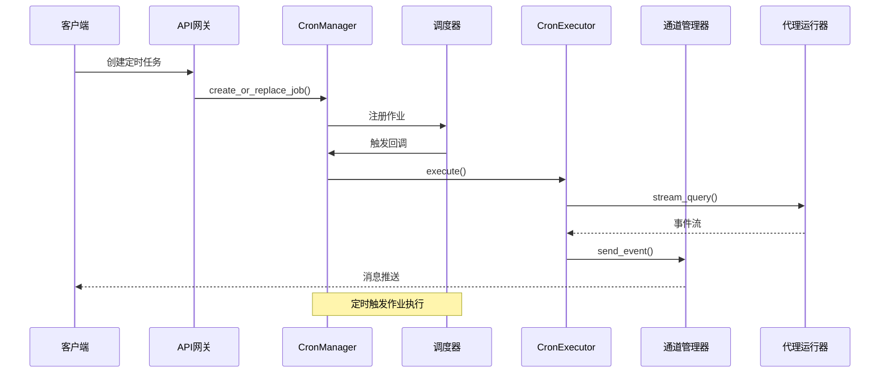
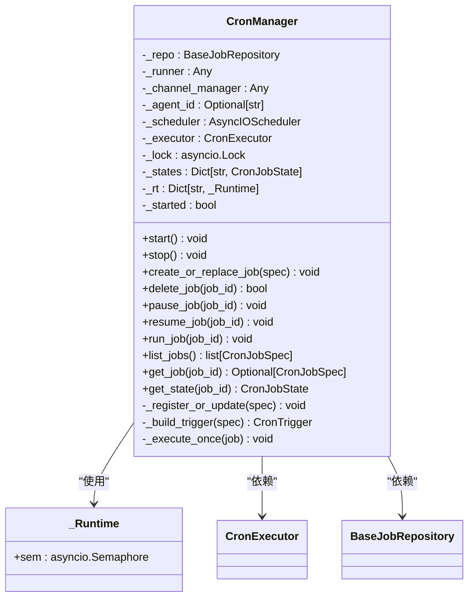
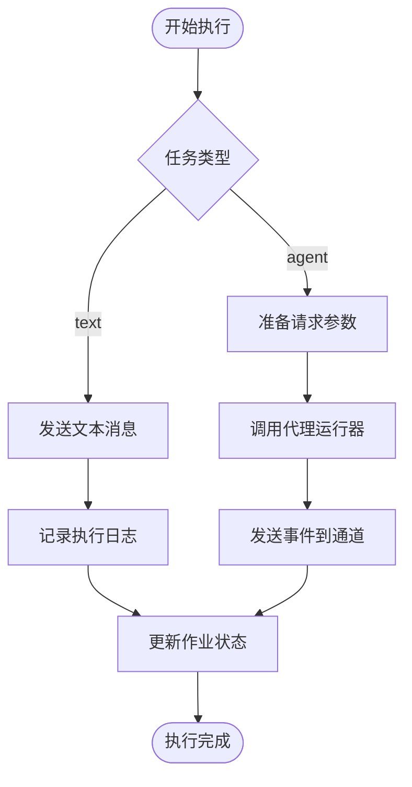
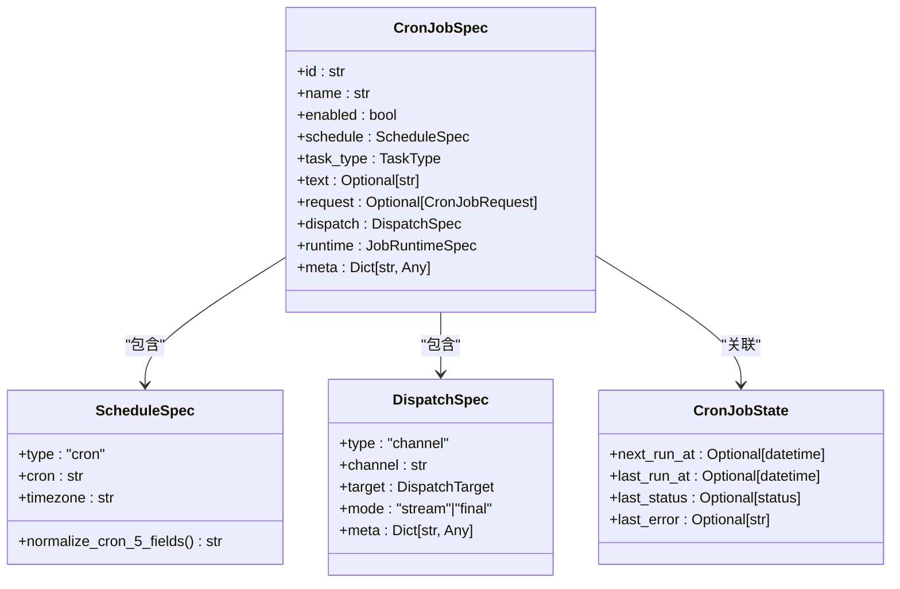
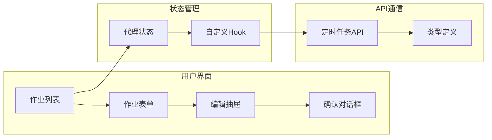
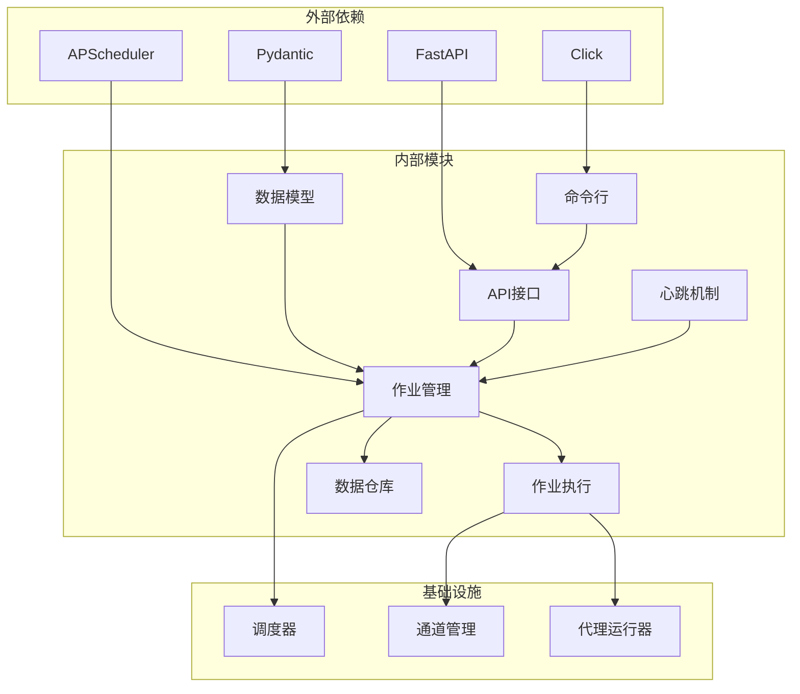

# 定时任务增强

<cite>
**本文档引用的文件**
- [src/copaw/app/crons/models.py](file://src/copaw/app/crons/models.py)
- [src/copaw/app/crons/manager.py](file://src/copaw/app/crons/manager.py)
- [src/copaw/app/crons/executor.py](file://src/copaw/app/crons/executor.py)
- [src/copaw/app/crons/api.py](file://src/copaw/app/crons/api.py)
- [src/copaw/app/crons/repo/base.py](file://src/copaw/app/crons/repo/base.py)
- [src/copaw/app/crons/repo/json_repo.py](file://src/copaw/app/crons/repo/json_repo.py)
- [src/copaw/app/crons/heartbeat.py](file://src/copaw/app/crons/heartbeat.py)
- [src/copaw/cli/cron_cmd.py](file://src/copaw/cli/cron_cmd.py)
- [src/copaw/agents/skills/cron/SKILL.md](file://src/copaw/agents/skills/cron/SKILL.md)
- [console/src/pages/Control/CronJobs/index.tsx](file://console/src/pages/Control/CronJobs/index.tsx)
- [console/src/pages/Control/CronJobs/useCronJobs.ts](file://console/src/pages/Control/CronJobs/useCronJobs.ts)
</cite>

## 目录
1. [简介](#简介)
2. [项目结构](#项目结构)
3. [核心组件](#核心组件)
4. [架构概览](#架构概览)
5. [详细组件分析](#详细组件分析)
6. [依赖关系分析](#依赖关系分析)
7. [性能考虑](#性能考虑)
8. [故障排除指南](#故障排除指南)
9. [结论](#结论)

## 简介

定时任务增强功能是Copaw平台中一个重要的自动化功能模块，它允许用户创建、管理和执行基于Cron表达式的定时任务。该功能通过异步调度器实现高并发的任务执行，支持多种任务类型和交付模式，为用户提供了一个强大而灵活的自动化解决方案。

该系统的核心特性包括：
- 支持5字段Cron表达式（分钟、小时、日期、月份、星期）
- 异步任务执行和并发控制
- 多种任务类型（文本消息和代理交互）
- 完整的生命周期管理（创建、修改、删除、暂停、恢复）
- 实时状态监控和错误处理
- 多种交付渠道支持

## 项目结构

定时任务系统采用分层架构设计，主要分为以下几个层次：

**图表来源**
- [src/copaw/app/crons/manager.py:37-61](file://src/copaw/app/crons/manager.py#L37-61)
- [src/copaw/app/crons/executor.py:13-17](file://src/copaw/app/crons/executor.py#L13-17)
- [src/copaw/app/crons/repo/base.py:10-21](file://src/copaw/app/crons/repo/base.py#L10-21)

**章节来源**
- [src/copaw/app/crons/models.py:1-173](file://src/copaw/app/crons/models.py#L1-173)
- [src/copaw/app/crons/manager.py:1-385](file://src/copaw/app/crons/manager.py#L1-385)

## 核心组件

定时任务系统由多个核心组件构成，每个组件都有明确的职责和功能：

### 数据模型层
- **ScheduleSpec**: 定义Cron调度规范，支持5字段Cron表达式和时区配置
- **CronJobSpec**: 定义完整的作业规范，包含调度、任务类型、请求参数等
- **DispatchSpec**: 定义消息分发规范，指定目标用户和会话
- **CronJobState**: 记录作业执行状态和历史信息

### 执行管理层
- **CronManager**: 主要的作业管理器，负责调度器启动、作业注册、状态跟踪
- **CronExecutor**: 作业执行器，处理不同类型的任务执行逻辑
- **JsonJobRepository**: 作业仓库实现，提供JSON文件存储

### 接口层
- **FastAPI路由**: 提供RESTful API接口
- **CLI命令**: 提供命令行工具接口
- **前端界面**: 提供Web管理界面

**章节来源**
- [src/copaw/app/crons/models.py:58-173](file://src/copaw/app/crons/models.py#L58-173)
- [src/copaw/app/crons/manager.py:37-117](file://src/copaw/app/crons/manager.py#L37-117)
- [src/copaw/app/crons/executor.py:13-90](file://src/copaw/app/crons/executor.py#L13-90)

## 架构概览

定时任务系统采用事件驱动的异步架构，通过APScheduler实现高效的定时调度：

**图表来源**
- [src/copaw/app/crons/manager.py:313-385](file://src/copaw/app/crons/manager.py#L313-385)
- [src/copaw/app/crons/executor.py:18-90](file://src/copaw/app/crons/executor.py#L18-90)

系统的关键特性包括：

1. **异步执行**: 使用asyncio实现非阻塞的任务执行
2. **并发控制**: 通过信号量限制同时执行的任务数量
3. **错误处理**: 完善的异常捕获和错误恢复机制
4. **状态跟踪**: 实时记录作业执行状态和历史信息
5. **生命周期管理**: 支持作业的完整生命周期操作

## 详细组件分析

### CronManager - 作业管理器

CronManager是整个定时任务系统的核心组件，负责协调各个子系统的协作：

**图表来源**
- [src/copaw/app/crons/manager.py:37-61](file://src/copaw/app/crons/manager.py#L37-61)
- [src/copaw/app/crons/manager.py:32-35](file://src/copaw/app/crons/manager.py#L32-35)

#### 关键功能特性

1. **启动和停止管理**: 自动加载作业配置并启动调度器
2. **作业注册**: 将新的或更新的作业注册到调度器中
3. **并发控制**: 为每个作业维护独立的信号量
4. **状态跟踪**: 实时更新和查询作业执行状态
5. **错误恢复**: 自动禁用无效作业并记录警告

**章节来源**
- [src/copaw/app/crons/manager.py:62-117](file://src/copaw/app/crons/manager.py#L62-117)
- [src/copaw/app/crons/manager.py:241-272](file://src/copaw/app/crons/manager.py#L241-272)

### CronExecutor - 作业执行器

CronExecutor负责实际执行定时任务，支持两种任务类型：

**图表来源**
- [src/copaw/app/crons/executor.py:18-90](file://src/copaw/app/crons/executor.py#L18-90)

#### 文本任务执行流程

对于文本类型的定时任务，执行器直接通过通道管理器发送预定义的消息内容。

#### 代理任务执行流程

对于代理类型的定时任务，执行器会：
1. 准备代理请求参数
2. 调用代理运行器获取响应流
3. 将响应事件实时推送到指定通道
4. 支持流式传输和最终结果两种模式

**章节来源**
- [src/copaw/app/crons/executor.py:18-90](file://src/copaw/app/crons/executor.py#L18-90)

### 数据模型设计

系统采用Pydantic模型确保数据的完整性和一致性：

**图表来源**
- [src/copaw/app/crons/models.py:123-173](file://src/copaw/app/crons/models.py#L123-173)

**章节来源**
- [src/copaw/app/crons/models.py:58-173](file://src/copaw/app/crons/models.py#L58-173)

### 前端界面集成

前端提供了完整的定时任务管理界面：

**图表来源**
- [console/src/pages/Control/CronJobs/index.tsx:18-240](file://console/src/pages/Control/CronJobs/index.tsx#L18-240)
- [console/src/pages/Control/CronJobs/useCronJobs.ts:9-139](file://console/src/pages/Control/CronJobs/useCronJobs.ts#L9-139)

**章节来源**
- [console/src/pages/Control/CronJobs/index.tsx:18-240](file://console/src/pages/Control/CronJobs/index.tsx#L18-240)
- [console/src/pages/Control/CronJobs/useCronJobs.ts:9-139](file://console/src/pages/Control/CronJobs/useCronJobs.ts#L9-139)

## 依赖关系分析

定时任务系统遵循清晰的依赖层次结构：

**图表来源**
- [src/copaw/app/crons/manager.py:10-25](file://src/copaw/app/crons/manager.py#L10-25)
- [src/copaw/app/crons/api.py:4-8](file://src/copaw/app/crons/api.py#L4-8)

### 核心依赖关系

1. **APScheduler**: 提供异步调度功能
2. **Pydantic**: 确保数据模型的验证和序列化
3. **FastAPI**: 提供RESTful API接口
4. **Click**: 提供命令行工具接口

### 循环依赖检测

系统设计避免了循环依赖：
- 上层组件依赖下层组件（API → Manager → Executor）
- 数据模型独立于业务逻辑
- 前端界面通过API与后端通信

**章节来源**
- [src/copaw/app/crons/manager.py:10-25](file://src/copaw/app/crons/manager.py#L10-25)
- [src/copaw/app/crons/api.py:4-8](file://src/copaw/app/crons/api.py#L4-8)

## 性能考虑

定时任务系统在设计时充分考虑了性能优化：

### 并发控制策略

1. **作业级并发**: 每个作业维护独立的信号量，防止资源竞争
2. **全局调度**: 使用AsyncIOScheduler处理作业调度
3. **内存管理**: 及时清理已完成作业的状态信息

### 执行效率优化

1. **异步I/O**: 所有网络操作都是异步的
2. **流式处理**: 支持事件流的实时传输
3. **超时控制**: 防止长时间阻塞影响系统性能

### 存储优化

1. **原子写入**: JSON文件采用临时文件+替换的方式保证原子性
2. **增量更新**: 只更新变更的作业，减少I/O操作
3. **内存缓存**: 作业状态在内存中缓存，减少磁盘访问

## 故障排除指南

### 常见问题及解决方案

#### 作业无法启动

**症状**: 作业创建成功但不执行
**可能原因**:
1. 调度器未启动
2. Cron表达式格式错误
3. 作业被意外禁用

**解决步骤**:
1. 检查调度器状态: `mgr.get_state(job_id)`
2. 验证Cron表达式格式
3. 确认作业状态为enabled

#### 作业执行超时

**症状**: 作业执行超过预期时间
**可能原因**:
1. 代理响应时间过长
2. 网络连接问题
3. 目标通道不可用

**解决步骤**:
1. 增加runtime.timeout_seconds
2. 检查代理服务状态
3. 验证通道配置

#### 内存泄漏问题

**症状**: 系统运行时间越长内存占用越大
**可能原因**:
1. 作业状态未及时清理
2. 事件处理器未正确释放
3. 调度器作业未正确移除

**解决步骤**:
1. 定期清理已删除作业的状态
2. 确保异常情况下也能清理资源
3. 监控作业数量和内存使用

**章节来源**
- [src/copaw/app/crons/manager.py:346-385](file://src/copaw/app/crons/manager.py#L346-385)
- [src/copaw/app/crons/executor.py:75-90](file://src/copaw/app/crons/executor.py#L75-90)

## 结论

定时任务增强功能为Copaw平台提供了强大的自动化能力。通过精心设计的架构和完善的错误处理机制，该系统能够稳定地执行各种类型的定时任务。

### 主要优势

1. **高可靠性**: 异步架构和完善的错误处理确保系统稳定性
2. **高性能**: 并发控制和流式处理提升执行效率
3. **易用性**: 完整的API接口和前端界面降低使用门槛
4. **可扩展性**: 模块化设计便于功能扩展和维护

### 未来发展建议

1. **监控增强**: 添加更详细的性能指标和日志记录
2. **配置管理**: 提供更灵活的配置选项和模板功能
3. **通知机制**: 增强失败通知和状态报告功能
4. **安全加固**: 加强作业权限控制和审计日志

该定时任务系统为Copaw平台的自动化需求提供了坚实的技术基础，能够满足各种复杂的定时执行场景。