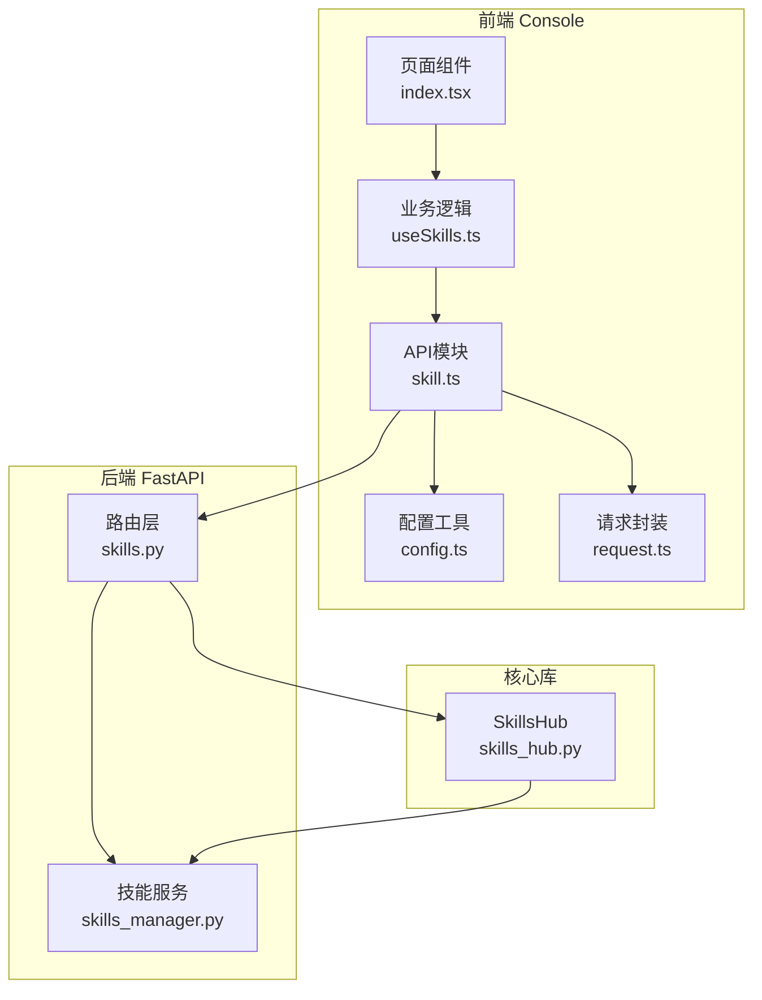
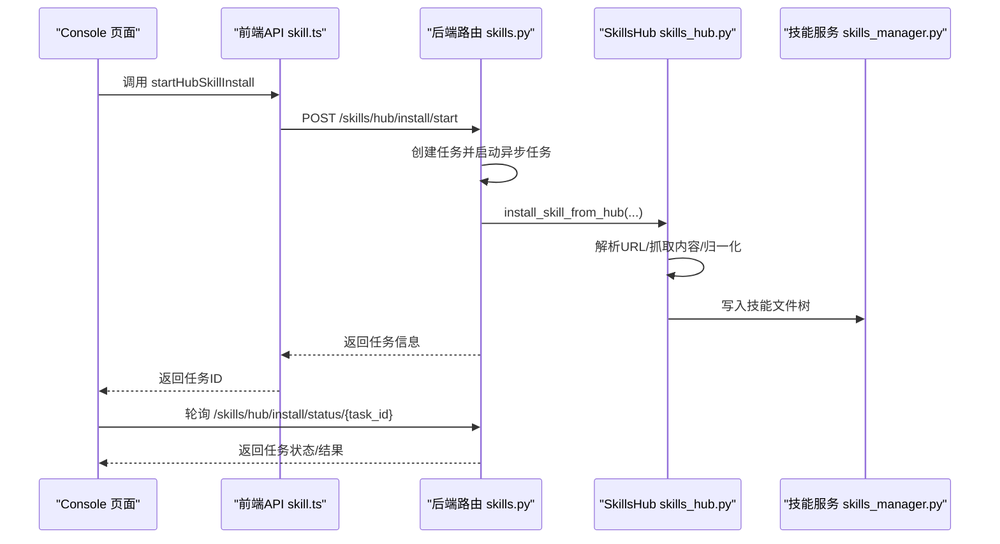
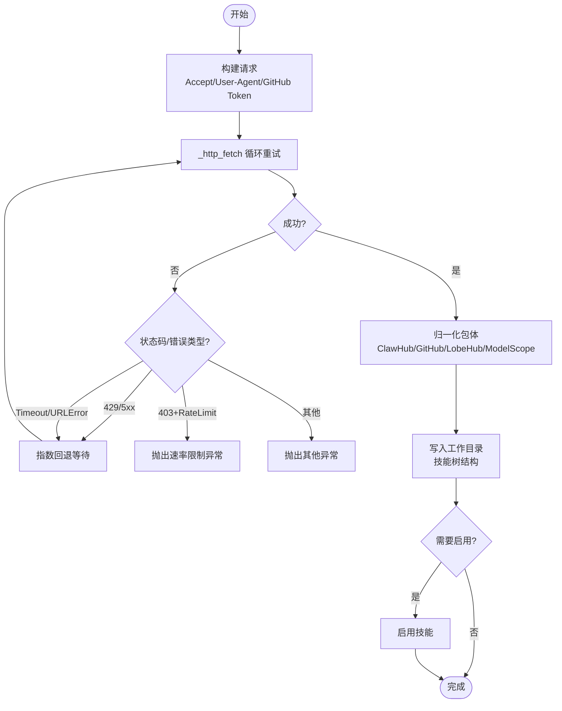
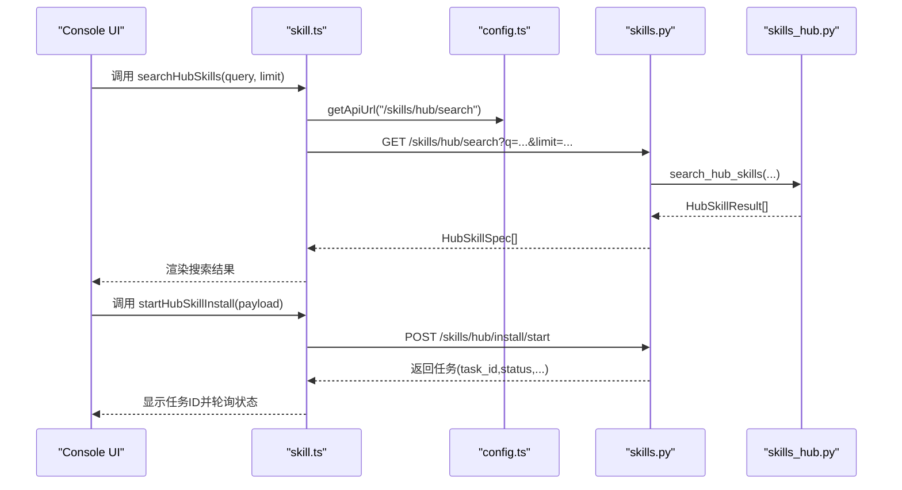
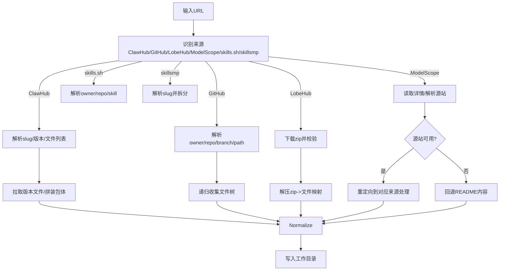
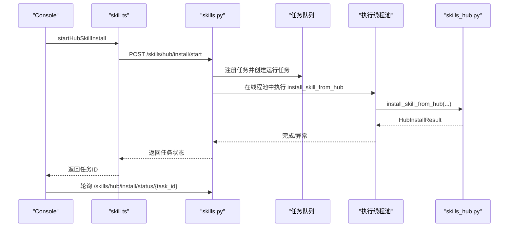
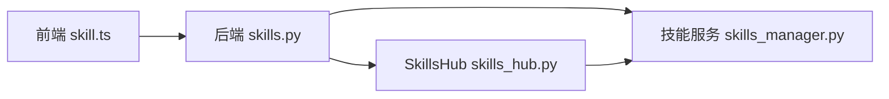

# 技能中心集成

<cite>
**本文引用的文件**
- [skills_hub.py](file://src/copaw/agents/skills_hub.py)
- [skills.py](file://src/copaw/app/routers/skills.py)
- [skill.ts](file://console/src/api/modules/skill.ts)
- [config.ts](file://console/src/api/config.ts)
- [request.ts](file://console/src/api/request.ts)
- [useSkills.ts](file://console/src/pages/Agent/Skills/useSkills.ts)
- [index.tsx](file://console/src/pages/Agent/Skills/index.tsx)
- [skills_manager.py](file://src/copaw/agents/skills_manager.py)
- [retry_chat_model.py](file://src/copaw/providers/retry_chat_model.py)
</cite>

## 目录
1. [简介](#简介)
2. [项目结构](#项目结构)
3. [核心组件](#核心组件)
4. [架构总览](#架构总览)
5. [详细组件分析](#详细组件分析)
6. [依赖关系分析](#依赖关系分析)
7. [性能考量](#性能考量)
8. [故障排除指南](#故障排除指南)
9. [结论](#结论)
10. [附录](#附录)

## 简介
本文件面向CoPaw技能中心集成模块，系统化阐述SkillsHub类的核心能力与实现细节，覆盖以下主题：
- 技能搜索机制：基于Hub的搜索接口与结果归一化
- 远程技能获取流程：多来源URL解析与内容抓取
- HTTP请求处理与重试策略：指数回退、超时控制、取消检查
- 技能中心API接口：URL构建、请求头设置、认证机制（GitHub Token支持）、响应与错误处理
- 使用示例：通过SkillsHub进行搜索、详情获取、文件下载等
- 环境变量配置：COPAW_SKILLS_HUB_BASE_URL、HTTP超时与重试参数
- 故障排除与性能优化建议

## 项目结构
技能中心集成涉及前后端协作：
- 前端（Console）：提供技能导入界面、发起Hub安装任务、轮询任务状态
- 后端（FastAPI路由）：封装SkillsHub调用、任务调度与状态管理、安全扫描
- 核心库（SkillsHub）：统一的HTTP访问、多来源解析、包体归一化与写入

图示来源
- [skills.py:196-211](file://src/copaw/app/routers/skills.py#L196-L211)
- [skill.ts:48-98](file://console/src/api/modules/skill.ts#L48-L98)
- [config.ts:11-16](file://console/src/api/config.ts#L11-L16)
- [request.ts:46-64](file://console/src/api/request.ts#L46-L64)
- [skills_hub.py:1513-1536](file://src/copaw/agents/skills_hub.py#L1513-L1536)

章节来源
- [skills.py:196-211](file://src/copaw/app/routers/skills.py#L196-L211)
- [skill.ts:48-98](file://console/src/api/modules/skill.ts#L48-L98)
- [config.ts:11-16](file://console/src/api/config.ts#L11-L16)
- [request.ts:46-64](file://console/src/api/request.ts#L46-L64)
- [skills_hub.py:1513-1536](file://src/copaw/agents/skills_hub.py#L1513-L1536)

## 核心组件
- SkillsHub（Python）：统一的Hub访问器，负责HTTP请求、重试、取消、认证、URL解析与包体归一化
- FastAPI路由（skills.py）：对外暴露技能列表、Hub搜索、Hub安装、上传ZIP等接口，并管理异步安装任务
- 前端API模块（skill.ts）：封装Console侧的技能相关请求，含Hub搜索与安装
- 技能服务（skills_manager.py）：将SkillsHub产出的包体落盘到工作目录，生成技能目录结构

章节来源
- [skills_hub.py:1513-1536](file://src/copaw/agents/skills_hub.py#L1513-L1536)
- [skills.py:196-211](file://src/copaw/app/routers/skills.py#L196-L211)
- [skill.ts:48-98](file://console/src/api/modules/skill.ts#L48-L98)
- [skills_manager.py:500-531](file://src/copaw/agents/skills_manager.py#L500-L531)

## 架构总览
下图展示从Console发起Hub安装到最终写入工作目录的端到端流程。

图示来源
- [useSkills.ts:265-285](file://console/src/pages/Agent/Skills/useSkills.ts#L265-L285)
- [skill.ts:73-98](file://console/src/api/modules/skill.ts#L73-L98)
- [skills.py:391-421](file://src/copaw/app/routers/skills.py#L391-L421)
- [skills_hub.py:1567-1619](file://src/copaw/agents/skills_hub.py#L1567-L1619)
- [skills_manager.py:500-531](file://src/copaw/agents/skills_manager.py#L500-L531)

## 详细组件分析

### SkillsHub类与HTTP请求处理
- 环境变量与默认值
  - 基础URL：COPAW_SKILLS_HUB_BASE_URL，默认值为“https://clawhub.ai”
  - 搜索路径：COPAW_SKILLS_HUB_SEARCH_PATH，默认“/api/v1/search”
  - 版本详情路径：COPAW_SKILLS_HUB_VERSION_PATH，默认“/api/v1/skills/{slug}/versions/{version}”
  - 详情路径：COPAW_SKILLS_HUB_DETAIL_PATH，默认“/api/v1/skills/{slug}”
  - 文件路径：COPAW_SKILLS_HUB_FILE_PATH，默认“/api/v1/skills/{slug}/file”
  - 超时：COPAW_SKILLS_HUB_HTTP_TIMEOUT，默认15秒
  - 重试次数：COPAW_SKILLS_HUB_HTTP_RETRIES，默认3次
  - 回退基数：COPAW_SKILLS_HUB_HTTP_BACKOFF_BASE，默认0.8
  - 回退上限：COPAW_SKILLS_HUB_HTTP_BACKOFF_CAP，默认6.0
- 请求构造
  - Accept头按场景选择JSON或文本/二进制
  - User-Agent固定为“copaw-skills-hub/1.0”
  - 当目标为api.github.com时，自动注入Authorization: Bearer {GITHUB_TOKEN|GH_TOKEN}
- 取消机制
  - 通过contextvar传递取消检查函数，在关键步骤前检查是否被取消
- 重试策略
  - 对408/409/425/429/500/502/503/504等状态码进行指数回退重试
  - 超时与网络错误同样支持重试
  - 429与5xx在耗尽重试后给出用户可理解的提示
  - GitHub速率限制检测：当返回403且包含速率限制提示时，抛出明确异常
- 数据抓取与归一化
  - 支持ClawHub、GitHub、LobeHub、ModelScope、skills.sh、skillsmp等多来源
  - 将不同来源的响应归一为{name, files, ...}结构
  - 自动拉取版本文件并拼装SKILL.md与脚本/引用文件树
- 安装执行
  - 将归一化后的包体写入工作目录，生成技能目录
  - 可选启用技能并返回安装结果

图示来源
- [skills_hub.py:226-335](file://src/copaw/agents/skills_hub.py#L226-L335)
- [skills_hub.py:488-570](file://src/copaw/agents/skills_hub.py#L488-L570)
- [skills_hub.py:1567-1619](file://src/copaw/agents/skills_hub.py#L1567-L1619)

章节来源
- [skills_hub.py:78-180](file://src/copaw/agents/skills_hub.py#L78-L180)
- [skills_hub.py:226-335](file://src/copaw/agents/skills_hub.py#L226-L335)
- [skills_hub.py:488-570](file://src/copaw/agents/skills_hub.py#L488-L570)
- [skills_hub.py:1567-1619](file://src/copaw/agents/skills_hub.py#L1567-L1619)

### 技能中心API接口与Console集成
- URL构建
  - 前端通过getApiUrl拼接“{VITE_API_BASE_URL}/api”作为基础，再附加具体路径
- 认证机制
  - 通过buildAuthHeaders注入认证头；GitHub Token由SkillsHub内部自动注入
- 搜索与安装
  - 搜索：GET /skills/hub/search?q=…&limit=…
  - 安装：POST /skills/hub/install 或 /skills/hub/install/start（异步）
- 任务状态轮询
  - Console侧以固定轮询间隔查询 /skills/hub/install/status/{task_id}

图示来源
- [skill.ts:48-98](file://console/src/api/modules/skill.ts#L48-L98)
- [config.ts:11-16](file://console/src/api/config.ts#L11-L16)
- [skills.py:196-211](file://src/copaw/app/routers/skills.py#L196-L211)
- [skills.py:391-421](file://src/copaw/app/routers/skills.py#L391-L421)
- [skills_hub.py:1513-1536](file://src/copaw/agents/skills_hub.py#L1513-L1536)

章节来源
- [skill.ts:48-98](file://console/src/api/modules/skill.ts#L48-L98)
- [config.ts:11-16](file://console/src/api/config.ts#L11-L16)
- [skills.py:196-211](file://src/copaw/app/routers/skills.py#L196-L211)
- [skills.py:391-421](file://src/copaw/app/routers/skills.py#L391-L421)
- [skills_hub.py:1513-1536](file://src/copaw/agents/skills_hub.py#L1513-L1536)

### 多来源URL解析与内容抓取
- 支持来源
  - ClawHub：通过slug解析详情与版本文件，自动拉取文件并归一化
  - GitHub：解析仓库/分支/路径，递归收集文件树，读取SKILL.md与相关文件
  - LobeHub：下载zip包，校验大小与条目数，解压并仅保留文本文件
  - ModelScope：解析技能详情，优先走源站（GitHub/ClawHub），否则回退README内容
  - skills.sh：解析owner/repo/skill，定位SKILL.md所在目录
  - skillsmp：解析slug并拆分owner/repo/skill，尝试存在性验证
- 归一化与写入
  - 统一输出{name, files, ...}结构
  - 通过SkillService写入工作目录，生成references/scripts树

图示来源
- [skills_hub.py:1479-1510](file://src/copaw/agents/skills_hub.py#L1479-L1510)
- [skills_hub.py:1057-1155](file://src/copaw/agents/skills_hub.py#L1057-L1155)
- [skills_hub.py:1262-1292](file://src/copaw/agents/skills_hub.py#L1262-L1292)
- [skills_hub.py:1450-1476](file://src/copaw/agents/skills_hub.py#L1450-L1476)
- [skills_hub.py:1370-1447](file://src/copaw/agents/skills_hub.py#L1370-L1447)

章节来源
- [skills_hub.py:1479-1510](file://src/copaw/agents/skills_hub.py#L1479-L1510)
- [skills_hub.py:1057-1155](file://src/copaw/agents/skills_hub.py#L1057-L1155)
- [skills_hub.py:1262-1292](file://src/copaw/agents/skills_hub.py#L1262-L1292)
- [skills_hub.py:1450-1476](file://src/copaw/agents/skills_hub.py#L1450-L1476)
- [skills_hub.py:1370-1447](file://src/copaw/agents/skills_hub.py#L1370-L1447)

### 技能搜索机制
- 接口：GET /skills/hub/search?q=…&limit=…
- 行为：调用search_hub_skills，对不同来源的响应进行归一化，提取slug/name/description/version/source_url
- 结果：返回HubSkillSpec列表供前端展示

章节来源
- [skills.py:196-211](file://src/copaw/app/routers/skills.py#L196-L211)
- [skills_hub.py:1513-1536](file://src/copaw/agents/skills_hub.py#L1513-L1536)
- [skill.ts:48-51](file://console/src/api/modules/skill.ts#L48-L51)

### 远程技能获取与安装流程
- 同步安装：POST /skills/hub/install，直接阻塞至完成
- 异步安装：POST /skills/hub/install/start，返回任务ID；轮询 /skills/hub/install/status/{task_id}
- 安全扫描：安装前对包体进行安全扫描，失败时返回结构化错误
- 取消：支持通过 /skills/hub/install/cancel/{task_id}取消任务

图示来源
- [skills.py:391-421](file://src/copaw/app/routers/skills.py#L391-L421)
- [skills.py:424-429](file://src/copaw/app/routers/skills.py#L424-L429)
- [skills.py:432-452](file://src/copaw/app/routers/skills.py#L432-L452)
- [skills.py:264-342](file://src/copaw/app/routers/skills.py#L264-L342)
- [skills_hub.py:1567-1619](file://src/copaw/agents/skills_hub.py#L1567-L1619)

章节来源
- [skills.py:344-388](file://src/copaw/app/routers/skills.py#L344-L388)
- [skills.py:391-452](file://src/copaw/app/routers/skills.py#L391-L452)
- [skills.py:264-342](file://src/copaw/app/routers/skills.py#L264-L342)
- [skills_hub.py:1567-1619](file://src/copaw/agents/skills_hub.py#L1567-L1619)

### 环境变量与配置要点
- COPAW_SKILLS_HUB_BASE_URL：Hub基础URL，默认“https://clawhub.ai”
- COPAW_SKILLS_HUB_SEARCH_PATH：搜索接口路径，默认“/api/v1/search”
- COPAW_SKILLS_HUB_VERSION_PATH：版本详情路径，默认“/api/v1/skills/{slug}/versions/{version}”
- COPAW_SKILLS_HUB_DETAIL_PATH：技能详情路径，默认“/api/v1/skills/{slug}”
- COPAW_SKILLS_HUB_FILE_PATH：文件下载路径，默认“/api/v1/skills/{slug}/file”
- COPAW_SKILLS_HUB_HTTP_TIMEOUT：HTTP超时秒数，默认15
- COPAW_SKILLS_HUB_HTTP_RETRIES：最大重试次数，默认3
- COPAW_SKILLS_HUB_HTTP_BACKOFF_BASE：指数回退基数，默认0.8
- COPAW_SKILLS_HUB_HTTP_BACKOFF_CAP：回退上限，默认6.0
- GitHub Token：GITHUB_TOKEN 或 GH_TOKEN，用于api.github.com的认证

章节来源
- [skills_hub.py:131-160](file://src/copaw/agents/skills_hub.py#L131-L160)
- [skills_hub.py:70-99](file://src/copaw/agents/skills_hub.py#L70-L99)
- [skills_hub.py:167-180](file://src/copaw/agents/skills_hub.py#L167-L180)

### 具体使用示例（路径指引）
- 技能搜索
  - 前端：调用 [skillApi.searchHubSkills:48-51](file://console/src/api/modules/skill.ts#L48-L51)
  - 后端：路由 [search_hub:196-211](file://src/copaw/app/routers/skills.py#L196-L211)
  - SkillsHub：函数 [search_hub_skills:1513-1536](file://src/copaw/agents/skills_hub.py#L1513-L1536)
- 获取详情与文件
  - SkillsHub：函数 [_hydrate_clawhub_payload:489-570](file://src/copaw/agents/skills_hub.py#L489-L570)
- 安装技能（同步）
  - 前端：调用 [skillApi.installHubSkill:53-71](file://console/src/api/modules/skill.ts#L53-L71)
  - 后端：路由 [install_from_hub:344-388](file://src/copaw/app/routers/skills.py#L344-L388)
  - SkillsHub：函数 [install_skill_from_hub:1567-1619](file://src/copaw/agents/skills_hub.py#L1567-L1619)
- 安装技能（异步）
  - 前端：调用 [skillApi.startHubSkillInstall:73-98](file://console/src/api/modules/skill.ts#L73-L98)
  - 后端：路由 [start_install_from_hub:391-421](file://src/copaw/app/routers/skills.py#L391-L421)
  - 轮询：[get_hub_install_status:424-429](file://src/copaw/app/routers/skills.py#L424-L429)
  - 取消：[cancel_hub_install:432-452](file://src/copaw/app/routers/skills.py#L432-L452)

章节来源
- [skill.ts:48-98](file://console/src/api/modules/skill.ts#L48-L98)
- [skills.py:196-211](file://src/copaw/app/routers/skills.py#L196-L211)
- [skills.py:344-388](file://src/copaw/app/routers/skills.py#L344-L388)
- [skills.py:391-452](file://src/copaw/app/routers/skills.py#L391-L452)
- [skills_hub.py:1513-1536](file://src/copaw/agents/skills_hub.py#L1513-L1536)
- [skills_hub.py:1567-1619](file://src/copaw/agents/skills_hub.py#L1567-L1619)

## 依赖关系分析
- 前端依赖后端路由，后端路由依赖SkillsHub与技能服务
- SkillsHub内部依赖urllib、contextvars、frontmatter、yaml等
- 安全扫描在启用时会拦截安装流程并返回结构化错误

图示来源
- [skill.ts:48-98](file://console/src/api/modules/skill.ts#L48-L98)
- [skills.py:196-211](file://src/copaw/app/routers/skills.py#L196-L211)
- [skills_hub.py:1513-1536](file://src/copaw/agents/skills_hub.py#L1513-L1536)
- [skills_manager.py:500-531](file://src/copaw/agents/skills_manager.py#L500-L531)

章节来源
- [skills.py:196-211](file://src/copaw/app/routers/skills.py#L196-L211)
- [skills_hub.py:1513-1536](file://src/copaw/agents/skills_hub.py#L1513-L1536)
- [skills_manager.py:500-531](file://src/copaw/agents/skills_manager.py#L500-L531)

## 性能考量
- 指数回退与超时
  - 合理设置COPAW_SKILLS_HUB_HTTP_BACKOFF_BASE与COPAW_SKILLS_HUB_HTTP_BACKOFF_CAP，避免过长等待
  - 适当提高COPAW_SKILLS_HUB_HTTP_TIMEOUT以应对大文件下载
- GitHub速率限制
  - 配置GITHUB_TOKEN或GH_TOKEN，显著降低403/429概率
- 并发与取消
  - 异步安装任务支持取消，避免长时间占用资源
- 包体大小与条目数
  - LobeHub包体默认限制为5MB与256个条目，过大或过多会直接拒绝

章节来源
- [skills_hub.py:65-67](file://src/copaw/agents/skills_hub.py#L65-L67)
- [skills_hub.py:131-160](file://src/copaw/agents/skills_hub.py#L131-L160)
- [skills_hub.py:226-335](file://src/copaw/agents/skills_hub.py#L226-L335)
- [skills_hub.py:1311-1367](file://src/copaw/agents/skills_hub.py#L1311-L1367)

## 故障排除指南
- 429/5xx错误
  - 现象：多次重试后仍失败
  - 处理：检查COPAW_SKILLS_HUB_HTTP_RETRIES/COPAW_SKILLS_HUB_HTTP_BACKOFF_BASE/COPAW_SKILLS_HUB_HTTP_BACKOFF_CAP；必要时增加超时
- GitHub速率限制
  - 现象：返回403且包含速率限制提示
  - 处理：设置GITHUB_TOKEN或GH_TOKEN
- 下载超大包体
  - 现象：提示包体过大或条目过多
  - 处理：确认来源是否为LobeHub，调整包体或改用其他来源
- 安装被取消
  - 现象：任务状态变为cancelled
  - 处理：检查取消事件触发原因，重新发起安装
- 安全扫描失败
  - 现象：返回422并包含扫描发现
  - 处理：根据扫描报告修复问题或加入白名单

章节来源
- [skills_hub.py:251-301](file://src/copaw/agents/skills_hub.py#L251-L301)
- [skills_hub.py:1311-1367](file://src/copaw/agents/skills_hub.py#L1311-L1367)
- [skills.py:28-50](file://src/copaw/app/routers/skills.py#L28-L50)
- [skills.py:312-339](file://src/copaw/app/routers/skills.py#L312-L339)

## 结论
SkillsHub为CoPaw提供了统一、健壮的技能中心接入能力，覆盖多来源解析、HTTP重试与取消、安全扫描与落盘写入。通过合理的环境变量配置与异步任务机制，可在保证稳定性的同时提升用户体验。建议在生产环境中配置GitHub Token与合适的超时/重试参数，并结合安全扫描策略确保导入技能的安全性。

## 附录
- 前端页面入口与示例URL
  - 页面入口：[Agent/Skills/index.tsx:158-193](file://console/src/pages/Agent/Skills/index.tsx#L158-L193)
  - 示例URL列表：[Agent/Skills/index.tsx:232-246](file://console/src/pages/Agent/Skills/index.tsx#L232-L246)
- 任务轮询与取消示例
  - 轮询与取消：[Agent/Skills/useSkills.ts:265-285](file://console/src/pages/Agent/Skills/useSkills.ts#L265-L285)