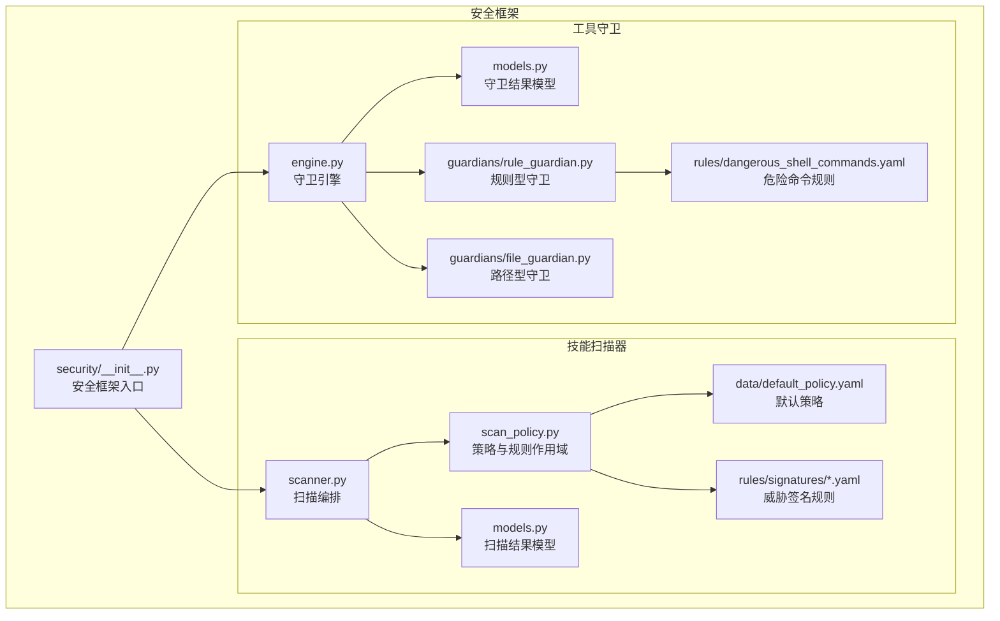
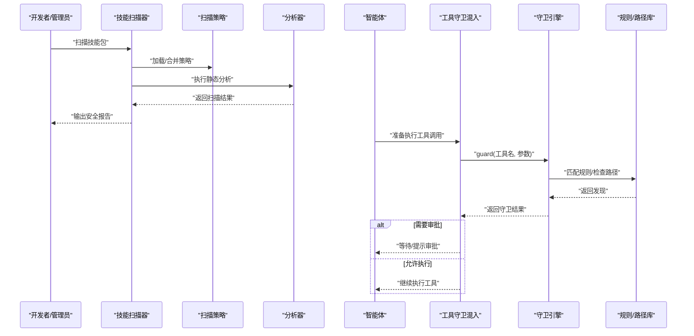
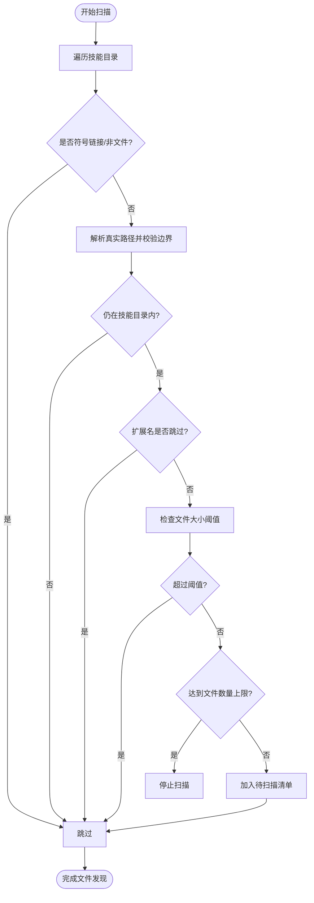
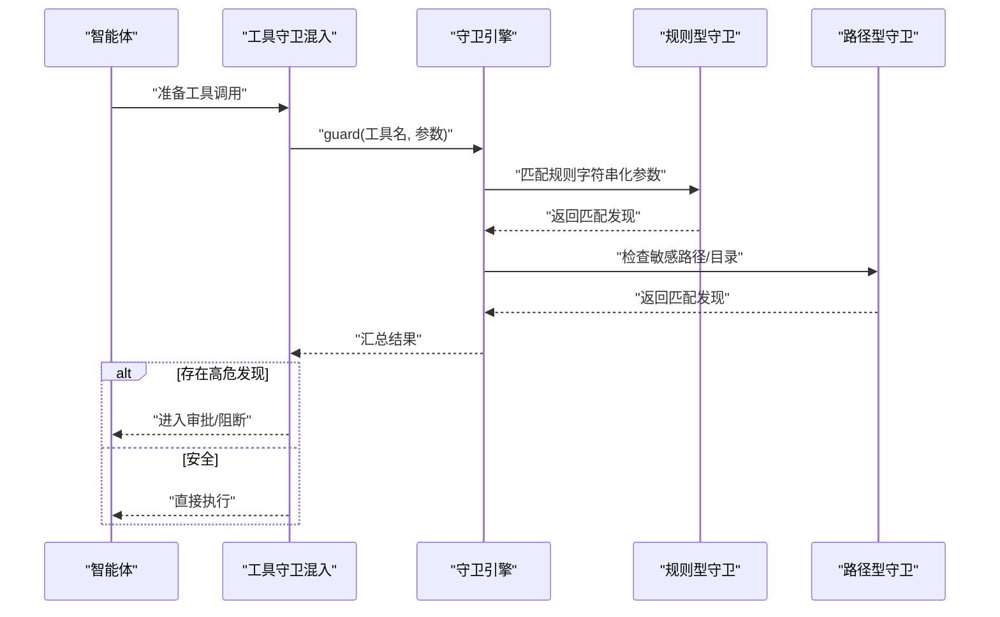
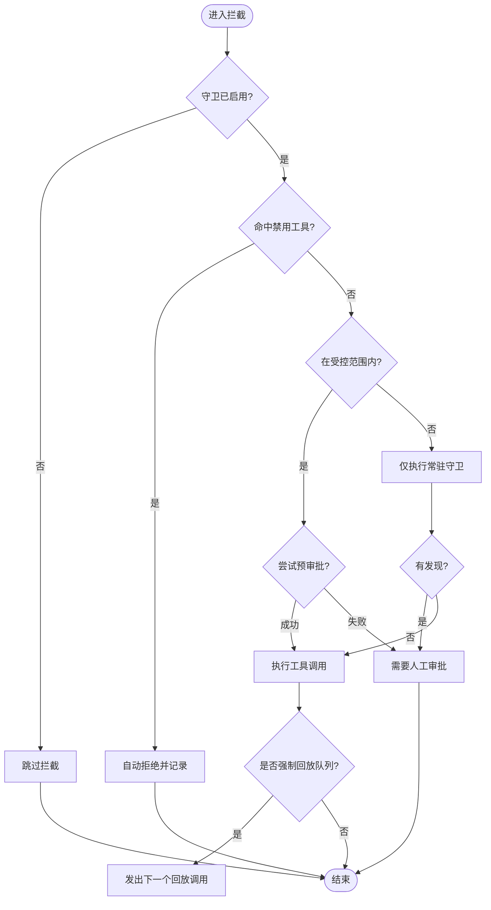
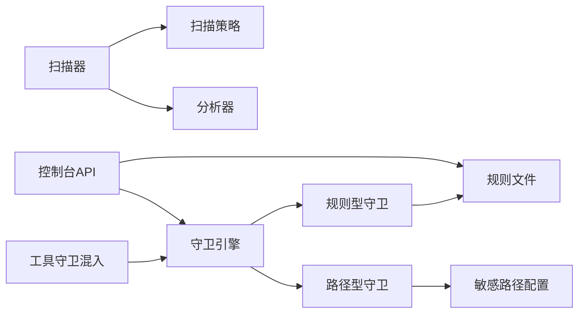

# 技能安全隔离

<cite>
**本文引用的文件**
- [src/copaw/security/__init__.py](file://src/copaw/security/__init__.py)
- [src/copaw/security/skill_scanner/scanner.py](file://src/copaw/security/skill_scanner/scanner.py)
- [src/copaw/security/skill_scanner/models.py](file://src/copaw/security/skill_scanner/models.py)
- [src/copaw/security/skill_scanner/scan_policy.py](file://src/copaw/security/skill_scanner/scan_policy.py)
- [src/copaw/security/skill_scanner/data/default_policy.yaml](file://src/copaw/security/skill_scanner/data/default_policy.yaml)
- [src/copaw/security/skill_scanner/rules/signatures/command_injection.yaml](file://src/copaw/security/skill_scanner/rules/signatures/command_injection.yaml)
- [src/copaw/security/tool_guard/engine.py](file://src/copaw/security/tool_guard/engine.py)
- [src/copaw/security/tool_guard/models.py](file://src/copaw/security/tool_guard/models.py)
- [src/copaw/security/tool_guard/guardians/rule_guardian.py](file://src/copaw/security/tool_guard/guardians/rule_guardian.py)
- [src/copaw/security/tool_guard/guardians/file_guardian.py](file://src/copaw/security/tool_guard/guardians/file_guardian.py)
- [src/copaw/security/tool_guard/rules/dangerous_shell_commands.yaml](file://src/copaw/security/tool_guard/rules/dangerous_shell_commands.yaml)
- [src/copaw/agents/tool_guard_mixin.py](file://src/copaw/agents/tool_guard_mixin.py)
- [src/copaw/app/routers/config.py](file://src/copaw/app/routers/config.py)
- [console/src/pages/Settings/Security/useToolGuard.ts](file://console/src/pages/Settings/Security/useToolGuard.ts)
- [website/public/docs/security.en.md](file://website/public/docs/security.en.md)
</cite>

## 目录
1. [引言](#引言)
2. [项目结构](#项目结构)
3. [核心组件](#核心组件)
4. [架构总览](#架构总览)
5. [详细组件分析](#详细组件分析)
6. [依赖分析](#依赖分析)
7. [性能考虑](#性能考虑)
8. [故障排查指南](#故障排查指南)
9. [结论](#结论)
10. [附录](#附录)

## 引言
本文件面向CoPaw的“技能安全隔离”能力，系统化阐述技能沙箱隔离与工具守卫两大安全子系统的设计原理、实现机制与使用方法。内容覆盖：
- 技能扫描器：静态分析、规则引擎、策略配置与白名单机制
- 工具守卫：参数级规则匹配、路径级敏感文件保护、运行时拦截与审批流
- 安全配置项、日志与告警、威胁响应流程与最佳实践

目标是帮助开发者与运维人员理解并正确配置安全能力，以抵御恶意代码、越权操作与资源滥用等风险。

## 项目结构
安全相关代码主要位于src/copaw/security目录下，分为两个子系统：
- 技能扫描器（skill_scanner）：对技能包进行静态扫描，发现潜在威胁
- 工具守卫（tool_guard）：在工具调用前进行参数扫描与路径检查，必要时进入审批流程

图示来源
- [src/copaw/security/__init__.py:1-17](file://src/copaw/security/__init__.py#L1-L17)
- [src/copaw/security/skill_scanner/scanner.py:76-319](file://src/copaw/security/skill_scanner/scanner.py#L76-L319)
- [src/copaw/security/skill_scanner/scan_policy.py:156-476](file://src/copaw/security/skill_scanner/scan_policy.py#L156-L476)
- [src/copaw/security/skill_scanner/models.py:168-235](file://src/copaw/security/skill_scanner/models.py#L168-L235)
- [src/copaw/security/skill_scanner/data/default_policy.yaml:1-245](file://src/copaw/security/skill_scanner/data/default_policy.yaml#L1-L245)
- [src/copaw/security/skill_scanner/rules/signatures/command_injection.yaml:1-195](file://src/copaw/security/skill_scanner/rules/signatures/command_injection.yaml#L1-L195)
- [src/copaw/security/tool_guard/engine.py:53-238](file://src/copaw/security/tool_guard/engine.py#L53-L238)
- [src/copaw/security/tool_guard/models.py:103-185](file://src/copaw/security/tool_guard/models.py#L103-L185)
- [src/copaw/security/tool_guard/guardians/rule_guardian.py:280-383](file://src/copaw/security/tool_guard/guardians/rule_guardian.py#L280-L383)
- [src/copaw/security/tool_guard/guardians/file_guardian.py:161-342](file://src/copaw/security/tool_guard/guardians/file_guardian.py#L161-L342)
- [src/copaw/security/tool_guard/rules/dangerous_shell_commands.yaml:1-120](file://src/copaw/security/tool_guard/rules/dangerous_shell_commands.yaml#L1-L120)

章节来源
- [src/copaw/security/__init__.py:1-17](file://src/copaw/security/__init__.py#L1-L17)

## 核心组件
- 技能扫描器（SkillScanner）
  - 负责遍历技能目录、加载策略、注册分析器、聚合扫描结果
  - 支持文件大小与数量上限、跳过扩展名集合、重复发现去重
- 工具守卫引擎（ToolGuardEngine）
  - 运行时拦截工具调用，按配置启用/禁用，按范围选择守卫
  - 默认包含规则型守卫与路径型守卫，支持动态重载规则与受控工具集
- 工具守卫混入（ToolGuardMixin）
  - 在智能体执行前注入拦截逻辑，支持自动拒绝、预审批与人工审批
  - 提供强制回放、等待审批提示、清理被拒消息等机制

章节来源
- [src/copaw/security/skill_scanner/scanner.py:76-319](file://src/copaw/security/skill_scanner/scanner.py#L76-L319)
- [src/copaw/security/tool_guard/engine.py:53-238](file://src/copaw/security/tool_guard/engine.py#L53-L238)
- [src/copaw/agents/tool_guard_mixin.py:45-782](file://src/copaw/agents/tool_guard_mixin.py#L45-L782)

## 架构总览
下图展示从技能安装/激活到工具调用的两条安全链路：

图示来源
- [src/copaw/security/skill_scanner/scanner.py:148-242](file://src/copaw/security/skill_scanner/scanner.py#L148-L242)
- [src/copaw/security/tool_guard/engine.py:169-226](file://src/copaw/security/tool_guard/engine.py#L169-L226)
- [src/copaw/agents/tool_guard_mixin.py:302-382](file://src/copaw/agents/tool_guard_mixin.py#L302-L382)

## 详细组件分析

### 技能扫描器：静态分析与策略驱动
- 设计要点
  - 扫描范围：递归遍历技能目录，跳过符号链接与非文件；通过策略控制扩展名、大小与数量上限
  - 分析器注册：默认加载模式分析器，支持运行时扩展
  - 结果聚合：统一为扫描结果对象，包含最高严重级别、发现统计与失败分析器列表
- 关键流程（文件发现与过滤）

图示来源
- [src/copaw/security/skill_scanner/scanner.py:248-299](file://src/copaw/security/skill_scanner/scanner.py#L248-L299)

- 策略与白名单
  - 文件分类：静止类、结构化数据、归档、代码扩展名
  - 规则作用域：仅在特定文件类型/路径生效、文档区跳过、重复发现去重
  - 凭证抑制：测试凭证与占位符标记自动抑制
  - 数值阈值：最大文件数、单文件大小、名称/描述长度等

章节来源
- [src/copaw/security/skill_scanner/scan_policy.py:156-476](file://src/copaw/security/skill_scanner/scan_policy.py#L156-L476)
- [src/copaw/security/skill_scanner/data/default_policy.yaml:159-244](file://src/copaw/security/skill_scanner/data/default_policy.yaml#L159-L244)
- [src/copaw/security/skill_scanner/models.py:168-235](file://src/copaw/security/skill_scanner/models.py#L168-L235)

### 工具守卫引擎：运行时拦截与审批
- 设计要点
  - 启用控制：环境变量优先于配置文件，支持全局开关
  - 受控工具集：可选“全部受控”、“部分受控”、“完全不受控”
  - 守卫器组合：规则型（正则签名）+ 路径型（敏感文件/目录）默认常驻
  - 动态重载：规则与受控/禁用工具集可热更新
- 关键流程（参数扫描与发现）

图示来源
- [src/copaw/security/tool_guard/engine.py:169-226](file://src/copaw/security/tool_guard/engine.py#L169-L226)
- [src/copaw/security/tool_guard/guardians/rule_guardian.py:329-382](file://src/copaw/security/tool_guard/guardians/rule_guardian.py#L329-L382)
- [src/copaw/security/tool_guard/guardians/file_guardian.py:290-341](file://src/copaw/security/tool_guard/guardians/file_guardian.py#L290-L341)

- 规则型守卫（RuleBasedToolGuardian）
  - 从YAML加载规则，支持工具/参数维度筛选
  - 对每个参数值进行字符串化后正则匹配，支持排除模式
  - 输出带上下文片段的发现，便于审计与修复建议
- 路径型守卫（FilePathToolGuardian）
  - 常驻执行，扫描所有工具的字符串参数
  - 针对shell命令提取重定向与路径令牌，识别敏感路径命中
  - 支持配置敏感文件/目录白名单与默认密钥目录保护

章节来源
- [src/copaw/security/tool_guard/guardians/rule_guardian.py:280-383](file://src/copaw/security/tool_guard/guardians/rule_guardian.py#L280-L383)
- [src/copaw/security/tool_guard/guardians/file_guardian.py:161-342](file://src/copaw/security/tool_guard/guardians/file_guardian.py#L161-L342)
- [src/copaw/security/tool_guard/rules/dangerous_shell_commands.yaml:1-120](file://src/copaw/security/tool_guard/rules/dangerous_shell_commands.yaml#L1-L120)

### 工具守卫混入：拦截、审批与回放
- 设计要点
  - 在智能体的“推理/行动”阶段注入拦截逻辑，串行决策、并行执行
  - 自动拒绝：命中禁用工具集直接阻断
  - 预审批：会话上下文存在时尝试一次性消耗预审批令牌
  - 审批流：记录待审批队列，支持兄弟工具调用链的强制回放
  - 清理与提示：移除被拒消息，向用户显示触发来源与参数摘要
- 关键流程（拦截决策）

图示来源
- [src/copaw/agents/tool_guard_mixin.py:251-382](file://src/copaw/agents/tool_guard_mixin.py#L251-L382)

章节来源
- [src/copaw/agents/tool_guard_mixin.py:45-782](file://src/copaw/agents/tool_guard_mixin.py#L45-L782)

## 依赖分析
- 组件耦合
  - 扫描器与策略：强耦合（策略决定文件分类、规则作用域、阈值）
  - 守卫引擎与规则：松耦合（规则可热加载，支持自定义）
  - 智能体与守卫：通过混入弱耦合，保持代理职责清晰
- 外部依赖
  - YAML/正则：规则加载与匹配
  - 配置系统：环境变量与JSON配置共同决定行为
  - 控制台API：提供策略与规则的可视化管理

图示来源
- [src/copaw/security/skill_scanner/scan_policy.py:261-304](file://src/copaw/security/skill_scanner/scan_policy.py#L261-L304)
- [src/copaw/security/tool_guard/engine.py:148-154](file://src/copaw/security/tool_guard/engine.py#L148-L154)
- [src/copaw/app/routers/config.py:448-494](file://src/copaw/app/routers/config.py#L448-L494)

章节来源
- [src/copaw/app/routers/config.py:448-494](file://src/copaw/app/routers/config.py#L448-L494)
- [console/src/pages/Settings/Security/useToolGuard.ts:13-47](file://console/src/pages/Settings/Security/useToolGuard.ts#L13-L47)

## 性能考虑
- 扫描器
  - 文件发现阶段采用“边遍历边过滤”，避免加载大文件内容
  - 通过策略阈值限制文件数量与大小，防止扫描器成为性能瓶颈
- 守卫引擎
  - 字符串化参数后进行正则匹配，复杂度与参数长度线性相关
  - 常驻路径型守卫仅在必要时触发，减少对非受控工具的影响
- 建议
  - 合理设置扫描策略阈值，避免误报与漏报
  - 将高危规则拆分，按需启用，降低运行时开销
  - 使用控制台API动态调整规则与受控范围，实现按需治理

## 故障排查指南
- 扫描器未发现任何文件
  - 检查策略中的跳过扩展名与阈值设置
  - 确认技能目录是否存在符号链接与跨目录引用
- 守卫引擎未生效
  - 检查环境变量与配置文件中的开关状态
  - 确认受控工具集是否为空或包含目标工具
- 审批流卡住
  - 检查会话上下文与预审批令牌是否可用
  - 查看内存中标记为“被拒”的消息是否被清理
- 规则不生效
  - 通过控制台API查看内置规则与禁用规则列表
  - 确认自定义规则格式正确且未被禁用

章节来源
- [src/copaw/security/skill_scanner/scanner.py:248-299](file://src/copaw/security/skill_scanner/scanner.py#L248-L299)
- [src/copaw/security/tool_guard/engine.py:35-51](file://src/copaw/security/tool_guard/engine.py#L35-L51)
- [src/copaw/agents/tool_guard_mixin.py:212-246](file://src/copaw/agents/tool_guard_mixin.py#L212-L246)
- [src/copaw/app/routers/config.py:457-481](file://src/copaw/app/routers/config.py#L457-L481)

## 结论
CoPaw通过“技能静态扫描 + 工具运行时守卫”的双层安全机制，实现了对恶意代码、越权操作与资源滥用的有效防护。扫描器负责在技能层面建立安全基线，工具守卫确保每次工具调用都经过参数与路径的实时审查，并在必要时引入人工审批。配合策略化配置与可视化管理，组织可在不同安全等级下灵活部署与演进安全能力。

## 附录

### 安全配置选项与白名单机制
- 扫描策略（策略文件）
  - 文件分类：静止类、结构化数据、归档、代码扩展名
  - 规则作用域：仅在特定文件类型/路径生效、文档区跳过、重复发现去重
  - 凭证抑制：测试凭证与占位符标记自动抑制
  - 数值阈值：最大文件数、单文件大小、名称/描述长度等
- 工具守卫
  - 开关：环境变量优先于配置文件
  - 受控工具集：空表示全部受控，指定列表表示部分受控
  - 禁用工具集：无条件阻断
  - 敏感路径：默认保护密钥目录，可扩展为完整白名单

章节来源
- [src/copaw/security/skill_scanner/data/default_policy.yaml:159-244](file://src/copaw/security/skill_scanner/data/default_policy.yaml#L159-L244)
- [src/copaw/security/skill_scanner/scan_policy.py:156-476](file://src/copaw/security/skill_scanner/scan_policy.py#L156-L476)
- [src/copaw/security/tool_guard/engine.py:35-51](file://src/copaw/security/tool_guard/engine.py#L35-L51)
- [src/copaw/security/tool_guard/guardians/file_guardian.py:64-80](file://src/copaw/security/tool_guard/guardians/file_guardian.py#L64-L80)

### 安全日志与威胁响应
- 日志记录
  - 扫描器：扫描耗时、发现数量、最高严重级别、失败分析器
  - 守卫引擎：守卫耗时、使用/失败守卫器、发现详情
- 告警与处置
  - 审批流：阻断高危工具调用，提示用户输入“/approve”或发送任意消息拒绝
  - 回放机制：在预审批通过后，按兄弟工具调用链顺序回放，保持对话连贯
  - 清理机制：移除被拒消息与后续解释消息，避免历史污染

章节来源
- [src/copaw/security/skill_scanner/models.py:168-235](file://src/copaw/security/skill_scanner/models.py#L168-L235)
- [src/copaw/security/tool_guard/models.py:103-185](file://src/copaw/security/tool_guard/models.py#L103-L185)
- [src/copaw/agents/tool_guard_mixin.py:212-246](file://src/copaw/agents/tool_guard_mixin.py#L212-L246)

### 最佳实践与常见攻击防护
- 技能安装前
  - 使用扫描器评估技能包，关注命令注入、硬编码凭据、隐藏文件定位等高危签名
  - 通过策略文件收紧规则作用域，避免文档区误报
- 工具调用时
  - 启用工具守卫，将高危命令（如rm、mkfs、反向连接）纳入规则
  - 配置敏感路径白名单，仅允许必要的文件访问
- 运维管理
  - 通过控制台API动态调整规则与受控范围，实现灰度发布
  - 定期复核审批记录，优化规则与阈值

章节来源
- [src/copaw/security/skill_scanner/rules/signatures/command_injection.yaml:1-195](file://src/copaw/security/skill_scanner/rules/signatures/command_injection.yaml#L1-L195)
- [src/copaw/security/tool_guard/rules/dangerous_shell_commands.yaml:1-120](file://src/copaw/security/tool_guard/rules/dangerous_shell_commands.yaml#L1-L120)
- [website/public/docs/security.en.md:35-57](file://website/public/docs/security.en.md#L35-L57)