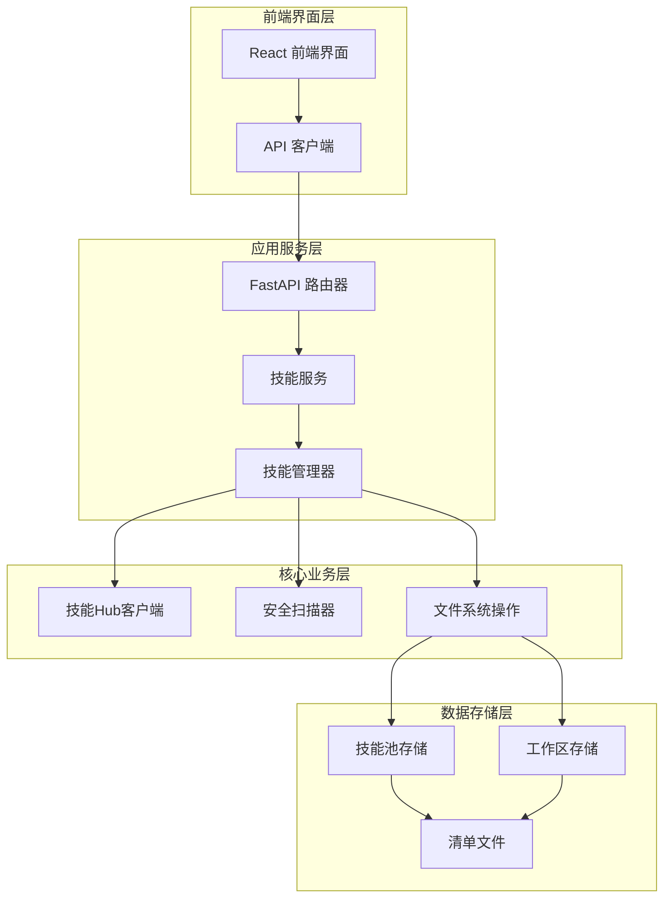
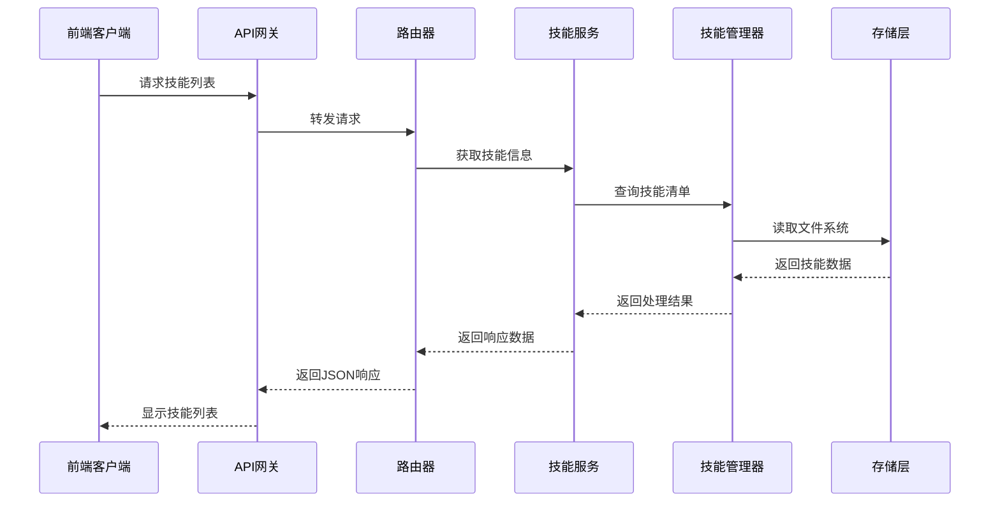
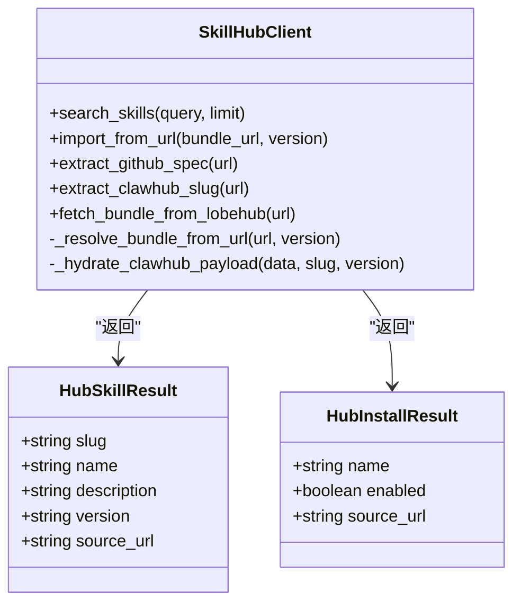
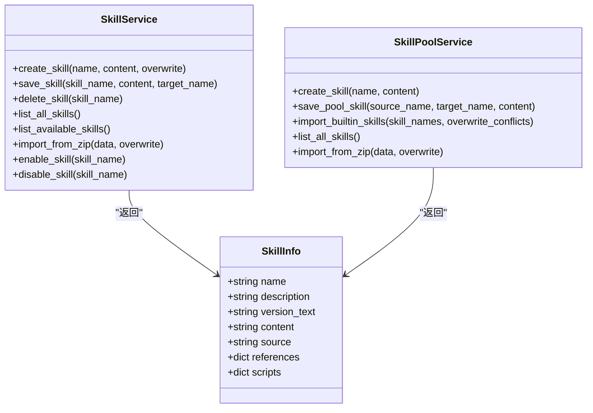
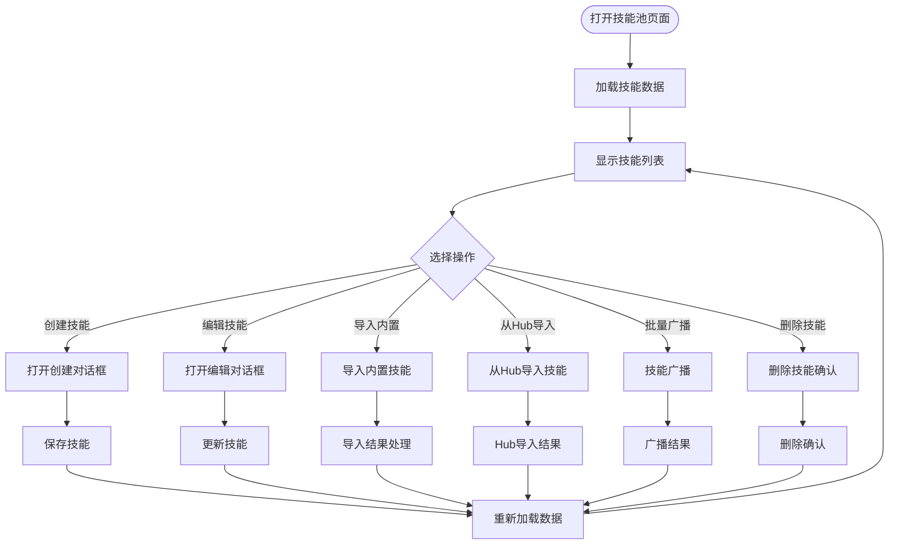
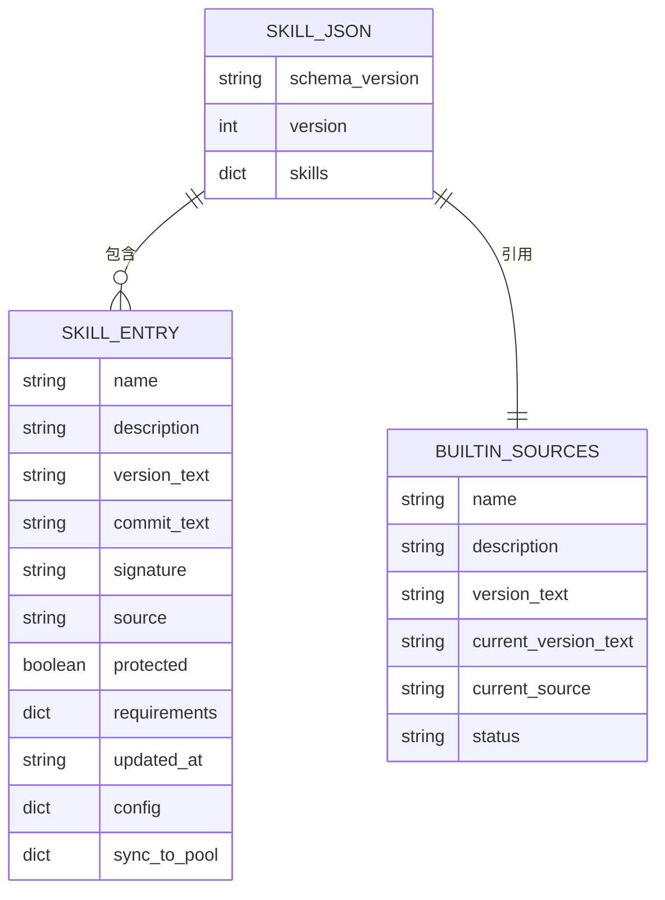
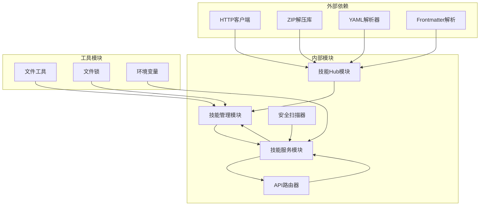

# 技能池系统

<cite>
**本文档引用的文件**
- [skills_hub.py](file://src/copaw/agents/skills_hub.py)
- [skills_manager.py](file://src/copaw/agents/skills_manager.py)
- [skills.py](file://src/copaw/app/routers/skills.py)
- [skill.ts](file://console/src/api/modules/skill.ts)
- [index.tsx](file://console/src/pages/Agent/SkillPool/index.tsx)
- [ImportBuiltinModal.tsx](file://console/src/pages/Agent/SkillPool/components/ImportBuiltinModal.tsx)
- [BroadcastModal.tsx](file://console/src/pages/Agent/SkillPool/components/BroadcastModal.tsx)
- [docx/SKILL.md](file://src/copaw/agents/skills/docx/SKILL.md)
- [pdf/SKILL.md](file://src/copaw/agents/skills/pdf/SKILL.md)
</cite>

## 目录
1. [简介](#简介)
2. [项目结构](#项目结构)
3. [核心组件](#核心组件)
4. [架构概览](#架构概览)
5. [详细组件分析](#详细组件分析)
6. [依赖关系分析](#依赖关系分析)
7. [性能考虑](#性能考虑)
8. [故障排除指南](#故障排除指南)
9. [结论](#结论)

## 简介

技能池系统是 CoPaw AI 框架中的核心功能模块，负责管理、存储和分发可复用的技能（Skills）。该系统提供了统一的技能存储库，支持内置技能的导入、自定义技能的创建、技能的版本管理和跨工作区的技能共享。

技能池系统的主要目标包括：
- 提供标准化的技能格式和元数据管理
- 支持技能的导入、导出和版本控制
- 实现技能在不同工作区间的同步和共享
- 提供安全的技能扫描和验证机制
- 支持多种技能来源（内置、外部Hub、用户上传）

## 项目结构

技能池系统采用分层架构设计，主要包含以下层次：

**图表来源**
- [skills_hub.py:1-100](file://src/copaw/agents/skills_hub.py#L1-L100)
- [skills_manager.py:1-100](file://src/copaw/agents/skills_manager.py#L1-L100)
- [skills.py:1-100](file://src/copaw/app/routers/skills.py#L1-L100)

**章节来源**
- [skills_hub.py:1-200](file://src/copaw/agents/skills_hub.py#L1-L200)
- [skills_manager.py:1-200](file://src/copaw/agents/skills_manager.py#L1-L200)
- [skills.py:1-100](file://src/copaw/app/routers/skills.py#L1-L100)

## 核心组件

### 技能Hub客户端
技能Hub客户端负责与外部技能源进行交互，支持多种技能来源的解析和下载。

**主要功能：**
- 支持 ClawHub、LobeHub、GitHub 等多种技能源
- 自动解析技能URL并提取技能信息
- 下载和解包技能包
- 处理技能版本和依赖关系

**章节来源**
- [skills_hub.py:1500-1672](file://src/copaw/agents/skills_hub.py#L1500-L1672)

### 技能管理器
技能管理器提供技能的生命周期管理，包括创建、更新、删除和同步操作。

**主要功能：**
- 管理技能池和工作区技能
- 处理技能冲突和重命名
- 维护技能清单和元数据
- 支持批量操作和并发处理

**章节来源**
- [skills_manager.py:800-1200](file://src/copaw/agents/skills_manager.py#L800-L1200)

### FastAPI 路由器
路由器提供RESTful API接口，供前端和外部系统调用。

**主要功能：**
- 提供技能列表查询接口
- 支持技能创建、编辑、删除操作
- 实现技能导入和导出功能
- 管理技能配置和权限

**章节来源**
- [skills.py:500-800](file://src/copaw/app/routers/skills.py#L500-L800)

## 架构概览

技能池系统采用典型的三层架构模式，实现了清晰的职责分离：

**图表来源**
- [skills.py:500-600](file://src/copaw/app/routers/skills.py#L500-L600)
- [skill.ts:112-143](file://console/src/api/modules/skill.ts#L112-L143)

系统的核心流程包括：

1. **请求处理**：前端通过API客户端发起技能相关请求
2. **路由分发**：FastAPI路由器根据URL路径分发到相应的处理函数
3. **业务逻辑**：技能服务执行具体的业务操作
4. **数据访问**：技能管理器与文件系统交互
5. **响应返回**：将处理结果以JSON格式返回给客户端

## 详细组件分析

### 技能Hub集成组件

技能Hub组件提供了强大的外部技能源集成能力：

**图表来源**
- [skills_hub.py:1519-1570](file://src/copaw/agents/skills_hub.py#L1519-L1570)

**章节来源**
- [skills_hub.py:1500-1672](file://src/copaw/agents/skills_hub.py#L1500-L1672)

### 技能管理服务组件

技能管理服务提供了完整的技能生命周期管理：

**图表来源**
- [skills_manager.py:1428-1600](file://src/copaw/agents/skills_manager.py#L1428-L1600)

**章节来源**
- [skills_manager.py:1400-1600](file://src/copaw/agents/skills_manager.py#L1400-L1600)

### 前端技能池界面组件

前端界面提供了直观的技能管理操作界面：

**图表来源**
- [index.tsx:75-100](file://console/src/pages/Agent/SkillPool/index.tsx#L75-L100)

**章节来源**
- [index.tsx:1-200](file://console/src/pages/Agent/SkillPool/index.tsx#L1-L200)

### 技能清单和元数据管理

技能系统使用JSON清单文件来管理技能的元数据和状态：

**图表来源**
- [skills_manager.py:299-314](file://src/copaw/agents/skills_manager.py#L299-L314)

**章节来源**
- [skills_manager.py:299-350](file://src/copaw/agents/skills_manager.py#L299-L350)

## 依赖关系分析

技能池系统各组件之间的依赖关系如下：

**图表来源**
- [skills_hub.py:1-50](file://src/copaw/agents/skills_hub.py#L1-L50)
- [skills_manager.py:1-50](file://src/copaw/agents/skills_manager.py#L1-L50)

**章节来源**
- [skills_hub.py:1-100](file://src/copaw/agents/skills_hub.py#L1-L100)
- [skills_manager.py:1-100](file://src/copaw/agents/skills_manager.py#L1-L100)

## 性能考虑

技能池系统在设计时充分考虑了性能优化：

### 并发处理
- 使用线程池执行I/O密集型任务
- 支持异步操作处理长时间运行的任务
- 实现文件锁机制避免并发写入冲突

### 缓存策略
- 内置GitHub API缓存减少重复请求
- 前端API响应缓存提升用户体验
- 技能内容缓存减少重复解析

### 内存管理
- 分块读取大文件避免内存溢出
- 及时清理临时文件和目录
- 限制ZIP文件大小和条目数量

## 故障排除指南

### 常见问题及解决方案

**技能导入失败**
- 检查网络连接和Hub服务可用性
- 验证技能URL格式正确性
- 确认有足够的磁盘空间

**技能冲突处理**
- 系统会自动建议重命名冲突的技能
- 支持强制覆盖现有技能
- 提供冲突详情和解决选项

**权限和安全问题**
- 确保技能通过安全扫描
- 检查文件权限设置
- 验证技能内容的合法性

**章节来源**
- [skills_hub.py:165-186](file://src/copaw/agents/skills_hub.py#L165-L186)
- [skills_manager.py:697-717](file://src/copaw/agents/skills_manager.py#L697-L717)

## 结论

技能池系统为CoPaw AI框架提供了一个强大而灵活的技能管理基础设施。通过模块化的架构设计、完善的错误处理机制和丰富的功能特性，该系统能够有效支持各种规模的AI应用场景。

系统的主要优势包括：
- **标准化的技能格式**：统一的SKILL.md规范确保技能的一致性和可移植性
- **多源集成能力**：支持多种技能来源，便于技能的发现和获取
- **安全可靠的机制**：内置安全扫描和权限控制，保障系统安全
- **高效的性能表现**：优化的并发处理和缓存策略提升用户体验
- **友好的用户界面**：直观的操作界面降低使用门槛

未来的发展方向可能包括：
- 扩展更多的技能源支持
- 增强技能搜索和推荐功能
- 优化性能和扩展性
- 增加更多协作和分享功能